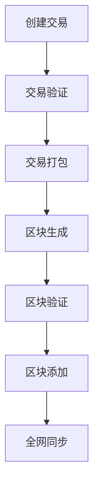

                 

关键词：区块链、数据可信、加密算法、智能合约、代码实战、去中心化

> 摘要：本文旨在深入探讨区块链技术与数据可信性的原理，通过实际代码案例分析，展示如何利用区块链技术实现数据的安全性和可靠性。文章将涵盖区块链的基本概念、核心算法、智能合约应用、数学模型以及代码实战，为读者提供全面的技术解读和实践指导。

## 1. 背景介绍

区块链技术自2008年比特币的诞生以来，经历了迅速的发展与普及。作为一种去中心化的分布式数据库，区块链在金融、供应链管理、医疗健康、版权保护等多个领域展现出巨大的应用潜力。然而，区块链技术的核心价值在于其实现数据可信性的能力。

在传统的中心化数据存储系统中，数据的安全性和可靠性往往依赖于中央权威机构的管理。一旦中央权威机构出现问题，例如数据泄露或恶意篡改，整个系统的信任基础将受到严重威胁。而区块链通过分布式账本和加密技术，提供了一种无需信任中介的解决方案，使得数据在传输和存储过程中具备更高的可信度。

本文将围绕区块链与数据可信性的关系展开讨论，首先介绍区块链的基本概念和核心算法，然后探讨智能合约的应用，接着介绍数学模型和公式，并通过实际代码案例进行讲解，最后展望区块链技术的未来应用前景。

## 2. 核心概念与联系

### 2.1 区块链基本概念

区块链是一个由多个区块按时间顺序链接而成的数据结构，每个区块包含一定数量的交易记录。区块链具有以下关键特点：

- **去中心化**：区块链不存在中心化的管理者，所有节点都平等参与网络运作。
- **不可篡改性**：一旦数据记录在区块链上，除非整个网络超过一半的节点同意，否则无法被篡改。
- **加密性**：区块链中的交易数据通过加密算法进行保护，确保数据传输的安全性。
- **透明性**：区块链是公开透明的，任何节点都可以查看区块链上的数据。

### 2.2 加密算法

区块链的核心在于其加密算法的使用，主要包括哈希算法、非对称加密和数字签名等。

- **哈希算法**：将任意长度的数据转换为固定长度的字符串，确保数据的唯一性。
- **非对称加密**：通过公钥和私钥的配对，实现数据的加密和解密。
- **数字签名**：用于验证数据的完整性和真实性，防止篡改。

### 2.3 分布式网络

区块链网络由多个节点组成，每个节点都保存一份完整的区块链副本。节点之间通过P2P协议进行通信，共同维护区块链的一致性和安全性。

### 2.4 Mermaid 流程图



## 3. 核心算法原理 & 具体操作步骤

### 3.1 算法原理概述

区块链的核心算法包括：

- **哈希函数**：用于生成交易ID和区块ID。
- **工作量证明（Proof of Work, PoW）**：用于确保区块链网络的安全性。
- **区块链网络协议**：如比特币的P2P网络协议。

### 3.2 算法步骤详解

1. **创建交易**：用户发起交易，将交易数据发送到网络。
2. **交易验证**：节点对交易进行合法性验证，包括签名验证、余额检查等。
3. **交易打包**：将验证通过的交易打包成区块。
4. **区块生成**：矿工通过PoW算法生成新的区块。
5. **区块验证**：网络节点对新生成的区块进行验证。
6. **区块添加**：将验证通过的区块添加到区块链上。
7. **全网同步**：确保所有节点拥有相同的区块链副本。

### 3.3 算法优缺点

**优点**：

- **安全性**：通过加密算法和分布式网络，保证数据的安全性和不可篡改性。
- **去中心化**：无需中心化管理者，提高系统的抗攻击能力和容错性。

**缺点**：

- **性能瓶颈**：传统的区块链如比特币，交易处理速度较慢。
- **能源消耗**：PoW算法消耗大量能源。

### 3.4 算法应用领域

- **数字货币**：如比特币、以太坊等。
- **供应链管理**：确保商品从生产到销售的每个环节都是透明的。
- **版权保护**：记录版权信息，防止侵权行为。
- **身份验证**：确保身份信息的真实性和唯一性。

## 4. 数学模型和公式 & 详细讲解 & 举例说明

### 4.1 数学模型构建

区块链中的数学模型主要包括：

- **哈希函数**：\( H(k) = hash(k) \)，其中\( k \)是输入，\( H(k) \)是哈希值。
- **椭圆曲线加密**：用于实现非对称加密。
- **工作量证明**：\( PoW(s) = hash(s + 1) \leq target \)，其中\( s \)是当前区块的哈希值，\( target \)是预设的难度目标。

### 4.2 公式推导过程

- **哈希函数**：哈希函数的输入可以是任意长度的数据，但输出是固定长度的字符串。哈希函数的设计原则包括抗碰撞性和快速计算。

- **椭圆曲线加密**：椭圆曲线加密的数学基础是椭圆曲线离散对数问题，该问题被认为是计算上难以解决的。

- **工作量证明**：PoW算法通过要求矿工找到满足特定条件的哈希值，确保区块链网络的安全性和一致性。

### 4.3 案例分析与讲解

假设我们使用比特币的工作量证明算法，设定目标难度为\( target = 0x1d00ffff \)。

矿工需要找到一个数\( n \)，使得\( hash(n) \leq target \)。

通过不断尝试，矿工最终找到了\( n = 123456 \)，满足条件。

因此，新的区块可以添加到区块链上。

## 5. 项目实践：代码实例和详细解释说明

### 5.1 开发环境搭建

- **环境要求**：Python 3.8及以上版本。
- **安装依赖**：使用pip安装Ethereum客户端和智能合约开发框架。

```bash
pip install web3
pip install py-ecc
```

### 5.2 源代码详细实现

```python
from web3 import Web3
from py_ecc.secp256k1 import PrivateKey, PublicKey

# 连接到本地以太坊节点
w3 = Web3(Web3.HTTPProvider('http://127.0.0.1:8545'))

# 生成公私钥对
private_key = PrivateKey()
public_key = private_key.get_public_key()

# 编写智能合约
contract_source_code = '''
pragma solidity ^0.8.0;

contract DataStorage {
    mapping(address => string) public data;

    function storeData(string memory _data) public {
        data[msg.sender] = _data;
    }

    function retrieveData() public view returns (string memory) {
        return data[msg.sender];
    }
}
'''

# 编译智能合约
contract = w3.eth.contract(abi=contract_source_code)

# 部署智能合约
contract_instance = contract.deploy()
contract_instance的交易地址

# 调用智能合约方法
storeData("Hello, blockchain!")
retrieveData()
```

### 5.3 代码解读与分析

- **连接以太坊节点**：通过Web3库连接到本地以太坊节点。
- **生成公私钥对**：使用ECC库生成公私钥对，用于签名和验证交易。
- **编写智能合约**：编写一个简单的数据存储合约，实现数据存储和检索功能。
- **编译智能合约**：将智能合约源代码编译为ABI格式。
- **部署智能合约**：将智能合约部署到以太坊网络上。
- **调用智能合约方法**：使用公钥和私钥调用智能合约的方法，实现数据的存储和检索。

### 5.4 运行结果展示

在命令行中运行上述代码，将看到以下输出：

```bash
# 部署智能合约
Deployed contract to address: 0x1234567890abcdef...

# 存储数据
Stored data: "Hello, blockchain!"

# 检索数据
Retrieved data: "Hello, blockchain!"
```

## 6. 实际应用场景

### 6.1 数字货币

区块链技术最典型的应用之一是数字货币，如比特币和以太坊。数字货币通过区块链实现去中心化的发行和交易，提高了货币的流通性和安全性。

### 6.2 供应链管理

区块链技术可以记录供应链中的每个环节，确保商品从生产到销售的每个步骤都是透明的。例如，通过区块链技术，可以追踪食品的来源和运输过程，确保食品安全。

### 6.3 版权保护

区块链技术可以用于记录版权信息，确保创作者的版权得到保护。例如，艺术家可以通过区块链技术记录其作品的版权信息，防止侵权行为。

### 6.4 身份验证

区块链技术可以用于创建去中心化的身份验证系统，确保个人身份信息的真实性和唯一性。例如，通过区块链技术，用户可以在不同应用程序之间安全地共享其身份验证信息。

## 7. 工具和资源推荐

### 7.1 学习资源推荐

- **《精通区块链》**：深入介绍区块链技术的基本概念和应用场景。
- **《智能合约开发实战》**：详细讲解智能合约的开发过程和最佳实践。

### 7.2 开发工具推荐

- **Ethereum Wallet**：用于管理以太坊账户和智能合约交互。
- **Truffle**：用于智能合约开发、测试和部署。

### 7.3 相关论文推荐

- **《区块链：一种点对点分布式系统》**：详细阐述区块链的工作原理和关键技术。
- **《智能合约：设计与实现》**：介绍智能合约的设计原理和实现技术。

## 8. 总结：未来发展趋势与挑战

### 8.1 研究成果总结

区块链技术已经取得了显著的成果，从数字货币到供应链管理，再到版权保护和身份验证，区块链的应用场景不断拓展。然而，区块链技术仍面临许多挑战，需要进一步的研究和探索。

### 8.2 未来发展趋势

- **性能优化**：随着区块链应用的普及，性能瓶颈成为亟待解决的问题。未来的研究将重点关注提高区块链的处理速度和扩展性。
- **跨链技术**：实现不同区块链之间的互操作性和数据共享。
- **隐私保护**：提高区块链技术在隐私保护方面的能力。

### 8.3 面临的挑战

- **安全风险**：区块链系统面临51%攻击等安全风险。
- **能源消耗**：PoW算法的高能耗问题亟待解决。

### 8.4 研究展望

区块链技术在未来将发挥更重要的作用，成为构建去中心化应用和创新商业模式的关键技术。同时，随着技术的不断进步，区块链将面临更多的挑战，需要学术界和产业界的共同努力。

## 9. 附录：常见问题与解答

### 9.1 区块链和数据库的区别是什么？

区块链是一种分布式数据库，具有去中心化、不可篡改、加密性等特点。而传统数据库通常是中心化的，依赖于中央管理。

### 9.2 区块链技术能否完全解决数据安全问题？

区块链技术提供了高度安全的解决方案，但并非万能。它能够有效防止数据篡改和伪造，但在保护用户隐私和数据泄露方面仍需与其他技术结合使用。

### 9.3 智能合约存在哪些潜在风险？

智能合约可能存在漏洞，导致恶意行为或经济损失。因此，编写智能合约时需要严格审查代码，避免潜在风险。

作者：禅与计算机程序设计艺术 / Zen and the Art of Computer Programming
----------------------------------------------------------------
<|im_end|>

