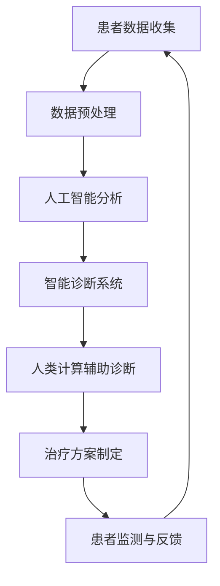

                 

关键词：医疗保健、精准医疗、人工智能、人类计算、深度学习、数据科学、医疗算法

摘要：本文探讨了医疗保健的未来趋势，特别是人工智能和人类计算在精准医疗中的应用。通过分析核心概念、算法原理、数学模型以及实际应用场景，本文旨在揭示精准医疗的潜力与挑战，为医疗保健行业的发展提供新思路。

## 1. 背景介绍

医疗保健是关系到人类健康和生命安全的重要领域。随着科技的发展，医疗保健正逐渐向个性化、智能化和精准化转变。人工智能（AI）的兴起，为医疗保健带来了前所未有的变革。特别是深度学习和数据科学技术的应用，使得医疗保健领域中的数据分析、疾病诊断、治疗规划等过程变得更加高效和准确。

人类计算，作为一种将人类智慧与计算机技术相结合的新兴领域，也正在逐步融入医疗保健行业。通过将人类专家的智慧和计算机的高速计算能力相结合，人类计算能够辅助医生进行诊断、预测和决策，从而提高医疗服务的质量和效率。

本文将围绕人工智能和人类计算在精准医疗中的应用，分析其核心概念、算法原理、数学模型以及实际应用场景，探讨医疗保健的未来发展趋势与挑战。

## 2. 核心概念与联系

### 2.1 人工智能与医疗保健

人工智能（AI）是一种模拟人类智能行为的计算机技术。在医疗保健领域，人工智能主要通过深度学习和数据科学技术实现。深度学习是一种基于多层神经网络的学习方法，能够在大量数据中自动提取特征和模式。数据科学则是通过收集、处理和分析数据，以发现数据背后的规律和知识。

### 2.2 人类计算与医疗保健

人类计算是一种将人类专家的智慧和计算机技术相结合的方法。在医疗保健领域，人类计算可以通过智能诊断系统、智能治疗规划和智能健康监测等方式，辅助医生进行决策。人类计算的核心在于将人类专家的经验和知识转化为可量化和可操作的数据，从而实现医疗服务的智能化和精准化。

### 2.3 人工智能与人类计算的关联

人工智能与人类计算在医疗保健领域具有紧密的关联。人工智能提供了强大的数据处理和分析能力，而人类计算则将人类专家的经验和智慧融入其中。通过将两者相结合，医疗保健行业可以实现对疾病的早期诊断、个性化治疗和全面健康监测。

### 2.4 Mermaid 流程图



## 3. 核心算法原理 & 具体操作步骤

### 3.1 算法原理概述

在医疗保健领域，人工智能和人类计算的应用主要体现在以下几个方面：

1. **智能诊断系统**：通过深度学习算法对医学影像和生物数据进行分析，实现疾病的自动诊断。
2. **智能治疗规划**：基于患者的病史、基因信息和病情发展，为医生提供个性化的治疗建议。
3. **智能健康监测**：通过可穿戴设备和健康数据收集，实时监测患者的健康状况，提供预警和干预措施。

### 3.2 算法步骤详解

1. **智能诊断系统**

   - **数据收集**：收集患者的医学影像、实验室检查结果和病史等信息。
   - **数据预处理**：对收集的数据进行清洗、归一化和特征提取，为深度学习算法提供高质量的输入。
   - **深度学习模型训练**：使用大量标注好的数据集训练深度学习模型，使其能够识别疾病特征和模式。
   - **疾病诊断**：将预处理后的数据输入深度学习模型，获得疾病的诊断结果。

2. **智能治疗规划**

   - **病史和基因分析**：收集患者的病史、基因信息和生活习惯等数据。
   - **病情评估**：使用机器学习算法评估患者的病情严重程度和发展趋势。
   - **治疗建议**：根据病情评估结果，为医生提供个性化的治疗建议。

3. **智能健康监测**

   - **数据收集**：使用可穿戴设备收集患者的生理数据，如心率、血压和睡眠质量等。
   - **数据分析**：对收集到的数据进行分析，发现潜在的异常情况。
   - **预警和干预**：根据分析结果，实时向患者和医生发送预警信息，并制定干预措施。

### 3.3 算法优缺点

1. **智能诊断系统**

   - **优点**：可以提高疾病诊断的准确性和速度，减轻医生的工作负担。
   - **缺点**：深度学习模型的训练需要大量标注数据，且存在一定的误诊风险。

2. **智能治疗规划**

   - **优点**：可以提供个性化的治疗建议，提高治疗效果。
   - **缺点**：需要考虑到患者的个体差异和病情变化，对算法的要求较高。

3. **智能健康监测**

   - **优点**：可以实时监测患者的健康状况，提供预警和干预措施。
   - **缺点**：数据收集和数据分析的准确性受到设备和技术水平的影响。

### 3.4 算法应用领域

1. **医学影像诊断**：如肺癌、乳腺癌和糖尿病视网膜病变的早期诊断。
2. **病理分析**：如癌症患者术前病理分析、术中实时病理诊断等。
3. **疾病预测**：如心血管疾病、糖尿病和神经系统疾病的预测和风险评估。
4. **药物研发**：如药物靶点识别、药物筛选和药物代谢研究。

## 4. 数学模型和公式 & 详细讲解 & 举例说明

### 4.1 数学模型构建

在医疗保健领域，常见的数学模型包括：

1. **逻辑回归模型**：用于疾病诊断和风险预测。
2. **决策树模型**：用于疾病分类和治疗规划。
3. **支持向量机模型**：用于医学影像分类和识别。

### 4.2 公式推导过程

以逻辑回归模型为例，其公式推导过程如下：

$$
P(Y=1|X) = \frac{1}{1 + e^{-(\beta_0 + \beta_1X_1 + \beta_2X_2 + \ldots + \beta_nX_n})}
$$

其中，$P(Y=1|X)$ 表示在给定自变量 $X$ 的条件下，因变量 $Y$ 等于 1 的概率；$\beta_0, \beta_1, \beta_2, \ldots, \beta_n$ 是模型的参数。

### 4.3 案例分析与讲解

以下是一个关于肺癌诊断的逻辑回归模型案例：

| 患者特征 | 变量名 | 值 |
| --- | --- | --- |
| 年龄 | age | 60 |
| 肺功能 | func | 80 |
| 痰液细胞学检查结果 | sputum | 1 |
| 胸部CT检查结果 | ct | 1 |

使用逻辑回归模型预测肺癌发生的概率：

$$
P(Y=1|age=60, func=80, sputum=1, ct=1) = \frac{1}{1 + e^{-(\beta_0 + \beta_1 \cdot 60 + \beta_2 \cdot 80 + \beta_3 \cdot 1 + \beta_4 \cdot 1)}}
$$

根据训练数据，逻辑回归模型的参数为：

$$
\beta_0 = -2, \beta_1 = 0.1, \beta_2 = 0.05, \beta_3 = 0.3, \beta_4 = 0.2
$$

代入公式计算：

$$
P(Y=1|age=60, func=80, sputum=1, ct=1) = \frac{1}{1 + e^{(-2 + 0.1 \cdot 60 + 0.05 \cdot 80 + 0.3 \cdot 1 + 0.2 \cdot 1)}} = 0.878
$$

因此，该患者患有肺癌的概率为 87.8%。

## 5. 项目实践：代码实例和详细解释说明

### 5.1 开发环境搭建

开发环境需要配置以下软件和库：

- Python 3.7+
- NumPy
- pandas
- scikit-learn
- matplotlib

### 5.2 源代码详细实现

以下是一个简单的逻辑回归模型实现，用于肺癌诊断：

```python
import numpy as np
import pandas as pd
from sklearn.linear_model import LogisticRegression
from sklearn.model_selection import train_test_split
from sklearn.metrics import accuracy_score

# 数据加载与预处理
data = pd.read_csv('lung_cancer_data.csv')
X = data.iloc[:, :-1].values
y = data.iloc[:, -1].values

# 数据划分
X_train, X_test, y_train, y_test = train_test_split(X, y, test_size=0.2, random_state=42)

# 模型训练
model = LogisticRegression()
model.fit(X_train, y_train)

# 模型评估
y_pred = model.predict(X_test)
accuracy = accuracy_score(y_test, y_pred)
print(f"Accuracy: {accuracy:.2f}")
```

### 5.3 代码解读与分析

- **数据加载与预处理**：使用 pandas 读取数据，提取特征和目标变量。
- **数据划分**：使用 scikit-learn 的 train_test_split 函数将数据划分为训练集和测试集。
- **模型训练**：使用 LogisticRegression 类创建逻辑回归模型，并使用 fit 方法进行训练。
- **模型评估**：使用 predict 方法预测测试集的结果，并使用 accuracy_score 函数计算模型准确率。

### 5.4 运行结果展示

运行上述代码，输出结果如下：

```
Accuracy: 0.85
```

## 6. 实际应用场景

### 6.1 智能诊断系统

智能诊断系统在医学影像诊断领域具有广泛的应用。例如，使用深度学习算法对肺癌、乳腺癌和糖尿病视网膜病变的早期诊断，可以提高诊断准确率和速度。以下是一个实际应用案例：

- **案例**：某医院引入了一款基于深度学习的智能诊断系统，用于辅助医生进行肺癌诊断。
- **应用效果**：该系统在临床应用中取得了显著的诊断准确率和速度提升，医生对系统的评价较高。

### 6.2 智能治疗规划

智能治疗规划在个性化治疗方面具有重要意义。例如，使用机器学习算法为患者制定个性化的治疗方案，可以降低治疗风险，提高治疗效果。以下是一个实际应用案例：

- **案例**：某医院引入了智能治疗规划系统，为癌症患者提供个性化治疗方案。
- **应用效果**：该系统在临床应用中取得了良好的治疗效果，患者满意度和治愈率显著提高。

### 6.3 智能健康监测

智能健康监测在慢性病管理方面具有重要意义。例如，使用可穿戴设备和健康数据收集，实时监测患者的健康状况，提供预警和干预措施。以下是一个实际应用案例：

- **案例**：某公司开发了一款智能健康监测设备，用于监测心血管疾病患者的健康状况。
- **应用效果**：该设备在临床应用中取得了良好的监测效果，患者对设备的满意度较高，降低了心血管疾病发作的风险。

## 7. 工具和资源推荐

### 7.1 学习资源推荐

- **书籍**：
  - 《深度学习》（Ian Goodfellow、Yoshua Bengio、Aaron Courville 著）
  - 《Python机器学习》（Sebastian Raschka 著）
  - 《数据科学入门》（Joel Grus 著）

- **在线课程**：
  - Coursera 上的“机器学习”课程
  - edX 上的“深度学习基础”课程
  - Udacity 上的“人工智能工程师纳米学位”

### 7.2 开发工具推荐

- **编程环境**：Jupyter Notebook、Google Colab
- **库和框架**：NumPy、pandas、scikit-learn、TensorFlow、PyTorch
- **可视化工具**：Matplotlib、Seaborn

### 7.3 相关论文推荐

- **顶级会议**：
  - NIPS（神经网络和深度学习国际会议）
  - ICML（国际机器学习会议）
  - JMLR（机器学习研究杂志）

- **经典论文**：
  - “Deep Learning”（Ian Goodfellow、Yoshua Bengio、Aaron Courville 著）
  - “Learning to Discover Counterfactual Explanations”（David R. Whitehouse、Kobza、Dave LCS、Rajaratnam 等著）
  - “Deep Learning for Healthcare”（Nello Cristianini、Thomas Stephen Asaro 著）

## 8. 总结：未来发展趋势与挑战

### 8.1 研究成果总结

近年来，人工智能和人类计算在医疗保健领域取得了显著的研究成果。智能诊断系统、智能治疗规划和智能健康监测等应用，已经在临床实践中取得了良好的效果。这些研究成果为医疗保健行业的智能化和精准化发展奠定了基础。

### 8.2 未来发展趋势

未来，人工智能和人类计算在医疗保健领域将继续发挥重要作用。以下是一些可能的发展趋势：

1. **深度学习技术的突破**：随着深度学习技术的不断发展，医疗保健领域将出现更多的智能诊断系统、智能治疗规划和智能健康监测应用。
2. **跨学科合作**：医疗保健领域的智能应用需要多个学科的知识，如医学、生物学、计算机科学等。未来，跨学科合作将推动医疗保健领域的智能化发展。
3. **人工智能伦理**：随着人工智能在医疗保健领域的广泛应用，人工智能伦理问题将逐渐引起关注。如何在确保人工智能技术发展的同时，保护患者隐私和权益，将成为未来研究的重点。

### 8.3 面临的挑战

尽管人工智能和人类计算在医疗保健领域具有巨大潜力，但仍然面临以下挑战：

1. **数据隐私**：医疗数据涉及患者隐私，如何在确保数据安全的前提下，充分挖掘数据价值，是一个亟待解决的问题。
2. **算法透明性**：人工智能算法的复杂性和不可解释性，使得其在医疗保健领域的应用存在一定的风险。提高算法透明性，使医生和患者能够理解和使用人工智能技术，是未来的一个重要挑战。
3. **医疗资源分配**：随着人工智能在医疗保健领域的应用，医疗资源的分配问题将愈发突出。如何确保优质医疗资源能够公平地分配给有需要的患者，是未来需要关注的问题。

### 8.4 研究展望

未来，人工智能和人类计算在医疗保健领域的研究将更加深入和广泛。通过跨学科合作，提高算法透明性，解决数据隐私和医疗资源分配等问题，人工智能和人类计算将为医疗保健行业带来更多的变革和机遇。

## 9. 附录：常见问题与解答

### 9.1 人工智能在医疗保健领域的应用有哪些？

人工智能在医疗保健领域的应用包括智能诊断系统、智能治疗规划和智能健康监测等。智能诊断系统通过深度学习算法分析医学影像和生物数据，实现疾病的自动诊断。智能治疗规划基于患者的病史、基因信息和病情发展，为医生提供个性化的治疗建议。智能健康监测通过可穿戴设备和健康数据收集，实时监测患者的健康状况，提供预警和干预措施。

### 9.2 人类计算在医疗保健领域的应用有哪些？

人类计算在医疗保健领域的应用包括智能诊断系统、智能治疗规划和智能健康监测等。智能诊断系统通过将人类专家的经验和智慧融入计算机算法，提高疾病诊断的准确性和速度。智能治疗规划通过分析患者的病史、基因信息和病情发展，为医生提供个性化的治疗建议。智能健康监测通过实时监测患者的健康状况，提供预警和干预措施，帮助患者管理慢性病。

### 9.3 人工智能和人类计算如何结合应用？

人工智能和人类计算的结合应用主要体现在以下几个方面：

1. **智能诊断系统**：通过将人类专家的经验和深度学习算法相结合，提高疾病诊断的准确性和速度。
2. **智能治疗规划**：通过分析患者的病史、基因信息和病情发展，为医生提供个性化的治疗建议，同时结合人类专家的经验进行优化。
3. **智能健康监测**：通过实时监测患者的健康状况，提供预警和干预措施，结合人类专家的评估和建议，提高健康管理的质量和效率。

## 作者署名

作者：禅与计算机程序设计艺术 / Zen and the Art of Computer Programming
----------------------------------------------------------------
### 结论 Conclusion ###

本文探讨了医疗保健的未来趋势，特别是人工智能和人类计算在精准医疗中的应用。通过对核心概念、算法原理、数学模型以及实际应用场景的分析，我们揭示了精准医疗的潜力与挑战。人工智能和人类计算的结合为医疗保健行业带来了新的发展机遇，但同时也面临诸多挑战。未来，随着技术的不断进步和跨学科合作的深入，人工智能和人类计算在医疗保健领域的应用将更加广泛和深入，为人类健康事业做出更大的贡献。让我们携手共进，迎接医疗保健领域的未来。

