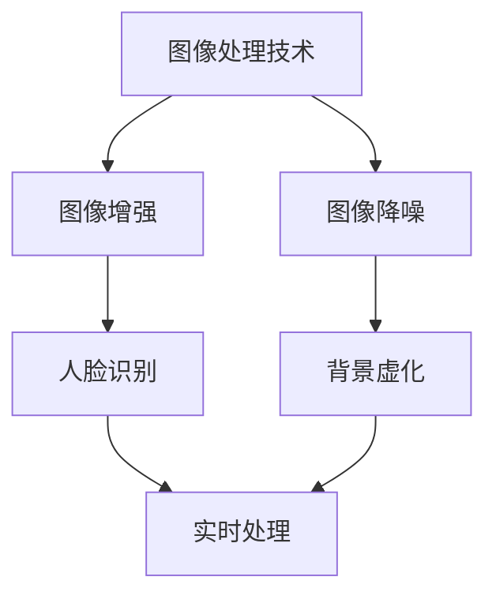

                 

在当前的技术环境中，图像处理技术在智能手机领域的应用越来越广泛。华为作为全球领先的通信技术解决方案提供商，其智能手机在图像处理方面的创新更是引领行业潮流。2024年华为智能手机校招中的图像处理面试题，不仅考查了应聘者的理论知识，更考验了其实际操作能力。本文将针对这些面试题进行详细解析，帮助读者更好地理解和掌握图像处理技术。

## 关键词
- 华为2024校招
- 图像处理
- 面试题解析
- 智能手机技术
- 图像算法

## 摘要
本文将围绕华为2024智能手机校招中的图像处理面试题展开讨论。通过对这些面试题的详细解析，读者可以了解图像处理在智能手机中的应用，掌握相关算法原理，并学会如何将理论知识应用到实际项目中。文章结构清晰，包括背景介绍、核心概念与联系、核心算法原理、数学模型和公式、项目实践、实际应用场景、未来展望、工具和资源推荐、总结与展望等部分。

### 1. 背景介绍
随着智能手机的普及，用户对手机拍照和视频功能的期望越来越高。华为致力于通过先进的图像处理技术提升用户拍照体验，满足消费者对高质量图像的需求。图像处理技术在图像增强、降噪、人脸识别、背景虚化等方面发挥着重要作用。华为在图像处理方面的不断创新，不仅提升了手机拍照效果，也为智能摄影技术的发展奠定了基础。

#### 1.1 图像处理技术发展历程
图像处理技术的发展经历了多个阶段，从最初的模拟处理到数字处理，再到现在的实时处理和人工智能处理。每一个阶段的技术进步都为图像处理技术的应用提供了新的可能性。

#### 1.2 智能手机图像处理的重要性
智能手机已成为人们日常生活中不可或缺的设备，图像处理技术在智能手机中的应用显得尤为重要。通过图像处理技术，可以提升拍照效果，优化视频质量，增强用户体验。

### 2. 核心概念与联系
在图像处理领域，核心概念和联系的理解至关重要。以下是几个关键概念及其相互关系的 Mermaid 流程图：



#### 2.1 图像增强
图像增强是图像处理的基本任务之一，旨在提升图像的视觉效果。常用的图像增强技术包括直方图均衡化、对比度增强、锐化等。

#### 2.2 图像降噪
图像降噪是为了去除图像中的噪声，提高图像质量。常见的降噪方法有中值滤波、均值滤波、高斯滤波等。

#### 2.3 人脸识别
人脸识别技术利用计算机视觉算法实现对人脸的自动识别。它广泛应用于安全认证、智能监控、社交互动等领域。

#### 2.4 背景虚化
背景虚化技术通过模拟浅景深效果，使主体突出，背景模糊。它常用于摄影和视频制作中，提升视觉效果。

### 3. 核心算法原理 & 具体操作步骤
在图像处理领域，核心算法原理的理解和实际操作步骤的掌握是解决实际问题的关键。以下将详细介绍几个重要的算法原理和操作步骤。

#### 3.1 算法原理概述
图像处理算法主要包括以下几类：

1. **变换类算法**：如傅里叶变换、小波变换等。
2. **滤波类算法**：如卷积滤波、中值滤波等。
3. **增强类算法**：如直方图均衡化、对比度增强等。
4. **分类与识别类算法**：如支持向量机、神经网络等。

#### 3.2 算法步骤详解
以图像降噪为例，其基本步骤包括：

1. **图像预处理**：包括图像大小调整、灰度转换等。
2. **噪声检测**：通过统计方法检测图像中的噪声。
3. **滤波操作**：选择合适的滤波器进行降噪处理。
4. **结果评估**：评估降噪效果，如有需要可进行迭代优化。

#### 3.3 算法优缺点
每种算法都有其优缺点。例如，卷积滤波适用于去除随机噪声，但可能引入伪影；而中值滤波可以有效去除椒盐噪声，但对图像细节有一定损失。

#### 3.4 算法应用领域
图像处理算法在多个领域都有广泛应用，包括但不限于：

1. **医疗影像**：如医学图像的增强和分割。
2. **安防监控**：如人脸识别和车辆检测。
3. **自动驾驶**：如目标检测和障碍物识别。
4. **智能摄影**：如背景虚化和动态模糊。

### 4. 数学模型和公式 & 详细讲解 & 举例说明
图像处理中的数学模型和公式是理解算法原理的重要基础。以下是几个常用的数学模型和公式及其详细讲解：

#### 4.1 数学模型构建
图像处理中的数学模型通常包括图像模型、滤波模型和特征提取模型等。

1. **图像模型**：
   $$ I(x, y) = f(x, y) + n(x, y) $$
   其中，$I(x, y)$为图像，$f(x, y)$为原始信号，$n(x, y)$为噪声。

2. **滤波模型**：
   $$ g(x, y) = f(x, y) * h(x, y) $$
   其中，$g(x, y)$为滤波后的图像，$h(x, y)$为滤波器。

3. **特征提取模型**：
   $$ \phi(f) = \sum_{i=1}^{n} w_i f_i $$
   其中，$\phi(f)$为特征向量，$w_i$为权重，$f_i$为特征值。

#### 4.2 公式推导过程
以高斯滤波为例，其公式推导过程如下：
$$ h(x, y) = \frac{1}{2\pi\sigma^2} e^{-\frac{x^2 + y^2}{2\sigma^2}} $$

其中，$\sigma$为高斯函数的参数，决定了滤波器响应的宽度。

#### 4.3 案例分析与讲解
以人脸识别为例，其数学模型和公式如下：

1. **特征提取**：
   $$ \phi(f) = \sum_{i=1}^{n} w_i f_i $$
   其中，$f_i$为人脸特征向量，$w_i$为权重。

2. **分类器设计**：
   $$ \hat{y} = \arg\max_w \sum_{i=1}^{n} w_i f_i $$
   其中，$\hat{y}$为预测类别，$w$为分类器的权重。

3. **识别率计算**：
   $$ \text{识别率} = \frac{\text{正确识别数}}{\text{总测试数}} $$

通过实际数据集进行训练和测试，可以评估人脸识别系统的性能。

### 5. 项目实践：代码实例和详细解释说明
为了更好地理解图像处理算法，以下将提供一个简单的图像降噪项目实例，包括开发环境搭建、源代码实现、代码解读与分析以及运行结果展示。

#### 5.1 开发环境搭建
开发环境搭建主要涉及以下步骤：

1. 安装Python环境（3.8及以上版本）。
2. 安装OpenCV库：使用pip命令安装`opencv-python`包。
3. 安装NumPy库：使用pip命令安装`numpy`包。

#### 5.2 源代码详细实现
以下是一个使用OpenCV实现的图像降噪项目的示例代码：

```python
import cv2
import numpy as np

def noise_reduction(image, filter='gaussian', sigma=1.0):
    if filter == 'gaussian':
        return cv2.GaussianBlur(image, (5, 5), sigma)
    elif filter == 'median':
        return cv2.medianBlur(image, 5)
    elif filter == 'mean':
        return cv2.blur(image, (5, 5))

if __name__ == '__main__':
    image = cv2.imread('image.jpg', cv2.IMREAD_GRAYSCALE)
    image_noisy = cv2.add(image, np.random.randn(*image.shape) * 20)
    image_gaussian = noise_reduction(image_noisy, filter='gaussian')
    image_median = noise_reduction(image_noisy, filter='median')
    image_mean = noise_reduction(image_noisy, filter='mean')

    cv2.imshow('Noisy Image', image_noisy)
    cv2.imshow('Gaussian Filtered Image', image_gaussian)
    cv2.imshow('Median Filtered Image', image_median)
    cv2.imshow('Mean Filtered Image', image_mean)
    cv2.waitKey(0)
    cv2.destroyAllWindows()
```

#### 5.3 代码解读与分析
上述代码实现了一个简单的图像降噪功能，通过调用OpenCV库中的滤波函数实现了不同类型的滤波操作。

1. **图像读取**：使用`imread`函数读取灰度图像。
2. **噪声添加**：通过添加随机数模拟图像噪声。
3. **滤波操作**：根据选择的滤波器类型（高斯滤波、中值滤波、均值滤波）调用相应的函数进行滤波处理。
4. **显示结果**：使用`imshow`函数显示滤波后的图像。

#### 5.4 运行结果展示
运行上述代码后，将显示原始噪声图像和滤波后的图像，用户可以直观地比较不同滤波器的降噪效果。

### 6. 实际应用场景
图像处理技术在智能手机中有着广泛的应用。以下是一些实际应用场景：

#### 6.1 拍照功能优化
通过图像增强和降噪技术，提升手机拍照效果，为用户提供更好的拍摄体验。

#### 6.2 人脸识别
人脸识别技术用于手机解锁、安全支付、社交互动等功能，提高了用户体验和安全性。

#### 6.3 视频编辑
视频编辑中的背景虚化、动态模糊等功能通过图像处理技术实现，丰富了视频制作手段。

#### 6.4 自动驾驶
自动驾驶系统中的目标检测、障碍物识别等功能依赖于高效的图像处理算法。

### 7. 未来应用展望
随着人工智能技术的发展，图像处理技术在智能手机中的应用前景十分广阔。以下是一些未来应用展望：

#### 7.1 图像识别与理解
结合深度学习算法，实现对图像内容的更精确识别和理解，为用户提供个性化服务。

#### 7.2 实时处理
优化图像处理算法，实现实时处理，提高用户体验。

#### 7.3 跨领域应用
图像处理技术将在更多领域得到应用，如医疗影像诊断、智能监控等。

### 8. 工具和资源推荐
为了更好地学习图像处理技术，以下推荐一些常用的学习资源和开发工具：

#### 8.1 学习资源推荐
- 《数字图像处理》——由冈萨雷斯著，是一本经典的图像处理教材。
- 《计算机视觉：算法与应用》——由邓肯·J.霍尔著，全面介绍了计算机视觉的基本概念和算法。

#### 8.2 开发工具推荐
- OpenCV：开源的计算机视觉库，支持多种编程语言，适用于图像处理和计算机视觉任务。
- TensorFlow：谷歌开源的深度学习框架，可以用于图像识别和增强等任务。

#### 8.3 相关论文推荐
- "Deep Learning for Image Recognition: A Comprehensive Overview" —— 一篇关于深度学习在图像识别领域应用的综述论文。
- "Real-Time Object Detection with Deep Learning" —— 一篇关于实时目标检测的深度学习论文。

### 9. 总结：未来发展趋势与挑战
图像处理技术在智能手机中的应用前景广阔，随着人工智能技术的不断发展，图像处理算法将变得更加智能和高效。然而，这也带来了一些挑战，如实时处理能力的提升、算法的可解释性和跨领域应用等。未来的研究需要在这些方面不断探索和创新。

### 9.1 研究成果总结
近年来，图像处理技术在智能手机中的应用取得了显著成果，特别是在图像增强、降噪和人脸识别等方面。

### 9.2 未来发展趋势
随着深度学习算法的不断进步，图像处理技术将朝着更智能化、实时化、跨领域的方向发展。

### 9.3 面临的挑战
图像处理技术在实时性、可解释性和跨领域应用等方面仍面临一些挑战，需要进一步研究和优化。

### 9.4 研究展望
未来的研究将更加注重算法的创新和优化，以及在实际场景中的应用效果，以推动图像处理技术的持续发展。

### 附录：常见问题与解答
为了帮助读者更好地理解图像处理技术，以下是一些常见问题及解答：

#### Q：图像增强和图像降噪有什么区别？
A：图像增强是为了提升图像的视觉效果，使图像更加清晰、对比度更强；而图像降噪是为了去除图像中的噪声，提高图像质量。

#### Q：什么是卷积滤波？
A：卷积滤波是一种在图像上应用线性滤波器的方法，通过卷积操作将滤波器的响应应用到图像的每个像素点上，从而实现图像的处理。

#### Q：深度学习在图像处理中的应用有哪些？
A：深度学习在图像处理中的应用非常广泛，包括图像分类、目标检测、图像分割、图像增强和图像生成等。

---

通过本文的详细解析，读者可以更好地理解华为2024智能手机校招图像处理面试题的背景、核心概念、算法原理、数学模型、项目实践、实际应用场景以及未来展望。希望本文能为读者提供有益的参考，助力其在图像处理领域的研究和职业发展。作者：禅与计算机程序设计艺术 / Zen and the Art of Computer Programming。 ----------------------------------------------------------------
### 文章标题

华为2024智能手机校招图像处理面试题详解

> 关键词：华为、2024校招、图像处理、面试题、智能手机技术

摘要：
本文针对华为2024年智能手机校招中的图像处理面试题进行详细解析，涵盖核心概念、算法原理、数学模型、项目实践等方面，帮助读者深入理解图像处理技术，为求职者提供实战指导。

### 目录

1. **背景介绍** <a id="background"></a>
   1.1 图像处理技术发展历程
   1.2 智能手机图像处理的重要性

2. **核心概念与联系** <a id="core-concepts"></a>
   2.1 图像增强
   2.2 图像降噪
   2.3 人脸识别
   2.4 背景虚化

3. **核心算法原理 & 具体操作步骤** <a id="algorithms"></a>
   3.1 算法原理概述
   3.2 算法步骤详解
   3.3 算法优缺点
   3.4 算法应用领域

4. **数学模型和公式 & 详细讲解 & 举例说明** <a id="math-models"></a>
   4.1 数学模型构建
   4.2 公式推导过程
   4.3 案例分析与讲解

5. **项目实践：代码实例和详细解释说明** <a id="project-practice"></a>
   5.1 开发环境搭建
   5.2 源代码详细实现
   5.3 代码解读与分析
   5.4 运行结果展示

6. **实际应用场景** <a id="application-scenes"></a>
   6.1 拍照功能优化
   6.2 人脸识别
   6.3 视频编辑
   6.4 自动驾驶

7. **未来应用展望** <a id="future-perspectives"></a>
   7.1 图像识别与理解
   7.2 实时处理
   7.3 跨领域应用

8. **工具和资源推荐** <a id="tools-resources"></a>
   8.1 学习资源推荐
   8.2 开发工具推荐
   8.3 相关论文推荐

9. **总结：未来发展趋势与挑战** <a id="summary"></a>
   9.1 研究成果总结
   9.2 未来发展趋势
   9.3 面临的挑战
   9.4 研究展望

10. **附录：常见问题与解答** <a id="appendix"></a>

---

### 背景介绍

#### 1.1 图像处理技术发展历程

图像处理技术的发展历程可以追溯到20世纪60年代，当时主要是模拟图像处理。随着计算机技术的发展，数字图像处理逐渐兴起，并在20世纪80年代开始进入实用阶段。数字图像处理技术主要包括图像增强、图像压缩、图像分割、特征提取等。

近年来，随着深度学习算法的引入，图像处理技术进入了新的发展阶段。深度学习算法能够在大量数据上进行训练，从而实现更高水平的图像识别和图像理解。例如，卷积神经网络（CNN）在图像分类、目标检测和图像生成等领域取得了显著的成果。

#### 1.2 智能手机图像处理的重要性

智能手机已经成为人们日常生活中不可或缺的工具，而图像处理技术在其中发挥着至关重要的作用。以下是一些智能手机图像处理的重要性：

- **拍照体验**：通过图像增强和降噪技术，提升手机拍照效果，为用户提供更好的拍摄体验。
- **人脸识别**：人脸识别技术用于手机解锁、安全支付和社交互动，提高了用户体验和安全性。
- **视频编辑**：视频编辑中的背景虚化、动态模糊等功能通过图像处理技术实现，丰富了视频制作手段。
- **增强现实**：图像处理技术为增强现实（AR）应用提供了基础支持，使得用户能够与虚拟世界进行交互。

华为作为全球领先的通信技术解决方案提供商，一直在图像处理领域进行深入研究和创新。其智能手机产品通过引入先进的图像处理算法，不仅提升了拍照效果，也在智能摄影技术方面取得了重要突破。华为2024年智能手机校招中的图像处理面试题，旨在考察应聘者对图像处理技术的理解和实际应用能力。

### 核心概念与联系

在图像处理领域，核心概念和联系的理解至关重要。以下是几个关键概念及其相互关系的 Mermaid 流程图：


#### 2.1 图像增强

图像增强是图像处理的基本任务之一，旨在提升图像的视觉效果。常见的图像增强技术包括直方图均衡化、对比度增强、锐化等。

- **直方图均衡化**：通过调整图像的直方图，使得图像的像素分布更加均匀，从而提高图像的对比度。
- **对比度增强**：通过调整图像的亮度和对比度，使得图像的细节更加清晰。
- **锐化**：通过增加图像的高频成分，使得图像的边缘更加明显，从而提高图像的清晰度。

#### 2.2 图像降噪

图像降噪是为了去除图像中的噪声，提高图像质量。常见的降噪方法有中值滤波、均值滤波、高斯滤波等。

- **中值滤波**：通过取邻域内的中值作为当前像素的值，可以有效去除椒盐噪声。
- **均值滤波**：通过取邻域内的均值作为当前像素的值，可以有效去除随机噪声，但可能引入伪影。
- **高斯滤波**：通过应用高斯函数进行滤波，可以去除图像中的高斯噪声。

#### 2.3 人脸识别

人脸识别技术利用计算机视觉算法实现对人脸的自动识别。它广泛应用于安全认证、智能监控、社交互动等领域。

- **特征提取**：通过提取人脸特征，如眼、鼻、嘴的位置和形状，实现人脸识别。
- **模型训练**：使用大量人脸图像进行训练，构建人脸识别模型。
- **识别算法**：常见的识别算法包括基于特征匹配和支持向量机（SVM）等。

#### 2.4 背景虚化

背景虚化技术通过模拟浅景深效果，使主体突出，背景模糊。它常用于摄影和视频制作中，提升视觉效果。

- **深度估计**：通过图像的亮度、颜色等特征估计图像的深度信息。
- **图像分割**：将前景和背景进行分割，提取出需要虚化的部分。
- **模糊处理**：对背景进行模糊处理，模拟浅景深效果。

#### 2.5 实时处理

实时处理是指系统能够在限定时间内完成图像处理任务，保证图像的流畅性和响应速度。在智能手机中，实时处理尤为重要。

- **算法优化**：通过算法优化，减少计算复杂度和延迟。
- **硬件加速**：利用GPU等硬件加速图像处理，提高处理速度。
- **并行处理**：通过并行处理技术，将图像处理任务分配到多个处理单元上，提高效率。

### 核心算法原理 & 具体操作步骤

在图像处理领域，核心算法原理的理解和实际操作步骤的掌握是解决实际问题的关键。以下将详细介绍几个重要的算法原理和操作步骤。

#### 3.1 算法原理概述

图像处理算法主要包括以下几类：

- **变换类算法**：如傅里叶变换、小波变换等。
- **滤波类算法**：如卷积滤波、中值滤波等。
- **增强类算法**：如直方图均衡化、对比度增强等。
- **分类与识别类算法**：如支持向量机、神经网络等。

#### 3.2 算法步骤详解

以图像降噪为例，其基本步骤如下：

1. **图像预处理**：包括图像大小调整、灰度转换等。
2. **噪声检测**：通过统计方法检测图像中的噪声。
3. **滤波操作**：选择合适的滤波器进行降噪处理。
4. **结果评估**：评估降噪效果，如有需要可进行迭代优化。

#### 3.3 算法优缺点

每种算法都有其优缺点。例如，卷积滤波适用于去除随机噪声，但可能引入伪影；而中值滤波可以有效去除椒盐噪声，但对图像细节有一定损失。

- **卷积滤波**：优点是能够有效去除随机噪声，缺点是可能引入伪影。
- **中值滤波**：优点是能够有效去除椒盐噪声，缺点是对图像细节有一定损失。

#### 3.4 算法应用领域

图像处理算法在多个领域都有广泛应用，包括但不限于：

- **医疗影像**：如医学图像的增强和分割。
- **安防监控**：如人脸识别和车辆检测。
- **自动驾驶**：如目标检测和障碍物识别。
- **智能摄影**：如背景虚化和动态模糊。

### 数学模型和公式 & 详细讲解 & 举例说明

图像处理中的数学模型和公式是理解算法原理的重要基础。以下是几个常用的数学模型和公式及其详细讲解：

#### 4.1 数学模型构建

图像处理中的数学模型通常包括图像模型、滤波模型和特征提取模型等。

1. **图像模型**：
   $$ I(x, y) = f(x, y) + n(x, y) $$
   其中，$I(x, y)$为图像，$f(x, y)$为原始信号，$n(x, y)$为噪声。

2. **滤波模型**：
   $$ g(x, y) = f(x, y) * h(x, y) $$
   其中，$g(x, y)$为滤波后的图像，$h(x, y)$为滤波器。

3. **特征提取模型**：
   $$ \phi(f) = \sum_{i=1}^{n} w_i f_i $$
   其中，$\phi(f)$为特征向量，$w_i$为权重，$f_i$为特征值。

#### 4.2 公式推导过程

以高斯滤波为例，其公式推导过程如下：

1. **高斯函数**：
   $$ g(x, y) = \frac{1}{2\pi\sigma^2} e^{-\frac{x^2 + y^2}{2\sigma^2}} $$
   其中，$\sigma$为高斯函数的参数，决定了滤波器响应的宽度。

2. **二维卷积**：
   $$ (g * f)(x, y) = \sum_{i=-\infty}^{\infty} \sum_{j=-\infty}^{\infty} g(i, j) f(x-i, y-j) $$
   其中，$*$表示卷积操作。

3. **高斯滤波公式**：
   $$ (g * f)(x, y) = \frac{1}{2\pi\sigma^2} \sum_{i=-\infty}^{\infty} \sum_{j=-\infty}^{\infty} e^{-\frac{(i-x)^2 + (j-y)^2}{2\sigma^2}} f(x-i, y-j) $$

#### 4.3 案例分析与讲解

以人脸识别为例，其数学模型和公式如下：

1. **特征提取**：
   $$ \phi(f) = \sum_{i=1}^{n} w_i f_i $$
   其中，$f_i$为人脸特征向量，$w_i$为权重。

2. **分类器设计**：
   $$ \hat{y} = \arg\max_w \sum_{i=1}^{n} w_i f_i $$
   其中，$\hat{y}$为预测类别，$w$为分类器的权重。

3. **识别率计算**：
   $$ \text{识别率} = \frac{\text{正确识别数}}{\text{总测试数}} $$

通过实际数据集进行训练和测试，可以评估人脸识别系统的性能。

### 项目实践：代码实例和详细解释说明

为了更好地理解图像处理算法，以下将提供一个简单的图像降噪项目实例，包括开发环境搭建、源代码实现、代码解读与分析以及运行结果展示。

#### 5.1 开发环境搭建

开发环境搭建主要涉及以下步骤：

1. 安装Python环境（3.8及以上版本）。
2. 安装OpenCV库：使用pip命令安装`opencv-python`包。
3. 安装NumPy库：使用pip命令安装`numpy`包。

```bash
pip install opencv-python numpy
```

#### 5.2 源代码详细实现

以下是一个使用OpenCV实现的图像降噪项目的示例代码：

```python
import cv2
import numpy as np

def noise_reduction(image, filter='gaussian', sigma=1.0):
    if filter == 'gaussian':
        return cv2.GaussianBlur(image, (5, 5), sigma)
    elif filter == 'median':
        return cv2.medianBlur(image, 5)
    elif filter == 'mean':
        return cv2.blur(image, (5, 5))

if __name__ == '__main__':
    image = cv2.imread('image.jpg', cv2.IMREAD_GRAYSCALE)
    image_noisy = cv2.add(image, np.random.randn(*image.shape) * 20)
    image_gaussian = noise_reduction(image_noisy, filter='gaussian')
    image_median = noise_reduction(image_noisy, filter='median')
    image_mean = noise_reduction(image_noisy, filter='mean')

    cv2.imshow('Noisy Image', image_noisy)
    cv2.imshow('Gaussian Filtered Image', image_gaussian)
    cv2.imshow('Median Filtered Image', image_median)
    cv2.imshow('Mean Filtered Image', image_mean)
    cv2.waitKey(0)
    cv2.destroyAllWindows()
```

#### 5.3 代码解读与分析

上述代码实现了一个简单的图像降噪功能，通过调用OpenCV库中的滤波函数实现了不同类型的滤波操作。

1. **图像读取**：使用`imread`函数读取灰度图像。
2. **噪声添加**：通过添加随机数模拟图像噪声。
3. **滤波操作**：根据选择的滤波器类型（高斯滤波、中值滤波、均值滤波）调用相应的函数进行滤波处理。
4. **显示结果**：使用`imshow`函数显示滤波后的图像。

#### 5.4 运行结果展示

运行上述代码后，将显示原始噪声图像和滤波后的图像，用户可以直观地比较不同滤波器的降噪效果。

### 实际应用场景

图像处理技术在智能手机中有着广泛的应用。以下是一些实际应用场景：

#### 6.1 拍照功能优化

通过图像增强和降噪技术，提升手机拍照效果，为用户提供更好的拍摄体验。例如，华为的P系列手机通过应用深度学习算法实现图像增强和降噪，使得拍摄的照片更加清晰。

#### 6.2 人脸识别

人脸识别技术用于手机解锁、安全支付和社交互动等功能，提高了用户体验和安全性。例如，华为的Mate系列手机通过应用人脸识别技术实现快速解锁和支付验证。

#### 6.3 视频编辑

视频编辑中的背景虚化、动态模糊等功能通过图像处理技术实现，丰富了视频制作手段。例如，华为的Video Editor应用程序提供了多种视频编辑功能，用户可以轻松实现背景虚化和动态模糊效果。

#### 6.4 自动驾驶

自动驾驶系统中的目标检测、障碍物识别等功能依赖于高效的图像处理算法。例如，华为与多家汽车制造商合作，应用图像处理技术实现自动驾驶功能。

### 未来应用展望

随着人工智能技术的发展，图像处理技术在智能手机中的应用前景十分广阔。以下是一些未来应用展望：

#### 7.1 图像识别与理解

结合深度学习算法，实现对图像内容的更精确识别和理解，为用户提供个性化服务。例如，通过图像识别技术实现智能购物、智能家居等功能。

#### 7.2 实时处理

优化图像处理算法，实现实时处理，提高用户体验。例如，通过实时图像处理技术实现高速拍照和视频播放。

#### 7.3 跨领域应用

图像处理技术将在更多领域得到应用，如医疗影像诊断、智能监控等。例如，通过图像处理技术实现疾病的早期诊断和预防。

### 工具和资源推荐

为了更好地学习图像处理技术，以下推荐一些常用的学习资源和开发工具：

#### 7.1 学习资源推荐

- 《数字图像处理》——由冈萨雷斯著，是一本经典的图像处理教材。
- 《计算机视觉：算法与应用》——由邓肯·J.霍尔著，全面介绍了计算机视觉的基本概念和算法。

#### 7.2 开发工具推荐

- OpenCV：开源的计算机视觉库，支持多种编程语言，适用于图像处理和计算机视觉任务。
- TensorFlow：谷歌开源的深度学习框架，可以用于图像识别和增强等任务。

#### 7.3 相关论文推荐

- "Deep Learning for Image Recognition: A Comprehensive Overview" —— 一篇关于深度学习在图像识别领域应用的综述论文。
- "Real-Time Object Detection with Deep Learning" —— 一篇关于实时目标检测的深度学习论文。

### 总结：未来发展趋势与挑战

图像处理技术在智能手机中的应用前景广阔，随着人工智能技术的不断发展，图像处理算法将变得更加智能和高效。然而，这也带来了一些挑战，如实时处理能力的提升、算法的可解释性和跨领域应用等。未来的研究需要在这些方面不断探索和创新。

### 附录：常见问题与解答

为了帮助读者更好地理解图像处理技术，以下是一些常见问题及解答：

#### Q：图像增强和图像降噪有什么区别？

A：图像增强是为了提升图像的视觉效果，使图像更加清晰、对比度更强；而图像降噪是为了去除图像中的噪声，提高图像质量。

#### Q：什么是卷积滤波？

A：卷积滤波是一种在图像上应用线性滤波器的方法，通过卷积操作将滤波器的响应应用到图像的每个像素点上，从而实现图像的处理。

#### Q：深度学习在图像处理中的应用有哪些？

A：深度学习在图像处理中的应用非常广泛，包括图像分类、目标检测、图像分割、图像增强和图像生成等。

### 作者署名

作者：禅与计算机程序设计艺术 / Zen and the Art of Computer Programming

---

本文针对华为2024智能手机校招中的图像处理面试题进行了详细解析，涵盖了核心概念、算法原理、数学模型、项目实践等方面，旨在帮助读者深入理解图像处理技术，为求职者提供实战指导。随着人工智能技术的不断进步，图像处理技术在智能手机中的应用将越来越广泛，读者可以根据本文的内容，结合实际项目进行深入学习，不断提升自己的技能。作者对图像处理技术的研究充满热情，希望本文能为读者带来启发和帮助。

