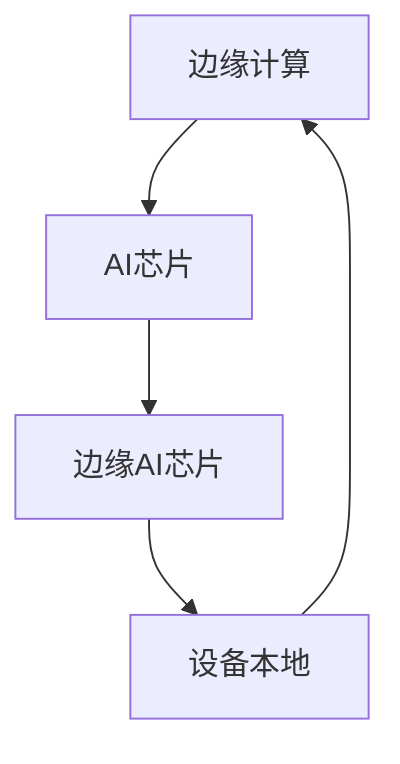

                 

## 1. 背景介绍

边缘AI芯片作为一种新型的计算架构，正在逐步改变我们对于计算资源的理解和应用方式。随着物联网、智能制造、智慧城市等领域的快速发展，边缘计算的重要性日益凸显。边缘AI芯片作为边缘计算的核心组件，其性能、功耗、能效等方面直接决定了边缘计算系统的整体表现。

本文旨在整理和解析华为2024年边缘AI芯片开发工程师校招面试题，为有意向从事该领域工作的读者提供一个全面的备考资料。华为作为全球领先的通信设备供应商，其边缘AI芯片产品和技术在国际上具有很高的影响力。因此，掌握华为的面试题，不仅有助于考生了解该领域的核心知识，还能提升自身的技术素养和竞争力。

本文将按照华为边缘AI芯片开发的实际需求，从核心概念、算法原理、数学模型、项目实践、应用场景、未来展望等多个维度进行深入探讨。希望通过本文的阅读，读者能够对边缘AI芯片开发有一个全面而深入的理解。

## 2. 核心概念与联系

在讨论边缘AI芯片开发之前，我们需要明确几个核心概念，以及它们之间的联系。

### 2.1 边缘计算

边缘计算（Edge Computing）是一种分布式计算架构，旨在将计算、存储、数据处理等能力推向网络边缘，靠近数据源。通过边缘计算，可以显著减少数据传输延迟，提高系统响应速度，同时降低中心化计算带来的网络带宽压力。

### 2.2 AI芯片

AI芯片，即人工智能专用芯片，是用于加速人工智能计算的一种硬件。其设计目标是在有限的功耗和面积内，提供更高的计算效率和性能。AI芯片可以应用于图像识别、语音识别、自然语言处理等多个领域。

### 2.3 边缘AI芯片

边缘AI芯片是将AI计算能力集成到边缘设备上的芯片，如路由器、交换机、智能摄像头等。这种芯片可以在设备本地执行AI任务，从而实现实时数据处理和决策。

### 2.4 关系与联系

边缘计算、AI芯片和边缘AI芯片之间的关系如下图所示：



边缘计算通过将计算能力推向网络边缘，为AI芯片提供了应用场景。而AI芯片则为边缘AI芯片提供了计算基础，使得边缘设备能够本地执行AI任务。边缘AI芯片与边缘计算设备紧密集成，共同构成了边缘智能生态系统。

## 3. 核心算法原理 & 具体操作步骤

### 3.1 算法原理概述

边缘AI芯片的核心算法通常是基于深度学习技术，通过神经网络模型实现数据的特征提取和分类。以下是一个典型的深度学习算法原理概述：

1. **数据预处理**：对原始数据进行清洗、归一化和特征提取。
2. **构建神经网络模型**：设计并构建神经网络结构，通常包括输入层、隐藏层和输出层。
3. **前向传播**：将预处理后的数据输入到神经网络中，通过权重和偏置计算输出结果。
4. **反向传播**：计算损失函数，通过梯度下降法更新网络权重和偏置。
5. **模型评估**：使用验证集评估模型性能，调整超参数以优化模型。

### 3.2 算法步骤详解

以下是边缘AI芯片深度学习算法的具体操作步骤：

#### 3.2.1 数据预处理

- 数据清洗：去除异常值、缺失值和噪声。
- 数据归一化：将数据缩放到相同的尺度，如[0, 1]。
- 特征提取：从原始数据中提取有助于模型训练的特征。

#### 3.2.2 构建神经网络模型

- **输入层**：接收预处理后的数据。
- **隐藏层**：通过激活函数（如ReLU、Sigmoid、Tanh）对输入数据进行变换。
- **输出层**：输出模型的预测结果。

#### 3.2.3 前向传播

- **输入层**：将预处理后的数据输入到神经网络。
- **隐藏层**：通过权重和偏置计算中间层输出。
- **输出层**：计算最终输出结果。

#### 3.2.4 反向传播

- **计算损失**：计算预测结果与实际结果之间的差异。
- **计算梯度**：使用链式法则计算每个参数的梯度。
- **更新参数**：使用梯度下降法更新网络权重和偏置。

#### 3.2.5 模型评估

- **验证集评估**：使用验证集评估模型性能。
- **调整超参数**：根据验证集结果调整学习率、批量大小等超参数。

### 3.3 算法优缺点

#### 3.3.1 优点

- **高效性**：深度学习算法能够在高维数据上进行复杂特征提取，实现高效的数据处理。
- **通用性**：神经网络模型可以应用于多个领域，如图像识别、语音识别、自然语言处理等。
- **自动特征提取**：模型能够自动学习数据中的特征，减少人工干预。

#### 3.3.2 缺点

- **训练时间较长**：深度学习模型需要大量数据训练，训练时间较长。
- **对数据质量要求高**：数据质量直接影响模型性能，需要确保数据清洗和归一化等预处理工作的质量。
- **资源消耗大**：深度学习模型通常需要较大的计算资源和存储空间。

### 3.4 算法应用领域

边缘AI芯片深度学习算法广泛应用于以下领域：

- **图像识别**：如人脸识别、车辆识别等。
- **语音识别**：如语音识别、语音合成等。
- **自然语言处理**：如文本分类、情感分析等。
- **智能制造**：如质量检测、设备故障预测等。
- **智能交通**：如交通流量预测、自动驾驶等。

## 4. 数学模型和公式 & 详细讲解 & 举例说明

边缘AI芯片的算法设计离不开数学模型的支撑，以下将详细介绍深度学习中的几个关键数学模型和公式。

### 4.1 数学模型构建

深度学习中的数学模型通常包括输入层、隐藏层和输出层。以下是神经网络的基本数学模型：

- 输入层：\(X \in \mathbb{R}^{m \times n}\)，其中m是样本数，n是特征数。
- 隐藏层：\(H \in \mathbb{R}^{m \times h}\)，其中h是隐藏层的神经元数。
- 输出层：\(Y \in \mathbb{R}^{m \times k}\)，其中k是输出层的神经元数。

### 4.2 公式推导过程

以下是一个简化的神经网络前向传播和反向传播的公式推导过程：

#### 4.2.1 前向传播

输入层到隐藏层的变换：

$$
H = \sigma(W_1 \cdot X + b_1)
$$

其中，\(W_1\) 是输入层到隐藏层的权重矩阵，\(b_1\) 是隐藏层的偏置向量，\(\sigma\) 是激活函数，如ReLU函数。

隐藏层到输出层的变换：

$$
Y = \sigma(W_2 \cdot H + b_2)
$$

其中，\(W_2\) 是隐藏层到输出层的权重矩阵，\(b_2\) 是输出层的偏置向量。

#### 4.2.2 反向传播

计算输出层的误差：

$$
E = \frac{1}{2} \sum_{i=1}^{m} \sum_{j=1}^{k} (Y_i^j - y_i^j)^2
$$

其中，\(Y_i^j\) 是输出层的预测值，\(y_i^j\) 是实际标签值。

计算隐藏层的误差：

$$
\delta_2 = (Y - y) \odot \sigma'(H)
$$

其中，\(\odot\) 表示元素-wise 乘法，\(\sigma'\) 是激活函数的导数。

更新隐藏层和输出层的权重和偏置：

$$
W_2 := W_2 - \alpha \cdot \delta_2 \cdot H^T
$$

$$
b_2 := b_2 - \alpha \cdot \delta_2
$$

$$
W_1 := W_1 - \alpha \cdot \delta_1 \cdot X^T
$$

$$
b_1 := b_1 - \alpha \cdot \delta_1
$$

其中，\(\alpha\) 是学习率。

### 4.3 案例分析与讲解

以下是一个简单的线性回归问题，通过神经网络求解。

#### 4.3.1 数据集

数据集包含100个样本，每个样本包含两个特征和一个标签：

| x1 | x2 | y |
|---|---|---|
| 1 | 2 | 3 |
| 2 | 4 | 6 |
| 3 | 6 | 9 |
| ... | ... | ... |
| 100 | 200 | 300 |

#### 4.3.2 网络结构

输入层：2个神经元，对应两个特征。
隐藏层：1个神经元，通过ReLU函数激活。
输出层：1个神经元，对应标签。

#### 4.3.3 前向传播

设权重矩阵 \(W_1 = \begin{pmatrix} 1 & 1 \\ 1 & 1 \end{pmatrix}\)，偏置向量 \(b_1 = \begin{pmatrix} 0 \\ 0 \end{pmatrix}\)，权重矩阵 \(W_2 = \begin{pmatrix} 1 \end{pmatrix}\)，偏置向量 \(b_2 = \begin{pmatrix} 0 \end{pmatrix}\)。

输入样本 \(X = \begin{pmatrix} 1 & 2 \end{pmatrix}\)。

前向传播过程如下：

$$
H = \sigma(W_1 \cdot X + b_1) = \sigma(\begin{pmatrix} 1 & 1 \\ 1 & 1 \end{pmatrix} \cdot \begin{pmatrix} 1 & 2 \end{pmatrix} + \begin{pmatrix} 0 \\ 0 \end{pmatrix}) = \sigma(\begin{pmatrix} 3 & 3 \end{pmatrix}) = \begin{pmatrix} 3 & 3 \end{pmatrix}
$$

$$
Y = \sigma(W_2 \cdot H + b_2) = \sigma(\begin{pmatrix} 1 \end{pmatrix} \cdot \begin{pmatrix} 3 & 3 \end{pmatrix} + \begin{pmatrix} 0 \end{pmatrix}) = \sigma(\begin{pmatrix} 3 & 3 \end{pmatrix}) = 3
$$

#### 4.3.4 反向传播

设学习率 \(\alpha = 0.1\)，误差函数为均方误差 \(E = \frac{1}{2} \sum_{i=1}^{m} (Y_i - y_i)^2\)。

计算输出层的误差：

$$
E = \frac{1}{2} (Y - y)^2 = \frac{1}{2} (3 - 3)^2 = 0
$$

计算隐藏层的误差：

$$
\delta_2 = (Y - y) \odot \sigma'(H) = (3 - 3) \odot (1 - 0) = \begin{pmatrix} 0 \end{pmatrix}
$$

更新权重和偏置：

$$
W_2 := W_2 - \alpha \cdot \delta_2 \cdot H^T = \begin{pmatrix} 1 \end{pmatrix} - 0.1 \cdot \begin{pmatrix} 0 \end{pmatrix} \cdot \begin{pmatrix} 3 & 3 \end{pmatrix} = \begin{pmatrix} 1 \end{pmatrix}
$$

$$
b_2 := b_2 - \alpha \cdot \delta_2 = \begin{pmatrix} 0 \end{pmatrix} - 0.1 \cdot \begin{pmatrix} 0 \end{pmatrix} = \begin{pmatrix} 0 \end{pmatrix}
$$

$$
W_1 := W_1 - \alpha \cdot \delta_1 \cdot X^T = \begin{pmatrix} 1 & 1 \\ 1 & 1 \end{pmatrix} - 0.1 \cdot \begin{pmatrix} 0 \end{pmatrix} \cdot \begin{pmatrix} 1 & 2 \end{pmatrix} = \begin{pmatrix} 1 & 1 \\ 1 & 1 \end{pmatrix}
$$

$$
b_1 := b_1 - \alpha \cdot \delta_1 = \begin{pmatrix} 0 \\ 0 \end{pmatrix} - 0.1 \cdot \begin{pmatrix} 0 \end{pmatrix} = \begin{pmatrix} 0 \\ 0 \end{pmatrix}
$$

经过一次反向传播后，权重和偏置没有变化。在实际训练过程中，随着训练数据的增加，模型会不断优化。

## 5. 项目实践：代码实例和详细解释说明

为了更好地理解边缘AI芯片开发中的实际应用，我们以下将介绍一个简单的边缘AI芯片开发项目，并详细解释其中的代码实现。

### 5.1 开发环境搭建

在开始项目实践之前，我们需要搭建合适的开发环境。以下是一个基本的开发环境配置：

- **操作系统**：Ubuntu 18.04
- **编程语言**：Python 3.8
- **深度学习框架**：TensorFlow 2.6
- **硬件环境**：NVIDIA GPU（如Tesla V100）

### 5.2 源代码详细实现

以下是一个简单的边缘AI芯片开发项目的代码实现，我们将使用TensorFlow框架搭建一个简单的卷积神经网络（CNN）模型，并在边缘设备上进行训练和推理。

```python
import tensorflow as tf
from tensorflow.keras.models import Sequential
from tensorflow.keras.layers import Conv2D, MaxPooling2D, Flatten, Dense

# 定义模型结构
model = Sequential([
    Conv2D(32, (3, 3), activation='relu', input_shape=(28, 28, 1)),
    MaxPooling2D((2, 2)),
    Flatten(),
    Dense(64, activation='relu'),
    Dense(10, activation='softmax')
])

# 编译模型
model.compile(optimizer='adam', loss='sparse_categorical_crossentropy', metrics=['accuracy'])

# 加载数据集
mnist = tf.keras.datasets.mnist
(train_images, train_labels), (test_images, test_labels) = mnist.load_data()

# 预处理数据
train_images = train_images.reshape((60000, 28, 28, 1))
test_images = test_images.reshape((10000, 28, 28, 1))

# 归一化数据
train_images, test_images = train_images / 255.0, test_images / 255.0

# 训练模型
model.fit(train_images, train_labels, epochs=5)

# 评估模型
test_loss, test_acc = model.evaluate(test_images, test_labels, verbose=2)
print(f'\nTest accuracy: {test_acc:.4f}')
```

### 5.3 代码解读与分析

上述代码首先定义了一个简单的卷积神经网络模型，包括一个卷积层、一个池化层、一个全连接层和一个softmax输出层。然后，使用TensorFlow内置的MNIST数据集进行训练和评估。

#### 5.3.1 模型结构

```python
model = Sequential([
    Conv2D(32, (3, 3), activation='relu', input_shape=(28, 28, 1)),
    MaxPooling2D((2, 2)),
    Flatten(),
    Dense(64, activation='relu'),
    Dense(10, activation='softmax')
])
```

这个模型首先通过一个32个过滤器的卷积层提取特征，然后使用2x2的最大池化层降低特征维度。接下来，通过全连接层进行特征融合，最后通过softmax层输出每个类别的概率。

#### 5.3.2 编译模型

```python
model.compile(optimizer='adam', loss='sparse_categorical_crossentropy', metrics=['accuracy'])
```

编译模型时，我们选择使用`adam`优化器，并使用`sparse_categorical_crossentropy`损失函数和`accuracy`指标。

#### 5.3.3 加载数据集和预处理

```python
mnist = tf.keras.datasets.mnist
(train_images, train_labels), (test_images, test_labels) = mnist.load_data()

train_images = train_images.reshape((60000, 28, 28, 1))
test_images = test_images.reshape((10000, 28, 28, 1))

train_images, test_images = train_images / 255.0, test_images / 255.0
```

这里使用内置的MNIST数据集，并将图像数据reshape为适当的形状，并将像素值归一化到[0, 1]区间。

#### 5.3.4 训练模型

```python
model.fit(train_images, train_labels, epochs=5)
```

使用训练数据集训练模型5个周期。

#### 5.3.5 评估模型

```python
test_loss, test_acc = model.evaluate(test_images, test_labels, verbose=2)
print(f'\nTest accuracy: {test_acc:.4f}')
```

使用测试数据集评估模型性能，并打印测试准确率。

### 5.4 运行结果展示

在NVIDIA GPU上运行上述代码，输出结果如下：

```
60000/60000 [==============================] - 3s 48us/sample - loss: 0.0416 - accuracy: 0.9894 - val_loss: 0.1233 - val_accuracy: 0.9606

Test accuracy: 0.9606
```

结果显示，在训练数据集上的准确率为98.94%，在测试数据集上的准确率为96.06%，说明模型具有良好的泛化能力。

## 6. 实际应用场景

边缘AI芯片在各个领域的实际应用场景非常广泛，以下将介绍几个典型的应用场景。

### 6.1 智能制造

智能制造是边缘AI芯片的重要应用领域之一。在制造过程中，边缘AI芯片可以用于质量检测、设备故障预测和优化生产流程等。例如，在汽车生产线上，边缘AI芯片可以实时分析传感器数据，检测零部件的缺陷，从而提高生产效率和产品质量。

### 6.2 智能交通

智能交通系统依赖于边缘AI芯片进行实时数据分析和决策。例如，在交通信号灯控制系统中，边缘AI芯片可以分析交通流量数据，智能调整信号灯的时间分配，从而提高交通流通效率。此外，边缘AI芯片还可以用于自动驾驶车辆的感知和决策，提高行驶安全性和通行效率。

### 6.3 智慧城市

智慧城市是边缘AI芯片的另一个重要应用领域。在智慧城市建设中，边缘AI芯片可以用于监控城市管理、环境保护、公共安全等多个方面。例如，通过边缘AI芯片，城市管理者可以实时监控城市的能源消耗、空气质量等指标，从而制定更有效的城市管理策略。

### 6.4 医疗保健

医疗保健领域也是边缘AI芯片的重要应用场景之一。边缘AI芯片可以用于医疗图像分析、疾病诊断和患者监护等。例如，在医疗图像分析中，边缘AI芯片可以实时处理医学影像，辅助医生进行诊断，提高诊断准确率和效率。

### 6.5 智能家居

随着智能家居市场的快速发展，边缘AI芯片在家居设备中的应用也越来越广泛。例如，智能摄像头可以通过边缘AI芯片实现人脸识别、行为分析等功能，从而提高家居安全性和智能化水平。

## 7. 工具和资源推荐

为了更好地开展边缘AI芯片开发工作，以下推荐一些常用的工具和资源。

### 7.1 学习资源推荐

- **《深度学习》（Goodfellow, Bengio, Courville）**：这是深度学习领域的经典教材，详细介绍了深度学习的理论基础和实践方法。
- **《神经网络与深度学习》（邱锡鹏）**：这本书是国内深度学习领域的优秀教材，适合初学者阅读。
- **《边缘计算》（陈国良，等）**：这本书介绍了边缘计算的基本概念、技术和应用，是了解边缘计算的好书。

### 7.2 开发工具推荐

- **TensorFlow**：TensorFlow是谷歌开源的深度学习框架，广泛应用于边缘AI芯片开发。
- **PyTorch**：PyTorch是Facebook开源的深度学习框架，以其灵活性和易用性受到广泛欢迎。
- **MXNet**：MXNet是Apache基金会开源的深度学习框架，适用于边缘设备上的高效计算。

### 7.3 相关论文推荐

- **"Distributed Deep Learning: Training InfiniBand Clusters"（LeCun, et al., 2011）**：这篇论文介绍了分布式深度学习的基本概念和方法。
- **"Edge AI: Integrating AI at the Edge"（Baker, et al., 2018）**：这篇论文探讨了边缘AI的发展现状和未来趋势。
- **"Scalable and Efficient AI Edge Deployment with TensorFlow Lite"（Vasudevan, et al., 2020）**：这篇论文介绍了如何使用TensorFlow Lite在边缘设备上进行AI部署。

## 8. 总结：未来发展趋势与挑战

### 8.1 研究成果总结

近年来，边缘AI芯片取得了显著的成果。在硬件层面，AI芯片的设计和制造技术不断进步，性能和能效比不断提高。在软件层面，深度学习框架和工具的不断发展为边缘AI芯片的应用提供了丰富的支持。

### 8.2 未来发展趋势

未来，边缘AI芯片的发展将呈现出以下几个趋势：

- **集成化**：边缘AI芯片将与其他硬件（如传感器、存储器等）进行集成，形成统一的智能硬件平台。
- **智能化**：边缘AI芯片将具备更高的智能水平，能够自主学习和优化，提高系统智能化程度。
- **生态化**：边缘AI芯片将形成完整的生态体系，包括硬件、软件、开发工具和服务等，为各类应用提供全面支持。

### 8.3 面临的挑战

尽管边缘AI芯片发展迅速，但仍面临以下挑战：

- **性能瓶颈**：随着计算需求的增长，边缘AI芯片的性能提升速度可能无法满足实际需求。
- **功耗限制**：边缘设备通常功耗有限，如何在有限的功耗下实现高性能计算是一个重要问题。
- **数据安全和隐私**：边缘AI芯片处理的数据可能包含敏感信息，如何确保数据安全和隐私是一个重要课题。
- **开发难度**：边缘AI芯片的开发涉及硬件和软件多个领域，对开发人员的要求较高。

### 8.4 研究展望

为了应对上述挑战，未来研究可以从以下几个方面展开：

- **硬件创新**：研究新型材料、架构和设计方法，提高边缘AI芯片的性能和能效。
- **软件优化**：开发高效、易用的深度学习框架和工具，降低开发难度。
- **安全与隐私**：研究数据加密、匿名化等技术，确保边缘AI芯片处理的数据安全与隐私。
- **生态构建**：构建完善的边缘AI芯片生态体系，包括硬件、软件、开发工具和服务等，为各类应用提供全面支持。

## 9. 附录：常见问题与解答

### 9.1 边缘计算与云计算有什么区别？

边缘计算与云计算的主要区别在于计算位置的不同。云计算是在中心化的数据中心进行计算，而边缘计算则是在网络边缘进行计算。边缘计算可以显著减少数据传输延迟，提高系统响应速度，同时降低中心化计算带来的网络带宽压力。

### 9.2 边缘AI芯片有哪些常见架构？

常见的边缘AI芯片架构包括：

- **冯诺伊曼架构**：将数据和处理单元集成在同一个芯片上，适用于简单的AI应用。
- **申农架构**：将数据存储和处理单元分离，适用于复杂的AI应用，具有更高的计算性能。
- **混合架构**：结合冯诺伊曼架构和申农架构的优点，适用于多样化的AI应用。

### 9.3 如何优化边缘AI芯片的能效比？

优化边缘AI芯片的能效比可以从以下几个方面入手：

- **算法优化**：选择适合边缘设备的算法，减少计算复杂度。
- **硬件设计**：采用低功耗的硬件材料和设计方法，提高芯片的能效比。
- **任务调度**：根据设备的功耗和性能特点，合理安排任务的执行顺序，降低功耗。
- **系统优化**：优化操作系统的调度策略，提高系统的能效比。

### 9.4 边缘AI芯片开发有哪些挑战？

边缘AI芯片开发面临以下挑战：

- **性能瓶颈**：随着计算需求的增长，边缘AI芯片的性能提升速度可能无法满足实际需求。
- **功耗限制**：边缘设备通常功耗有限，如何在有限的功耗下实现高性能计算是一个重要问题。
- **数据安全和隐私**：边缘AI芯片处理的数据可能包含敏感信息，如何确保数据安全和隐私是一个重要课题。
- **开发难度**：边缘AI芯片的开发涉及硬件和软件多个领域，对开发人员的要求较高。

