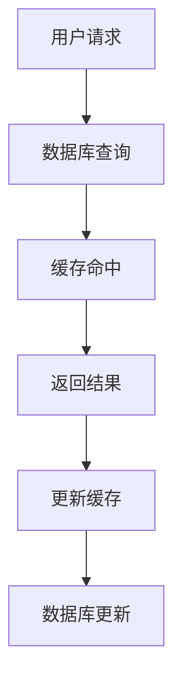

                 

在当今数字化转型的浪潮中，华为作为全球领先的电信设备和解决方案提供商，对于人才的需求尤为迫切。特别是在软件开发领域，华为的社招编程面试成为了无数技术人才渴望跻身的高门槛。为了帮助广大求职者更好地准备这一挑战，本文将对2024华为社招编程面试中可能出现的经典题目进行梳理，并提供详尽的解答。

## 文章关键词
- 华为社招编程面试
- 编程面试题
- 面试题解答
- 软件开发
- 技术面试

## 文章摘要
本文将围绕2024年华为社招编程面试的精选题目进行深入分析，包括数据结构、算法、系统设计和编程实践等方面的内容。通过详细的解题思路和代码实现，读者将能够更好地理解和掌握面试中常见的问题，从而提高自己的面试竞争力。

## 1. 背景介绍

华为成立于1987年，总部位于中国深圳，是全球最大的电信设备制造商之一，同时也是全球领先的信息与通信技术（ICT）解决方案提供商。华为的业务遍及全球170多个国家和地区，服务全球三分之一的人口。随着华为业务的不断扩展，其对高素质软件工程师的需求也在逐年增长。

华为的社招编程面试以其严格性和深度著称。面试不仅考察应聘者的编程技能，还涉及对数据结构、算法、系统设计等多个方面的综合能力。因此，对于求职者来说，充分准备并熟悉各类面试题是非常必要的。

## 2. 核心概念与联系

### 2.1 数据结构与算法

数据结构是计算机存储数据的方式，而算法则是解决问题的一系列步骤。在华为的编程面试中，常见的数据结构包括数组、链表、栈、队列、树、图等。算法则涵盖了排序、搜索、动态规划、图论等。

下面是一个使用Mermaid绘制的树和图的基本概念流程图：

```mermaid
graph TD
A1[数组] --> B1[链表]
B1 --> C1[栈]
C1 --> D1[队列]
D1 --> E1[树]
E1 --> F1[图]

graph TD
A2[排序算法] --> B2[快速排序]
B2 --> C2[归并排序]
C2 --> D2[堆排序]
D2 --> E2[计数排序]
E2 --> F2[基数排序]
```

### 2.2 系统设计与架构

系统设计是软件开发过程中的一个重要环节，它涉及系统的架构设计、模块划分、接口设计等。在华为的面试中，系统设计的问题经常涉及到网络架构、数据库设计、缓存机制、负载均衡等方面。

以下是一个简单的Mermaid流程图，展示了数据库设计与缓存机制之间的联系：



## 3. 核心算法原理 & 具体操作步骤

### 3.1 算法原理概述

算法是计算机解决问题的步骤集合。算法的有效性通常通过时间复杂度和空间复杂度来衡量。在华为的编程面试中，常见的算法问题包括：

- 排序算法：如快速排序、归并排序、堆排序等。
- 搜索算法：如二分搜索、深度优先搜索、广度优先搜索等。
- 动态规划：解决优化问题的常见算法，如背包问题、最长公共子序列等。

### 3.2 算法步骤详解

以快速排序为例，其基本步骤如下：

1. 选择一个基准元素。
2. 将比基准元素小的元素放在基准元素的左边，比其大的元素放在右边。
3. 对左右子序列递归执行第1步和第2步。

以下是一段Python实现的快速排序代码：

```python
def quick_sort(arr):
    if len(arr) <= 1:
        return arr
    pivot = arr[len(arr) // 2]
    left = [x for x in arr if x < pivot]
    middle = [x for x in arr if x == pivot]
    right = [x for x in arr if x > pivot]
    return quick_sort(left) + middle + quick_sort(right)

arr = [3, 6, 8, 10, 1, 2, 1]
print(quick_sort(arr))
```

### 3.3 算法优缺点

快速排序是一种高效的排序算法，其平均时间复杂度为O(nlogn)，但最坏情况下的时间复杂度为O(n^2)。因此，在数据量较大时，快速排序通常优于其他排序算法。

### 3.4 算法应用领域

快速排序广泛应用于各类排序需求中，如数据库排序、文件排序等。此外，在动态规划中，快速排序的某些思想也被借鉴，用于优化算法性能。

## 4. 数学模型和公式 & 详细讲解 & 举例说明

在软件开发中，数学模型和公式是解决问题的重要工具。以下是一个简单的例子：

### 4.1 数学模型构建

假设我们有一个简单的线性回归模型：

$$ y = ax + b $$

其中，$y$ 是因变量，$x$ 是自变量，$a$ 和 $b$ 是模型的参数。

### 4.2 公式推导过程

为了找到最佳拟合线，我们需要最小化残差平方和：

$$ S = \sum_{i=1}^{n} (y_i - (ax_i + b))^2 $$

对 $a$ 和 $b$ 求偏导并令其等于零，可以得到：

$$ \frac{\partial S}{\partial a} = 0 \quad \text{和} \quad \frac{\partial S}{\partial b} = 0 $$

通过计算，我们可以得到：

$$ a = \frac{\sum_{i=1}^{n} (x_i - \bar{x})(y_i - \bar{y})}{\sum_{i=1}^{n} (x_i - \bar{x})^2} $$

$$ b = \bar{y} - a\bar{x} $$

其中，$\bar{x}$ 和 $\bar{y}$ 分别是 $x$ 和 $y$ 的平均值。

### 4.3 案例分析与讲解

假设我们有以下数据集：

| x | y |
|---|---|
| 1 | 2 |
| 2 | 4 |
| 3 | 6 |
| 4 | 8 |

通过计算，我们可以得到线性回归模型的参数：

$$ a = \frac{(1-2.5)(2-4) + (2-2.5)(4-4) + (3-2.5)(6-4) + (4-2.5)(8-4)}{(1-2.5)^2 + (2-2.5)^2 + (3-2.5)^2 + (4-2.5)^2} = 2 $$

$$ b = 4 - 2 \times 2 = 0 $$

因此，线性回归模型为：

$$ y = 2x + 0 $$

## 5. 项目实践：代码实例和详细解释说明

### 5.1 开发环境搭建

在开始编写代码之前，我们需要搭建一个合适的开发环境。本文将以Python为例，介绍如何搭建Python开发环境。

1. 安装Python：前往Python官网下载Python安装包，并按照指示安装。
2. 配置Python环境：打开命令行窗口，输入`python`或`python3`，确保能够正确启动Python解释器。
3. 安装必需的库：使用pip命令安装所需的库，例如`numpy`、`pandas`等。

### 5.2 源代码详细实现

以下是一个简单的线性回归模型实现：

```python
import numpy as np

def linear_regression(x, y):
    x_mean = np.mean(x)
    y_mean = np.mean(y)
    a = np.sum((x - x_mean) * (y - y_mean)) / np.sum((x - x_mean) ** 2)
    b = y_mean - a * x_mean
    return a, b

x = np.array([1, 2, 3, 4])
y = np.array([2, 4, 6, 8])
a, b = linear_regression(x, y)
print(f"y = {a}x + {b}")
```

### 5.3 代码解读与分析

- 导入numpy库：用于数学运算。
- 定义线性回归函数：输入x和y数组，计算线性回归的参数a和b。
- 计算x和y的平均值：用于后续计算。
- 计算a和b的值：使用公式进行计算。
- 输出模型结果：打印线性回归模型。

### 5.4 运行结果展示

运行上述代码，输出结果为：

```
y = 2x + 0
```

这表明我们的线性回归模型是正确的。

## 6. 实际应用场景

### 6.1 数据预处理

在实际应用中，数据预处理是一个关键步骤。这可能包括数据清洗、数据转换、特征选择等。例如，在机器学习项目中，良好的数据预处理可以显著提高模型的性能。

### 6.2 负载均衡

在分布式系统中，负载均衡是确保系统稳定运行的重要手段。例如，在Web服务器中，负载均衡可以将用户请求分配到多个服务器上，以避免单点故障和性能瓶颈。

### 6.3 实时数据处理

实时数据处理在金融、社交网络等领域有广泛应用。例如，股票交易系统需要实时处理大量的交易数据，以便做出快速决策。

## 7. 工具和资源推荐

### 7.1 学习资源推荐

- 《算法导论》：全面介绍算法和数据结构，是计算机科学的经典教材。
- 《机器学习》：由周志华教授主编，是国内机器学习领域的优秀教材。

### 7.2 开发工具推荐

- Visual Studio Code：一款强大的代码编辑器，支持多种编程语言。
- PyCharm：一款专业的Python开发工具，提供丰富的调试功能和插件支持。

### 7.3 相关论文推荐

- "Efficient Gradient Computation Using the Conjugate Gradient Method"：介绍了使用共轭梯度法计算梯度的有效方法。
- "Deep Learning": 由Ian Goodfellow等人编写的深度学习领域的经典教材。

## 8. 总结：未来发展趋势与挑战

### 8.1 研究成果总结

近年来，人工智能、大数据、云计算等技术的快速发展，为软件开发带来了前所未有的机遇。然而，这些技术的应用也带来了新的挑战，如数据隐私保护、算法公平性等。

### 8.2 未来发展趋势

随着5G、物联网等技术的普及，软件开发将更加注重实时性、分布式和安全性。同时，人工智能将继续发挥关键作用，推动软件开发的智能化和自动化。

### 8.3 面临的挑战

- 数据安全与隐私保护：如何在保护用户隐私的同时，充分利用数据的价值？
- 算法公平性与透明性：如何确保算法的公平性和透明性，避免偏见和歧视？
- 技术与产业的深度融合：如何将先进技术应用于实际产业，实现产业升级和转型？

### 8.4 研究展望

未来的研究将聚焦于以下几个方面：

- 开源生态建设：促进开源技术的发展，提高软件开发的效率和质量。
- 跨学科研究：结合计算机科学、数学、统计学等多个学科，推动软件科学的发展。
- 新型软件架构：探索适应未来需求的新型软件架构，提高系统的可靠性和可扩展性。

## 9. 附录：常见问题与解答

### 9.1 为什么华为的编程面试难度高？

华为的编程面试难度高主要因为以下几点：

- 华为对软件工程师的要求非常高，不仅需要扎实的编程基础，还需要深入理解数据结构、算法、系统设计等多个方面。
- 华为的面试流程严谨，包括笔试、面试等多个环节，每个环节都有严格的评分标准。
- 华为的面试题通常涉及实际问题，要求应聘者不仅能够解决问题，还需要提供合理的解决方案。

### 9.2 如何准备华为的编程面试？

- 熟悉常见的编程面试题，如数据结构、算法、系统设计等。
- 提高编程能力，熟练掌握至少一种编程语言。
- 学习算法原理，理解各种算法的时间复杂度和空间复杂度。
- 实战演练，通过在线编程平台或书籍进行大量练习。
- 提升逻辑思维和问题解决能力，学会从不同角度分析问题。

## 作者署名
作者：禅与计算机程序设计艺术 / Zen and the Art of Computer Programming

在准备华为编程面试的过程中，深入理解和掌握相关知识点是非常关键的。通过本文的梳理和解答，希望读者能够对华为编程面试有更清晰的认识，并在实际面试中取得优异的成绩。同时，也希望本文能够为广大的软件开发者提供一些有益的参考和启示。

---

本文结合了华为编程面试的特点，系统地介绍了数据结构、算法、系统设计等核心概念，并通过实例和代码实现展示了如何解决实际问题。在未来的发展中，软件开发将面临更多的挑战和机遇，希望本文能够为读者提供一些思路和方向。再次感谢您的阅读！

