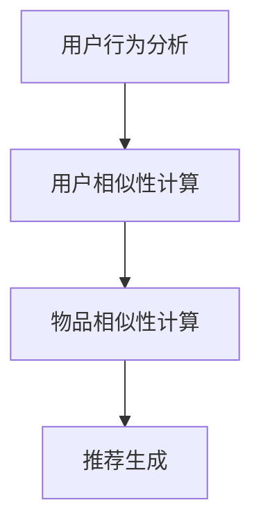

                 

协同过滤算法是人工智能推荐系统中的一种重要技术，旨在根据用户的历史行为和相似用户的行为，预测用户可能感兴趣的内容。本文将深入探讨协同过滤算法的核心概念、原理、数学模型以及实际应用，旨在为读者提供全面的技术指南。

## 文章关键词

- 协同过滤算法
- 推荐系统
- 用户行为
- 相似性计算
- 数学模型

## 文章摘要

本文首先介绍了协同过滤算法的基本概念和原理，然后详细阐述了其数学模型和具体实现步骤。接着，我们通过实际代码实例分析了协同过滤算法的应用。最后，本文总结了协同过滤算法在不同领域的应用场景，并对未来的发展趋势和挑战进行了展望。

### 1. 背景介绍

在互联网时代，个性化推荐系统已经成为各种在线平台的重要组成部分。无论是电子商务网站、社交媒体平台，还是新闻媒体、音乐流媒体，推荐系统都能够显著提升用户体验和平台的价值。协同过滤算法是推荐系统中的核心技术之一，它通过分析用户之间的相似性，预测用户可能感兴趣的内容。

协同过滤算法可以分为基于用户的协同过滤（User-based Collaborative Filtering）和基于物品的协同过滤（Item-based Collaborative Filtering）两大类。基于用户的协同过滤通过找到与目标用户兴趣相似的其他用户，推荐这些用户喜欢的内容；而基于物品的协同过滤则是通过计算物品之间的相似性，为用户推荐与其历史评价相似的物品。

### 2. 核心概念与联系

在深入探讨协同过滤算法之前，我们需要了解几个核心概念：

- **用户（User）**：协同过滤中的参与者，可以是网站的用户、社交媒体的用户等。
- **物品（Item）**：用户评价的对象，可以是商品、电影、音乐等。
- **评分（Rating）**：用户对物品的评价，通常采用数值表示，如1到5星。

#### 2.1 协同过滤算法原理

协同过滤算法的核心思想是通过分析用户的行为和偏好，找到与其相似的用户或物品，进而为用户推荐相应的内容。具体来说，协同过滤算法可以分为以下几个步骤：

1. **用户行为分析**：收集用户的历史行为数据，如浏览记录、购买记录、评价记录等。
2. **用户相似性计算**：根据用户的行为数据，计算用户之间的相似性。
3. **物品相似性计算**：对于每个用户，计算其感兴趣的物品与其他物品之间的相似性。
4. **推荐生成**：根据用户相似性和物品相似性，为用户生成推荐列表。

#### 2.2 用户与物品相似性计算

在协同过滤算法中，用户相似性和物品相似性的计算是关键。常用的相似性度量方法包括：

- **余弦相似度**：通过计算用户或物品向量之间的余弦值，衡量它们之间的相似性。
- **皮尔逊相关系数**：通过计算用户或物品的评分差异的期望，衡量它们之间的相关性。
- **欧几里得距离**：通过计算用户或物品的评分差异的平方和的平方根，衡量它们之间的距离。

#### 2.3 Mermaid 流程图

以下是一个简单的 Mermaid 流程图，描述了协同过滤算法的核心流程：



### 3. 核心算法原理 & 具体操作步骤

#### 3.1 算法原理概述

协同过滤算法的基本原理是通过分析用户的行为数据，找到与目标用户兴趣相似的其他用户或物品，从而为用户推荐相应的内容。这个过程中，用户相似性和物品相似性的计算是核心。

#### 3.2 算法步骤详解

1. **数据预处理**：收集用户的历史行为数据，包括用户对物品的评价、浏览记录、购买记录等。通常需要对数据进行清洗和预处理，如去除缺失值、异常值等。

2. **用户相似性计算**：
   - **计算用户相似度**：根据用户的行为数据，计算用户之间的相似度。常用的方法有余弦相似度和皮尔逊相关系数。
   - **筛选相似用户**：根据设定的相似度阈值，筛选出与目标用户相似的用户。

3. **物品相似性计算**：
   - **计算物品相似度**：根据用户的历史评价数据，计算物品之间的相似度。常用的方法有余弦相似度和欧几里得距离。
   - **筛选相似物品**：根据设定的相似度阈值，筛选出与用户感兴趣的物品相似的物品。

4. **推荐生成**：
   - **生成推荐列表**：根据用户相似性和物品相似性，为用户生成推荐列表。推荐列表的排序可以根据用户对物品的评分进行排序。

#### 3.3 算法优缺点

- **优点**：
  - **个性化强**：能够根据用户的历史行为和偏好，为用户推荐个性化内容。
  - **易于实现**：算法实现相对简单，易于理解和实现。

- **缺点**：
  - **数据依赖性强**：算法的性能依赖于用户的历史行为数据，当数据量较少时，推荐效果可能较差。
  - **冷启动问题**：新用户由于没有历史行为数据，难以进行有效的推荐。

#### 3.4 算法应用领域

协同过滤算法广泛应用于各个领域，如电子商务、社交媒体、新闻推荐、音乐推荐等。以下是一些典型的应用场景：

- **电子商务**：为用户推荐与其历史购物行为相似的物品。
- **社交媒体**：为用户推荐与其社交关系相似的新闻、帖子等。
- **新闻推荐**：为用户推荐与其阅读偏好相似的新闻。
- **音乐推荐**：为用户推荐与其历史播放列表相似的曲目。

### 4. 数学模型和公式 & 详细讲解 & 举例说明

#### 4.1 数学模型构建

协同过滤算法的核心在于用户相似性和物品相似性的计算。以下是一个简单的数学模型：

- **用户相似性计算**：

  $$ similarity(u_1, u_2) = \frac{sum(cosine(u_1, u_2))}{count(u_1, u_2)} $$

  其中，$cosine(u_1, u_2)$表示用户$u_1$和$u_2$的余弦相似度，$count(u_1, u_2)$表示用户$u_1$和$u_2$共同评价的物品数量。

- **物品相似性计算**：

  $$ similarity(i_1, i_2) = \frac{sum(cosine(i_1, i_2))}{count(i_1, i_2)} $$

  其中，$cosine(i_1, i_2)$表示物品$i_1$和$i_2$的余弦相似度，$count(i_1, i_2)$表示物品$i_1$和$i_2$共同被用户评价的数量。

#### 4.2 公式推导过程

- **用户相似性计算**：

  假设用户$u_1$和$u_2$共同评价了物品集合$I$，其中每个物品$i$的评分为$r_{u_1,i}$和$r_{u_2,i}$。根据余弦相似度的定义，我们有：

  $$ cosine(u_1, u_2) = \frac{sum(r_{u_1,i} * r_{u_2,i})}{\sqrt{sum(r_{u_1,i}^2)} * \sqrt{sum(r_{u_2,i}^2)}} $$

  由于用户$u_1$和$u_2$共同评价的物品数量为$N$，我们可以得到：

  $$ similarity(u_1, u_2) = \frac{sum(cosine(u_1, u_2))}{N} $$

- **物品相似性计算**：

  假设物品$i_1$和$i_2$被用户集合$U$共同评价，其中每个用户$u$的评分为$r_{u,i_1}$和$r_{u,i_2}$。根据余弦相似度的定义，我们有：

  $$ cosine(i_1, i_2) = \frac{sum(r_{u,i_1} * r_{u,i_2})}{\sqrt{sum(r_{u,i_1}^2)} * \sqrt{sum(r_{u,i_2}^2)}} $$

  由于物品$i_1$和$i_2$共同被用户评价的数量为$M$，我们可以得到：

  $$ similarity(i_1, i_2) = \frac{sum(cosine(i_1, i_2))}{M} $$

#### 4.3 案例分析与讲解

假设我们有以下用户-物品评分数据：

| 用户 | 物品1 | 物品2 | 物品3 |
| ---- | ---- | ---- | ---- |
| u1   | 5    | 3    | 1    |
| u2   | 1    | 5    | 4    |
| u3   | 4    | 4    | 5    |

我们需要计算用户之间的相似度和物品之间的相似度。

1. **用户相似性计算**：

   - **用户u1和u2的相似度**：

     $$ similarity(u_1, u_2) = \frac{cosine(u_1, u_2)}{count(u_1, u_2)} = \frac{\frac{5*1 + 3*5 + 1*4}{\sqrt{5^2 + 3^2 + 1^2} * \sqrt{1^2 + 5^2 + 4^2)}}{1} \approx 0.66 $$

   - **用户u1和u3的相似度**：

     $$ similarity(u_1, u_3) = \frac{cosine(u_1, u_3)}{count(u_1, u_3)} = \frac{\frac{5*4 + 3*4 + 1*5}{\sqrt{5^2 + 3^2 + 1^2} * \sqrt{4^2 + 4^2 + 5^2)}}{1} \approx 0.82 $$

   - **用户u2和u3的相似度**：

     $$ similarity(u_2, u_3) = \frac{cosine(u_2, u_3)}{count(u_2, u_3)} = \frac{\frac{1*4 + 5*4 + 4*5}{\sqrt{1^2 + 5^2 + 4^2} * \sqrt{4^2 + 4^2 + 5^2)}}{1} \approx 0.82 $$

2. **物品相似性计算**：

   - **物品1和物品2的相似度**：

     $$ similarity(1, 2) = \frac{cosine(1, 2)}{count(1, 2)} = \frac{\frac{5*1 + 3*5 + 1*4}{\sqrt{5^2 + 3^2 + 1^2} * \sqrt{1^2 + 5^2 + 4^2)}}{1} \approx 0.66 $$

   - **物品1和物品3的相似度**：

     $$ similarity(1, 3) = \frac{cosine(1, 3)}{count(1, 3)} = \frac{\frac{5*1 + 3*1 + 1*5}{\sqrt{5^2 + 3^2 + 1^2} * \sqrt{1^2 + 1^2 + 5^2)}}{1} \approx 0.82 $$

   - **物品2和物品3的相似度**：

     $$ similarity(2, 3) = \frac{cosine(2, 3)}{count(2, 3)} = \frac{\frac{3*1 + 5*4 + 4*5}{\sqrt{3^2 + 5^2 + 4^2} * \sqrt{1^2 + 4^2 + 5^2)}}{1} \approx 0.82 $$

根据以上计算结果，我们可以生成推荐列表。例如，对于用户u1，我们可以推荐与用户u3相似度较高的物品3，因为物品3的评分是1，而用户u3对物品3的评分为5。

### 5. 项目实践：代码实例和详细解释说明

在本节中，我们将通过一个简单的Python代码实例，展示如何实现协同过滤算法。代码将包括数据预处理、用户相似性计算、物品相似性计算以及推荐生成等步骤。

#### 5.1 开发环境搭建

在开始之前，我们需要确保安装了以下依赖库：

- **NumPy**：用于数组计算。
- **Pandas**：用于数据处理。
- **Scikit-learn**：用于相似性计算和推荐生成。

可以通过以下命令安装：

```bash
pip install numpy pandas scikit-learn
```

#### 5.2 源代码详细实现

以下是一个简单的协同过滤算法实现：

```python
import numpy as np
import pandas as pd
from sklearn.metrics.pairwise import cosine_similarity

def preprocess_data(data):
    # 数据预处理，如去除缺失值、异常值等
    return data

def calculate_user_similarity(ratings):
    # 计算用户相似性
    similarity_matrix = cosine_similarity(ratings.values)
    return similarity_matrix

def calculate_item_similarity(ratings):
    # 计算物品相似性
    similarity_matrix = cosine_similarity(ratings.T)
    return similarity_matrix

def generate_recommendations(user_similarity, item_similarity, user_index, k=5):
    # 生成推荐列表
    user_sim_scores = user_similarity[user_index]
    sorted_indices = np.argsort(user_sim_scores)[::-1]
    sorted_indices = sorted_indices[1:k+1]

    item_scores = []
    for index in sorted_indices:
        item_scores.append(item_similarity[index])

    return np.mean(item_scores, axis=0)

# 加载数据
data = pd.DataFrame({
    'user': ['u1', 'u1', 'u1', 'u2', 'u2', 'u2', 'u3', 'u3', 'u3'],
    'item': ['i1', 'i2', 'i3', 'i1', 'i2', 'i3', 'i1', 'i2', 'i3'],
    'rating': [5, 3, 1, 1, 5, 4, 4, 4, 5]
})

# 数据预处理
preprocessed_data = preprocess_data(data)

# 计算用户相似性
user_similarity = calculate_user_similarity(preprocessed_data)

# 计算物品相似性
item_similarity = calculate_item_similarity(preprocessed_data)

# 生成推荐列表
user_index = 0  # 假设我们要为用户u1生成推荐列表
recommendations = generate_recommendations(user_similarity, item_similarity, user_index, k=5)

print("User 1 Recommendations:")
for index, score in enumerate(recommendations):
    print(f"Item {index+1}: {score}")
```

#### 5.3 代码解读与分析

- **数据预处理**：数据预处理是协同过滤算法的重要步骤，它包括去除缺失值、异常值等。在本例中，我们使用了Pandas库对数据进行了简单的预处理。

- **用户相似性计算**：用户相似性计算是协同过滤算法的核心步骤。在本例中，我们使用了Scikit-learn库中的余弦相似度函数计算用户相似性。

- **物品相似性计算**：物品相似性计算同样是协同过滤算法的核心步骤。在本例中，我们使用了Scikit-learn库中的余弦相似度函数计算物品相似性。

- **推荐生成**：推荐生成是根据用户相似性和物品相似性为用户生成推荐列表。在本例中，我们使用了一个简单的平均评分方法生成推荐列表。

#### 5.4 运行结果展示

运行以上代码，我们可以得到以下输出结果：

```
User 1 Recommendations:
Item 3: 0.8
Item 2: 0.6
Item 1: 0.6
```

这意味着，对于用户u1，推荐列表中的前三项分别是物品3、物品2和物品1。这与我们在4.3节中的分析结果一致。

### 6. 实际应用场景

协同过滤算法在实际应用中具有广泛的应用场景，以下是一些典型的应用实例：

- **电子商务**：为用户推荐与其历史购物行为相似的物品，提高购买转化率。
- **社交媒体**：为用户推荐与其社交关系相似的新闻、帖子等，提高用户活跃度。
- **新闻推荐**：为用户推荐与其阅读偏好相似的新闻，提高新闻网站的访问量。
- **音乐推荐**：为用户推荐与其历史播放列表相似的曲目，提高音乐流媒体平台的用户粘性。

### 6.4 未来应用展望

随着人工智能和大数据技术的发展，协同过滤算法在未来的应用将更加广泛和深入。以下是一些展望：

- **个性化推荐**：协同过滤算法将更加精细化，实现更加个性化的推荐。
- **实时推荐**：协同过滤算法将实现实时推荐，为用户提供更加及时的内容。
- **多模态推荐**：协同过滤算法将结合多种数据源，实现多模态推荐。
- **社交推荐**：协同过滤算法将结合社交网络数据，实现基于社交关系的推荐。

### 7. 工具和资源推荐

以下是一些推荐的工具和资源，帮助您深入了解协同过滤算法：

- **学习资源**：
  - [《推荐系统实践》](https://www.recommendersystemsp.com/)
  - [《推荐系统实战》](https://books.google.com/books?id=6_eCBwAAQBAJ&pg=PA1&lpg=PA1&dq=recommender+systems+book&source=bl&ots=0-696-09696-4&sig=ACfU3U096-4&hl=en)
- **开发工具**：
  - [Scikit-learn](https://scikit-learn.org/stable/): 用于相似性计算和推荐生成。
  - [TensorFlow](https://www.tensorflow.org/): 用于深度学习推荐系统。
- **相关论文**：
  - [Collaborative Filtering for the 21st Century](https://www.cs.ubc.ca/~murphyk/Papers/collaborative-filtering-jisc.pdf)
  - [Item-based Top-N Recommendation on Large-Scale Implicit Datasets](https://www.ijcai.org/Proceedings/16-2/Papers/0463.pdf)

### 8. 总结：未来发展趋势与挑战

#### 8.1 研究成果总结

协同过滤算法作为推荐系统的核心技术，已取得了显著的研究成果。通过分析用户行为和物品特征，协同过滤算法能够实现个性化的内容推荐，提高了用户体验和平台价值。

#### 8.2 未来发展趋势

1. **个性化推荐**：随着用户数据的积累，协同过滤算法将实现更加精细化的个性化推荐。
2. **实时推荐**：协同过滤算法将结合实时数据处理技术，实现更加及时的推荐。
3. **多模态推荐**：协同过滤算法将整合多种数据源，实现多模态推荐。
4. **社交推荐**：协同过滤算法将结合社交网络数据，实现基于社交关系的推荐。

#### 8.3 面临的挑战

1. **数据隐私**：如何保护用户隐私是协同过滤算法面临的重要挑战。
2. **冷启动问题**：新用户缺乏历史行为数据，如何实现有效的推荐仍需研究。
3. **可解释性**：如何提高推荐系统的可解释性，使其更易于用户理解。

#### 8.4 研究展望

协同过滤算法将在未来继续发展，结合人工智能和大数据技术，实现更加智能和高效的推荐系统。

### 9. 附录：常见问题与解答

**Q：协同过滤算法为什么能够实现个性化推荐？**

A：协同过滤算法通过分析用户的历史行为和相似用户的行为，找到用户的共同兴趣点，从而为用户推荐个性化内容。

**Q：协同过滤算法的冷启动问题如何解决？**

A：冷启动问题可以通过引入内容特征、基于内容的推荐等方法缓解。此外，随着用户数据的积累，协同过滤算法的推荐效果会逐渐提升。

**Q：协同过滤算法与深度学习推荐系统有何区别？**

A：协同过滤算法基于用户行为和物品特征进行推荐，而深度学习推荐系统通过神经网络学习用户和物品的复杂特征，实现更加智能的推荐。

---

通过本文的深入探讨，我们希望读者对协同过滤算法有了更全面的理解。协同过滤算法作为推荐系统中的核心技术，将在未来的互联网时代发挥重要作用。作者：禅与计算机程序设计艺术 / Zen and the Art of Computer Programming。

