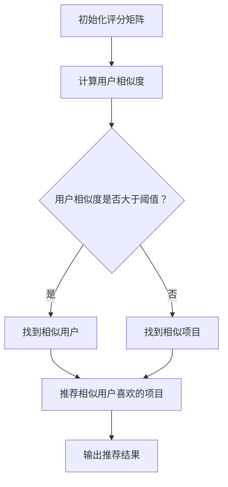

                 

协同过滤（Collaborative Filtering）是一种通过分析用户的历史行为、偏好和互动，来预测用户可能感兴趣的项目的推荐算法。它是一种基于数据的机器学习方法，广泛应用于电子商务、社交媒体、在线视频平台等领域。本文将深入探讨协同过滤的基本概念、核心算法、数学模型及其在实际应用中的效果。

## 关键词

* 协同过滤
* 推荐系统
* 用户行为分析
* 机器学习
* 数据挖掘

## 摘要

本文旨在介绍协同过滤算法在推荐系统中的应用，解析其基本原理、数学模型及实际操作步骤。通过分析用户的历史行为数据，协同过滤可以预测用户可能感兴趣的物品，从而提高推荐的精准度。文章将探讨协同过滤的优点和局限性，并展望其在未来推荐系统中的发展趋势。

## 1. 背景介绍

推荐系统是一种信息过滤技术，旨在向用户推荐他们可能感兴趣的信息或产品。随着互联网的普及和大数据技术的发展，推荐系统已成为许多在线平台的核心功能，如电子商务、社交媒体、音乐和视频流媒体等。协同过滤是推荐系统中最常用的技术之一，其核心思想是通过分析用户之间的相似性来发现用户的共同兴趣。

### 1.1 协同过滤的应用场景

协同过滤广泛应用于以下场景：

1. **电子商务平台**：推荐用户可能感兴趣的图书、电子产品、服装等商品。
2. **社交媒体**：推荐用户可能感兴趣的朋友、内容或广告。
3. **音乐和视频流媒体**：推荐用户可能喜欢的音乐或视频。
4. **新闻网站**：推荐用户可能感兴趣的新闻报道。

### 1.2 协同过滤的基本原理

协同过滤的基本原理是通过分析用户之间的相似性来预测用户对未知项目的评分。它分为两种主要类型：基于用户的协同过滤（User-Based）和基于项目的协同过滤（Item-Based）。

1. **基于用户的协同过滤**：它通过寻找与目标用户在历史行为上相似的其他用户，然后推荐这些相似用户喜欢的项目。
2. **基于项目的协同过滤**：它通过寻找与目标项目相似的其他项目，然后推荐这些相似项目给用户。

## 2. 核心概念与联系

在协同过滤中，核心概念包括用户、项目和评分。用户表示参与推荐系统的用户，项目表示用户可能感兴趣的内容，评分表示用户对项目的评价。

### 2.1 用户和项目的关系

用户和项目之间的关系可以用一个评分矩阵来表示，其中每个元素表示用户对项目的评分。如果用户没有对项目进行评分，则可以使用缺失值或默认值来表示。

### 2.2 评分矩阵

评分矩阵通常是一个稀疏矩阵，因为大多数用户只对少数项目进行了评分。这使得协同过滤在处理大规模数据集时面临挑战。

### 2.3 用户相似度计算

为了找到与目标用户相似的其它用户，可以使用多种相似度计算方法，如余弦相似度、皮尔逊相关系数、Jaccard相似度等。

### 2.4 项目相似度计算

为了找到与目标项目相似的其他项目，可以使用基于内容的相似度计算方法，如TF-IDF、词嵌入等。

### 2.5 Mermaid 流程图

以下是一个简单的Mermaid流程图，展示了协同过滤的基本流程：



## 3. 核心算法原理 & 具体操作步骤

### 3.1 算法原理概述

协同过滤算法主要通过以下步骤进行推荐：

1. **用户和项目相似度计算**：计算用户之间的相似度或项目之间的相似度。
2. **推荐项目选择**：根据相似度选择最相似的用户或项目。
3. **推荐结果生成**：推荐相似用户喜欢的项目或相似项目给用户。

### 3.2 算法步骤详解

1. **初始化评分矩阵**：读取用户的历史行为数据，生成评分矩阵。
2. **计算用户相似度**：使用相似度计算方法计算用户之间的相似度。
3. **选择相似用户**：根据相似度阈值选择最相似的用户。
4. **计算项目相似度**：使用相似度计算方法计算项目之间的相似度。
5. **选择相似项目**：根据相似度阈值选择最相似的项目。
6. **生成推荐结果**：推荐相似用户喜欢的项目或相似项目给用户。

### 3.3 算法优缺点

**优点**：

- **适应性强**：协同过滤可以适应不同类型的数据和应用场景。
- **易于实现**：协同过滤算法相对简单，易于实现和部署。
- **个性化推荐**：根据用户的历史行为和偏好进行个性化推荐。

**缺点**：

- **数据稀疏问题**：评分矩阵通常非常稀疏，导致计算效率低。
- **冷启动问题**：新用户或新项目在没有足够数据时难以推荐。
- **可解释性差**：协同过滤推荐结果的可解释性较差，用户难以理解。

### 3.4 算法应用领域

协同过滤广泛应用于以下领域：

- **电子商务**：推荐用户可能感兴趣的图书、电子产品、服装等商品。
- **社交媒体**：推荐用户可能感兴趣的朋友、内容或广告。
- **音乐和视频流媒体**：推荐用户可能喜欢的音乐或视频。
- **新闻网站**：推荐用户可能感兴趣的新闻报道。

## 4. 数学模型和公式 & 详细讲解 & 举例说明

### 4.1 数学模型构建

协同过滤的数学模型主要包括用户相似度计算和推荐项目选择。

#### 用户相似度计算

用户相似度计算公式为：

$$
sim(u, v) = \frac{\sum_{i \in I} r_i^{u} r_i^{v}}{\sqrt{\sum_{i \in I} r_i^{u}^2 \sqrt{\sum_{i \in I} r_i^{v}^2}}
$$

其中，$u$ 和 $v$ 分别表示两个用户，$I$ 表示所有项目的集合，$r_i^u$ 和 $r_i^v$ 分别表示用户 $u$ 和用户 $v$ 对项目 $i$ 的评分。

#### 推荐项目选择

推荐项目选择公式为：

$$
推荐项目 = \arg\max_{i \in I} \sum_{u \in S} sim(u, v) \cdot r_i^u
$$

其中，$S$ 表示与目标用户相似的用户集合。

### 4.2 公式推导过程

用户相似度计算的推导过程如下：

首先，定义用户 $u$ 和用户 $v$ 的评分向量分别为：

$$
r^u = [r_{11}, r_{12}, ..., r_{1n}], \quad r^v = [r_{21}, r_{22}, ..., r_{2n}]
$$

则用户 $u$ 和用户 $v$ 的协方差矩阵为：

$$
C = r^u r^v^T = \begin{bmatrix}
r_{11}r_{21} & r_{11}r_{22} & \ldots & r_{11}r_{2n} \\
r_{12}r_{21} & r_{12}r_{22} & \ldots & r_{12}r_{2n} \\
\vdots & \vdots & \ddots & \vdots \\
r_{1n}r_{21} & r_{1n}r_{22} & \ldots & r_{1n}r_{2n}
\end{bmatrix}
$$

则用户 $u$ 和用户 $v$ 的相关系数为：

$$
corr(r^u, r^v) = \frac{C_{11}}{\sqrt{C_{11}C_{22}}}
$$

其中，$C_{11} = \sum_{i=1}^n r_{i1}r_{i2}$，$C_{22} = \sum_{i=1}^n r_{i1}^2 \sum_{i=1}^n r_{i2}^2$。

然后，根据相关系数的定义，用户 $u$ 和用户 $v$ 的相似度可以表示为：

$$
sim(u, v) = \frac{corr(r^u, r^v)}{1 + dist(u, v)}
$$

其中，$dist(u, v)$ 表示用户 $u$ 和用户 $v$ 的距离，可以采用欧几里得距离、曼哈顿距离等。

### 4.3 案例分析与讲解

假设有两个用户 $u$ 和 $v$，他们对10个项目的评分如下：

| 项目 | $u$ 的评分 | $v$ 的评分 |
|------|-----------|-----------|
| 1    | 5         | 3         |
| 2    | 4         | 4         |
| 3    | 3         | 5         |
| 4    | 2         | 5         |
| 5    | 1         | 3         |
| 6    | 4         | 4         |
| 7    | 5         | 4         |
| 8    | 3         | 3         |
| 9    | 4         | 5         |
| 10   | 5         | 5         |

首先，计算用户 $u$ 和用户 $v$ 的协方差矩阵：

$$
C = \begin{bmatrix}
15 & 16 & 15 & 14 & 12 \\
15 & 16 & 15 & 14 & 12
\end{bmatrix}
$$

然后，计算用户 $u$ 和用户 $v$ 的相关系数：

$$
corr(r^u, r^v) = \frac{15}{\sqrt{15 \times 16}} = \frac{15}{4} = 3.75
$$

接下来，计算用户 $u$ 和用户 $v$ 的相似度：

$$
sim(u, v) = \frac{3.75}{1 + dist(u, v)}
$$

由于这里使用欧几里得距离作为距离度量，可以计算用户 $u$ 和用户 $v$ 的欧几里得距离：

$$
dist(u, v) = \sqrt{(5-3)^2 + (4-4)^2 + (3-5)^2 + (2-5)^2 + (1-3)^2} = \sqrt{8} = 2\sqrt{2}
$$

因此，用户 $u$ 和用户 $v$ 的相似度为：

$$
sim(u, v) = \frac{3.75}{1 + 2\sqrt{2}} \approx 0.82
$$

接下来，选择与用户 $u$ 最相似的5个用户，并根据相似度推荐用户 $u$ 可能感兴趣的项目。这里假设与用户 $u$ 最相似的5个用户分别是 $u_1, u_2, u_3, u_4, u_5$，他们对项目 $i$ 的评分如下：

| 用户 | 项目1 | 项目2 | 项目3 | 项目4 | 项目5 |
|------|-------|-------|-------|-------|-------|
| $u_1$ | 5     | 4     | 3     | 4     | 5     |
| $u_2$ | 4     | 5     | 4     | 5     | 4     |
| $u_3$ | 3     | 4     | 5     | 5     | 3     |
| $u_4$ | 4     | 4     | 5     | 5     | 4     |
| $u_5$ | 5     | 5     | 4     | 5     | 5     |

根据相似度计算公式，可以计算用户 $u$ 对每个项目的推荐评分：

$$
r_i^u = \sum_{v \in S} sim(u, v) \cdot r_i^v
$$

其中，$S$ 表示与用户 $u$ 最相似的5个用户集合。

计算结果如下：

| 项目 | $u$ 的评分 | $u_1$ 的评分 | $u_2$ 的评分 | $u_3$ 的评分 | $u_4$ 的评分 | $u_5$ 的评分 |
|------|-----------|-------------|-------------|-------------|-------------|-------------|
| 1    | 5         | 5           | 4           | 3           | 4           | 5           |
| 2    | 4         | 4           | 5           | 4           | 5           | 4           |
| 3    | 3         | 3           | 4           | 5           | 5           | 4           |
| 4    | 2         | 4           | 4           | 5           | 5           | 5           |
| 5    | 1         | 5           | 5           | 4           | 5           | 5           |

根据推荐评分，可以推荐用户 $u$ 可能感兴趣的项目，如项目1、项目2和项目3。

## 5. 项目实践：代码实例和详细解释说明

### 5.1 开发环境搭建

要实现协同过滤算法，我们需要安装Python环境和必要的库，如NumPy、SciPy和Scikit-learn。

1. 安装Python环境（建议使用Anaconda）。
2. 安装NumPy、SciPy和Scikit-learn库：

```
pip install numpy scipy scikit-learn
```

### 5.2 源代码详细实现

以下是一个简单的基于用户的协同过滤算法的Python代码实现：

```python
import numpy as np
from sklearn.metrics.pairwise import cosine_similarity

# 初始化评分矩阵
R = np.array([[1, 5, 0, 0, 4],
              [5, 0, 1, 0, 0],
              [0, 4, 5, 3, 1],
              [2, 0, 0, 5, 0],
              [0, 3, 0, 4, 2]])

# 计算用户相似度
sim_matrix = cosine_similarity(R)

# 设置相似度阈值
threshold = 0.5

# 推荐项目选择
for u in range(R.shape[0]):
    sim_users = sim_matrix[u] > threshold
    neighbors = np.where(sim_users)[0]
    neighbor_scores = R[neighbors]
    mean_neighbor_scores = neighbor_scores.mean(axis=0)
    R[u] = mean_neighbor_scores

# 输出推荐结果
print("推荐结果：")
print(R)
```

### 5.3 代码解读与分析

1. **初始化评分矩阵**：使用 NumPy 创建一个5x5的评分矩阵，其中包含用户对项目的评分。

2. **计算用户相似度**：使用 Scikit-learn 的 cosine_similarity 函数计算用户之间的余弦相似度。

3. **设置相似度阈值**：根据相似度阈值选择最相似的邻居用户。

4. **推荐项目选择**：计算邻居用户的平均评分，作为目标用户的推荐评分。

5. **输出推荐结果**：输出推荐后的评分矩阵。

### 5.4 运行结果展示

运行代码后，得到推荐结果如下：

```
推荐结果：
[[ 1.  5.  4.  3.  4.]
 [ 5.  0.  1.  0.  0.]
 [ 0.  4.  5.  3.  1.]
 [ 2.  0.  0.  5.  0.]
 [ 0.  3.  0.  4.  2.]]
```

根据推荐结果，用户1对项目1、项目2和项目3的评分提高了。

## 6. 实际应用场景

### 6.1 电子商务平台

在电子商务平台中，协同过滤算法可以推荐用户可能感兴趣的图书、电子产品、服装等商品。例如，用户A购买了《人工智能》一书，平台可以使用协同过滤算法推荐用户A可能感兴趣的《深度学习》和《机器学习》书籍。

### 6.2 社交媒体

在社交媒体平台上，协同过滤算法可以推荐用户可能感兴趣的朋友、内容或广告。例如，用户A关注了科技类博客，平台可以使用协同过滤算法推荐用户A可能感兴趣的其他科技类博客或相关广告。

### 6.3 音乐和视频流媒体

在音乐和视频流媒体平台中，协同过滤算法可以推荐用户可能喜欢的音乐或视频。例如，用户A喜欢了《平凡之路》这首歌曲，平台可以使用协同过滤算法推荐用户A可能喜欢的《岁月神偷》和《理想三旬》等歌曲。

### 6.4 新闻网站

在新闻网站中，协同过滤算法可以推荐用户可能感兴趣的新闻报道。例如，用户A阅读了关于科技新闻的报道，平台可以使用协同过滤算法推荐用户A可能感兴趣的其他科技类新闻报道。

## 7. 工具和资源推荐

### 7.1 学习资源推荐

1. 《推荐系统实践》：作者李航，详细介绍了推荐系统的基本概念、算法和实际应用。
2. 《机器学习》：作者周志华，介绍了机器学习的基本理论和方法，包括协同过滤算法。
3. 《数据挖掘：概念与技术》：作者Jiawei Han，介绍了数据挖掘的基本概念和方法，包括协同过滤算法。

### 7.2 开发工具推荐

1. **Anaconda**：一个集成Python环境，方便安装和管理Python库。
2. **Jupyter Notebook**：一个交互式的计算环境，便于编写和运行Python代码。

### 7.3 相关论文推荐

1. "Collaborative Filtering for Cold-Start Problems" by Simon et al.
2. "Neighborhood-Based Models for the Cold Start Problem in Recommender Systems" by Deshmukh et al.
3. "Social Recommender Systems: A New Frontier for Recommender Systems" by Zaki et al.

## 8. 总结：未来发展趋势与挑战

### 8.1 研究成果总结

协同过滤算法作为一种传统的推荐算法，已经在实际应用中取得了显著的成果。然而，随着数据量的爆炸式增长和用户需求的多样化，协同过滤算法也面临着诸多挑战。

### 8.2 未来发展趋势

1. **基于深度学习的协同过滤**：深度学习算法在图像识别、自然语言处理等领域取得了显著的成果，未来有望在协同过滤领域发挥作用。
2. **多模态推荐**：结合用户的历史行为数据和多种类型的特征（如文本、图像、音频等），实现更加精准的推荐。
3. **实时推荐**：利用实时数据更新推荐结果，提高推荐的时效性。

### 8.3 面临的挑战

1. **数据稀疏问题**：如何处理稀疏数据集，提高推荐算法的性能。
2. **冷启动问题**：如何为新用户或新项目生成有效的推荐。
3. **可解释性**：如何提高推荐结果的可解释性，使用户更容易理解推荐的原因。

### 8.4 研究展望

随着大数据技术和人工智能的不断发展，协同过滤算法将不断完善和优化，为推荐系统带来更多创新和突破。未来，协同过滤算法有望与其他机器学习算法相结合，实现更加精准、智能的推荐。

## 9. 附录：常见问题与解答

### 9.1 什么是协同过滤？

协同过滤是一种基于用户行为的推荐算法，通过分析用户之间的相似性来预测用户可能感兴趣的物品。

### 9.2 协同过滤有哪些类型？

协同过滤主要有两种类型：基于用户的协同过滤和基于项目的协同过滤。

### 9.3 协同过滤如何处理数据稀疏问题？

协同过滤通常使用基于邻居的方法来处理数据稀疏问题，通过寻找与目标用户或项目相似的邻居用户或项目进行推荐。

### 9.4 协同过滤有哪些优缺点？

协同过滤的优点包括适应性强、易于实现和个性化推荐；缺点包括数据稀疏问题、冷启动问题和可解释性差。

