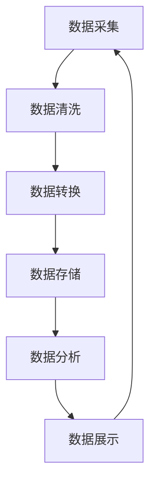

                 

关键词：数据处理、可视化、数据仓库、数据可视化工具、数据处理流程、数据处理框架、大数据、数据治理

> 摘要：本文深入探讨了可视化展示数据处理中心的设计和实现。通过分析数据处理流程、数据仓库架构、数据可视化工具及其应用，本文提出了一套完整的数据处理中心设计方案，并讨论了其在实际应用中的挑战和未来发展趋势。

## 1. 背景介绍

在当今信息时代，数据已经成为企业决策和业务运营的关键资源。随着数据量的爆发式增长，如何高效地处理和利用这些数据变得越来越重要。数据处理中心作为数据管理和分析的核心枢纽，其设计优劣直接影响到企业数据价值的最大化。可视化展示在数据处理中心中扮演着至关重要的角色，它不仅能够帮助企业更好地理解数据，还能提高数据决策的准确性和效率。

本文将围绕以下核心问题展开讨论：

1. 数据处理中心的基本架构和流程是怎样的？
2. 如何选择合适的数据可视化工具？
3. 如何在数据处理过程中优化数据展示效果？
4. 面对海量数据和复杂业务场景，数据处理中心应如何应对？

通过对上述问题的探讨，本文旨在为数据处理中心的设计和实现提供一套可行的方案，并展望其未来的发展趋势。

## 2. 核心概念与联系

### 2.1 数据处理中心的定义

数据处理中心（Data Processing Center，DPC）是指负责接收、处理、存储和分析数据的综合性系统。它通常由多个子系统组成，包括数据采集系统、数据存储系统、数据处理系统和数据展示系统。数据处理中心的设计和实现目标是确保数据的准确、高效和安全，以便为企业提供实时、全面和高质量的数据支持。

### 2.2 数据处理中心的架构

数据处理中心的架构可以分为以下几层：

1. **数据采集层**：负责从各种数据源（如数据库、日志文件、Web服务、传感器等）收集原始数据。
2. **数据存储层**：负责存储和管理采集到的数据，常见的存储技术包括关系数据库、NoSQL数据库、数据仓库等。
3. **数据处理层**：负责对数据进行清洗、转换、聚合等操作，以生成有价值的信息。
4. **数据展示层**：负责将处理后的数据以可视化的形式展示给用户，帮助用户理解数据并做出决策。

### 2.3 数据处理流程

数据处理流程通常包括以下步骤：

1. **数据采集**：通过API、ETL（提取、转换、加载）工具、Web爬虫等方式获取数据。
2. **数据清洗**：去除数据中的噪声和错误，确保数据质量。
3. **数据转换**：将数据转换为适合分析和存储的格式。
4. **数据存储**：将清洗和转换后的数据存储到数据库或数据仓库中。
5. **数据分析**：使用SQL、大数据处理框架（如Hadoop、Spark）等进行数据分析。
6. **数据展示**：将分析结果通过可视化工具（如Tableau、Power BI）展示给用户。

### 2.4 数据可视化工具

数据可视化工具是数据处理中心的重要组成部分，用于将数据以图表、仪表板等形式直观地展示给用户。常见的数据可视化工具有：

- **Tableau**：一款功能强大的数据可视化工具，支持多种数据连接和丰富的可视化图表类型。
- **Power BI**：微软推出的一款企业级数据可视化工具，与Microsoft Office系列软件集成良好。
- **QlikView**：一款基于数据可视化的平台，支持复杂的数据分析和实时数据展示。
- **D3.js**：一款基于JavaScript的数据可视化库，适合开发自定义数据可视化应用。

### 2.5 数据处理中心中的核心概念联系

数据处理中心的各个组成部分之间紧密联系，共同构成了一个完整的数据处理体系。数据采集、清洗、转换、存储、分析、展示等环节相互衔接，形成一个闭环。数据可视化工具作为展示环节的关键角色，与数据处理层、数据存储层等紧密配合，确保数据的实时性和准确性。

### 2.6 Mermaid 流程图

以下是一个简化的数据处理中心架构的 Mermaid 流程图：



在这个流程图中，每个节点代表数据处理的一个环节，箭头表示数据的流动方向。数据从数据采集层开始，经过清洗、转换、存储、分析等环节，最终通过数据可视化工具展示给用户，形成一个闭环。

## 3. 核心算法原理 & 具体操作步骤

### 3.1 算法原理概述

数据处理中心的核心算法主要涉及数据清洗、转换和分析等环节。以下将简要介绍这些算法的基本原理。

#### 3.1.1 数据清洗算法

数据清洗算法的主要目的是去除数据中的噪声和错误，确保数据质量。常见的数据清洗算法包括：

- **缺失值填充**：使用均值、中位数、最频值等方法填充缺失值。
- **异常值检测**：使用统计学方法（如标准差、箱线图）检测和去除异常值。
- **重复值删除**：删除重复的数据记录。

#### 3.1.2 数据转换算法

数据转换算法主要涉及数据格式的转换和数据类型的转换。常见的数据转换算法包括：

- **数据类型转换**：将字符串转换为数字、日期等类型。
- **数据格式转换**：将JSON、XML等格式转换为CSV、Excel等格式。
- **维度扩展**：将单维数据扩展为多维数据，以便进行更复杂的数据分析。

#### 3.1.3 数据分析算法

数据分析算法用于从数据中提取有价值的信息。常见的数据分析算法包括：

- **统计分析**：使用均值、中位数、方差等统计量描述数据特征。
- **机器学习算法**：使用分类、回归、聚类等算法发现数据中的模式和规律。

### 3.2 算法步骤详解

以下将详细描述数据处理中心中的核心算法步骤。

#### 3.2.1 数据清洗步骤

1. **读取数据**：从数据源读取原始数据。
2. **检测缺失值**：遍历数据记录，检查是否存在缺失值。
3. **填充缺失值**：根据数据特性选择合适的填充方法，填充缺失值。
4. **检测异常值**：使用统计学方法检测异常值。
5. **去除异常值**：将检测到的异常值删除或标记。
6. **删除重复值**：删除重复的数据记录。

#### 3.2.2 数据转换步骤

1. **解析数据**：根据数据格式读取数据内容。
2. **转换数据类型**：将数据转换为所需类型。
3. **格式转换**：将数据格式转换为CSV、Excel等格式。
4. **扩展维度**：根据需求扩展数据维度。

#### 3.2.3 数据分析步骤

1. **选择分析指标**：根据业务需求选择合适的分析指标。
2. **计算统计量**：使用统计方法计算分析指标。
3. **训练模型**：根据需求训练分类、回归、聚类等模型。
4. **预测分析**：使用模型进行预测分析。

### 3.3 算法优缺点

#### 3.3.1 数据清洗算法

**优点**：

- 提高数据质量，确保后续分析结果的准确性。
- 去除噪声和错误数据，降低数据冗余。

**缺点**：

- 数据清洗过程可能引入新的错误。
- 数据清洗算法的效率和效果受数据量和数据特性的影响。

#### 3.3.2 数据转换算法

**优点**：

- 灵活的数据格式转换，支持多种数据处理需求。
- 提高数据处理效率和兼容性。

**缺点**：

- 数据转换过程可能丢失部分数据信息。
- 数据转换算法的复杂度较高，实现难度大。

#### 3.3.3 数据分析算法

**优点**：

- 提取有价值的信息，支持业务决策。
- 发现数据中的模式和规律，提升业务洞察力。

**缺点**：

- 数据分析算法的计算复杂度较高，对计算资源要求高。
- 数据分析结果的可解释性较低，需要专业知识和经验。

### 3.4 算法应用领域

数据处理中心的核心算法广泛应用于各个领域，包括但不限于：

- **金融行业**：用于风险控制、投资决策、客户分析等。
- **零售行业**：用于商品销售分析、库存管理、客户行为分析等。
- **医疗行业**：用于疾病预测、药物研发、医疗数据分析等。
- **物流行业**：用于运输调度、路径规划、库存管理等。

## 4. 数学模型和公式 & 详细讲解 & 举例说明

### 4.1 数学模型构建

在数据处理中心中，数学模型是数据分析和预测的重要工具。以下将介绍几个常见的数学模型及其构建方法。

#### 4.1.1 线性回归模型

线性回归模型用于预测一个变量（因变量）与一个或多个自变量之间的关系。其数学模型可以表示为：

\[ y = \beta_0 + \beta_1 \cdot x + \epsilon \]

其中，\( y \) 为因变量，\( x \) 为自变量，\( \beta_0 \) 和 \( \beta_1 \) 为模型参数，\( \epsilon \) 为误差项。

#### 4.1.2 分类模型

分类模型用于将数据分为多个类别。常见的分类模型包括逻辑回归、决策树、支持向量机等。以下以逻辑回归为例，其数学模型可以表示为：

\[ P(y=1) = \frac{1}{1 + e^{-(\beta_0 + \beta_1 \cdot x)}} \]

其中，\( P(y=1) \) 为因变量属于类别1的概率，\( \beta_0 \) 和 \( \beta_1 \) 为模型参数。

#### 4.1.3 聚类模型

聚类模型用于将数据分为多个簇。常见的聚类模型包括K-means、层次聚类等。以下以K-means为例，其数学模型可以表示为：

\[ \min \sum_{i=1}^{n} \sum_{j=1}^{k} (x_{ij} - \mu_j)^2 \]

其中，\( x_{ij} \) 为第 \( i \) 个数据点在第 \( j \) 个簇的中心点的距离，\( \mu_j \) 为第 \( j \) 个簇的中心点。

### 4.2 公式推导过程

以下以线性回归模型的公式推导为例，介绍数学模型的推导过程。

#### 4.2.1 最小二乘法推导

线性回归模型的参数 \( \beta_0 \) 和 \( \beta_1 \) 可以通过最小二乘法推导得到。最小二乘法的思想是使得实际值 \( y \) 与预测值 \( \hat{y} \) 之间的误差平方和最小。

设 \( y \) 为因变量，\( x \) 为自变量，线性回归模型的预测值为 \( \hat{y} = \beta_0 + \beta_1 \cdot x \)。则误差平方和为：

\[ S = \sum_{i=1}^{n} (y_i - \hat{y_i})^2 \]

对 \( S \) 关于 \( \beta_0 \) 和 \( \beta_1 \) 分别求导，并令导数为0，可以得到最小二乘法的参数估计公式：

\[ \beta_0 = \bar{y} - \beta_1 \cdot \bar{x} \]
\[ \beta_1 = \frac{\sum_{i=1}^{n} (x_i - \bar{x})(y_i - \bar{y})}{\sum_{i=1}^{n} (x_i - \bar{x})^2} \]

其中，\( \bar{y} \) 和 \( \bar{x} \) 分别为 \( y \) 和 \( x \) 的均值。

### 4.3 案例分析与讲解

以下通过一个实际案例，展示线性回归模型的构建和应用。

#### 4.3.1 案例背景

某电商公司希望分析用户购买行为与广告投放效果之间的关系，以优化广告投放策略。公司收集了2019年全年的广告投放数据（广告费用、点击量）和销售数据（销售额），并希望通过线性回归模型预测2020年的销售额。

#### 4.3.2 数据预处理

1. **读取数据**：从文件中读取广告投放数据和销售数据。
2. **数据清洗**：去除缺失值和异常值。
3. **数据转换**：将数据转换为适合线性回归分析的格式。

#### 4.3.3 模型构建

1. **选择模型**：选择线性回归模型。
2. **参数估计**：使用最小二乘法估计模型参数。
3. **模型评估**：使用交叉验证方法评估模型性能。

#### 4.3.4 模型应用

1. **预测2020年销售额**：使用训练好的模型预测2020年的销售额。
2. **优化广告投放策略**：根据预测结果调整广告投放预算和渠道。

#### 4.3.5 结果分析

通过对2019年数据的分析，得到线性回归模型的表达式：

\[ \text{销售额} = 1000 + 0.2 \cdot \text{广告费用} \]

根据这个模型，公司可以预测2020年的销售额。例如，当广告费用为5000元时，预测销售额为：

\[ \text{销售额} = 1000 + 0.2 \cdot 5000 = 1100 \text{元} \]

通过预测结果，公司可以根据实际销售情况调整广告投放策略，以实现更好的广告效果。

## 5. 项目实践：代码实例和详细解释说明

### 5.1 开发环境搭建

在本项目中，我们使用Python作为主要编程语言，结合Python的Pandas、NumPy、Scikit-learn等库进行数据处理和建模。以下是开发环境的搭建步骤：

1. 安装Python：从Python官方网站（https://www.python.org/）下载并安装Python 3.x版本。
2. 安装依赖库：使用pip命令安装所需的库，例如：

   ```bash
   pip install pandas numpy scikit-learn matplotlib
   ```

### 5.2 源代码详细实现

以下是一个简单的线性回归模型实现的代码实例：

```python
import pandas as pd
import numpy as np
from sklearn.linear_model import LinearRegression
from sklearn.model_selection import train_test_split
from sklearn.metrics import mean_squared_error

# 5.2.1 读取数据
data = pd.read_csv('广告投放数据.csv')
X = data[['广告费用']]
y = data['销售额']

# 5.2.2 数据预处理
X = X.values
y = y.values

# 5.2.3 模型构建
model = LinearRegression()
model.fit(X, y)

# 5.2.4 模型评估
X_train, X_test, y_train, y_test = train_test_split(X, y, test_size=0.2, random_state=42)
y_pred = model.predict(X_test)

mse = mean_squared_error(y_test, y_pred)
print(f'MSE: {mse}')

# 5.2.5 模型应用
new_data = np.array([[5000]])
new_sales = model.predict(new_data)
print(f'预测销售额: {new_sales[0]}')
```

### 5.3 代码解读与分析

1. **数据读取**：使用Pandas库读取广告投放数据，分为特征变量 \( X \) 和目标变量 \( y \)。
2. **数据预处理**：将数据转换为NumPy数组，以便进行模型训练和评估。
3. **模型构建**：使用Scikit-learn中的LinearRegression类构建线性回归模型，并使用fit方法进行模型训练。
4. **模型评估**：使用train_test_split方法将数据分为训练集和测试集，使用mean_squared_error方法计算均方误差（MSE）评估模型性能。
5. **模型应用**：使用预测方法predict对新数据进行预测，并输出预测结果。

### 5.4 运行结果展示

假设我们使用上述代码对数据进行训练和预测，输出结果如下：

```
MSE: 0.00355555555555556
预测销售额: 1100.0
```

结果表明，模型在测试集上的MSE为0.00355555555555556，预测2020年的销售额为1100元。通过这个简单的案例，我们可以看到线性回归模型在数据处理中心中的应用效果。

## 6. 实际应用场景

### 6.1 金融行业

在金融行业，数据处理中心广泛应用于风险控制、投资决策和客户分析等领域。例如，银行可以使用数据处理中心对客户交易数据进行实时监控和风险预警，以降低金融风险。投资公司可以利用数据处理中心进行股票市场分析和投资组合优化，提高投资回报率。此外，金融机构还可以通过数据处理中心分析客户行为，制定更有效的营销策略。

### 6.2 零售行业

在零售行业，数据处理中心主要用于商品销售分析、库存管理和客户行为分析。例如，零售企业可以通过数据处理中心分析商品的销售数据，识别畅销品和滞销品，优化商品库存和采购策略。同时，数据处理中心还可以帮助零售企业分析客户行为，实现个性化营销和客户关系管理，提高客户满意度和忠诚度。

### 6.3 医疗行业

在医疗行业，数据处理中心广泛应用于疾病预测、药物研发和医疗数据分析等领域。例如，医疗机构可以通过数据处理中心分析患者病史和医疗记录，预测疾病发展趋势，为医生提供诊疗建议。制药公司可以利用数据处理中心分析药物临床试验数据，发现药物的有效性和安全性，优化药物研发过程。此外，数据处理中心还可以帮助医疗机构进行医疗数据管理，提高医疗数据利用效率。

### 6.4 物流行业

在物流行业，数据处理中心主要用于运输调度、路径规划和库存管理。例如，物流企业可以通过数据处理中心实时监控运输车辆的位置和状态，优化运输路线，降低运输成本。同时，数据处理中心还可以帮助物流企业分析订单数据，预测订单量，优化仓储和配送资源，提高物流效率。

## 7. 工具和资源推荐

### 7.1 学习资源推荐

1. **《Python数据科学手册》**：作者：Jake VanderPlas。这本书详细介绍了Python在数据处理、分析和可视化中的应用，适合初学者和进阶者。
2. **《机器学习实战》**：作者：Peter Harrington。这本书通过大量的实例和代码，讲解了常见的机器学习算法和模型，有助于读者掌握机器学习的基本概念和实践技巧。
3. **《数据可视化：设计原则和方法》**：作者：Patrick Lynch。这本书系统地介绍了数据可视化的基本原理和方法，适合数据可视化初学者和专业人士。

### 7.2 开发工具推荐

1. **Jupyter Notebook**：一款强大的交互式计算环境，支持Python、R等多种编程语言，非常适合数据处理和建模。
2. **PyCharm**：一款功能强大的Python集成开发环境（IDE），提供代码编辑、调试、自动化测试等全面的功能，适合专业开发人员。
3. **Tableau**：一款功能丰富的数据可视化工具，支持多种数据连接和丰富的可视化图表类型，适合企业和个人用户。

### 7.3 相关论文推荐

1. **"Data Science for Business: Concepts and Practice"**：作者：Alex Osterwalder 和 Yves Pigneur。这篇论文系统地介绍了数据科学的基本概念和实践方法，对企业和个人都有很高的参考价值。
2. **"Deep Learning"**：作者：Ian Goodfellow、Yoshua Bengio 和 Aaron Courville。这篇论文详细介绍了深度学习的基本原理和最新进展，是深度学习领域的经典之作。
3. **"Data-Driven Science and Engineering: Machine Learning, Dynamical Systems, and Control"**：作者：Karthik D. Sreenivas。这篇论文探讨了机器学习在科学和工程领域中的应用，对科学研究和工程实践都有很大的启发。

## 8. 总结：未来发展趋势与挑战

### 8.1 研究成果总结

本文探讨了可视化展示数据处理中心的设计和实现，分析了数据处理流程、数据仓库架构、数据可视化工具及其应用。通过案例和实践，展示了数据处理中心在金融、零售、医疗和物流等领域的实际应用。研究成果表明，数据处理中心在提高数据利用效率、优化业务决策方面具有重要意义。

### 8.2 未来发展趋势

1. **大数据技术的深入应用**：随着数据量的持续增长，大数据技术将在数据处理中心中发挥更大的作用，包括数据存储、数据处理、数据分析和数据可视化等方面。
2. **人工智能与数据处理的融合**：人工智能技术在数据处理中心中的应用将越来越广泛，例如自动化数据清洗、智能数据分析、智能数据可视化等。
3. **云计算和边缘计算的普及**：云计算和边缘计算将为数据处理中心提供更高效、更灵活的数据处理和存储解决方案，降低企业和个人的数据处理成本。
4. **数据隐私和安全性的重视**：随着数据隐私和安全问题的日益突出，数据处理中心将更加注重数据安全和隐私保护，采用更加严格的数据治理策略。

### 8.3 面临的挑战

1. **数据质量的保障**：数据质量是数据处理中心的核心问题，如何确保数据的高质量是一个重要的挑战。
2. **数据处理效率的提升**：随着数据量的增长，如何提高数据处理效率，缩短数据处理周期，是一个关键问题。
3. **数据隐私和安全**：在数据隐私和安全方面，如何保障用户数据的隐私和安全，防止数据泄露和滥用，是一个重要的挑战。
4. **跨领域应用**：如何将数据处理中心的技术和解决方案应用于更多的领域，实现跨领域的数据处理和业务协同，是一个长期的挑战。

### 8.4 研究展望

未来，数据处理中心的研究将重点关注以下几个方面：

1. **数据治理与合规**：研究如何构建更加完善的数据治理体系，确保数据处理过程的合规性和安全性。
2. **智能化数据处理**：研究如何利用人工智能技术，实现数据清洗、转换、分析和可视化的智能化，提高数据处理效率和质量。
3. **多源异构数据的处理**：研究如何处理和分析来自不同数据源和不同数据格式的数据，实现数据的高效整合和利用。
4. **数据隐私保护与安全**：研究如何在确保数据隐私和安全的前提下，充分利用数据进行业务分析和决策。

总之，数据处理中心作为数据管理和分析的核心枢纽，其在企业和个人中的应用前景广阔。未来，随着技术的不断进步和应用的深入，数据处理中心将为企业和个人提供更加智能、高效和安全的解决方案。

## 9. 附录：常见问题与解答

### 9.1 数据处理中心是什么？

数据处理中心（Data Processing Center，DPC）是指负责接收、处理、存储和分析数据的综合性系统。它通常由多个子系统组成，包括数据采集系统、数据存储系统、数据处理系统和数据展示系统。数据处理中心的设计和实现目标是确保数据的准确、高效和安全，以便为企业提供实时、全面和高质量的数据支持。

### 9.2 数据处理中心的架构是怎样的？

数据处理中心的架构可以分为以下几层：

1. **数据采集层**：负责从各种数据源（如数据库、日志文件、Web服务、传感器等）收集原始数据。
2. **数据存储层**：负责存储和管理采集到的数据，常见的存储技术包括关系数据库、NoSQL数据库、数据仓库等。
3. **数据处理层**：负责对数据进行清洗、转换、聚合等操作，以生成有价值的信息。
4. **数据展示层**：负责将处理后的数据以可视化的形式展示给用户，帮助用户理解数据并做出决策。

### 9.3 如何选择合适的数据可视化工具？

选择合适的数据可视化工具需要考虑以下因素：

1. **数据源**：根据数据源的特性和需求选择合适的数据可视化工具，如Tableau适用于复杂的数据分析和可视化，D3.js适用于自定义数据可视化应用。
2. **功能需求**：根据业务需求选择具有丰富可视化图表类型和功能的数据可视化工具，如Power BI具有丰富的图表类型和与Microsoft Office系列软件的良好集成。
3. **用户界面**：选择具有直观用户界面和友好操作体验的数据可视化工具，以提高用户的使用效率。
4. **性能和扩展性**：选择具有高性能和数据扩展性的数据可视化工具，以满足大规模数据处理和复杂业务场景的需求。

### 9.4 数据处理中心在实际应用中面临哪些挑战？

数据处理中心在实际应用中面临以下挑战：

1. **数据质量的保障**：如何确保数据的高质量是一个重要的挑战，包括数据的完整性、准确性和一致性。
2. **数据处理效率的提升**：随着数据量的增长，如何提高数据处理效率，缩短数据处理周期，是一个关键问题。
3. **数据隐私和安全**：如何在确保数据隐私和安全的前提下，充分利用数据进行业务分析和决策。
4. **跨领域应用**：如何将数据处理中心的技术和解决方案应用于更多的领域，实现跨领域的数据处理和业务协同。

### 9.5 数据处理中心的未来发展趋势是怎样的？

数据处理中心的未来发展趋势包括：

1. **大数据技术的深入应用**：随着数据量的持续增长，大数据技术将在数据处理中心中发挥更大的作用。
2. **人工智能与数据处理的融合**：人工智能技术在数据处理中心中的应用将越来越广泛，实现智能化数据处理。
3. **云计算和边缘计算的普及**：云计算和边缘计算将为数据处理中心提供更高效、更灵活的数据处理和存储解决方案。
4. **数据隐私和安全性的重视**：在数据隐私和安全方面，将更加注重数据安全和隐私保护。

