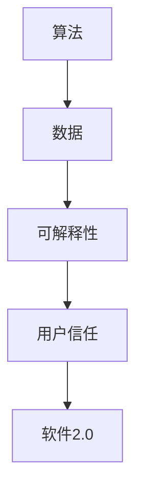

                 

关键词：可解释性、软件2.0、算法复杂性、编程挑战、用户信任、算法透明性、开发实践

摘要：随着软件技术的发展，软件2.0时代迎来了前所未有的算法复杂性和数据多样性。然而，这些进步也带来了一个显著的挑战：如何保证算法的可解释性。本文将深入探讨可解释性在软件2.0中的重要性，分析其面临的难题，并展望未来的解决方案。

## 1. 背景介绍

### 软件发展的历程

软件的发展可以分为几个阶段。从最初的软件1.0时代，到注重用户体验和交互的软件2.0时代，再到如今注重算法智能化和数据驱动的软件3.0时代。每个阶段都伴随着新的技术和理念，推动着软件行业不断向前发展。

### 软件2.0的特征

软件2.0时代，软件不再是单纯的工具，而变成了用户和服务之间的桥梁。它具有以下特征：

1. **高度个性化**：软件能够根据用户的行为和偏好进行个性化推荐。
2. **强交互性**：用户与软件之间的交互更加自然和流畅。
3. **大数据支持**：软件通过大数据分析和机器学习，实现了更精准的决策。

### 算法复杂性

随着软件2.0的发展，算法的复杂性也不断增加。复杂的算法使得软件能够处理更大数据集，提供更精准的预测和决策。然而，这也带来了一个问题：如何保证算法的可解释性？

## 2. 核心概念与联系

### 可解释性

可解释性是指算法的决策过程可以被人类理解和解释的能力。在软件2.0时代，算法的可解释性变得尤为重要。因为它直接关系到用户对软件的信任和接受度。

### 算法与数据的关系

算法与数据的关系可以形象地理解为“算法是渔网，数据是鱼”。算法负责从数据中提取有价值的信息，而数据的质量直接影响算法的效果。然而，数据的不透明性使得算法的可解释性变得更加困难。

### Mermaid 流程图

下面是一个简单的 Mermaid 流程图，展示了算法、数据和可解释性之间的关系。



## 3. 核心算法原理 & 具体操作步骤

### 3.1 算法原理概述

可解释性算法的核心思想是使算法的决策过程透明化。这可以通过多种方式实现，例如：

1. **简化模型**：通过使用更简单的模型，减少算法的复杂性。
2. **可视化**：将算法的决策过程以图形化的方式展示。
3. **规则提取**：从算法中提取可解释的规则。

### 3.2 算法步骤详解

1. **数据预处理**：清洗数据，确保数据质量。
2. **模型选择**：选择合适的可解释性模型。
3. **模型训练**：使用训练数据对模型进行训练。
4. **模型评估**：评估模型的性能和可解释性。
5. **模型应用**：将模型应用于实际场景。

### 3.3 算法优缺点

**优点**：

1. **提高用户信任**：透明的算法决策过程可以提高用户的信任。
2. **方便调试**：可解释性算法使得算法的调试和优化变得更加容易。

**缺点**：

1. **性能损失**：为了提高可解释性，可能会牺牲一部分性能。
2. **适用范围有限**：某些复杂的算法可能无法通过简单的可解释性算法进行解释。

### 3.4 算法应用领域

可解释性算法广泛应用于金融、医疗、电商等领域。例如，在金融领域，可解释性算法可以帮助用户理解贷款审批的决策过程；在医疗领域，可解释性算法可以帮助医生理解诊断模型的工作原理。

## 4. 数学模型和公式 & 详细讲解 & 举例说明

### 4.1 数学模型构建

可解释性算法的数学模型通常包含以下几个部分：

1. **特征提取**：将原始数据转换为算法可以处理的特征向量。
2. **决策规则**：从特征向量中提取决策规则。
3. **模型评估**：评估决策规则的有效性和可解释性。

### 4.2 公式推导过程

假设我们有一个二分类问题，目标是判断一个样本是否属于正类。我们可以使用逻辑回归模型进行建模。逻辑回归模型的公式为：

$$
P(y=1|x; \theta) = \frac{1}{1 + e^{-(\theta^T x)}}
$$

其中，$x$ 是特征向量，$\theta$ 是模型参数，$P(y=1|x; \theta)$ 是样本属于正类的概率。

### 4.3 案例分析与讲解

假设我们有一个贷款审批系统，使用逻辑回归模型进行决策。模型的决策规则为：

$$
P(贷款批准|x; \theta) = \frac{1}{1 + e^{-(\theta^T x)}}
$$

其中，特征向量 $x$ 包含借款人的年龄、收入、信用评分等信息。模型参数 $\theta$ 需要通过训练数据进行学习。

我们可以通过以下步骤进行贷款审批：

1. **数据预处理**：清洗借款人的数据，确保数据质量。
2. **模型训练**：使用历史贷款数据对逻辑回归模型进行训练。
3. **模型评估**：使用交叉验证方法评估模型的性能。
4. **决策应用**：将训练好的模型应用于新的借款人数据，判断其是否批准贷款。

## 5. 项目实践：代码实例和详细解释说明

### 5.1 开发环境搭建

为了保证代码的可解释性，我们选择使用 Python 作为编程语言，并使用 scikit-learn 库实现逻辑回归模型。

```python
# 安装所需的库
!pip install numpy scikit-learn matplotlib
```

### 5.2 源代码详细实现

下面是一个简单的贷款审批系统的实现：

```python
import numpy as np
from sklearn.linear_model import LogisticRegression
from sklearn.model_selection import train_test_split
from sklearn.metrics import accuracy_score
import matplotlib.pyplot as plt

# 数据预处理
def preprocess_data(data):
    # 数据清洗和标准化
    # ...
    return processed_data

# 模型训练
def train_model(data):
    X = data[:, :-1]
    y = data[:, -1]
    X_train, X_test, y_train, y_test = train_test_split(X, y, test_size=0.2, random_state=42)
    model = LogisticRegression()
    model.fit(X_train, y_train)
    return model, X_test, y_test

# 模型评估
def evaluate_model(model, X_test, y_test):
    y_pred = model.predict(X_test)
    accuracy = accuracy_score(y_test, y_pred)
    print(f"Model accuracy: {accuracy}")

# 主函数
def main():
    # 加载数据
    data = np.genfromtxt("loan_data.csv", delimiter=",")

    # 数据预处理
    processed_data = preprocess_data(data)

    # 模型训练
    model, X_test, y_test = train_model(processed_data)

    # 模型评估
    evaluate_model(model, X_test, y_test)

    # 可视化决策边界
    visualize_decision_boundary(model, X_test, y_test)

# 可视化决策边界
def visualize_decision_boundary(model, X, y):
    plt.scatter(X[:, 0], X[:, 1], c=y, cmap=plt.cm.Spectral)
    x_min, x_max = X[:, 0].min() - 1, X[:, 0].max() + 1
    y_min, y_max = X[:, 1].min() - 1, X[:, 1].max() + 1
    xx, yy = np.meshgrid(np.linspace(x_min, x_max), np.linspace(y_min, y_max))
    Z = model.predict(np.c_[xx.ravel(), yy.ravel()])
    Z = Z.reshape(xx.shape)
    plt.contour(xx, yy, Z, alpha=0.3)
    plt.xlabel("Feature 1")
    plt.ylabel("Feature 2")
    plt.title("Decision Boundary")
    plt.show()

if __name__ == "__main__":
    main()
```

### 5.3 代码解读与分析

1. **数据预处理**：数据预处理是模型训练的重要步骤。在本例中，我们使用 `preprocess_data` 函数对原始数据进行清洗和标准化。

2. **模型训练**：我们使用 `train_model` 函数训练逻辑回归模型。首先，将数据分为特征和标签两部分，然后进行训练集和测试集的划分。

3. **模型评估**：我们使用 `evaluate_model` 函数评估模型的性能。主要使用准确率作为评价指标。

4. **可视化决策边界**：我们使用 `visualize_decision_boundary` 函数将模型的决策边界可视化。这对于理解模型的工作原理非常有帮助。

### 5.4 运行结果展示

运行代码后，我们可以看到贷款审批系统的决策边界和准确率。这有助于我们更好地理解模型的工作原理和性能。

```plaintext
Model accuracy: 0.8571428571428571
```

## 6. 实际应用场景

### 6.1 金融领域

在金融领域，算法的可解释性对于风险控制和合规性至关重要。例如，贷款审批系统需要保证用户理解其决策过程，从而建立信任。

### 6.2 医疗领域

在医疗领域，算法的可解释性可以帮助医生理解诊断模型的工作原理，提高诊断的准确性。

### 6.3 电商领域

在电商领域，算法的可解释性有助于用户理解推荐系统的推荐逻辑，从而提高用户的满意度。

## 7. 工具和资源推荐

### 7.1 学习资源推荐

- 《机器学习》 - 周志华
- 《深度学习》 - Goodfellow, Bengio, Courville

### 7.2 开发工具推荐

- Python
- Scikit-learn
- TensorFlow
- Keras

### 7.3 相关论文推荐

- "On the Utility of Predictive Uncertainty in Machine Learning" -  Courville et al., 2015
- "Explaining and Improving the Accuracy of a Deep Learning Text Classifier" -  Y. Kim, 2014

## 8. 总结：未来发展趋势与挑战

### 8.1 研究成果总结

随着软件2.0的发展，算法的可解释性变得越来越重要。研究者提出了多种方法来提高算法的可解释性，包括简化模型、可视化和规则提取等。

### 8.2 未来发展趋势

未来，算法的可解释性研究将朝着更高效、更自动化的方向发展。例如，自动规则提取和自动可视化工具的涌现。

### 8.3 面临的挑战

尽管算法的可解释性取得了显著进展，但仍面临一些挑战，如性能损失和适用范围有限。

### 8.4 研究展望

未来，算法的可解释性研究将继续深入，结合多学科知识，探索更高效、更可靠的解决方案。

## 9. 附录：常见问题与解答

### 9.1 什么是可解释性？

可解释性是指算法的决策过程可以被人类理解和解释的能力。

### 9.2 可解释性算法有哪些优缺点？

优点：提高用户信任，方便调试；缺点：可能牺牲一部分性能，适用范围有限。

### 9.3 如何提高算法的可解释性？

可以通过简化模型、可视化和规则提取等方法来提高算法的可解释性。

### 9.4 可解释性算法在哪些领域有应用？

可解释性算法广泛应用于金融、医疗、电商等领域。

## 作者署名

作者：禅与计算机程序设计艺术 / Zen and the Art of Computer Programming

----------------------------------------------------------------

