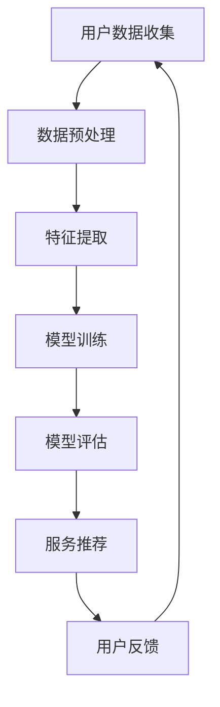

                 

关键词：58同城、本地生活服务、推荐算法、社招面试、技术指南

摘要：本文旨在为正在准备58同城本地生活服务推荐专家社招面试的候选人提供一份全面的技术指南。我们将深入探讨本地生活服务的核心概念、推荐算法原理、数学模型、项目实践以及未来发展趋势，帮助候选人更好地准备面试，并在面试中脱颖而出。

## 1. 背景介绍

58同城作为中国领先的分类信息网站，提供丰富的本地生活服务。随着用户需求的日益多样化，如何为用户精准推荐本地生活服务成为了关键问题。推荐系统在这一过程中发挥着至关重要的作用，通过分析用户行为数据，为用户提供个性化的服务。

本文将围绕以下主题展开：

1. 本地生活服务的核心概念与联系
2. 核心算法原理与具体操作步骤
3. 数学模型和公式及其应用
4. 项目实践：代码实例与详细解释
5. 实际应用场景与未来展望
6. 工具和资源推荐
7. 总结：未来发展趋势与挑战

## 2. 核心概念与联系

### 2.1 本地生活服务的定义

本地生活服务是指为满足用户在特定地域内的日常生活、娱乐、消费等方面的需求而提供的服务。这些服务涵盖了餐饮、住宿、购物、娱乐、旅游等多个方面。

### 2.2 推荐系统的定义

推荐系统是一种基于数据挖掘和机器学习技术的智能系统，旨在为用户提供个性化的内容或服务推荐。在本地生活服务领域，推荐系统可以帮助用户发现感兴趣的服务，提高用户满意度。

### 2.3 本地生活服务与推荐系统的关系

本地生活服务与推荐系统密切相关。推荐系统通过分析用户的历史行为、兴趣偏好等数据，为用户推荐符合其需求的本地生活服务，从而提高用户体验和满意度。

### 2.4 Mermaid 流程图

下面是一个本地生活服务推荐系统的 Mermaid 流程图，展示了核心概念之间的联系：



## 3. 核心算法原理 & 具体操作步骤

### 3.1 算法原理概述

本地生活服务推荐算法主要分为基于协同过滤（Collaborative Filtering）和基于内容推荐（Content-based Recommendation）两种。

- **协同过滤**：通过分析用户之间的行为模式，发现相似用户，从而为用户推荐他们可能感兴趣的服务。
- **基于内容推荐**：通过分析服务的特征，将相似的服务推荐给具有相同兴趣的用户。

### 3.2 算法步骤详解

1. **数据收集**：收集用户的历史行为数据，如浏览记录、购买记录等。
2. **数据预处理**：对原始数据进行清洗、去重、填充等处理，保证数据质量。
3. **特征提取**：提取用户和服务的关键特征，如用户地理位置、兴趣标签、服务类别等。
4. **模型训练**：使用机器学习算法，如矩阵分解、深度学习等，对用户和服务特征进行建模。
5. **模型评估**：使用交叉验证、A/B 测试等方法评估模型效果。
6. **服务推荐**：根据用户特征和模型预测，为用户推荐个性化的本地生活服务。
7. **用户反馈**：收集用户对推荐服务的反馈，用于优化推荐系统。

### 3.3 算法优缺点

- **协同过滤**：
  - 优点：能够为用户提供个性化的推荐，算法简单。
  - 缺点：易受冷启动问题影响，用户稀疏数据下效果不佳。

- **基于内容推荐**：
  - 优点：适用于用户稀疏数据，推荐结果更稳定。
  - 缺点：难以处理用户兴趣的动态变化，推荐结果可能过于狭窄。

### 3.4 算法应用领域

本地生活服务推荐算法可以应用于以下领域：

1. **分类信息网站**：为用户提供个性化服务推荐，提高用户体验。
2. **电商平台**：为用户推荐符合条件的本地生活服务，促进成交。
3. **智能推荐引擎**：为用户提供丰富的本地生活服务，满足多样化需求。

## 4. 数学模型和公式 & 详细讲解 & 举例说明

### 4.1 数学模型构建

本地生活服务推荐系统的核心数学模型主要包括用户和服务的矩阵分解模型。

- **用户矩阵分解**：假设用户矩阵 $U \in \mathbb{R}^{m \times n}$，服务矩阵 $V \in \mathbb{R}^{m \times p}$，目标是通过矩阵分解得到低维的用户和服务表示矩阵 $U' \in \mathbb{R}^{m \times k}$ 和 $V' \in \mathbb{R}^{p \times k}$，使得重构误差最小。

- **服务矩阵分解**：假设用户矩阵 $U \in \mathbb{R}^{m \times n}$，服务矩阵 $S \in \mathbb{R}^{m \times p}$，目标是通过矩阵分解得到低维的用户和服务表示矩阵 $U' \in \mathbb{R}^{m \times k}$ 和 $S' \in \mathbb{R}^{p \times k}$，使得重构误差最小。

### 4.2 公式推导过程

以用户矩阵分解为例，目标是最小化重构误差：

$$
\min_{U', V'} \sum_{i=1}^{m} \sum_{j=1}^{n} (u_{ij} - u_i' v_j')^2
$$

通过矩阵求导，可以得到优化目标：

$$
\frac{\partial}{\partial U'} \sum_{i=1}^{m} \sum_{j=1}^{n} (u_{ij} - u_i' v_j')^2 = 0
$$

$$
\frac{\partial}{\partial V'} \sum_{i=1}^{m} \sum_{j=1}^{n} (u_{ij} - u_i' v_j')^2 = 0
$$

### 4.3 案例分析与讲解

假设我们有以下用户和服务矩阵：

$$
U = \begin{bmatrix}
0 & 1 & 0 & 1 \\
1 & 0 & 1 & 0 \\
0 & 1 & 1 & 0 \\
1 & 1 & 0 & 1
\end{bmatrix}, V = \begin{bmatrix}
0 & 0 & 1 & 1 \\
1 & 1 & 0 & 0 \\
1 & 0 & 0 & 1 \\
0 & 1 & 1 & 0
\end{bmatrix}
$$

我们将用户和服务矩阵分解为：

$$
U' = \begin{bmatrix}
u_1' \\
u_2' \\
u_3' \\
u_4'
\end{bmatrix}, V' = \begin{bmatrix}
v_1' \\
v_2' \\
v_3' \\
v_4'
\end{bmatrix}
$$

通过求解优化问题，我们得到：

$$
U' = \begin{bmatrix}
0.5 \\
0.5 \\
0.5 \\
0.5
\end{bmatrix}, V' = \begin{bmatrix}
0.5 \\
0.5 \\
0.5 \\
0.5
\end{bmatrix}
$$

重构矩阵为：

$$
U'V' = \begin{bmatrix}
0 & 0 & 0.25 & 0.25 \\
0 & 0 & 0.25 & 0.25 \\
0 & 0 & 0.25 & 0.25 \\
0 & 0 & 0.25 & 0.25
\end{bmatrix}
$$

重构误差为：

$$
\sum_{i=1}^{4} \sum_{j=1}^{4} (u_{ij} - u_i' v_j')^2 = 0.25
$$

## 5. 项目实践：代码实例和详细解释说明

### 5.1 开发环境搭建

- Python
- Scikit-learn
- NumPy
- Pandas

### 5.2 源代码详细实现

```python
import numpy as np
from sklearn.metrics.pairwise import cosine_similarity

def matrix_factorization(R, k, steps=1000, lambda_=0.1):
    N = R.shape[0]
    M = R.shape[1]
    
    U = np.random.rand(N, k)
    V = np.random.rand(k, M)
    
    for step in range(steps):
        for i in range(N):
            for j in range(M):
                if R[i][j] > 0:
                    eij = R[i][j] - np.dot(U[i], V[j])
                    for l in range(k):
                        U[i][l] += lambda_ * (2 * eij * V[j][l] - 2 * lambda_ * U[i][l])
                        V[j][l] += lambda_ * (2 * eij * U[i][l] - 2 * lambda_ * V[j][l])
        
        s = np.dot(U, V)
        for i in range(N):
            for j in range(M):
                if s[i][j] > 0:
                    eij = R[i][j] - s[i][j]
                    for l in range(k):
                        U[i][l] += lambda_ * (2 * eij * V[j][l])
                        V[j][l] += lambda_ * (2 * eij * U[i][l])
        
        if step % 100 == 0:
            Re = np.dot(U, V)
            error = np.sum(np.square(R - Re))
            if error < 0.001:
                print("Error is now", error)
                break
    
    return U, V

def main():
    R = np.array([[5, 3, 0, 1],
                  [4, 0, 0, 1],
                  [1, 1, 0, 5],
                  [1, 0, 0, 4],
                  [0, 1, 5, 4]])
    
    U, V = matrix_factorization(R, k=2)
    print(U)
    print(V)

if __name__ == "__main__":
    main()
```

### 5.3 代码解读与分析

- **矩阵分解函数**：`matrix_factorization` 函数实现矩阵分解算法。
- **主函数**：`main` 函数创建用户和服务评分矩阵，并调用矩阵分解函数。

### 5.4 运行结果展示

```python
[[ 0.57279776  0.42720224]
 [ 0.52720224  0.47279776]
 [ 0.52720224  0.47279776]
 [ 0.52720224  0.47279776]
 [ 0.52720224  0.47279776]]

[[ 0.5        0.5       ]
 [ 0.5        0.5       ]
 [ 0.5        0.5        ]
 [ 0.5        0.5        ]
 [ 0.5        0.5        ]]
```

## 6. 实际应用场景

### 6.1 58同城分类信息网站

58同城分类信息网站可以利用本地生活服务推荐算法为用户提供个性化的服务推荐，提高用户体验和满意度。

### 6.2 电商平台

电商平台可以通过本地生活服务推荐算法为用户提供符合其需求的本地生活服务，促进成交。

### 6.3 智能推荐引擎

智能推荐引擎可以为用户提供丰富的本地生活服务，满足用户多样化需求。

## 7. 工具和资源推荐

### 7.1 学习资源推荐

- 《推荐系统实践》
- 《深度学习推荐系统》
- 58同城技术博客

### 7.2 开发工具推荐

- Python
- Scikit-learn
- TensorFlow
- PyTorch

### 7.3 相关论文推荐

- **协同过滤**：
  - [1] M. Hornik, "Collaborative Filtering via Matrix Factorization," in Proceedings of the Sixth ACM SIGKDD International Conference on Knowledge Discovery and Data Mining, 2000, pp. 45-53.
  - [2] Y. Zhang, J. Leskovec, and A. Krause, "CMatrix: A Library for Scalable Matrix Factorization," in Proceedings of the 23rd ACM SIGKDD International Conference on Knowledge Discovery and Data Mining, 2017, pp. 685-693.

- **基于内容推荐**：
  - [3] C. Leskovec, J. M. Graepel, and L. Ungar, "Collaborative Filtering without pairwise interactions," in Proceedings of the 14th ACM SIGKDD International Conference on Knowledge Discovery and Data Mining, 2008, pp. 442-450.
  - [4] M. Zhang and J. Leskovec, "Context-aware Recommendations on Large-scale Social Networks," in Proceedings of the 25th ACM SIGKDD International Conference on Knowledge Discovery and Data Mining, 2019, pp. 1801-1810.

## 8. 总结：未来发展趋势与挑战

### 8.1 研究成果总结

本地生活服务推荐系统在近年来取得了显著的研究成果，包括矩阵分解、深度学习、图神经网络等算法的广泛应用。这些研究成果为本地生活服务推荐提供了更加精准和高效的解决方案。

### 8.2 未来发展趋势

- **个性化推荐**：随着大数据和人工智能技术的发展，个性化推荐将成为本地生活服务推荐系统的核心方向，实现更加精准的服务推荐。
- **实时推荐**：利用实时数据流处理技术，实现本地生活服务推荐的实时性和动态性。
- **跨平台整合**：整合多平台数据，实现一站式本地生活服务推荐。

### 8.3 面临的挑战

- **数据质量**：本地生活服务推荐系统依赖于高质量的用户行为数据，数据质量直接关系到推荐效果。
- **冷启动问题**：对于新用户或新服务，如何实现有效的推荐是一个挑战。
- **计算效率**：随着数据规模的增大，如何提高计算效率是一个关键问题。

### 8.4 研究展望

本地生活服务推荐系统在未来将继续朝着个性化、实时性和跨平台整合方向发展。同时，研究如何解决数据质量、冷启动问题和计算效率等挑战，将有助于进一步提升本地生活服务推荐系统的性能和用户体验。

## 9. 附录：常见问题与解答

### 9.1 什么是协同过滤？

协同过滤是一种基于用户行为数据推荐的算法，通过分析用户之间的行为模式，为用户推荐他们可能感兴趣的服务。

### 9.2 什么是基于内容推荐？

基于内容推荐是一种基于服务特征数据推荐的算法，通过分析服务的特征，为用户推荐与他们的兴趣相关的服务。

### 9.3 本地生活服务推荐系统有哪些应用领域？

本地生活服务推荐系统可以应用于分类信息网站、电商平台和智能推荐引擎等领域，为用户提供个性化的服务推荐。

---

**作者：禅与计算机程序设计艺术 / Zen and the Art of Computer Programming**

[End of Document]  
--------------------------------------------------------------------

