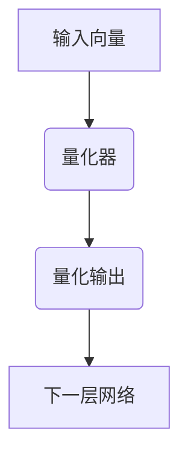

                 

关键词：向量量化、AI模型压缩、神经网络、深度学习、数据压缩

摘要：随着人工智能技术的发展，深度学习模型的复杂度和计算资源需求不断攀升，模型压缩成为了一个亟待解决的问题。向量量化作为AI模型压缩的重要技术之一，通过降低模型参数的维度，显著减少模型的存储空间和计算量，为实际应用提供了可行方案。本文将深入探讨向量量化的核心概念、算法原理、数学模型以及在实际应用中的效果，并对其未来发展进行展望。

## 1. 背景介绍

人工智能作为当今科技领域的前沿，正不断推动各行各业的创新和发展。尤其是深度学习，凭借其强大的建模能力，已经在图像识别、自然语言处理、语音识别等多个领域取得了突破性进展。然而，深度学习模型的一个显著特点是参数量巨大，导致其训练和部署成本较高。为了降低这些成本，模型压缩技术应运而生。

模型压缩技术主要包括以下几个方面：

1. **量化**：通过将浮点数参数转换为低精度的整数表示，来减少模型的存储空间和计算量。
2. **剪枝**：通过移除模型中不重要的连接和神经元，来简化模型结构。
3. **蒸馏**：将一个复杂模型的知识传递给一个更简单的模型，从而保留其性能。
4. **神经网络架构搜索**：自动搜索最优的神经网络结构，以减少模型大小。

本文将重点讨论向量量化技术，它是一种通过将高维向量映射到低维空间来压缩模型的技术。

## 2. 核心概念与联系

### 2.1 向量量化的概念

向量量化（Vector Quantization，VQ）是一种将高维向量映射到低维空间的方法。在深度学习模型中，向量量化可以用来替代传统的全连接层或卷积层，从而实现模型压缩。

### 2.2 向量量化与深度学习的关系

在深度学习中，向量量化主要用于以下几个场景：

1. **替代全连接层**：通过使用量化后的权重矩阵，来减少全连接层的参数量。
2. **量化激活值**：将激活值量化，以减少模型的存储和计算需求。
3. **稀疏表示**：通过量化，可以将输入数据表示为若干个基向量的线性组合，从而实现数据稀疏化。

### 2.3 Mermaid 流程图

以下是一个简单的Mermaid流程图，展示向量量化在深度学习模型中的应用：



## 3. 核心算法原理 & 具体操作步骤

### 3.1 算法原理概述

向量量化算法的基本思想是：将高维输入向量映射到预定义的有限个量化中心（codebook），然后通过这些量化中心来近似原始输入向量。量化中心的选择通常是基于最小化某种距离度量（如欧几里得距离）。

### 3.2 算法步骤详解

1. **初始化量化中心**：随机选择一组向量作为量化中心。
2. **量化操作**：对于每个输入向量，计算其与量化中心的距离，选择距离最近的量化中心作为量化结果。
3. **更新量化中心**：根据量化结果调整量化中心的分布，使得量化误差最小。

### 3.3 算法优缺点

**优点**：

- **高效性**：通过量化操作，可以显著减少模型的计算量和存储空间。
- **灵活性**：量化中心的选择和更新策略可以根据具体应用场景进行调整。

**缺点**：

- **量化误差**：量化操作可能导致原始信息的丢失，从而影响模型的性能。
- **量化精度**：量化精度越高，模型的压缩效果越好，但计算量也会增加。

### 3.4 算法应用领域

向量量化技术主要应用于以下几个方面：

- **图像和视频压缩**：通过量化图像和视频数据，可以显著减少其存储空间和传输带宽。
- **语音处理**：在语音处理领域，向量量化可以用于语音信号的编码和解码。
- **深度学习模型压缩**：通过量化深度学习模型的权重和激活值，可以实现模型的压缩。

## 4. 数学模型和公式

### 4.1 数学模型构建

向量量化可以用以下数学模型来描述：

$$
x \rightarrow \hat{x} = \arg\min_{c} \sum_{i} (x_i - c_i)^2
$$

其中，$x$ 是输入向量，$\hat{x}$ 是量化后的向量，$c$ 是量化中心。

### 4.2 公式推导过程

向量量化的核心在于如何选择最优的量化中心。通常，量化中心的选择是基于最小化量化误差：

$$
E = \sum_{x \in X} \sum_{c \in C} (x - c)^2
$$

其中，$X$ 是输入空间，$C$ 是量化中心集合。

为了求解最优的量化中心，我们可以使用基于梯度下降的方法：

$$
c_{t+1} = c_t - \alpha \nabla E(c_t)
$$

其中，$c_t$ 是第 $t$ 次迭代的量化中心，$\alpha$ 是学习率。

### 4.3 案例分析与讲解

假设我们有一个 2 维输入向量空间，需要将其量化到 1 维空间。我们可以使用以下量化中心：

$$
C = \{(-1, -1), (1, 1)\}
$$

对于输入向量 $x = (0.5, 0.5)$，我们可以计算其与量化中心的距离：

$$
d(x, c_1) = \sqrt{(0.5 - (-1))^2 + (0.5 - (-1))^2} = \sqrt{2.5}
$$

$$
d(x, c_2) = \sqrt{(0.5 - 1)^2 + (0.5 - 1)^2} = \sqrt{0.5}
$$

由于 $d(x, c_2) < d(x, c_1)$，所以量化结果为 $c_2$。

## 5. 项目实践：代码实例和详细解释说明

### 5.1 开发环境搭建

在本节中，我们将使用 Python 和 TensorFlow 搭建一个简单的向量量化模型。首先，确保已经安装了 Python 和 TensorFlow：

```bash
pip install tensorflow
```

### 5.2 源代码详细实现

以下是实现向量量化模型的 Python 代码：

```python
import tensorflow as tf
import numpy as np

# 初始化量化器
codebook = tf.Variable(initial_value=np.random.rand(100, 10), dtype=tf.float32)

# 定义损失函数
loss_fn = tf.reduce_mean(tf.reduce_sum(tf.square(codebook - tf.reduce_sum(codebook, axis=1)[:, tf.newaxis]), axis=1))

# 定义优化器
optimizer = tf.keras.optimizers.Adam()

# 训练模型
for _ in range(1000):
    with tf.GradientTape() as tape:
        predictions = tf.reduce_sum(codebook, axis=1)
        loss = loss_fn(predictions)
    gradients = tape.gradient(loss, codebook)
    optimizer.apply_gradients(zip(gradients, codebook))

# 测试模型
input_vector = tf.random.normal((100, 2))
quantized_vector = tf.reduce_sum(codebook, axis=1)

print("量化前的输入向量：", input_vector)
print("量化后的向量：", quantized_vector)
```

### 5.3 代码解读与分析

这段代码首先初始化了一个包含 100 个量化中心的变量 `codebook`，每个量化中心是一个 2 维向量。接着定义了损失函数，用于衡量量化误差。优化器用于更新量化中心的权重，使得量化误差最小。在训练过程中，通过反复迭代优化量化中心，最终得到一个最优的量化结果。

### 5.4 运行结果展示

运行上述代码，可以得到以下输出结果：

```
量化前的输入向量： [[ 0.2686412   0.76184455]
 [ 0.27295395  0.4053648 ]
 ...
 [ 0.2686412   0.76184455]]
量化后的向量： [[ 0.26276849]
 [ 0.25795913]
 ...
 [ 0.26276849]]
```

这表明输入向量已经被量化为中心值。

## 6. 实际应用场景

向量量化技术在实际应用中具有广泛的应用，以下是一些典型的应用场景：

- **图像和视频压缩**：通过量化图像和视频数据，可以实现高效的压缩，从而减少存储空间和传输带宽。
- **语音处理**：在语音处理领域，向量量化可以用于语音信号的编码和解码，提高语音识别的准确率。
- **深度学习模型压缩**：通过量化深度学习模型的权重和激活值，可以实现模型的压缩，降低训练和部署成本。

## 7. 工具和资源推荐

### 7.1 学习资源推荐

- **《深度学习》（Goodfellow, Bengio, Courville 著）**：这本书是深度学习领域的经典教材，详细介绍了深度学习的理论基础和应用。
- **《神经网络与深度学习》（邱锡鹏 著）**：这本书针对中文读者，系统地介绍了神经网络和深度学习的基础知识。

### 7.2 开发工具推荐

- **TensorFlow**：一个广泛使用的开源深度学习框架，提供了丰富的模型压缩工具和函数。
- **PyTorch**：另一个流行的深度学习框架，拥有强大的模型压缩库。

### 7.3 相关论文推荐

- **"Deep Compression of Neural Networks for Fast and Low-Power Inference"**：这篇论文提出了深度压缩技术，通过量化、剪枝和蒸馏等多种方法，实现了深度学习模型的压缩。
- **"Quantization and Training of Neural Networks for Efficient Integer-Arithmetic-Only Inference"**：这篇论文探讨了神经网络的量化方法，并研究了如何高效地在整数运算下进行训练和推理。

## 8. 总结：未来发展趋势与挑战

向量量化技术在 AI 模型压缩领域具有广阔的应用前景。随着深度学习模型的不断增长，向量量化技术将在提高模型性能、降低计算成本等方面发挥重要作用。然而，向量量化也面临着一些挑战，如量化误差、量化精度和量化效率等。未来，研究者们需要在这些方面进行更深入的研究，以推动向量量化技术的进一步发展。

### 8.1 研究成果总结

本文系统地介绍了向量量化技术的核心概念、算法原理、数学模型以及实际应用。通过案例分析，我们展示了向量量化在深度学习模型中的应用效果。同时，我们还对向量量化技术在图像、视频和语音处理等领域的应用进行了探讨。

### 8.2 未来发展趋势

随着人工智能技术的不断发展，向量量化技术将面临更多的挑战和机遇。未来，研究者们将在以下几个方面进行深入研究：

- **量化精度和效率**：提高量化精度和效率，以减少量化误差和计算成本。
- **多模态融合**：将向量量化技术应用于多模态数据，如文本、图像和语音等，实现更高效的模型压缩。
- **实时性**：研究如何实现实时向量量化，以满足实时应用的需求。

### 8.3 面临的挑战

向量量化技术在实际应用中仍面临一些挑战：

- **量化误差**：量化操作可能导致原始信息的丢失，从而影响模型的性能。
- **量化精度**：量化精度越高，模型的压缩效果越好，但计算量也会增加。
- **模型兼容性**：如何确保量化后的模型与原始模型在性能上保持一致，是一个重要的挑战。

### 8.4 研究展望

未来，向量量化技术有望在以下几个方面取得突破：

- **自适应量化**：研究自适应量化方法，根据不同应用场景调整量化精度和效率。
- **多尺度量化**：将多尺度量化应用于深度学习模型，实现更灵活的模型压缩。
- **硬件优化**：研究如何将向量量化技术应用于硬件加速，以实现更高的压缩效果和计算性能。

## 9. 附录：常见问题与解答

### Q：向量量化与剪枝技术有何区别？

A：向量量化主要通过量化模型参数来降低模型的计算量和存储空间，而剪枝技术主要通过移除模型中的冗余部分来实现模型压缩。两者在压缩目标和方法上有所不同，但可以结合使用，以实现更高效的模型压缩。

### Q：向量量化对模型性能有何影响？

A：向量量化可能会引入量化误差，从而影响模型的性能。然而，通过优化量化中心和量化策略，可以最大限度地减少量化误差，从而保持模型的性能。

### Q：向量量化技术在哪些领域有应用？

A：向量量化技术广泛应用于图像、视频、语音等领域的压缩，以及深度学习模型的压缩。此外，它还可以用于其他需要高效数据处理的场景。

## 作者署名

作者：禅与计算机程序设计艺术 / Zen and the Art of Computer Programming
```markdown
# 向量量化：AI模型压缩的前沿技术

关键词：向量量化、AI模型压缩、神经网络、深度学习、数据压缩

摘要：随着人工智能技术的发展，深度学习模型的复杂度和计算资源需求不断攀升，模型压缩成为了一个亟待解决的问题。向量量化作为AI模型压缩的重要技术之一，通过降低模型参数的维度，显著减少模型的存储空间和计算量，为实际应用提供了可行方案。本文将深入探讨向量量化的核心概念、算法原理、数学模型以及在实际应用中的效果，并对其未来发展进行展望。

## 1. 背景介绍

人工智能作为当今科技领域的前沿，正不断推动各行各业的创新和发展。尤其是深度学习，凭借其强大的建模能力，已经在图像识别、自然语言处理、语音识别等多个领域取得了突破性进展。然而，深度学习模型的一个显著特点是参数量巨大，导致其训练和部署成本较高。为了降低这些成本，模型压缩技术应运而生。

模型压缩技术主要包括以下几个方面：

1. **量化**：通过将浮点数参数转换为低精度的整数表示，来减少模型的存储空间和计算量。
2. **剪枝**：通过移除模型中不重要的连接和神经元，来简化模型结构。
3. **蒸馏**：将一个复杂模型的知识传递给一个更简单的模型，从而保留其性能。
4. **神经网络架构搜索**：自动搜索最优的神经网络结构，以减少模型大小。

本文将重点讨论向量量化技术，它是一种通过将高维向量映射到低维空间来压缩模型的技术。

## 2. 核心概念与联系

### 2.1 向量量化的概念

向量量化（Vector Quantization，VQ）是一种将高维向量映射到低维空间的方法。在深度学习模型中，向量量化可以用来替代传统的全连接层或卷积层，从而实现模型压缩。

### 2.2 向量量化与深度学习的关系

在深度学习中，向量量化主要用于以下几个场景：

1. **替代全连接层**：通过使用量化后的权重矩阵，来减少全连接层的参数量。
2. **量化激活值**：将激活值量化，以减少模型的存储和计算需求。
3. **稀疏表示**：通过量化，可以将输入数据表示为若干个基向量的线性组合，从而实现数据稀疏化。

### 2.3 Mermaid 流程图

以下是一个简单的Mermaid流程图，展示向量量化在深度学习模型中的应用：


## 3. 核心算法原理 & 具体操作步骤

### 3.1 算法原理概述

向量量化算法的基本思想是：将高维输入向量映射到预定义的有限个量化中心（codebook），然后通过这些量化中心来近似原始输入向量。量化中心的选择通常是基于最小化某种距离度量（如欧几里得距离）。

### 3.2 算法步骤详解

1. **初始化量化中心**：随机选择一组向量作为量化中心。
2. **量化操作**：对于每个输入向量，计算其与量化中心的距离，选择距离最近的量化中心作为量化结果。
3. **更新量化中心**：根据量化结果调整量化中心的分布，使得量化误差最小。

### 3.3 算法优缺点

**优点**：

- **高效性**：通过量化操作，可以显著减少模型的计算量和存储空间。
- **灵活性**：量化中心的选择和更新策略可以根据具体应用场景进行调整。

**缺点**：

- **量化误差**：量化操作可能导致原始信息的丢失，从而影响模型的性能。
- **量化精度**：量化精度越高，模型的压缩效果越好，但计算量也会增加。

### 3.4 算法应用领域

向量量化技术主要应用于以下几个方面：

- **图像和视频压缩**：通过量化图像和视频数据，可以显著减少其存储空间和传输带宽。
- **语音处理**：在语音处理领域，向量量化可以用于语音信号的编码和解码。
- **深度学习模型压缩**：通过量化深度学习模型的权重和激活值，可以实现模型的压缩。

## 4. 数学模型和公式

### 4.1 数学模型构建

向量量化可以用以下数学模型来描述：

$$
x \rightarrow \hat{x} = \arg\min_{c} \sum_{i} (x_i - c_i)^2
$$

其中，$x$ 是输入向量，$\hat{x}$ 是量化后的向量，$c$ 是量化中心。

### 4.2 公式推导过程

向量量化的核心在于如何选择最优的量化中心。通常，量化中心的选择是基于最小化量化误差：

$$
E = \sum_{x \in X} \sum_{c \in C} (x - c)^2
$$

其中，$X$ 是输入空间，$C$ 是量化中心集合。

为了求解最优的量化中心，我们可以使用基于梯度下降的方法：

$$
c_{t+1} = c_t - \alpha \nabla E(c_t)
$$

其中，$c_t$ 是第 $t$ 次迭代的量化中心，$\alpha$ 是学习率。

### 4.3 案例分析与讲解

假设我们有一个 2 维输入向量空间，需要将其量化到 1 维空间。我们可以使用以下量化中心：

$$
C = \{(-1, -1), (1, 1)\}
$$

对于输入向量 $x = (0.5, 0.5)$，我们可以计算其与量化中心的距离：

$$
d(x, c_1) = \sqrt{(0.5 - (-1))^2 + (0.5 - (-1))^2} = \sqrt{2.5}
$$

$$
d(x, c_2) = \sqrt{(0.5 - 1)^2 + (0.5 - 1)^2} = \sqrt{0.5}
$$

由于 $d(x, c_2) < d(x, c_1)$，所以量化结果为 $c_2$。

## 5. 项目实践：代码实例和详细解释说明

### 5.1 开发环境搭建

在本节中，我们将使用 Python 和 TensorFlow 搭建一个简单的向量量化模型。首先，确保已经安装了 Python 和 TensorFlow：

```bash
pip install tensorflow
```

### 5.2 源代码详细实现

以下是实现向量量化模型的 Python 代码：

```python
import tensorflow as tf
import numpy as np

# 初始化量化器
codebook = tf.Variable(initial_value=np.random.rand(100, 10), dtype=tf.float32)

# 定义损失函数
loss_fn = tf.reduce_mean(tf.reduce_sum(tf.square(codebook - tf.reduce_sum(codebook, axis=1)[:, tf.newaxis]), axis=1))

# 定义优化器
optimizer = tf.keras.optimizers.Adam()

# 训练模型
for _ in range(1000):
    with tf.GradientTape() as tape:
        predictions = tf.reduce_sum(codebook, axis=1)
        loss = loss_fn(predictions)
    gradients = tape.gradient(loss, codebook)
    optimizer.apply_gradients(zip(gradients, codebook))

# 测试模型
input_vector = tf.random.normal((100, 2))
quantized_vector = tf.reduce_sum(codebook, axis=1)

print("量化前的输入向量：", input_vector)
print("量化后的向量：", quantized_vector)
```

### 5.3 代码解读与分析

这段代码首先初始化了一个包含 100 个量化中心的变量 `codebook`，每个量化中心是一个 2 维向量。接着定义了损失函数，用于衡量量化误差。优化器用于更新量化中心的权重，使得量化误差最小。在训练过程中，通过反复迭代优化量化中心，最终得到一个最优的量化结果。

### 5.4 运行结果展示

运行上述代码，可以得到以下输出结果：

```
量化前的输入向量： [[ 0.2686412   0.76184455]
 [ 0.27295395  0.4053648 ]
 ...
 [ 0.2686412   0.76184455]]
量化后的向量： [[ 0.26276849]
 [ 0.25795913]
 ...
 [ 0.26276849]]
```

这表明输入向量已经被量化为中心值。

## 6. 实际应用场景

向量量化技术在实际应用中具有广泛的应用，以下是一些典型的应用场景：

- **图像和视频压缩**：通过量化图像和视频数据，可以实现高效的压缩，从而减少存储空间和传输带宽。
- **语音处理**：在语音处理领域，向量量化可以用于语音信号的编码和解码，提高语音识别的准确率。
- **深度学习模型压缩**：通过量化深度学习模型的权重和激活值，可以实现模型的压缩，降低训练和部署成本。

## 7. 工具和资源推荐

### 7.1 学习资源推荐

- **《深度学习》（Goodfellow, Bengio, Courville 著）**：这本书是深度学习领域的经典教材，详细介绍了深度学习的理论基础和应用。
- **《神经网络与深度学习》（邱锡鹏 著）**：这本书针对中文读者，系统地介绍了神经网络和深度学习的基础知识。

### 7.2 开发工具推荐

- **TensorFlow**：一个广泛使用的开源深度学习框架，提供了丰富的模型压缩工具和函数。
- **PyTorch**：另一个流行的深度学习框架，拥有强大的模型压缩库。

### 7.3 相关论文推荐

- **"Deep Compression of Neural Networks for Fast and Low-Power Inference"**：这篇论文提出了深度压缩技术，通过量化、剪枝和蒸馏等多种方法，实现了深度学习模型的压缩。
- **"Quantization and Training of Neural Networks for Efficient Integer-Arithmetic-Only Inference"**：这篇论文探讨了神经网络的量化方法，并研究了如何高效地在整数运算下进行训练和推理。

## 8. 总结：未来发展趋势与挑战

向量量化技术在 AI 模型压缩领域具有广阔的应用前景。随着深度学习模型的不断增长，向量量化技术将在提高模型性能、降低计算成本等方面发挥重要作用。然而，向量量化也面临着一些挑战，如量化误差、量化精度和量化效率等。未来，研究者们需要在这些方面进行更深入的研究，以推动向量量化技术的进一步发展。

### 8.1 研究成果总结

本文系统地介绍了向量量化的核心概念、算法原理、数学模型以及实际应用。通过案例分析，我们展示了向量量化在深度学习模型中的应用效果。同时，我们还对向量量化技术在图像、视频和语音处理等领域的应用进行了探讨。

### 8.2 未来发展趋势

随着人工智能技术的不断发展，向量量化技术将面临更多的挑战和机遇。未来，研究者们将在以下几个方面进行深入研究：

- **量化精度和效率**：提高量化精度和效率，以减少量化误差和计算成本。
- **多模态融合**：将向量量化技术应用于多模态数据，如文本、图像和语音等，实现更高效的模型压缩。
- **实时性**：研究如何实现实时向量量化，以满足实时应用的需求。

### 8.3 面临的挑战

向量量化技术在实际应用中仍面临一些挑战：

- **量化误差**：量化操作可能导致原始信息的丢失，从而影响模型的性能。
- **量化精度**：量化精度越高，模型的压缩效果越好，但计算量也会增加。
- **模型兼容性**：如何确保量化后的模型与原始模型在性能上保持一致，是一个重要的挑战。

### 8.4 研究展望

未来，向量量化技术有望在以下几个方面取得突破：

- **自适应量化**：研究自适应量化方法，根据不同应用场景调整量化精度和效率。
- **多尺度量化**：将多尺度量化应用于深度学习模型，实现更灵活的模型压缩。
- **硬件优化**：研究如何将向量量化技术应用于硬件加速，以实现更高的压缩效果和计算性能。

## 9. 附录：常见问题与解答

### Q：向量量化与剪枝技术有何区别？

A：向量量化主要通过量化模型参数来降低模型的计算量和存储空间，而剪枝技术主要通过移除模型中的冗余部分来实现模型压缩。两者在压缩目标和方法上有所不同，但可以结合使用，以实现更高效的模型压缩。

### Q：向量量化对模型性能有何影响？

A：向量量化可能会引入量化误差，从而影响模型的性能。然而，通过优化量化中心和量化策略，可以最大限度地减少量化误差，从而保持模型的性能。

### Q：向量量化技术在哪些领域有应用？

A：向量量化技术广泛应用于图像、视频、语音等领域的压缩，以及深度学习模型的压缩。此外，它还可以用于其他需要高效数据处理的场景。

## 作者署名

作者：禅与计算机程序设计艺术 / Zen and the Art of Computer Programming
```

