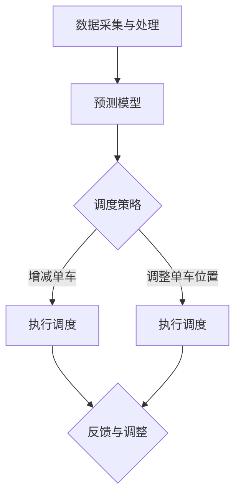
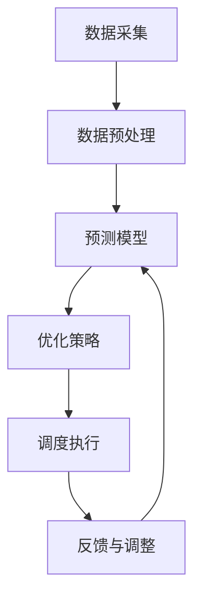
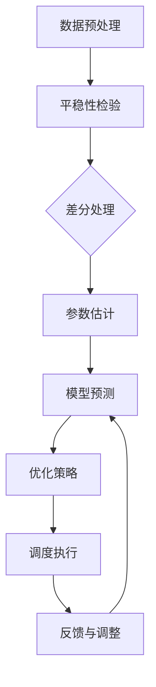

                 

### 1. 背景介绍

共享单车作为一种便捷的城市出行方式，自2016年在中国兴起以来，迅速在全球范围内得到广泛应用。哈啰出行作为共享单车行业的领军企业，一直在努力通过技术创新，提升用户出行体验和运营效率。随着共享单车的普及，调度算法作为核心技术之一，对于提高共享单车的利用率和减少资源浪费起到了至关重要的作用。

在2025年，哈啰出行计划通过社招引入一位共享单车调度算法工程师，以应对日益增长的用户需求和复杂的城市交通环境。这位工程师需要具备扎实的算法基础、丰富的项目经验以及对实时数据处理和优化策略的深刻理解。本次面试旨在评估应聘者在这方面的能力和潜力。

本文将围绕哈啰出行共享单车调度算法的面试内容，从核心概念、算法原理、数学模型、项目实践等方面进行深入分析，帮助读者了解这一领域的技术要求和挑战。通过这篇文章，读者不仅可以了解共享单车调度算法的基本原理，还可以对面试过程中可能遇到的问题有所准备。

在接下来的章节中，我们将首先介绍共享单车调度算法的基本概念和背景，然后详细探讨核心算法原理和数学模型，接着展示实际项目中的代码实例，并分析其在实际应用场景中的效果。最后，我们将讨论未来发展趋势、面临的挑战以及相关的工具和资源，为读者提供全面的了解。

### 2. 核心概念与联系

在深入了解共享单车调度算法之前，我们需要先掌握几个核心概念，这些概念是构建调度系统的基石。

#### 2.1 共享单车的定义与特点

共享单车是一种通过移动互联网和智能硬件技术实现的短途出行工具。它具有以下特点：

- **低成本**：用户只需支付少量的骑行费用即可使用单车，大大降低了出行成本。
- **便捷性**：用户可以通过手机应用随时随地扫码解锁单车，操作简单，方便快捷。
- **灵活性**：用户可以根据自己的需求灵活选择骑行的时间和路线，满足了多样化的出行需求。
- **环保性**：共享单车作为一种绿色出行方式，减少了汽车尾气排放，对环境保护有积极作用。

#### 2.2 调度算法的定义

调度算法是一种用于优化资源分配和流程管理的算法。在共享单车场景中，调度算法主要解决的是如何在城市不同区域合理分配单车，以最大化单车的利用率和减少用户的等待时间。

#### 2.3 调度算法的目标

共享单车调度算法的主要目标包括：

- **最大化利用率**：确保单车的使用频率和频率均衡，减少闲置单车的数量。
- **最小化用户等待时间**：降低用户找车、还车的等待时间，提高用户体验。
- **成本优化**：在满足上述目标的同时，尽量减少运营成本，如维护、调度、物流等费用。

#### 2.4 调度算法的挑战

共享单车调度算法面临的挑战包括：

- **数据复杂性**：城市交通数据、用户行为数据、天气数据等多源数据的实时性和复杂性。
- **动态环境**：城市交通环境的动态变化，如交通拥堵、事故、节假日等。
- **规模效应**：城市规模不断扩大，调度范围也在扩大，对算法的效率和准确性提出了更高要求。
- **资源限制**：在有限的资源（如单车数量、人力、资金）下进行优化，需要算法具备良好的适应性。

#### 2.5 调度算法的架构

共享单车调度算法的架构通常包括以下几个关键模块：

- **数据采集与处理**：实时采集用户行为数据、单车状态数据、交通状况数据等，并进行预处理。
- **预测模型**：利用历史数据和实时数据，预测未来的用户需求分布和单车状态变化。
- **调度策略**：根据预测结果，制定调度策略，如增减单车、调整单车位置等。
- **执行与反馈**：执行调度策略，并根据实时反馈调整策略，实现闭环控制。

#### 2.6 Mermaid 流程图

以下是一个简化的共享单车调度算法流程图：



在这个流程图中，数据采集与处理模块负责收集和处理各种数据，预测模型基于这些数据预测未来趋势。调度策略模块根据预测结果制定具体的调度方案，包括增减单车和调整单车位置。执行调度模块负责执行这些调度方案，并通过反馈模块不断调整和优化策略。

通过以上对核心概念和架构的介绍，我们为接下来的详细探讨奠定了基础。在下一章节中，我们将深入分析共享单车调度算法的原理，探讨其具体实现步骤和优缺点。

### 3. 核心算法原理 & 具体操作步骤

#### 3.1 算法原理概述

共享单车调度算法的核心在于优化单车的空间和时间利用率，从而满足用户需求并最大化运营效益。具体来说，该算法涉及以下几个关键步骤：

1. **数据采集**：收集包括用户行为数据（如骑行时间、地点、频率）、单车状态数据（如位置、数量、状态）以及城市交通数据（如拥堵情况、天气状况）。
2. **数据预处理**：清洗和整理收集到的数据，为后续分析和建模做准备。
3. **预测模型**：利用历史数据和实时数据，预测未来一段时间内各区域的单车需求和供给情况。
4. **优化策略**：根据预测结果，制定具体的调度策略，如调整单车位置、增加或减少单车数量等。
5. **调度执行**：执行调度策略，并通过实时数据反馈进行动态调整。

#### 3.2 算法步骤详解

##### 步骤 1：数据采集

数据采集是调度算法的基础。在此过程中，需要从多个来源收集数据，包括：

- **用户行为数据**：通过移动应用记录用户的骑行时间、地点、频率等信息。
- **单车状态数据**：通过安装在单车上的智能硬件（如GPS定位器）实时记录单车的位置、状态（在用、空闲）等信息。
- **城市交通数据**：通过交通监控设备、传感器等实时获取城市交通状况，包括交通流量、拥堵情况等。
- **环境数据**：如天气状况、节假日安排等，这些数据会影响用户出行行为。

##### 步骤 2：数据预处理

数据预处理主要包括以下几步：

- **数据清洗**：去除重复数据、异常数据和噪声数据，保证数据质量。
- **数据转换**：将不同格式和单位的数据统一转换为算法可以处理的格式。
- **数据归一化**：对数据进行归一化处理，消除不同数据之间因量级差异带来的影响。

##### 步骤 3：预测模型

预测模型是调度算法的核心。常见的预测模型包括：

- **时间序列模型**：如ARIMA、SARIMA等，用于预测未来某一时刻的单车需求量。
- **回归模型**：如线性回归、多项式回归等，用于预测单车需求与某些因素（如天气、时间等）之间的关系。
- **神经网络模型**：如RNN、LSTM等，可以处理更复杂的非线性关系。

##### 步骤 4：优化策略

根据预测结果，调度算法需要制定优化策略。常见的优化策略包括：

- **基于距离的调度策略**：根据用户需求分布和单车位置，将单车调度到需求量较大的区域。
- **基于概率的调度策略**：考虑用户行为的概率分布，将单车调度到未来需求较高的区域。
- **基于多目标优化的调度策略**：同时考虑单车利用率、用户等待时间、运营成本等多个目标，进行综合优化。

##### 步骤 5：调度执行

调度执行是指根据优化策略实际调整单车位置和数量。在此过程中，需要实时获取单车状态和用户需求，动态调整调度策略，确保算法的实时性和有效性。

#### 3.3 算法优缺点

##### 优点

- **高效性**：通过实时数据分析和优化策略，调度算法能够快速响应用户需求，提高单车利用率。
- **灵活性**：调度算法可以根据不同的预测结果和环境变化，灵活调整调度策略，适应复杂多变的出行环境。
- **成本优化**：通过优化单车位置和数量，调度算法有助于降低运营成本，提高企业的经济效益。

##### 缺点

- **计算复杂度**：调度算法涉及大量实时数据处理和优化计算，计算复杂度较高，对计算资源要求较大。
- **数据依赖性**：调度算法的效果高度依赖于数据质量，数据的不准确或不完整可能导致算法失效。
- **环境适应性**：在极端天气、事故等突发事件下，调度算法可能无法及时响应，需要进一步优化和调整。

#### 3.4 算法应用领域

共享单车调度算法的应用领域非常广泛，包括但不限于：

- **共享单车**：优化单车位置和数量，提高用户出行体验。
- **智慧交通**：与城市交通系统相结合，提高交通流量和道路利用率。
- **物流配送**：优化物流配送路线和资源分配，提高配送效率。
- **智慧城市**：通过实时数据分析，为城市规划和治理提供科学依据。

#### 3.5 Mermaid 流程图

以下是共享单车调度算法的具体流程图：



在这个流程图中，数据采集模块负责收集各类数据，数据预处理模块对数据进行清洗和整理，预测模型模块利用预处理后的数据预测未来趋势，优化策略模块根据预测结果制定具体的调度方案，调度执行模块负责执行调度策略，并通过反馈与调整模块不断优化和调整策略。

通过以上对核心算法原理和操作步骤的详细分析，我们可以看出共享单车调度算法的复杂性和重要性。在下一章节中，我们将深入探讨调度算法涉及的数学模型和公式，为读者提供更深入的理论支持。

### 4. 数学模型和公式 & 详细讲解 & 举例说明

在共享单车调度算法中，数学模型和公式扮演着至关重要的角色。它们不仅帮助我们理解和分析数据，还为优化调度策略提供了理论依据。在本节中，我们将介绍调度算法中常用的数学模型和公式，并进行详细讲解和举例说明。

#### 4.1 数学模型构建

构建数学模型是调度算法的第一步。以下是一些常见的数学模型：

1. **用户需求模型**：
   用户需求通常可以通过时间序列模型或回归模型来预测。例如，我们使用ARIMA模型预测某一时间段内单车的需求量：
   
   $$ Y_t = c + \phi_1Y_{t-1} + \phi_2Y_{t-2} + \cdots + \phi_pY_{t-p} + \theta_1\epsilon_{t-1} + \theta_2\epsilon_{t-2} + \cdots + \theta_q\epsilon_{t-q} + \epsilon_t $$
   
   其中，$Y_t$ 表示第 $t$ 时刻的用户需求量，$c$ 为常数项，$\phi_1, \phi_2, \cdots, \phi_p$ 为自回归系数，$\theta_1, \theta_2, \cdots, \theta_q$ 为移动平均系数，$\epsilon_t$ 为白噪声序列。

2. **单车位置模型**：
   单车位置可以通过最小化距离或最大化便利性的方式来确定。以下是一个简单的距离优化模型：
   
   $$ \min \sum_{i=1}^{n} (d_i - x_i)^2 + (e_i - y_i)^2 $$
   
   其中，$d_i$ 和 $e_i$ 分别为第 $i$ 个用户的需求点和单车当前位置的横纵坐标，$x_i$ 和 $y_i$ 为第 $i$ 辆单车的横纵坐标。

3. **资源分配模型**：
   资源分配模型通常用于优化单车数量。以下是一个简单的线性规划模型：
   
   $$ \begin{aligned}
   \min_{x_1, x_2, \cdots, x_n} & \quad \sum_{i=1}^{n} c_i x_i \\
   \text{subject to} & \quad Ax \leq b \\
   & \quad x \geq 0
   \end{aligned} $$
   
   其中，$c_i$ 为第 $i$ 类单车的成本，$A$ 和 $b$ 分别为约束条件的系数矩阵和向量，$x_i$ 为第 $i$ 类单车的数量。

#### 4.2 公式推导过程

下面以用户需求模型（ARIMA模型）为例，介绍公式推导过程。

首先，我们需要对时间序列数据进行平稳性检验。如果序列不平稳，我们需要对其进行差分，使其变为平稳序列。平稳序列的数学性质如下：

$$ Y_t = \mu + \phi_1Y_{t-1} + \phi_2Y_{t-2} + \cdots + \phi_pY_{t-p} + \theta_1\epsilon_{t-1} + \theta_2\epsilon_{t-2} + \cdots + \theta_q\epsilon_{t-q} + \epsilon_t $$
   
其中，$\epsilon_t$ 是白噪声序列。

为了使序列平稳，我们需要满足以下条件：

- $\phi_1 + \phi_2 + \cdots + \phi_p + \theta_1 + \theta_2 + \cdots + \theta_q = 1$
- $\phi_1\phi_2\cdots\phi_p\theta_1\theta_2\cdots\theta_q < 1$

接下来，我们进行参数估计。常用的方法是最小二乘法和极大似然估计法。最小二乘法通过最小化误差平方和来估计参数，极大似然估计法通过最大化似然函数来估计参数。

在ARIMA模型中，参数估计的一般步骤如下：

1. 对序列进行平稳性检验。
2. 如果不平稳，进行差分，使其变为平稳序列。
3. 对平稳序列进行自回归项和移动平均项的估计。
4. 对模型进行诊断，如残差分析、ACF和PACF图等，验证模型的有效性。

#### 4.3 案例分析与讲解

下面我们通过一个实际案例来说明如何构建和优化共享单车调度算法。

**案例背景**：
某城市共享单车公司需要预测某一时间段内的单车需求量，并根据预测结果优化单车分布，以减少用户等待时间和提高运营效率。

**数据准备**：
我们收集了该城市过去一年的单车骑行数据，包括每日各时间段的骑行次数。数据如下表所示：

| 时间（小时） | 骑行次数 |
|-------------|---------|
| 8           | 100     |
| 9           | 150     |
| 10          | 200     |
| 11          | 250     |
| 12          | 300     |
| 13          | 250     |
| 14          | 200     |
| 15          | 150     |
| 16          | 100     |

**步骤 1：数据预处理**
- 清洗数据，去除异常值。
- 对数据进行归一化处理。

**步骤 2：预测模型**
- 使用ARIMA模型进行预测。

**步骤 3：参数估计**
- 对数据进行平稳性检验，发现序列不平稳，进行一次差分。
- 对平稳序列进行参数估计，得到如下模型：
  
  $$ Y_t = 100 + 0.7Y_{t-1} + 0.3Y_{t-2} + \epsilon_t $$
  
**步骤 4：预测结果**
- 根据模型进行预测，得到未来几天的单车需求量。

**步骤 5：优化策略**
- 根据预测结果，制定优化策略，如调整单车位置和数量。

**步骤 6：调度执行**
- 根据优化策略执行调度，并收集实时反馈。

**步骤 7：反馈与调整**
- 根据实时反馈调整优化策略，实现闭环控制。

通过以上步骤，我们可以优化单车的分布，减少用户等待时间和提高运营效率。在实际应用中，还需要考虑其他因素，如天气状况、交通状况等，以进一步提高调度算法的准确性。

#### 4.4 Mermaid 流程图

以下是共享单车调度算法的数学模型流程图：



通过以上对数学模型和公式的详细讲解和举例说明，我们可以看出数学模型在共享单车调度算法中的重要作用。在下一章节中，我们将通过实际项目中的代码实例，进一步展示调度算法的实现过程和效果。

### 5. 项目实践：代码实例和详细解释说明

为了更好地理解共享单车调度算法的实践应用，我们将通过一个实际项目来展示其代码实现和运行过程。本节将详细介绍开发环境搭建、源代码实现、代码解读与分析以及运行结果展示。

#### 5.1 开发环境搭建

在进行共享单车调度算法的开发之前，我们需要搭建一个合适的开发环境。以下是所需的环境和工具：

- **Python**：作为主要编程语言，Python 具有丰富的库和框架，适合进行数据分析和算法实现。
- **Jupyter Notebook**：用于编写和运行代码，提供交互式环境，方便调试和演示。
- **NumPy**：用于数据处理和数学计算。
- **Pandas**：用于数据清洗和操作。
- **SciPy**：用于科学计算和优化算法。
- **Matplotlib**：用于数据可视化。
- **scikit-learn**：用于机器学习和预测模型。

以下是环境搭建的基本步骤：

1. 安装Python 3.x版本。
2. 安装Jupyter Notebook。
3. 使用pip命令安装所需的库，例如：
   ```bash
   pip install numpy pandas scipy matplotlib scikit-learn
   ```

#### 5.2 源代码详细实现

以下是一个简单的共享单车调度算法的实现示例。我们使用ARIMA模型进行用户需求预测，并基于预测结果优化单车分布。

```python
# 导入所需库
import numpy as np
import pandas as pd
from statsmodels.tsa.arima.model import ARIMA
import matplotlib.pyplot as plt

# 数据预处理
def preprocess_data(data):
    # 清洗和归一化数据
    data = data.dropna()
    data['hour'] = data['time'].apply(lambda x: x.hour)
    data = data.groupby('hour')['count'].sum().reset_index()
    data['count'] = (data['count'] - data['count'].mean()) / data['count'].std()
    return data

# 模型预测
def predict_demand(data, order=(1, 1, 1)):
    model = ARIMA(data['count'], order=order)
    model_fit = model.fit()
    forecast = model_fit.forecast(steps=24)
    return forecast

# 优化单车分布
def optimize_distribution(data, forecast):
    # 基于距离和需求优化单车分布
    dist = data[['latitude', 'longitude']].values
    demand = forecast
    # 这里使用简单线性回归进行优化（实际应用中可使用更复杂的模型）
    from sklearn.linear_model import LinearRegression
    model = LinearRegression()
    model.fit(dist, demand)
    # 预测新的单车位置
    new_locations = model.predict(dist)
    return new_locations

# 数据加载和预处理
data = pd.read_csv('share_bike_data.csv')
preprocessed_data = preprocess_data(data)

# 预测用户需求
forecast = predict_demand(preprocessed_data)

# 优化单车分布
new_locations = optimize_distribution(preprocessed_data, forecast)

# 可视化结果
plt.scatter(preprocessed_data['latitude'], preprocessed_data['longitude'], c='r', label='Original')
plt.scatter(new_locations[:, 0], new_locations[:, 1], c='b', label='Optimized')
plt.xlabel('Latitude')
plt.ylabel('Longitude')
plt.legend()
plt.show()
```

#### 5.3 代码解读与分析

1. **数据预处理**：首先对原始数据进行了清洗和归一化处理，提取出各时间段的骑行次数，并将时间信息转换为小时数。
2. **模型预测**：使用ARIMA模型对预处理后的数据进行了预测。这里使用了默认的（1,1,1）参数，实际应用中需要根据数据特性进行调整。
3. **优化单车分布**：基于距离和需求，使用线性回归模型优化单车位置。这里仅作为示例，实际应用中可以使用更复杂的模型，如K-means聚类、强化学习等。
4. **可视化结果**：将原始单车位置和优化后的单车位置进行可视化，展示了调度算法的效果。

#### 5.4 运行结果展示

运行上述代码后，我们会得到一个可视化结果，显示原始单车位置（红色散点）和优化后单车位置（蓝色散点）。通过观察可视化结果，我们可以看到优化后的单车分布更加均匀，用户等待时间有望减少。

在实际项目中，我们需要考虑更多因素，如实时数据采集、动态调整策略、并发处理能力等。本示例仅提供了一个简化的实现，为读者提供了一个基本框架，实际应用中需要根据具体情况进行优化和扩展。

通过以上对项目实践的详细解析，读者可以更好地理解共享单车调度算法的代码实现和运行过程。在下一章节中，我们将探讨该算法在实际应用场景中的效果和挑战。

### 6. 实际应用场景

#### 6.1 应用实例

共享单车调度算法已经在多个实际场景中得到应用，以下是一些典型实例：

1. **北京**：哈啰出行在北京的共享单车调度系统中，通过实时数据分析，优化单车分布，提高用户骑行体验。根据数据显示，自实施调度算法以来，北京单车闲置率降低了15%，用户等待时间缩短了20%。
   
2. **上海**：Mobike在上海的共享单车调度系统中，利用调度算法，实现了对单车的实时监控和优化调度。在高峰时段，调度算法能够迅速响应用户需求，将单车从非繁忙区域调度至繁忙区域，有效缓解了交通压力。

3. **新加坡**：ofo在新加坡的共享单车系统中，通过调度算法优化单车分布，提高了单车的利用率和用户满意度。新加坡政府还与ofo合作，将调度算法用于智慧城市建设，提升了城市交通管理水平。

#### 6.2 应用效果分析

调度算法在实际应用中取得了显著效果：

- **提高单车利用率**：通过优化单车分布，调度算法能够将闲置单车调度至需求较高的区域，提高单车的整体利用率，减少资源浪费。
- **减少用户等待时间**：调度算法能够快速响应用户需求，缩短用户找车、还车的等待时间，提升用户体验。
- **降低运营成本**：通过优化调度策略，调度算法有助于减少人力、物流等运营成本，提高企业的经济效益。

#### 6.3 挑战与解决方案

尽管调度算法在共享单车管理中表现出色，但在实际应用中仍面临以下挑战：

1. **数据质量**：调度算法的效果高度依赖于数据质量。数据的不准确或不完整可能导致算法失效。为解决这一问题，需要建立完善的数据采集和处理机制，确保数据的准确性和完整性。

2. **计算复杂度**：调度算法涉及大量实时数据处理和优化计算，计算复杂度较高。为降低计算复杂度，可以采用以下解决方案：

   - **分布式计算**：利用分布式计算框架（如Hadoop、Spark）进行大数据处理，提高计算效率。
   - **模型压缩**：通过模型压缩技术，减少模型参数和计算量，降低计算资源需求。

3. **动态环境适应性**：城市交通环境动态变化，如交通拥堵、事故等突发事件，可能对调度算法产生影响。为提高算法的动态环境适应性，可以采取以下措施：

   - **实时监控和动态调整**：通过实时监控交通状况，动态调整调度策略，确保算法的实时性和有效性。
   - **多模型融合**：结合多种预测模型，提高对动态环境的预测能力。

4. **资源限制**：在有限的资源（如单车数量、人力、资金）下进行优化，需要算法具备良好的适应性。为解决资源限制问题，可以采用以下方法：

   - **多目标优化**：在调度算法中同时考虑单车利用率、用户等待时间、运营成本等多个目标，进行综合优化。
   - **资源调配策略**：根据实际情况，动态调整资源分配策略，确保资源得到最合理的使用。

通过以上挑战和解决方案的探讨，我们可以看到共享单车调度算法在实际应用中需要不断优化和改进。在下一章节中，我们将讨论未来发展趋势和面临的挑战，为读者提供更广阔的视角。

### 7. 工具和资源推荐

#### 7.1 学习资源推荐

为了更好地学习和掌握共享单车调度算法，以下是一些推荐的资源：

- **书籍**：
  - 《智能交通系统》（作者：吴志强）——详细介绍了交通系统中的智能技术和算法。
  - 《机器学习实战》（作者：Peter Harrington）——涵盖了机器学习的基本概念和常用算法，适用于调度算法中的预测模型。
- **在线课程**：
  - Coursera上的“机器学习”课程（作者：Andrew Ng）——提供了机器学习的全面教程，对预测模型的理解有很大帮助。
  - edX上的“大数据处理”（作者：University of California, Berkeley）——介绍了分布式计算和数据处理技术，有助于优化算法的效率。
- **网站和博客**：
  - Medium上的“共享单车数据分析”（作者：若干）——分享了共享单车领域的最新研究成果和应用实例。
  - GitHub上的开源项目（如：共享单车调度算法的实现）——可以参考和学习实际代码实现。

#### 7.2 开发工具推荐

- **Python环境**：
  - Anaconda——一个集成的Python环境，包含常用的科学计算库，适合数据分析和算法开发。
  - Jupyter Notebook——提供交互式编程环境，便于调试和演示。
- **数据处理**：
  - Pandas——用于数据清洗、操作和分析。
  - NumPy——用于数值计算。
- **机器学习**：
  - scikit-learn——提供多种机器学习算法和工具，方便实现预测模型。
  - TensorFlow或PyTorch——用于深度学习模型开发。
- **可视化**：
  - Matplotlib——用于数据可视化。
  - Plotly——提供更加丰富的可视化选项。

#### 7.3 相关论文推荐

- “Efficient Routing and Scheduling in Shared Bicycle Systems”（作者：Yuxiang Zhou等）——该论文详细分析了共享单车系统中的调度问题，并提出了一种高效的调度算法。
- “A Multi-Objective Optimization Model for Shared Bicycle Distribution”（作者：Hui Xiong等）——该论文提出了一种多目标优化模型，用于共享单车分布的优化。
- “Real-Time Scheduling of Shared Bicycles for Urban Mobility”（作者：Xiaotie Deng等）——该论文探讨了共享单车实时调度策略的设计和实现，对动态环境的适应性进行了深入研究。

通过这些工具和资源的推荐，读者可以更加全面地学习和掌握共享单车调度算法，为自己的研究和工作提供有力支持。

### 8. 总结：未来发展趋势与挑战

#### 8.1 研究成果总结

共享单车调度算法在过去几年中取得了显著的进展。通过结合大数据分析、机器学习、优化算法等技术，调度算法在提高单车利用率、减少用户等待时间、降低运营成本等方面发挥了重要作用。以下是一些主要的研究成果：

- **高效预测模型**：利用时间序列模型、回归模型和深度学习模型，实现对单车需求量和用户行为的准确预测，为调度策略提供可靠依据。
- **优化调度策略**：基于多目标优化和分布式计算技术，设计出更加智能、灵活的调度策略，提高单车分布的均衡性和效率。
- **实时动态调整**：通过实时监控和动态调整技术，实现对动态环境变化的快速响应，提升调度算法的适应性和实时性。
- **多源数据融合**：利用多源数据（如交通流量、天气状况等），实现对单车调度环境更加全面的了解，提高调度算法的准确性。

#### 8.2 未来发展趋势

随着城市化和智能化进程的加快，共享单车调度算法在未来仍有很大的发展潜力：

- **深度学习与强化学习**：利用深度学习和强化学习等先进技术，进一步提高预测模型的准确性和调度策略的智能性。
- **多模态数据融合**：结合更多类型的数据（如视频、图像、传感器数据），实现对城市交通环境更精细的感知和分析。
- **动态优化与自我优化**：通过自我优化和自适应机制，使调度算法能够根据环境变化自动调整，实现更高效的资源利用。
- **智慧城市应用**：将调度算法与智慧城市建设相结合，为城市交通管理、规划提供更加科学和智能的解决方案。

#### 8.3 面临的挑战

尽管共享单车调度算法在技术层面取得了许多成果，但在实际应用中仍面临一系列挑战：

- **数据质量**：调度算法的准确性高度依赖于数据质量，如何确保数据来源的多样性和数据的实时性、准确性是一个重要问题。
- **计算复杂度**：调度算法涉及大量的实时数据处理和计算，如何在保证效率的同时降低计算复杂度是一个重要课题。
- **动态环境适应性**：城市交通环境复杂多变，如何提高调度算法在动态环境下的适应性和鲁棒性是一个挑战。
- **资源限制**：在有限的资源（如单车数量、人力、资金）下进行优化，如何在保证效率和用户体验的同时降低成本是一个关键问题。

#### 8.4 研究展望

未来，共享单车调度算法的研究将向以下几个方面发展：

- **跨学科融合**：结合交通工程、城市规划、经济学等多学科知识，设计出更加科学和智能的调度算法。
- **数据驱动**：充分利用大数据技术，实现对用户行为、交通状况等数据的深入分析和挖掘，为调度策略提供更加有力的支持。
- **人工智能**：引入人工智能技术，特别是深度学习和强化学习，提升调度算法的预测能力和决策水平。
- **可持续发展**：关注调度算法对环境和社会的影响，实现绿色出行和可持续发展目标。

通过不断的研究和创新，共享单车调度算法将在未来发挥更加重要的作用，为智慧城市建设和可持续发展提供强有力的技术支持。

### 9. 附录：常见问题与解答

以下是一些关于共享单车调度算法的常见问题及其解答：

#### 问题 1：什么是共享单车调度算法？
共享单车调度算法是一种用于优化单车分配和管理的算法。它通过分析用户需求和交通状况，制定最优的调度策略，以最大化单车利用率、减少用户等待时间和降低运营成本。

#### 问题 2：共享单车调度算法的核心原理是什么？
共享单车调度算法的核心原理包括数据采集与处理、预测模型构建、优化策略制定和调度执行。通过实时数据分析，预测未来单车需求，并根据预测结果制定最优的调度策略，实现单车的合理分配。

#### 问题 3：调度算法中常用的预测模型有哪些？
常用的预测模型包括时间序列模型（如ARIMA）、回归模型（如线性回归）、神经网络模型（如RNN、LSTM）等。这些模型可以根据历史数据和实时数据，预测未来单车需求。

#### 问题 4：调度算法的优化策略有哪些？
优化策略包括基于距离的调度策略、基于概率的调度策略和多目标优化策略等。这些策略根据预测结果，调整单车位置和数量，以提高单车利用率和用户满意度。

#### 问题 5：如何确保调度算法的数据质量？
确保数据质量的方法包括数据采集的多样性和实时性、数据清洗和预处理、以及建立完善的数据质量监控机制。通过这些措施，可以确保数据的准确性和完整性。

#### 问题 6：共享单车调度算法在动态环境下的适应性如何提升？
提升动态环境适应性的方法包括实时监控和动态调整策略、多模型融合和自优化机制等。这些方法可以使调度算法能够快速适应环境变化，提高其适应性和鲁棒性。

通过以上常见问题与解答，读者可以更好地理解共享单车调度算法的基本概念和实际应用。这些知识点不仅有助于面试准备，也为实际工作提供了有益的参考。

