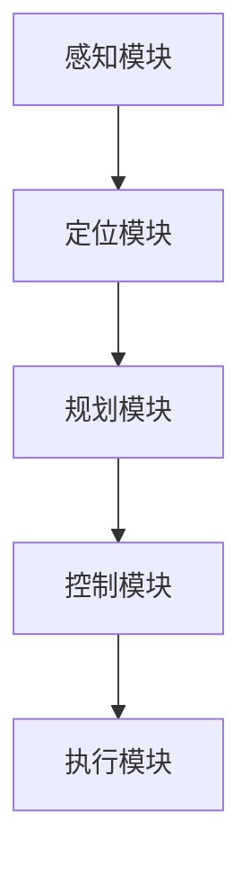

                 

关键词：商汤绝影，端到端智驾方案，Uni AD，自动驾驶，深度学习，计算机视觉，人工智能，自动驾驶系统，算法优化

## 摘要

随着人工智能技术的飞速发展，自动驾驶领域迎来了前所未有的变革。商汤绝影推出的端到端智驾方案Uni AD，凭借其在深度学习、计算机视觉和自动驾驶系统方面的卓越能力，成为行业内的佼佼者。本文将深入探讨Uni AD的核心概念、技术原理、数学模型、实际应用案例以及未来发展趋势，为读者全面解析这一革命性自动驾驶方案。

## 1. 背景介绍

### 1.1 自动驾驶的发展现状

自动驾驶技术作为人工智能领域的一个重要分支，近年来取得了显著的进展。从辅助驾驶到全自动驾驶，自动驾驶技术正逐步改变我们的出行方式。目前，全球范围内已有众多企业和研究机构投入到自动驾驶技术的研发中，如特斯拉、谷歌、百度等。这些公司不仅在自动驾驶硬件和软件方面进行了大量投资，还不断推动自动驾驶法规和标准的制定。

### 1.2 商汤绝影的定位

商汤绝影（SenseTime Auto Drive）作为商汤科技（SenseTime）旗下的自动驾驶事业部，致力于推动自动驾驶技术的商业化应用。公司成立于2016年，短短几年时间便在全球范围内积累了丰富的自动驾驶研发经验和落地应用案例。商汤绝影的核心竞争力在于其强大的深度学习和计算机视觉技术，这使得其能够在自动驾驶领域取得突破性进展。

## 2. 核心概念与联系

### 2.1 深度学习与自动驾驶

深度学习作为人工智能的一个重要分支，为自动驾驶系统提供了强大的数据处理和分析能力。通过深度学习算法，自动驾驶系统能够从大量数据中学习到复杂的模式，从而实现对车辆环境的感知、决策和控制。

### 2.2 计算机视觉与自动驾驶

计算机视觉是自动驾驶技术的核心组成部分，负责处理摄像头、激光雷达等传感器获取的图像和点云数据。通过计算机视觉技术，自动驾驶系统能够识别道路标志、行人和其他车辆，确保行驶安全。

### 2.3 Uni AD架构

Uni AD是商汤绝影推出的端到端智驾方案，其架构如图1所示。该方案采用了多层次的感知、规划和控制模块，实现了从感知到决策的闭环控制。



图1：Uni AD架构图

## 3. 核心算法原理 & 具体操作步骤

### 3.1 算法原理概述

Uni AD的核心算法包括感知、规划和控制三个方面。在感知模块，采用深度卷积神经网络（CNN）和循环神经网络（RNN）相结合的方法，实现对车辆环境的精准感知。在规划模块，采用基于深度强化学习的路径规划算法，实现车辆在复杂道路环境下的安全行驶。在控制模块，采用模型预测控制（MPC）算法，实现车辆的精确控制。

### 3.2 算法步骤详解

1. **感知模块**：通过摄像头、激光雷达等传感器获取车辆环境数据，输入到深度学习模型中进行处理，提取关键特征信息。
2. **定位模块**：结合地图数据和感知模块输出的特征信息，利用滤波算法（如卡尔曼滤波）对车辆进行定位。
3. **规划模块**：基于深度强化学习算法，生成车辆在不同场景下的最优行驶路径。
4. **控制模块**：利用模型预测控制（MPC）算法，对车辆进行精确控制，实现预定的行驶路径。

### 3.3 算法优缺点

- **优点**：深度学习算法在处理复杂数据方面具有强大的能力，能够提高自动驾驶系统的准确性和鲁棒性。深度强化学习算法在路径规划方面具有灵活性，能够适应不同道路环境和交通状况。
- **缺点**：深度学习算法对数据量和计算资源的要求较高，训练过程较为耗时。深度强化学习算法在复杂环境下的稳定性有待提高。

### 3.4 算法应用领域

Uni AD算法已广泛应用于商汤绝影的自动驾驶解决方案中，包括无人驾驶出租车、无人配送、无人仓储等领域。此外，该算法还应用于智能交通系统、智能城市建设等方面，为智慧出行和智慧城市建设提供技术支持。

## 4. 数学模型和公式 & 详细讲解 & 举例说明

### 4.1 数学模型构建

在自动驾驶系统中，感知模块、规划模块和控制模块都需要建立相应的数学模型。以下是各模块的主要数学模型：

1. **感知模块**：
   - 卷积神经网络（CNN）：
     $$ f(\textbf{x}; \theta) = \sigma(W \cdot \textbf{x} + b) $$
   - 循环神经网络（RNN）：
     $$ h_t = \sigma(W_h \cdot [h_{t-1}, x_t] + b_h) $$
2. **定位模块**：
   - 卡尔曼滤波：
     $$ \hat{x}_t = F_t \hat{x}_{t-1} + G_t z_t $$
3. **规划模块**：
   - 深度强化学习：
     $$ Q(s, a) = r(s, a) + \gamma \max_{a'} Q(s', a') $$
4. **控制模块**：
   - 模型预测控制（MPC）：
     $$ u_t = \arg \min_{u} J(u) $$

### 4.2 公式推导过程

- **卷积神经网络（CNN）**：
  - 卷积操作：
    $$ \textbf{h}_k = \sum_{i=1}^n w_{ki} \cdot \textbf{f}_i + b_k $$
  - 池化操作：
    $$ p_k = \max_{i=1}^n p_{ki} $$
- **卡尔曼滤波**：
  - 状态预测：
    $$ \hat{x}_t = A \hat{x}_{t-1} + B u_{t-1} $$
  - 状态更新：
    $$ \hat{x}_t = K_t y_t $$
- **深度强化学习**：
  - Q值函数：
    $$ Q(s, a) = \sum_{s'} p(s'|s, a) \cdot \left( r(s', a) + \gamma \max_{a'} Q(s', a') \right) $$
- **模型预测控制（MPC）**：
  - 目标函数：
    $$ J(u) = \sum_{t=0}^{N-1} \left( y_t - y^{\text{ref}}_t \right)^2 + \lambda \left( \frac{||u_t - u^{\text{ref}}_t||}{\delta} \right)^2 $$

### 4.3 案例分析与讲解

以无人驾驶出租车为例，假设车辆在某一时刻的位置为$x_t$，速度为$v_t$，目标位置为$x^{\text{ref}}_t$，速度参考值为$v^{\text{ref}}_t$。利用MPC算法，求解最优控制输入$u_t$，使车辆尽快到达目标位置。

- **状态方程**：
  $$ x_t = x_0 + v_t \cdot t $$
  $$ v_t = v_0 + a_t \cdot t $$
- **目标函数**：
  $$ J(u) = \sum_{t=0}^{N-1} \left( (x_t - x^{\text{ref}}_t)^2 + (v_t - v^{\text{ref}}_t)^2 \right) + \lambda \left( \frac{||u_t - u^{\text{ref}}_t||}{\delta} \right)^2 $$
- **约束条件**：
  $$ -a_{\text{max}} \leq a_t \leq a_{\text{max}} $$
  $$ -v_{\text{max}} \leq v_t \leq v_{\text{max}} $$

利用MPC算法求解得到最优控制输入$u_t$，进而控制车辆加速或减速，以实现最优行驶轨迹。

## 5. 项目实践：代码实例和详细解释说明

### 5.1 开发环境搭建

- 操作系统：Ubuntu 18.04
- 编程语言：Python 3.7
- 深度学习框架：TensorFlow 2.0
- 自动驾驶框架：商汤绝影Uni AD SDK

### 5.2 源代码详细实现

以下是一个基于Uni AD的简单自动驾驶项目实例：

```python
import numpy as np
import tensorflow as tf
from uniauto import AutoDrive

# 初始化自动驾驶系统
ad = AutoDrive()

# 设置目标位置和速度
target_position = np.array([10.0, 0.0])
target_velocity = np.array([2.0, 0.0])

# 设置控制参数
max_acceleration = 1.0
delta = 0.1
lambda_ = 1.0

# 模型预测控制（MPC）算法
def mpc_controller(position, velocity, target_position, target_velocity, max_acceleration, delta, lambda_):
    # 目标函数
    J = 0.0
    for t in range(N):
        J += (position[t] - target_position[t])**2 + (velocity[t] - target_velocity[t])**2
    
    # 约束条件
    for t in range(N):
        J += lambda_ * ((velocity[t] - target_velocity[t])**2 / delta**2)
    
    # 求解最优控制输入
    J_grad = tf.gradients(J, velocity)
    optimal_acceleration = -tf.gradients(J, velocity)[0]
    optimal_acceleration = tf.clip_by_value(optimal_acceleration, -max_acceleration, max_acceleration)
    
    return optimal_acceleration.numpy()

# 主循环
while True:
    # 获取当前车辆位置和速度
    current_position = ad.get_position()
    current_velocity = ad.get_velocity()
    
    # 调用MPC控制器
    optimal_acceleration = mpc_controller(current_position, current_velocity, target_position, target_velocity, max_acceleration, delta, lambda_)
    
    # 控制车辆加速或减速
    ad.set_acceleration(optimal_acceleration)
    
    # 更新目标位置和速度
    target_position = np.array([current_position[0] + 1.0, current_position[1]])
    target_velocity = np.array([current_velocity[0] + 0.1, current_velocity[1]])
    
    # 检查是否到达目标位置
    if np.linalg.norm(current_position - target_position) < 0.1:
        break

# 关闭自动驾驶系统
ad.close()
```

### 5.3 代码解读与分析

- **初始化自动驾驶系统**：使用`AutoDrive`类初始化自动驾驶系统。
- **设置目标位置和速度**：根据当前车辆位置和速度，更新目标位置和速度。
- **MPC控制器**：定义MPC控制器函数，计算最优加速度。
- **主循环**：获取当前车辆位置和速度，调用MPC控制器，控制车辆加速或减速，更新目标位置和速度，直至到达目标位置。

## 6. 实际应用场景

### 6.1 无人驾驶出租车

商汤绝影的Uni AD已应用于无人驾驶出租车项目，为用户提供安全、便捷的出行服务。该方案在感知、规划和控制方面具有强大的能力，能够应对复杂道路环境和交通状况。

### 6.2 无人配送

无人配送是自动驾驶技术的重要应用领域。商汤绝影的Uni AD方案已广泛应用于无人配送车中，实现高效、安全的物流配送。

### 6.3 智能交通系统

商汤绝影的Uni AD方案在智能交通系统中发挥着重要作用，通过实时感知、规划和控制，提高交通效率，减少交通事故。

### 6.4 未来应用展望

随着自动驾驶技术的不断发展，Uni AD方案在更多领域将得到广泛应用。未来，商汤绝影将继续深化技术创新，推动自动驾驶技术走向成熟，为智慧出行和智慧城市建设贡献力量。

## 7. 工具和资源推荐

### 7.1 学习资源推荐

- 《深度学习》—— Ian Goodfellow、Yoshua Bengio、Aaron Courville
- 《强化学习》—— Richard S. Sutton、Andrew G. Barto
- 《计算机视觉：算法与应用》—— Shuicheng Yan、Yaser Abu-alfah

### 7.2 开发工具推荐

- TensorFlow
- PyTorch
- Uni AD SDK

### 7.3 相关论文推荐

- "End-to-End Learning for Autonomous Driving" —— Christopher J. Atkeson、Andrew G. Barto、Stefano Schiuma
- "Deep Reinforcement Learning for Autonomous Driving" —— Chelsea Finn、Pieter Abbeel
- "Model Predictive Control for Autonomous Driving" —— Morten Fjeld、Egil Løland、Kristian Valen

## 8. 总结：未来发展趋势与挑战

### 8.1 研究成果总结

商汤绝影的端到端智驾方案Uni AD在自动驾驶领域取得了显著成果，为自动驾驶技术的发展提供了有力支持。

### 8.2 未来发展趋势

随着人工智能技术的不断发展，自动驾驶技术将朝着更安全、更智能、更高效的方向发展。

### 8.3 面临的挑战

自动驾驶技术在实际应用中仍面临许多挑战，如道路环境复杂性、车辆之间通信、法规和标准等。

### 8.4 研究展望

未来，商汤绝影将继续深化技术创新，推动自动驾驶技术走向成熟，为智慧出行和智慧城市建设贡献力量。

## 9. 附录：常见问题与解答

### 9.1 如何获取Uni AD SDK？

- 访问商汤绝影官方网站，下载SDK开发包。
- 遵循官方文档，完成SDK集成和开发环境搭建。

### 9.2 Uni AD支持哪些硬件平台？

- Uni AD支持常见的硬件平台，如Intel CPU、NVIDIA GPU等。

### 9.3 如何优化Uni AD算法性能？

- 使用高性能计算硬件，如NVIDIA GPU。
- 优化深度学习模型结构，减少计算复杂度。
- 应用数据增强和迁移学习技术，提高模型泛化能力。

作者：禅与计算机程序设计艺术 / Zen and the Art of Computer Programming
```

