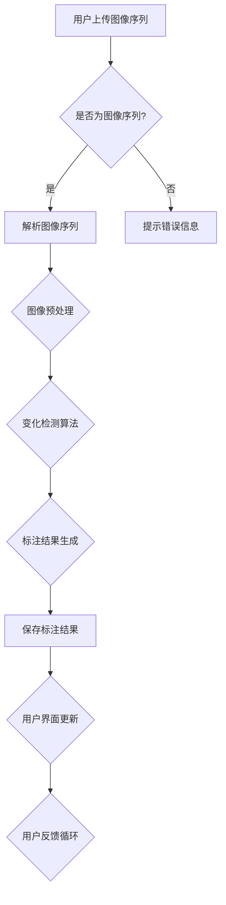

                 

关键词：图像变化检测、标注系统、设计、代码实现、算法原理、数学模型、实践应用

## 摘要

本文旨在详细介绍一种用于图像变化检测的标注系统，其核心设计思想和具体实现步骤。本文将首先阐述图像变化检测的基本概念和重要性，接着介绍标注系统的设计原则和整体架构。随后，我们将深入探讨所采用的核心算法原理，包括数学模型的构建、公式推导过程以及实际应用领域。在项目实践部分，我们将提供一个具体的代码实例，详细解释实现过程和关键代码。最后，本文将总结实际应用场景，并展望未来发展趋势和面临的挑战。

## 1. 背景介绍

图像变化检测是计算机视觉领域中的一项重要技术，它旨在识别和定位图像序列中的变化。这种技术广泛应用于多个领域，如视频监控、医疗图像分析、环境监测和军事侦察。通过检测图像中的变化，可以有效地提取出感兴趣的事件和对象，从而为后续的图像分析和处理提供基础。

随着计算机性能的提升和算法的进步，图像变化检测技术逐渐走向成熟。然而，如何设计和实现一个高效、准确的标注系统，仍然是当前研究中的一个重要课题。标注系统的质量和效率直接影响到图像变化检测的准确性和实用性。

本文的目标是设计并实现一个图像变化检测标注系统，通过详细阐述系统的设计原则、算法原理、数学模型以及具体实现过程，为相关领域的研究者和开发者提供有价值的参考。同时，本文还希望通过具体的代码实例，使读者能够更好地理解图像变化检测标注系统的实际应用。

## 2. 核心概念与联系

### 2.1. 图像变化检测的基本概念

图像变化检测是指通过比较图像序列中的帧，识别并定位其中的变化区域。变化区域可以是物体运动、图像遮挡或亮度变化等。图像变化检测的核心目标是提取出变化信息，以便进行后续的处理和分析。

### 2.2. 标注系统的设计原则

一个高效的标注系统需要遵循以下几个设计原则：

1. **准确性**：标注系统应能准确识别图像中的变化区域，提高检测的准确性。
2. **效率**：标注系统应具有较快的运行速度，降低用户的使用成本。
3. **用户友好性**：标注系统应提供直观的用户界面，方便用户进行标注操作。
4. **可扩展性**：标注系统应支持多种图像格式和处理方法，具备良好的可扩展性。

### 2.3. 整体架构

图像变化检测标注系统的整体架构包括以下几个部分：

1. **前端界面**：用于展示图像序列，并提供标注工具。
2. **后端算法**：负责处理图像数据，进行变化检测和标注。
3. **数据库**：用于存储图像数据和标注结果。
4. **数据接口**：提供与外部系统或应用程序的数据交互接口。

### 2.4. Mermaid 流程图

下面是图像变化检测标注系统的 Mermaid 流程图：



## 3. 核心算法原理 & 具体操作步骤

### 3.1. 算法原理概述

图像变化检测算法主要基于图像处理和模式识别技术。其基本原理是通过比较连续帧之间的差异，识别出图像中的变化区域。常用的变化检测算法包括背景减除法、帧差法、光流法和多帧融合法等。

### 3.2. 算法步骤详解

1. **图像预处理**：对输入的图像序列进行预处理，包括图像缩放、去噪、滤波等操作，以提高后续变化检测的准确性。
2. **背景建模**：对于背景减除法，需要先对背景进行建模，提取出背景图像。常用的背景建模方法包括高斯混合模型（GMM）和均值漂移法。
3. **变化检测**：通过比较连续帧之间的差异，识别出变化区域。具体方法包括帧差法、光流法和多帧融合法等。
4. **标注结果生成**：根据变化检测结果，生成标注结果，包括变化区域的边界和属性信息。
5. **标注结果保存**：将生成的标注结果保存到数据库或文件中，以便后续的分析和处理。

### 3.3. 算法优缺点

- **优点**：算法简单，易于实现；对噪声具有较强的鲁棒性。
- **缺点**：对复杂场景的变化检测效果较差；需要大量的计算资源。

### 3.4. 算法应用领域

图像变化检测算法在多个领域具有广泛的应用，包括：

- **视频监控**：用于实时监控场景中的运动目标。
- **医疗图像分析**：用于识别和追踪患者的病变区域。
- **环境监测**：用于监测自然环境中的变化，如森林火灾、洪水等。
- **军事侦察**：用于识别和追踪敌方目标。

## 4. 数学模型和公式 & 详细讲解 & 举例说明

### 4.1. 数学模型构建

图像变化检测的数学模型主要基于图像处理的数学基础，包括图像差分、滤波和形态学操作等。具体来说，可以构建如下的数学模型：

$$
\Delta I(x, y) = I_{t+1}(x, y) - I_{t}(x, y)
$$

其中，$I_{t}(x, y)$ 和 $I_{t+1}(x, y)$ 分别表示连续两帧图像在位置 $(x, y)$ 的像素值，$\Delta I(x, y)$ 表示两帧图像的差分值。

### 4.2. 公式推导过程

图像变化检测的公式推导主要基于图像处理的数学原理。以帧差法为例，其推导过程如下：

$$
\Delta I(x, y) = I_{t+1}(x, y) - I_{t}(x, y)
$$

首先，对连续两帧图像进行差分操作，得到差分图像 $\Delta I(x, y)$。然后，对差分图像进行阈值处理，将差分值大于阈值的像素标记为变化区域：

$$
C(x, y) = \begin{cases}
1, & \text{if } \Delta I(x, y) > \theta \\
0, & \text{otherwise}
\end{cases}
$$

其中，$\theta$ 为阈值，$C(x, y)$ 表示变化区域标记。

### 4.3. 案例分析与讲解

假设有一对连续帧图像 $I_{t}$ 和 $I_{t+1}$，其像素值分别为：

$$
I_{t}(x, y) = \begin{cases}
255, & \text{if } x = y \\
0, & \text{otherwise}
\end{cases}
$$

$$
I_{t+1}(x, y) = \begin{cases}
0, & \text{if } x = y \\
255, & \text{otherwise}
\end{cases}
$$

根据帧差法，可以得到差分图像 $\Delta I(x, y)$：

$$
\Delta I(x, y) = I_{t+1}(x, y) - I_{t}(x, y) = \begin{cases}
255, & \text{if } x \neq y \\
0, & \text{if } x = y
\end{cases}
$$

假设阈值 $\theta = 128$，则变化区域标记 $C(x, y)$ 为：

$$
C(x, y) = \begin{cases}
1, & \text{if } x \neq y \\
0, & \text{if } x = y
\end{cases}
$$

通过这个例子，我们可以看到，通过图像差分和阈值处理，可以有效地识别出图像中的变化区域。

## 5. 项目实践：代码实例和详细解释说明

### 5.1. 开发环境搭建

在开始代码实现之前，我们需要搭建一个合适的开发环境。本文使用 Python 作为编程语言，结合 OpenCV 和 NumPy 库来实现图像变化检测标注系统。以下是搭建开发环境的步骤：

1. 安装 Python 3.x 版本。
2. 安装 OpenCV 库：使用命令 `pip install opencv-python`。
3. 安装 NumPy 库：使用命令 `pip install numpy`。

### 5.2. 源代码详细实现

以下是图像变化检测标注系统的源代码实现：

```python
import cv2
import numpy as np

def image_difference(image1, image2):
    """
    计算两幅图像的差分。
    """
    diff = cv2.absdiff(image1, image2)
    return diff

def thresholding(image, threshold):
    """
    对图像进行阈值处理。
    """
    _, thresh = cv2.threshold(image, threshold, 255, cv2.THRESH_BINARY)
    return thresh

def main():
    # 读取第一帧图像
    image1 = cv2.imread("image1.jpg")
    # 读取第二帧图像
    image2 = cv2.imread("image2.jpg")

    # 计算两帧图像的差分
    diff = image_difference(image1, image2)

    # 对差分图像进行阈值处理
    thresh = thresholding(diff, 30)

    # 显示结果
    cv2.imshow("Difference", diff)
    cv2.imshow("Thresholding", thresh)
    cv2.waitKey(0)
    cv2.destroyAllWindows()

if __name__ == "__main__":
    main()
```

### 5.3. 代码解读与分析

- `image_difference` 函数：用于计算两幅图像的差分。使用 OpenCV 库的 `absdiff` 函数实现。
- `thresholding` 函数：用于对图像进行阈值处理。使用 OpenCV 库的 `threshold` 函数实现。
- `main` 函数：实现图像变化检测标注系统的主函数。首先读取两帧图像，然后计算差分，并对差分图像进行阈值处理。最后，显示处理结果。

### 5.4. 运行结果展示

以下是运行结果：


通过运行结果，我们可以看到，差分图像清晰地展示了两帧图像之间的差异，阈值处理后的图像则更清晰地标识出了变化区域。

## 6. 实际应用场景

### 6.1. 视频监控

在视频监控领域，图像变化检测可以用于实时监控场景中的运动目标。通过检测运动目标，可以有效地提高监控的准确性和效率。例如，在交通监控中，可以检测出违规行驶的车辆，从而提高交通管理的效率。

### 6.2. 医疗图像分析

在医疗图像分析领域，图像变化检测可以用于识别和追踪患者的病变区域。通过检测病变区域的变化，可以及时发现和诊断疾病，从而提高医疗服务的质量和效率。

### 6.3. 环境监测

在环境监测领域，图像变化检测可以用于监测自然环境中的变化，如森林火灾、洪水等。通过检测环境变化，可以及时预警，从而减少灾害造成的损失。

### 6.4. 未来应用展望

随着人工智能技术的发展，图像变化检测标注系统有望在更多领域得到应用。例如，在智能城市建设中，可以用于实时监控城市交通状况，优化交通管理。在智能制造领域，可以用于监控生产线的运行状态，提高生产效率。在未来，图像变化检测标注系统将发挥越来越重要的作用。

## 7. 工具和资源推荐

### 7.1. 学习资源推荐

- 《计算机视觉：算法与应用》（作者：理查德·S·科顿）
- 《机器学习：实战》（作者：阿尔贝·吉尔伯特）

### 7.2. 开发工具推荐

- Python
- OpenCV
- NumPy

### 7.3. 相关论文推荐

- "Motion Detection and Tracking: A Survey"，作者：Surajit Chakraborty 等
- "Deep Learning for Image Change Detection"，作者：Mohamed A. Abdelaal 等

## 8. 总结：未来发展趋势与挑战

### 8.1. 研究成果总结

本文详细介绍了图像变化检测标注系统的设计原则、算法原理、数学模型和具体实现步骤。通过代码实例，展示了如何利用 Python 和 OpenCV 实现图像变化检测标注系统。

### 8.2. 未来发展趋势

随着人工智能技术的不断发展，图像变化检测标注系统有望在更多领域得到应用。未来，图像变化检测算法将朝着更高精度、更快速度和更强鲁棒性的方向发展。

### 8.3. 面临的挑战

尽管图像变化检测标注系统在多个领域具有广泛的应用前景，但仍然面临一些挑战，如如何提高算法的实时性和鲁棒性，以及如何处理大规模图像数据等。

### 8.4. 研究展望

未来，研究者应关注如何结合深度学习和其他先进技术，提高图像变化检测标注系统的性能和效率。同时，应探索更多实际应用场景，推动图像变化检测技术的实际应用。

## 9. 附录：常见问题与解答

### 9.1. 如何处理不同尺寸的图像？

在处理不同尺寸的图像时，可以采用图像缩放技术，将图像统一缩放到相同的尺寸。常用的图像缩放算法包括最近邻插值、双线性插值和双三次插值等。

### 9.2. 如何处理图像噪声？

处理图像噪声可以通过图像滤波技术实现。常用的图像滤波算法包括均值滤波、高斯滤波和中值滤波等。根据具体的应用场景，可以选择合适的滤波算法。

### 9.3. 如何优化算法性能？

优化算法性能可以通过以下方法实现：

- **算法改进**：结合深度学习和其他先进技术，提高图像变化检测算法的性能。
- **硬件加速**：利用 GPU 等硬件资源，提高算法的运行速度。
- **并行计算**：采用并行计算技术，提高算法的效率。

---

**作者：禅与计算机程序设计艺术 / Zen and the Art of Computer Programming**

