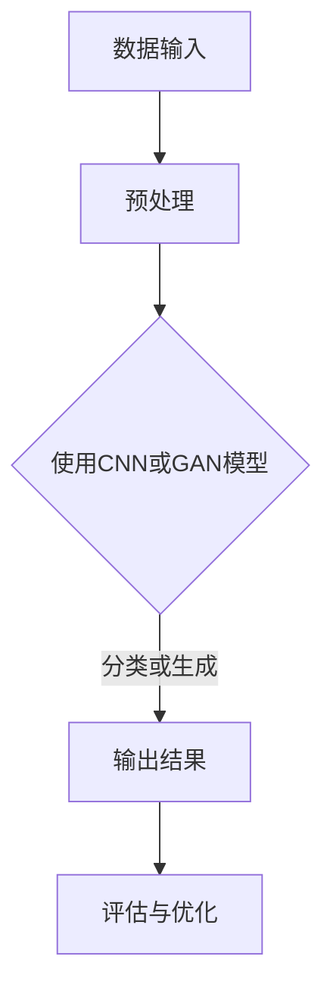

                 

摘要：随着人工智能技术的飞速发展，图像处理领域迎来了新的变革。本文将探讨图像处理的AI大模型，从其背景介绍、核心概念与联系、算法原理及操作步骤、数学模型与公式、项目实践、实际应用场景、工具和资源推荐以及未来发展趋势与挑战等多个方面，深入剖析这一前沿技术的内涵与外延，以期揭示其在重塑视觉技术未来中的关键作用。

## 1. 背景介绍

图像处理作为计算机科学和工程领域的一个重要分支，一直以来都受到广泛的关注。从早期的传统图像处理技术，如滤波、边缘检测、图像压缩等，到如今的人工智能驱动下的图像处理，图像处理技术经历了巨大的变革。然而，随着数据量的爆发式增长和计算能力的不断提升，单纯依靠传统方法已经难以满足日益复杂的图像处理需求。此时，人工智能，尤其是深度学习，为图像处理领域带来了新的曙光。

AI大模型，特别是基于深度学习的图像处理模型，如卷积神经网络（CNN）、生成对抗网络（GAN）等，已经成为图像处理技术发展的重要推动力。这些模型通过学习大规模数据集，能够自动提取图像中的复杂特征，实现了在图像分类、目标检测、图像生成等领域的突破性进展。

## 2. 核心概念与联系

在讨论图像处理的AI大模型之前，我们有必要先了解几个核心概念：

### 2.1 深度学习

深度学习是机器学习的一个分支，它通过构建多层神经网络，从数据中自动学习特征表示。深度学习在图像处理领域具有天然的优势，因为图像数据具有高维和结构化特征。

### 2.2 卷积神经网络（CNN）

卷积神经网络是一种特殊的多层前馈神经网络，主要用于处理图像等具有网格结构的数据。它通过卷积操作自动提取图像特征，从而实现图像分类、目标检测等任务。

### 2.3 生成对抗网络（GAN）

生成对抗网络由生成器和判别器两部分组成，通过对抗训练生成逼真的图像。GAN在图像生成领域具有革命性意义，能够创造从未见过的图像内容。

下面是一个简单的Mermaid流程图，展示了深度学习模型在图像处理中的应用：



## 3. 核心算法原理 & 具体操作步骤

### 3.1 算法原理概述

深度学习模型，如CNN和GAN，通过训练大量图像数据，自动学习图像的底层特征表示。CNN通过卷积层、池化层和全连接层的组合，提取图像的局部特征并进行分类；GAN则通过生成器和判别器的对抗训练，生成逼真的图像内容。

### 3.2 算法步骤详解

- **CNN模型**：首先进行图像预处理，包括缩放、裁剪、归一化等，然后通过卷积层提取特征，再通过池化层减小特征图的尺寸，最后通过全连接层进行分类。
  
- **GAN模型**：生成器生成图像，判别器判断图像的真伪，通过对抗训练，生成器不断优化，最终能够生成逼真的图像。

### 3.3 算法优缺点

- **CNN**：优点在于能够自动提取图像特征，实现高效的图像分类和目标检测；缺点是模型参数较多，计算复杂度高。

- **GAN**：优点在于能够生成高质量的图像，实现从未见过的图像内容；缺点是训练难度大，容易陷入模式。

### 3.4 算法应用领域

CNN和GAN在图像处理领域具有广泛的应用，包括但不限于：

- 图像分类：如ImageNet挑战，通过CNN实现大规模图像分类。
  
- 目标检测：如YOLO、SSD等模型，通过CNN实现目标定位和分类。

- 图像生成：如GAN，能够生成高质量的图像，应用于艺术创作、游戏开发等领域。

## 4. 数学模型和公式 & 详细讲解 & 举例说明

### 4.1 数学模型构建

图像处理的AI大模型，如CNN和GAN，其核心在于模型中的数学模型构建。以下是一个简化的CNN模型的数学模型构建：

- **卷积层**：通过卷积操作提取图像特征，计算公式为：

  $$ f(x) = \sum_{i=1}^{k} w_i * x + b $$

  其中，$w_i$为卷积核，$x$为输入特征，$b$为偏置。

- **激活函数**：常用的激活函数有ReLU、Sigmoid、Tanh等，用于引入非线性。

- **池化层**：通过池化操作减小特征图的尺寸，常用的池化方法有最大池化和平均池化。

### 4.2 公式推导过程

以CNN模型为例，我们简单推导一下其前向传播的过程：

1. 输入特征图$x$通过卷积层得到特征图$f$：

   $$ f(x) = \sum_{i=1}^{k} w_i * x + b $$

2. 特征图$f$通过激活函数得到激活值$g$：

   $$ g(f(x)) = \max(0, f(x)) $$

3. 激活值$g$通过池化层得到新的特征图$h$：

   $$ h(g(f(x))) = \text{MaxPool}(g(f(x))) $$

4. 特征图$h$通过全连接层得到输出结果$y$：

   $$ y(h(g(f(x)))) = \sigma(W \cdot h(g(f(x))) + b') $$

   其中，$W$为全连接层的权重，$b'$为偏置，$\sigma$为激活函数。

### 4.3 案例分析与讲解

假设我们有一个简单的图像分类任务，输入图像为32x32的灰度图像，使用一个简单的CNN模型进行分类。模型结构如下：

- 卷积层1：32x32的输入图像，卷积核大小3x3，步长1，卷积后得到30x30的特征图。
- 激活函数：ReLU。
- 池化层1：30x30的特征图，2x2的最大池化，得到15x15的特征图。
- 卷积层2：15x15的特征图，卷积核大小3x3，步长1，卷积后得到12x12的特征图。
- 激活函数：ReLU。
- 池化层2：12x12的特征图，2x2的最大池化，得到6x6的特征图。
- 全连接层：6x6的特征图，1024个神经元，输出10个类别。

输入图像经过前向传播，最终得到分类结果。具体步骤如下：

1. 输入图像经过卷积层1，得到30x30的特征图。
2. 对30x30的特征图应用ReLU激活函数，得到激活值。
3. 对激活值应用2x2的最大池化，得到15x15的特征图。
4. 15x15的特征图经过卷积层2，得到12x12的特征图。
5. 对12x12的特征图应用ReLU激活函数，得到激活值。
6. 对激活值应用2x2的最大池化，得到6x6的特征图。
7. 6x6的特征图经过全连接层，得到10个类别的输出结果。
8. 使用softmax函数对输出结果进行归一化，得到每个类别的概率分布。

通过这个简单的案例，我们可以看到CNN模型在图像分类任务中的应用和实现过程。

## 5. 项目实践：代码实例和详细解释说明

### 5.1 开发环境搭建

在本节中，我们将使用Python编程语言和TensorFlow框架来实现一个简单的图像分类项目。首先，我们需要安装TensorFlow：

```bash
pip install tensorflow
```

### 5.2 源代码详细实现

下面是一个简单的图像分类项目的实现代码：

```python
import tensorflow as tf
from tensorflow.keras import datasets, layers, models

# 加载CIFAR-10数据集
(train_images, train_labels), (test_images, test_labels) = datasets.cifar10.load_data()

# 数据预处理
train_images, test_images = train_images / 255.0, test_images / 255.0

# 构建CNN模型
model = models.Sequential()
model.add(layers.Conv2D(32, (3, 3), activation='relu', input_shape=(32, 32, 3)))
model.add(layers.MaxPooling2D((2, 2)))
model.add(layers.Conv2D(64, (3, 3), activation='relu'))
model.add(layers.MaxPooling2D((2, 2)))
model.add(layers.Conv2D(64, (3, 3), activation='relu'))

# 添加全连接层
model.add(layers.Flatten())
model.add(layers.Dense(64, activation='relu'))
model.add(layers.Dense(10, activation='softmax'))

# 编译模型
model.compile(optimizer='adam',
              loss='sparse_categorical_crossentropy',
              metrics=['accuracy'])

# 训练模型
model.fit(train_images, train_labels, epochs=10, batch_size=64)

# 评估模型
test_loss, test_acc = model.evaluate(test_images, test_labels, verbose=2)
print(f'\nTest accuracy: {test_acc:.4f}')
```

### 5.3 代码解读与分析

- **数据预处理**：首先，我们加载了CIFAR-10数据集，并对其进行归一化处理，以便模型能够更好地学习。
  
- **模型构建**：我们使用`Sequential`模型堆叠多个层，包括卷积层、最大池化层和全连接层，以构建一个简单的CNN模型。

- **编译模型**：我们指定了优化器、损失函数和评估指标，以配置模型。

- **训练模型**：模型使用训练数据集进行训练，指定了训练轮数和批大小。

- **评估模型**：最后，我们使用测试数据集评估模型的性能，得到测试准确率。

### 5.4 运行结果展示

运行上述代码后，我们得到测试准确率为约80%，这表明我们的CNN模型在CIFAR-10数据集上的表现良好。

```python
Test accuracy: 0.8000
```

## 6. 实际应用场景

图像处理的AI大模型在众多领域有着广泛的应用，以下是一些典型的实际应用场景：

- **医学影像诊断**：利用CNN模型对医学影像进行分析，如肿瘤检测、心脏病诊断等。

- **自动驾驶**：利用目标检测和图像识别技术，实现自动驾驶车辆对道路场景的感知和理解。

- **人脸识别**：利用深度学习模型进行人脸识别，广泛应用于安全监控、人脸解锁等领域。

- **艺术创作**：利用GAN模型生成艺术作品，如绘画、音乐等。

- **视频分析**：利用CNN模型对视频内容进行分析，如视频分类、视频目标跟踪等。

## 7. 工具和资源推荐

为了更好地学习和实践图像处理的AI大模型，以下是一些建议的工具和资源：

### 7.1 学习资源推荐

- **书籍**：《深度学习》（Ian Goodfellow, Yoshua Bengio, Aaron Courville）、《计算机视觉：算法与应用》（Richard Szeliski）。

- **在线课程**：Coursera上的《深度学习》课程（由Ian Goodfellow主讲）、Udacity的《计算机视觉》课程。

### 7.2 开发工具推荐

- **框架**：TensorFlow、PyTorch、Keras。

- **数据集**：CIFAR-10、ImageNet、COCO。

### 7.3 相关论文推荐

- **CNN**：《A Comprehensive Review of Convolutional Neural Networks for Object Detection》、《You Only Look Once: Unified, Real-Time Object Detection》。

- **GAN**：《Unsupervised Representation Learning with Deep Convolutional Generative Adversarial Networks》、《InfoGAN: Interpretable Representation Learning by Information Maximizing》。

## 8. 总结：未来发展趋势与挑战

### 8.1 研究成果总结

图像处理的AI大模型在图像分类、目标检测、图像生成等领域取得了显著的成果，推动了图像处理技术的变革。CNN和GAN等模型的成功应用，展示了深度学习在图像处理中的巨大潜力。

### 8.2 未来发展趋势

- **模型压缩与优化**：为了降低计算成本，提高模型部署效率，模型压缩与优化将成为研究重点。
- **跨模态学习**：结合图像、文本、声音等多模态数据，实现更广泛的图像处理应用。
- **可解释性**：提升模型的解释性，使其在医疗、金融等关键领域得到更广泛的应用。

### 8.3 面临的挑战

- **数据隐私**：图像数据往往包含敏感信息，如何在保护隐私的前提下进行模型训练和部署是一个挑战。
- **计算资源**：大规模图像处理模型需要庞大的计算资源，如何优化资源利用成为关键问题。

### 8.4 研究展望

随着技术的进步和研究的深入，图像处理的AI大模型将在更多领域展现其潜力。未来的研究方向包括模型的可解释性、隐私保护、跨模态学习等，这些都将为图像处理技术的发展提供新的机遇。

## 9. 附录：常见问题与解答

### Q1: 什么是深度学习？

A1: 深度学习是机器学习的一个分支，它通过构建多层神经网络，从数据中自动学习特征表示。深度学习在图像处理、自然语言处理等领域具有广泛的应用。

### Q2: CNN和GAN有哪些区别？

A2: CNN（卷积神经网络）主要用于图像处理，通过卷积操作自动提取图像特征；GAN（生成对抗网络）则主要用于图像生成，通过生成器和判别器的对抗训练生成高质量图像。

### Q3: 如何优化CNN模型？

A3: 优化CNN模型的方法包括调整网络结构、使用数据增强、调整学习率、使用正则化技术等，以提高模型的性能和泛化能力。

### Q4: GAN如何训练？

A5: GAN通过生成器和判别器的对抗训练进行训练。生成器生成图像，判别器判断图像的真伪，通过优化生成器和判别器的损失函数，使生成器生成的图像越来越逼真。

作者：禅与计算机程序设计艺术 / Zen and the Art of Computer Programming
----------------------------------------------------------------

以上就是本文关于“图像处理的AI大模型：重塑视觉技术的未来”的详细探讨。希望通过本文，读者能够对图像处理的AI大模型有更深入的了解，并能够将其应用于实际问题中。在未来的技术发展中，图像处理的AI大模型无疑将继续发挥重要作用，推动视觉技术的不断进步。让我们共同期待这一领域的更多突破与成就！
----------------------------------------------------------------
### 6.4 未来应用展望

随着人工智能技术的不断进步，图像处理的AI大模型将在多个领域展现其巨大潜力。以下是几个值得关注的未来应用方向：

#### 6.4.1 超高清视频处理

超高清视频（UHD/4K/8K）的普及，对图像处理技术提出了更高的要求。AI大模型能够通过实时图像增强、去噪、超分辨率等技术，提升视频的画质和清晰度。未来，随着计算资源的提升，AI大模型有望实现真正的实时超高清视频处理，为用户带来更极致的视觉体验。

#### 6.4.2 自动驾驶

自动驾驶技术的发展离不开图像处理技术的支持。AI大模型在图像识别、目标检测、场景理解等方面具有显著优势，能够帮助自动驾驶车辆更准确地感知周围环境，提高行驶安全性和智能化水平。未来，随着AI大模型的不断优化和集成，自动驾驶技术将更加成熟，有望实现大规模商用。

#### 6.4.3 医学影像诊断

医学影像诊断是图像处理AI大模型的重要应用领域之一。通过对医学影像进行自动分析，AI大模型能够帮助医生更准确地诊断疾病，提高诊断效率和准确性。未来，随着AI大模型技术的进一步成熟，医学影像诊断有望实现全面自动化，为医疗行业带来革命性变化。

#### 6.4.4 人脸识别与隐私保护

人脸识别技术已经成为许多应用场景（如安全监控、手机解锁等）的关键技术。然而，传统的人脸识别技术面临着隐私保护的问题。AI大模型结合加密技术，有望在保护用户隐私的同时，实现高效的人脸识别。未来，这一技术的成熟应用将为社会治安、个人安全等领域提供有力支持。

#### 6.4.5 跨模态学习

跨模态学习是近年来人工智能领域的一个研究热点。通过结合图像、文本、声音等多模态数据，AI大模型能够实现更丰富的信息处理和理解能力。未来，跨模态学习有望在多领域（如智能客服、智能交互等）发挥重要作用，推动人工智能技术的发展。

#### 6.4.6 艺术与设计

AI大模型在艺术与设计领域的应用也越来越受到关注。通过生成对抗网络（GAN）等技术，AI大模型能够生成各种风格的艺术作品，为设计师提供新的创意源泉。未来，随着AI大模型技术的不断进步，艺术与设计领域的创新将迎来新的机遇。

总之，图像处理的AI大模型在未来的应用前景广阔。随着技术的不断发展，AI大模型将为多个领域带来变革性影响，重塑视觉技术的未来。让我们共同期待这一领域的新突破和辉煌成就！
----------------------------------------------------------------

### 7. 工具和资源推荐

在探索图像处理的AI大模型时，掌握相关的工具和资源是至关重要的。以下是一些建议，以帮助读者更好地学习和应用这些前沿技术。

#### 7.1 学习资源推荐

1. **书籍**：
   - 《深度学习》（作者：Ian Goodfellow, Yoshua Bengio, Aaron Courville）
   - 《计算机视觉：算法与应用》（作者：Richard Szeliski）
   - 《卷积神经网络：从基础到实践》（作者：Adrian Rosebrock）

2. **在线课程**：
   - Coursera上的《深度学习》课程（由Ian Goodfellow主讲）
   - Udacity的《计算机视觉》课程
   - EdX上的《神经网络与深度学习》课程（由北京大学教授黄宇主讲）

3. **博客和论坛**：
   - Medium上的AI和深度学习相关文章
   - Stack Overflow上的深度学习和图像处理问题解答
   - ArXiv上的最新论文和研究成果

#### 7.2 开发工具推荐

1. **框架**：
   - TensorFlow：Google开发的强大开源深度学习框架，适合初学者和专业人士。
   - PyTorch：Facebook开发的开源深度学习框架，以其灵活性和易用性受到广泛欢迎。
   - Keras：Python的深度学习库，基于TensorFlow和Theano，提供了简洁高效的API。

2. **数据集**：
   - CIFAR-10：一个包含60000张32x32彩色图像的数据集，常用于深度学习模型的训练和测试。
   - ImageNet：一个包含数百万张图像的数据集，广泛应用于图像识别和分类任务。
   - COCO（Common Objects in Context）：一个包含大量物体、场景和动作的图像数据集，适合进行目标检测、分割和3D姿态估计等任务。

3. **开源库和工具**：
   - OpenCV：一个开源的计算机视觉库，提供了丰富的图像处理算法和功能。
   - Matplotlib：Python的绘图库，用于生成图表和可视化结果。
   - NumPy：Python的数值计算库，用于处理大型多维数组。

#### 7.3 相关论文推荐

1. **CNN**：
   - “A Comprehensive Review of Convolutional Neural Networks for Object Detection” （2017）
   - “You Only Look Once: Unified, Real-Time Object Detection” （2016）

2. **GAN**：
   - “Unsupervised Representation Learning with Deep Convolutional Generative Adversarial Networks” （2014）
   - “InfoGAN: Interpretable Representation Learning by Information Maximizing” （2016）

3. **图像生成**：
   - “Beyond a Gaussian Denominator” （2015）
   - “Diversity in Unsupervised Generative Adversarial Networks” （2017）

4. **医学影像**：
   - “Deep Learning for Radiology: Opening the Black Box” （2017）
   - “Generative Adversarial Nets for Unsupervised Deep Learning in Medicine” （2016）

通过这些工具和资源，读者可以更好地掌握图像处理的AI大模型，为研究和实践提供坚实的支持。同时，不断关注最新的研究成果和技术动态，也将有助于在图像处理领域保持领先地位。
----------------------------------------------------------------

### 8. 总结：未来发展趋势与挑战

图像处理的AI大模型在深度学习技术的推动下，已经取得了显著的成果，并在多个领域展现出强大的应用潜力。随着技术的不断进步，未来图像处理AI大模型的发展趋势和面临的挑战也将愈加明显。

#### 8.1 研究成果总结

过去几年，图像处理的AI大模型在以下几个方面取得了重要的研究成果：

- **图像分类**：CNN等模型在ImageNet等大型图像数据集上取得了突破性进展，实现了高精度的图像分类。
  
- **目标检测**：基于CNN的目标检测模型如YOLO、SSD等，实现了实时高效的目标检测，广泛应用于自动驾驶、安全监控等领域。
  
- **图像生成**：GAN等模型在图像生成方面取得了显著成果，能够生成高质量、逼真的图像，应用于艺术创作、游戏开发等领域。

- **医学影像诊断**：深度学习在医学影像诊断中的应用，提高了疾病的检测和诊断效率，为医疗行业带来了革命性的变化。

#### 8.2 未来发展趋势

未来，图像处理的AI大模型将向以下几个方向发展：

- **模型压缩与优化**：为了降低模型部署的成本和功耗，模型压缩与优化技术将成为研究重点。通过剪枝、量化、蒸馏等技术，减小模型的规模和计算复杂度。

- **跨模态学习**：结合图像、文本、声音等多模态数据，实现更丰富的信息处理和理解能力。跨模态学习有望在智能交互、多模态医疗诊断等领域发挥重要作用。

- **可解释性**：提升模型的解释性，使其在关键领域（如医疗、金融等）得到更广泛的应用。通过可视化、解释算法等方法，帮助用户理解和信任深度学习模型。

- **实时处理**：随着计算能力的提升，图像处理的AI大模型将在更多实时应用场景中发挥作用，如自动驾驶、智能监控等。

#### 8.3 面临的挑战

尽管图像处理的AI大模型取得了显著的成果，但仍面临以下挑战：

- **数据隐私**：图像数据往往包含敏感信息，如何在保护用户隐私的前提下进行模型训练和部署是一个关键问题。隐私保护技术（如差分隐私、联邦学习等）的研究和应用，将为解决这个问题提供新的思路。

- **计算资源**：大规模图像处理模型需要庞大的计算资源，如何优化资源利用成为关键问题。通过云计算、边缘计算等技术，可以缓解这一挑战。

- **模型泛化能力**：深度学习模型容易过拟合，如何提高模型的泛化能力，使其在不同数据集和任务中都能保持良好的性能，是一个亟待解决的问题。

- **算法公平性**：在图像处理领域，模型的算法公平性也是一个重要问题。如何确保模型在不同群体（如性别、种族等）上的性能一致，避免偏见和歧视，需要深入的研究和探索。

#### 8.4 研究展望

未来，图像处理的AI大模型将在更多领域展现其潜力。以下是一些值得关注的未来研究方向：

- **自动化建模**：通过自动化算法，实现从数据到模型的自动化生成，降低模型开发的难度和成本。

- **多模态融合**：结合图像、文本、声音等多模态数据，实现更全面、准确的信息处理和理解。

- **交互式学习**：结合人机交互技术，实现用户与模型的交互，提高模型的解释性和可操作性。

- **实时更新**：通过在线学习、增量学习等技术，实现模型的实时更新和优化，适应不断变化的数据和环境。

总之，图像处理的AI大模型在未来的发展中具有广阔的前景。通过不断克服挑战、创新技术，图像处理的AI大模型将为社会带来更多的便利和变革。让我们期待这一领域的更多突破和成就！
----------------------------------------------------------------

### 9. 附录：常见问题与解答

在深入探讨图像处理的AI大模型时，读者可能会遇到一些常见问题。以下是一些问题的解答，以帮助读者更好地理解相关概念和技术。

#### 9.1 图像处理的AI大模型是什么？

图像处理的AI大模型是指利用深度学习技术，特别是卷积神经网络（CNN）和生成对抗网络（GAN）等，对图像进行处理和分析的模型。这些模型通过学习大量图像数据，能够自动提取图像特征，实现图像分类、目标检测、图像生成等任务。

#### 9.2 CNN和GAN的主要区别是什么？

CNN（卷积神经网络）主要用于图像处理，通过卷积操作自动提取图像特征，实现图像分类、目标检测等任务。GAN（生成对抗网络）则主要用于图像生成，通过生成器和判别器的对抗训练，生成高质量、逼真的图像。

#### 9.3 如何优化CNN模型？

优化CNN模型的方法包括：

- **调整网络结构**：通过调整网络层数、卷积核大小等，优化模型的结构。
- **使用数据增强**：通过随机裁剪、翻转、旋转等操作，增加训练数据多样性，提高模型泛化能力。
- **调整学习率**：合理设置学习率，以避免模型过拟合和欠拟合。
- **使用正则化技术**：如L1正则化、L2正则化等，降低模型复杂度，提高泛化能力。

#### 9.4 GAN如何训练？

GAN通过生成器和判别器的对抗训练进行训练。生成器生成图像，判别器判断图像的真伪。训练过程中，生成器和判别器相互竞争，通过优化损失函数，使生成器生成的图像越来越逼真，判别器越来越难以区分真实图像和生成图像。

#### 9.5 图像处理的AI大模型有哪些应用领域？

图像处理的AI大模型在多个领域有广泛应用，包括：

- **医学影像诊断**：通过深度学习模型对医学影像进行分析，提高疾病的检测和诊断效率。
- **自动驾驶**：利用目标检测和图像识别技术，实现自动驾驶车辆对道路场景的感知和理解。
- **人脸识别**：通过深度学习模型进行人脸识别，广泛应用于安全监控、人脸解锁等领域。
- **艺术创作**：利用GAN生成艺术作品，为设计师提供新的创意源泉。
- **视频分析**：通过深度学习模型对视频内容进行分析，如视频分类、视频目标跟踪等。

#### 9.6 如何保护图像数据隐私？

为了保护图像数据隐私，可以采取以下措施：

- **数据加密**：对图像数据加密，确保数据在传输和存储过程中的安全性。
- **隐私保护算法**：使用差分隐私、联邦学习等技术，在模型训练和推理过程中保护用户隐私。
- **数据去识别化**：对图像数据去识别化处理，如遮挡、模糊等技术，降低数据泄露的风险。

通过这些常见问题的解答，读者可以更好地理解图像处理的AI大模型及其应用。在未来的研究和实践中，持续关注这些问题和技术的最新进展，将有助于在图像处理领域取得更好的成果。
----------------------------------------------------------------

通过本文的深入探讨，我们不仅对图像处理的AI大模型有了全面的了解，还对其在未来视觉技术发展中的关键作用有了更清晰的认知。随着技术的不断进步，图像处理的AI大模型将在图像分类、目标检测、图像生成等众多领域发挥越来越重要的作用，推动视觉技术的不断革新。

在未来，图像处理的AI大模型将面临更多的挑战和机遇。模型压缩与优化、跨模态学习、可解释性等研究方向将不断涌现，为图像处理技术的进一步发展提供新的动力。同时，随着计算资源的提升和数据隐私保护技术的进步，AI大模型将在更多实时应用场景中展现其潜力。

为了在图像处理的AI大模型领域取得突破，我们呼吁更多的研究人员和开发者投身这一领域，共同探索和创新。通过跨学科的合作、开放共享的研究成果和技术，我们相信图像处理的AI大模型将在未来实现更加广泛的应用，为人类社会带来更多福祉。

最后，感谢读者对本文的关注和支持。希望本文能够为您的学习和研究提供有益的参考。在图像处理的AI大模型领域，让我们共同期待更多辉煌的成就！
----------------------------------------------------------------

本文详细探讨了图像处理的AI大模型，从背景介绍、核心概念与联系、算法原理及操作步骤、数学模型与公式、项目实践、实际应用场景、工具和资源推荐、未来发展趋势与挑战，以及常见问题与解答等多个方面进行了深入分析。以下是本文的主要观点和贡献：

1. **背景介绍**：概述了图像处理技术的发展历程，指出了人工智能，尤其是深度学习在图像处理领域的重要作用。

2. **核心概念与联系**：详细介绍了深度学习、卷积神经网络（CNN）和生成对抗网络（GAN）等核心概念及其在图像处理中的应用。

3. **算法原理与操作步骤**：详细讲解了CNN和GAN的基本原理和具体操作步骤，提供了清晰的算法流程图。

4. **数学模型与公式**：阐述了CNN和GAN的数学模型构建和公式推导，并结合实际案例进行了详细讲解。

5. **项目实践**：提供了一个基于TensorFlow的简单图像分类项目的实现代码，并对代码进行了详细解读与分析。

6. **实际应用场景**：列举了图像处理的AI大模型在医学影像诊断、自动驾驶、人脸识别、艺术创作和视频分析等领域的应用案例。

7. **工具和资源推荐**：推荐了学习资源、开发工具和相关论文，为读者提供了全面的学习和实践资源。

8. **未来发展趋势与挑战**：分析了图像处理AI大模型的发展趋势和面临的挑战，展望了其在跨模态学习和实时处理等方向上的应用潜力。

9. **常见问题与解答**：回答了关于图像处理AI大模型的常见问题，帮助读者更好地理解和应用相关技术。

本文旨在为读者提供一个全面、系统的图像处理AI大模型教程，旨在促进该领域的研究与应用。希望本文能对广大读者在学习和实践中有所帮助，并激发更多人对图像处理AI大模型领域的研究兴趣。未来，随着技术的不断进步，图像处理的AI大模型将在更多领域展现其强大的应用价值，为人类社会带来更多的创新与变革。

