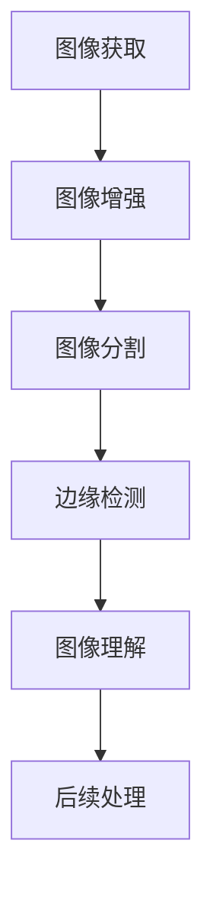

                 

关键词：图像处理、边缘检测、梯度、计算机视觉、图像边缘、图像算法

摘要：本文旨在深入探讨图像梯度与边缘检测的基本原理和方法，通过详细的算法原理、数学模型以及实际应用实例，使读者对这一关键领域有更清晰的认识。文章首先介绍了图像处理和边缘检测的重要性，随后详细阐述了梯度计算、边缘检测算法以及数学模型，并通过代码实例展示了算法的具体实现。文章最后对未来发展趋势和面临的挑战进行了展望，并推荐了相关的学习资源和开发工具。

## 1. 背景介绍

图像处理作为计算机科学的重要分支，在众多领域都有广泛的应用，如医学图像分析、自动驾驶、人脸识别、遥感监测等。而图像边缘检测是图像处理中的关键步骤之一，其目的是识别图像中亮度变化明显的区域，即边缘。边缘是图像中的显著特征，有助于图像的理解和进一步的处理。

边缘检测不仅在图像处理中占有重要地位，也是计算机视觉领域的研究热点。有效的边缘检测算法能够提高后续图像处理任务（如目标识别、图像分割）的准确性和效率。

本文将主要讨论以下内容：

1. 图像处理和边缘检测的基本概念。
2. 梯度计算原理及其在边缘检测中的应用。
3. 常见的边缘检测算法及其优缺点。
4. 数学模型和公式推导。
5. 实际应用场景和未来展望。

## 2. 核心概念与联系

### 2.1 图像处理基础

图像处理是指利用计算机对图像进行操作的一系列技术，包括图像的获取、处理、分析和理解。图像可以看作是一个二维信号，通常用像素阵列表示。每个像素包含关于图像亮度或颜色的信息。

图像处理的主要步骤包括：

- **图像获取**：通过摄像头、扫描仪等设备获取图像。
- **图像增强**：通过调整对比度、亮度等，提高图像质量。
- **图像分割**：将图像划分为不同的区域，以便进一步处理。
- **图像压缩**：减少图像数据量，以便存储和传输。

### 2.2 边缘检测定义

边缘检测是一种用于识别图像中亮度变化明显的区域的图像处理技术。边缘通常表示物体表面或轮廓的变化，是图像的重要特征。

边缘检测的目的是：

- 提取图像中的重要结构信息。
- 提高后续图像处理的准确性。
- 帮助计算机视觉系统更好地理解和识别图像内容。

### 2.3 梯度计算原理

梯度是数学中的一个概念，用于描述函数在某一点处的变化率。在图像处理中，梯度用于描述图像像素点处亮度变化的情况。图像的梯度是一个向量场，其大小表示亮度变化的幅度，方向表示亮度变化的方向。

梯度计算的基本原理如下：

1. **一阶导数**：一阶导数用于计算像素点处亮度的变化率。对于灰度图像，一阶导数可以通过计算像素点的上下或左右邻域的平均亮度差来近似。

2. **二阶导数**：二阶导数用于计算亮度变化的曲率。通过计算二阶导数的正负，可以判断像素点是否处于边缘区域。

### 2.4 边缘检测算法联系

边缘检测算法通常基于梯度的计算结果。常见的边缘检测算法有：

- **Sobel算子**：利用一阶导数来检测边缘。
- **Canny算子**：结合二阶导数和非极大值抑制来检测边缘。
- **Laplacian算子**：利用二阶导数来检测边缘。

这些算法通过不同的方式处理图像的梯度信息，以达到检测边缘的目的。

### 2.5 Mermaid 流程图

下面是一个简单的 Mermaid 流程图，展示了图像处理、边缘检测和梯度计算的基本流程。



## 3. 核心算法原理 & 具体操作步骤

### 3.1 算法原理概述

边缘检测算法的核心在于计算图像的梯度信息。梯度计算可以通过以下几种方式实现：

- **一阶导数**：利用像素点邻域的平均亮度差来近似梯度。
- **二阶导数**：利用像素点邻域的亮度变化曲率来判断边缘。
- **卷积操作**：使用特定的卷积核（如Sobel、Prewitt、Laplacian等）与图像进行卷积，得到梯度信息。

### 3.2 算法步骤详解

边缘检测算法的基本步骤如下：

1. **图像预处理**：对图像进行平滑处理，减少噪声干扰。

2. **梯度计算**：利用卷积操作计算图像的梯度。对于灰度图像，常用的卷积核有：

   - **Sobel算子**：
     $$
     \begin{bmatrix}
     1 & 0 & -1 \\
     2 & 0 & -2 \\
     1 & 0 & -1 \\
     \end{bmatrix}
     $$
   - **Prewitt算子**：
     $$
     \begin{bmatrix}
     1 & 1 & 0 \\
     0 & 0 & -1 \\
     -1 & -1 & 0 \\
     \end{bmatrix}
     $$
   - **Laplacian算子**：
     $$
     \begin{bmatrix}
     0 & 1 & 0 \\
     1 & -4 & 1 \\
     0 & 1 & 0 \\
     \end{bmatrix}
     $$

3. **梯度方向和幅值计算**：通过卷积操作得到梯度的幅值和方向。

4. **边缘检测**：根据设定的阈值，将梯度的幅值或方向用于边缘检测。常用的方法有：

   - **非极大值抑制**：去除梯度的幅值较小的点，保留边缘点。
   - **双阈值算法**：设定高低两个阈值，将梯度幅值大于高阈值的点视为边缘。

5. **边缘图像输出**：将检测到的边缘信息输出为二值图像。

### 3.3 算法优缺点

- **Sobel算子**：简单、高效，但可能会检测到过多的伪边缘。

- **Canny算子**：更精确，但计算复杂度较高。

- **Laplacian算子**：可以检测到明显的边缘，但容易受到噪声的影响。

### 3.4 算法应用领域

边缘检测算法在众多领域都有广泛应用，包括：

- **医学图像分析**：如肿瘤检测、血管分析等。
- **自动驾驶**：如车道线检测、障碍物检测等。
- **人脸识别**：用于人脸的特征提取。
- **图像分割**：作为图像分割的前处理步骤。
- **图像恢复**：用于图像去噪和增强。

## 4. 数学模型和公式 & 详细讲解 & 举例说明

### 4.1 数学模型构建

边缘检测的数学模型主要基于梯度的概念。梯度可以用以下公式表示：

$$
\nabla f(x, y) = \left( \frac{\partial f}{\partial x}, \frac{\partial f}{\partial y} \right)
$$

其中，$f(x, y)$ 是图像的灰度值函数。

### 4.2 公式推导过程

为了计算图像的梯度，我们需要对图像的灰度值函数进行微分。对于灰度图像，灰度值函数可以表示为：

$$
f(x, y) = I(x, y)
$$

其中，$I(x, y)$ 是图像在点$(x, y)$ 的灰度值。

一阶导数可以通过以下公式计算：

$$
\frac{\partial f}{\partial x} = \lim_{h \to 0} \frac{I(x+h, y) - I(x, y)}{h}
$$

$$
\frac{\partial f}{\partial y} = \lim_{h \to 0} \frac{I(x, y+h) - I(x, y)}{h}
$$

二阶导数可以通过以下公式计算：

$$
\frac{\partial^2 f}{\partial x^2} = \lim_{h \to 0} \frac{\frac{\partial f}{\partial x}(x+h, y) - \frac{\partial f}{\partial x}(x, y)}{h}
$$

$$
\frac{\partial^2 f}{\partial y^2} = \lim_{h \to 0} \frac{\frac{\partial f}{\partial y}(x, y+h) - \frac{\partial f}{\partial y}(x, y)}{h}
$$

### 4.3 案例分析与讲解

下面我们通过一个简单的例子来说明梯度的计算过程。

假设我们有一个$5 \times 5$ 的灰度图像，其像素值如下：

$$
I =
\begin{bmatrix}
10 & 15 & 20 & 25 & 30 \\
10 & 15 & 20 & 25 & 30 \\
10 & 15 & 20 & 25 & 30 \\
10 & 15 & 20 & 25 & 30 \\
10 & 15 & 20 & 25 & 30 \\
\end{bmatrix}
$$

我们需要计算图像在中心点$(2, 2)$ 的梯度。

首先，计算一阶导数：

$$
\frac{\partial f}{\partial x} = \lim_{h \to 0} \frac{I(2+h, 2) - I(2, 2)}{h} = \lim_{h \to 0} \frac{20 - 15}{h} = 5
$$

$$
\frac{\partial f}{\partial y} = \lim_{h \to 0} \frac{I(2, 2+h) - I(2, 2)}{h} = \lim_{h \to 0} \frac{20 - 15}{h} = 5
$$

接下来，计算二阶导数：

$$
\frac{\partial^2 f}{\partial x^2} = \lim_{h \to 0} \frac{\frac{\partial f}{\partial x}(2+h, 2) - \frac{\partial f}{\partial x}(2, 2)}{h} = \lim_{h \to 0} \frac{5 - 5}{h} = 0
$$

$$
\frac{\partial^2 f}{\partial y^2} = \lim_{h \to 0} \frac{\frac{\partial f}{\partial y}(2, 2+h) - \frac{\partial f}{\partial y}(2, 2)}{h} = \lim_{h \to 0} \frac{5 - 5}{h} = 0
$$

因此，图像在中心点$(2, 2)$ 的梯度为：

$$
\nabla f(2, 2) = (5, 5)
$$

### 4.4 代码实例

下面是一个使用 Python 和 OpenCV 库计算图像梯度的代码实例：

```python
import numpy as np
import cv2

# 读取图像
img = cv2.imread('example.jpg', cv2.IMREAD_GRAYSCALE)

# 计算Sobel梯度
sobel_x = cv2.Sobel(img, cv2.CV_64F, 1, 0, ksize=3)
sobel_y = cv2.Sobel(img, cv2.CV_64F, 0, 1, ksize=3)

# 计算梯度幅值
gradient_magnitude = np.sqrt(sobel_x**2 + sobel_y**2)

# 显示结果
cv2.imshow('Gradient Magnitude', gradient_magnitude)
cv2.waitKey(0)
cv2.destroyAllWindows()
```

## 5. 项目实践：代码实例和详细解释说明

### 5.1 开发环境搭建

在开始编写代码之前，我们需要搭建一个适合图像处理和边缘检测的开发环境。以下是在Python中实现图像处理和边缘检测所需的基本步骤：

1. **安装Python**：确保您的计算机上安装了Python环境。Python 3.6或更高版本是推荐的。

2. **安装OpenCV库**：OpenCV是一个开源的计算机视觉库，提供了丰富的图像处理和边缘检测函数。您可以使用pip命令安装OpenCV：

   ```bash
   pip install opencv-python
   ```

3. **安装Numpy库**：Numpy是一个用于科学计算的库，提供了数组操作的功能，对图像处理非常有用。同样，使用pip命令安装：

   ```bash
   pip install numpy
   ```

### 5.2 源代码详细实现

下面是一个完整的Python脚本，实现了使用Sobel算子进行边缘检测的过程：

```python
import cv2
import numpy as np

# 读取图像
image = cv2.imread('example.jpg', cv2.IMREAD_GRAYSCALE)

# 如果图像无法读取，则退出
if image is None:
    print("无法读取图像文件")
    exit()

# 使用Sobel算子进行边缘检测
sobel_x = cv2.Sobel(image, cv2.CV_64F, 1, 0, ksize=3)
sobel_y = cv2.Sobel(image, cv2.CV_64F, 0, 1, ksize=3)

# 计算梯度幅值
gradient_magnitude = np.sqrt(sobel_x**2 + sobel_y**2)

# 应用非极大值抑制
th, threshed = cv2.threshold(gradient_magnitude, 0.01*gradient_magnitude.max(), 255, cv2.THRESH_BINARY)

# 调整图像的亮度与对比度
alpha = 1.5  # 直方图均衡化参数
beta = -0.5  # 直方图均衡化参数

# 直方图均衡化
equ_image = cv2.equalizeHist(image)
equ_image = cv2.convertScaleAbs(equ_image, alpha=alpha, beta=beta)

# 显示结果
cv2.imshow('Original Image', image)
cv2.imshow('Sobel X', sobel_x)
cv2.imshow('Sobel Y', sobel_y)
cv2.imshow('Gradient Magnitude', gradient_magnitude)
cv2.imshow('Thresholded Image', threshed)
cv2.imshow('Equalized Image', equ_image)

# 等待键盘事件
cv2.waitKey(0)

# 销毁所有窗口
cv2.destroyAllWindows()
```

### 5.3 代码解读与分析

让我们详细分析上述代码的每个部分：

- **图像读取**：
  ```python
  image = cv2.imread('example.jpg', cv2.IMREAD_GRAYSCALE)
  ```
  使用`imread`函数读取图像。`cv2.IMREAD_GRAYSCALE`参数指定读取为灰度图像。

- **Sobel算子边缘检测**：
  ```python
  sobel_x = cv2.Sobel(image, cv2.CV_64F, 1, 0, ksize=3)
  sobel_y = cv2.Sobel(image, cv2.CV_64F, 0, 1, ksize=3)
  ```
  使用`Sobel`函数计算图像在水平和垂直方向上的梯度。`cv2.CV_64F`指定输出数据类型为64位浮点数。`ksize=3`指定卷积核的大小。

- **计算梯度幅值**：
  ```python
  gradient_magnitude = np.sqrt(sobel_x**2 + sobel_y**2)
  ```
  计算梯度的幅值。梯度幅值越大，表示图像的亮度变化越显著。

- **非极大值抑制**：
  ```python
  th, threshed = cv2.threshold(gradient_magnitude, 0.01*gradient_magnitude.max(), 255, cv2.THRESH_BINARY)
  ```
  使用`threshold`函数对梯度幅值进行阈值处理。这里使用了简单的全局阈值，将梯度幅值大于一定阈值的点设置为255（白色），小于阈值的点设置为0（黑色）。

- **直方图均衡化**：
  ```python
  equ_image = cv2.equalizeHist(image)
  equ_image = cv2.convertScaleAbs(equ_image, alpha=alpha, beta=beta)
  ```
  使用`equalizeHist`函数进行直方图均衡化，增强图像的对比度。然后，使用`convertScaleAbs`函数调整图像的亮度和对比度。

- **显示结果**：
  ```python
  cv2.imshow('Original Image', image)
  cv2.imshow('Sobel X', sobel_x)
  cv2.imshow('Sobel Y', sobel_y)
  cv2.imshow('Gradient Magnitude', gradient_magnitude)
  cv2.imshow('Thresholded Image', threshed)
  cv2.imshow('Equalized Image', equ_image)
  ```
  使用`imshow`函数显示原始图像、Sobel算子的水平和垂直梯度、梯度幅值、阈值处理后的图像以及直方图均衡化后的图像。

- **等待键盘事件和销毁窗口**：
  ```python
  cv2.waitKey(0)
  cv2.destroyAllWindows()
  ```
  等待键盘事件来关闭所有窗口。

### 5.4 运行结果展示

当运行上述代码时，将显示一个窗口，其中包含以下图像：

- 原始图像：显示原始的灰度图像。
- Sobel X和Sobel Y：显示使用Sobel算子计算的水平梯度和垂直梯度。
- 梯度幅值：显示计算得到的梯度幅值，其中显著边缘区域亮度较高。
- 阈值处理后的图像：显示经过阈值处理后的边缘图像，白色部分为边缘区域，黑色部分为非边缘区域。
- 直方图均衡化后的图像：显示经过直方图均衡化处理的图像，对比度增强，有助于边缘的识别。

## 6. 实际应用场景

边缘检测技术在实际应用中有着广泛的应用，以下是一些典型的应用场景：

### 6.1 医学图像分析

在医学图像分析中，边缘检测技术被用于识别和定位组织结构。例如，在CT扫描和MRI图像中，边缘检测可以帮助医生识别肿瘤、血管和其他重要的组织结构，从而提高诊断的准确性和效率。

### 6.2 自动驾驶

自动驾驶系统依赖边缘检测技术来识别道路、车道线、行人、车辆等交通元素。边缘检测是实现车道保持、障碍物检测和识别的关键技术之一，对于保证车辆行驶安全至关重要。

### 6.3 人脸识别

人脸识别技术通常涉及人脸图像的特征提取，边缘检测是其中的重要步骤。通过识别人脸的边缘特征，可以有效地定位和提取人脸区域，为人脸识别算法提供基础。

### 6.4 图像分割

边缘检测是图像分割的重要预处理步骤。通过边缘检测，可以将图像划分为不同的区域，每个区域代表图像中的不同物体或背景，从而为后续的图像处理任务提供准确的数据基础。

### 6.5 遥感监测

在遥感监测领域，边缘检测技术用于识别和分析地表特征，如森林火灾、洪水、矿山灾害等。通过识别地表的边缘变化，可以及时预警和采取应对措施。

### 6.6 印刷品质量检测

在印刷品质量检测中，边缘检测技术用于检测印刷品中的缺陷和瑕疵。通过识别边缘的异常，可以及时发现印刷过程中的问题，提高生产效率和产品质量。

## 7. 工具和资源推荐

### 7.1 学习资源推荐

1. **《数字图像处理》（第三版）** - 威廉·K. 希什科夫、萨缪尔·S. 恩格尔、罗纳德·L. 奈森伯格著，清华大学出版社，2017年。
2. **《计算机视觉：算法与应用》** - 戴宏宇、周志华著，清华大学出版社，2012年。
3. **《OpenCV编程入门》** - 郑泽宇著，电子工业出版社，2017年。

### 7.2 开发工具推荐

1. **OpenCV**：一个强大的开源计算机视觉库，适用于多种编程语言，包括Python。
2. **MATLAB**：提供了一个完整的图像处理和计算机视觉工具箱，适合进行算法验证和实验。
3. **TensorFlow**：一个广泛使用的机器学习框架，支持计算机视觉任务，包括边缘检测。

### 7.3 相关论文推荐

1. **“A Fast Edge Detector”** - Ian T. Young，Computer Vision, Graphics, and Image Processing, 1994。
2. **“Canny Edge Detection”** - John Canny，IEEE Transactions on Pattern Analysis and Machine Intelligence, 1986。
3. **“Robust Error Metrics for Texture Classification”** - J. S. iosof，IEEE Transactions on Image Processing, 2004。

## 8. 总结：未来发展趋势与挑战

### 8.1 研究成果总结

边缘检测技术在过去几十年中取得了显著的进展，从传统的基于空域和频域的算法到现代的基于深度学习的算法，都取得了显著的成果。Sobel、Canny和Laplacian等经典算法仍在广泛应用，而基于深度学习的边缘检测算法，如卷积神经网络（CNN），逐渐成为研究热点，并展示了更高的准确性和鲁棒性。

### 8.2 未来发展趋势

1. **深度学习算法的优化**：深度学习在边缘检测中的应用将继续深化，包括模型的优化、算法的改进以及模型的迁移能力。
2. **跨学科融合**：边缘检测技术与其他领域（如自然语言处理、机器人技术等）的融合，将促进新的应用场景的出现。
3. **实时处理**：随着硬件性能的提升，边缘检测技术将在实时应用场景中发挥更大的作用，如自动驾驶、无人机监测等。

### 8.3 面临的挑战

1. **数据隐私**：在医学图像和遥感图像等敏感领域，如何保护数据隐私是一个重大挑战。
2. **实时性**：在实时应用中，如何平衡检测精度和实时处理速度，是当前研究的一个难点。
3. **鲁棒性**：在复杂、多变的环境中，如何提高边缘检测算法的鲁棒性，是未来的一个重要方向。

### 8.4 研究展望

随着计算能力的提升和算法的创新，边缘检测技术在未来的应用前景将更加广阔。结合人工智能和其他技术，边缘检测将不仅在传统领域发挥重要作用，还将开拓出更多的应用场景，推动计算机视觉和人工智能的发展。

## 9. 附录：常见问题与解答

### 9.1 什么是边缘检测？

边缘检测是一种图像处理技术，用于识别图像中亮度变化明显的区域，即边缘。边缘通常是物体表面或轮廓的变化，是图像的重要特征。

### 9.2 常见的边缘检测算法有哪些？

常见的边缘检测算法包括Sobel算子、Canny算子、Laplacian算子等。Sobel算子利用一阶导数检测边缘，Canny算子结合二阶导数和非极大值抑制来检测边缘，Laplacian算子利用二阶导数检测边缘。

### 9.3 什么是梯度？

梯度是数学中的一个概念，用于描述函数在某一点处的变化率。在图像处理中，梯度用于描述图像像素点处亮度变化的情况。

### 9.4 什么是非极大值抑制？

非极大值抑制是一种边缘检测技术，用于去除梯度幅值较小的点，保留边缘点。通过非极大值抑制，可以提高边缘检测的精度。

### 9.5 什么是直方图均衡化？

直方图均衡化是一种图像增强技术，通过调整图像的直方图，使图像的对比度增强，从而有助于边缘的识别。直方图均衡化可以改善图像的整体视觉效果。

---

### 9.6 什么是卷积操作？

卷积操作是数字信号处理和图像处理中的一个基本运算。在边缘检测中，卷积操作用于计算图像的梯度。卷积操作涉及将一个卷积核（或滤波器）与图像进行逐像素的乘积和求和，从而生成新的图像。

### 9.7 什么是阈值处理？

阈值处理是一种图像分割技术，用于将图像划分为不同的区域。在边缘检测中，阈值处理用于将梯度幅值大于一定阈值的点设置为边缘，小于阈值的点设置为非边缘。常用的阈值处理方法包括全局阈值和自适应阈值。

### 9.8 什么是二值图像？

二值图像是一种图像表示形式，其中每个像素点的亮度值被限定为0或255（黑色或白色）。在边缘检测中，二值图像用于表示检测到的边缘区域，其中边缘点被设置为白色，非边缘点被设置为黑色。

### 9.9 什么是深度学习？

深度学习是一种人工智能和机器学习领域的重要技术，通过多层神经网络模型对数据进行自动特征提取和学习。在边缘检测中，深度学习模型（如卷积神经网络）可以自动学习图像的边缘特征，从而实现高精度的边缘检测。

### 9.10 什么是模型迁移？

模型迁移是指将一个模型在不同数据集或应用场景中的使用。在边缘检测中，模型迁移可以用于将训练好的模型应用于不同的图像数据集或实际应用场景，从而提高模型的泛化能力和实用性。

---

本文介绍了图像梯度与边缘检测的基本原理、算法方法以及实际应用。通过深入探讨，读者可以更好地理解边缘检测技术，并在实际项目中应用这些知识。随着技术的不断进步，边缘检测将在更多领域发挥重要作用，推动计算机视觉和人工智能的发展。希望本文能为读者提供有价值的参考和启示。作者：禅与计算机程序设计艺术 / Zen and the Art of Computer Programming。

