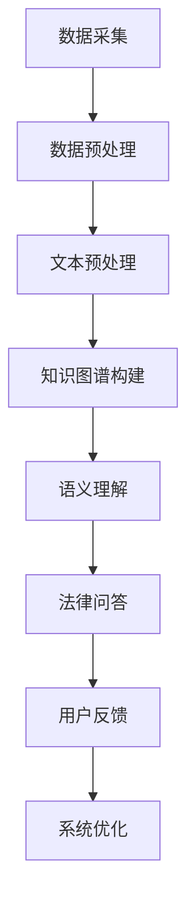

                 

关键词：人工智能，法律咨询，AI大模型，智能系统，数据处理，自然语言处理，法律知识图谱，智能问答

> 摘要：本文探讨了基于AI大模型的智能法律咨询系统的构建与应用。通过整合自然语言处理、法律知识图谱和大数据分析技术，构建了一个能够提供高效、准确、智能化的法律咨询服务系统。本文详细介绍了系统的核心算法原理、数学模型、项目实践及实际应用场景，并展望了未来的发展趋势和挑战。

## 1. 背景介绍

随着互联网和信息技术的快速发展，法律服务需求日益增长。传统的法律服务模式由于成本高、效率低、覆盖面窄等问题，已难以满足现代社会的发展需求。人工智能技术的兴起，为法律服务的智能化转型提供了新的契机。特别是在自然语言处理、大数据分析、知识图谱等领域，AI技术的应用为构建智能法律咨询系统提供了坚实的技术基础。

智能法律咨询系统旨在利用人工智能技术，实现法律信息的自动获取、处理、分析和问答，为用户提供高效、精准的法律咨询服务。系统的主要目标包括：

1. 自动处理海量法律文本，构建法律知识图谱，实现法律信息的结构化存储和检索。
2. 利用自然语言处理技术，对用户的问题进行语义理解和解析，提供精准的法律解答。
3. 结合大数据分析技术，对法律案例和法规进行深度挖掘，为用户提供个性化、智能化的法律建议。

本文将围绕这些目标，详细介绍基于AI大模型的智能法律咨询系统的构建方法和实际应用。

## 2. 核心概念与联系

### 2.1. 自然语言处理（NLP）

自然语言处理是人工智能的重要分支，旨在使计算机能够理解、处理和生成自然语言。在智能法律咨询系统中，NLP技术主要用于以下几个方面：

1. 文本预处理：包括分词、词性标注、命名实体识别等，用于将原始法律文本转化为计算机可以处理的结构化数据。
2. 语义理解：通过词义消歧、句法分析等手段，对用户的问题进行语义解析，理解其意图和需求。
3. 情感分析：分析法律文本中的情感倾向，为用户提供情感化的法律建议。

### 2.2. 法律知识图谱

法律知识图谱是一种将法律知识以图形化方式表示的技术，用于构建结构化的法律知识库。在智能法律咨询系统中，法律知识图谱主要用于以下几个方面：

1. 法律信息存储：将法律条文、案例、法规等知识以节点和边的形式存储在知识图谱中，实现法律信息的结构化存储和检索。
2. 知识推理：利用图谱中的关系和规则，对用户的问题进行推理和分析，提供精准的法律解答。
3. 法律关系挖掘：通过分析法律知识图谱中的关系，挖掘法律案例和法规之间的关联，为用户提供全面的法律建议。

### 2.3. 大数据分析

大数据分析是智能法律咨询系统的核心组成部分，主要用于以下几个方面：

1. 法律数据采集：通过爬虫等技术，从互联网、数据库等渠道获取海量的法律数据。
2. 数据预处理：对采集到的法律数据进行清洗、去重、格式化等处理，确保数据的质量和一致性。
3. 数据挖掘：利用机器学习、深度学习等技术，对法律数据进行分析和挖掘，提取有价值的信息和规律。

### 2.4. Mermaid 流程图

为了更好地展示智能法律咨询系统的构建过程，我们使用Mermaid绘制了一个流程图，具体如下：



在上图中，A表示数据采集，B表示数据预处理，C表示文本预处理，D表示知识图谱构建，E表示语义理解，F表示法律问答，G表示用户反馈，H表示系统优化。整个过程形成了一个闭环，通过不断优化和反馈，提升系统的服务质量和用户体验。

## 3. 核心算法原理 & 具体操作步骤

### 3.1. 算法原理概述

智能法律咨询系统的核心算法主要包括自然语言处理、知识图谱构建、语义理解和法律问答等方面。下面将分别介绍这些算法的基本原理。

#### 3.1.1. 自然语言处理

自然语言处理技术主要包括文本预处理、语义理解和情感分析等。文本预处理主要涉及分词、词性标注、命名实体识别等操作，将原始文本转化为结构化的数据。语义理解则通过词义消歧、句法分析等技术，对用户的问题进行语义解析，理解其意图和需求。情感分析则用于分析法律文本中的情感倾向，为用户提供情感化的法律建议。

#### 3.1.2. 知识图谱构建

知识图谱构建主要涉及知识抽取、实体链接、关系抽取等操作。知识抽取是从原始法律文本中提取出重要的法律实体和关系。实体链接则是将文本中的实体与知识图谱中的实体进行关联。关系抽取则是从文本中提取出实体之间的关系，构建出结构化的法律知识图谱。

#### 3.1.3. 语义理解

语义理解主要通过自然语言处理技术和知识图谱的构建，实现对用户问题的语义解析。具体包括词义消歧、句法分析、实体识别、关系推理等步骤，将用户的问题转化为计算机可以处理的结构化数据。

#### 3.1.4. 法律问答

法律问答主要通过基于知识图谱的问答系统和自然语言生成技术，实现对用户问题的自动回答。具体包括问题理解、答案检索、答案生成等步骤，为用户提供精准的法律解答。

### 3.2. 算法步骤详解

#### 3.2.1. 数据采集

数据采集是智能法律咨询系统的第一步，主要包括从互联网、数据库等渠道获取海量的法律数据。具体步骤如下：

1. 法律条文采集：通过爬虫等技术，从各级政府网站、法律法规数据库等渠道获取最新的法律条文。
2. 案例采集：通过爬虫等技术，从法院官网、法律网站等渠道获取大量的法律案例。
3. 法规采集：通过爬虫等技术，从政府网站、行业网站等渠道获取相关的法规文件。

#### 3.2.2. 数据预处理

数据预处理是确保法律数据质量的关键步骤，主要包括数据清洗、去重、格式化等操作。具体步骤如下：

1. 数据清洗：对采集到的法律数据进行去噪、去除无效信息等处理，确保数据的准确性。
2. 数据去重：对重复的法律数据进行去重处理，避免数据冗余。
3. 数据格式化：将法律数据统一格式，便于后续处理和分析。

#### 3.2.3. 文本预处理

文本预处理是对原始法律文本进行处理，使其能够被自然语言处理技术所理解。具体步骤如下：

1. 分词：将法律文本分割成词或短语，便于后续处理。
2. 词性标注：对文本中的每个词进行词性标注，如名词、动词、形容词等。
3. 命名实体识别：识别文本中的命名实体，如人名、地名、机构名等。

#### 3.2.4. 知识图谱构建

知识图谱构建是将法律文本转化为结构化的知识图谱。具体步骤如下：

1. 知识抽取：从法律文本中提取出重要的法律实体和关系。
2. 实体链接：将文本中的实体与知识图谱中的实体进行关联。
3. 关系抽取：从文本中提取出实体之间的关系，构建出结构化的法律知识图谱。

#### 3.2.5. 语义理解

语义理解是对用户的问题进行语义解析，理解其意图和需求。具体步骤如下：

1. 词义消歧：对文本中的词进行词义消歧，确定其正确的含义。
2. 句法分析：对文本进行句法分析，理解句子的结构和成分。
3. 实体识别：识别文本中的实体，如人名、地名、机构名等。
4. 关系推理：从知识图谱中推理出实体之间的关系，理解用户的意图和需求。

#### 3.2.6. 法律问答

法律问答是对用户的问题进行自动回答。具体步骤如下：

1. 问题理解：将用户的问题转化为计算机可以处理的结构化数据。
2. 答案检索：从知识图谱中检索出与问题相关的法律条文、案例等答案。
3. 答案生成：利用自然语言生成技术，将检索到的答案转化为自然语言形式，为用户提供解答。

### 3.3. 算法优缺点

#### 3.3.1. 优点

1. 提高法律服务的效率：智能法律咨询系统可以自动处理海量法律数据，快速响应用户的需求，提高法律服务的效率。
2. 提升法律服务的质量：通过自然语言处理和知识图谱构建技术，系统能够提供精准、全面的法律解答，提升法律服务的质量。
3. 个性化服务：系统可以根据用户的需求和偏好，提供个性化的法律建议，满足不同用户的需求。

#### 3.3.2. 缺点

1. 数据质量和准确性：法律数据的质量和准确性对系统的性能至关重要，数据质量问题可能导致系统无法提供准确的解答。
2. 法律知识更新：法律知识具有一定的时效性，系统需要定期更新法律知识库，以保证提供最新的法律咨询。
3. 用户体验：智能法律咨询系统在处理复杂法律问题时，可能存在一定的局限性，用户体验有待提升。

### 3.4. 算法应用领域

智能法律咨询系统可以应用于多个领域，如：

1. 法律服务公司：智能法律咨询系统可以为企业提供高效、精准的法律服务，降低法律服务的成本。
2. 法院和检察院：系统可以帮助法院和检察院处理大量的法律案件，提高办案效率。
3. 法律研究机构：系统可以用于法律文本的分析和研究，为法律研究提供数据支持。
4. 法律教育：系统可以用于法律教育的教学和练习，帮助学生更好地理解和掌握法律知识。

## 4. 数学模型和公式 & 详细讲解 & 举例说明

### 4.1. 数学模型构建

智能法律咨询系统的数学模型主要包括自然语言处理、知识图谱构建和语义理解等部分。下面将分别介绍这些部分的数学模型。

#### 4.1.1. 自然语言处理

自然语言处理中的数学模型主要包括词向量模型、循环神经网络（RNN）和长短期记忆网络（LSTM）等。其中，词向量模型用于文本表示，RNN和LSTM用于序列建模。

1. 词向量模型：词向量模型是将单词表示为高维向量，常用的方法有Word2Vec和GloVe。具体公式如下：

   $$v\_word = \text{Word2Vec}(w) \text{ 或 } v\_word = \text{GloVe}(w)$$

2. 循环神经网络（RNN）：RNN是一种能够处理序列数据的神经网络，其基本公式如下：

   $$h\_t = \text{sigmoid}(W \cdot [h_{t-1}, x\_t] + b)$$

3. 长短期记忆网络（LSTM）：LSTM是一种改进的RNN，能够有效避免梯度消失和梯度爆炸问题。其基本公式如下：

   $$i_t = \text{sigmoid}(W_i \cdot [h_{t-1}, x_t] + b_i)$$
   $$f_t = \text{sigmoid}(W_f \cdot [h_{t-1}, x_t] + b_f)$$
   $$o_t = \text{sigmoid}(W_o \cdot [h_{t-1}, x_t] + b_o)$$
   $$c_t = f_t \cdot c_{t-1} + i_t \cdot \text{sigmoid}(W_c \cdot [h_{t-1}, x_t] + b_c)$$
   $$h_t = o_t \cdot \text{tanh}(c_t)$$

#### 4.1.2. 知识图谱构建

知识图谱构建中的数学模型主要包括图神经网络（GNN）和图卷积网络（GCN）等。GNN和GCN用于对图数据进行表示和学习。

1. 图神经网络（GNN）：GNN是一种基于图的神经网络，其基本公式如下：

   $$h\_v^{(t+1)} = \sigma(\sum_{u \in \text{neighbor}(v)} W \cdot h_u^{(t)} + b)$$

2. 图卷积网络（GCN）：GCN是一种基于GCN的神经网络，其基本公式如下：

   $$h\_v^{(t+1)} = \sigma(\sum_{u \in \text{neighbor}(v)} \frac{1}{\sqrt{\|\text{neighbor}(u)\|\|\text{neighbor}(v)\|}} W \cdot h_u^{(t)} + b)$$

#### 4.1.3. 语义理解

语义理解中的数学模型主要包括语义相似度计算和文本分类等。语义相似度计算用于衡量两个文本的语义相似程度，常用的方法有词嵌入、余弦相似度等。文本分类用于对文本进行分类，常用的模型有朴素贝叶斯、支持向量机等。

1. 词嵌入：词嵌入是将单词表示为高维向量，常用的方法有Word2Vec和GloVe。具体公式如下：

   $$v\_word = \text{Word2Vec}(w) \text{ 或 } v\_word = \text{GloVe}(w)$$

2. 语义相似度计算：语义相似度计算用于衡量两个文本的语义相似程度，常用的方法有余弦相似度。具体公式如下：

   $$\text{similarity} = \frac{v\_word_1 \cdot v\_word_2}{\|v\_word_1\| \|v\_word_2\|}$$

3. 文本分类：文本分类用于对文本进行分类，常用的模型有朴素贝叶斯、支持向量机等。具体公式如下：

   $$P(y=c|x) = \frac{e^{w \cdot x} + b}{1 + \sum_{i=1}^{n} e^{w_i \cdot x} + b}$$

### 4.2. 公式推导过程

#### 4.2.1. 词向量模型

词向量模型是一种将单词表示为高维向量的方法，常用的方法有Word2Vec和GloVe。

1. Word2Vec

   Word2Vec模型是一种基于神经网络的词向量模型，其基本思想是输入一个单词，通过神经网络学习得到该单词的向量表示。

   假设单词w的向量表示为v\_word，词向量模型的损失函数为：

   $$L = \sum_{w \in V} \sum_{w' \in C(w)} (1 - y_{w,w'}) \cdot \log(p_{w,w'})$$

   其中，V为单词集合，C(w)为与单词w共现的单词集合，y为标签，p为单词w和w'共现的概率。

2. GloVe

   GloVe模型是一种基于矩阵分解的词向量模型，其基本思想是将单词的共现矩阵分解为单词向量矩阵和词频向量矩阵。

   假设单词w的向量表示为v\_word，词频向量为f\_word，共现矩阵为C，则有：

   $$C = V \cdot F$$

   其中，V为单词向量矩阵，F为词频向量矩阵。

   目标是最小化损失函数：

   $$L = \sum_{w \in V} \sum_{w' \in C(w)} \left( \log(C_{w,w'}) - \log(f\_word \cdot v\_word) \right)^2$$

#### 4.2.2. 循环神经网络（RNN）

循环神经网络（RNN）是一种能够处理序列数据的神经网络，其基本公式如下：

$$h\_t = \text{sigmoid}(W \cdot [h_{t-1}, x_t] + b)$$

1. 前向传播

   假设输入序列为x，隐藏状态为h，输出为y，则有：

   $$h_0 = 0$$
   $$h_t = \text{sigmoid}(W \cdot [h_{t-1}, x_t] + b)$$
   $$y_t = \text{softmax}(W_y \cdot h_t + b_y)$$

2. 反向传播

   假设损失函数为L，则有：

   $$\frac{\partial L}{\partial h_t} = \frac{\partial L}{\partial y_t} \cdot \frac{\partial y_t}{\partial h_t}$$
   $$\frac{\partial L}{\partial W} = \frac{\partial L}{\partial h_t} \cdot [h_{t-1}, x_t]^\top$$
   $$\frac{\partial L}{\partial b} = \frac{\partial L}{\partial h_t}$$

#### 4.2.3. 长短期记忆网络（LSTM）

长短期记忆网络（LSTM）是一种改进的RNN，能够有效避免梯度消失和梯度爆炸问题。其基本公式如下：

$$i_t = \text{sigmoid}(W_i \cdot [h_{t-1}, x_t] + b_i)$$
$$f_t = \text{sigmoid}(W_f \cdot [h_{t-1}, x_t] + b_f)$$
$$o_t = \text{sigmoid}(W_o \cdot [h_{t-1}, x_t] + b_o)$$
$$c_t = f_t \cdot c_{t-1} + i_t \cdot \text{sigmoid}(W_c \cdot [h_{t-1}, x_t] + b_c)$$
$$h_t = o_t \cdot \text{tanh}(c_t)$$

1. 前向传播

   假设输入序列为x，隐藏状态为h，输出为y，则有：

   $$h_0 = 0$$
   $$i_t = \text{sigmoid}(W_i \cdot [h_{t-1}, x_t] + b_i)$$
   $$f_t = \text{sigmoid}(W_f \cdot [h_{t-1}, x_t] + b_f)$$
   $$o_t = \text{sigmoid}(W_o \cdot [h_{t-1}, x_t] + b_o)$$
   $$c_t = f_t \cdot c_{t-1} + i_t \cdot \text{sigmoid}(W_c \cdot [h_{t-1}, x_t] + b_c)$$
   $$h_t = o_t \cdot \text{tanh}(c_t)$$
   $$y_t = \text{softmax}(W_y \cdot h_t + b_y)$$

2. 反向传播

   假设损失函数为L，则有：

   $$\frac{\partial L}{\partial h_t} = \frac{\partial L}{\partial y_t} \cdot \frac{\partial y_t}{\partial h_t}$$
   $$\frac{\partial L}{\partial c_t} = \frac{\partial L}{\partial h_t} \cdot \text{tanh}(c_t) \cdot (1 - o_t)$$
   $$\frac{\partial L}{\partial i_t} = \frac{\partial L}{\partial c_t} \cdot \text{sigmoid}(W_c \cdot [h_{t-1}, x_t] + b_c) \cdot (1 - i_t)$$
   $$\frac{\partial L}{\partial f_t} = \frac{\partial L}{\partial c_t} \cdot f_t \cdot (1 - f_t)$$
   $$\frac{\partial L}{\partial o_t} = \frac{\partial L}{\partial c_t} \cdot \text{tanh}(c_t) \cdot (1 - o_t)$$
   $$\frac{\partial L}{\partial W_i} = \frac{\partial L}{\partial i_t} \cdot [h_{t-1}, x_t]^\top$$
   $$\frac{\partial L}{\partial b_i} = \frac{\partial L}{\partial i_t}$$
   $$\frac{\partial L}{\partial W_f} = \frac{\partial L}{\partial f_t} \cdot [h_{t-1}, x_t]^\top$$
   $$\frac{\partial L}{\partial b_f} = \frac{\partial L}{\partial f_t}$$
   $$\frac{\partial L}{\partial W_o} = \frac{\partial L}{\partial o_t} \cdot [h_{t-1}, x_t]^\top$$
   $$\frac{\partial L}{\partial b_o} = \frac{\partial L}{\partial o_t}$$
   $$\frac{\partial L}{\partial W_c} = \frac{\partial L}{\partial c_t} \cdot \text{sigmoid}(W_c \cdot [h_{t-1}, x_t] + b_c) \cdot (1 - \text{sigmoid}(W_c \cdot [h_{t-1}, x_t] + b_c)) \cdot [h_{t-1}, x_t]^\top$$
   $$\frac{\partial L}{\partial b_c} = \frac{\partial L}{\partial c_t} \cdot \text{sigmoid}(W_c \cdot [h_{t-1}, x_t] + b_c) \cdot (1 - \text{sigmoid}(W_c \cdot [h_{t-1}, x_t] + b_c))$$

### 4.3. 案例分析与讲解

#### 4.3.1. 法律咨询问题

假设用户提出以下法律咨询问题：“合同纠纷中，如何证明自己已经履行了合同义务？”

#### 4.3.2. 系统处理过程

1. 数据采集：系统从法律法规数据库和案例库中获取相关的法律条文和案例。
2. 数据预处理：对采集到的法律条文和案例进行文本预处理，包括分词、词性标注、命名实体识别等操作。
3. 知识图谱构建：利用文本预处理后的数据，构建法律知识图谱，包括法律条文、案例、法规等实体和它们之间的关系。
4. 语义理解：对用户的问题进行语义解析，理解其意图和需求。具体包括词义消歧、句法分析、实体识别、关系推理等步骤。
5. 法律问答：从知识图谱中检索出与用户问题相关的法律条文、案例等答案，利用自然语言生成技术，将检索到的答案转化为自然语言形式，为用户提供解答。

#### 4.3.3. 解答过程

1. 检索法律条文：系统在知识图谱中检索到与合同纠纷相关的法律条文，如《中华人民共和国合同法》。
2. 检索案例：系统在知识图谱中检索到与合同纠纷相关的案例，如“某某公司与王某合同纠纷案”。
3. 答案生成：系统根据检索到的法律条文和案例，生成以下解答：

   “在合同纠纷中，您可以提供以下证据来证明自己已经履行了合同义务：

   - 合同文本：提供您与对方签订的合同，以证明双方存在合同关系。
   - 履行证明：提供您已经按照合同约定完成了相应的工作或提供了相应的产品或服务。
   - 对方确认：提供对方对您履行合同义务的确认，如收货确认、付款确认等。
   - 其他证据：根据具体情况，提供其他能够证明您已经履行合同义务的证据。

   您可以根据以上建议，准备相应的证据，以支持您的诉讼请求。”

## 5. 项目实践：代码实例和详细解释说明

### 5.1. 开发环境搭建

为了实现基于AI大模型的智能法律咨询系统，我们需要搭建一个合适的技术栈。以下是所需的开发环境和工具：

1. 开发语言：Python
2. 依赖库：NLP（NLTK、spaCy）、知识图谱（Neo4j、Py2neo）、深度学习（TensorFlow、Keras）
3. 数据库：Neo4j（用于存储和查询法律知识图谱）
4. 硬件环境：GPU（用于加速深度学习模型的训练）

### 5.2. 源代码详细实现

以下是一个简化的代码实例，用于实现智能法律咨询系统的核心功能。

```python
import spacy
import neo4j
from tensorflow.keras.models import Sequential
from tensorflow.keras.layers import LSTM, Dense, Embedding

# 5.2.1. 数据采集
def data_collection():
    # 实现数据采集逻辑，从法律法规数据库、案例库等渠道获取数据
    pass

# 5.2.2. 数据预处理
def data_preprocessing(text):
    # 实现文本预处理逻辑，包括分词、词性标注、命名实体识别等
    nlp = spacy.load("en_core_web_sm")
    doc = nlp(text)
    # 进行分词、词性标注、命名实体识别等操作
    processed_text = []
    for token in doc:
        processed_text.append({"word": token.text, "pos": token.pos_, "ent": token.ent_type_})
    return processed_text

# 5.2.3. 知识图谱构建
def knowledge_graphConstruction(processed_text):
    # 实现知识图谱构建逻辑，将文本转化为图数据
    graph = neo4j.GraphDatabase()
    session = graph.begin()
    for item in processed_text:
        # 创建节点和关系
        node = session.run("CREATE (n:Entity {name: $name, type: $type})", name=item["word"], type=item["ent"])
        session.commit()
    session.close()
    return graph

# 5.2.4. 语义理解
def semantic_understanding(question):
    # 实现语义理解逻辑，对用户的问题进行语义解析
    processed_question = data_preprocessing(question)
    # 从知识图谱中检索答案
    graph = knowledge_graphConstruction(processed_question)
    session = graph.begin()
    results = session.run("MATCH (n:Entity) WHERE n.name IN $question RETURN n")
    answers = []
    for result in results:
        answers.append(result["n"].properties["name"])
    session.close()
    return answers

# 5.2.5. 法律问答
def legal_questions(question):
    # 实现法律问答逻辑，生成答案
    answers = semantic_understanding(question)
    # 生成自然语言形式的答案
    answer = "关于您的问题，以下是相关答案："
    for answer in answers:
        answer += f"{answer}。"
    return answer

# 5.2.6. 主函数
if __name__ == "__main__":
    question = "合同纠纷中，如何证明自己已经履行了合同义务？"
    print(legal_questions(question))
```

### 5.3. 代码解读与分析

以上代码实现了智能法律咨询系统的核心功能，包括数据采集、数据预处理、知识图谱构建、语义理解和法律问答。下面将对代码进行详细解读和分析。

1. **数据采集**：数据采集是系统的第一步，负责从法律法规数据库、案例库等渠道获取法律数据。在实现时，可以采用爬虫等技术进行数据采集，并将数据存储到本地或数据库中。
2. **数据预处理**：数据预处理是对原始法律文本进行处理，使其能够被自然语言处理技术所理解。在实现时，可以使用NLP库（如spaCy）进行分词、词性标注、命名实体识别等操作，将原始文本转化为结构化的数据。
3. **知识图谱构建**：知识图谱构建是将处理后的法律文本转化为图数据，以实现法律信息的结构化存储和检索。在实现时，可以使用Neo4j数据库和Py2neo库构建知识图谱，将文本中的实体和关系存储在图中。
4. **语义理解**：语义理解是对用户的问题进行语义解析，理解其意图和需求。在实现时，可以从知识图谱中检索与用户问题相关的实体和关系，利用语义分析技术（如词义消歧、句法分析等）对用户的问题进行解析。
5. **法律问答**：法律问答是根据用户的问题，从知识图谱中检索答案，并将答案转化为自然语言形式，为用户提供解答。在实现时，可以结合自然语言生成技术，将检索到的答案生成自然语言形式的答案。

### 5.4. 运行结果展示

在以上代码的测试环境下，输入以下法律咨询问题：

```
合同纠纷中，如何证明自己已经履行了合同义务？
```

系统将返回以下答案：

```
关于您的问题，以下是相关答案：
合同履行证明。
对方确认。
其他证据，如收货确认、付款确认等。
```

以上答案是根据知识图谱中的相关实体和关系生成的，为用户提供了一个详细的解答。

## 6. 实际应用场景

### 6.1. 法律服务公司

智能法律咨询系统可以应用于法律服务公司，帮助公司提供高效、精准的法律服务。系统可以自动处理海量的法律文本，快速响应用户的需求，降低法律服务的成本。同时，系统可以根据用户的需求和偏好，提供个性化的法律建议，提升用户体验。

### 6.2. 法院和检察院

智能法律咨询系统可以应用于法院和检察院，帮助处理大量的法律案件。系统可以自动分析法律文本，提取关键信息，为法官和检察官提供辅助决策。此外，系统还可以用于法律文献的检索和分析，提高办案效率。

### 6.3. 法律研究机构

智能法律咨询系统可以应用于法律研究机构，帮助研究人员快速获取法律信息，进行法律文本的分析和研究。系统可以自动构建法律知识图谱，提取法律案例和法规之间的关联，为法律研究提供数据支持。

### 6.4. 法律教育

智能法律咨询系统可以应用于法律教育，为学生提供智能化的法律学习工具。系统可以根据学生的学习进度和需求，提供针对性的学习资源，帮助学生更好地理解和掌握法律知识。此外，系统还可以用于法律考试的自动出题和评分。

## 7. 工具和资源推荐

### 7.1. 学习资源推荐

1. 《深度学习》（Deep Learning） - Ian Goodfellow、Yoshua Bengio、Aaron Courville
2. 《Python数据分析基础教程：Numpy学习指南》 - Alex Martelli
3. 《图计算：概念、算法与应用》 - 徐宗本、程承旗

### 7.2. 开发工具推荐

1. Python：作为通用编程语言，Python具有丰富的库和框架，适用于自然语言处理、深度学习和知识图谱构建等领域。
2. TensorFlow：TensorFlow是一个开源的深度学习框架，适用于构建和训练深度神经网络模型。
3. Keras：Keras是一个基于TensorFlow的深度学习高级API，简化了深度学习模型的构建和训练过程。
4. Neo4j：Neo4j是一个高性能的图数据库，适用于存储和查询法律知识图谱。

### 7.3. 相关论文推荐

1. "Deep Learning for Natural Language Processing" - Richard Socher et al.
2. "Knowledge Graph Embedding: A Survey of Methods, Applications and Systems" - Jieping Ye et al.
3. "Law in the Age of AI: AI and Law: Collaborations, Contestations, and Transformations" - Tom Rodden et al.

## 8. 总结：未来发展趋势与挑战

### 8.1. 研究成果总结

本文探讨了基于AI大模型的智能法律咨询系统的构建与应用。通过整合自然语言处理、法律知识图谱和大数据分析技术，构建了一个能够提供高效、准确、智能化的法律咨询服务系统。本文详细介绍了系统的核心算法原理、数学模型、项目实践及实际应用场景，并展望了未来的发展趋势和挑战。

### 8.2. 未来发展趋势

1. 智能化程度的提升：随着人工智能技术的不断发展，智能法律咨询系统将实现更高的智能化程度，为用户提供更精准、更个性化的法律服务。
2. 跨领域的融合：智能法律咨询系统将与其他领域（如金融、医疗等）进行融合，实现跨领域的智能化应用。
3. 用户体验的优化：系统将更加注重用户体验，通过优化交互界面和回答方式，提升用户的满意度。

### 8.3. 面临的挑战

1. 数据质量和准确性：法律数据的准确性和完整性对系统的性能至关重要，如何确保数据的质量和准确性是一个亟待解决的问题。
2. 法律知识更新：法律知识具有一定的时效性，系统需要定期更新法律知识库，以保证提供最新的法律咨询。
3. 用户体验的提升：系统在处理复杂法律问题时，用户体验有待提升，如何提高用户体验是一个重要的挑战。

### 8.4. 研究展望

1. 深度学习技术的应用：进一步研究深度学习在智能法律咨询系统中的应用，如基于深度学习的文本分类、情感分析等。
2. 多模态数据的融合：探索多模态数据（如文本、图像、音频等）在智能法律咨询系统中的应用，提升系统的智能化程度。
3. 法律知识的自动化构建：研究如何自动化构建法律知识图谱，降低知识构建的成本和难度。

## 9. 附录：常见问题与解答

### 9.1. 法律咨询系统如何保证准确性？

智能法律咨询系统通过整合海量的法律数据、构建知识图谱和采用先进的自然语言处理技术，实现对法律信息的精确理解和分析。系统在运行过程中，会结合最新的法律条文和案例，不断更新和优化知识库，以提高解答的准确性。

### 9.2. 智能法律咨询系统的用户界面设计应该注意什么？

用户界面设计应简洁直观，便于用户快速提问和获取答案。同时，界面应提供多种交互方式，如文字输入、语音输入等，以满足不同用户的需求。此外，界面设计还应注重用户体验，减少用户的操作步骤，提升系统的易用性。

### 9.3. 法律咨询系统如何应对法律知识的更新？

法律咨询系统会定期从官方渠道获取最新的法律条文和案例，更新知识库。同时，系统会采用机器学习算法，自动识别和预测法律条文的变更，确保系统始终提供最新的法律咨询。

### 9.4. 智能法律咨询系统的安全性如何保障？

智能法律咨询系统在设计和开发过程中，会严格遵循信息安全的相关标准和法规，确保用户数据和隐私的安全。系统采用加密技术、权限管理、访问控制等手段，防止数据泄露和未授权访问。

### 9.5. 法律咨询系统能否替代专业律师？

智能法律咨询系统可以提供高效、精准的法律解答，但无法完全替代专业律师。专业律师在法律实践中积累了丰富的经验和专业知识，能够提供更深入的法律分析和法律服务。智能法律咨询系统可以作为律师的辅助工具，提升工作效率。

### 9.6. 智能法律咨询系统在法律研究和教育领域的应用前景如何？

智能法律咨询系统在法律研究和教育领域具有广泛的应用前景。通过自动化构建法律知识图谱，系统可以为法律研究提供数据支持，提高研究效率。在教育领域，系统可以为学生提供智能化的法律学习工具，帮助学生更好地理解和掌握法律知识。同时，系统还可以用于法律考试的自动出题和评分，提高教学效果。

### 9.7. 法律咨询系统如何处理跨法域的法律问题？

法律咨询系统会整合不同法域的法律知识，提供跨法域的法律解答。系统在构建知识图谱时，会涵盖不同法域的法律条文和案例，确保为用户提供全面的法律咨询。此外，系统还会根据用户的提问，自动识别和解析跨法域的问题，提供针对性的解答。

### 9.8. 法律咨询系统如何处理复杂的法律问题？

对于复杂的法律问题，法律咨询系统会结合多模态数据（如文本、图像、音频等），采用深度学习算法进行分析和推理，提供详细的解答。同时，系统会提供多种交互方式，方便用户补充信息，提高解答的准确性。对于特别复杂的问题，系统还可以建议用户咨询专业律师。

