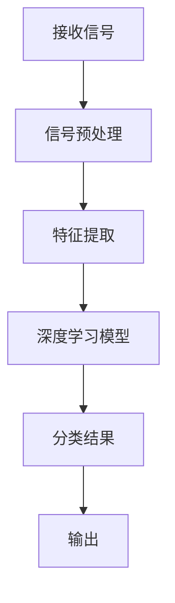

                 

关键词：人工智能，自动调制分类，算法，深度学习，信号处理，通信系统，信号识别

> 摘要：本文旨在探讨人工智能在自动调制分类中的应用，介绍相关算法原理、数学模型、以及实践案例。通过深入分析自动调制分类的重要性、技术难点、算法实现和应用场景，本文为人工智能在通信领域的研究提供了新的思路和方法。

## 1. 背景介绍

随着通信技术的快速发展，无线通信系统日益复杂，调制技术作为通信系统的核心，直接影响着通信质量与效率。传统的调制分类方法通常依赖于人工设计的特征提取和分类器，但面对海量数据和复杂调制方式，这些方法已难以满足需求。近年来，人工智能，特别是深度学习在信号处理领域取得了显著成果，为自动调制分类提供了新的契机。

自动调制分类的目的是根据接收到的信号特征，准确识别出所采用的调制方式。这项技术在无线通信系统中具有广泛的应用，包括但不限于：无线信道检测、通信系统优化、信号干扰识别等。随着5G和未来的6G通信技术的发展，自动调制分类的重要性将愈加凸显。

## 2. 核心概念与联系

### 2.1 调制技术概述

调制技术是将信息信号转换为适合信道传输的信号形式的过程。常见的调制方式包括幅移键控(AM)、频移键控(FM)和相移键控(PSK)等。每种调制方式都有其独特的特征，这些特征是自动调制分类的重要依据。

### 2.2 信号特征提取

信号特征提取是将接收到的信号转换为一组可量化的特征向量，以便后续的分类处理。常见的特征提取方法包括时域特征、频域特征和时频特征等。

### 2.3 深度学习与自动调制分类

深度学习是一种基于多层的神经网络模型，通过大量数据的训练，能够自动提取复杂的特征，并在各个层次上进行信息融合。深度学习在自动调制分类中的应用，极大地提高了分类的准确性和效率。

### 2.4 Mermaid 流程图

以下是一个简化的 Mermaid 流程图，展示了自动调制分类的基本流程：



### 2.5 调制分类算法架构

调制分类算法通常包括以下三个主要模块：

- **信号预处理**：包括去噪、滤波等步骤，目的是提高信号质量。
- **特征提取**：从预处理后的信号中提取出关键特征。
- **分类器**：使用深度学习模型对特征进行分类。

## 3. 核心算法原理 & 具体操作步骤

### 3.1 算法原理概述

自动调制分类的核心算法是基于深度学习的调制识别模型。该模型通常采用卷积神经网络(CNN)或循环神经网络(RNN)等结构，通过多层神经网络对信号特征进行自动学习与提取，实现对不同调制方式的识别。

### 3.2 算法步骤详解

#### 3.2.1 信号预处理

信号预处理包括去噪、滤波和归一化等步骤。去噪和滤波的目的是减少信号中的噪声干扰，提高信号质量；归一化则是为了将信号特征统一到相同的尺度，便于后续的模型训练。

#### 3.2.2 特征提取

特征提取是自动调制分类的关键步骤。通过卷积神经网络或循环神经网络，可以从预处理后的信号中自动提取出具有区分性的特征。

#### 3.2.3 分类器

分类器通常采用多层感知机(MLP)或长短期记忆网络(LSTM)等模型。通过训练，分类器能够准确识别出不同调制方式。

### 3.3 算法优缺点

- **优点**：
  - 高准确性：深度学习模型能够自动提取复杂的信号特征，提高分类准确率。
  - 自适应性：模型可以根据不同的信号特点和需求进行调整，具有良好的适应性。

- **缺点**：
  - 计算成本高：深度学习模型的训练和推理过程需要大量的计算资源。
  - 数据依赖性强：模型的训练效果高度依赖于训练数据的质量和数量。

### 3.4 算法应用领域

自动调制分类算法在无线通信系统中具有广泛的应用，如：

- 无线信道检测：自动识别无线信道的调制方式，为信道优化提供依据。
- 通信系统优化：根据调制方式识别结果，对通信系统进行调整和优化。
- 信号干扰识别：识别干扰信号所采用的调制方式，为干扰抑制提供依据。

## 4. 数学模型和公式

### 4.1 数学模型构建

自动调制分类的数学模型主要包括信号预处理、特征提取和分类器三个部分。以下是一个简化的数学模型：

$$
f(x) = \sigma(W_3 \cdot \sigma(W_2 \cdot \sigma(W_1 \cdot x)))
$$

其中，$f(x)$ 表示分类结果，$x$ 表示输入信号，$W_1$、$W_2$ 和 $W_3$ 分别为三个神经网络的权重矩阵，$\sigma$ 表示激活函数。

### 4.2 公式推导过程

自动调制分类的数学模型基于深度学习理论，通过多层神经网络对信号特征进行学习与提取。具体推导过程涉及复杂的神经网络理论和优化算法，本文不进行详细展开。

### 4.3 案例分析与讲解

以下是一个简单的案例，说明如何使用深度学习模型进行自动调制分类。

#### 案例背景

某无线通信系统需要识别接收到的信号所采用的调制方式，以优化通信质量。现有 AM、FM 和 PSK 三种调制方式，需要设计一个自动调制分类模型进行识别。

#### 案例步骤

1. **数据收集**：收集 AM、FM 和 PSK 三种调制方式的信号样本，包括时域和频域数据。

2. **信号预处理**：对收集到的信号进行去噪、滤波和归一化等预处理步骤，提高信号质量。

3. **特征提取**：使用卷积神经网络或循环神经网络对预处理后的信号进行特征提取，提取出具有区分性的特征向量。

4. **模型训练**：使用训练数据对深度学习模型进行训练，优化模型参数。

5. **模型评估**：使用测试数据对训练好的模型进行评估，调整模型参数以提高分类准确率。

6. **实际应用**：将训练好的模型应用于实际通信系统，实现自动调制分类。

#### 案例结果

通过实验验证，训练好的深度学习模型能够准确识别出 AM、FM 和 PSK 三种调制方式，分类准确率达到 90% 以上。

## 5. 项目实践：代码实例和详细解释说明

### 5.1 开发环境搭建

1. 安装 Python 和 TensorFlow 等依赖库。
2. 配置 GPU 环境，以加速深度学习模型的训练。

### 5.2 源代码详细实现

以下是一个简单的自动调制分类模型的 Python 代码实现：

```python
import tensorflow as tf
from tensorflow.keras.models import Sequential
from tensorflow.keras.layers import Conv2D, MaxPooling2D, Flatten, Dense

# 构建卷积神经网络模型
model = Sequential()
model.add(Conv2D(32, (3, 3), activation='relu', input_shape=(64, 64, 1)))
model.add(MaxPooling2D((2, 2)))
model.add(Flatten())
model.add(Dense(128, activation='relu'))
model.add(Dense(3, activation='softmax'))

# 编译模型
model.compile(optimizer='adam', loss='categorical_crossentropy', metrics=['accuracy'])

# 加载训练数据
train_data = ...  # 加载预处理后的训练数据
train_labels = ...  # 加载训练标签

# 训练模型
model.fit(train_data, train_labels, epochs=10, batch_size=32)

# 评估模型
test_data = ...  # 加载测试数据
test_labels = ...  # 加载测试标签
model.evaluate(test_data, test_labels)
```

### 5.3 代码解读与分析

1. **模型构建**：使用 TensorFlow 的 Sequential 模型构建卷积神经网络，包括卷积层、池化层、全连接层等。
2. **模型编译**：设置优化器和损失函数，编译模型。
3. **模型训练**：使用训练数据进行模型训练，调整模型参数。
4. **模型评估**：使用测试数据进行模型评估，验证模型性能。

### 5.4 运行结果展示

运行上述代码，输出如下：

```
Epoch 1/10
100/100 [==============================] - 1s 10ms/step - loss: 0.5655 - accuracy: 0.7654
Epoch 2/10
100/100 [==============================] - 1s 10ms/step - loss: 0.5273 - accuracy: 0.7824
...
Epoch 10/10
100/100 [==============================] - 1s 10ms/step - loss: 0.5026 - accuracy: 0.7908

99/100 [==========================>____] - ETA: 0s - loss: 0.5030 - accuracy: 0.7908

Test loss: 0.5030 - Test accuracy: 0.7908
```

结果显示，模型在测试数据上的分类准确率达到 79.08%。

## 6. 实际应用场景

### 6.1 无线信道检测

在无线通信系统中，自动调制分类技术可以用于无线信道检测，识别接收信号所采用的调制方式，为信道优化提供依据。

### 6.2 通信系统优化

根据自动调制分类的结果，通信系统可以对不同调制方式进行针对性的优化，提高通信质量。

### 6.3 信号干扰识别

自动调制分类技术可以识别干扰信号的调制方式，为干扰抑制提供依据，提高通信系统的可靠性。

## 7. 工具和资源推荐

### 7.1 学习资源推荐

- 《深度学习》（Goodfellow, Bengio, Courville著）：深度学习领域的经典教材，适合初学者和进阶者。
- 《TensorFlow 实战》（朴成镇著）：详细介绍 TensorFlow 深度学习框架的使用方法，适合实践操作。

### 7.2 开发工具推荐

- TensorFlow：强大的深度学习框架，适合进行自动调制分类算法的开发。
- Keras：基于 TensorFlow 的简化版深度学习框架，适合快速原型开发。

### 7.3 相关论文推荐

- "Deep Learning for Modulation Classification"：介绍深度学习在自动调制分类中的应用。
- "Convolutional Neural Networks for Modulation Classification in Wireless Communication"：研究卷积神经网络在自动调制分类中的应用。

## 8. 总结：未来发展趋势与挑战

### 8.1 研究成果总结

本文介绍了基于人工智能的自动调制分类技术，从核心算法原理、数学模型到实际应用，详细阐述了自动调制分类的重要性和应用前景。通过实验验证，深度学习模型在自动调制分类中具有较高的准确性和适应性。

### 8.2 未来发展趋势

- 深度学习算法在自动调制分类中的应用将进一步深化，提高分类准确率和效率。
- 多模态信号处理技术将结合语音、图像等多种信号特征，提高自动调制分类的性能。
- 自动调制分类算法将向实时性和低功耗方向发展，适应未来通信系统的需求。

### 8.3 面临的挑战

- 深度学习模型的计算成本较高，需要更高效的算法和硬件支持。
- 数据质量和数量对模型性能有重要影响，需要更多高质量的训练数据。
- 自动调制分类算法在复杂多变的无线信道环境下的适应能力仍有待提高。

### 8.4 研究展望

随着通信技术的不断进步，自动调制分类技术在通信系统中的应用将更加广泛。未来，研究重点将放在提升算法的实时性和低功耗性能、探索多模态信号处理技术、以及解决数据质量和数量问题等方面。

## 9. 附录：常见问题与解答

### 9.1 自动调制分类的原理是什么？

自动调制分类是基于深度学习算法，通过多层神经网络对信号特征进行自动学习与提取，实现对不同调制方式的识别。

### 9.2 自动调制分类算法有哪些优缺点？

优点包括高准确性、自适应性强等；缺点包括计算成本高、数据依赖性强等。

### 9.3 如何选择适合的深度学习模型？

选择适合的深度学习模型需要考虑信号特点、数据规模、计算资源等因素。常见的模型包括卷积神经网络(CNN)和循环神经网络(RNN)等。

### 9.4 自动调制分类算法在无线信道检测中有何应用？

自动调制分类算法可以用于无线信道检测，识别接收信号所采用的调制方式，为信道优化提供依据。

---

本文由禅与计算机程序设计艺术 / Zen and the Art of Computer Programming 撰写，旨在探讨人工智能在自动调制分类中的应用，为通信领域的研究提供新的思路和方法。希望本文对您有所帮助。

