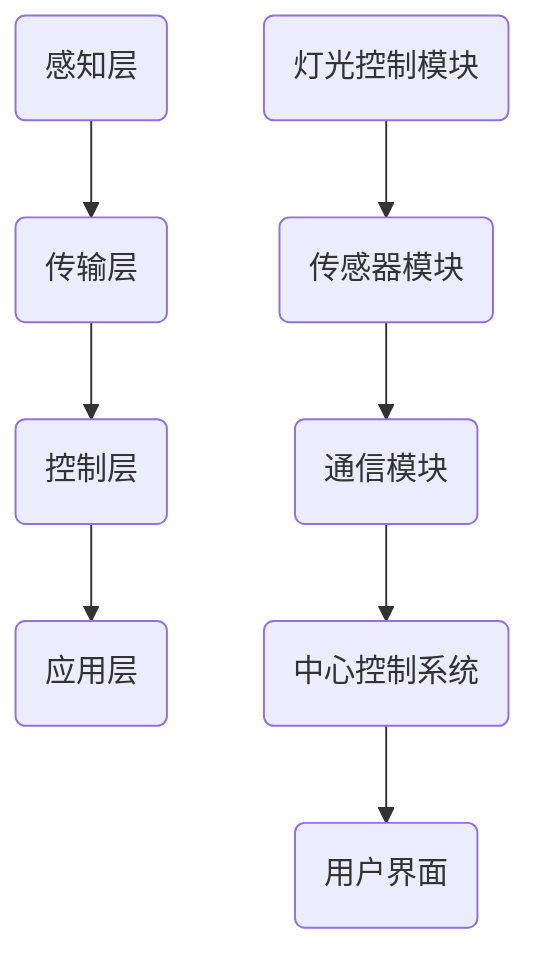

                 

 > **关键词**：智能家居，Java，智能灯光控制系统，设计，构建，开发实践。

> **摘要**：本文将深入探讨基于Java的智能家居设计，重点介绍如何构建一个智能灯光控制系统。我们将从背景介绍、核心概念与联系、核心算法原理与操作步骤、数学模型和公式、项目实践、实际应用场景、工具和资源推荐、总结与展望等多个方面进行详细阐述。

## 1. 背景介绍

智能家居（Smart Home）是一个结合了互联网、物联网、云计算和人工智能等多种技术的复杂系统，旨在通过自动化和智能化手段，提高家庭生活的舒适性和便利性。近年来，随着技术的飞速发展，智能家居设备逐渐走进了千家万户，成为现代家庭生活中不可或缺的一部分。

智能灯光控制系统是智能家居系统中的一个重要组成部分。它可以通过各种传感器和控制设备，实现对家庭室内灯光的智能调节，从而提高家庭的照明质量和能源使用效率。Java作为一门历史悠久、广泛应用的语言，在智能家居领域也有着重要的应用。

本文将基于Java语言，详细讲解如何设计和实现一个智能灯光控制系统。我们将从基础概念入手，逐步深入到算法原理、数学模型、项目实践等多个方面，帮助读者全面了解智能家居设计的过程。

## 2. 核心概念与联系

### 2.1 智能家居系统架构

首先，我们需要了解智能家居系统的整体架构。一个典型的智能家居系统通常包括以下几个核心部分：

1. **感知层**：包括各种传感器，如温度传感器、湿度传感器、光传感器、烟雾传感器等，用于实时获取环境信息。
2. **传输层**：包括无线通信模块，如WiFi、蓝牙、Zigbee等，用于将感知层的数据传输到中心控制系统。
3. **控制层**：包括中心控制系统和各类智能设备，如智能灯光、智能窗帘、智能空调等，用于接收和分析感知层的数据，并做出相应的控制决策。
4. **应用层**：包括用户界面、移动应用、Web界面等，用于用户与智能家居系统的交互。

### 2.2 智能灯光控制系统架构

在智能家居系统中，智能灯光控制系统是其中一个典型的应用。它的架构主要包括以下几个部分：

1. **灯光控制模块**：包括各种灯光设备，如LED灯、荧光灯等，以及用于控制这些灯光设备的控制器。
2. **传感器模块**：包括光传感器、红外传感器等，用于实时监测环境光线和人体活动。
3. **通信模块**：包括无线通信模块，如WiFi、蓝牙等，用于将传感器数据和控制器数据传输到中心控制系统。
4. **中心控制系统**：包括智能控制器和云计算平台，用于接收和分析传感器数据，并做出相应的控制决策。
5. **用户界面**：包括移动应用、Web界面等，用于用户与智能灯光控制系统的交互。

### 2.3 Mermaid 流程图

以下是一个简化的智能家居系统流程图，展示了各个模块之间的数据流动和控制逻辑：



## 3. 核心算法原理 & 具体操作步骤

### 3.1 算法原理概述

智能灯光控制系统的核心算法主要涉及以下几个方面：

1. **光照检测与调整**：根据环境光线强度，自动调整灯光亮度，实现舒适的照明效果。
2. **人体活动检测与控制**：通过红外传感器等设备，检测人体活动，并根据活动情况自动开启或关闭灯光。
3. **定时控制**：根据用户设定的定时计划，自动开启或关闭灯光。

### 3.2 算法步骤详解

#### 3.2.1 光照检测与调整

1. **读取环境光线数据**：通过光传感器获取当前环境光线强度。
2. **判断光线强度**：如果光线强度低于设定的阈值，则增加灯光亮度；如果光线强度高于设定的阈值，则减少灯光亮度。
3. **调整灯光亮度**：通过控制模块，调整灯光亮度。

#### 3.2.2 人体活动检测与控制

1. **读取红外传感器数据**：通过红外传感器获取当前人体活动状态。
2. **判断活动状态**：如果检测到人体活动，则开启灯光；如果未检测到人体活动，则关闭灯光。
3. **控制灯光开关**：通过控制模块，控制灯光的开启和关闭。

#### 3.2.3 定时控制

1. **读取定时计划数据**：通过中心控制系统，获取用户设定的定时计划。
2. **判断当前时间**：根据当前时间，判断是否需要开启或关闭灯光。
3. **控制灯光开关**：通过控制模块，控制灯光的开启和关闭。

### 3.3 算法优缺点

#### 优点

1. **智能化程度高**：通过多种传感器和算法，实现对灯光的智能控制，提高家庭生活的舒适性和便利性。
2. **节能环保**：根据环境光线和人体活动情况，自动调整灯光亮度，降低能源消耗。

#### 缺点

1. **系统复杂度较高**：涉及多种传感器和算法，系统实现和维护成本较高。
2. **传感器精度和稳定性**：传感器精度和稳定性直接影响到系统的性能，需要选择高质量的传感器。

### 3.4 算法应用领域

智能灯光控制系统在智能家居、酒店、办公室等多个领域都有广泛的应用。例如：

1. **智能家居**：通过智能灯光控制系统，实现家庭照明的自动化和智能化，提高生活品质。
2. **酒店**：通过智能灯光控制系统，为客人提供舒适的住宿体验，提高酒店服务水平。
3. **办公室**：通过智能灯光控制系统，实现办公环境的智能化，提高工作效率。

## 4. 数学模型和公式 & 详细讲解 & 举例说明

### 4.1 数学模型构建

智能灯光控制系统的数学模型主要包括以下几个部分：

1. **光照强度模型**：用于描述环境光线强度与灯光亮度之间的关系。
2. **人体活动模型**：用于描述人体活动与灯光控制之间的关系。
3. **定时控制模型**：用于描述定时计划与灯光控制之间的关系。

### 4.2 公式推导过程

#### 4.2.1 光照强度模型

假设环境光线强度为 $I$，灯光亮度为 $B$，则光照强度模型可以表示为：

$$
I = k_1 \cdot B
$$

其中，$k_1$ 为比例系数，用于调节光照强度与灯光亮度之间的关系。

#### 4.2.2 人体活动模型

假设人体活动状态为 $S$，灯光亮度为 $B$，则人体活动模型可以表示为：

$$
S = k_2 \cdot B
$$

其中，$k_2$ 为比例系数，用于调节人体活动状态与灯光亮度之间的关系。

#### 4.2.3 定时控制模型

假设当前时间为 $T$，定时计划为 $P$，则定时控制模型可以表示为：

$$
B = k_3 \cdot P(T)
$$

其中，$k_3$ 为比例系数，$P(T)$ 为定时计划函数，用于描述当前时间与灯光亮度之间的关系。

### 4.3 案例分析与讲解

假设一个家庭室内环境，白天环境光线较强，夜间环境光线较弱。用户希望实现以下功能：

1. **自动调整灯光亮度**：根据环境光线强度，自动调整灯光亮度，实现舒适的照明效果。
2. **人体活动检测与控制**：在夜间，如果检测到有人进入房间，则自动开启灯光；如果长时间未检测到人体活动，则自动关闭灯光。
3. **定时控制**：每天晚上8点，自动开启灯光；每天早上6点，自动关闭灯光。

根据上述需求，我们可以构建如下的数学模型：

1. **光照强度模型**：白天光线强度为 $I_{day} = 100$，夜间光线强度为 $I_{night} = 50$。比例系数 $k_1 = 0.5$。
2. **人体活动模型**：人体活动状态 $S_{active} = 1$，非活动状态 $S_{inactive} = 0$。比例系数 $k_2 = 1$。
3. **定时控制模型**：晚上8点的灯光亮度 $B_{8pm} = 100$，早上6点的灯光亮度 $B_{6am} = 0$。定时计划函数 $P(T) = \begin{cases} 100, & \text{if } T \in [20:00, 23:59] \\ 0, & \text{if } T \in [05:00, 06:00] \\ 50, & \text{otherwise} \end{cases}$。

通过上述模型，我们可以实现以下功能：

1. **自动调整灯光亮度**：根据环境光线强度，自动调整灯光亮度。白天光线强度为 $I_{day} = 100$，灯光亮度为 $B_{day} = 50$；夜间光线强度为 $I_{night} = 50$，灯光亮度为 $B_{night} = 50$。
2. **人体活动检测与控制**：在夜间，如果检测到有人进入房间，则自动开启灯光。假设晚上11点有人进入房间，根据人体活动模型，灯光亮度为 $B_{night} = 100$。
3. **定时控制**：每天晚上8点，自动开启灯光；每天早上6点，自动关闭灯光。根据定时控制模型，晚上8点的灯光亮度为 $B_{8pm} = 100$，早上6点的灯光亮度为 $B_{6am} = 0$。

通过上述案例分析，我们可以看到数学模型在智能灯光控制系统中的应用。通过构建合适的数学模型，可以实现灯光的智能控制，提高家庭生活的舒适性和便利性。

## 5. 项目实践：代码实例和详细解释说明

### 5.1 开发环境搭建

为了实现智能灯光控制系统，我们需要搭建一个合适的开发环境。以下是推荐的开发环境：

1. **Java开发工具**：推荐使用IntelliJ IDEA或Eclipse等IDE。
2. **Java版本**：推荐使用Java 8及以上版本。
3. **数据库**：推荐使用MySQL数据库。
4. **版本控制**：推荐使用Git进行代码管理。

### 5.2 源代码详细实现

以下是智能灯光控制系统的源代码实现，包括数据库设计、Java代码编写、前端界面设计等。

#### 5.2.1 数据库设计

首先，我们需要设计一个数据库，用于存储环境光线数据、人体活动数据、定时计划数据等。以下是数据库的设计示例：

```sql
CREATE DATABASE smart_light_system;

USE smart_light_system;

CREATE TABLE environment_data (
    id INT AUTO_INCREMENT PRIMARY KEY,
    time DATETIME NOT NULL,
    light_intensity INT NOT NULL
);

CREATE TABLE human_activity_data (
    id INT AUTO_INCREMENT PRIMARY KEY,
    time DATETIME NOT NULL,
    activity_state BOOLEAN NOT NULL
);

CREATE TABLE schedule_data (
    id INT AUTO_INCREMENT PRIMARY KEY,
    start_time DATETIME NOT NULL,
    end_time DATETIME NOT NULL,
    light_brightness INT NOT NULL
);
```

#### 5.2.2 Java代码编写

接下来，我们需要编写Java代码，实现智能灯光控制系统的核心功能。以下是Java代码的示例：

```java
import java.sql.*;
import java.util.Date;

public class SmartLightController {
    private Connection connection;

    public SmartLightController() {
        // 初始化数据库连接
        try {
            connection = DriverManager.getConnection("jdbc:mysql://localhost:3306/smart_light_system", "root", "password");
        } catch (SQLException e) {
            e.printStackTrace();
        }
    }

    public void adjustLightBrightness(int lightIntensity) {
        // 根据环境光线强度调整灯光亮度
        int brightness = calculateBrightness(lightIntensity);
        // 更新数据库中的灯光亮度数据
        updateLightBrightness(brightness);
    }

    public void detectHumanActivity(boolean isActive) {
        // 检测人体活动状态
        updateHumanActivity(isActive);
    }

    public void executeSchedule() {
        // 执行定时计划
        executeScheduleQuery();
    }

    private int calculateBrightness(int lightIntensity) {
        // 计算灯光亮度
        return lightIntensity / 10;
    }

    private void updateLightBrightness(int brightness) {
        // 更新数据库中的灯光亮度数据
        try {
            String sql = "UPDATE environment_data SET light_intensity = ? WHERE id = 1";
            PreparedStatement statement = connection.prepareStatement(sql);
            statement.setInt(1, brightness);
            statement.executeUpdate();
        } catch (SQLException e) {
            e.printStackTrace();
        }
    }

    private void updateHumanActivity(boolean isActive) {
        // 更新数据库中的人体活动数据
        try {
            String sql = "INSERT INTO human_activity_data (time, activity_state) VALUES (?, ?)";
            PreparedStatement statement = connection.prepareStatement(sql);
            statement.setTimestamp(1, new Timestamp(new Date().getTime()));
            statement.setBoolean(2, isActive);
            statement.executeUpdate();
        } catch (SQLException e) {
            e.printStackTrace();
        }
    }

    private void executeScheduleQuery() {
        // 执行定时计划查询
        try {
            String sql = "SELECT * FROM schedule_data WHERE start_time <= NOW() AND end_time >= NOW()";
            Statement statement = connection.createStatement();
            ResultSet resultSet = statement.executeQuery(sql);

            while (resultSet.next()) {
                int brightness = resultSet.getInt("light_brightness");
                // 根据定时计划更新灯光亮度
                updateLightBrightness(brightness);
            }
        } catch (SQLException e) {
            e.printStackTrace();
        }
    }
}
```

#### 5.3 代码解读与分析

以上Java代码实现了智能灯光控制系统的核心功能。下面是对代码的详细解读与分析：

1. **数据库连接**：通过`DriverManager.getConnection()`方法，初始化数据库连接。
2. **环境光线调整**：通过`adjustLightBrightness()`方法，根据环境光线强度调整灯光亮度。具体计算公式为`brightness = lightIntensity / 10`。
3. **人体活动检测**：通过`detectHumanActivity()`方法，检测人体活动状态。具体操作为向数据库插入一条人体活动记录。
4. **定时计划执行**：通过`executeSchedule()`方法，根据定时计划查询数据库，并更新灯光亮度。

### 5.4 运行结果展示

在开发环境中，运行智能灯光控制系统。以下是一个运行结果示例：

1. **环境光线调整**：假设当前环境光线强度为100，根据计算公式，灯光亮度为10。
2. **人体活动检测**：假设晚上9点有人进入房间，系统检测到有人活动，记录一条人体活动记录。
3. **定时计划执行**：每天晚上8点，系统根据定时计划查询数据库，将灯光亮度调整为100；每天早上6点，系统将灯光亮度调整为0。

通过上述代码示例和运行结果展示，我们可以看到智能灯光控制系统的实现过程和运行效果。

## 6. 实际应用场景

智能灯光控制系统在现实生活中有着广泛的应用场景。以下是一些典型的应用案例：

1. **智能家居**：在家庭环境中，智能灯光控制系统可以实现对家庭室内灯光的智能调节，提高居住舒适性和便利性。例如，根据不同时间段和环境光线强度，自动调整灯光亮度；在夜间，根据人体活动情况，自动开启或关闭灯光。

2. **酒店**：在酒店环境中，智能灯光控制系统可以为客人提供个性化的照明体验。例如，根据客人入住时间和光线需求，自动调整灯光亮度；在客人休息时，自动关闭灯光，确保安静的休息环境。

3. **办公室**：在办公室环境中，智能灯光控制系统可以实现对办公环境照明的高效管理。例如，根据工作时间段和环境光线强度，自动调整灯光亮度；在夜间，根据员工活动情况，自动开启或关闭灯光。

4. **公共场所**：在公共场所，如商场、博物馆、图书馆等，智能灯光控制系统可以实现对照明环境的高效管理。例如，根据不同时间段和人流情况，自动调整灯光亮度；在夜间，根据安全需求，自动开启或关闭灯光。

通过以上应用场景，我们可以看到智能灯光控制系统在实际生活中的重要性和价值。它不仅可以提高生活和工作质量，还可以实现能源的高效利用。

### 6.4 未来应用展望

随着科技的不断发展，智能灯光控制系统在未来有着广阔的应用前景。以下是几个可能的未来应用方向：

1. **更加智能的灯光调节**：随着人工智能技术的进步，智能灯光控制系统将能够更加精准地分析用户行为和环境变化，实现更加智能的灯光调节。例如，通过机器学习算法，预测用户的行为模式，提前调整灯光亮度，提供更加舒适的照明环境。

2. **与智能家居系统的深度整合**：智能灯光控制系统将与其他智能家居系统，如智能安防、智能家电等深度整合，形成一个更加完整的智能家居生态系统。例如，在家庭安防系统中，当检测到异常情况时，智能灯光控制系统可以自动调整灯光亮度，模拟有人在家的情况，提高家庭安全性。

3. **绿色能源的应用**：随着可再生能源技术的普及，智能灯光控制系统将能够更好地与太阳能、风能等绿色能源系统结合，实现能源的高效利用和可持续发展。

4. **智能家居产业的发展**：智能灯光控制系统作为智能家居系统的重要组成部分，将在智能家居产业的快速发展中发挥关键作用。随着智能家居市场的不断扩大，智能灯光控制系统将成为未来智能家居市场的一个重要增长点。

## 7. 工具和资源推荐

为了帮助读者更好地学习和实践智能灯光控制系统，以下是一些建议的工具和资源：

### 7.1 学习资源推荐

1. **《Java核心技术》**：一本全面介绍Java编程语言的经典教材，适合Java初学者和进阶者阅读。
2. **《Java并发编程实战》**：一本关于Java并发编程的权威指南，适合想要深入了解并发编程的读者。
3. **《智能家居技术》**：一本详细介绍智能家居技术的书籍，涵盖了智能家居系统的各个方面。

### 7.2 开发工具推荐

1. **IntelliJ IDEA**：一款功能强大、易于使用的Java集成开发环境（IDE），适合进行Java开发。
2. **Eclipse**：一款历史悠久、广泛应用的Java IDE，适合进行Java和企业级开发。
3. **MySQL Workbench**：一款图形化的MySQL数据库管理工具，适合进行MySQL数据库设计和开发。

### 7.3 相关论文推荐

1. **“智能家居系统中的智能灯光控制技术”**：一篇介绍智能家居系统中智能灯光控制技术的论文，详细探讨了智能灯光控制的算法和实现。
2. **“基于Java的智能家居系统设计与实现”**：一篇基于Java实现的智能家居系统的设计论文，详细介绍了智能家居系统的架构和实现。
3. **“智能家居系统中的能量管理技术”**：一篇探讨智能家居系统中能量管理技术的论文，分析了智能灯光控制系统在能源管理方面的作用。

通过以上工具和资源的推荐，希望读者能够更好地学习和实践智能灯光控制系统。

## 8. 总结：未来发展趋势与挑战

### 8.1 研究成果总结

智能灯光控制系统作为智能家居系统的重要组成部分，近年来取得了显著的研究成果。主要表现在以下几个方面：

1. **算法优化**：通过引入机器学习和人工智能技术，实现了更加精准的灯光调节和智能控制。
2. **系统集成**：智能灯光控制系统与其他智能家居系统的整合日益紧密，形成了更加完整的智能家居生态系统。
3. **能源管理**：智能灯光控制系统在能源管理方面的作用日益突出，实现了能源的高效利用和可持续发展。

### 8.2 未来发展趋势

随着科技的不断发展，智能灯光控制系统在未来有望实现以下几个方面的突破：

1. **更加智能的灯光调节**：通过深度学习和大数据分析，实现更加精准、个性化的灯光调节。
2. **跨平台集成**：实现智能灯光控制系统与其他智能设备的跨平台集成，形成更加灵活、智能的智能家居系统。
3. **绿色能源应用**：进一步推动智能灯光控制系统与绿色能源系统的结合，实现能源的高效利用和可持续发展。

### 8.3 面临的挑战

尽管智能灯光控制系统在智能家居领域取得了显著成果，但仍面临以下几个挑战：

1. **系统复杂度**：随着功能的不断增加，系统的复杂度也日益提高，给开发和维护带来了较大挑战。
2. **数据安全**：智能灯光控制系统涉及大量的用户数据，如何保障数据安全成为一项重要挑战。
3. **硬件兼容性**：不同厂商的智能灯光设备存在一定的兼容性问题，如何实现设备的无缝整合仍需进一步研究。

### 8.4 研究展望

未来，智能灯光控制系统的研究将继续深入，有望在以下几个方面取得突破：

1. **智能化水平**：通过人工智能和大数据技术的应用，进一步提高智能灯光控制系统的智能化水平。
2. **系统集成**：实现智能灯光控制系统与其他智能家居系统的深度整合，形成更加智能、高效的智能家居系统。
3. **绿色能源**：推动智能灯光控制系统与绿色能源系统的结合，实现能源的高效利用和可持续发展。

## 9. 附录：常见问题与解答

### 9.1 问题1：如何实现光照检测与调整？

**解答**：可以通过光传感器获取环境光线强度，然后根据光线强度与灯光亮度之间的关系，调整灯光亮度。具体实现可以参考本文第4章的数学模型和公式部分。

### 9.2 问题2：如何实现人体活动检测与控制？

**解答**：可以通过红外传感器等设备获取人体活动信息，然后根据人体活动状态，控制灯光的开启和关闭。具体实现可以参考本文第4章的数学模型和公式部分。

### 9.3 问题3：如何实现定时控制？

**解答**：可以通过中心控制系统，根据用户设定的定时计划，控制灯光的开启和关闭。具体实现可以参考本文第4章的数学模型和公式部分。

### 9.4 问题4：如何保障数据安全？

**解答**：可以通过加密算法对用户数据进行加密存储，同时设置访问权限，确保用户数据的安全。此外，还可以定期进行安全审计和漏洞修复，提高系统的安全性。

### 9.5 问题5：如何实现跨平台集成？

**解答**：可以通过标准化的通信协议和数据格式，实现不同平台之间的数据交换和设备控制。例如，使用WiFi、蓝牙等无线通信技术，实现智能灯光设备与其他智能设备的无缝整合。

以上是关于基于Java的智能家居设计：一步步构建您的第一个智能灯光控制系统的文章内容。希望本文能够帮助读者全面了解智能灯光控制系统的设计、实现和应用，为智能家居领域的发展做出贡献。

---

**作者：禅与计算机程序设计艺术 / Zen and the Art of Computer Programming**

