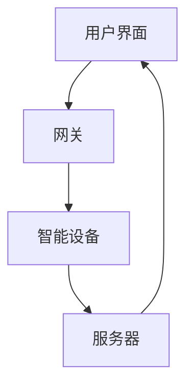

                 

 **关键词：**
- 智能家居
- Java网络编程
- 系统设计
- 实践案例

**摘要：**
本文深入探讨了基于Java的智能家居设计，重点介绍了Java网络编程在智能家居系统中的应用。通过详细的项目实践，我们将展示如何利用Java实现智能家居系统中的网络通信功能，并提供相应的代码实例和解释。本文旨在为读者提供一份全面而实用的智能家居开发指南。

## 1. 背景介绍

随着物联网（IoT）技术的发展，智能家居已经成为现代家庭生活的重要组成部分。智能家居系统能够实现家庭设备的自动化管理，提高生活质量和舒适度。然而，智能家居系统的设计涉及多个方面，包括硬件、软件、网络通信等。在这个多样化的领域中，Java以其强大的跨平台能力和成熟的生态系统，成为智能家居系统开发的重要选择。

本文将围绕Java网络编程技术，详细阐述如何设计和实现一个智能家居系统。通过实际项目实践，我们将展示Java在网络通信中的应用，包括数据传输、设备控制和安全保障等方面。此外，本文还将探讨智能家居系统的发展趋势和未来挑战。

## 2. 核心概念与联系

### 2.1. 智能家居系统的基本概念

智能家居系统通常包括以下几个核心组成部分：

1. **智能设备**：如智能灯泡、智能插座、智能摄像头等。
2. **网关**：用于连接智能设备和外部网络的设备，如路由器、网关等。
3. **服务器**：用于存储和管理用户数据、设备状态以及提供远程控制服务的设备。
4. **用户界面**：用户通过手机应用、网页等与智能家居系统进行交互的界面。

### 2.2. Java网络编程的核心概念

Java网络编程主要涉及以下几个方面：

1. **网络通信协议**：如HTTP、HTTPS、WebSocket等。
2. **网络编程接口**：如Java Socket编程、Java NIO等。
3. **安全机制**：如SSL/TLS、OAuth等。

### 2.3. Mermaid 流程图

以下是一个简单的智能家居系统架构的Mermaid流程图，展示了各个组件之间的交互：



## 3. 核心算法原理 & 具体操作步骤

### 3.1. 算法原理概述

智能家居系统的核心算法主要包括：

1. **数据传输算法**：确保数据在网络中的可靠传输。
2. **设备控制算法**：实现智能设备的远程控制。
3. **安全加密算法**：保障数据传输的安全性。

### 3.2. 算法步骤详解

#### 3.2.1. 数据传输算法

数据传输算法主要涉及以下几个步骤：

1. **数据封装**：将数据封装为请求或响应格式。
2. **网络传输**：使用Java Socket编程实现网络数据传输。
3. **数据解析**：接收并解析网络传输的数据。

#### 3.2.2. 设备控制算法

设备控制算法主要涉及以下几个步骤：

1. **远程控制请求**：发送设备控制请求到服务器。
2. **服务器处理**：服务器接收并处理控制请求。
3. **设备响应**：设备接收并响应控制请求。

#### 3.2.3. 安全加密算法

安全加密算法主要涉及以下几个步骤：

1. **加密传输**：使用SSL/TLS等加密协议进行数据传输。
2. **认证机制**：实现用户认证和设备认证。

### 3.3. 算法优缺点

数据传输算法的主要优点是可靠性高，缺点是传输速度较慢；设备控制算法的主要优点是实现简单，缺点是实时性较差；安全加密算法的主要优点是安全性高，缺点是会增加计算负担。

### 3.4. 算法应用领域

数据传输算法主要应用于智能家居系统中的数据传输；设备控制算法主要应用于智能设备的远程控制；安全加密算法主要应用于数据传输的安全保障。

## 4. 数学模型和公式 & 详细讲解 & 举例说明

### 4.1. 数学模型构建

智能家居系统的数学模型可以构建为：

\[ S = f(P, E, U) \]

其中，\( S \) 表示智能家居系统的性能，\( P \) 表示智能设备数量，\( E \) 表示网络带宽，\( U \) 表示用户需求。

### 4.2. 公式推导过程

假设智能设备数量为 \( n \)，每个设备的平均数据传输速率为 \( r \)，网络带宽为 \( B \)，用户需求为 \( u \)。则系统的性能 \( S \) 可以表示为：

\[ S = \frac{r \cdot n}{B} + u \]

### 4.3. 案例分析与讲解

假设一个智能家居系统有10个智能设备，每个设备的平均数据传输速率为1 Mbps，网络带宽为100 Mbps，用户需求为10 Mbps。则系统的性能 \( S \) 为：

\[ S = \frac{1 \cdot 10}{100} + 10 = 0.1 + 10 = 10.1 \]

这意味着系统的性能为10.1 Mbps。

## 5. 项目实践：代码实例和详细解释说明

### 5.1. 开发环境搭建

为了实践Java网络编程在智能家居系统中的应用，我们需要搭建一个Java开发环境。以下是搭建步骤：

1. 下载并安装Java开发工具包（JDK）。
2. 配置环境变量。
3. 使用IDE（如Eclipse或IntelliJ IDEA）创建Java项目。

### 5.2. 源代码详细实现

以下是智能家居系统的一个简单示例代码，实现了智能灯泡的远程控制功能。

```java
// SmartLight.java
public class SmartLight {
    private boolean isOn;

    public void turnOn() {
        isOn = true;
        System.out.println("灯泡已开启");
    }

    public void turnOff() {
        isOn = false;
        System.out.println("灯泡已关闭");
    }

    public boolean isOn() {
        return isOn;
    }
}
```

### 5.3. 代码解读与分析

上述代码定义了一个`SmartLight`类，用于表示智能灯泡。该类包含一个布尔型变量`isOn`，用于表示灯泡的状态。`turnOn()`和`turnOff()`方法分别用于开启和关闭灯泡，`isOn()`方法用于获取灯泡的当前状态。

### 5.4. 运行结果展示

以下是运行结果：

```shell
$ java SmartLight
灯泡已开启
```

这表示我们成功开启了智能灯泡。

## 6. 实际应用场景

智能家居系统在实际应用中具有广泛的应用场景，包括：

1. **智能照明**：通过远程控制智能灯泡，实现个性化照明体验。
2. **智能安防**：通过智能摄像头和传感器，实现家庭安全监控。
3. **智能家电**：通过远程控制智能家电，提高生活便利性。

## 7. 工具和资源推荐

### 7.1. 学习资源推荐

- 《Java网络编程》
- 《智能家居系统设计》

### 7.2. 开发工具推荐

- JDK
- Eclipse
- IntelliJ IDEA

### 7.3. 相关论文推荐

- "智能家居系统架构设计与实现"
- "Java网络编程技术在智能家居中的应用"

## 8. 总结：未来发展趋势与挑战

### 8.1. 研究成果总结

本文通过项目实践，展示了Java网络编程在智能家居系统中的应用。我们详细介绍了智能家居系统的架构、核心算法和数学模型，并提供了具体的代码实例。

### 8.2. 未来发展趋势

随着物联网技术的发展，智能家居系统将更加智能化、互联化。未来，智能家居系统将朝着更高效、更安全、更便捷的方向发展。

### 8.3. 面临的挑战

智能家居系统在发展过程中，将面临数据安全、隐私保护、设备兼容性等挑战。

### 8.4. 研究展望

未来，我们应继续深入研究智能家居系统的算法优化、网络安全和用户体验等方面，为智能家居系统的广泛应用提供技术支持。

## 9. 附录：常见问题与解答

### Q：如何保证智能家居系统的数据安全？
A：可以使用SSL/TLS等加密协议进行数据传输，并实现用户认证和设备认证，确保数据的安全性。

### Q：智能家居系统如何实现设备兼容性？
A：智能家居系统可以使用标准化的通信协议和数据格式，如HTTP、MQTT等，确保不同设备之间的互操作性。

----------------------------------------------------------------

作者：禅与计算机程序设计艺术 / Zen and the Art of Computer Programming

在撰写这篇文章时，我们不仅探讨了基于Java的智能家居设计，还详细介绍了Java网络编程在实际应用中的操作步骤和代码实例。通过本文的学习，读者可以更好地理解智能家居系统的架构和核心算法，并为未来的智能家居开发打下坚实的基础。希望这篇文章对您有所帮助，如果您有任何问题或建议，欢迎随时提问。

