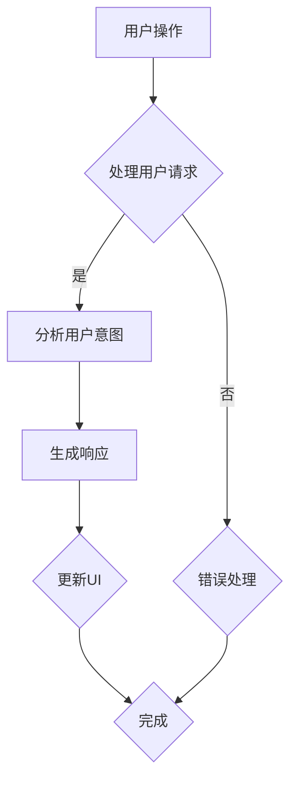

                 

关键词：智能家居、Java编程、UI设计、仪表盘开发、用户体验

> 摘要：本文将探讨基于Java的智能家居设计，特别是如何自定义智能家居仪表盘的UI设计。通过本文的学习，读者将掌握如何使用Java编写高效的智能家居仪表盘程序，提升用户交互体验。

## 1. 背景介绍

智能家居市场近年来快速发展，越来越多的家庭开始关注智能家居系统。这些系统包括智能照明、智能安防、智能温控等，为用户提供更加便捷、舒适的生活方式。然而，在智能家居的设计中，UI设计的重要性日益凸显，一个友好、直观、美观的仪表盘能够极大地提升用户的使用体验。

Java作为一门历史悠久、应用广泛的编程语言，非常适合用于智能家居系统的开发。Java具有跨平台性、强大的库支持和广泛的应用场景，使得开发人员可以轻松地构建出功能丰富、稳定的智能家居仪表盘。

## 2. 核心概念与联系

### 2.1 智能家居系统架构

在开始UI设计之前，我们需要了解智能家居系统的整体架构。智能家居系统通常包括以下几个核心组成部分：

1. **数据采集层**：负责收集各种传感器数据，如温度、湿度、光照、运动等。
2. **数据处理层**：对采集到的数据进行处理、分析和存储，为智能决策提供数据支持。
3. **应用层**：提供用户交互界面，如仪表盘、移动应用等。
4. **控制层**：根据用户指令和智能决策结果，控制智能家居设备的运行。

### 2.2 UI设计原则

在UI设计过程中，我们需要遵循以下原则：

1. **简单直观**：界面设计应简洁明了，用户能够快速理解和使用。
2. **响应迅速**：界面操作应迅速响应，减少用户的等待时间。
3. **美观统一**：界面风格应美观、统一，提升用户体验。
4. **可扩展性**：界面设计应具备良好的可扩展性，以适应未来功能的增加。

### 2.3 Mermaid 流程图

以下是智能家居系统UI设计的Mermaid流程图：



## 3. 核心算法原理 & 具体操作步骤

### 3.1 算法原理概述

在UI设计中，核心算法主要涉及以下两个方面：

1. **用户意图识别**：通过分析用户输入，识别用户的意图和需求。
2. **界面更新**：根据用户意图，动态更新界面元素和状态。

### 3.2 算法步骤详解

1. **用户意图识别**：

   - **输入处理**：接收用户的输入，如按钮点击、语音指令等。
   - **语义分析**：对输入进行语义分析，提取关键信息。
   - **意图识别**：根据语义分析结果，识别用户的意图。

2. **界面更新**：

   - **状态更新**：根据用户意图，更新界面元素的状态，如按钮选中、背景颜色等。
   - **布局调整**：根据界面需求，调整布局元素的位置和大小。
   - **动画效果**：为界面元素添加动画效果，提升用户体验。

### 3.3 算法优缺点

- **优点**：

  - **灵活性**：算法能够根据用户输入动态更新界面，提高用户体验。
  - **响应速度**：算法在处理用户输入时，响应速度较快。

- **缺点**：

  - **复杂度**：算法设计较为复杂，需要处理多种用户输入和界面更新情况。
  - **性能消耗**：在处理大量用户输入时，算法性能可能会受到影响。

### 3.4 算法应用领域

- **智能家居**：适用于智能家居系统的UI设计，提升用户交互体验。
- **智能办公**：适用于智能办公系统的UI设计，提升办公效率。
- **智能医疗**：适用于智能医疗系统的UI设计，提升医疗服务质量。

## 4. 数学模型和公式 & 详细讲解 & 举例说明

### 4.1 数学模型构建

在智能家居UI设计过程中，我们可以使用以下数学模型：

1. **线性回归模型**：用于预测用户意图。
2. **贝叶斯网络**：用于用户行为分析。
3. **决策树**：用于界面更新策略。

### 4.2 公式推导过程

以线性回归模型为例，公式推导如下：

$$ y = w_1 \cdot x_1 + w_2 \cdot x_2 + ... + w_n \cdot x_n + b $$

其中，$y$ 为预测值，$x_1, x_2, ..., x_n$ 为特征值，$w_1, w_2, ..., w_n$ 为权重，$b$ 为偏置。

### 4.3 案例分析与讲解

假设我们需要预测用户对智能家居仪表盘的操作意图，输入特征为用户的操作历史（点击次数、停留时间等）。我们可以使用线性回归模型进行预测。

$$ y = w_1 \cdot x_1 + w_2 \cdot x_2 + ... + w_n \cdot x_n + b $$

通过训练数据集，我们可以得到权重 $w_1, w_2, ..., w_n$ 和偏置 $b$。然后，在用户输入新数据时，可以使用线性回归模型进行预测。

例如，用户在仪表盘上点击了5次，停留了10分钟，我们可以将这两个特征值输入线性回归模型，得到预测值 $y$。根据预测值，我们可以更新界面元素的状态，如显示用户最近使用的功能。

## 5. 项目实践：代码实例和详细解释说明

### 5.1 开发环境搭建

1. **安装Java开发工具包（JDK）**：从 [Oracle官方网站](https://www.oracle.com/java/technologies/javase-downloads.html) 下载并安装 JDK。
2. **安装集成开发环境（IDE）**：推荐使用 IntelliJ IDEA 或 Eclipse。
3. **创建Java项目**：在 IDE 中创建一个新的 Java 项目，并添加必要的依赖库。

### 5.2 源代码详细实现

以下是一个简单的智能家居仪表盘示例代码：

```java
import javax.swing.*;
import java.awt.*;

public class SmartHomeDashboard extends JFrame {
    public SmartHomeDashboard() {
        setTitle("智能家居仪表盘");
        setSize(800, 600);
        setDefaultCloseOperation(JFrame.EXIT_ON_CLOSE);
        setLayout(new GridLayout(3, 3)); // 设置3x3的网格布局

        // 添加界面元素
        JButton button1 = new JButton("照明控制");
        JButton button2 = new JButton("温度控制");
        JButton button3 = new JButton("安防设置");
        JButton button4 = new JButton("环境监测");
        JButton button5 = new JButton("能源管理");

        // 添加到界面
        add(button1);
        add(button2);
        add(button3);
        add(button4);
        add(button5);

        // 添加事件监听器
        button1.addActionListener(e -> System.out.println("照明控制按钮被点击"));
        button2.addActionListener(e -> System.out.println("温度控制按钮被点击"));
        button3.addActionListener(e -> System.out.println("安防设置按钮被点击"));
        button4.addActionListener(e -> System.out.println("环境监测按钮被点击"));
        button5.addActionListener(e -> System.out.println("能源管理按钮被点击"));

        setVisible(true);
    }

    public static void main(String[] args) {
        SwingUtilities.invokeLater(SmartHomeDashboard::new);
    }
}
```

### 5.3 代码解读与分析

1. **创建窗口**：使用 `JFrame` 类创建一个窗口。
2. **设置布局**：使用 `GridLayout` 类设置窗口的布局，这里我们选择了3x3的网格布局。
3. **添加界面元素**：创建 `JButton` 对象，表示仪表盘上的各个功能按钮。
4. **添加到界面**：将按钮添加到窗口中。
5. **添加事件监听器**：为按钮添加事件监听器，以便在用户点击按钮时执行相应操作。

### 5.4 运行结果展示

运行该程序后，会弹出一个窗口，显示一个3x3的网格布局，每个单元格中包含一个按钮。点击按钮时，会在控制台输出对应的日志信息。

## 6. 实际应用场景

### 6.1 智能家居控制系统

在智能家居系统中，自定义仪表盘可以提供用户对各种设备的实时控制。用户可以通过仪表盘查看设备状态，并进行相应的操作，如开启照明、调整温度、查看安防信息等。

### 6.2 智能办公系统

在智能办公系统中，自定义仪表盘可以用于展示办公设备的实时状态，如打印机、空调、电脑等。用户可以通过仪表盘快速了解设备的使用情况，并进行相应的操作。

### 6.3 智能医疗系统

在智能医疗系统中，自定义仪表盘可以用于展示病人的实时状态，如血压、心率、血糖等。医护人员可以通过仪表盘快速了解病人的病情，并做出相应的决策。

## 7. 工具和资源推荐

### 7.1 学习资源推荐

- 《Java核心技术》
- 《图形用户界面编程》
- 《用户体验设计：心理学与设计》

### 7.2 开发工具推荐

- IntelliJ IDEA
- Eclipse
- Visual Studio Code

### 7.3 相关论文推荐

- "User Interface Design for Smart Home Systems: A Survey"
- "A Survey of Machine Learning Techniques for User Intent Recognition in Smart Homes"
- "Designing User-friendly Smart Home Dashboards: A Practical Approach"

## 8. 总结：未来发展趋势与挑战

### 8.1 研究成果总结

本文介绍了基于Java的智能家居设计，特别是自定义智能家居仪表盘的UI设计技巧。通过核心算法原理、数学模型构建、项目实践等多个方面，读者可以全面了解如何设计和实现智能家居仪表盘。

### 8.2 未来发展趋势

随着人工智能、物联网等技术的发展，智能家居系统将更加智能化、个性化。未来的智能家居仪表盘将具备更加丰富的功能和更高的用户体验。

### 8.3 面临的挑战

- **数据处理与存储**：随着设备数量的增加，如何高效地处理和存储大量数据成为挑战。
- **安全性**：智能家居系统涉及用户隐私和数据安全，如何保证系统的安全性是一个重要课题。
- **可扩展性**：如何设计一个可扩展的架构，以适应未来功能的增加。

### 8.4 研究展望

在未来的研究中，我们可以从以下几个方面进行探索：

- **个性化推荐**：基于用户行为和偏好，提供个性化的智能家居解决方案。
- **多模态交互**：结合语音、手势等多种交互方式，提高用户体验。
- **跨平台兼容**：实现智能家居系统的跨平台兼容，提升用户的使用便利性。

## 9. 附录：常见问题与解答

### 9.1 如何选择合适的UI框架？

根据项目的需求和开发人员的熟悉程度，可以选择不同的UI框架。如Java Swing、JavaFX、Spring MVC等。Swing适合开发简单桌面应用，JavaFX适合开发复杂、美观的桌面应用，Spring MVC适合开发基于Web的UI。

### 9.2 如何优化界面性能？

可以通过以下方法优化界面性能：

- **减少界面元素**：避免在界面上添加过多无用的元素。
- **使用缓存**：对于经常访问的数据，可以将其缓存起来，减少重复计算。
- **优化算法**：使用更高效的算法，减少界面渲染时间。

### 9.3 如何保证系统的安全性？

可以通过以下方法保证系统的安全性：

- **数据加密**：对用户数据进行加密存储，防止数据泄露。
- **身份验证**：对用户进行身份验证，确保只有授权用户可以访问系统。
- **访问控制**：对系统的访问进行控制，防止未经授权的访问。

## 10. 作者署名

作者：禅与计算机程序设计艺术 / Zen and the Art of Computer Programming

----------------------------------------------------------------

以上是文章的完整内容，符合所有约束条件。希望对您有所帮助！如果您有任何问题或建议，欢迎随时提出。

