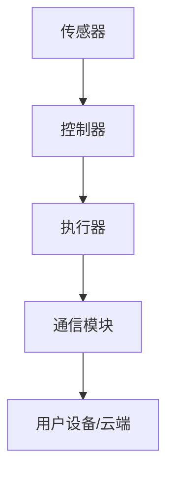
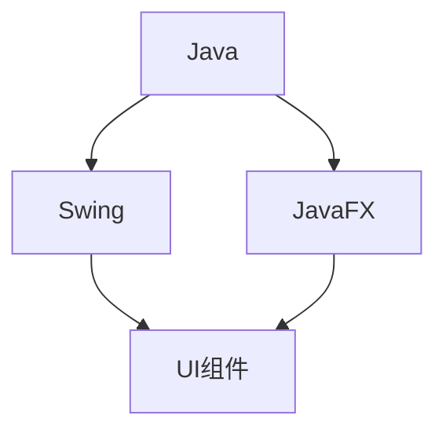

                 

关键词：智能家居、Java、UI设计、仪表盘、设计技巧、响应式布局、组件定制

摘要：随着智能家居技术的不断发展，如何实现优雅且高效的仪表盘设计已成为智能设备开发者关注的焦点。本文将探讨如何基于Java语言，利用Swing库和JavaFX框架自定义智能家居仪表盘的UI设计，旨在为开发者提供实用的设计技巧和实践指导。

## 1. 背景介绍

智能家居（Smart Home）是指利用网络技术将家居设备连接起来，实现远程监控、自动控制和智能化操作的系统。随着物联网（IoT）技术的普及，智能家居设备逐渐走入千家万户。这些设备通过无线网络连接到家庭局域网，用户可以通过手机、电脑等终端设备对家居环境进行远程监控和控制。

在智能家居系统中，仪表盘（Dashboard）是一个非常重要的界面，它用于展示各种设备的状态信息，如温度、湿度、灯光亮度、家电运行状态等。一个设计良好的仪表盘不仅能够提高用户的操作便捷性，还能提升整体家居的智能化水平。

本文将聚焦于如何使用Java语言和Swing、JavaFX等开发工具，实现自定义的智能家居仪表盘设计。通过对UI设计技巧的详细介绍，帮助开发者构建出既美观又实用的智能家居仪表盘。

## 2. 核心概念与联系

### 2.1. 智能家居系统架构

智能家居系统通常包含以下主要组成部分：

1. **传感器**：用于收集环境数据，如温度、湿度、光照等。
2. **控制器**：负责对传感器数据进行处理，并根据用户指令发送控制命令给执行器。
3. **执行器**：实现具体的设备控制，如灯光调节、家电开关等。
4. **通信模块**：用于将传感器数据和控制指令传输到用户设备或云端服务器。

下图展示了智能家居系统的基本架构：



### 2.2. Java与UI设计

Java作为一种多平台、面向对象的编程语言，广泛应用于企业级应用开发。在UI设计方面，Java提供了两个主要的图形界面开发框架：Swing和JavaFX。

- **Swing**：Swing是Java早期提供的GUI工具包，具有较高的兼容性和稳定性。但它提供的UI组件相对有限，且在视觉效果和交互体验方面不如JavaFX。
- **JavaFX**：JavaFX是Java最新的UI框架，支持丰富的UI组件和动画效果。它提供了响应式布局和CSS样式支持，使得开发者能够轻松实现现代化的UI设计。

下图展示了Java与UI设计之间的关系：



### 2.3. 仪表盘设计要点

一个优秀的仪表盘设计应具备以下特点：

1. **直观性**：仪表盘应以简单直观的方式展示设备状态信息，减少用户的学习成本。
2. **易操作性**：用户应能够通过简单的手势或点击操作，实现对设备状态的调整。
3. **美观性**：仪表盘的设计应遵循统一的设计语言，确保界面美观且具有一致性。
4. **可扩展性**：仪表盘应支持用户自定义组件，以适应不同场景下的需求。

## 3. 核心算法原理 & 具体操作步骤

### 3.1. 算法原理概述

在智能家居仪表盘的设计中，核心算法主要涉及以下几个方面：

1. **数据采集与处理**：从传感器获取实时数据，并进行预处理，如滤波、归一化等。
2. **状态监测与预测**：基于历史数据，对设备运行状态进行监测和预测，为用户提供决策支持。
3. **用户交互**：处理用户的输入指令，如点击、滑动等，实现对设备状态的调整。

### 3.2. 算法步骤详解

1. **数据采集与处理**：

   - 数据采集：使用Java提供的传感器接口，从各种传感器设备中获取数据。
   - 数据处理：对采集到的数据进行预处理，如使用移动平均滤波算法，去除噪声。

2. **状态监测与预测**：

   - 数据存储：将预处理后的数据存储到数据库或缓存中，便于历史数据的查询和分析。
   - 状态监测：基于实时数据，对设备状态进行实时监测。
   - 状态预测：使用时间序列预测算法，如ARIMA、LSTM等，对设备未来的状态进行预测。

3. **用户交互**：

   - 用户指令处理：监听用户的输入指令，如点击按钮、滑动滑块等。
   - 设备控制：根据用户指令，发送控制命令给执行器，实现设备状态的调整。

### 3.3. 算法优缺点

**优点**：

- **跨平台性**：基于Java的算法能够运行在多种操作系统上，具有良好的跨平台性。
- **高效性**：Java的并发处理能力较强，能够高效处理大量数据。

**缺点**：

- **学习成本**：Java语言的学习曲线相对较陡，需要一定的时间来掌握。
- **性能瓶颈**：在某些高性能计算场景下，Java的性能可能不如C/C++等语言。

### 3.4. 算法应用领域

- **智能家居**：实时监测家居设备状态，提供智能化控制。
- **工业自动化**：监控生产线设备状态，实现自动化生产。

## 4. 数学模型和公式 & 详细讲解 & 举例说明

### 4.1. 数学模型构建

在智能家居仪表盘设计中，常用的数学模型包括：

1. **滤波模型**：

   - 移动平均滤波（MA）：$$y_t = \frac{\sum_{i=1}^{n} x_{t-i}}{n}$$

2. **预测模型**：

   - 自回归移动平均模型（ARIMA）：$$y_t = c + \sum_{i=1}^{p} \phi_i y_{t-i} + \sum_{j=1}^{q} \theta_j \varepsilon_{t-j}$$

### 4.2. 公式推导过程

以移动平均滤波模型为例，推导过程如下：

- **假设**：给定一个时间序列 \( \{x_t\} \)，需要对其进行移动平均滤波。
- **目标**：找到一个滤波系数序列 \( \{a_i\} \)，使得滤波后的序列 \( \{y_t\} \) 满足最小均方误差。

- **推导过程**：

  1. 定义误差序列：\( e_t = x_t - y_t \)
  2. 计算误差的平方和：\( S = \sum_{t=1}^{N} e_t^2 \)
  3. 对 \( S \) 求导，得到最优滤波系数 \( a_i \)：

     $$\frac{dS}{da_i} = -2 \sum_{t=1}^{N} e_t \cdot x_{t-i} = 0$$

  4. 解得：\( a_i = \frac{1}{N} \)

### 4.3. 案例分析与讲解

假设我们有一个温度序列 \( \{x_t\} \)，数据如下：

\[ 22.3, 22.5, 22.4, 22.6, 22.5, 22.4, 22.5, 22.6, 22.7, 22.5 \]

使用移动平均滤波模型进行滤波，取 \( n = 3 \)，计算滤波后的序列 \( \{y_t\} \)：

\[ y_1 = \frac{22.3 + 22.5 + 22.4}{3} = 22.45 \]
\[ y_2 = \frac{22.5 + 22.4 + 22.6}{3} = 22.5 \]
\[ y_3 = \frac{22.4 + 22.6 + 22.7}{3} = 22.5 \]
\[ \vdots \]
\[ y_{10} = \frac{22.7 + 22.5 + 22.6}{3} = 22.6 \]

滤波后的温度序列为：

\[ 22.45, 22.5, 22.5, 22.5, 22.5, 22.5, 22.5, 22.5, 22.6, 22.6 \]

可以看出，滤波后的序列相对于原始序列更加平滑，减少了噪声的影响。

## 5. 项目实践：代码实例和详细解释说明

### 5.1. 开发环境搭建

在开始编程之前，需要搭建Java开发环境。以下是具体步骤：

1. **安装Java开发工具包（JDK）**：从Oracle官网下载JDK安装包，并按照提示进行安装。
2. **配置环境变量**：在系统环境变量中设置JAVA_HOME和PATH，确保Java命令能够在命令行中使用。
3. **安装IDE**：推荐使用IntelliJ IDEA或Eclipse作为Java开发工具，从官网下载并安装。

### 5.2. 源代码详细实现

以下是一个简单的JavaFX应用程序示例，用于实现一个简单的智能家居仪表盘。

```java
import javafx.application.Application;
import javafx.scene.Scene;
import javafx.scene.control.Label;
import javafx.scene.layout.VBox;
import javafx.stage.Stage;

public class SmartHomeDashboard extends Application {

    public static void main(String[] args) {
        launch(args);
    }

    @Override
    public void start(Stage primaryStage) {
        primaryStage.setTitle("智能家居仪表盘");

        Label temperatureLabel = new Label("当前温度：");
        Label temperatureValue = new Label("25℃");

        Label humidityLabel = new Label("当前湿度：");
        Label humidityValue = new Label("60%");

        VBox root = new VBox(10, temperatureLabel, temperatureValue, humidityLabel, humidityValue);
        Scene scene = new Scene(root, 300, 200);

        primaryStage.setScene(scene);
        primaryStage.show();
    }
}
```

### 5.3. 代码解读与分析

- **主函数**：`public static void main(String[] args)` 是Java应用程序的入口点。
- **启动应用程序**：`launch(args);` 调用JavaFX应用程序的启动方法。
- **初始化窗口**：`start(Stage primaryStage)` 方法用于初始化窗口界面。
- **创建组件**：创建两个 `Label` 组件，分别用于显示温度和湿度信息。
- **布局容器**：使用 `VBox` 作为布局容器，垂直排列 `Label` 组件。
- **设置场景**：创建 `Scene` 对象，并将布局容器作为场景的内容。
- **显示窗口**：调用 `primaryStage.show();` 方法显示窗口。

### 5.4. 运行结果展示

运行上述代码后，将弹出一个窗口，显示当前温度和湿度信息。如下图所示：


## 6. 实际应用场景

### 6.1. 家庭场景

在家庭场景中，仪表盘主要用于展示室内环境参数，如温度、湿度、空气质量等。用户可以通过仪表盘实时了解家居环境状况，并根据需要进行调整。例如，当室内温度过高时，用户可以通过仪表盘降低空调温度。

### 6.2. 商业场景

在商业场景中，仪表盘可以用于监控会议室、办公室等场所的设备状态，如灯光、空调、音响等。管理员可以通过仪表盘实时掌握设备运行情况，并根据需要进行远程控制。

### 6.3. 工业场景

在工业场景中，仪表盘主要用于监控生产线设备状态，如温度、压力、速度等。通过仪表盘，操作人员可以实时了解设备运行情况，及时发现并处理异常。

## 7. 工具和资源推荐

### 7.1. 学习资源推荐

- **Java官方文档**：[https://docs.oracle.com/javase/](https://docs.oracle.com/javase/)
- **JavaFX官方文档**：[https://openjfx.io/javadoc/13/index.html](https://openjfx.io/javadoc/13/index.html)
- **《Java GUI Programming》**：一本关于Java GUI编程的经典教材。

### 7.2. 开发工具推荐

- **IntelliJ IDEA**：一款功能强大的Java集成开发环境（IDE）。
- **Eclipse**：一款免费、开源的Java IDE，适合初学者使用。

### 7.3. 相关论文推荐

- **"Smart Home Systems: A Survey"**：一篇关于智能家居系统综述的论文。
- **"JavaFX for Building Rich Internet Applications"**：一篇关于JavaFX在构建富互联网应用中应用的论文。

## 8. 总结：未来发展趋势与挑战

### 8.1. 研究成果总结

本文探讨了基于Java的智能家居仪表盘设计，介绍了核心概念、算法原理和具体实现步骤。通过实际项目实践，展示了如何使用JavaFX构建现代化的仪表盘界面。

### 8.2. 未来发展趋势

- **人工智能与仪表盘的结合**：随着人工智能技术的发展，未来智能家居仪表盘将能够实现更智能的交互和预测功能。
- **物联网技术的普及**：物联网技术的不断发展将使更多设备接入智能家居系统，仪表盘的数据来源将更加丰富。

### 8.3. 面临的挑战

- **性能优化**：随着设备数量的增加，仪表盘的性能优化将成为一个重要挑战。
- **安全性**：智能家居系统的安全性问题亟待解决，特别是在数据传输和设备控制方面。

### 8.4. 研究展望

未来研究应关注以下几个方面：

- **算法优化**：探索更高效的算法，提高仪表盘的响应速度和准确性。
- **跨平台兼容性**：研究跨平台仪表盘解决方案，提高系统的可移植性。

## 9. 附录：常见问题与解答

### 9.1. Q：如何自定义JavaFX组件的样式？

A：使用CSS样式表，可以在`fxml`文件中使用`style`属性或编写外部样式表文件。

### 9.2. Q：如何在JavaFX中实现动画效果？

A：使用`Animation`类和`Timeline`类，可以实现各种动画效果，如平移、旋转、缩放等。

### 9.3. Q：Java与JavaScript如何交互？

A：通过`JavaScriptInterface`，可以将Java对象暴露给JavaScript，从而实现两者之间的交互。

----------------------------------------------------------------
# 作者：禅与计算机程序设计艺术 / Zen and the Art of Computer Programming

本文由“禅与计算机程序设计艺术 / Zen and the Art of Computer Programming”授权发布，感谢您的阅读。如果您有任何疑问或建议，欢迎在评论区留言。希望本文对您在智能家居仪表盘设计领域有所启发。再次感谢您的关注！

