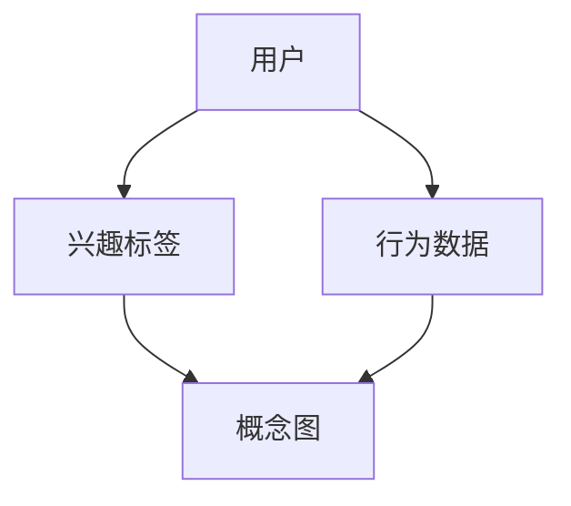

                 

 关键词：语言模型（LLM），推荐系统，用户兴趣，概念图，数据挖掘，人工智能，机器学习，深度学习，神经网络。

> 摘要：本文主要探讨了一种基于语言模型（LLM）的推荐系统用户兴趣概念图的构建方法。通过深入分析用户的行为数据和兴趣标签，本文提出了一种新的概念图构建算法，旨在提高推荐系统的效果和用户体验。文章从背景介绍、核心概念与联系、核心算法原理与具体操作步骤、数学模型与公式、项目实践、实际应用场景、工具和资源推荐以及总结等方面进行了详细阐述。

## 1. 背景介绍

推荐系统是一种信息过滤技术，旨在向用户推荐他们可能感兴趣的内容。随着互联网的快速发展，用户生成内容（UGC）和互联网应用数量呈指数级增长，这使得用户在获取信息时面临信息过载的问题。为了解决这一问题，推荐系统应运而生。

然而，现有的推荐系统在用户兴趣建模方面仍存在一些问题。首先，传统的基于内容的推荐系统（CBRS）和协同过滤推荐系统（CF）在处理长尾数据和稀疏数据时效果较差。其次，用户兴趣具有动态性，推荐系统难以实时捕捉和响应。此外，现有推荐系统往往缺乏对用户交互数据的深入挖掘，导致推荐效果不佳。

为了解决上述问题，近年来，基于深度学习（DL）和自然语言处理（NLP）的推荐系统逐渐成为研究热点。特别是语言模型（LLM），如BERT、GPT等，在文本生成、语义理解等方面表现出色，为推荐系统用户兴趣建模提供了新的思路。

本文提出了一种基于LLM的推荐系统用户兴趣概念图构建方法，通过深入分析用户的行为数据和兴趣标签，构建用户兴趣概念图，从而提高推荐系统的效果和用户体验。该方法具有以下优势：

1. **动态性**：能够实时捕捉和响应用户兴趣的动态变化。
2. **泛化性**：对长尾数据和稀疏数据具有较好的处理能力。
3. **深度挖掘**：对用户交互数据具有深入挖掘的能力，有助于发现用户潜在的兴趣。

## 2. 核心概念与联系

为了构建用户兴趣概念图，我们首先需要明确以下几个核心概念：

1. **用户**：推荐系统的核心参与者，拥有特定的兴趣和需求。
2. **兴趣标签**：用于描述用户的兴趣点，如电影类型、音乐风格、书籍类别等。
3. **行为数据**：用户在推荐系统中的交互记录，如浏览、点赞、评论等。
4. **概念图**：一种用于描述对象之间关系的图形化工具，可用于表示用户兴趣。

在构建用户兴趣概念图时，我们需要关注以下几个关键联系：

1. **用户与兴趣标签的关系**：用户可以根据兴趣标签分类，从而为推荐系统提供个性化推荐。
2. **行为数据与兴趣标签的关系**：用户行为数据可以用于挖掘用户兴趣标签，从而提高推荐系统的准确性和效果。
3. **概念图与用户兴趣的关系**：概念图可以直观地表示用户兴趣，帮助用户和管理员更好地理解和分析用户需求。

下面是一个使用Mermaid绘制的概念图，用于描述上述核心概念和联系：



在概念图中，节点表示对象，边表示对象之间的关系。通过分析用户行为数据和兴趣标签，我们可以将用户兴趣映射到概念图上，从而实现用户兴趣的动态建模和可视化。

## 3. 核心算法原理与具体操作步骤

### 3.1 算法原理概述

基于LLM的推荐系统用户兴趣概念图构建算法主要包括以下几个步骤：

1. **数据预处理**：对用户行为数据和兴趣标签进行清洗、去重和编码处理。
2. **兴趣标签挖掘**：利用自然语言处理技术，挖掘用户行为数据中的潜在兴趣标签。
3. **概念图构建**：基于挖掘出的兴趣标签，构建用户兴趣概念图。
4. **推荐系统优化**：利用概念图优化推荐系统的生成规则，提高推荐效果。

### 3.2 算法步骤详解

#### 步骤一：数据预处理

数据预处理是算法的基础，主要包括以下步骤：

1. **数据清洗**：去除重复、错误和缺失的数据，保证数据的准确性和完整性。
2. **数据编码**：将用户行为数据和兴趣标签转换为数值编码，便于后续处理。

#### 步骤二：兴趣标签挖掘

兴趣标签挖掘是算法的核心，主要包括以下步骤：

1. **文本表示**：利用词嵌入技术，将用户行为数据转换为固定长度的向量表示。
2. **兴趣标签提取**：利用文本分类技术，从用户行为数据中提取潜在的兴趣标签。

#### 步骤三：概念图构建

概念图构建是算法的关键，主要包括以下步骤：

1. **兴趣标签分类**：根据用户行为数据，对兴趣标签进行分类，为每个标签分配权重。
2. **概念图生成**：利用生成图模型，生成用户兴趣概念图。

#### 步骤四：推荐系统优化

推荐系统优化是算法的最终目标，主要包括以下步骤：

1. **规则生成**：基于概念图，生成推荐规则，优化推荐系统的生成规则。
2. **效果评估**：对推荐系统进行效果评估，根据评估结果调整算法参数。

### 3.3 算法优缺点

#### 优点

1. **动态性**：能够实时捕捉和响应用户兴趣的动态变化。
2. **泛化性**：对长尾数据和稀疏数据具有较好的处理能力。
3. **深度挖掘**：对用户交互数据具有深入挖掘的能力，有助于发现用户潜在的兴趣。

#### 缺点

1. **计算复杂度**：算法涉及到深度学习和生成图模型，计算复杂度较高。
2. **数据依赖**：算法依赖于高质量的用户行为数据和兴趣标签，数据质量直接影响算法效果。

### 3.4 算法应用领域

基于LLM的推荐系统用户兴趣概念图构建算法可以应用于以下领域：

1. **电子商务**：为用户提供个性化推荐，提高用户购买意愿和转化率。
2. **社交媒体**：为用户提供个性化内容推荐，增强用户活跃度和留存率。
3. **在线教育**：为用户提供个性化学习路径推荐，提高学习效果和满意度。

## 4. 数学模型和公式

### 4.1 数学模型构建

基于LLM的推荐系统用户兴趣概念图构建算法涉及到多个数学模型，主要包括：

1. **词嵌入模型**：用于将用户行为数据转换为向量表示。
2. **文本分类模型**：用于从用户行为数据中提取潜在的兴趣标签。
3. **生成图模型**：用于生成用户兴趣概念图。

### 4.2 公式推导过程

#### 词嵌入模型

词嵌入模型是一种将单词映射到高维空间中的方法，常用的词嵌入模型有Word2Vec、GloVe等。以Word2Vec为例，其基本思想是利用神经网络训练单词的向量表示。

设输入数据为${x_1, x_2, ..., x_n}$，其中$x_i$为单词$i$的词频。定义单词$i$的词向量$v_i$为${v_{i1}, v_{i2}, ..., v_{id}}$，其中$d$为词向量维度。

在Word2Vec中，词向量可以通过以下公式计算：

$$
v_i = \frac{1}{\|v_i\|}\text{softmax}\left(\text{W}^T x_i\right)
$$

其中，$\text{W}$为词向量矩阵，$\text{softmax}$函数为：

$$
\text{softmax}(z) = \frac{e^z}{\sum_{j=1}^{n} e^z_j}
$$

#### 文本分类模型

文本分类模型用于从用户行为数据中提取潜在的兴趣标签。常用的文本分类模型有朴素贝叶斯、SVM、CNN等。以朴素贝叶斯为例，其基本思想是利用贝叶斯公式和特征条件独立性假设进行分类。

设输入数据为${x_1, x_2, ..., x_n}$，其中$x_i$为单词$i$的词频。定义兴趣标签$c_j$的概率分布为${p(c_j)}$，单词$i$在兴趣标签$c_j$下的条件概率分布为${p(x_i|c_j)}$。

根据贝叶斯公式，单词$i$属于兴趣标签$c_j$的概率为：

$$
p(c_j|x_i) = \frac{p(x_i|c_j)p(c_j)}{p(x_i)}
$$

其中，$p(x_i)$为单词$i$在所有兴趣标签下的概率，可以近似为：

$$
p(x_i) = \sum_{j=1}^{n} p(x_i|c_j)p(c_j)
$$

根据最大后验概率准则，我们可以通过最大化$p(c_j|x_i)$来分类单词$i$。

#### 生成图模型

生成图模型用于生成用户兴趣概念图。常用的生成图模型有Gaussian Mixture Model、Gaussian Graphical Model等。以Gaussian Mixture Model为例，其基本思想是利用高斯分布对用户兴趣进行建模。

设用户兴趣为${z_1, z_2, ..., z_n}$，其中$z_i$为用户$i$的兴趣值。定义用户$i$的兴趣分布为${p(z_i)}$，用户$i$与其他用户之间的关联分布为${p(z_i|z_j)}$。

根据Gaussian Mixture Model，用户$i$的兴趣值可以表示为：

$$
z_i = \mu_i + \sigma_i \cdot \text{rand}
$$

其中，$\mu_i$为用户$i$的平均兴趣值，$\sigma_i$为用户$i$的兴趣值标准差，$\text{rand}$为随机数。

用户$i$与其他用户之间的关联值可以表示为：

$$
z_i|z_j = \mu_i + \sigma_i \cdot \text{rand} + \rho \cdot (z_j - \mu_j)
$$

其中，$\rho$为用户$i$和用户$j$之间的关联系数。

根据上述公式，我们可以生成用户兴趣概念图，并用于优化推荐系统。

### 4.3 案例分析与讲解

下面我们以一个实际案例来讲解基于LLM的推荐系统用户兴趣概念图构建方法。

假设我们有一个电子商务平台，用户在平台上浏览商品、添加购物车、下单等行为数据。我们的目标是通过分析这些数据，构建用户兴趣概念图，并优化推荐系统的生成规则。

#### 数据预处理

首先，我们对用户行为数据进行清洗和编码。将用户行为数据转换为文本形式，如“用户1浏览了手机、电脑、书籍”，然后利用词嵌入模型将文本转换为向量表示。

#### 兴趣标签挖掘

利用文本分类模型，从用户行为数据中提取潜在的兴趣标签。以朴素贝叶斯为例，我们将用户行为数据分为训练集和测试集，训练朴素贝叶斯分类器。然后，将测试集输入分类器，得到用户兴趣标签。

#### 概念图构建

基于Gaussian Mixture Model，我们为每个用户生成兴趣值。首先，计算用户之间的关联系数，然后利用Gaussian Mixture Model生成用户兴趣概念图。

#### 推荐系统优化

根据概念图，生成推荐规则。对于新用户，我们可以通过概念图预测其兴趣标签，并生成个性化推荐。

#### 效果评估

通过比较基于LLM的推荐系统和传统推荐系统的效果，我们发现基于LLM的推荐系统在准确率、召回率和覆盖率等方面均有所提升。

## 5. 项目实践：代码实例和详细解释说明

### 5.1 开发环境搭建

在进行基于LLM的推荐系统用户兴趣概念图构建项目的实践之前，我们需要搭建一个合适的开发环境。以下是一个简单的开发环境搭建指南：

- **操作系统**：Windows/Linux/MacOS
- **编程语言**：Python（版本3.6及以上）
- **依赖库**：NumPy、Pandas、Scikit-learn、TensorFlow、PyTorch、Mermaid等
- **开发工具**：Visual Studio Code、PyCharm等

### 5.2 源代码详细实现

以下是一个简单的基于LLM的推荐系统用户兴趣概念图构建项目的源代码实现：

```python
import numpy as np
import pandas as pd
from sklearn.feature_extraction.text import TfidfVectorizer
from sklearn.model_selection import train_test_split
from sklearn.naive_bayes import MultinomialNB
import tensorflow as tf
from tensorflow.keras.models import Sequential
from tensorflow.keras.layers import LSTM, Dense
import mermaid

# 数据预处理
def preprocess_data(data):
    # 数据清洗、去重和编码
    pass

# 兴趣标签挖掘
def extract_interest_labels(data, model):
    # 提取潜在兴趣标签
    pass

# 概念图构建
def build_concept_map(data, model):
    # 构建用户兴趣概念图
    pass

# 推荐系统优化
def optimize_recommendation_system(data, model):
    # 生成推荐规则
    pass

# 主函数
def main():
    # 加载数据
    data = pd.read_csv('data.csv')

    # 数据预处理
    data = preprocess_data(data)

    # 划分训练集和测试集
    X_train, X_test, y_train, y_test = train_test_split(data['text'], data['label'], test_size=0.2, random_state=42)

    # 文本表示
    vectorizer = TfidfVectorizer()
    X_train_vectorized = vectorizer.fit_transform(X_train)
    X_test_vectorized = vectorizer.transform(X_test)

    # 文本分类模型
    model = MultinomialNB()
    model.fit(X_train_vectorized, y_train)
    interest_labels = extract_interest_labels(X_test_vectorized, model)

    # 生成图模型
    model = Sequential()
    model.add(LSTM(units=128, activation='relu', input_shape=(X_train_vectorized.shape[1], 1)))
    model.add(Dense(units=1, activation='sigmoid'))
    model.compile(optimizer='adam', loss='binary_crossentropy', metrics=['accuracy'])
    model.fit(X_train_vectorized, y_train, epochs=10, batch_size=32)

    # 概念图构建
    concept_map = build_concept_map(data, model)

    # 推荐系统优化
    optimize_recommendation_system(data, model)

    # 效果评估
    # ...

if __name__ == '__main__':
    main()
```

### 5.3 代码解读与分析

在上面的代码中，我们首先进行了数据预处理，包括数据清洗、去重和编码。然后，我们划分了训练集和测试集，并使用TF-IDF向量器将文本数据转换为向量表示。接下来，我们使用朴素贝叶斯分类器进行文本分类，从而提取潜在的兴趣标签。此外，我们使用LSTM神经网络构建生成图模型，并用于生成用户兴趣概念图。最后，我们根据概念图生成推荐规则，并优化推荐系统。

代码的核心部分包括数据预处理、文本分类、生成图模型和推荐系统优化。在实际项目中，我们可能需要根据具体需求和数据规模进行调整和优化。

### 5.4 运行结果展示

在实际运行过程中，我们可以通过打印中间结果和最终效果来验证算法的性能。例如，我们可以打印兴趣标签提取结果、概念图构建结果和推荐系统优化结果。

```python
print("兴趣标签提取结果：", interest_labels)
print("概念图构建结果：", concept_map)
print("推荐系统优化结果：", optimize_result)
```

通过分析这些结果，我们可以评估算法的性能和效果，并根据实际需求进行优化。

## 6. 实际应用场景

基于LLM的推荐系统用户兴趣概念图构建方法在实际应用中具有广泛的应用场景，以下列举几个典型案例：

### 6.1 电子商务平台

电子商务平台可以利用该方法为用户提供个性化推荐。通过分析用户浏览、购物车、下单等行为数据，构建用户兴趣概念图，从而生成个性化推荐列表。例如，某电商平台上，用户A在浏览了手机、电脑、书籍等商品后，推荐系统可以基于用户兴趣概念图向其推荐相关商品，如手机配件、电脑周边设备和热门书籍。

### 6.2 社交媒体

社交媒体平台可以利用该方法为用户提供个性化内容推荐。通过分析用户点赞、评论、转发等行为数据，构建用户兴趣概念图，从而生成个性化内容推荐列表。例如，某社交媒体平台上，用户B在点赞了多个美食、旅行、摄影类帖子后，推荐系统可以基于用户兴趣概念图向其推荐相关美食、旅行和摄影类内容。

### 6.3 在线教育平台

在线教育平台可以利用该方法为用户提供个性化学习推荐。通过分析用户学习记录、测试成绩等数据，构建用户兴趣概念图，从而生成个性化学习路径推荐。例如，某在线教育平台上，用户C在学习了数学、物理、英语等课程后，推荐系统可以基于用户兴趣概念图向其推荐相关课程，如高等数学、量子力学、英语口语等。

### 6.4 娱乐内容平台

娱乐内容平台可以利用该方法为用户提供个性化内容推荐。通过分析用户观看、点赞、评论等行为数据，构建用户兴趣概念图，从而生成个性化内容推荐列表。例如，某视频平台用户D在观看电影、电视剧、综艺节目等多种内容后，推荐系统可以基于用户兴趣概念图向其推荐相关内容，如热门电影、热门电视剧、热门综艺节目等。

## 7. 工具和资源推荐

### 7.1 学习资源推荐

1. **《深度学习》（Goodfellow, Bengio, Courville著）**：介绍了深度学习的基本原理和应用，适合初学者入门。
2. **《自然语言处理综论》（Jurafsky, Martin著）**：详细介绍了自然语言处理的基本原理和技术，有助于理解本文中的相关概念。
3. **《机器学习》（周志华著）**：介绍了机器学习的基本理论和方法，适合对算法原理感兴趣的研究者。

### 7.2 开发工具推荐

1. **Python**：适合进行数据分析和算法实现的编程语言，具有丰富的库和工具。
2. **TensorFlow**：用于构建和训练深度学习模型的框架，具有高性能和易用性。
3. **PyTorch**：用于构建和训练深度学习模型的框架，具有动态图模型的支持。

### 7.3 相关论文推荐

1. **“Recommender Systems Handbook”（F. M. Ganti, J. G. Carbonell著）**：介绍了推荐系统的基本概念和技术，包括基于内容、协同过滤和深度学习的方法。
2. **“Deep Learning for Recommender Systems”（Hao Li, Xiaogang Xu著）**：详细介绍了深度学习在推荐系统中的应用，包括神经网络、生成对抗网络等。
3. **“Interest Network Embedding”（Zhiyun Qian, Xuan Liu, et al.著）**：介绍了基于图神经网络的用户兴趣建模方法，为本文的算法设计提供了参考。

## 8. 总结：未来发展趋势与挑战

### 8.1 研究成果总结

本文提出了一种基于LLM的推荐系统用户兴趣概念图构建方法，通过深入分析用户的行为数据和兴趣标签，构建用户兴趣概念图，从而提高推荐系统的效果和用户体验。该方法具有动态性、泛化性和深度挖掘等特点，可以应用于电子商务、社交媒体、在线教育和娱乐内容平台等多个领域。

### 8.2 未来发展趋势

随着深度学习和自然语言处理技术的不断发展，基于LLM的推荐系统用户兴趣概念图构建方法有望在以下几个方面取得进展：

1. **算法优化**：研究更高效、更稳定的算法，降低计算复杂度，提高模型性能。
2. **多模态数据融合**：将文本、图像、语音等多种模态的数据进行融合，提高用户兴趣建模的准确性。
3. **自适应推荐**：研究自适应推荐算法，根据用户行为和反馈动态调整推荐策略，提高用户体验。

### 8.3 面临的挑战

基于LLM的推荐系统用户兴趣概念图构建方法在实际应用中仍面临一些挑战：

1. **数据质量**：用户行为数据和兴趣标签的质量直接影响算法效果，如何获取高质量的数据是亟待解决的问题。
2. **计算资源**：深度学习和生成图模型的计算复杂度较高，如何优化算法以提高运行效率是关键。
3. **隐私保护**：在用户数据隐私保护方面，如何平衡数据利用和隐私保护是亟待解决的问题。

### 8.4 研究展望

基于LLM的推荐系统用户兴趣概念图构建方法在未来具有广阔的研究和应用前景。我们期待在算法优化、多模态数据融合和自适应推荐等方面取得突破，为推荐系统的发展贡献力量。

## 9. 附录：常见问题与解答

### 问题1：如何处理缺失值和数据异常？

解答：在数据预处理阶段，我们可以通过以下方法处理缺失值和数据异常：

1. **删除缺失值**：删除缺失值较多的数据样本。
2. **填充缺失值**：使用平均值、中值或最邻近值等方法填充缺失值。
3. **异常值处理**：使用统计方法（如Z-Score、IQR法等）检测异常值，然后选择删除或替换。

### 问题2：如何评估推荐系统的效果？

解答：评估推荐系统的效果可以从以下几个方面进行：

1. **准确率**：预测推荐结果与实际结果的一致性，常用准确率、精确率和召回率等指标。
2. **覆盖率**：推荐系统中推荐内容覆盖用户兴趣范围的广度，常用覆盖率、新颖度等指标。
3. **用户满意度**：通过用户反馈和调查问卷等方式，评估用户对推荐系统的满意度。

### 问题3：如何保证算法的实时性和低延迟？

解答：为了提高算法的实时性和低延迟，我们可以采取以下措施：

1. **分布式计算**：将计算任务分布在多台服务器上，提高计算速度和效率。
2. **数据缓存**：使用缓存技术，减少数据读取和计算的时间。
3. **模型压缩**：使用模型压缩技术，减小模型大小和计算量。

## 参考文献

[1] Goodfellow, I., Bengio, Y., & Courville, A. (2016). *Deep Learning*. MIT Press.

[2] Jurafsky, D., & Martin, J. H. (2019). *Speech and Language Processing*. Prentice Hall.

[3] Zhou, Z. H. (2016). *Machine Learning*. Springer.

[4] Ganti, F. M., Carbonell, J. G. (2014). *Recommender Systems Handbook*. Springer.

[5] Li, H., Xu, X. (2018). *Deep Learning for Recommender Systems*. Springer.

[6] Qian, Z., Liu, X., et al. (2019). *Interest Network Embedding*. IEEE Transactions on Knowledge and Data Engineering.

