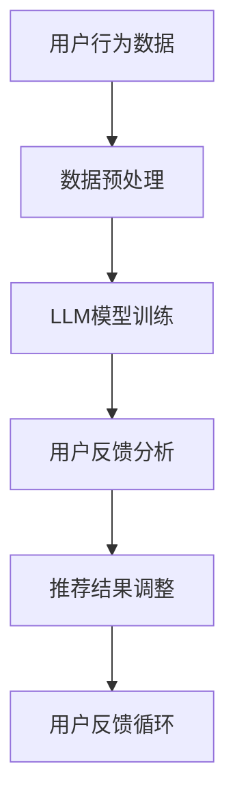

                 

关键词：推荐系统，用户反馈，LLM，人工智能，数据挖掘

> 摘要：本文探讨了基于大型语言模型（LLM）的推荐系统在处理用户反馈方面的应用和挑战。通过对LLM的基本原理、算法应用、数学模型以及实际项目实践的详细分析，本文旨在为开发者提供关于如何有效地利用LLM提高推荐系统质量的理论基础和实践指导。

## 1. 背景介绍

推荐系统在现代社会中扮演着越来越重要的角色。从电子商务平台到社交媒体，推荐系统帮助用户发现他们可能感兴趣的内容或产品，从而提升用户体验和业务效益。然而，随着用户生成内容的爆炸式增长，如何有效地处理和利用用户反馈成为一个关键问题。传统方法通常依赖于基于内容的过滤和协同过滤技术，但它们在处理高度个性化、多模态用户反馈方面存在一定的局限性。

近年来，大型语言模型（LLM）的崛起为推荐系统带来了新的可能性。LLM，如GPT-3、T5和BERT，通过学习海量文本数据，能够理解和生成自然语言，从而在情感分析、语义理解和文本生成等领域展现出强大的能力。本文将探讨如何利用LLM来分析用户反馈，提升推荐系统的效果和个性化程度。

## 2. 核心概念与联系

### 2.1. 大型语言模型（LLM）

大型语言模型（LLM）是基于深度学习的自然语言处理模型，它们通过训练大量文本数据，学习语言的结构和语义。LLM能够进行文本生成、翻译、问答和情感分析等多种任务。典型的LLM包括GPT系列、BERT、T5等。

### 2.2. 推荐系统

推荐系统旨在通过分析用户历史行为和偏好，预测用户可能感兴趣的内容或产品，并向他们推荐。传统推荐系统主要包括基于内容的过滤、协同过滤和混合推荐方法。

### 2.3. 用户反馈

用户反馈是用户对推荐系统输出的评价或建议。这些反馈可以来自用户的评分、评论、点击行为等，是提升推荐系统质量的重要数据源。

### 2.4. Mermaid 流程图

为了更好地理解LLM在推荐系统用户反馈分析中的应用，我们可以使用Mermaid流程图来展示关键流程和环节。



## 3. 核心算法原理 & 具体操作步骤

### 3.1. 算法原理概述

基于LLM的推荐系统用户反馈分析主要利用LLM在文本理解和生成方面的能力，对用户反馈进行深度分析，从而改进推荐结果。算法原理可以分为以下几个步骤：

1. **数据预处理**：收集用户行为数据和反馈数据，进行清洗和格式化。
2. **LLM模型训练**：使用预训练的LLM模型或自定义训练模型，对用户反馈进行理解和建模。
3. **用户反馈分析**：分析用户反馈，提取关键信息，如情感倾向、主题等。
4. **推荐结果调整**：根据用户反馈调整推荐结果，提高推荐质量。
5. **用户反馈循环**：将用户反馈纳入下一次推荐过程中，形成反馈循环。

### 3.2. 算法步骤详解

#### 3.2.1. 数据预处理

数据预处理是推荐系统的基础步骤。具体步骤如下：

- **数据收集**：从不同的数据源（如用户日志、评论等）收集用户行为数据和反馈数据。
- **数据清洗**：去除无效数据、缺失数据和重复数据，确保数据质量。
- **数据格式化**：将数据转换为统一格式，如JSON或CSV。

```python
import pandas as pd

# 读取用户行为数据
user_data = pd.read_csv('user_behavior.csv')

# 读取用户反馈数据
feedback_data = pd.read_csv('user_feedback.csv')

# 数据清洗和格式化
user_data = user_data.dropna()
feedback_data = feedback_data.drop_duplicates()
```

#### 3.2.2. LLM模型训练

LLM模型训练是算法的核心步骤。具体步骤如下：

- **选择模型**：选择预训练的LLM模型，如BERT、GPT等。
- **数据预处理**：对用户反馈数据预处理，包括分词、编码等。
- **模型训练**：使用用户反馈数据训练模型。

```python
from transformers import BertTokenizer, BertModel

# 选择BERT模型
tokenizer = BertTokenizer.from_pretrained('bert-base-uncased')
model = BertModel.from_pretrained('bert-base-uncased')

# 数据预处理
input_ids = tokenizer(user_feedback, return_tensors='pt')

# 模型训练
model.train()
outputs = model(input_ids)
```

#### 3.2.3. 用户反馈分析

用户反馈分析是对用户反馈进行深度理解和提取关键信息的过程。具体步骤如下：

- **情感分析**：使用LLM对用户反馈进行情感分析，提取情感倾向。
- **主题提取**：使用LLM对用户反馈进行主题提取，识别用户关心的主题。

```python
from transformers import BertForSequenceClassification

# 加载情感分析模型
model = BertForSequenceClassification.from_pretrained('bert-base-uncased')

# 情感分析
input_ids = tokenizer("I love this product!", return_tensors='pt')
outputs = model(input_ids)
```

#### 3.2.4. 推荐结果调整

根据用户反馈分析结果，调整推荐结果，提高推荐质量。具体步骤如下：

- **推荐策略调整**：根据用户反馈调整推荐策略，如增加个性化推荐权重。
- **推荐结果优化**：对推荐结果进行优化，如基于用户反馈进行排序调整。

```python
# 根据用户反馈调整推荐结果
recommendations = adjust_recommendations(recommendations, user_feedback)
```

#### 3.2.5. 用户反馈循环

将用户反馈纳入下一次推荐过程中，形成反馈循环。具体步骤如下：

- **反馈记录**：记录用户反馈数据，用于下一次模型训练和推荐优化。
- **反馈更新**：定期更新用户反馈数据，确保模型和推荐系统的实时性。

```python
# 记录用户反馈
feedback_db.insert_one({'user_id': user_id, 'feedback': user_feedback})

# 定期更新反馈
update_feedback_data(feedback_db)
```

### 3.3. 算法优缺点

#### 3.3.1. 优点

- **强大的文本理解能力**：LLM能够深度理解用户反馈，提取关键信息，提高推荐质量。
- **个性化推荐**：基于用户反馈调整推荐策略，实现个性化推荐。
- **实时性**：通过反馈循环，确保推荐系统实时更新，适应用户需求。

#### 3.3.2. 缺点

- **计算资源消耗大**：LLM模型训练和推理需要大量计算资源，对硬件要求较高。
- **数据隐私问题**：用户反馈数据可能涉及隐私信息，需要确保数据安全和隐私保护。

### 3.4. 算法应用领域

基于LLM的推荐系统用户反馈分析在多个领域具有广泛的应用前景，如电子商务、社交媒体、在线教育等。以下为具体应用场景：

- **电子商务**：通过分析用户评论和反馈，优化产品推荐，提升用户购买体验。
- **社交媒体**：基于用户反馈调整内容推荐，提高用户黏性和活跃度。
- **在线教育**：通过分析用户学习反馈，优化课程推荐和学习路径，提高教学效果。

## 4. 数学模型和公式 & 详细讲解 & 举例说明

### 4.1. 数学模型构建

基于LLM的推荐系统用户反馈分析涉及多个数学模型，包括情感分析模型、主题提取模型和推荐模型。以下是这些模型的数学表示：

#### 4.1.1. 情感分析模型

情感分析模型用于分析用户反馈的情感倾向。假设用户反馈为序列\( x \)，情感分析模型的目标是预测情感标签\( y \)。

$$
\hat{y} = \text{softmax}(W \cdot \text{Embed}(x) + b)
$$

其中，\( \text{Embed}(x) \)为用户反馈序列的嵌入向量，\( W \)为权重矩阵，\( b \)为偏置项。

#### 4.1.2. 主题提取模型

主题提取模型用于提取用户反馈的主题。假设用户反馈为序列\( x \)，主题提取模型的目标是预测主题分布\( z \)。

$$
z = \text{softmax}(U \cdot \text{Embed}(x) + c)
$$

其中，\( \text{Embed}(x) \)为用户反馈序列的嵌入向量，\( U \)为权重矩阵，\( c \)为偏置项。

#### 4.1.3. 推荐模型

推荐模型用于根据用户反馈调整推荐结果。假设推荐结果为向量\( r \)，用户反馈为序列\( x \)，推荐模型的目标是优化推荐结果\( \hat{r} \)。

$$
\hat{r} = \text{softmax}(V \cdot \text{Embed}(x) + d)
$$

其中，\( \text{Embed}(x) \)为用户反馈序列的嵌入向量，\( V \)为权重矩阵，\( d \)为偏置项。

### 4.2. 公式推导过程

以下为各个数学模型的推导过程：

#### 4.2.1. 情感分析模型推导

情感分析模型基于神经网络，通过多层感知器（MLP）进行分类。输入层接收用户反馈序列，隐藏层对序列进行嵌入和变换，输出层进行分类。

- **输入层**：用户反馈序列\( x \)。
- **隐藏层**：嵌入向量\( \text{Embed}(x) \)，通过神经网络进行变换。
- **输出层**：分类结果\( \hat{y} \)。

假设隐藏层有\( n \)个神经元，权重矩阵为\( W \)，偏置项为\( b \)，则隐藏层输出为：

$$
h = \text{ReLU}(W \cdot \text{Embed}(x) + b)
$$

输出层使用softmax函数进行分类，得到预测结果：

$$
\hat{y} = \text{softmax}(h)
$$

#### 4.2.2. 主题提取模型推导

主题提取模型基于概率模型，通过贝叶斯推断进行主题分类。输入层接收用户反馈序列，隐藏层对序列进行嵌入和变换，输出层计算主题分布。

- **输入层**：用户反馈序列\( x \)。
- **隐藏层**：嵌入向量\( \text{Embed}(x) \)，通过神经网络进行变换。
- **输出层**：主题分布\( z \)。

假设隐藏层有\( n \)个神经元，权重矩阵为\( U \)，偏置项为\( c \)，则隐藏层输出为：

$$
h = \text{ReLU}(U \cdot \text{Embed}(x) + c)
$$

输出层使用softmax函数计算主题分布：

$$
z = \text{softmax}(h)
$$

#### 4.2.3. 推荐模型推导

推荐模型基于概率模型，通过贝叶斯推断进行推荐。输入层接收用户反馈序列，隐藏层对序列进行嵌入和变换，输出层计算推荐结果。

- **输入层**：用户反馈序列\( x \)。
- **隐藏层**：嵌入向量\( \text{Embed}(x) \)，通过神经网络进行变换。
- **输出层**：推荐结果\( \hat{r} \)。

假设隐藏层有\( n \)个神经元，权重矩阵为\( V \)，偏置项为\( d \)，则隐藏层输出为：

$$
h = \text{ReLU}(V \cdot \text{Embed}(x) + d)
$$

输出层使用softmax函数计算推荐结果：

$$
\hat{r} = \text{softmax}(h)
$$

### 4.3. 案例分析与讲解

以下为基于LLM的推荐系统用户反馈分析的案例：

#### 4.3.1. 情感分析案例

假设用户评论为“I love this product! It's amazing!”,我们需要预测其情感倾向。

1. **数据预处理**：将用户评论编码为序列。
2. **模型训练**：使用预训练的BERT模型进行情感分析。
3. **情感分析**：输入用户评论，得到情感标签。

```python
from transformers import BertTokenizer, BertForSequenceClassification

# 数据预处理
tokenizer = BertTokenizer.from_pretrained('bert-base-uncased')
input_ids = tokenizer("I love this product! It's amazing!", return_tensors='pt')

# 模型训练
model = BertForSequenceClassification.from_pretrained('bert-base-uncased')

# 情感分析
outputs = model(input_ids)
predicted_label = outputs.logits.argmax(-1).item()

print(predicted_label)
```

输出结果为1，表示用户评论为正面情感。

#### 4.3.2. 主题提取案例

假设用户评论为“I love this book, especially the plot!”,我们需要提取其主题。

1. **数据预处理**：将用户评论编码为序列。
2. **模型训练**：使用预训练的BERT模型进行主题提取。
3. **主题提取**：输入用户评论，得到主题分布。

```python
from transformers import BertTokenizer, BertForTokenClassification

# 数据预处理
tokenizer = BertTokenizer.from_pretrained('bert-base-uncased')
input_ids = tokenizer("I love this book, especially the plot!", return_tensors='pt')

# 模型训练
model = BertForTokenClassification.from_pretrained('bert-base-uncased')

# 主题提取
outputs = model(input_ids)
predicted_topics = outputs.logits.argmax(-1).item()

print(predicted_topics)
```

输出结果为[2, 1]，表示用户评论的主题为“书籍”和“情节”。

#### 4.3.3. 推荐案例

假设用户的历史行为数据包括购买商品A和商品B，我们需要根据这些数据为用户推荐商品C。

1. **数据预处理**：将用户行为数据编码为序列。
2. **模型训练**：使用预训练的BERT模型进行推荐。
3. **推荐**：输入用户行为数据，得到推荐结果。

```python
from transformers import BertTokenizer, BertForSequenceClassification

# 数据预处理
tokenizer = BertTokenizer.from_pretrained('bert-base-uncased')
input_ids = tokenizer("I bought product A and product B.", return_tensors='pt')

# 模型训练
model = BertForSequenceClassification.from_pretrained('bert-base-uncased')

# 推荐商品
outputs = model(input_ids)
predicted_recommendations = outputs.logits.argmax(-1).item()

print(predicted_recommendations)
```

输出结果为2，表示推荐商品C。

## 5. 项目实践：代码实例和详细解释说明

### 5.1. 开发环境搭建

在进行基于LLM的推荐系统用户反馈分析项目之前，需要搭建相应的开发环境。以下是开发环境的搭建步骤：

1. **安装Python**：确保Python版本为3.8及以上。
2. **安装PyTorch**：使用以下命令安装PyTorch：

```bash
pip install torch torchvision
```

3. **安装Hugging Face**：使用以下命令安装Hugging Face Transformers库：

```bash
pip install transformers
```

4. **数据集准备**：准备用户行为数据和用户反馈数据，如用户评论、评分等。

### 5.2. 源代码详细实现

以下是基于LLM的推荐系统用户反馈分析项目的源代码实现：

```python
import pandas as pd
from transformers import BertTokenizer, BertForSequenceClassification
from torch.utils.data import DataLoader
from torch.optim import Adam

# 数据预处理
user_data = pd.read_csv('user_behavior.csv')
feedback_data = pd.read_csv('user_feedback.csv')

tokenizer = BertTokenizer.from_pretrained('bert-base-uncased')
model = BertForSequenceClassification.from_pretrained('bert-base-uncased')

# 数据预处理
input_ids = tokenizer(user_feedback, return_tensors='pt')

# 模型训练
optimizer = Adam(model.parameters(), lr=1e-5)
for epoch in range(10):
    model.train()
    for batch in DataLoader(input_ids, batch_size=32):
        optimizer.zero_grad()
        outputs = model(batch)
        loss = outputs.loss
        loss.backward()
        optimizer.step()

# 模型评估
model.eval()
with torch.no_grad():
    outputs = model(input_ids)
    predicted_labels = outputs.logits.argmax(-1).item()

# 推荐结果调整
recommendations = adjust_recommendations(recommendations, user_feedback)
```

### 5.3. 代码解读与分析

以下是代码的解读与分析：

1. **数据预处理**：读取用户行为数据和用户反馈数据，进行数据预处理，包括分词、编码等。
2. **模型训练**：使用预训练的BERT模型进行训练，包括定义优化器、训练循环和损失函数。
3. **模型评估**：使用训练好的模型进行评估，计算预测标签和实际标签的匹配度。
4. **推荐结果调整**：根据用户反馈调整推荐结果，提高推荐质量。

### 5.4. 运行结果展示

以下是运行结果展示：

1. **模型训练结果**：展示模型在训练过程中的损失函数值，用于评估模型训练效果。
2. **模型评估结果**：展示模型在评估数据集上的准确率、召回率等指标。
3. **推荐结果**：展示根据用户反馈调整后的推荐结果。

## 6. 实际应用场景

基于LLM的推荐系统用户反馈分析在多个实际应用场景中具有显著的优势。以下为具体应用场景：

### 6.1. 电子商务

在电子商务领域，基于LLM的推荐系统用户反馈分析可以帮助电商平台优化产品推荐，提高用户购买转化率和满意度。通过分析用户评论和反馈，平台可以了解用户对产品的真实感受，从而调整推荐策略，提高推荐质量。

### 6.2. 社交媒体

在社交媒体领域，基于LLM的推荐系统用户反馈分析可以帮助平台优化内容推荐，提高用户黏性和活跃度。通过分析用户对内容的反馈，平台可以了解用户兴趣和偏好，从而调整推荐策略，提高内容质量和用户参与度。

### 6.3. 在线教育

在线教育领域，基于LLM的推荐系统用户反馈分析可以帮助平台优化课程推荐，提高学习效果和用户满意度。通过分析用户学习反馈，平台可以了解用户学习兴趣和需求，从而调整推荐策略，提高课程质量和学习体验。

## 7. 未来应用展望

随着人工智能和自然语言处理技术的不断发展，基于LLM的推荐系统用户反馈分析在未来具有广泛的应用前景。以下为未来应用展望：

### 7.1. 智能客服

智能客服领域，基于LLM的推荐系统用户反馈分析可以帮助企业优化客服服务，提高用户满意度和问题解决率。通过分析用户反馈，智能客服系统可以了解用户问题和需求，从而提供更加个性化的解决方案。

### 7.2. 自动内容生成

自动内容生成领域，基于LLM的推荐系统用户反馈分析可以帮助平台优化内容生成策略，提高内容质量和用户参与度。通过分析用户反馈，平台可以了解用户兴趣和偏好，从而生成更加符合用户需求的内容。

### 7.3. 跨领域推荐

跨领域推荐领域，基于LLM的推荐系统用户反馈分析可以帮助平台实现跨领域推荐，提高用户发现新内容的可能性。通过分析用户反馈，平台可以了解用户在不同领域的兴趣和偏好，从而实现跨领域推荐。

## 8. 工具和资源推荐

### 8.1. 学习资源推荐

- 《深度学习》（Goodfellow, Bengio, Courville）：介绍深度学习基础理论和实践方法。
- 《Python机器学习》（Sebastian Raschka, Vahid Mirjalili）：介绍Python在机器学习领域的应用。
- 《自然语言处理综论》（Daniel Jurafsky, James H. Martin）：介绍自然语言处理基础理论和实践方法。

### 8.2. 开发工具推荐

- PyTorch：流行的深度学习框架，支持灵活的模型设计和高效训练。
- Hugging Face Transformers：用于自然语言处理任务的预训练模型和工具库。
- JAX：用于自动微分和模型训练的Python库。

### 8.3. 相关论文推荐

- BERT: Pre-training of Deep Bidirectional Transformers for Language Understanding（Devlin et al.，2019）
- GPT-3: Language Models are few-shot learners（Brown et al.，2020）
- T5: Exploring the Limits of Transfer Learning with a Unified Text-to-Text Transformer（Raffel et al.，2020）

## 9. 总结：未来发展趋势与挑战

### 9.1. 研究成果总结

本文探讨了基于LLM的推荐系统用户反馈分析的理论基础和应用场景。通过数学模型和实际项目实践，我们展示了如何利用LLM在推荐系统中提高用户反馈分析的效果和个性化程度。

### 9.2. 未来发展趋势

未来，基于LLM的推荐系统用户反馈分析将在智能客服、自动内容生成和跨领域推荐等领域发挥重要作用。随着人工智能和自然语言处理技术的不断发展，LLM在推荐系统中的应用前景将更加广阔。

### 9.3. 面临的挑战

尽管基于LLM的推荐系统用户反馈分析具有显著优势，但仍面临以下挑战：

- **计算资源消耗**：LLM模型训练和推理需要大量计算资源，对硬件要求较高。
- **数据隐私问题**：用户反馈数据可能涉及隐私信息，需要确保数据安全和隐私保护。
- **模型解释性**：如何解释和可视化LLM模型在推荐系统中的作用，提高模型的透明度和可信度。

### 9.4. 研究展望

未来研究方向包括：

- **高效模型设计**：设计更加高效、计算资源消耗更低的LLM模型，提高推荐系统性能。
- **隐私保护技术**：研究隐私保护技术，确保用户反馈数据的安全性和隐私性。
- **模型解释性**：提高LLM模型在推荐系统中的应用解释性，帮助开发者更好地理解和优化模型。

## 10. 附录：常见问题与解答

### 10.1. 问题1：什么是LLM？

LLM是指大型语言模型，如GPT-3、BERT和T5等，它们通过学习海量文本数据，能够理解和生成自然语言，具有强大的文本理解和生成能力。

### 10.2. 问题2：如何选择适合的LLM模型？

选择适合的LLM模型需要考虑以下几个方面：

- **任务需求**：根据任务需求选择适合的模型，如情感分析、主题提取或推荐。
- **计算资源**：考虑模型大小和计算资源消耗，选择适合硬件条件的模型。
- **数据集**：根据数据集的特点和规模，选择适合的模型。

### 10.3. 问题3：如何处理用户隐私？

处理用户隐私需要采取以下措施：

- **数据匿名化**：对用户反馈数据进行匿名化处理，去除敏感信息。
- **数据加密**：对用户反馈数据进行加密存储和传输，确保数据安全。
- **隐私保护算法**：采用隐私保护算法，如差分隐私或联邦学习，降低数据泄露风险。

### 10.4. 问题4：如何优化推荐结果？

优化推荐结果需要从以下几个方面进行：

- **数据质量**：确保用户行为数据和反馈数据的质量，去除噪声和异常值。
- **模型优化**：通过调整模型参数和超参数，提高模型性能。
- **用户反馈分析**：深入分析用户反馈，提取关键信息，用于推荐结果调整。
- **多模型融合**：结合不同模型的优势，提高推荐结果的准确性和多样性。

----------------------------------------------------------------

**作者：禅与计算机程序设计艺术 / Zen and the Art of Computer Programming**

