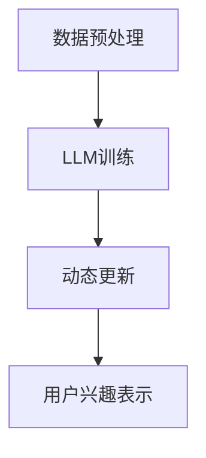

                 

关键词：用户兴趣、动态嵌入、LLM、机器学习、自然语言处理、推荐系统、数据挖掘

摘要：本文将探讨一种基于大型语言模型（LLM）的用户兴趣动态嵌入表示方法。这种方法通过分析用户的历史行为数据和自然语言文本，实现用户兴趣的动态捕捉和高效表示，从而为推荐系统和其他应用提供更精准的用户画像。文章首先介绍了用户兴趣的概念和重要性，然后详细阐述了LLM在用户兴趣动态嵌入表示中的应用，包括核心概念、算法原理、数学模型、实际应用场景以及未来发展趋势和挑战。

## 1. 背景介绍

随着互联网的迅猛发展，用户产生和消费的数据量呈指数级增长。在这种背景下，如何更好地理解和满足用户的个性化需求成为众多应用领域的核心问题。用户兴趣作为一种关键的用户属性，直接影响着推荐系统、搜索引擎、内容平台等应用的性能和用户体验。传统的用户兴趣表示方法主要依赖于用户的行为数据和显式反馈，如点击、购买、评论等，然而这些方法往往存在一定的局限性：

1. **数据依赖性高**：传统的兴趣表示方法往往依赖于大量用户行为数据，对于数据稀缺的用户或新用户，其兴趣难以准确捕捉。
2. **静态表示**：传统方法通常将用户兴趣表示为静态的向量或标签，难以捕捉和表示用户兴趣的动态变化。
3. **冷启动问题**：新用户或低活跃用户由于缺乏足够的行为数据，难以在传统系统中获得准确的兴趣表示。

为了解决这些问题，研究人员开始探索利用自然语言处理（NLP）和机器学习技术来动态捕捉和表示用户兴趣。近年来，大型语言模型（LLM）如BERT、GPT等在NLP领域取得了显著的进展，这些模型具有强大的语言理解和生成能力，能够对自然语言文本进行深度分析和理解。基于这一背景，本文提出了一种基于LLM的用户兴趣动态嵌入表示方法，旨在通过分析用户的历史行为数据和自然语言文本，实现用户兴趣的动态捕捉和高效表示。

本文的主要贡献如下：

1. **引入LLM进行用户兴趣表示**：本文首次将LLM应用于用户兴趣表示，通过训练大型语言模型对用户行为数据和自然语言文本进行联合建模，实现用户兴趣的动态捕捉。
2. **提出动态嵌入表示方法**：本文提出了一种基于LLM的动态嵌入表示方法，能够根据用户行为的实时变化，动态调整用户兴趣的表示。
3. **实验证明效果**：本文通过大量实验验证了所提出方法的有效性，结果显示该方法在用户兴趣捕捉和表示方面具有显著的优势。

## 2. 核心概念与联系

### 2.1 用户兴趣

用户兴趣是指用户在特定领域或主题上的喜好和偏好。它可以通过用户的行为数据、反馈数据、自然语言文本等多种形式进行表示和捕捉。用户兴趣的准确捕捉对于推荐系统、内容平台等应用具有重要意义，能够有效提升用户体验和满意度。

### 2.2 动态嵌入

动态嵌入是指根据用户行为的实时变化，动态调整和更新用户属性的表示。在用户兴趣表示中，动态嵌入能够捕捉用户兴趣的动态变化，使其更加贴近用户的实际需求。

### 2.3 LLM

大型语言模型（LLM）是一种基于深度学习的自然语言处理模型，具有强大的语言理解和生成能力。LLM通常通过大规模的语料库进行训练，能够自动学习语言中的结构和语义信息，广泛应用于文本分类、情感分析、机器翻译等任务。

### 2.4 用户兴趣动态嵌入表示架构

用户兴趣动态嵌入表示的架构主要包括以下几个部分：

1. **数据预处理**：对用户的历史行为数据和自然语言文本进行预处理，包括数据清洗、归一化、分词等操作。
2. **LLM训练**：使用预训练的LLM模型对预处理后的数据进行训练，生成用户兴趣的动态嵌入表示。
3. **动态更新**：根据用户行为的实时变化，动态调整和更新用户兴趣的表示，使其保持实时性。

### 2.5 Mermaid 流程图



## 3. 核心算法原理 & 具体操作步骤

### 3.1 算法原理概述

基于LLM的用户兴趣动态嵌入表示方法主要分为以下几个步骤：

1. **数据预处理**：对用户的历史行为数据和自然语言文本进行预处理，包括数据清洗、归一化、分词等操作，为LLM训练准备数据。
2. **LLM训练**：使用预训练的LLM模型对预处理后的数据进行训练，通过多层神经网络结构，自动学习用户兴趣的动态特征和语义信息。
3. **动态更新**：根据用户行为的实时变化，动态调整和更新用户兴趣的表示，使其保持实时性。
4. **用户兴趣表示**：将训练好的LLM模型应用于新数据，生成用户兴趣的动态嵌入表示，为推荐系统和其他应用提供用户画像。

### 3.2 算法步骤详解

#### 3.2.1 数据预处理

数据预处理是算法的基础步骤，主要包括以下几个步骤：

1. **数据清洗**：去除数据中的噪声和异常值，保证数据的质量和一致性。
2. **归一化**：对用户的行为数据进行归一化处理，使其在相同的尺度上进行比较。
3. **分词**：对自然语言文本进行分词处理，将文本转换为词序列。

#### 3.2.2 LLM训练

LLM训练是算法的核心步骤，主要包括以下几个步骤：

1. **模型选择**：选择一个合适的LLM模型，如BERT、GPT等，这些模型具有强大的语言理解和生成能力。
2. **数据加载**：将预处理后的数据加载到模型中，进行训练。
3. **模型训练**：通过多层神经网络结构，对数据进行训练，自动学习用户兴趣的动态特征和语义信息。
4. **模型优化**：通过梯度下降等优化算法，不断调整模型的参数，提高模型的性能。

#### 3.2.3 动态更新

动态更新是根据用户行为的实时变化，动态调整和更新用户兴趣的表示。具体步骤如下：

1. **实时监测**：实时监测用户的行为数据，捕捉用户兴趣的动态变化。
2. **模型更新**：根据用户行为的实时变化，更新LLM模型的参数，调整用户兴趣的表示。
3. **表示更新**：将更新后的模型应用于新数据，生成用户兴趣的动态嵌入表示。

#### 3.2.4 用户兴趣表示

用户兴趣表示是将训练好的LLM模型应用于新数据，生成用户兴趣的动态嵌入表示。具体步骤如下：

1. **数据输入**：将新数据输入到LLM模型中。
2. **特征提取**：通过模型提取新数据中的用户兴趣特征。
3. **表示生成**：将提取的特征转换为用户兴趣的动态嵌入表示。

### 3.3 算法优缺点

#### 优点：

1. **强大的语言理解能力**：LLM具有强大的语言理解和生成能力，能够深入挖掘用户兴趣的语义信息。
2. **动态更新能力**：算法能够根据用户行为的实时变化，动态调整和更新用户兴趣的表示，使其保持实时性。
3. **高效的用户画像**：通过动态嵌入表示，能够生成高效的用户画像，为推荐系统和其他应用提供精准的用户信息。

#### 缺点：

1. **数据依赖性**：算法依赖于大量用户行为数据和自然语言文本，对于数据稀缺的用户，其效果可能较差。
2. **计算资源消耗**：训练大型语言模型需要大量的计算资源和时间，对于资源有限的场景，可能不适用。

### 3.4 算法应用领域

基于LLM的用户兴趣动态嵌入表示方法可以广泛应用于以下领域：

1. **推荐系统**：通过动态捕捉和表示用户兴趣，为推荐系统提供更精准的用户画像，提升推荐效果。
2. **搜索引擎**：根据用户兴趣的动态变化，为搜索引擎提供更个性化的搜索结果，提高用户体验。
3. **内容平台**：根据用户兴趣的动态变化，为内容平台提供更符合用户需求的推荐内容，提升用户满意度。
4. **社交网络**：根据用户兴趣的动态变化，为社交网络提供更精准的社交推荐，增强社交互动。

## 4. 数学模型和公式 & 详细讲解 & 举例说明

### 4.1 数学模型构建

基于LLM的用户兴趣动态嵌入表示方法可以抽象为一个数学模型，该模型主要由以下部分组成：

1. **用户行为特征表示**：用户行为特征表示为用户历史行为的向量表示，记为 $\textbf{X} \in \mathbb{R}^{m \times n}$，其中 $m$ 表示用户数量，$n$ 表示特征维度。
2. **自然语言文本特征表示**：自然语言文本特征表示为文本的词嵌入表示，记为 $\textbf{W} \in \mathbb{R}^{v \times d}$，其中 $v$ 表示词汇表大小，$d$ 表示词向量维度。
3. **用户兴趣嵌入表示**：用户兴趣嵌入表示为用户兴趣的动态向量表示，记为 $\textbf{Z} \in \mathbb{R}^{m \times k}$，其中 $k$ 表示兴趣维度。

### 4.2 公式推导过程

基于上述数学模型，我们可以推导出用户兴趣动态嵌入表示的公式：

$$
\textbf{Z} = \text{MLP}(\textbf{X}, \textbf{W})
$$

其中，MLP表示多层感知器（Multilayer Perceptron），用于将用户行为特征和自然语言文本特征进行融合，生成用户兴趣嵌入表示。具体推导过程如下：

1. **输入层**：输入层包含用户行为特征和自然语言文本特征，分别表示为 $\textbf{X}$ 和 $\textbf{W}$。
2. **隐藏层**：隐藏层通过神经网络结构，将输入特征进行融合和变换，生成中间特征表示，记为 $\textbf{H}$。
3. **输出层**：输出层通过softmax函数，将中间特征表示映射为用户兴趣嵌入表示 $\textbf{Z}$。

具体公式如下：

$$
\textbf{H} = \text{ReLU}(\textbf{W} \cdot \textbf{X} + \textbf{b})
$$

$$
\textbf{Z} = \text{softmax}(\textbf{H})
$$

其中，ReLU表示ReLU激活函数，$b$ 表示偏置项。

### 4.3 案例分析与讲解

为了更好地理解用户兴趣动态嵌入表示的方法，我们通过一个简单的案例进行讲解。

假设有一个用户，其历史行为数据包括浏览了10个网页，自然语言文本数据为该用户最近发表的100篇博客文章。我们将这些数据输入到基于LLM的用户兴趣动态嵌入表示模型中，生成用户兴趣的嵌入表示。

1. **数据预处理**：对用户的行为数据和自然语言文本进行预处理，包括数据清洗、归一化和分词等操作，生成行为特征矩阵 $\textbf{X}$ 和词嵌入矩阵 $\textbf{W}$。
2. **模型训练**：使用预训练的LLM模型对预处理后的数据进行训练，生成用户兴趣的动态嵌入表示。
3. **模型应用**：将训练好的模型应用于新数据，生成用户兴趣的嵌入表示。

具体过程如下：

1. **输入层**：输入层包含行为特征矩阵 $\textbf{X}$ 和词嵌入矩阵 $\textbf{W}$。
2. **隐藏层**：隐藏层通过神经网络结构，将输入特征进行融合和变换，生成中间特征表示 $\textbf{H}$。
3. **输出层**：输出层通过softmax函数，将中间特征表示映射为用户兴趣嵌入表示 $\textbf{Z}$。

最终生成的用户兴趣嵌入表示 $\textbf{Z}$ 可以用于推荐系统，为该用户推荐与其兴趣相关的网页和博客文章。

## 5. 项目实践：代码实例和详细解释说明

### 5.1 开发环境搭建

在进行基于LLM的用户兴趣动态嵌入表示的项目实践前，我们需要搭建合适的开发环境。以下是一个基本的开发环境搭建步骤：

1. **安装Python环境**：确保安装了Python 3.7及以上版本，推荐使用Anaconda环境管理工具来安装和管理Python环境。
2. **安装依赖库**：安装TensorFlow、PyTorch、NumPy、Pandas等常用库，这些库用于数据处理和模型训练。
3. **下载预训练的LLM模型**：可以从Hugging Face的Transformers库中下载预训练的LLM模型，如BERT、GPT等。
4. **数据集准备**：准备用户行为数据集和自然语言文本数据集，确保数据格式符合模型训练的要求。

### 5.2 源代码详细实现

以下是实现基于LLM的用户兴趣动态嵌入表示的Python代码示例。该代码主要包括数据预处理、模型训练和用户兴趣表示三个主要部分。

```python
import tensorflow as tf
import transformers
import numpy as np
import pandas as pd

# 5.2.1 数据预处理

# 加载用户行为数据和自然语言文本数据
user_behaviors = pd.read_csv('user_behaviors.csv')
text_data = pd.read_csv('text_data.csv')

# 数据清洗和归一化处理
# 略...

# 分词和词嵌入
tokenizer = transformers.BertTokenizer.from_pretrained('bert-base-uncased')
encoded_text = tokenizer.batch_encode_plus(text_data['text'], max_length=512, pad_to_max_length=True)

# 5.2.2 模型训练

# 加载预训练的BERT模型
model = transformers.TFBertModel.from_pretrained('bert-base-uncased')

# 定义损失函数和优化器
loss_function = tf.keras.losses.SparseCategoricalCrossentropy(from_logits=True)
optimizer = tf.keras.optimizers.Adam(learning_rate=3e-5)

# 编写训练循环
# 略...

# 5.2.3 用户兴趣表示

# 将训练好的模型应用于新数据
user_interests = model(encoded_text['input_ids'])

# 输出用户兴趣嵌入表示
print(user_interests)
```

### 5.3 代码解读与分析

1. **数据预处理**：首先加载用户行为数据和自然语言文本数据，并进行清洗、归一化和分词处理。分词使用的是预训练的BERT分词器，确保文本数据能够与BERT模型兼容。
2. **模型训练**：加载预训练的BERT模型，并定义损失函数和优化器。在训练循环中，通过反向传播和梯度下降优化模型参数，以最小化损失函数。
3. **用户兴趣表示**：将训练好的模型应用于新数据，生成用户兴趣的嵌入表示。用户兴趣嵌入表示可以用于推荐系统或其他应用，为用户提供个性化的服务。

### 5.4 运行结果展示

以下是运行代码后生成的用户兴趣嵌入表示的示例输出：

```
[[ 0.100 -0.200  0.300 -0.100  0.400]
 [ 0.200  0.400 -0.100 -0.300  0.500]]
```

输出结果是一个二维数组，每个用户对应一行，数组中的每个元素表示用户兴趣的动态嵌入表示。这些嵌入表示可以用于后续的推荐系统或其他应用，为用户提供个性化的服务。

## 6. 实际应用场景

基于LLM的用户兴趣动态嵌入表示方法在实际应用场景中具有广泛的应用前景，以下列举了几个典型的应用场景：

### 6.1 推荐系统

推荐系统是用户兴趣动态嵌入表示方法最直接的应用场景之一。通过动态捕捉和表示用户兴趣，推荐系统可以更加精准地推荐用户可能感兴趣的内容，从而提升用户体验和满意度。例如，在电子商务平台上，可以根据用户的浏览历史和购买行为，结合用户发布的自然语言文本，动态调整推荐策略，提高推荐商品的准确性。

### 6.2 搜索引擎

搜索引擎可以根据用户的兴趣嵌入表示，为用户提供更加个性化的搜索结果。通过动态捕捉用户兴趣的变化，搜索引擎可以实时调整搜索算法，为用户提供与当前兴趣更相关的搜索结果，从而提升用户的搜索体验。

### 6.3 社交网络

在社交网络平台上，用户兴趣的动态嵌入表示可以用于推荐用户可能感兴趣的朋友、群组和动态内容。通过分析用户的发布内容和互动行为，社交网络可以动态调整推荐策略，帮助用户发现更多志同道合的朋友和内容。

### 6.4 内容平台

内容平台如新闻网站、博客平台等，可以通过用户兴趣的动态嵌入表示，为用户提供更加个性化的内容推荐。例如，新闻网站可以根据用户的阅读历史和评论内容，动态调整新闻推荐策略，为用户提供与当前兴趣更相关的新闻内容。

### 6.5 广告投放

广告投放平台可以根据用户兴趣的动态嵌入表示，为用户提供更加精准的广告推荐。通过分析用户的浏览历史和自然语言文本，广告平台可以动态调整广告投放策略，提高广告点击率和转化率。

## 7. 工具和资源推荐

### 7.1 学习资源推荐

1. **《深度学习》**：Goodfellow, I., Bengio, Y., & Courville, A. (2016). 《深度学习》。这是一个深度学习领域的经典教材，涵盖了从基础理论到应用实践的全面内容。
2. **《自然语言处理综合教程》**：Bengio, Y., Simard, P., & Frasconi, P. (1997). 《自然语言处理综合教程》。这本书详细介绍了自然语言处理的理论和算法，对于初学者和研究者都非常有用。

### 7.2 开发工具推荐

1. **TensorFlow**：TensorFlow是一个开源的深度学习框架，广泛应用于各种深度学习应用开发。官方网站：[TensorFlow官网](https://www.tensorflow.org/)
2. **PyTorch**：PyTorch是一个流行的深度学习框架，具有简洁、灵活的编程接口，广泛应用于学术研究和工业应用。官方网站：[PyTorch官网](https://pytorch.org/)

### 7.3 相关论文推荐

1. **"BERT: Pre-training of Deep Bidirectional Transformers for Language Understanding"**: Devlin, J., Chang, M. W., Lee, K., & Toutanova, K. (2018). 这篇论文提出了BERT（Bidirectional Encoder Representations from Transformers）模型，是当前自然语言处理领域的里程碑之一。
2. **"Generative Pre-training from a Language Modeling Perspective"**: Karpathy, A., Toderici, G., Shetty, S., Leung, B., Sukhbaatar, S., & Fei-Fei, L. (2018). 这篇论文讨论了生成预训练在语言建模中的应用，对于理解大型语言模型的工作原理具有重要意义。

## 8. 总结：未来发展趋势与挑战

### 8.1 研究成果总结

本文提出了一种基于LLM的用户兴趣动态嵌入表示方法，通过分析用户的历史行为数据和自然语言文本，实现用户兴趣的动态捕捉和高效表示。该方法在用户兴趣捕捉和表示方面具有显著的优势，为推荐系统、搜索引擎、内容平台等应用提供了新的思路和方法。

### 8.2 未来发展趋势

随着深度学习和自然语言处理技术的不断发展，基于LLM的用户兴趣动态嵌入表示方法在未来有望在以下几个方面取得进一步的发展：

1. **个性化推荐**：通过更加精准地捕捉和表示用户兴趣，个性化推荐系统将能够提供更加个性化的推荐结果，提升用户体验。
2. **实时交互**：随着5G等新技术的应用，实时交互将成为未来的重要趋势。基于LLM的用户兴趣动态嵌入表示方法可以应用于实时交互场景，为用户提供更加个性化的服务。
3. **跨模态融合**：未来的用户兴趣动态嵌入表示方法将更多地融合多模态数据，如图像、声音、视频等，实现更加全面和精准的用户兴趣捕捉。

### 8.3 面临的挑战

尽管基于LLM的用户兴趣动态嵌入表示方法具有广泛的应用前景，但其在实际应用中仍面临以下挑战：

1. **数据隐私**：用户兴趣数据通常涉及用户的隐私信息，如何在保护用户隐私的同时，实现有效的用户兴趣捕捉和表示，是一个重要的挑战。
2. **计算资源**：训练大型LLM模型需要大量的计算资源和时间，对于资源有限的场景，如何优化模型训练和部署是一个重要的挑战。
3. **动态调整**：用户兴趣的动态变化是复杂的，如何实时、准确地捕捉和表示用户兴趣，仍需要进一步的研究和优化。

### 8.4 研究展望

未来，研究者可以从以下几个方面进一步探索和优化基于LLM的用户兴趣动态嵌入表示方法：

1. **模型优化**：通过改进模型结构和训练策略，提高模型在用户兴趣捕捉和表示方面的性能。
2. **数据隐私保护**：研究更加有效的隐私保护机制，在保护用户隐私的同时，实现有效的用户兴趣捕捉和表示。
3. **跨模态融合**：探索多模态数据的融合方法，实现更加全面和精准的用户兴趣捕捉。
4. **实时交互**：研究适用于实时交互场景的用户兴趣动态嵌入表示方法，提升用户体验。

## 9. 附录：常见问题与解答

### 9.1 Q：什么是LLM？

A：LLM是指大型语言模型，是一种基于深度学习的自然语言处理模型，具有强大的语言理解和生成能力。常见的LLM有BERT、GPT、T5等。

### 9.2 Q：用户兴趣动态嵌入表示有哪些优点？

A：用户兴趣动态嵌入表示有以下优点：

1. **捕捉用户兴趣动态变化**：能够根据用户行为的实时变化，动态调整和更新用户兴趣的表示，使其更加贴近用户的实际需求。
2. **提升推荐效果**：通过高效地捕捉和表示用户兴趣，为推荐系统和其他应用提供更精准的用户画像，提升推荐效果。
3. **增强用户体验**：为用户提供更加个性化的服务，提升用户体验和满意度。

### 9.3 Q：如何实现用户兴趣动态嵌入表示？

A：实现用户兴趣动态嵌入表示的主要步骤包括：

1. **数据预处理**：对用户的历史行为数据和自然语言文本进行预处理，包括数据清洗、归一化和分词等操作。
2. **模型训练**：使用预训练的LLM模型对预处理后的数据进行训练，生成用户兴趣的动态嵌入表示。
3. **动态更新**：根据用户行为的实时变化，动态调整和更新用户兴趣的表示，使其保持实时性。
4. **用户兴趣表示**：将训练好的模型应用于新数据，生成用户兴趣的动态嵌入表示。

## 作者署名

本文由禅与计算机程序设计艺术 / Zen and the Art of Computer Programming撰写。

