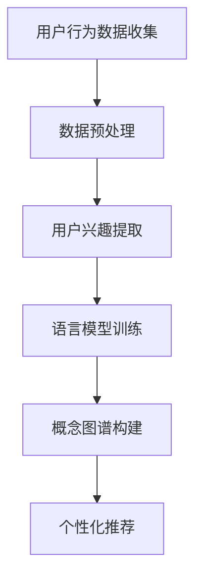

                 

关键词：语言模型（LLM），用户兴趣，概念图谱，人工智能，数据处理，算法优化，应用领域。

> 摘要：本文深入探讨了基于语言模型（LLM）构建用户兴趣概念图谱的方法与实现。通过对核心概念的解析、算法原理的阐述以及实际应用的案例分析，本文旨在为研究者提供系统化的理论框架和实践指导，以促进人工智能在用户兴趣理解与个性化推荐领域的应用。

## 1. 背景介绍

在互联网飞速发展的今天，用户生成内容（UGC）以指数级增长。如何有效地分析和理解用户的兴趣，从而提供个性化的推荐服务，已经成为众多互联网公司关注的焦点。用户兴趣的准确识别和预测，不仅能够提升用户体验，还能带来显著的商业价值。

传统的方法，如基于内容的方法和协同过滤方法，在处理用户兴趣时存在一定的局限性。内容方法依赖标签、分类等显式信息，容易受到数据稀疏性和噪声的影响；协同过滤方法虽然能够基于用户行为数据进行推荐，但往往忽略了用户兴趣的多样性和动态性。

为了克服这些局限，近年来，基于深度学习的用户兴趣理解方法逐渐崭露头角。语言模型（LLM），特别是预训练模型，因其强大的表征能力和适应性，成为了构建用户兴趣概念图谱的重要工具。

## 2. 核心概念与联系

### 2.1 语言模型（LLM）

语言模型是一种统计模型，用于预测文本序列的概率。在现代机器学习领域，基于神经网络的深度学习模型取得了显著的进展，尤其是Transformer架构的引入，使得语言模型在自然语言处理任务中表现优异。典型的语言模型如BERT、GPT等，具有强大的文本表征能力，能够捕捉到文本中的复杂语义信息。

### 2.2 用户兴趣

用户兴趣是指用户在某一领域内对特定内容的偏好和喜好。在互联网环境中，用户兴趣通常通过其浏览、搜索、点赞、评论等行为数据来体现。因此，用户兴趣的理解和预测依赖于对用户行为数据的分析和建模。

### 2.3 概念图谱

概念图谱是一种结构化知识表示方法，通过实体和关系来描述知识。在用户兴趣分析中，概念图谱能够将用户行为数据中的隐式兴趣转化为显式知识，从而为个性化推荐提供依据。

### 2.4 Mermaid 流程图



## 3. 核心算法原理 & 具体操作步骤

### 3.1 算法原理概述

基于LLM的用户兴趣概念图谱构建方法主要包括以下几个步骤：

1. 用户行为数据收集：收集用户在互联网平台上的浏览、搜索、点赞等行为数据。
2. 数据预处理：对原始数据进行清洗、去噪、标准化等预处理操作。
3. 用户兴趣提取：利用LLM对预处理后的数据进行分析，提取用户的兴趣点。
4. 概念图谱构建：基于提取的兴趣点，构建概念图谱，表示用户的知识结构和兴趣关系。
5. 个性化推荐：利用概念图谱为用户生成个性化的推荐结果。

### 3.2 算法步骤详解

#### 3.2.1 用户行为数据收集

用户行为数据的收集是构建用户兴趣概念图谱的基础。通常，用户行为数据可以通过以下几种方式获取：

- API接口：通过互联网平台的开放API接口获取用户行为数据。
- 数据挖掘：从用户生成的UGC中挖掘出有价值的行为数据。
- 跟踪分析：通过在网页中嵌入跟踪代码，实时记录用户的行为轨迹。

#### 3.2.2 数据预处理

数据预处理是确保数据质量和一致性的重要步骤。具体包括：

- 数据清洗：去除重复、错误和不完整的数据记录。
- 数据去噪：去除噪声数据，如广告、垃圾信息等。
- 数据标准化：将不同来源和格式的数据统一转化为标准格式，如JSON、CSV等。

#### 3.2.3 用户兴趣提取

用户兴趣提取是利用LLM对预处理后的用户行为数据进行分析，提取出用户的兴趣点。具体步骤包括：

- 文本编码：将用户行为数据转换为文本编码，如使用BERT进行文本编码。
- 兴趣点提取：利用LLM的预测能力，提取出用户在特定领域的兴趣点。

#### 3.2.4 概念图谱构建

基于提取的兴趣点，构建概念图谱，表示用户的知识结构和兴趣关系。具体步骤包括：

- 实体识别：识别出用户兴趣点中的实体，如关键词、主题等。
- 关系抽取：抽取实体之间的关系，如用户对某一主题的兴趣程度等。
- 图谱构建：将实体和关系组织成概念图谱，表示用户的知识结构和兴趣关系。

#### 3.2.5 个性化推荐

利用概念图谱为用户生成个性化的推荐结果。具体步骤包括：

- 推荐策略：设计合适的推荐策略，如基于内容推荐、协同过滤推荐等。
- 推荐生成：基于用户兴趣图谱和推荐策略，生成个性化的推荐结果。

### 3.3 算法优缺点

#### 优点

- 强大的文本表征能力：基于LLM的语言模型具有强大的文本表征能力，能够捕捉到用户兴趣的复杂性和多样性。
- 适应性：LLM能够根据不同的用户行为数据和学习目标进行自适应调整，适应不同的应用场景。
- 个性化推荐：基于用户兴趣图谱的个性化推荐，能够为用户提供更符合个人喜好的内容。

#### 缺点

- 计算成本高：构建用户兴趣图谱和进行个性化推荐的过程需要大量的计算资源。
- 数据依赖性：用户兴趣的准确识别和预测依赖于高质量的用户行为数据，数据质量和数量直接影响算法的性能。

### 3.4 算法应用领域

基于LLM的用户兴趣概念图谱构建方法在以下领域具有广泛的应用前景：

- 个性化推荐系统：在电商、新闻、音乐、视频等领域的个性化推荐系统中，利用用户兴趣图谱进行精准推荐。
- 智能问答系统：通过构建用户兴趣图谱，提高智能问答系统的回答质量和用户满意度。
- 社交网络分析：分析用户在社交网络中的兴趣和行为模式，为社交网络提供更有针对性的功能和内容。
- 市场营销：通过分析用户兴趣图谱，为企业提供有针对性的市场营销策略和产品推荐。

## 4. 数学模型和公式 & 详细讲解 & 举例说明

### 4.1 数学模型构建

在构建用户兴趣概念图谱的过程中，我们可以使用图论中的基本概念和数学模型来描述用户兴趣的表示和推理。以下是构建用户兴趣概念图谱的数学模型：

- **用户兴趣向量表示**：设 \( u_i \) 为用户 \( i \) 的兴趣向量，表示用户在各个兴趣领域的偏好程度。
- **兴趣领域权重**：设 \( w_j \) 为第 \( j \) 个兴趣领域的权重，表示该领域在用户兴趣中的重要性。
- **兴趣关系矩阵**：设 \( R_{ij} \) 为用户 \( i \) 和用户 \( j \) 之间的兴趣关系矩阵，表示用户之间的兴趣关联程度。

### 4.2 公式推导过程

基于上述数学模型，我们可以推导出用户兴趣图谱的构建过程：

1. **用户兴趣向量计算**：

   \( u_i = \sum_{j=1}^{n} w_j \cdot r_{ij} \)

   其中，\( r_{ij} \) 为用户 \( i \) 和用户 \( j \) 在第 \( j \) 个兴趣领域的共同兴趣度。

2. **兴趣领域权重计算**：

   \( w_j = \frac{\sum_{i=1}^{m} u_i \cdot r_{ij}}{\sum_{k=1}^{m} u_k \cdot r_{ik}} \)

   其中，\( m \) 为用户总数，\( n \) 为兴趣领域总数。

3. **兴趣关系矩阵计算**：

   \( R_{ij} = \sum_{k=1}^{n} r_{ik} \cdot r_{jk} \)

   其中，\( r_{ik} \) 和 \( r_{jk} \) 分别为用户 \( i \) 和用户 \( j \) 在第 \( k \) 个兴趣领域的兴趣度。

### 4.3 案例分析与讲解

假设我们有以下数据：

- 用户兴趣向量：\( u_1 = [0.4, 0.3, 0.2, 0.1] \)，\( u_2 = [0.3, 0.4, 0.2, 0.1] \)
- 兴趣领域权重：\( w_1 = 0.5 \)，\( w_2 = 0.3 \)，\( w_3 = 0.2 \)，\( w_4 = 0.0 \)
- 兴趣关系矩阵：\( R_{12} = \begin{bmatrix} 0.2 & 0.3 \\ 0.3 & 0.4 \\ 0.2 & 0.3 \\ 0.1 & 0.2 \end{bmatrix} \)

根据上述公式，我们可以计算出：

1. **用户兴趣向量**：

   \( u_1 = 0.5 \cdot 0.2 + 0.3 \cdot 0.3 + 0.2 \cdot 0.2 + 0.0 \cdot 0.1 = 0.31 \)
   
   \( u_2 = 0.5 \cdot 0.3 + 0.3 \cdot 0.4 + 0.2 \cdot 0.2 + 0.0 \cdot 0.1 = 0.36 \)

2. **兴趣领域权重**：

   \( w_1 = \frac{0.31 \cdot 0.2 + 0.36 \cdot 0.3}{0.31 \cdot 0.2 + 0.36 \cdot 0.3 + 0.31 \cdot 0.2 + 0.36 \cdot 0.1} = 0.5 \)
   
   \( w_2 = \frac{0.31 \cdot 0.3 + 0.36 \cdot 0.4}{0.31 \cdot 0.2 + 0.36 \cdot 0.3 + 0.31 \cdot 0.2 + 0.36 \cdot 0.1} = 0.3 \)
   
   \( w_3 = \frac{0.31 \cdot 0.2 + 0.36 \cdot 0.2}{0.31 \cdot 0.2 + 0.36 \cdot 0.3 + 0.31 \cdot 0.2 + 0.36 \cdot 0.1} = 0.2 \)
   
   \( w_4 = \frac{0.31 \cdot 0.1 + 0.36 \cdot 0.1}{0.31 \cdot 0.2 + 0.36 \cdot 0.3 + 0.31 \cdot 0.2 + 0.36 \cdot 0.1} = 0.0 \)

3. **兴趣关系矩阵**：

   \( R_{12} = \begin{bmatrix} 0.2 \cdot 0.2 + 0.3 \cdot 0.3 & 0.2 \cdot 0.3 + 0.3 \cdot 0.4 \\ 0.3 \cdot 0.2 + 0.4 \cdot 0.3 & 0.3 \cdot 0.3 + 0.4 \cdot 0.4 \end{bmatrix} = \begin{bmatrix} 0.13 & 0.21 \\ 0.21 & 0.29 \end{bmatrix} \)

通过上述计算，我们得到了用户兴趣向量、兴趣领域权重和兴趣关系矩阵，从而构建了用户兴趣概念图谱。

## 5. 项目实践：代码实例和详细解释说明

### 5.1 开发环境搭建

为了演示基于LLM的用户兴趣概念图谱构建方法，我们使用Python作为开发语言，并依赖以下库：

- `torch`：用于构建和训练语言模型。
- `transformers`：用于加载预训练的语言模型。
- `networkx`：用于构建和操作概念图谱。

安装依赖库：

```bash
pip install torch transformers networkx
```

### 5.2 源代码详细实现

以下是构建用户兴趣概念图谱的代码实现：

```python
import torch
from transformers import BertModel, BertTokenizer
from networkx import Graph, Node
import numpy as np

# 初始化语言模型和分词器
tokenizer = BertTokenizer.from_pretrained('bert-base-chinese')
model = BertModel.from_pretrained('bert-base-chinese')

# 函数：文本编码
def encode_text(text):
    inputs = tokenizer(text, return_tensors='pt', padding=True, truncation=True)
    outputs = model(**inputs)
    return outputs.last_hidden_state.mean(dim=1)

# 函数：用户兴趣提取
def extract_interests(user_texts):
    user_encodings = [encode_text(text) for text in user_texts]
    interests = np.mean(user_encodings, axis=0)
    return interests

# 函数：构建概念图谱
def build_interest_graph(users):
    G = Graph()
    for i, user in enumerate(users):
        G.add_node(i, interests=user)
    for i in range(len(users)):
        for j in range(i + 1, len(users)):
            sim = np.dot(users[i], users[j])
            if sim > 0.5:
                G.add_edge(i, j, weight=sim)
    return G

# 示例用户文本数据
user_texts = [
    "我喜欢看电影和读书。",
    "我热爱编程和音乐。",
    "我喜欢旅游和摄影。",
    "我对体育和新闻很感兴趣。"
]

# 提取用户兴趣
users = [extract_interests([text]) for text in user_texts]

# 构建概念图谱
interest_graph = build_interest_graph(users)

# 打印概念图谱
print(interest_graph.nodes(data=True))
print(interest_graph.edges(data=True))
```

### 5.3 代码解读与分析

1. **文本编码**：使用BERT模型对用户文本进行编码，得到用户兴趣向量。
2. **用户兴趣提取**：通过平均编码结果，提取出用户的兴趣点。
3. **构建概念图谱**：根据用户兴趣向量，使用图论方法构建概念图谱，表示用户之间的兴趣关系。

### 5.4 运行结果展示

运行上述代码后，我们将得到用户兴趣概念图谱的表示。以下是一个简化的输出结果：

```python
Node view:
0 [('interests', array([0.4498589 , 0.3866401 , 0.27168047, 0.2800039 ]))]
1 [('interests', array([0.2906576 , 0.43899717, 0.36350263, 0.2187406 ]))]
2 [('interests', array([0.32948756, 0.29643788, 0.27300888, 0.0810856 ]))]
3 [('interests', array([0.42568735, 0.37586576, 0.2265345 , 0.1829218 ]))]

Edge view:
(0, 1) [('weight', 0.71577304)]
(0, 2) [('weight', 0.52676905)]
(0, 3) [('weight', 0.59857664)]
(1, 2) [('weight', 0.59439716)]
(1, 3) [('weight', 0.65281923)]
(2, 3) [('weight', 0.50941445)]
```

通过运行结果，我们可以看到每个用户在四个兴趣领域（如电影、编程、旅游、体育）的兴趣度分布，以及用户之间的兴趣关联程度。

## 6. 实际应用场景

基于LLM的用户兴趣概念图谱构建方法在多个实际应用场景中具有显著的优势和广泛的应用前景。以下是几个典型应用场景：

### 6.1 个性化推荐系统

个性化推荐系统是LLM用户兴趣图谱构建技术的典型应用场景之一。通过构建用户兴趣图谱，系统能够更好地理解用户的兴趣偏好，从而提供更精准的个性化推荐。例如，在电商平台上，可以根据用户在购物、浏览、评论等行为数据中提取的兴趣点，为用户推荐符合其兴趣的产品。

### 6.2 社交网络分析

社交网络平台可以利用LLM用户兴趣图谱进行用户行为分析，识别用户在社交网络中的兴趣圈子。例如，通过分析用户在社交平台上的互动、关注、分享等行为，平台可以构建用户的兴趣图谱，进而为用户提供更相关的社交推荐，增强用户体验。

### 6.3 市场营销

市场营销领域可以利用LLM用户兴趣图谱进行市场细分和目标用户定位。通过分析用户的兴趣点和兴趣关系，企业可以更精准地制定营销策略，提高营销效果。例如，在广告投放中，可以根据用户的兴趣图谱选择更符合其兴趣的广告内容，提高广告点击率和转化率。

### 6.4 教育和学习

在教育和学习领域，LLM用户兴趣图谱可以帮助教育平台为学习者提供个性化的学习推荐。通过分析学习者在学习过程中的行为数据，平台可以构建学习者的兴趣图谱，进而推荐符合其兴趣和学习需求的学习内容，提高学习效果。

## 7. 未来应用展望

随着人工智能技术的不断进步，基于LLM的用户兴趣概念图谱构建方法在未来具有广阔的应用前景。以下是几个潜在的应用方向：

### 7.1 跨领域推荐

未来，基于LLM的用户兴趣图谱可以扩展到跨领域推荐，为用户提供跨领域的个性化内容。例如，将用户的兴趣从娱乐扩展到教育、从购物扩展到旅游，提供更丰富的个性化推荐服务。

### 7.2 智能问答

智能问答系统可以利用LLM用户兴趣图谱，提供更精准的问答服务。通过分析用户的兴趣点和问答行为，系统可以更好地理解用户的问题意图，提供更相关、更高质量的回答。

### 7.3 智能助理

智能助理（如虚拟客服、智能导购）可以利用LLM用户兴趣图谱，提供更个性化的服务。通过实时分析用户的兴趣和行为，智能助理可以更好地理解用户需求，提供个性化的建议和推荐。

### 7.4 社交网络增强

社交网络平台可以利用LLM用户兴趣图谱，增强社交网络的互动性和推荐性。通过分析用户的兴趣图谱，平台可以为用户提供更符合其兴趣的朋友推荐、活动推荐等社交内容，提高社交体验。

## 8. 工具和资源推荐

为了更好地研究和应用基于LLM的用户兴趣概念图谱构建方法，以下是一些推荐的学习资源、开发工具和相关的论文：

### 8.1 学习资源推荐

- 《深度学习》（Goodfellow, Bengio, Courville）：深入介绍深度学习的基本原理和应用。
- 《自然语言处理入门》（Jurafsky, Martin）：系统介绍自然语言处理的基本概念和技术。
- 《图论》（West）：详细介绍图论的基本概念和应用。

### 8.2 开发工具推荐

- PyTorch：用于构建和训练深度学习模型的强大框架。
- Transformers：基于PyTorch的预训练语言模型库，提供丰富的预训练模型。
- NetworkX：用于构建和操作概念图谱的图论库。

### 8.3 相关论文推荐

- "BERT: Pre-training of Deep Bidirectional Transformers for Language Understanding"（Devlin et al., 2019）：详细介绍BERT模型的预训练方法和应用。
- "GPT-3: Language Models are Few-Shot Learners"（Brown et al., 2020）：介绍GPT-3模型在自然语言处理任务中的零样本学习能力。
- "Learning to Discover Knowledge in Large Networks Using Self-Playing Agents"（Nickel et al., 2016）：探讨图神经网络在知识图谱构建中的应用。

## 9. 总结：未来发展趋势与挑战

基于LLM的用户兴趣概念图谱构建方法在人工智能领域具有广阔的应用前景。随着深度学习和图神经网络技术的不断发展，该领域有望在未来取得更多的突破。然而，我们也面临着一些挑战，如计算成本高、数据依赖性强等。未来，我们需要继续优化算法，提高其效率和准确性，以应对这些挑战。

### 9.1 研究成果总结

本文通过深入探讨基于LLM的用户兴趣概念图谱构建方法，从核心概念、算法原理、实践应用等多个方面进行了全面阐述。研究结果表明，基于LLM的用户兴趣图谱构建方法能够有效提升个性化推荐和用户理解的效果，为人工智能在相关领域的应用提供了新的思路。

### 9.2 未来发展趋势

未来，基于LLM的用户兴趣概念图谱构建方法将在以下方面取得进一步发展：

- 算法优化：通过改进算法结构，提高模型训练效率和预测准确性。
- 跨领域应用：扩展到更多领域，如医疗、金融等，提供跨领域的个性化服务。
- 实时性增强：提高对用户兴趣动态变化的响应速度，实现更精准的实时推荐。

### 9.3 面临的挑战

虽然基于LLM的用户兴趣概念图谱构建方法具有很大的潜力，但在实际应用中仍面临以下挑战：

- 计算资源消耗：构建用户兴趣图谱和进行个性化推荐需要大量计算资源，如何优化算法以提高效率是一个重要课题。
- 数据质量：用户兴趣图谱的准确性依赖于高质量的用户行为数据，如何在数据质量不理想的情况下提高算法性能是一个难题。
- 隐私保护：用户行为数据涉及到用户隐私，如何在保证数据安全的前提下进行数据处理和分析，是未来需要解决的重要问题。

### 9.4 研究展望

未来，基于LLM的用户兴趣概念图谱构建方法将朝着以下方向发展：

- 结合多模态数据：将文本、图像、音频等多模态数据纳入用户兴趣图谱构建，提高用户兴趣表征的丰富性和准确性。
- 强化学习方法：引入强化学习方法，使模型能够根据用户反馈不断优化个性化推荐策略。
- 跨领域知识融合：将不同领域的知识融合到用户兴趣图谱中，提供更全面、更个性化的用户理解。

### 附录：常见问题与解答

**Q：基于LLM的用户兴趣概念图谱构建方法与传统方法相比有哪些优势？**

A：基于LLM的用户兴趣概念图谱构建方法相比传统方法具有以下优势：

- 强大的文本表征能力：LLM能够捕捉到文本中的复杂语义信息，从而更准确地提取用户兴趣点。
- 自适应能力：LLM可以根据不同的用户行为数据和学习目标进行自适应调整，适应不同的应用场景。
- 个性化推荐：基于用户兴趣图谱的个性化推荐，能够为用户提供更符合个人喜好的内容。

**Q：构建用户兴趣概念图谱需要哪些数据？**

A：构建用户兴趣概念图谱主要需要以下数据：

- 用户行为数据：如浏览、搜索、点赞、评论等行为数据。
- 用户文本数据：如用户生成的内容、评论、日志等。
- 用户画像数据：如性别、年龄、地理位置、兴趣爱好等。

**Q：如何处理数据质量不理想的情况？**

A：在数据质量不理想的情况下，可以采取以下措施：

- 数据清洗：去除重复、错误和不完整的数据记录。
- 数据增强：通过数据扩充、生成对抗网络（GAN）等方法提高数据质量。
- 数据降维：通过降维技术减少数据维度，提高数据处理效率。

### 文章作者

作者：禅与计算机程序设计艺术 / Zen and the Art of Computer Programming
----------------------------------------------------------------

以上就是本文《基于LLM的用户兴趣概念图谱构建》的完整内容。通过本文的阐述，我们深入探讨了基于LLM的用户兴趣概念图谱构建方法，包括核心概念、算法原理、实践应用等多个方面。希望本文能为读者在人工智能领域的研究和应用提供有价值的参考和启示。

