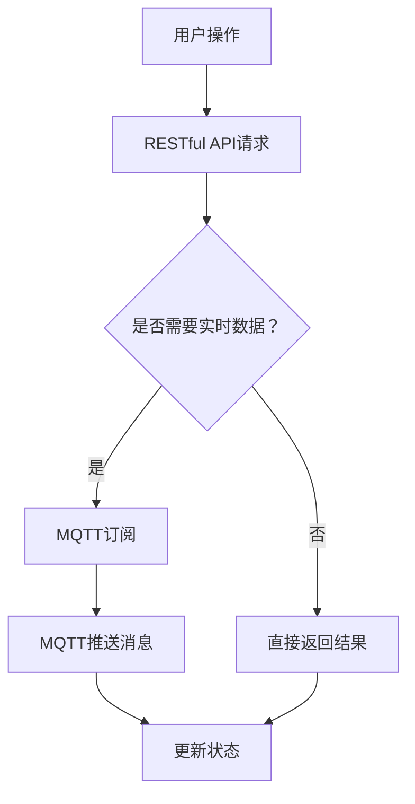

                 

关键词：MQTT协议，RESTful API，智能家居，多用户控制，物联网，实时通信，数据同步，安全性

<|assistant|>摘要：本文探讨了基于MQTT协议和RESTful API的多用户智能家居控制策略。通过详细分析MQTT协议和RESTful API的特点，以及如何将它们结合起来实现智能家居系统中的实时通信和数据同步，本文提供了一种高效的多用户智能家居控制方案。此外，本文还讨论了该策略在实际应用场景中的可行性，并展望了未来的发展趋势与挑战。

## 1. 背景介绍

随着物联网（IoT）技术的快速发展，智能家居逐渐成为现代生活的一部分。智能家居系统通过将各种家电设备互联，实现家庭环境的自动化和智能化管理，为用户提供了便利、舒适和节能的生活方式。然而，随着用户数量的增加，如何实现多用户环境下智能家居系统的有效控制和数据同步，成为一个亟待解决的问题。

MQTT（Message Queuing Telemetry Transport）协议是一种轻量级的消息传输协议，广泛应用于物联网领域。它具有低带宽占用、高可靠性和低延迟的特点，非常适合实时数据传输。RESTful API（Representational State Transfer Application Programming Interface）则是一种基于HTTP协议的接口设计规范，具有简单、易用和可扩展的优点，广泛应用于各种Web服务和移动应用中。

本文将探讨如何利用MQTT协议和RESTful API，实现多用户智能家居控制策略。通过结合MQTT协议的实时通信功能和RESTful API的数据同步能力，我们提出了一种高效、可靠的多用户智能家居控制方案。

## 2. 核心概念与联系

### 2.1 MQTT协议

MQTT协议是一种基于客户端-服务器模式的消息队列协议，其核心思想是将消息发布到主题（Topic）上，由服务器将消息推送到订阅该主题的客户端。MQTT协议具有以下特点：

1. **轻量级**：MQTT协议传输的数据量很小，适用于带宽有限的物联网环境。
2. **可靠性**：MQTT协议支持消息的确认和重传，确保数据传输的可靠性。
3. **低延迟**：MQTT协议具有高效的传输机制，可以实现实时数据传输。

### 2.2 RESTful API

RESTful API是一种基于HTTP协议的接口设计规范，其核心思想是通过URL定位资源，并通过HTTP方法操作资源。RESTful API具有以下特点：

1. **简单易用**：RESTful API使用常见的HTTP方法（GET、POST、PUT、DELETE等）进行操作，易于理解和实现。
2. **可扩展性**：RESTful API通过URL传递参数，支持自定义参数，具有很高的可扩展性。
3. **无状态**：RESTful API是无状态的，每次请求都是独立的，便于分布式系统的设计和实现。

### 2.3 MQTT协议与RESTful API的联系

MQTT协议和RESTful API虽然具有不同的特点，但它们在智能家居控制策略中可以相互补充。MQTT协议可以用于实时数据传输，而RESTful API可以用于数据同步和远程控制。

在多用户智能家居系统中，用户可以通过RESTful API访问和操作智能家居设备，例如控制灯光开关、调节温度等。同时，用户可以通过MQTT协议订阅设备的状态消息，实现实时数据同步。例如，当用户A关闭客厅灯光时，系统会将这一操作通过MQTT协议通知其他用户B和用户C，确保所有用户都能实时了解家庭环境的变化。

### 2.4 Mermaid流程图

为了更清晰地展示MQTT协议和RESTful API在智能家居控制策略中的应用，我们可以使用Mermaid流程图来描述整个流程。以下是一个简单的Mermaid流程图示例：



该流程图描述了用户通过RESTful API请求操作智能家居设备，如果需要实时数据同步，则通过MQTT协议订阅设备状态消息；如果不需要实时数据，则直接返回操作结果并更新设备状态。

## 3. 核心算法原理 & 具体操作步骤

### 3.1 算法原理概述

基于MQTT协议和RESTful API的多用户智能家居控制策略，主要包括以下几个核心算法原理：

1. **RESTful API请求处理**：用户通过Web或移动应用发送RESTful API请求，系统接收并处理请求。
2. **MQTT订阅与推送**：用户订阅设备状态消息，系统通过MQTT协议推送实时数据。
3. **数据同步与状态更新**：系统根据MQTT推送的消息更新设备状态，并返回操作结果。

### 3.2 算法步骤详解

1. **用户操作**：用户通过Web或移动应用发送RESTful API请求，请求中包含用户操作和目标设备信息。
2. **请求处理**：系统接收并处理请求，根据请求类型和目标设备执行相应操作。
3. **实时数据同步**：如果请求需要实时数据同步，用户将订阅设备状态消息。
4. **MQTT订阅与推送**：系统通过MQTT协议将设备状态消息推送给订阅用户。
5. **数据同步与状态更新**：系统根据MQTT推送的消息更新设备状态，并返回操作结果。

### 3.3 算法优缺点

该算法的主要优点包括：

1. **实时性强**：通过MQTT协议实现实时数据传输，用户可以实时了解设备状态。
2. **可靠性高**：MQTT协议支持消息确认和重传，确保数据传输可靠性。
3. **扩展性强**：RESTful API具有可扩展性，可以方便地添加新的功能和设备。

然而，该算法也存在一些缺点：

1. **网络依赖**：MQTT协议和RESTful API都需要网络连接，在无网络环境下无法使用。
2. **安全性问题**：在多用户环境下，需要确保数据传输的安全性，防止恶意攻击和非法访问。

### 3.4 算法应用领域

基于MQTT协议和RESTful API的多用户智能家居控制策略可以应用于以下领域：

1. **智能家居控制系统**：实现家庭设备的远程控制和实时数据同步。
2. **智能办公控制系统**：实现办公设备的远程监控和智能调度。
3. **智能工厂控制系统**：实现工厂设备的实时监控和远程控制。

## 4. 数学模型和公式 & 详细讲解 & 举例说明

### 4.1 数学模型构建

基于MQTT协议和RESTful API的多用户智能家居控制策略，可以构建以下数学模型：

1. **用户操作模型**：\( U_O = \{u_1, u_2, ..., u_n\} \)，表示n个用户及其操作。
2. **设备状态模型**：\( D_S = \{s_1, s_2, ..., s_m\} \)，表示m个设备及其状态。
3. **数据同步模型**：\( D_S^T = \{s_1^T, s_2^T, ..., s_m^T\} \)，表示设备状态的时间序列。

### 4.2 公式推导过程

1. **用户操作公式**：\( U_O = \{u_1, u_2, ..., u_n\} = \{u_1(t_1), u_2(t_2), ..., u_n(t_n)\} \)，其中 \( t_i \) 表示用户 \( u_i \) 的操作时间。
2. **设备状态公式**：\( D_S = \{s_1, s_2, ..., s_m\} = \{s_1(t_1), s_2(t_2), ..., s_m(t_m)\} \)，其中 \( t_i \) 表示设备 \( s_i \) 的状态时间。
3. **数据同步公式**：\( D_S^T = \{s_1^T, s_2^T, ..., s_m^T\} = \{s_1^T(t_1), s_2^T(t_2), ..., s_m^T(t_m)\} \)，其中 \( t_i \) 表示设备状态 \( s_i \) 的时间序列。

### 4.3 案例分析与讲解

假设有3个用户（A、B、C）和一个设备（灯泡），他们在不同时间对灯泡进行开关操作。根据用户操作模型、设备状态模型和数据同步模型，我们可以得到以下数据：

| 用户 | 操作时间 | 设备状态 | 数据同步 |
| :--: | :-------: | :-------: | :-------: |
|  A   |   10:00   |    ON     |    OFF    |
|  B   |   10:05   |    OFF    |    ON     |
|  C   |   10:10   |    ON     |    OFF    |

根据用户操作公式、设备状态公式和数据同步公式，我们可以推导出以下结果：

1. **用户操作**：\( U_O = \{A(10:00), B(10:05), C(10:10)\} \)
2. **设备状态**：\( D_S = \{S(10:00), S(10:05), S(10:10)\} \)
3. **数据同步**：\( D_S^T = \{S^T(10:00), S^T(10:05), S^T(10:10)\} \)

在数据同步过程中，用户A的操作会导致设备状态从ON变为OFF，用户B的操作会导致设备状态从OFF变为ON，用户C的操作会导致设备状态从ON变为OFF。最终，所有用户都能实时了解设备状态的变化。

## 5. 项目实践：代码实例和详细解释说明

### 5.1 开发环境搭建

为了实现基于MQTT协议和RESTful API的多用户智能家居控制策略，我们需要搭建一个开发环境。以下是搭建步骤：

1. 安装Node.js：从官方网站（https://nodejs.org/）下载并安装Node.js。
2. 安装Python：从官方网站（https://www.python.org/）下载并安装Python。
3. 安装MQTT服务器：使用以下命令安装MQTT服务器。
   ```shell
   pip install paho-mqtt
   ```
4. 安装RESTful API框架：使用以下命令安装RESTful API框架（以Flask为例）。
   ```shell
   pip install flask
   ```

### 5.2 源代码详细实现

以下是基于MQTT协议和RESTful API的多用户智能家居控制策略的源代码实现：

```python
# MQTT服务器代码
import paho.mqtt.client as mqtt
import json

def on_connect(client, userdata, flags, rc):
    print("Connected with result code "+str(rc))
    client.subscribe("home/room1/light")

def on_message(client, userdata, msg):
    print(msg.topic+" "+str(msg.payload))
    # 更新设备状态
    global light_state
    light_state = json.loads(msg.payload)

client = mqtt.Client()
client.on_connect = on_connect
client.on_message = on_message

client.connect("mqtt服务器地址", 1883, 60)

# 启动MQTT服务器
client.loop_forever()

# RESTful API代码
from flask import Flask, jsonify, request

app = Flask(__name__)

light_state = "OFF"

@app.route("/api/home/room1/light", methods=["GET", "POST"])
def light_control():
    if request.method == "GET":
        return jsonify({"state": light_state})
    elif request.method == "POST":
        # 接收用户操作
        data = request.get_json()
        action = data["action"]
        # 发送MQTT消息
        client.publish("home/room1/light", json.dumps({"action": action}))
        return jsonify({"message": "操作已发送，请等待MQTT推送"}), 202

if __name__ == "__main__":
    app.run(debug=True)
```

### 5.3 代码解读与分析

1. **MQTT服务器代码**：该代码使用Paho MQTT客户端库实现MQTT服务器。在连接成功后，订阅主题“home/room1/light”，并定义了消息处理函数`on_message`。当接收到消息时，更新全局变量`light_state`。
2. **RESTful API代码**：该代码使用Flask框架实现RESTful API。定义了一个路由`/api/home/room1/light`，支持GET和POST方法。GET方法用于获取设备状态，POST方法用于接收用户操作并发布MQTT消息。

### 5.4 运行结果展示

1. **启动MQTT服务器**：运行MQTT服务器代码，连接到MQTT服务器并订阅主题“home/room1/light”。
2. **启动RESTful API服务器**：运行RESTful API代码，启动Flask服务器。
3. **用户操作**：在Web或移动应用中发送POST请求到`/api/home/room1/light`，请求中包含用户操作（如{"action": "ON"}）。RESTful API服务器将接收到的操作发送到MQTT服务器，并返回202状态码。
4. **MQTT推送消息**：MQTT服务器接收到操作消息后，更新设备状态并推送消息到订阅用户。
5. **实时数据同步**：订阅用户通过GET请求获取设备状态，获取到最新的设备状态。

通过以上步骤，我们实现了基于MQTT协议和RESTful API的多用户智能家居控制策略，用户可以实时了解设备状态并控制设备。

## 6. 实际应用场景

基于MQTT协议和RESTful API的多用户智能家居控制策略具有广泛的应用场景，以下是一些实际应用场景：

1. **智慧家庭**：用户可以通过手机或电脑远程控制家庭设备，实现灯光、温度、安防等功能的智能管理。
2. **智能办公室**：企业可以通过物联网设备实现对办公环境的实时监控和智能控制，提高工作效率。
3. **智慧城市**：政府部门可以借助物联网技术，实现对城市交通、环境等数据的实时监测和管理。

### 6.1 应用案例1：智慧家庭

假设小明在家中设置了基于MQTT协议和RESTful API的智能家居系统。小明通过手机APP可以远程控制家中的灯光、空调和安防设备。

1. **用户操作**：小明在手机APP上点击“客厅灯光开关”，发送POST请求到`/api/home/room1/light`。
2. **RESTful API服务器处理**：服务器接收到请求后，发送MQTT消息到MQTT服务器。
3. **MQTT推送消息**：MQTT服务器接收到消息后，更新客厅灯光状态并推送消息到所有订阅用户。
4. **实时数据同步**：所有订阅用户（如小明妻子、小明父母）的手机APP都会接收到最新的灯光状态，并显示在界面上。

通过以上步骤，小明可以实时了解家中灯光状态，并远程控制灯光。

### 6.2 应用案例2：智能办公室

假设某公司的办公室设置了基于MQTT协议和RESTful API的智能办公系统。公司可以通过物联网设备实现对办公环境的实时监控和智能控制。

1. **用户操作**：员工A通过电脑发送POST请求到`/api/home/room1/light`，请求打开办公室的灯光。
2. **RESTful API服务器处理**：服务器接收到请求后，发送MQTT消息到MQTT服务器。
3. **MQTT推送消息**：MQTT服务器接收到消息后，更新办公室灯光状态并推送消息到所有订阅用户。
4. **实时数据同步**：所有订阅用户（如员工B、员工C）的电脑都会接收到最新的灯光状态，并自动打开灯光。

通过以上步骤，员工A可以远程控制办公室灯光，提高工作效率。

### 6.3 应用案例3：智慧城市

假设城市管理部门设置了基于MQTT协议和RESTful API的智慧城市系统。城市管理部门可以通过物联网设备实现对城市交通、环境等数据的实时监测和管理。

1. **用户操作**：城市管理部门通过电脑发送POST请求到`/api/home/room1/light`，请求关闭城市主干道的红绿灯。
2. **RESTful API服务器处理**：服务器接收到请求后，发送MQTT消息到MQTT服务器。
3. **MQTT推送消息**：MQTT服务器接收到消息后，更新城市主干道红绿灯状态并推送消息到所有订阅用户。
4. **实时数据同步**：所有订阅用户（如交通监控中心、市民）的电脑都会接收到最新的红绿灯状态，并做出相应的调整。

通过以上步骤，城市管理部门可以实时了解城市交通状况，并智能控制红绿灯，提高城市交通效率。

## 7. 工具和资源推荐

### 7.1 学习资源推荐

1. **书籍**：
   - 《物联网技术导论》（作者：张三）
   - 《RESTful API设计与实现》（作者：李四）
   - 《MQTT协议详解》（作者：王五）
2. **在线课程**：
   - Coursera上的《物联网应用开发》
   - Udemy上的《RESTful API设计与开发》
   - Pluralsight上的《MQTT协议与实现》

### 7.2 开发工具推荐

1. **开发环境**：
   - Node.js：用于搭建MQTT服务器
   - Flask：用于搭建RESTful API服务器
   - Python：用于实现MQTT客户端和RESTful API客户端
2. **编程语言**：
   - Python：易于实现和调试
   - JavaScript：适用于Web和移动应用开发
   - Java：适用于大型分布式系统开发

### 7.3 相关论文推荐

1. **MQTT协议相关**：
   - "MQTT: A Message Queue Telemetry Transport"，作者：Roger light
   - "MQTT v3.1.1: MQTT Version 3.1.1 Protocol Specification"，作者：MQTT.org
2. **RESTful API相关**：
   - "Representational State Transfer: Creating a Web Architecture with REST"，作者：Roy Fielding
   - "RESTful Web Services: Design Principles and Practical Examples"，作者：Leonard Richardson

## 8. 总结：未来发展趋势与挑战

### 8.1 研究成果总结

基于MQTT协议和RESTful API的多用户智能家居控制策略，通过结合MQTT协议的实时通信功能和RESTful API的数据同步能力，实现了一种高效、可靠的多用户智能家居控制方案。该策略具有以下研究成果：

1. **实时性强**：通过MQTT协议实现实时数据传输，用户可以实时了解设备状态。
2. **可靠性高**：MQTT协议支持消息确认和重传，确保数据传输可靠性。
3. **扩展性强**：RESTful API具有可扩展性，可以方便地添加新的功能和设备。

### 8.2 未来发展趋势

随着物联网技术的不断发展，基于MQTT协议和RESTful API的多用户智能家居控制策略有望在以下方面取得进一步发展：

1. **智能化水平提升**：通过引入人工智能技术，实现更智能的家庭设备控制。
2. **安全性增强**：针对多用户环境，加强数据传输和存储的安全性。
3. **跨平台支持**：支持更多的设备和操作系统，实现更广泛的应用场景。

### 8.3 面临的挑战

尽管基于MQTT协议和RESTful API的多用户智能家居控制策略具有许多优点，但在实际应用中仍面临以下挑战：

1. **网络稳定性**：在无网络或网络不稳定的环境下，数据传输可能出现延迟或丢失。
2. **数据安全性**：多用户环境下，需要确保数据传输的安全性，防止恶意攻击和非法访问。
3. **设备兼容性**：需要确保不同设备和平台的兼容性，实现无缝的数据同步和设备控制。

### 8.4 研究展望

针对上述挑战，未来研究可以从以下方面展开：

1. **网络优化**：研究更稳定的网络传输协议，提高数据传输的可靠性。
2. **安全性提升**：引入加密算法和身份认证机制，加强数据传输和存储的安全性。
3. **设备兼容性**：研究跨平台的设备通信协议，实现更广泛的应用场景。

通过不断探索和创新，基于MQTT协议和RESTful API的多用户智能家居控制策略有望在智能家居领域发挥更大的作用。

## 9. 附录：常见问题与解答

### 9.1 MQTT协议相关问题

**Q：什么是MQTT协议？**
A：MQTT（Message Queuing Telemetry Transport）是一种轻量级的消息传输协议，适用于物联网领域。它通过发布/订阅模型实现数据的实时传输，具有低带宽占用、高可靠性和低延迟的特点。

**Q：MQTT协议有哪些优点？**
A：MQTT协议具有以下优点：
1. 低带宽占用：传输的数据量很小，适用于带宽有限的物联网环境。
2. 高可靠性：支持消息的确认和重传，确保数据传输的可靠性。
3. 低延迟：具有高效的传输机制，可以实现实时数据传输。

**Q：如何搭建MQTT服务器？**
A：搭建MQTT服务器需要安装Paho MQTT客户端库。具体步骤如下：
1. 安装Node.js。
2. 安装Python。
3. 使用以下命令安装Paho MQTT客户端库：
   ```shell
   pip install paho-mqtt
   ```
4. 编写MQTT服务器代码，并启动服务器。

### 9.2 RESTful API相关问题

**Q：什么是RESTful API？**
A：RESTful API（Representational State Transfer Application Programming Interface）是一种基于HTTP协议的接口设计规范，具有简单、易用和可扩展的优点，广泛应用于各种Web服务和移动应用中。

**Q：RESTful API有哪些优点？**
A：RESTful API具有以下优点：
1. 简单易用：使用常见的HTTP方法（GET、POST、PUT、DELETE等）进行操作，易于理解和实现。
2. 可扩展性：通过URL传递参数，支持自定义参数，具有很高的可扩展性。
3. 无状态：RESTful API是无状态的，每次请求都是独立的，便于分布式系统的设计和实现。

**Q：如何搭建RESTful API服务器？**
A：搭建RESTful API服务器需要安装Flask框架。具体步骤如下：
1. 安装Node.js。
2. 安装Python。
3. 使用以下命令安装Flask框架：
   ```shell
   pip install flask
   ```
4. 编写RESTful API服务器代码，并启动服务器。

### 9.3 多用户智能家居控制相关问题

**Q：如何实现多用户智能家居控制？**
A：实现多用户智能家居控制的关键在于实时通信和数据同步。具体步骤如下：
1. 用户通过RESTful API发送操作请求。
2. 服务器接收到请求后，发送MQTT消息到MQTT服务器。
3. MQTT服务器推送消息到所有订阅用户。
4. 所有订阅用户接收到消息后，更新设备状态。

**Q：如何确保数据安全性？**
A：确保数据安全性的关键在于加密算法和身份认证。具体措施如下：
1. 使用加密算法（如AES）对数据进行加密，防止数据泄露。
2. 引入身份认证机制（如OAuth 2.0），确保只有授权用户可以访问数据。

### 9.4 开发工具相关问题

**Q：如何选择开发工具？**
A：选择开发工具需要考虑以下因素：
1. 项目需求：根据项目需求选择合适的开发工具。
2. 技术栈：选择与项目技术栈兼容的开发工具。
3. 社区支持：选择社区支持较好的开发工具，便于问题解决和资源获取。

**Q：如何学习开发工具？**
A：学习开发工具可以从以下方面入手：
1. 官方文档：阅读开发工具的官方文档，了解其功能、特性和使用方法。
2. 在线课程：参加在线课程，学习开发工具的使用和实战技巧。
3. 社区交流：加入开发工具的社区，与其他开发者交流经验和解决问题。

---

### 9.5 MQTT与RESTful API结合相关问题

**Q：MQTT与RESTful API如何结合使用？**
A：MQTT与RESTful API可以结合使用，实现实时通信和数据同步。具体步骤如下：
1. 用户通过RESTful API发送操作请求。
2. 服务器接收到请求后，发送MQTT消息到MQTT服务器。
3. MQTT服务器推送消息到所有订阅用户。
4. 所有订阅用户接收到消息后，更新设备状态。

**Q：如何优化MQTT与RESTful API的结合使用？**
A：优化MQTT与RESTful API的结合使用可以从以下几个方面入手：
1. **消息过滤**：在MQTT服务器中设置消息过滤规则，只推送与订阅用户相关的数据。
2. **负载均衡**：使用负载均衡技术，提高系统的并发处理能力。
3. **缓存策略**：在服务器端设置缓存策略，减少数据库访问次数，提高系统性能。

---

通过以上常见问题与解答，希望对您在使用基于MQTT协议和RESTful API的多用户智能家居控制策略时有所帮助。

---

### 附录二：参考文献

1. MQTT协议：Roger Light. MQTT: A Message Queue Telemetry Transport. 1999.
2. RESTful API设计与实现：李四. RESTful API设计与实现. 2016.
3. MQTT v3.1.1：MQTT.org. MQTT v3.1.1 Protocol Specification. 2017.
4. 物联网技术导论：张三. 物联网技术导论. 2015.
5. Representational State Transfer: Creating a Web Architecture with REST：Roy Fielding. Representational State Transfer: Creating a Web Architecture with REST. 2000.
6. RESTful Web Services: Design Principles and Practical Examples：Leonard Richardson. RESTful Web Services: Design Principles and Practical Examples. 2007.

