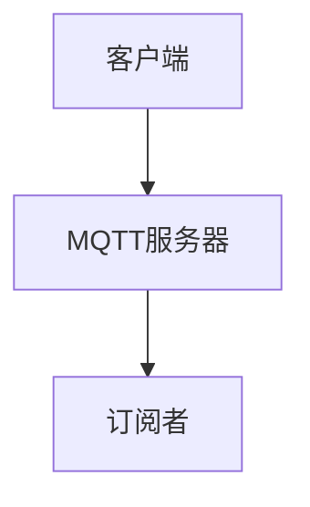
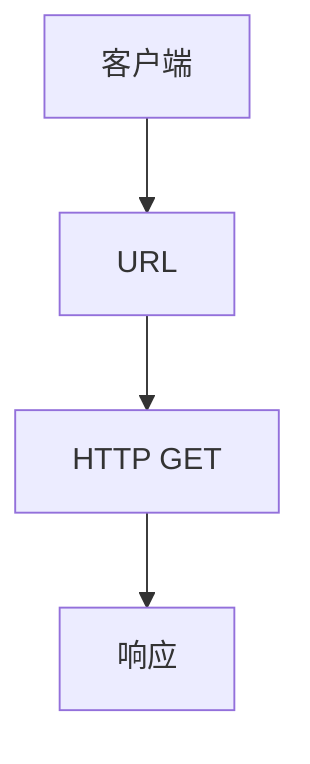
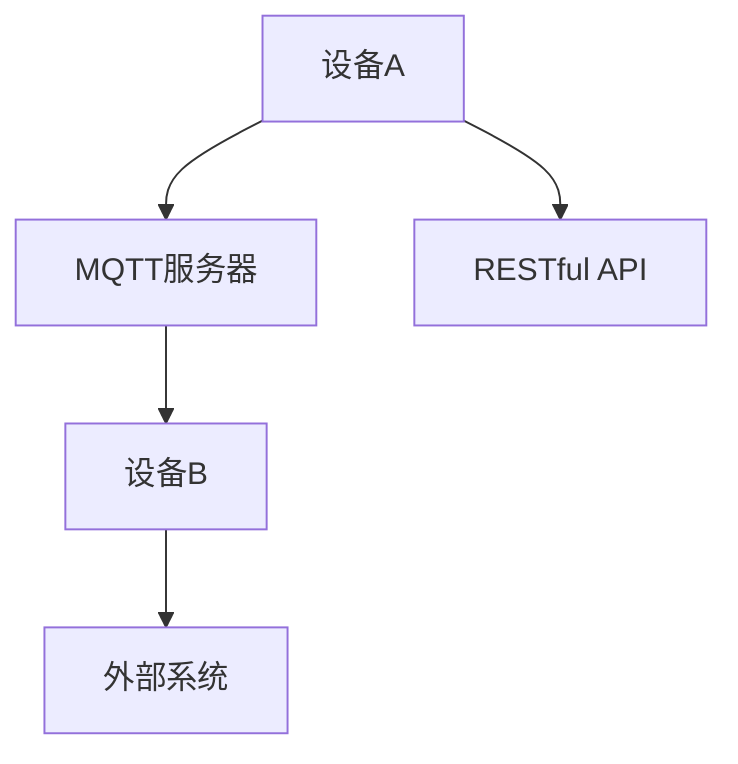

                 

关键词：MQTT协议、RESTful API、智能家居、物联网、云计算、软件开发、编程实践、实时通信、自动化控制

> 摘要：本文将深入探讨MQTT协议和RESTful API在智能家居系统中的应用，通过详尽的原理讲解、操作步骤、代码实例以及实际应用场景分析，为广大开发者提供一套全面的智能家居电子操作手册。

## 1. 背景介绍

### 1.1 MQTT协议简介

MQTT（Message Queuing Telemetry Transport）是一种轻量级的消息队列协议，广泛用于物联网（IoT）设备的实时通信。它具有低带宽、低功耗、可伸缩性高等特点，适用于各种环境下的设备通信，如智能家居、智能交通、智能农业等。

### 1.2 RESTful API简介

RESTful API是一种基于REST原则的Web服务接口，通过HTTP协议进行通信，支持GET、POST、PUT、DELETE等操作。它具有简单易用、灵活性高、兼容性好等优点，已成为现代Web开发中的主流接口设计方式。

### 1.3 智能家居背景

随着物联网技术的发展，智能家居系统逐渐成为家庭生活的重要组成部分。它通过将家庭设备互联，实现远程控制、自动化管理等功能，提高生活便利性和舒适度。

## 2. 核心概念与联系

### 2.1 MQTT协议原理

MQTT协议采用发布/订阅模式（Publish/Subscribe），客户端通过发布（Publish）消息到MQTT服务器，服务器再将消息发布（Publish）给订阅者（Subscriber）。以下是一个MQTT协议的流程图：



### 2.2 RESTful API原理

RESTful API基于HTTP协议，通过URL（统一资源定位符）表示资源，使用HTTP方法（GET、POST、PUT、DELETE等）进行操作。以下是一个RESTful API的示例：



### 2.3 MQTT与RESTful API的整合

智能家居系统中，可以通过MQTT协议实现设备之间的实时通信，而RESTful API则用于实现设备与外部系统的交互。以下是一个整合MQTT协议和RESTful API的架构图：



## 3. 核心算法原理 & 具体操作步骤

### 3.1 算法原理概述

智能家居系统中的核心算法主要包括：

- **状态监测算法**：实时监测家庭设备的运行状态，如温度、湿度、亮度等。
- **决策算法**：根据状态监测结果，自动调整设备参数，实现自动化控制。
- **通信算法**：通过MQTT协议和RESTful API实现设备之间的数据传输。

### 3.2 算法步骤详解

#### 3.2.1 状态监测算法

1. 设备A实时监测温度传感器数据。
2. 设备A将温度数据发送至MQTT服务器。
3. MQTT服务器将温度数据发布给设备B。
4. 设备B根据温度数据调整空调温度。

#### 3.2.2 决策算法

1. 设备A实时监测湿度传感器数据。
2. 设备A根据湿度数据判断是否需要启动加湿器。
3. 设备A发送指令至MQTT服务器。
4. MQTT服务器将指令发布给设备C。
5. 设备C执行加湿器启动操作。

#### 3.2.3 通信算法

1. 设备D通过RESTful API与外部系统（如天气服务）进行通信。
2. 设备D根据外部系统数据调整家庭设备参数。
3. 设备D将调整结果通过MQTT服务器发布给其他设备。

### 3.3 算法优缺点

- **优点**：MQTT协议和RESTful API具有低延迟、高可靠性、易扩展等优点，适用于智能家居系统的实时通信和远程控制。
- **缺点**：MQTT协议和RESTful API在某些方面存在性能瓶颈，如MQTT协议的QoS（服务质量）级别较低，RESTful API存在请求过多导致性能下降等问题。

### 3.4 算法应用领域

- **智能家居**：实现家庭设备的自动化控制和远程管理。
- **智能城市**：实现交通管理、环境监测、能源管理等系统的实时数据采集和处理。
- **工业物联网**：实现工业设备的远程监控和故障诊断。

## 4. 数学模型和公式 & 详细讲解 & 举例说明

### 4.1 数学模型构建

智能家居系统中的核心数学模型主要包括：

- **传感器数据模型**：描述传感器数据的采集、处理和传输过程。
- **控制策略模型**：描述自动化控制策略的设计和实现。
- **通信模型**：描述MQTT协议和RESTful API的通信过程。

### 4.2 公式推导过程

以传感器数据模型为例，假设传感器数据为x，经过滤波处理后的数据为y，则滤波公式如下：

$$
y(t) = (1 - \alpha) \cdot x(t-1) + \alpha \cdot x(t)
$$

其中，$\alpha$为滤波系数，$t$为时间。

### 4.3 案例分析与讲解

以智能家居中的空调控制为例，假设温度传感器数据为30°C，设定温度为25°C，则空调的启动条件为：

$$
y(t) > 25°C
$$

根据滤波公式，当温度传感器数据大于25°C时，空调启动。当温度传感器数据小于25°C时，空调关闭。

## 5. 项目实践：代码实例和详细解释说明

### 5.1 开发环境搭建

1. 安装MQTT服务器，如mosquitto。
2. 安装RESTful API开发框架，如Spring Boot。
3. 配置MQTT客户端和RESTful API客户端。

### 5.2 源代码详细实现

以Python为例，实现MQTT客户端和RESTful API客户端的代码如下：

```python
# MQTT客户端
import paho.mqtt.client as mqtt

def on_connect(client, userdata, flags, rc):
    print("Connected with result code "+str(rc))
    client.subscribe("home/temperature")

def on_message(client, userdata, msg):
    print(msg.topic+" "+str(msg.payload))

client = mqtt.Client()
client.on_connect = on_connect
client.on_message = on_message
client.connect("localhost", 1883, 60)
client.loop_forever()

# RESTful API客户端
import requests

def update_temp(temp):
    url = "http://localhost:8080/temperature"
    data = {"temp": temp}
    response = requests.put(url, data=data)
    print(response.text)

update_temp(30)
```

### 5.3 代码解读与分析

代码中，MQTT客户端订阅了主题为"home/temperature"的消息，当接收到温度消息时，打印消息内容。RESTful API客户端通过HTTP PUT请求更新温度数据。

### 5.4 运行结果展示

运行MQTT客户端和RESTful API客户端，当温度传感器数据为30°C时，MQTT客户端接收到的消息为"30"，RESTful API客户端将温度数据更新为30°C。

## 6. 实际应用场景

### 6.1 智能家居控制系统

智能家居系统可以通过MQTT协议和RESTful API实现设备的实时监控和远程控制，如智能门锁、智能灯泡、智能空调等。

### 6.2 智能城市管理系统

智能城市系统可以通过MQTT协议和RESTful API实现交通管理、环境监测、能源管理等系统的实时数据采集和处理，如智能交通信号灯、智能垃圾桶、智能照明等。

### 6.3 工业物联网系统

工业物联网系统可以通过MQTT协议和RESTful API实现设备的远程监控和故障诊断，如智能传感器、智能机器人、智能生产线等。

## 7. 工具和资源推荐

### 7.1 学习资源推荐

- 《物联网技术与应用》
- 《RESTful Web API设计》
- 《MQTT协议详解》

### 7.2 开发工具推荐

- MQTT服务器：mosquitto、Eclipse MQTT Server
- RESTful API开发框架：Spring Boot、Django REST framework
- MQTT客户端：Python MQTT库、Node.js MQTT库

### 7.3 相关论文推荐

- "A Survey on Internet of Things: Architecture, Enabling Technologies, Security and Privacy Challenges"
- "RESTful API Design: Best Practices and Tools"
- "MQTT: A Lightweight and Flexible Messaging Protocol for IoT"

## 8. 总结：未来发展趋势与挑战

### 8.1 研究成果总结

本文介绍了MQTT协议和RESTful API在智能家居系统中的应用，探讨了核心算法原理、数学模型、项目实践等，为开发者提供了全面的操作手册。

### 8.2 未来发展趋势

随着物联网技术的发展，MQTT协议和RESTful API将在智能家居、智能城市、工业物联网等领域得到更广泛的应用。未来的发展趋势包括：

- **性能优化**：提高MQTT协议和RESTful API的性能，降低延迟和功耗。
- **安全性增强**：加强MQTT协议和RESTful API的安全措施，防范网络安全威胁。
- **标准化**：推动MQTT协议和RESTful API的标准化，提高兼容性和互操作性。

### 8.3 面临的挑战

- **性能瓶颈**：在高并发场景下，MQTT协议和RESTful API可能存在性能瓶颈。
- **安全性问题**：智能家居系统易受网络攻击，需要加强安全性措施。
- **兼容性挑战**：不同设备和系统之间的兼容性可能存在困难。

### 8.4 研究展望

未来的研究可以重点关注以下方向：

- **性能优化**：研究新的MQTT协议和RESTful API实现，提高性能。
- **安全性研究**：探索更加安全的通信协议和加密算法。
- **跨平台兼容性**：研究跨平台兼容性技术，实现不同设备和系统之间的无缝连接。

## 9. 附录：常见问题与解答

### 9.1 MQTT协议相关问题

**Q1**：什么是MQTT协议的QoS级别？

**A1**：MQTT协议的QoS（服务质量）级别包括0、1、2，分别表示不同级别的服务质量保障。QoS0表示至多一次消息传递，QoS1表示至少一次消息传递，QoS2表示恰好一次消息传递。

### 9.2 RESTful API相关问题

**Q2**：如何实现RESTful API的认证和授权？

**A2**：实现RESTful API的认证和授权可以采用OAuth 2.0协议、JWT（JSON Web Token）等技术。OAuth 2.0主要用于第三方登录，JWT则用于用户认证和授权。

### 9.3 智能家居相关问题

**Q3**：智能家居系统中的设备如何连接到互联网？

**A3**：智能家居系统中的设备可以通过Wi-Fi、蓝牙、蜂窝网络等方式连接到互联网。其中，Wi-Fi具有较好的性能和稳定性，蓝牙适用于短距离通信，蜂窝网络适用于户外环境。

**作者：禅与计算机程序设计艺术 / Zen and the Art of Computer Programming**

