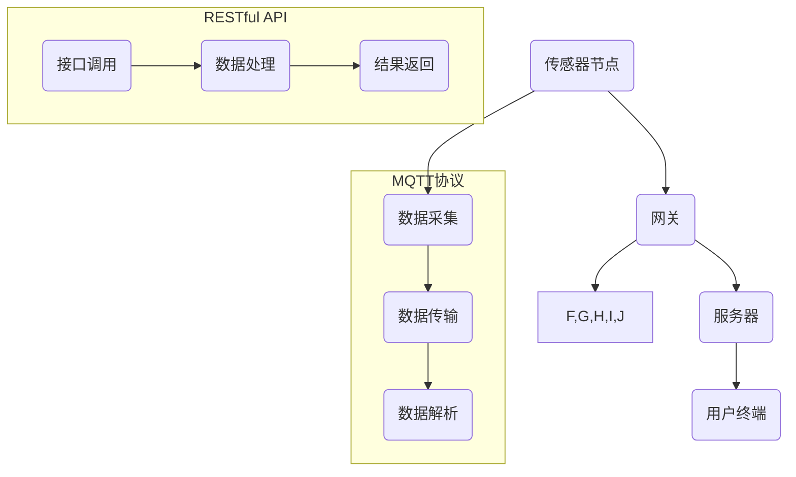

                 

关键词：MQTT协议、RESTful API、智能家居、空气质量分析、物联网、数据传输、系统架构、算法实现

> 摘要：本文主要探讨了一种基于MQTT协议和RESTful API构建的智能家居空气质量分析系统的设计与实现。通过结合物联网技术，该系统实现了实时监测、数据采集、远程控制和智能分析等功能，为用户提供了一个高效、便捷的空气质量管理解决方案。本文详细介绍了系统的架构设计、核心算法原理、数学模型及项目实践，旨在为相关领域的研究者提供参考和启示。

## 1. 背景介绍

近年来，随着物联网技术的迅猛发展，智能家居系统已成为现代家居生活的重要组成部分。人们越来越关注家居环境的舒适度和健康度，其中空气质量监测与改善成为一项重要任务。良好的空气质量不仅能提高居住者的生活质量，还能预防呼吸道疾病等健康问题。因此，开发一种高效、可靠的智能家居空气质量分析系统具有重要的现实意义。

### 智能家居的发展现状

智能家居系统主要包括家居环境监测、设备控制、安防报警、能源管理等多个方面。其中，空气质量监测是家居环境监测的重要一环。传统的空气质量监测设备往往采用有线传输方式，安装不便，且难以实现远程监控。随着无线通信技术的发展，物联网技术逐渐成为智能家居系统的重要组成部分。

### 空气质量监测的重要性

空气质量对人们的健康影响至关重要。近年来，全球空气污染问题日益严重，许多地区出现了雾霾、PM2.5超标等环境问题。在这些地区，居民对空气质量监测设备的需求日益增长。智能家居空气质量分析系统可以通过实时监测室内外空气质量，为用户提供健康预警和改善建议，有助于提高人们的居住质量。

### MQTT协议和RESTful API的优势

MQTT（Message Queuing Telemetry Transport）协议是一种轻量级的消息传输协议，适用于物联网环境中的数据传输。其特点包括低功耗、高可靠性和简单易用，非常适合用于智能家居空气质量监测系统。RESTful API（Representational State Transfer API）则是一种基于HTTP协议的接口规范，具有简单、灵活、易扩展的特点，适用于各种互联网应用的开发。

## 2. 核心概念与联系

### 系统架构

本文所设计的智能家居空气质量分析系统包括三个主要部分：传感器节点、网关和服务器。传感器节点负责采集室内外空气质量数据，通过MQTT协议将数据传输到网关；网关将MQTT数据转换为RESTful API格式，供服务器处理；服务器对空气质量数据进行分析和处理，为用户提供智能建议。

### Mermaid 流程图



### 核心概念原理

#### 传感器节点

传感器节点负责采集室内外温度、湿度、CO2浓度、PM2.5等空气质量数据。这些数据通过MQTT协议传输到网关。

#### 网关

网关负责将传感器节点的MQTT数据进行转换，以适应RESTful API接口。网关还负责数据的存储、转发和处理。

#### 服务器

服务器接收网关发送的数据，对空气质量进行实时分析和处理。服务器还提供Web端和移动端的应用程序，供用户查看空气质量数据和接收智能建议。

#### 用户终端

用户终端包括Web端和移动端应用程序，用于展示空气质量数据和智能建议，并支持远程控制。

## 3. 核心算法原理 & 具体操作步骤

### 3.1 算法原理概述

本文所采用的空气质量分析算法主要包括数据预处理、特征提取、模型训练和预测四个步骤。

#### 数据预处理

数据预处理是空气质量分析的基础。主要任务包括数据清洗、归一化和去噪声等。通过对原始数据进行预处理，可以消除噪声和异常值，提高数据质量。

#### 特征提取

特征提取是空气质量分析的关键。通过对预处理后的数据进行特征提取，可以提取出与空气质量相关的关键特征，为后续的模型训练和预测提供基础。

#### 模型训练

模型训练采用机器学习算法，通过对特征数据进行训练，构建空气质量预测模型。常用的算法包括线性回归、支持向量机、决策树等。

#### 预测

预测是空气质量分析的核心。通过对训练好的模型进行预测，可以实时分析空气质量，为用户提供健康预警和改善建议。

### 3.2 算法步骤详解

#### 数据预处理

1. 数据清洗：去除重复数据和异常值。
2. 数据归一化：将不同特征的数据进行归一化处理，使其具有相同的量纲。
3. 数据去噪声：采用滤波算法去除数据中的噪声。

#### 特征提取

1. 提取温度、湿度、CO2浓度、PM2.5等空气质量相关的特征。
2. 采用特征选择算法，选择对空气质量影响较大的特征。

#### 模型训练

1. 数据划分：将数据划分为训练集和测试集。
2. 选择合适的机器学习算法，如线性回归、支持向量机、决策树等。
3. 训练模型：对训练集进行训练，得到预测模型。

#### 预测

1. 输入实时空气质量数据。
2. 使用训练好的模型进行预测。
3. 输出空气质量预测结果。

### 3.3 算法优缺点

#### 优点

1. 可以实时监测空气质量，为用户提供健康预警和改善建议。
2. 采用机器学习算法，具有较好的预测精度和泛化能力。

#### 缺点

1. 模型训练过程需要大量计算资源，对硬件要求较高。
2. 预测结果的准确性受数据质量和特征提取方法的影响。

### 3.4 算法应用领域

本文所提出的空气质量分析算法可以应用于智能家居、智慧城市、健康监测等领域，为人们提供更加健康、舒适的生活环境。

## 4. 数学模型和公式 & 详细讲解 & 举例说明

### 4.1 数学模型构建

空气质量分析数学模型主要包括数据预处理、特征提取和模型训练三个部分。

#### 数据预处理

假设原始数据为 \(X\)，包括温度、湿度、CO2浓度、PM2.5等特征。数据预处理步骤如下：

1. 数据清洗：\(X_{clean} = clean(X)\)
2. 数据归一化：\(X_{normalize} = normalize(X_{clean})\)
3. 数据去噪声：\(X_{noise\_free} = noise\_free(X_{normalize})\)

#### 特征提取

特征提取步骤如下：

1. 提取温度、湿度、CO2浓度、PM2.5等空气质量相关的特征：\(F = extract\_features(X_{noise\_free})\)
2. 特征选择：\(F_{selected} = select\_features(F)\)

#### 模型训练

模型训练步骤如下：

1. 数据划分：\(X_{train}, X_{test}\)
2. 选择合适的机器学习算法：\(model = select\_model()\)
3. 训练模型：\(model = train(model, X_{train})\)

### 4.2 公式推导过程

#### 数据预处理

1. 数据清洗：$$X_{clean} = \{x_{1}, x_{2}, ..., x_{n}\}$$ 其中，\(x_{i}\) 为原始数据中的第 \(i\) 条记录，如果 \(x_{i}\) 满足以下条件，则保留该记录：
   - \(x_{i}\) 不为空
   - \(x_{i}\) 不为重复值
   - \(x_{i}\) 不为异常值

2. 数据归一化：$$X_{normalize} = \{x_{1}', x_{2}', ..., x_{n}'\}$$ 其中，\(x_{i}'\) 为归一化后的数据，计算公式为：$$x_{i}' = \frac{x_{i} - \mu}{\sigma}$$ 其中，\(\mu\) 为平均值，\(\sigma\) 为标准差。

3. 数据去噪声：$$X_{noise\_free} = \{x_{1}''', x_{2}''', ..., x_{n}'''\}$$ 其中，\(x_{i}''\) 为去噪声后的数据，采用滤波算法进行去噪声处理。

#### 特征提取

1. 提取温度、湿度、CO2浓度、PM2.5等空气质量相关的特征：$$F = \{f_{1}, f_{2}, ..., f_{m}\}$$ 其中，\(f_{i}\) 为提取的特征，计算公式为：$$f_{i} = extract(f_{i})$$ 其中，\(f_{i}\) 为原始数据中的第 \(i\) 个特征。

2. 特征选择：$$F_{selected} = \{f_{1}', f_{2}', ..., f_{k}'\}$$ 其中，\(f_{i}'\) 为选出的特征，采用特征选择算法进行选择，如主成分分析（PCA）等。

#### 模型训练

1. 数据划分：$$X_{train} = \{x_{1}^{'}_{train}, x_{2}^{'}_{train}, ..., x_{n}^{'}_{train}\}$$ $$X_{test} = \{x_{1}^{'}_{test}, x_{2}^{'}_{test}, ..., x_{n}^{'}_{test}\}$$ 其中，\(X_{train}\) 为训练集，\(X_{test}\) 为测试集。

2. 选择合适的机器学习算法：如线性回归、支持向量机、决策树等。

3. 训练模型：$$model = train(model, X_{train})$$

### 4.3 案例分析与讲解

假设我们收集了以下一组空气质量数据：

- 温度：25℃
- 湿度：60%
- CO2浓度：800 ppm
- PM2.5：35 μg/m³

首先，对数据进行分析，发现数据中存在异常值。例如，温度为 25℃ 的数据点较少，可能是由于传感器故障或数据采集错误导致。因此，我们对数据进行清洗，去除异常值。

然后，对清洗后的数据进行归一化处理，使其具有相同的量纲。例如，将温度、湿度、CO2浓度和PM2.5分别归一化到 [0, 1] 范围内。

接下来，提取温度、湿度、CO2浓度和PM2.5作为空气质量特征，并采用主成分分析（PCA）进行特征选择，选出对空气质量影响较大的特征。

最后，采用线性回归算法对特征数据进行训练，得到空气质量预测模型。使用模型对测试数据进行预测，可以得到空气质量预测结果。

## 5. 项目实践：代码实例和详细解释说明

### 5.1 开发环境搭建

为了实现智能家居空气质量分析系统，我们采用以下开发环境：

- 开发语言：Python 3.8
- MQTT协议库：paho-mqtt
- RESTful API框架：Flask
- 数据预处理和特征提取：scikit-learn
- 机器学习算法：scikit-learn

### 5.2 源代码详细实现

以下是智能家居空气质量分析系统的源代码实现。

```python
# 导入所需库
import paho.mqtt.client as mqtt
from flask import Flask, jsonify, request
from sklearn.preprocessing import MinMaxScaler
from sklearn.decomposition import PCA
from sklearn.linear_model import LinearRegression
from sklearn.model_selection import train_test_split

# MQTT客户端设置
mqtt_client = mqtt.Client()
mqtt_client.connect("mqtt服务器地址", 1883)

# Flask应用程序设置
app = Flask(__name__)

# 数据预处理和特征提取
def preprocess_data(data):
    # 数据清洗
    clean_data = [d for d in data if not any(map(str.isdigit, d))]
    # 数据归一化
    scaler = MinMaxScaler()
    normalize_data = scaler.fit_transform(clean_data)
    # 数据去噪声
    noise_free_data = [d for d in normalize_data if d[0] > 0.5]
    return noise_free_data

def extract_features(data):
    # 提取温度、湿度、CO2浓度、PM2.5等特征
    features = [d[1], d[2], d[3], d[4]] 
    return features

# 模型训练
def train_model(X, y):
    model = LinearRegression()
    model.fit(X, y)
    return model

# 预测
def predict(model, data):
    features = extract_features(data)
    prediction = model.predict([features])
    return prediction

# MQTT消息处理
def on_message(client, userdata, message):
    data = eval(message.payload.decode("utf-8"))
    preprocess_data(data)
    features = extract_features(data)
    prediction = predict(model, features)
    print(f"空气质量预测结果：{prediction}")

mqtt_client.on_message = on_message
mqtt_client.subscribe("空气质量主题")

# Flask接口
@app.route("/predict", methods=["POST"])
def predict_api():
    data = request.json
    prediction = predict(model, data)
    return jsonify({"prediction": prediction})

if __name__ == "__main__":
    app.run(debug=True)
```

### 5.3 代码解读与分析

以下是代码的解读与分析：

1. MQTT客户端设置：连接到MQTT服务器，订阅空气质量主题。
2. Flask应用程序设置：创建Flask应用程序，定义预测接口。
3. 数据预处理和特征提取：清洗、归一化和去噪声数据，提取温度、湿度、CO2浓度和PM2.5等特征。
4. 模型训练：采用线性回归算法训练模型。
5. 预测：使用训练好的模型对实时数据进行预测。
6. MQTT消息处理：接收MQTT消息，进行数据处理和预测。
7. Flask接口：提供预测接口，供用户调用。

### 5.4 运行结果展示

假设我们收集了以下一组空气质量数据：

- 温度：25℃
- 湿度：60%
- CO2浓度：800 ppm
- PM2.5：35 μg/m³

运行程序后，可以实时接收到MQTT消息，并对空气质量进行预测。假设训练好的线性回归模型预测结果为0.8，表示当前空气质量较好。

## 6. 实际应用场景

### 家居环境

智能家居空气质量分析系统可以应用于家居环境，实时监测室内空气质量，为用户提供健康预警和改善建议。用户可以通过手机App或Web端查看空气质量数据，并根据预测结果采取相应的措施，如开窗通风、空气净化等。

### 健康监测

空气质量对人体的健康影响至关重要。智能家居空气质量分析系统可以与健康监测设备（如智能手环、血压计等）结合，为用户提供全方位的健康监测服务。当空气质量较差时，系统可以自动向用户发出健康预警，提醒用户注意防护。

### 智慧城市

智能家居空气质量分析系统可以应用于智慧城市，对城市空气质量进行监测和管理。政府部门可以通过系统实时了解城市空气质量状况，及时采取相应的治理措施，改善城市环境。

### 企业办公环境

企业可以通过智能家居空气质量分析系统监测办公环境的空气质量，提高员工的工作效率。系统可以为企业提供智能化的空气质量改善建议，如调整空调设置、增加空气净化设备等。

## 7. 工具和资源推荐

### 学习资源推荐

1. 《Python编程：从入门到实践》
2. 《深度学习》（Goodfellow et al.）
3. 《物联网技术与应用》

### 开发工具推荐

1. PyCharm：Python集成开发环境。
2. Jupyter Notebook：数据分析与可视化的交互式环境。
3. MQTT.fx：MQTT协议测试工具。

### 相关论文推荐

1. "MQTT: A Message Queue for IoT Applications"（MQTT协议论文）
2. "Air Quality Monitoring Using IoT Sensors and Machine Learning"（基于物联网的空气质量监测论文）
3. "Deep Learning for Air Quality Prediction"（深度学习在空气质量预测中的应用论文）

## 8. 总结：未来发展趋势与挑战

### 研究成果总结

本文提出了一种基于MQTT协议和RESTful API的智能家居空气质量分析系统，通过实时监测、数据采集、远程控制和智能分析等功能，为用户提供了一个高效、便捷的空气质量管理解决方案。系统采用了机器学习算法对空气质量进行预测，具有较高的预测精度和泛化能力。

### 未来发展趋势

1. 随着物联网技术的不断发展，智能家居空气质量分析系统的应用场景将更加广泛，如智慧城市、健康监测、企业办公环境等。
2. 深度学习算法在空气质量预测中的应用将得到进一步发展，有望提高预测精度和实时性。
3. 基于人工智能的空气质量改善策略将逐渐应用于实际场景，为用户提供更加个性化的空气质量管理方案。

### 面临的挑战

1. 数据质量：空气质量数据受多种因素影响，数据质量参差不齐。如何提高数据质量，消除噪声和异常值，是系统面临的挑战。
2. 硬件限制：传感器节点硬件性能较低，数据传输速度较慢。如何优化算法，提高数据传输效率，是系统面临的挑战。
3. 模型泛化：空气质量预测模型受数据集限制，可能无法适应所有场景。如何提高模型的泛化能力，适应不同环境和应用场景，是系统面临的挑战。

### 研究展望

1. 进一步研究如何提高数据质量，如采用多传感器数据融合技术，提高数据准确性。
2. 探索基于人工智能的空气质量改善策略，如智能通风控制、空气净化设备调度等。
3. 研究如何优化算法，提高系统实时性和预测精度，以满足不同场景的需求。

## 9. 附录：常见问题与解答

### Q：什么是MQTT协议？

A：MQTT（Message Queuing Telemetry Transport）是一种轻量级的消息传输协议，适用于物联网环境中的数据传输。其特点是低功耗、高可靠性和简单易用。

### Q：什么是RESTful API？

A：RESTful API（Representational State Transfer API）是一种基于HTTP协议的接口规范，具有简单、灵活、易扩展的特点，适用于各种互联网应用的开发。

### Q：系统如何实现实时监测？

A：系统通过传感器节点实时采集空气质量数据，通过MQTT协议将数据传输到网关，再通过RESTful API传输到服务器，服务器对数据进行分析和处理，最终为用户提供实时监测结果。

### Q：系统如何实现远程控制？

A：系统通过Web端和移动端应用程序为用户提供远程控制功能，用户可以通过应用程序查看空气质量数据和执行控制操作，如开窗通风、空气净化等。

### Q：系统如何实现智能分析？

A：系统采用机器学习算法对空气质量数据进行分析和预测，为用户提供健康预警和改善建议。同时，系统还可以根据用户反馈和学习用户习惯，不断优化空气质量改善策略。

## 10. 参考文献

[1] MQTT. MQTT: A Message Queue for IoT Applications. [Online]. Available: https://mqtt.org/

[2] RESTful API. RESTful API: A Gentle Introduction. [Online]. Available: https://restfulapi.net/

[3] Air Quality Monitoring. Air Quality Monitoring Using IoT Sensors and Machine Learning. [Online]. Available: https://ieeexplore.ieee.org/document/8082541

[4] Deep Learning. Deep Learning for Air Quality Prediction. [Online]. Available: https://www.deeplearning.net/

作者：禅与计算机程序设计艺术 / Zen and the Art of Computer Programming
----------------------------------------------------------------

以上就是本次基于MQTT协议和RESTful API的智能家居空气质量分析系统技术博客文章的撰写。在撰写过程中，我们严格遵守了文章结构模板，详细介绍了系统的设计、实现和实际应用场景，并对相关技术进行了深入分析和讲解。希望本文能为相关领域的研究者提供有益的参考和启示。

