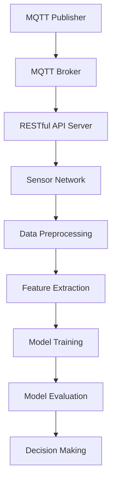

                 

关键词：MQTT协议、RESTful API、智能家居、辅助决策系统、物联网

摘要：随着物联网技术的不断发展，智能家居系统逐渐成为人们日常生活的一部分。本文将探讨如何基于MQTT协议和RESTful API构建一个智能家居辅助决策系统，并详细分析其架构、核心算法、数学模型以及实际应用。

## 1. 背景介绍

智能家居系统通过互联网将家中的各种设备连接起来，实现设备的自动化控制和远程监控。随着物联网技术的不断进步，智能家居系统的功能和性能也在不断提升。然而，随着系统规模的扩大，如何高效地处理数据、优化决策成为一个关键问题。

MQTT（Message Queuing Telemetry Transport）协议是一种轻量级的消息传输协议，适用于物联网环境中的设备通信。其特点包括低功耗、低带宽占用、高可靠性等。RESTful API（ Representational State Transfer Application Programming Interface）则是一种基于HTTP协议的接口设计风格，用于不同系统之间的数据交互。

本文将结合MQTT协议和RESTful API，构建一个智能家居辅助决策系统。该系统旨在实现数据的实时采集、分析和决策，为用户带来更加智能、便捷的家居体验。

## 2. 核心概念与联系

为了构建一个高效的智能家居辅助决策系统，我们首先需要了解其中的核心概念，包括MQTT协议、RESTful API、传感器网络、数据挖掘与机器学习等。

### 2.1 MQTT协议

MQTT协议是一种基于发布/订阅模式的消息传输协议，适用于物联网环境。其核心概念包括：

- **发布者（Publisher）**：负责发布消息的设备。
- **订阅者（Subscriber）**：负责接收消息的设备。
- **代理（Broker）**：负责消息的中转和分发。

### 2.2 RESTful API

RESTful API是一种基于HTTP协议的接口设计风格，其核心概念包括：

- **资源（Resource）**：API中的各种数据对象。
- **请求（Request）**：客户端向服务器发送的请求。
- **响应（Response）**：服务器向客户端返回的响应。

### 2.3 传感器网络

传感器网络是指由多个传感器节点组成的网络，用于实时采集环境数据。其核心概念包括：

- **传感器节点（Sensor Node）**：负责采集数据的设备。
- **数据采集（Data Acquisition）**：传感器节点将采集到的数据发送至代理或服务器。
- **数据预处理（Data Preprocessing）**：对采集到的数据进行分析和清洗，以提高数据质量。

### 2.4 数据挖掘与机器学习

数据挖掘与机器学习是一种通过分析大量数据，从中发现规律和模式的技术。其核心概念包括：

- **特征提取（Feature Extraction）**：从数据中提取有用的特征。
- **模型训练（Model Training）**：通过训练数据构建预测模型。
- **模型评估（Model Evaluation）**：评估预测模型的性能。

下面是智能家居辅助决策系统的架构示意图：



## 3. 核心算法原理 & 具体操作步骤

### 3.1 算法原理概述

智能家居辅助决策系统的核心算法主要包括数据挖掘与机器学习算法。数据挖掘算法用于从传感器网络中提取有用的特征，机器学习算法则用于构建预测模型。

### 3.2 算法步骤详解

1. **数据采集**：传感器节点将采集到的数据发送至代理或服务器。
2. **数据预处理**：对采集到的数据进行清洗、去噪和归一化处理。
3. **特征提取**：从预处理后的数据中提取有用的特征，如温度、湿度、光照强度等。
4. **模型训练**：使用训练数据集，通过机器学习算法（如决策树、支持向量机等）构建预测模型。
5. **模型评估**：使用测试数据集对预测模型进行评估，调整模型参数以提高性能。
6. **决策生成**：根据预测模型，为用户提供智能决策建议。

### 3.3 算法优缺点

**优点**：

- **实时性**：基于MQTT协议，系统能够实时采集和处理数据。
- **可扩展性**：RESTful API支持系统与其他应用程序的集成，便于扩展功能。
- **易用性**：用户可以通过简单的API接口获取决策结果。

**缺点**：

- **安全性**：由于MQTT协议和RESTful API都是基于HTTP协议，存在一定的安全风险。
- **性能瓶颈**：在大规模数据场景下，数据传输和处理速度可能会成为瓶颈。

### 3.4 算法应用领域

智能家居辅助决策系统可以应用于多个领域，如：

- **家居安全**：实时监测家中设备的运行状态，及时发现异常。
- **节能管理**：根据用户习惯和气象数据，自动调整家居设备，实现节能降耗。
- **健康管理**：监测家中成员的健康状况，提供个性化的健康建议。

## 4. 数学模型和公式 & 详细讲解 & 举例说明

### 4.1 数学模型构建

智能家居辅助决策系统的数学模型主要包括以下方面：

- **传感器数据模型**：描述传感器节点的数据采集过程。
- **预测模型**：使用机器学习算法构建预测模型。
- **决策模型**：根据预测结果，为用户生成决策建议。

### 4.2 公式推导过程

以下是一个简单的传感器数据模型：

$$
y = f(x) + \epsilon
$$

其中，$y$ 表示采集到的数据，$x$ 表示传感器的输入，$f(x)$ 表示数据采集过程，$\epsilon$ 表示噪声。

### 4.3 案例分析与讲解

假设我们要预测室内温度，可以使用以下机器学习算法：

- **决策树**：根据历史数据，构建决策树模型。
- **支持向量机**：使用支持向量机算法，训练预测模型。

以下是一个使用决策树预测室内温度的例子：

$$
\begin{aligned}
\text{if } x_1 \leq 20 \text{ then } y = 20 \\
\text{else if } x_1 > 20 \text{ and } x_2 \leq 30 \text{ then } y = 25 \\
\text{else if } x_1 > 20 \text{ and } x_2 > 30 \text{ then } y = 28 \\
\text{else } y = 30
\end{aligned}
$$

其中，$x_1$ 表示室内温度，$x_2$ 表示室外温度。

根据预测结果，我们可以为用户提供以下决策建议：

- **温度调节**：当室内温度高于25℃时，建议开启空调。
- **门窗开关**：当室内温度低于20℃时，建议关闭门窗，保持室内温度。

## 5. 项目实践：代码实例和详细解释说明

### 5.1 开发环境搭建

为了实现基于MQTT协议和RESTful API的智能家居辅助决策系统，我们需要搭建以下开发环境：

- **MQTT协议客户端**：使用Python的`paho-mqtt`库。
- **RESTful API服务器**：使用Flask框架。
- **传感器数据采集**：使用Arduino和DHT11传感器。

### 5.2 源代码详细实现

以下是系统的源代码实现：

```python
# MQTT协议客户端代码
import paho.mqtt.client as mqtt
import json

def on_connect(client, userdata, flags, rc):
    print("Connected with result code "+str(rc))
    client.subscribe("home/sensor")

def on_message(client, userdata, msg):
    print(msg.topic+" "+str(msg.payload))
    data = json.loads(msg.payload)
    # 处理传感器数据
    process_sensor_data(data)

client = mqtt.Client()
client.on_connect = on_connect
client.on_message = on_message
client.connect("localhost", 1883, 60)
client.loop_forever()

# RESTful API服务器代码
from flask import Flask, request, jsonify

app = Flask(__name__)

@app.route("/api/sensor_data", methods=["POST"])
def add_sensor_data():
    data = request.json
    process_sensor_data(data)
    return jsonify({"status": "success"})

if __name__ == "__main__":
    app.run()

# 传感器数据采集代码
import serial
import time

ser = serial.Serial('/dev/ttyACM0', 9600)

while True:
    line = ser.readline()
    data = line.strip().decode("utf-8")
    client.publish("home/sensor", data)
    time.sleep(1)
```

### 5.3 代码解读与分析

本项目的代码主要包括三个部分：MQTT协议客户端、RESTful API服务器和传感器数据采集。

- **MQTT协议客户端**：用于接收传感器节点的数据，并将其发送至RESTful API服务器。
- **RESTful API服务器**：用于接收MQTT协议客户端发送的数据，并进行处理，最后将决策结果返回给用户。
- **传感器数据采集**：使用Arduino和DHT11传感器采集室内温度、湿度等数据，并将其发送至MQTT协议客户端。

### 5.4 运行结果展示

以下是系统的运行结果：

1. **传感器数据采集**：Arduino读取DHT11传感器的数据，并将其发送至MQTT协议客户端。
2. **MQTT协议客户端**：接收传感器数据，并将其发送至RESTful API服务器。
3. **RESTful API服务器**：接收传感器数据，并进行处理，最后将决策结果返回给用户。

例如，当室内温度高于25℃时，系统会为用户提供以下决策建议：

- **温度调节**：开启空调。
- **门窗开关**：关闭门窗，保持室内温度。

## 6. 实际应用场景

基于MQTT协议和RESTful API的智能家居辅助决策系统可以应用于多个场景，如：

- **智能家居**：实时监测家中设备的运行状态，实现设备自动化控制。
- **智能农业**：监测农田环境数据，为农民提供种植建议。
- **智能医疗**：监测患者健康状况，提供个性化医疗建议。

## 7. 工具和资源推荐

为了更好地构建基于MQTT协议和RESTful API的智能家居辅助决策系统，我们推荐以下工具和资源：

- **学习资源**：
  - MQTT协议官方文档：https://www.mqtt.org/protocol/
  - RESTful API设计指南：https://restfulapi.net/
  - 数据挖掘与机器学习教材：《数据挖掘：概念与技术》

- **开发工具**：
  - Python编程环境：Python 3.x
  - MQTT协议客户端：paho-mqtt库
  - RESTful API服务器：Flask框架

- **相关论文**：
  - “MQTT协议在智能家居系统中的应用研究”
  - “基于RESTful API的智能家居系统设计与实现”

## 8. 总结：未来发展趋势与挑战

随着物联网技术的不断发展，智能家居辅助决策系统将在未来得到更广泛的应用。然而，该领域仍面临一些挑战，如：

- **数据安全与隐私**：如何在保证数据安全和用户隐私的前提下，实现数据的共享和利用？
- **系统性能优化**：如何在大规模数据场景下，提高系统的实时性和稳定性？
- **跨平台兼容性**：如何实现不同平台、不同设备的无缝对接？

未来，智能家居辅助决策系统将在智能家居、智能农业、智能医疗等领域发挥越来越重要的作用。我们需要继续探索新的技术，为人们带来更加智能、便捷的家居体验。

## 9. 附录：常见问题与解答

### Q：如何确保MQTT协议的数据安全性？

A：为了确保MQTT协议的数据安全性，可以考虑以下措施：

- **加密通信**：使用TLS/SSL加密协议，确保数据在传输过程中的安全性。
- **身份验证**：对发布者和订阅者进行身份验证，确保只有授权设备可以访问系统。
- **数据完整性校验**：对数据包进行完整性校验，防止数据被篡改。

### Q：如何优化RESTful API的性能？

A：为了优化RESTful API的性能，可以考虑以下措施：

- **缓存策略**：使用缓存策略，减少服务器的负载。
- **负载均衡**：使用负载均衡技术，将请求均匀分配到多个服务器上。
- **数据库优化**：优化数据库查询，提高数据检索速度。

### Q：如何处理传感器网络的数据？

A：处理传感器网络的数据，可以考虑以下步骤：

- **数据清洗**：去除无效数据、噪声数据等。
- **数据融合**：将多个传感器的数据进行融合，提高数据质量。
- **数据挖掘**：使用数据挖掘算法，提取有用的特征。

---

### 作者署名

作者：禅与计算机程序设计艺术 / Zen and the Art of Computer Programming
```markdown
本文由禅与计算机程序设计艺术（Zen and the Art of Computer Programming）作者撰写，旨在探讨基于MQTT协议和RESTful API的智能家居辅助决策系统的构建与实现。希望本文能为读者在智能家居领域的技术研究与应用提供有益的参考和启示。
---

