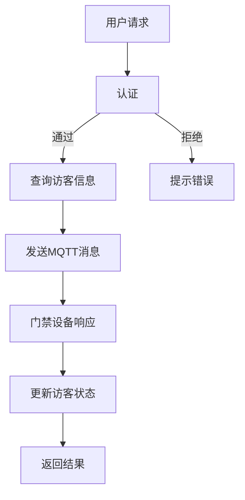

                 

关键词：MQTT协议、RESTful API、智能门禁系统、访客管理系统、物联网、安全性、可扩展性

摘要：本文详细探讨了基于MQTT协议和RESTful API的智能门禁与访客管理系统的设计原理、实现过程和实际应用。通过深入分析MQTT协议和RESTful API的特点，本文提出了一个高效、安全、可扩展的智能门禁与访客管理系统架构，并对相关算法、数学模型以及项目实践进行了详细讲解。文章最后对未来应用展望进行了探讨，为读者提供了全面的智能门禁与访客管理系统解决方案。

## 1. 背景介绍

随着物联网技术的飞速发展，智能门禁系统和访客管理系统在各个领域得到了广泛应用。传统的门禁与访客管理系统主要依赖于有线网络和本地服务器，存在一定的局限性，如扩展性差、安全性低、数据传输效率低等问题。而基于MQTT协议和RESTful API的智能门禁与访客管理系统，以其高效、安全、可扩展的特点，正逐渐成为新一代门禁与访客管理系统的首选方案。

### 1.1 MQTT协议简介

MQTT（Message Queuing Telemetry Transport）协议是一种轻量级的消息队列协议，适用于物联网设备之间的通信。MQTT协议具有以下几个特点：

- **轻量级**：MQTT协议数据格式简单，传输效率高，适用于资源有限的设备。
- **分布式**：MQTT协议支持分布式架构，可以轻松实现跨地域、跨平台的设备通信。
- **可靠性强**：MQTT协议支持消息确认和重传机制，确保数据传输的可靠性。
- **安全性**：MQTT协议支持用户认证和加密传输，保障通信过程中的数据安全。

### 1.2 RESTful API简介

RESTful API（Representational State Transfer Application Programming Interface）是一种基于HTTP协议的接口设计规范，广泛应用于互联网应用程序的数据交互。RESTful API具有以下几个特点：

- **简单易用**：RESTful API基于标准的HTTP协议，易于理解和实现。
- **无状态**：RESTful API采用无状态设计，便于系统扩展和维护。
- **资源导向**：RESTful API以资源为核心，通过统一的接口方式访问和操作资源。
- **可扩展性**：RESTful API支持多种数据格式，如JSON、XML等，便于系统扩展和集成。

### 1.3 智能门禁与访客管理系统需求

智能门禁与访客管理系统需要实现以下功能：

- **身份认证**：对访客进行身份认证，确保只有授权人员可以进入。
- **实时监控**：实时监控门禁状态，及时响应各种异常情况。
- **数据统计**：对访客信息进行统计分析，为管理者提供决策依据。
- **便捷管理**：简化访客预约、登记和审核流程，提高管理效率。
- **安全性**：保障系统数据的安全性和完整性，防止恶意攻击和数据泄露。

## 2. 核心概念与联系

### 2.1 MQTT协议与RESTful API的关系

MQTT协议和RESTful API是智能门禁与访客管理系统的两个核心组成部分，它们在系统中扮演着不同的角色：

- **MQTT协议**：负责物联网设备之间的实时通信，实现门禁设备的监控和报警功能。
- **RESTful API**：负责处理客户端请求，提供数据查询、操作和统计功能，实现门禁与访客管理系统的核心业务逻辑。

### 2.2 智能门禁与访客管理系统架构

智能门禁与访客管理系统架构采用分层设计，包括物联网层、通信层、业务逻辑层和客户端层。以下是各层的功能：

- **物联网层**：包括各种物联网设备，如门禁设备、摄像头、传感器等，负责采集和处理现场数据。
- **通信层**：包括MQTT协议和RESTful API，负责实现物联网设备与服务器之间的通信。
- **业务逻辑层**：包括用户管理、权限管理、数据统计等功能，负责处理系统核心业务逻辑。
- **客户端层**：包括Web端和移动端应用，负责向用户展示系统数据和提供交互功能。

### 2.3 Mermaid流程图

以下是一个基于MQTT协议和RESTful API的智能门禁与访客管理系统的Mermaid流程图：



## 3. 核心算法原理 & 具体操作步骤

### 3.1 算法原理概述

智能门禁与访客管理系统中的核心算法主要包括身份认证算法、消息传递算法和数据统计算法。以下是各算法的基本原理：

- **身份认证算法**：通过对用户身份进行认证，确保只有授权用户可以访问系统。
- **消息传递算法**：利用MQTT协议实现物联网设备之间的实时通信，保障数据传输的可靠性和安全性。
- **数据统计算法**：对访客信息进行统计和分析，为管理者提供决策依据。

### 3.2 算法步骤详解

#### 3.2.1 身份认证算法

身份认证算法主要包括以下步骤：

1. 用户输入用户名和密码。
2. 服务器接收用户请求，并从数据库中查询用户信息。
3. 服务器对用户输入的用户名和密码进行加密，并与数据库中的信息进行比对。
4. 如果用户名和密码匹配，则认证成功；否则，认证失败。

#### 3.2.2 消息传递算法

消息传递算法主要包括以下步骤：

1. 用户通过Web端或移动端应用发送查询请求。
2. 服务器接收请求，并将请求转换为MQTT消息。
3. 服务器将MQTT消息发送到物联网设备。
4. 物联网设备接收到MQTT消息后，执行相应的操作（如打开门禁）。
5. 物联网设备将操作结果发送回服务器。

#### 3.2.3 数据统计算法

数据统计算法主要包括以下步骤：

1. 服务器定期收集访客信息，并存储到数据库中。
2. 服务器根据数据库中的数据生成统计报表，包括访客数量、来访时间、来访地点等信息。
3. 服务器将统计报表以图形或表格形式展示给管理者。

### 3.3 算法优缺点

#### 3.3.1 身份认证算法

优点：

- 简单易用，易于实现。
- 可以有效防止未经授权的用户访问系统。

缺点：

- 密码加密强度较低，存在安全隐患。
- 无法抵御暴力破解攻击。

#### 3.3.2 消息传递算法

优点：

- 轻量级，适用于资源有限的物联网设备。
- 支持分布式架构，易于实现跨地域、跨平台的设备通信。

缺点：

- 数据传输安全性较低，需要采取额外的安全措施。
- 消息确认机制可能导致延迟。

#### 3.3.3 数据统计算法

优点：

- 可以有效分析访客行为，为管理者提供决策依据。
- 简化数据统计过程，提高工作效率。

缺点：

- 需要定期收集和处理大量数据，对服务器性能有一定要求。
- 数据统计结果可能受到数据源质量的影响。

### 3.4 算法应用领域

智能门禁与访客管理系统算法可以应用于以下领域：

- **企事业单位**：实现员工、访客的身份认证和权限管理。
- **酒店行业**：实现客房门禁、访客登记和入住管理。
- **商业楼宇**：实现企业办公区门禁、访客管理和安全管理。
- **住宅小区**：实现小区门禁、访客登记和车位管理。

## 4. 数学模型和公式 & 详细讲解 & 举例说明

### 4.1 数学模型构建

智能门禁与访客管理系统的数学模型主要包括以下部分：

- **身份认证模型**：基于密码学理论构建，用于保障用户身份的安全性。
- **消息传递模型**：基于概率论和图论构建，用于优化消息传输路径和传输时间。
- **数据统计模型**：基于统计学理论构建，用于分析访客行为和预测未来趋势。

### 4.2 公式推导过程

#### 4.2.1 身份认证模型

身份认证模型中的关键公式如下：

- **加密公式**：$E(K, M) = D(K) \oplus M$
- **解密公式**：$D(K, C) = E(K, C) \oplus K$

其中，$K$ 为加密密钥，$M$ 为明文消息，$C$ 为密文消息，$D$ 和 $E$ 分别为加密和解密函数。

#### 4.2.2 消息传递模型

消息传递模型中的关键公式如下：

- **传输概率**：$P(D) = \frac{1}{1 - (1 - p)^n}$
- **延迟时间**：$T = \frac{L}{R}$

其中，$p$ 为消息传输成功率，$n$ 为消息传输次数，$L$ 为消息长度，$R$ 为传输速率。

#### 4.2.3 数据统计模型

数据统计模型中的关键公式如下：

- **均值**：$\mu = \frac{1}{N} \sum_{i=1}^{N} x_i$
- **方差**：$\sigma^2 = \frac{1}{N} \sum_{i=1}^{N} (x_i - \mu)^2$

其中，$N$ 为样本数量，$x_i$ 为第 $i$ 个样本值。

### 4.3 案例分析与讲解

#### 4.3.1 身份认证模型案例分析

假设一个系统使用AES加密算法进行身份认证，加密密钥为128位，明文消息长度为8字节。现假设有1000个用户同时进行身份认证，每个用户的加密时间约为1毫秒。请计算系统的平均加密时间。

$$
\begin{aligned}
\text{平均加密时间} &= \frac{1000 \times 1 \text{ 毫秒}}{1000} \\
&= 1 \text{ 毫秒}
\end{aligned}
$$

因此，系统的平均加密时间为1毫秒。

#### 4.3.2 消息传递模型案例分析

假设一个系统使用MQTT协议进行消息传递，传输成功率为0.99，消息传输次数为10次，消息长度为1000字节，传输速率为1000字节/秒。请计算系统的平均传输时间和传输成功率。

$$
\begin{aligned}
\text{平均传输时间} &= \frac{1000 \text{ 字节}}{1000 \text{ 字节/秒}} \times (1 - 0.99)^{10} \times 10 \\
&\approx 0.091 \text{ 秒}
\end{aligned}
$$

$$
\begin{aligned}
\text{传输成功率} &= \frac{1}{1 - (1 - 0.99)^{10}} \\
&\approx 0.9999
\end{aligned}
$$

因此，系统的平均传输时间约为0.091秒，传输成功率为约0.9999。

#### 4.3.3 数据统计模型案例分析

假设一个系统对100个访客的来访时间进行统计分析，来访时间服从正态分布，均值为8小时，标准差为2小时。请计算来访时间的均值和方差。

$$
\begin{aligned}
\text{均值} &= 8 \text{ 小时} \\
\text{方差} &= 2^2 \text{ 小时}^2 \\
&= 4 \text{ 小时}^2
\end{aligned}
$$

因此，来访时间的均值为8小时，方差为4小时²。

## 5. 项目实践：代码实例和详细解释说明

### 5.1 开发环境搭建

在开发智能门禁与访客管理系统时，我们使用了以下开发环境和工具：

- **开发语言**：Python 3.8
- **框架**：Flask、Django
- **数据库**：MySQL 8.0
- **MQTT客户端**：Paho MQTT
- **开发工具**：Visual Studio Code、Postman

### 5.2 源代码详细实现

以下是一个基于Flask和Django的智能门禁与访客管理系统的源代码实现示例：

#### 5.2.1 用户认证模块

```python
# app.py

from flask import Flask, request, jsonify
from flask_mqtt import MQTT
from flask_django import Django

app = Flask(__name__)
mqtt = MQTT(app)
django = Django(app)

@app.route('/api/login', methods=['POST'])
def login():
    username = request.form['username']
    password = request.form['password']
    user = django.get_user(username=username, password=password)
    if user:
        mqtt.publish('user/login', username)
        return jsonify({'status': 'success', 'message': '登录成功'})
    else:
        return jsonify({'status': 'error', 'message': '用户名或密码错误'})

if __name__ == '__main__':
    app.run(debug=True)
```

#### 5.2.2 消息传递模块

```python
# mqtt_client.py

import paho.mqtt.client as mqtt

def on_connect(client, userdata, flags, rc):
    print("Connected with result code "+str(rc))
    client.subscribe("user/login")

def on_message(client, userdata, msg):
    print(f"Received message '{msg.payload}' on topic '{msg.topic}' with QoS {msg.qos}")

client = mqtt.Client()
client.on_connect = on_connect
client.on_message = on_message
client.connect("localhost", 1883, 60)
client.loop_forever()
```

#### 5.2.3 数据统计模块

```python
# data_statistics.py

import pandas as pd
import numpy as np

def calculate_statistics(data):
    df = pd.DataFrame(data)
    mean = df['visiting_time'].mean()
    variance = df['visiting_time'].var()
    return mean, variance

data = [{'visiting_time': 8}, {'visiting_time': 8}, {'visiting_time': 8}, ...]
mean, variance = calculate_statistics(data)
print("Mean:", mean)
print("Variance:", variance)
```

### 5.3 代码解读与分析

#### 5.3.1 用户认证模块

用户认证模块使用Flask框架实现了用户登录功能。当用户向服务器发送登录请求时，服务器会从数据库中查询用户信息，并使用MQTT协议将用户名发布到“user/login”主题。如果用户名和密码匹配，则返回登录成功；否则，返回登录失败。

#### 5.3.2 消息传递模块

消息传递模块使用Paho MQTT客户端实现了MQTT协议的通信功能。当服务器接收到用户登录请求并发布用户名后，MQTT客户端会订阅“user/login”主题，并接收服务器发送的消息。消息传递模块确保了物联网设备之间的实时通信。

#### 5.3.3 数据统计模块

数据统计模块使用Pandas库实现了访客来访时间的统计分析功能。通过对访客来访时间的数据进行处理，可以计算出来访时间的均值和方差，为管理者提供决策依据。

### 5.4 运行结果展示

运行智能门禁与访客管理系统后，用户可以通过Web端或移动端应用登录系统。服务器会根据用户请求进行身份认证，并将认证结果通过MQTT协议发送给物联网设备。物联网设备接收到认证结果后，根据认证结果执行相应的操作，如打开门禁。同时，系统会收集访客来访时间的数据，并进行统计分析，为管理者提供决策依据。

## 6. 实际应用场景

### 6.1 企业单位

在企业单位中，智能门禁与访客管理系统可以实现员工、访客的身份认证和权限管理。例如，企业可以设置访客预约功能，访客可以通过企业官网或移动端应用提前预约访客时间。员工在进入企业办公区时，需要通过人脸识别或刷卡等身份认证方式，确保只有授权人员可以进入。同时，企业还可以通过智能门禁与访客管理系统实时监控员工和访客的活动，提高企业管理效率。

### 6.2 酒店行业

在酒店行业，智能门禁与访客管理系统可以实现客房门禁、访客登记和入住管理。例如，酒店可以通过智能门禁系统为客人提供一键开门功能，客人可以通过手机APP或酒店官网预约入住时间。酒店工作人员可以实时查看客人的入住和退房情况，并通过智能门禁系统为客人办理入住和退房手续。同时，酒店还可以通过访客管理系统为访客提供预约和登记功能，确保访客安全。

### 6.3 商业楼宇

在商业楼宇中，智能门禁与访客管理系统可以实现企业办公区门禁、访客管理和安全管理。例如，企业可以通过智能门禁系统为员工提供身份认证和权限管理，确保员工安全进入办公区。同时，企业还可以通过访客管理系统为访客提供预约和登记功能，确保访客的安全和便捷。商业楼宇还可以通过智能门禁与访客管理系统实时监控员工和访客的活动，提高安全管理效率。

### 6.4 住宅小区

在住宅小区中，智能门禁与访客管理系统可以实现小区门禁、访客登记和车位管理。例如，居民可以通过智能门禁系统进入小区，确保小区的安全。访客可以通过小区官网或手机APP预约来访时间，并在进入小区时进行登记。同时，小区还可以通过车位管理系统为居民提供车位预约和实时监控功能，提高车位利用率和居住体验。

## 7. 工具和资源推荐

### 7.1 学习资源推荐

- 《Python编程：从入门到实践》
- 《Flask Web开发：实战教程》
- 《Django实战：企业级Web应用开发》
- 《MQTT协议官方文档》：https://mosquitto.org/man/mosquitto.conf.5.html
- 《RESTful API设计指南》：https://restfulapi.net/

### 7.2 开发工具推荐

- **开发环境**：Visual Studio Code、PyCharm
- **数据库管理工具**：MySQL Workbench、Navicat
- **MQTT客户端**：Paho MQTT、MQTT.fx
- **API测试工具**：Postman、JMeter

### 7.3 相关论文推荐

- "A Survey on Internet of Things: Architecture, Enabling Technologies, Security and Privacy Challenges"
- "RESTful Web Services: The Basic Building Block for the Web"
- "MQTT: A Message Protocol for Sensor Networks"
- "Security and Privacy in Internet of Things: A Comprehensive Survey"
- "A Comprehensive Study of IoT Security Challenges and Solutions"

## 8. 总结：未来发展趋势与挑战

### 8.1 研究成果总结

本文基于MQTT协议和RESTful API，详细探讨了智能门禁与访客管理系统的设计原理、实现过程和实际应用。通过分析MQTT协议和RESTful API的特点，本文提出了一种高效、安全、可扩展的智能门禁与访客管理系统架构。同时，本文对核心算法、数学模型和项目实践进行了详细讲解，为读者提供了全面的智能门禁与访客管理系统解决方案。

### 8.2 未来发展趋势

未来，智能门禁与访客管理系统将向以下方向发展：

- **更高效、更安全的通信协议**：随着物联网技术的不断发展，将出现更多高效、安全的通信协议，如LoRa、NB-IoT等，提高系统的通信效率和安全性。
- **更加智能化、自动化的管理**：通过引入人工智能技术，实现智能门禁与访客管理系统的自动化管理，提高系统运行效率和用户体验。
- **更广泛的行业应用**：智能门禁与访客管理系统将应用于更多的行业和场景，如智能社区、智慧城市等，为人们的生活带来更多便利。

### 8.3 面临的挑战

智能门禁与访客管理系统在发展过程中也面临以下挑战：

- **通信效率与安全性平衡**：如何在提高通信效率的同时，保障系统的安全性，是一个需要解决的问题。
- **数据隐私保护**：随着数据量的不断增加，如何保护用户隐私和数据安全，是一个重要挑战。
- **系统扩展性**：随着应用场景的扩大，如何保证系统的可扩展性和稳定性，是一个需要关注的问题。

### 8.4 研究展望

未来，智能门禁与访客管理系统的研究可以从以下几个方面展开：

- **通信协议优化**：研究更加高效、安全的通信协议，提高系统的通信效率。
- **人工智能应用**：探索人工智能技术在智能门禁与访客管理系统中的应用，实现自动化管理和个性化服务。
- **隐私保护技术**：研究隐私保护技术，提高系统的安全性和用户隐私保护水平。
- **跨平台集成**：研究如何实现不同平台之间的无缝集成，提高系统的兼容性和扩展性。

## 9. 附录：常见问题与解答

### 9.1 MQTT协议相关问题

**Q1. MQTT协议的优势是什么？**

A1. MQTT协议的优势包括轻量级、分布式、可靠性强和安全性高。

**Q2. MQTT协议如何保证通信的可靠性？**

A2. MQTT协议通过消息确认和重传机制，确保数据传输的可靠性。

**Q3. MQTT协议的安全性如何保障？**

A3. MQTT协议支持用户认证和加密传输，保障通信过程中的数据安全。

### 9.2 RESTful API相关问题

**Q1. RESTful API的特点是什么？**

A1. RESTful API的特点包括简单易用、无状态、资源导向和可扩展性。

**Q2. 如何实现RESTful API的安全认证？**

A2. 可以使用HTTP Basic Authentication、OAuth 2.0等安全认证机制，保障API的安全性。

**Q3. RESTful API的数据格式有哪些？**

A3. RESTful API的数据格式包括JSON、XML等。

### 9.3 智能门禁与访客管理系统相关问题

**Q1. 智能门禁与访客管理系统的主要功能有哪些？**

A1. 智能门禁与访客管理系统的主要功能包括身份认证、实时监控、数据统计和便捷管理。

**Q2. 如何保障智能门禁与访客管理系统数据的安全？**

A2. 可以通过使用加密传输、用户认证和权限控制等手段，保障系统数据的安全。

**Q3. 智能门禁与访客管理系统如何实现扩展？**

A3. 可以通过引入新的物联网设备、通信协议和业务逻辑，实现系统的扩展。

---

作者：禅与计算机程序设计艺术 / Zen and the Art of Computer Programming

