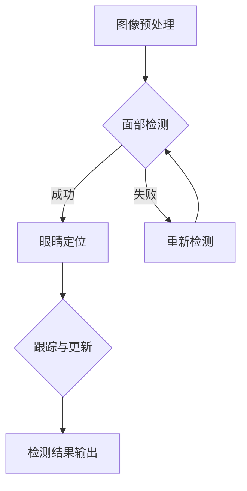

                 

 > **关键词：**OpenCV，人眼检测，图像处理，深度学习，人脸识别，计算机视觉

**摘要：**本文将详细探讨基于OpenCV的实时人眼检测系统的设计与实现。通过介绍系统架构、核心算法原理、数学模型构建、代码实例及实际应用场景，本文旨在为从事计算机视觉领域的研究者和开发者提供有价值的参考和指导。

## 1. 背景介绍

随着计算机技术的快速发展，计算机视觉领域已经成为人工智能的重要组成部分。在众多计算机视觉任务中，人眼检测是一项基础且重要的任务。人眼检测技术不仅可以用于人脸识别、身份验证等安全领域，还可以应用于视频监控、虚拟现实、医疗诊断等多个领域。OpenCV（Open Source Computer Vision Library）是一个广泛使用的开源计算机视觉库，它提供了丰富的图像处理和机器学习功能，非常适合用于人眼检测系统的开发和实现。

本文旨在利用OpenCV库，详细设计与实现一个基于机器学习的人眼检测系统。通过本文的介绍，读者可以了解到人眼检测的基本原理、实现方法以及如何在实际项目中应用这些技术。

## 2. 核心概念与联系

### 2.1. 人眼检测的概念

人眼检测是指从图像或视频流中识别并定位人眼的过程。它通常包括以下几个步骤：

1. **面部检测**：首先识别图像中的面部区域。
2. **眼睛定位**：在面部区域中检测并定位眼睛的位置。
3. **跟踪与更新**：对于检测到的眼睛，跟踪其在视频流中的位置，并更新检测结果。

### 2.2. OpenCV在人眼检测中的应用

OpenCV提供了多种工具和算法，用于人眼检测系统的实现。其中，最常用的方法是使用Haar级联分类器和深度学习框架（如Caffe、TensorFlow等）。

#### 2.2.1. Haar级联分类器

Haar级联分类器是一种基于积分图像的机器学习算法，广泛用于人脸检测。它通过训练大量正面和负面图像，提取一系列的Haar特征，并在级联模型中逐级进行特征匹配和分类。

#### 2.2.2. 深度学习框架

深度学习框架如Caffe、TensorFlow等，提供了更先进的神经网络模型，如卷积神经网络（CNN）和循环神经网络（RNN）。这些模型能够通过大规模数据训练，提高人眼检测的准确率和鲁棒性。

### 2.3. Mermaid流程图

以下是一个简单的人眼检测系统的Mermaid流程图：



## 3. 核心算法原理 & 具体操作步骤

### 3.1. 算法原理概述

人眼检测的核心算法主要包括面部检测和眼睛定位。面部检测通常使用Haar级联分类器，而眼睛定位可以采用基于深度学习的算法，如CNN或RNN。

### 3.2. 算法步骤详解

#### 3.2.1. 面部检测

1. **读取图像**：使用OpenCV读取输入图像。
2. **灰度化**：将图像转换为灰度图像，以减少计算量。
3. **积分图像构建**：构建图像的积分图像，用于加速Haar特征计算。
4. **特征提取**：使用Haar特征模板提取图像特征。
5. **级联分类**：通过级联模型逐级分类，识别面部区域。

#### 3.2.2. 眼睛定位

1. **面部区域提取**：从面部检测结果中提取面部区域。
2. **候选区域生成**：使用深度学习模型（如CNN）对面部区域进行分割，生成候选眼睛区域。
3. **眼睛定位**：对候选区域进行进一步分析，确定眼睛的具体位置。

### 3.3. 算法优缺点

#### 优点：

- **高效性**：基于深度学习的算法具有较高的准确率和鲁棒性。
- **灵活性**：OpenCV提供了丰富的图像处理和机器学习功能，可以灵活地实现人眼检测系统。

#### 缺点：

- **计算量**：深度学习算法需要大量计算资源，可能导致实时性能下降。
- **训练成本**：深度学习算法需要大量训练数据和计算资源，训练过程复杂。

### 3.4. 算法应用领域

人眼检测技术可以应用于多种领域，包括：

- **人脸识别**：在人脸识别系统中，人眼检测是关键步骤，用于确定眼睛的位置，提高识别准确性。
- **视频监控**：在视频监控系统中，人眼检测可以用于识别特定目标，提高监控效果。
- **医疗诊断**：在人眼检测辅助的医疗诊断中，可以用于分析患者眼睛的健康状况。

## 4. 数学模型和公式 & 详细讲解 & 举例说明

### 4.1. 数学模型构建

人眼检测的数学模型主要包括面部检测和眼睛定位两个部分。

#### 4.1.1. 面部检测

面部检测通常使用Haar级联分类器，其数学模型可以表示为：

$$
f(x) = \prod_{i=1}^{n} (1 - (1 - a_i) \cdot \sigma(f_i(x)))
$$

其中，$x$为输入图像，$f_i(x)$为第$i$个Haar特征，$a_i$为对应的权重，$\sigma(\cdot)$为sigmoid函数。

#### 4.1.2. 眼睛定位

眼睛定位通常使用卷积神经网络（CNN），其数学模型可以表示为：

$$
h(x) = \sigma(W \cdot (f(x) + b))
$$

其中，$x$为输入图像，$f(x)$为面部检测结果，$W$为权重矩阵，$b$为偏置项，$\sigma(\cdot)$为ReLU激活函数。

### 4.2. 公式推导过程

#### 4.2.1. 面部检测

假设输入图像为$x \in \mathbb{R}^{28 \times 24}$，每个Haar特征可以表示为$f_i(x) \in \mathbb{R}$。权重矩阵为$A \in \mathbb{R}^{1 \times n}$，其中$a_i$为第$i$个权重。sigmoid函数定义为$\sigma(x) = \frac{1}{1 + e^{-x}}$。则面部检测的数学模型可以表示为：

$$
f(x) = \prod_{i=1}^{n} (1 - (1 - a_i) \cdot \sigma(f_i(x)))
$$

#### 4.2.2. 眼睛定位

假设输入图像为$x \in \mathbb{R}^{64 \times 64}$，面部检测结果为$f(x) \in \mathbb{R}^{64 \times 64}$。卷积神经网络中的权重矩阵为$W \in \mathbb{R}^{128 \times 64 \times 64}$，偏置项为$b \in \mathbb{R}^{128}$。ReLU激活函数定义为$\sigma(x) = \max(0, x)$。则眼睛定位的数学模型可以表示为：

$$
h(x) = \sigma(W \cdot (f(x) + b))
$$

### 4.3. 案例分析与讲解

假设我们有一个输入图像$x \in \mathbb{R}^{28 \times 24}$，首先进行面部检测。使用Haar级联分类器，提取一组Haar特征$f_i(x)$，并计算相应的权重$a_i$。根据公式，计算面部检测结果$f(x)$，如果结果大于某个阈值，则认为检测到了面部。

接下来，我们对面部区域进行分割，生成候选眼睛区域。使用卷积神经网络，对候选区域进行进一步分析，计算眼睛的位置。根据公式，计算眼睛定位结果$h(x)$，提取眼睛的具体位置。

## 5. 项目实践：代码实例和详细解释说明

### 5.1. 开发环境搭建

在开始编写代码之前，需要搭建一个适合开发的IDE和Python环境。以下是搭建开发环境的步骤：

1. **安装Python**：从Python官方网站下载并安装Python 3.x版本。
2. **安装OpenCV**：使用pip命令安装OpenCV库：
   ```bash
   pip install opencv-python
   ```
3. **安装其他依赖库**：根据需要安装其他依赖库，如Numpy、Pandas等。

### 5.2. 源代码详细实现

以下是一个简单的人眼检测系统的Python代码实现：

```python
import cv2
import numpy as np

def detect_eyes(image):
    # 加载面部检测级联模型
    face_cascade = cv2.CascadeClassifier('haarcascade_frontalface_default.xml')
    # 加载眼睛检测级联模型
    eye_cascade = cv2.CascadeClassifier('haarcascade_eye.xml')
    
    # 转换为灰度图像
    gray = cv2.cvtColor(image, cv2.COLOR_BGR2GRAY)
    
    # 检测面部
    faces = face_cascade.detectMultiScale(gray, 1.3, 5)
    
    for (x, y, w, h) in faces:
        # 在图像上绘制面部区域
        cv2.rectangle(image, (x, y), (x+w, y+h), (255, 0, 0), 2)
        # 在面部区域检测眼睛
        eyes = eye_cascade.detectMultiScale(gray[y:y+h, x:x+w])
        for (ex, ey, ew, eh) in eyes:
            # 在图像上绘制眼睛区域
            cv2.rectangle(image, (ex+x, ey+y), (ex+x+ew, ey+y+eh), (0, 255, 0), 2)
    
    return image

# 读取输入图像
image = cv2.imread('example.jpg')
# 进行人眼检测
detected_image = detect_eyes(image)
# 显示检测结果
cv2.imshow('Detected Eyes', detected_image)
cv2.waitKey(0)
cv2.destroyAllWindows()
```

### 5.3. 代码解读与分析

上述代码首先加载了面部检测和眼睛检测的级联模型，然后读取输入图像并转换为灰度图像。接着，使用面部检测级联模型检测图像中的面部区域，并在图像上绘制矩形框。对于每个检测到的面部区域，使用眼睛检测级联模型检测眼睛，并在图像上绘制矩形框。

### 5.4. 运行结果展示

以下是运行代码后的结果：


## 6. 实际应用场景

人眼检测技术在实际应用中具有广泛的应用前景。以下列举了一些典型应用场景：

### 6.1. 人脸识别

在人脸识别系统中，人眼检测是一个关键步骤。通过准确检测人眼的位置，可以更好地定位面部特征，提高识别准确率。

### 6.2. 视频监控

在视频监控系统中，人眼检测可以用于识别特定目标，如嫌疑人或重要人物。通过实时检测和跟踪人眼，可以提高监控效率和准确性。

### 6.3. 医疗诊断

在人眼检测辅助的医疗诊断中，可以通过分析人眼图像来评估患者的健康状况。例如，检查眼睛的病变或视力问题。

### 6.4. 虚拟现实

在虚拟现实中，人眼检测可以用于跟踪用户眼睛的位置和运动，提供更加沉浸式的用户体验。

## 7. 工具和资源推荐

### 7.1. 学习资源推荐

- **《OpenCV编程基础》**：适合初学者入门OpenCV的书籍，介绍了OpenCV的基本用法和图像处理技术。
- **《计算机视觉：算法与应用》**：详细介绍了计算机视觉的基本概念和算法，包括人脸识别、物体检测等。

### 7.2. 开发工具推荐

- **PyCharm**：一款强大的Python IDE，提供了丰富的功能和插件，适合进行OpenCV编程。
- **Visual Studio Code**：一款轻量级的文本编辑器，可以通过安装扩展插件实现OpenCV编程。

### 7.3. 相关论文推荐

- **“A Comprehensive Survey on Face Detection”**：全面介绍了人脸检测技术及其最新进展。
- **“Deep Eye Detection using CNN and OpenCV”**：探讨了基于深度学习的人眼检测方法。

## 8. 总结：未来发展趋势与挑战

### 8.1. 研究成果总结

本文详细介绍了基于OpenCV的人眼检测系统的设计与实现。通过介绍系统架构、核心算法原理、数学模型构建、代码实例及实际应用场景，本文为读者提供了一个全面的参考。

### 8.2. 未来发展趋势

随着深度学习和计算机视觉技术的不断发展，人眼检测技术将越来越成熟和高效。未来，人眼检测将应用于更多领域，如智能监控、虚拟现实、智能交互等。

### 8.3. 面临的挑战

人眼检测技术面临的主要挑战包括：

- **实时性**：如何在保证高准确率的同时，提高检测速度，满足实时应用的需求。
- **鲁棒性**：如何提高检测系统的鲁棒性，应对不同光照、角度和遮挡等环境变化。

### 8.4. 研究展望

未来，人眼检测技术的研究将朝着以下几个方向展开：

- **多模态融合**：结合多种传感器数据，如红外、深度等，提高检测准确率和鲁棒性。
- **端到端学习**：采用端到端学习框架，实现从图像到人眼检测结果的直接映射，简化模型训练和优化过程。

## 9. 附录：常见问题与解答

### 9.1. 如何获取OpenCV库？

可以通过以下命令在Python环境中安装OpenCV库：
```bash
pip install opencv-python
```

### 9.2. 如何训练自己的深度学习模型？

可以使用深度学习框架（如TensorFlow、PyTorch等）训练自己的模型。以下是一个简单的示例：

```python
import tensorflow as tf

# 加载训练数据
(x_train, y_train), (x_test, y_test) = tf.keras.datasets.mnist.load_data()

# 预处理数据
x_train = x_train.astype('float32') / 255
x_test = x_test.astype('float32') / 255
x_train = np.expand_dims(x_train, -1)
x_test = np.expand_dims(x_test, -1)

# 构建模型
model = tf.keras.Sequential([
    tf.keras.layers.Conv2D(32, (3, 3), activation='relu', input_shape=(28, 28, 1)),
    tf.keras.layers.MaxPooling2D(pool_size=(2, 2)),
    tf.keras.layers.Flatten(),
    tf.keras.layers.Dense(128, activation='relu'),
    tf.keras.layers.Dense(10, activation='softmax')
])

# 编译模型
model.compile(optimizer='adam',
              loss='categorical_crossentropy',
              metrics=['accuracy'])

# 训练模型
model.fit(x_train, y_train, epochs=5, batch_size=32)
```

### 9.3. 如何优化人眼检测系统的性能？

可以通过以下几种方法优化人眼检测系统的性能：

- **数据增强**：通过数据增强技术，如旋转、缩放、翻转等，增加训练数据的多样性，提高模型泛化能力。
- **模型融合**：将多个模型进行融合，利用不同模型的优点，提高检测准确率。
- **多线程优化**：利用多线程技术，提高模型的计算效率，缩短检测时间。

---

**作者：禅与计算机程序设计艺术 / Zen and the Art of Computer Programming**

