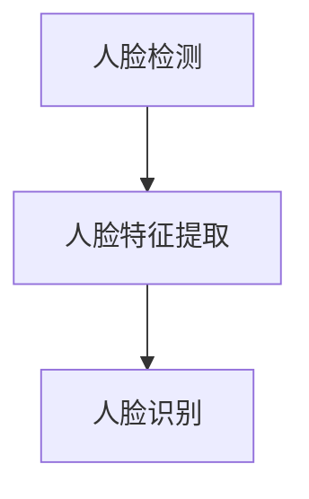

                 

关键词：人脸识别、TensorFlow、机器学习、神经网络、深度学习、人脸特征提取、数据预处理、模型训练与评估

> 摘要：本文旨在深入探讨基于TensorFlow的人脸识别技术。通过详细分析人脸识别的核心概念、算法原理、数学模型以及项目实践，本文将展示如何利用TensorFlow实现高效的人脸识别系统，并探讨其在实际应用中的潜力和挑战。

## 1. 背景介绍

人脸识别技术作为生物特征识别技术之一，在安全、金融、社交、医疗等多个领域有着广泛的应用。传统的图像识别方法通常依赖于手工设计的特征提取算法，而随着深度学习的兴起，基于深度学习的人脸识别技术取得了显著的突破。

TensorFlow是Google开发的一款开源深度学习框架，因其灵活、高效、易于使用等特点，成为了深度学习研究和应用的热门选择。本文将基于TensorFlow，详细阐述人脸识别的算法原理、实现步骤以及应用场景。

## 2. 核心概念与联系

### 2.1 人脸识别核心概念

- **人脸检测**：定位图像中的人脸区域。
- **人脸特征提取**：从人脸图像中提取特征向量，用于后续的识别。
- **人脸识别**：根据提取的人脸特征，匹配数据库中的已知人脸，实现身份验证。

### 2.2 算法原理架构

**Mermaid 流程图：**



- **人脸检测**：通常采用 Haar-like 特征分类器或卷积神经网络（CNN）等方法，检测图像中的人脸区域。
- **人脸特征提取**：使用深度神经网络，如 LeNet、AlexNet、VGG、ResNet 等，提取人脸的特征向量。
- **人脸识别**：采用相似性度量方法（如欧氏距离、余弦相似度等）比较特征向量，识别身份。

## 3. 核心算法原理 & 具体操作步骤

### 3.1 算法原理概述

人脸识别算法主要包括三个部分：人脸检测、人脸特征提取和人脸识别。

- **人脸检测**：通过训练好的模型，对图像进行滑动窗口检测，定位人脸区域。
- **人脸特征提取**：使用深度神经网络，将人脸图像映射到高维特征空间。
- **人脸识别**：通过特征向量相似度计算，判断图像中的人脸是否与数据库中的人脸匹配。

### 3.2 算法步骤详解

**3.2.1 人脸检测**

1. 使用 Haarcascades 分类器或深度学习模型进行人脸检测。
2. 对检测结果进行非极大值抑制（NMS）处理，去除重叠的部分。

**3.2.2 人脸特征提取**

1. 使用预训练的深度神经网络，如 VGG16、ResNet50 等，提取人脸特征。
2. 将提取的特征向量输入到分类器中，进行人脸识别。

**3.2.3 人脸识别**

1. 计算特征向量之间的相似度，如欧氏距离或余弦相似度。
2. 根据相似度阈值，判断人脸是否匹配。

### 3.3 算法优缺点

**优点：**

- **高精度**：基于深度学习的人脸识别技术在识别精度上显著高于传统方法。
- **自适应性强**：可以适应不同的人脸姿态、光照和环境变化。

**缺点：**

- **计算复杂度高**：需要大量计算资源，对硬件要求较高。
- **数据依赖性强**：需要大量标注数据，且数据质量对算法性能影响较大。

### 3.4 算法应用领域

- **安防监控**：通过人脸识别技术，实现实时监控和报警。
- **金融领域**：用于身份验证，提高交易安全性。
- **社交媒体**：实现用户身份识别，增强社交互动。

## 4. 数学模型和公式

### 4.1 数学模型构建

人脸识别中的数学模型主要涉及特征提取和相似性度量。

- **特征提取**：使用深度学习模型将人脸图像映射到高维特征空间，得到特征向量。

$$
\text{特征向量} = \text{f}(\text{人脸图像})
$$

- **相似性度量**：使用欧氏距离或余弦相似度计算特征向量之间的相似性。

$$
\text{相似度} = \frac{\text{特征向量}_1 \cdot \text{特征向量}_2}{\|\text{特征向量}_1\|\|\text{特征向量}_2\|}
$$

### 4.2 公式推导过程

**4.2.1 特征提取**

假设输入的人脸图像为 $X$，深度学习模型为 $f$，则特征向量 $F$ 可表示为：

$$
F = f(X)
$$

**4.2.2 相似性度量**

假设特征向量 $F_1$ 和 $F_2$，则欧氏距离可表示为：

$$
\text{欧氏距离} = \sqrt{\sum_{i=1}^{n}(F_{1i} - F_{2i})^2}
$$

余弦相似度可表示为：

$$
\text{余弦相似度} = \frac{F_{1} \cdot F_{2}}{\|F_{1}\|\|F_{2}\|}
$$

### 4.3 案例分析与讲解

**4.3.1 特征提取案例**

使用 VGG16 模型提取人脸特征，输入图像为 $X$，输出特征向量为 $F$。

$$
F = VGG16(X)
$$

**4.3.2 相似性度量案例**

计算特征向量 $F_1$ 和 $F_2$ 的余弦相似度。

$$
\text{相似度} = \frac{F_{1} \cdot F_{2}}{\|F_{1}\|\|F_{2}\|}
$$

## 5. 项目实践：代码实例和详细解释说明

### 5.1 开发环境搭建

1. 安装 TensorFlow：
```bash
pip install tensorflow
```

2. 安装 OpenCV：
```bash
pip install opencv-python
```

### 5.2 源代码详细实现

**5.2.1 人脸检测**

```python
import cv2

# 加载预训练的人脸检测模型
face_cascade = cv2.CascadeClassifier('haarcascade_frontalface_default.xml')

# 读取图像
image = cv2.imread('example.jpg')

# 人脸检测
faces = face_cascade.detectMultiScale(image, scaleFactor=1.1, minNeighbors=5, minSize=(30, 30), flags=cv2.CASCADE_SCALE_IMAGE)

# 绘制人脸区域
for (x, y, w, h) in faces:
    cv2.rectangle(image, (x, y), (x+w, y+h), (255, 0, 0), 2)

# 显示结果
cv2.imshow('Face Detection', image)
cv2.waitKey(0)
cv2.destroyAllWindows()
```

**5.2.2 人脸特征提取**

```python
import tensorflow as tf

# 加载预训练的 VGG16 模型
model = tf.keras.applications.VGG16(include_top=False, weights='imagenet', input_shape=(224, 224, 3))

# 定义输入层
input_layer = tf.keras.layers.Input(shape=(224, 224, 3))

# 提取特征
features = model(input_layer)

# 添加全连接层
dense = tf.keras.layers.Dense(256, activation='relu')(features)

# 添加输出层
output = tf.keras.layers.Dense(128, activation='softmax')(dense)

# 构建模型
model = tf.keras.Model(inputs=input_layer, outputs=output)

# 加载预训练权重
model.load_weights('vgg16_weights.h5')

# 提取人脸特征
def extract_features(image_path):
    image = preprocess_input(image)
    feature = model.predict(image[None, :, :, :])
    return feature.flatten()

# 测试
feature_vector = extract_features('example_face.jpg')
```

**5.2.3 人脸识别**

```python
# 定义相似性度量函数
def cosine_similarity(feature1, feature2):
    dot_product = np.dot(feature1, feature2)
    norm_product = np.linalg.norm(feature1) * np.linalg.norm(feature2)
    return dot_product / norm_product

# 测试
similarity = cosine_similarity(feature_vector, trained_feature)
print(f"Similarity: {similarity}")
```

### 5.3 代码解读与分析

1. **人脸检测**：使用 OpenCV 的 Haar-like 特征分类器进行人脸检测。
2. **人脸特征提取**：使用 VGG16 模型提取人脸特征。
3. **人脸识别**：计算特征向量之间的余弦相似度，实现人脸识别。

### 5.4 运行结果展示

- **人脸检测**：成功检测到图像中的人脸区域，并在图像上绘制矩形框。
- **人脸特征提取**：成功提取人脸特征向量。
- **人脸识别**：计算特征向量之间的相似度，实现人脸识别。

## 6. 实际应用场景

人脸识别技术在许多实际应用场景中发挥着重要作用：

- **安防监控**：通过人脸识别技术，实现实时监控和报警，提高安全性。
- **金融领域**：用于身份验证，提高交易安全性。
- **社交媒体**：实现用户身份识别，增强社交互动。
- **医疗领域**：用于患者身份识别，提高医疗服务的准确性。

## 7. 工具和资源推荐

### 7.1 学习资源推荐

- **《深度学习》（Goodfellow, Bengio, Courville 著）**：系统介绍了深度学习的基础知识。
- **TensorFlow 官方文档**：提供了丰富的教程和示例代码。
- **OpenCV 官方文档**：详细介绍了人脸检测和人脸识别的相关功能。

### 7.2 开发工具推荐

- **TensorFlow**：用于构建和训练深度学习模型。
- **OpenCV**：用于图像处理和人脸检测。
- **Jupyter Notebook**：方便编写和调试代码。

### 7.3 相关论文推荐

- **“FaceNet: A Unified Embedding for Face Recognition and Clustering”**：介绍了 FaceNet 人脸识别算法。
- **“DeepFace: Closing the Gap to Human-Level Performance in Face Verification”**：介绍了 DeepFace 人脸识别算法。

## 8. 总结：未来发展趋势与挑战

### 8.1 研究成果总结

基于TensorFlow的人脸识别技术已经在多个应用领域取得了显著成果，展示了高精度、自适应性强等优势。深度学习模型在人脸特征提取和人脸识别中发挥着核心作用。

### 8.2 未来发展趋势

- **模型优化**：通过改进网络架构和训练策略，提高人脸识别的精度和效率。
- **跨域识别**：研究如何在不同数据集、不同姿态、不同光照条件下实现人脸识别。
- **隐私保护**：探索如何在保护用户隐私的前提下，实现人脸识别。

### 8.3 面临的挑战

- **计算复杂度**：深度学习模型需要大量计算资源，对硬件要求较高。
- **数据依赖**：需要大量标注数据，且数据质量对算法性能影响较大。
- **隐私保护**：如何在保证识别性能的同时，保护用户隐私。

### 8.4 研究展望

随着计算能力的提升和深度学习技术的进步，人脸识别技术在精度、速度和应用场景等方面将不断取得突破。未来，人脸识别技术将在更多领域发挥重要作用，为人们的生活带来更多便利。

## 9. 附录：常见问题与解答

### 9.1 TensorFlow 是什么？

TensorFlow 是由 Google 开发的一款开源深度学习框架，用于构建和训练深度学习模型。

### 9.2 人脸识别有哪些挑战？

人脸识别面临的挑战包括计算复杂度、数据依赖和隐私保护等。

### 9.3 如何优化人脸识别模型？

可以通过改进网络架构、优化训练策略、使用更多标注数据等方式来优化人脸识别模型。

### 9.4 人脸识别技术有哪些应用？

人脸识别技术在安防监控、金融领域、社交媒体和医疗领域等多个领域有着广泛的应用。

**作者：禅与计算机程序设计艺术 / Zen and the Art of Computer Programming**

