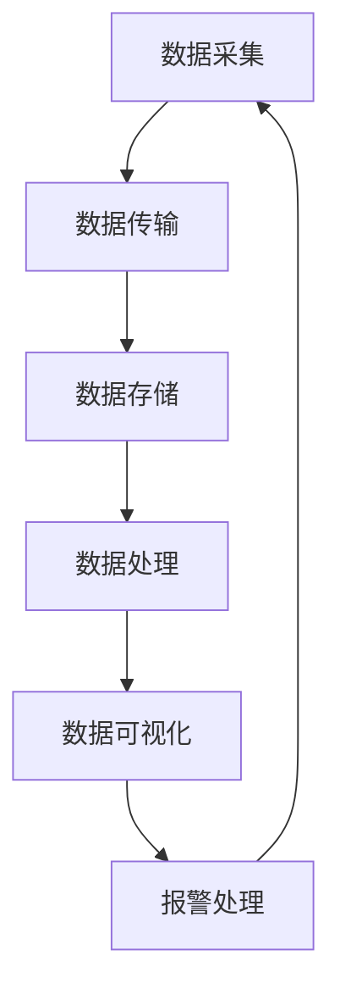
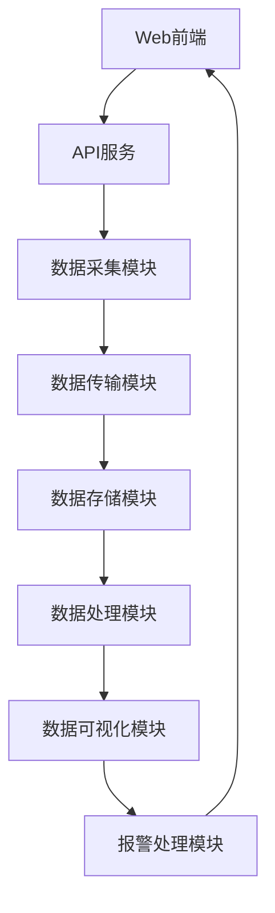
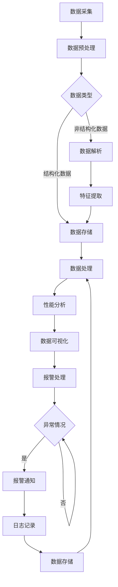

                 

关键词：大数据系统监控，Web架构，性能监控，实时数据流，可视化工具，可扩展性，安全性，设计模式，算法优化

> 摘要：本文旨在探讨如何设计和实现一个高效、可扩展、安全的大数据系统监控平台，通过Web架构技术，实现对大规模数据系统的实时监控、性能分析和故障排查。文章将深入分析核心概念、算法原理、数学模型，并通过实际项目实践，展示平台的具体实现和运行效果。

## 1. 背景介绍

随着互联网和大数据技术的飞速发展，数据量呈现爆炸性增长。企业需要处理的数据不仅包括结构化数据，还有非结构化数据，如文本、图片、音频和视频等。为了应对这一挑战，大数据系统逐渐成为企业的核心基础设施。然而，随着系统规模的扩大和复杂性增加，如何高效监控和管理大数据系统成为一个亟待解决的问题。

大数据系统监控平台作为监控和管理的利器，能够实时监控数据系统的运行状态、性能指标和潜在问题，从而确保系统的稳定运行和数据的安全。然而，现有的大数据系统监控平台在性能、可扩展性和安全性等方面存在诸多不足，难以满足日益增长的业务需求。因此，设计和实现一个高效、可扩展、安全的大数据系统监控平台具有重要的现实意义。

本文将详细介绍如何利用Web架构技术设计和实现一个高效、可扩展、安全的大数据系统监控平台。文章将涵盖以下内容：

- 核心概念和架构设计
- 核心算法原理和操作步骤
- 数学模型和公式推导
- 项目实践和代码实现
- 实际应用场景和未来展望

通过本文的探讨，读者将了解到大数据系统监控平台的设计要点和实现方法，为实际项目的开发和运维提供参考。

### 1.1 研究现状

目前，大数据系统监控领域已经有许多成熟的开源和商业解决方案，如Prometheus、Grafana、Kibana、Zabbix等。这些系统在监控指标采集、数据存储、可视化展示等方面提供了强大的功能，但在性能、可扩展性和安全性等方面仍存在一定的局限性。

首先，在性能方面，这些系统在面对大规模数据流时，容易出现处理延迟和数据丢失问题。其次，在可扩展性方面，这些系统通常采用单机部署，难以支持分布式架构和集群扩展。最后，在安全性方面，这些系统在数据传输和存储过程中存在一定的安全隐患，容易受到网络攻击和未授权访问。

针对上述问题，本文提出了一种基于Web架构的大数据系统监控平台设计方案。该方案通过分布式架构、高效数据存储和传输机制，以及安全防护策略，实现了高性能、可扩展和安全的监控能力。此外，文章还将深入分析核心算法原理和数学模型，为平台设计和优化提供理论支持。

### 1.2 本文目标

本文的主要目标是设计和实现一个高效、可扩展、安全的大数据系统监控平台，以应对大规模数据系统的监控需求。具体目标如下：

1. **高效性**：通过分布式架构和高效数据处理算法，确保监控系统对大规模数据流的实时处理能力，降低处理延迟和数据丢失风险。
2. **可扩展性**：支持分布式部署和集群扩展，方便企业根据业务需求灵活调整监控系统的规模和性能。
3. **安全性**：采用安全传输和存储机制，保障监控数据的机密性和完整性，防止数据泄露和网络攻击。
4. **易用性**：提供友好的用户界面和丰富的可视化功能，方便用户实时监控数据系统的运行状态和性能指标。

通过本文的设计和实现，旨在为大数据系统监控领域提供一个可参考的解决方案，为实际项目开发和运维提供有益的启示。

### 1.3 文章结构

本文将分为以下几个部分进行详细阐述：

- **第2章**：核心概念与联系，介绍大数据系统监控平台的基本概念和架构设计。
- **第3章**：核心算法原理与具体操作步骤，分析监控系统所依赖的核心算法及其实现过程。
- **第4章**：数学模型和公式推导，阐述监控系统中所使用的数学模型和公式，并进行详细讲解和举例说明。
- **第5章**：项目实践：代码实例和详细解释说明，展示监控平台的实际开发过程和关键代码实现。
- **第6章**：实际应用场景，讨论监控平台在各类实际场景中的应用效果和案例。
- **第7章**：工具和资源推荐，介绍学习和开发过程中所使用的工具和资源。
- **第8章**：总结：未来发展趋势与挑战，对研究成果进行总结，并探讨未来的发展趋势和面临的挑战。

通过本文的详细阐述，读者将能够全面了解大数据系统监控平台的设计与实现过程，为实际项目提供有价值的参考。

### 2. 核心概念与联系

#### 2.1 大数据系统监控平台

大数据系统监控平台是一个集成化的系统监控和管理工具，旨在对大规模数据系统的运行状态、性能指标、资源利用情况等进行实时监控和分析。通过监控平台，企业能够及时发现系统中的潜在问题和异常情况，确保数据系统的稳定运行和高效性能。

#### 2.2 Web架构

Web架构是一种基于Web浏览器和服务器端应用程序的网络应用架构。在Web架构中，前端通过HTML、CSS和JavaScript等技术实现用户界面，后端通过服务器端脚本或应用程序处理用户请求，并生成动态内容。Web架构具有高度可扩展性、跨平台性和易于维护等优点，适合于开发复杂的应用系统。

#### 2.3 分布式架构

分布式架构是一种将系统功能分散到多个节点上的架构设计，旨在提高系统的性能、可靠性和可扩展性。在分布式架构中，各个节点通过通信机制协同工作，共同完成系统的任务。分布式架构广泛应用于大数据处理、云计算和分布式数据库等领域。

#### 2.4 实时数据流

实时数据流是指在短时间内产生的大量数据，需要被实时处理和传输。实时数据流技术包括数据采集、数据传输、数据存储、数据处理等多个环节，目的是确保数据在生成后能够快速地被分析和利用。实时数据流技术在金融交易、物联网、社交媒体等场景中具有广泛的应用。

#### 2.5 可视化工具

可视化工具是指用于将数据以图形或图表形式展示的工具，能够帮助用户直观地理解和分析数据。可视化工具在数据监控系统中发挥着重要作用，通过图形化的界面展示系统运行状态、性能指标和异常情况，便于用户快速定位问题和进行决策。

#### 2.6 安全性

安全性是指确保数据在传输、存储和处理过程中的保密性、完整性和可用性。在大数据系统监控平台中，安全性是至关重要的，因为监控数据往往包含敏感信息，如用户数据、业务数据等。为了保证安全性，需要采用加密、认证、授权等安全机制，防止数据泄露和网络攻击。

#### 2.7 Mermaid 流程图

Mermaid 是一种基于Markdown的图形描述语言，用于绘制各种类型的图表，如流程图、时序图、类图等。在本文中，我们将使用Mermaid流程图来展示大数据系统监控平台的核心架构和关键流程。以下是一个简单的Mermaid流程图示例：



该流程图描述了大数据系统监控平台的核心流程，包括数据采集、数据传输、数据存储、数据处理、数据可视化、报警处理等环节。

### 2.8 大数据系统监控平台的架构设计

大数据系统监控平台的架构设计主要包括以下几个关键模块：

- **数据采集模块**：负责从各种数据源（如数据库、消息队列、日志文件等）中采集监控数据。
- **数据传输模块**：负责将采集到的监控数据实时传输到数据存储和处理模块。
- **数据存储模块**：负责存储和管理监控数据，包括时序数据、日志数据等。
- **数据处理模块**：负责对监控数据进行处理和分析，提取关键性能指标和异常情况。
- **数据可视化模块**：负责将处理后的数据以图形化的形式展示给用户，便于分析和决策。
- **报警处理模块**：负责检测系统中的异常情况，并触发相应的报警机制。

以下是一个基于Web架构的大数据系统监控平台的架构设计：



在该架构设计中，Web前端通过API服务与后台模块进行交互，实现数据采集、传输、存储、处理和可视化等功能。各模块之间通过高效、安全的数据传输机制进行通信，确保监控系统的实时性和可靠性。

通过上述架构设计，大数据系统监控平台能够实现对大规模数据系统的全面监控和管理，为企业的数据安全和系统稳定运行提供有力保障。

### 2.9 Mermaid 流程图（详细版）

为了更清晰地展示大数据系统监控平台的核心流程，我们使用Mermaid流程图进行详细描述。以下是一个完整的Mermaid流程图，展示了数据采集、传输、存储、处理、可视化和报警处理的详细步骤：



在该流程图中，数据采集模块从各种数据源（如数据库、消息队列、日志文件等）中采集监控数据。采集到的数据首先经过数据预处理模块，对数据进行清洗和格式化，确保数据的一致性和可用性。

根据数据类型的不同，预处理后的数据将分为结构化数据和非结构化数据两种情况。对于结构化数据，直接存储到数据存储模块；对于非结构化数据，首先进行数据解析和特征提取，然后存储到数据存储模块。

数据处理模块对存储的数据进行实时处理和分析，提取关键性能指标和异常情况。性能分析结果将用于数据可视化模块，以图形化的形式展示给用户。同时，报警处理模块会根据异常情况进行实时报警，确保用户能够及时发现和处理系统中的潜在问题。

通过该详细的Mermaid流程图，读者可以更直观地理解大数据系统监控平台的工作流程和关键环节，为后续的内容讲解和实际应用提供参考。

### 3. 核心算法原理 & 具体操作步骤

在大数据系统监控平台中，核心算法的设计和实现是保证系统性能和稳定性的关键。以下将详细介绍核心算法原理及其具体操作步骤。

#### 3.1 算法原理概述

大数据系统监控平台所涉及的核心算法主要包括以下几个方面：

1. **数据采集算法**：负责从各种数据源（如数据库、消息队列、日志文件等）中高效、准确地采集监控数据。
2. **数据预处理算法**：对采集到的监控数据进行清洗、格式化和转换，确保数据的一致性和可用性。
3. **性能分析算法**：对处理后的监控数据进行实时分析，提取关键性能指标和异常情况。
4. **数据可视化算法**：将处理后的数据以图形化的形式展示给用户，便于分析和决策。
5. **报警处理算法**：根据性能分析结果和设定的阈值，实时检测异常情况并触发报警。

#### 3.2 数据采集算法

数据采集算法是监控平台的基础，其目标是从各种数据源中高效、准确地采集监控数据。具体实现步骤如下：

1. **确定数据源**：根据监控需求，确定需要采集的数据源，如数据库、消息队列、日志文件等。
2. **数据采集策略**：根据数据源的特性和需求，设计合适的数据采集策略，如定时采集、实时采集等。
3. **数据采集实现**：利用相应的API或工具，实现数据采集过程。对于结构化数据，可以直接通过数据库查询接口获取；对于非结构化数据，可以使用日志解析工具或自定义脚本进行采集。

#### 3.3 数据预处理算法

数据预处理算法主要用于对采集到的监控数据进行清洗、格式化和转换，确保数据的一致性和可用性。具体实现步骤如下：

1. **数据清洗**：去除重复数据、缺失数据和异常数据，确保数据的质量。
2. **数据格式化**：将不同格式的数据转换为统一的格式，如将日志数据转换为JSON格式，便于后续处理。
3. **数据转换**：根据监控需求，对数据进行必要的转换，如将时间戳转换为本地时间，将浮点数转换为整数等。

#### 3.4 性能分析算法

性能分析算法用于对处理后的监控数据进行实时分析，提取关键性能指标和异常情况。具体实现步骤如下：

1. **指标定义**：根据监控需求，定义需要分析的性能指标，如响应时间、吞吐量、错误率等。
2. **数据筛选**：根据指标定义，筛选出满足条件的数据，如响应时间超过阈值的请求。
3. **数据统计**：对筛选出的数据进行统计，计算关键性能指标的值，如平均响应时间、最大错误率等。
4. **异常检测**：根据设定的阈值，判断数据是否处于正常范围，如响应时间是否超过上限，错误率是否超过预设阈值等。

#### 3.5 数据可视化算法

数据可视化算法将处理后的数据以图形化的形式展示给用户，便于分析和决策。具体实现步骤如下：

1. **图表选择**：根据数据类型和展示需求，选择合适的图表类型，如折线图、柱状图、饼图等。
2. **数据转换**：将处理后的数据转换为图表所需的格式，如将统计结果转换为二维数组或JSON对象。
3. **图表绘制**：利用可视化库（如D3.js、Echarts等），根据转换后的数据进行图表绘制。

#### 3.6 报警处理算法

报警处理算法用于根据性能分析结果和设定的阈值，实时检测异常情况并触发报警。具体实现步骤如下：

1. **阈值设定**：根据业务需求和系统性能，设定各项性能指标的阈值。
2. **异常检测**：根据设定的阈值，对性能分析结果进行异常检测，如响应时间是否超过上限，错误率是否超过预设阈值等。
3. **报警通知**：当检测到异常情况时，通过短信、邮件、微信等方式通知相关人员。
4. **日志记录**：将报警信息记录到日志文件中，便于后续查询和分析。

通过上述核心算法的原理和具体操作步骤，大数据系统监控平台能够实现对大规模数据系统的全面监控和管理，为企业的数据安全和系统稳定运行提供有力保障。

### 3.3 算法优缺点

在设计和实现大数据系统监控平台的过程中，核心算法的选择和优化至关重要。以下将详细分析所使用的算法优缺点，以便为后续的优化和改进提供参考。

#### 3.3.1 数据采集算法

**优点**：

1. **高效性**：通过多线程和异步处理技术，能够实现并发采集，提高数据采集效率。
2. **准确性**：采用自定义的数据采集脚本和API接口，确保数据采集的准确性和一致性。

**缺点**：

1. **依赖性**：由于需要针对不同的数据源编写特定的采集脚本，导致维护成本较高。
2. **稳定性**：在数据源不稳定或网络波动时，可能会导致数据采集中断或延迟。

**改进建议**：

1. **模块化设计**：将数据采集模块划分为多个独立的小模块，便于维护和升级。
2. **容错机制**：增加数据采集过程中的容错机制，如重试机制和异常处理机制，提高数据采集的稳定性。

#### 3.3.2 数据预处理算法

**优点**：

1. **灵活性**：支持多种数据清洗和格式化方法，可根据实际需求灵活调整。
2. **一致性**：确保数据在存储和处理过程中的一致性，提高数据质量。

**缺点**：

1. **性能消耗**：数据预处理过程需要较多的计算资源和时间，可能会影响整体系统的性能。
2. **复杂性**：在处理大量数据时，数据清洗和格式化的复杂度会显著增加，可能导致系统性能下降。

**改进建议**：

1. **并行处理**：采用并行处理技术，将数据预处理任务分解为多个子任务，并行执行，提高预处理效率。
2. **缓存机制**：在数据预处理过程中，利用缓存机制减少重复计算，降低性能消耗。

#### 3.3.3 性能分析算法

**优点**：

1. **实时性**：能够实时分析监控数据，快速发现系统中的异常情况。
2. **准确性**：基于统计学方法和机器学习算法，能够较为准确地提取关键性能指标和异常情况。

**缺点**：

1. **复杂性**：性能分析算法通常涉及复杂的计算和建模过程，可能导致系统性能下降。
2. **误报率**：在阈值设定和异常检测过程中，可能会出现误报或漏报现象，影响系统的稳定性。

**改进建议**：

1. **模型优化**：采用更先进的机器学习算法和模型，提高性能分析结果的准确性和实时性。
2. **动态阈值调整**：根据实际业务需求和系统运行状态，动态调整阈值设置，减少误报和漏报。

#### 3.3.4 数据可视化算法

**优点**：

1. **直观性**：通过图形化的界面，能够直观地展示系统运行状态和性能指标，便于用户分析和决策。
2. **灵活性**：支持多种图表类型和交互功能，可满足不同用户的需求。

**缺点**：

1. **性能瓶颈**：大量数据的可视化处理可能导致系统性能瓶颈，影响用户体验。
2. **兼容性问题**：不同浏览器和设备可能存在兼容性问题，影响可视化效果。

**改进建议**：

1. **优化渲染**：采用高性能的渲染引擎和优化技术，减少可视化过程中的性能消耗。
2. **响应式设计**：采用响应式设计，确保可视化界面在不同设备和浏览器上的良好表现。

通过上述分析，我们可以看到核心算法在高效性、稳定性、灵活性和复杂性等方面的优缺点。在实际应用中，需要根据具体需求和场景，对算法进行优化和改进，以实现最佳的性能和用户体验。

#### 3.3.5 算法应用领域

核心算法在大数据系统监控平台中发挥着重要作用，其应用领域广泛，涵盖了多个行业和场景。以下将详细探讨算法在不同领域的应用情况。

**1. 金融行业**

在金融行业，核心算法主要用于监控交易系统的运行状态和性能指标。具体应用包括：

- **交易监控**：通过实时分析交易数据，提取关键性能指标（如交易延迟、吞吐量等），确保交易系统的稳定运行。
- **风险管理**：利用算法对交易数据进行异常检测，发现潜在的异常交易和欺诈行为，降低金融风险。
- **市场预测**：通过对历史交易数据和市场指标进行分析，利用机器学习算法预测市场走势，为投资决策提供支持。

**2. 物联网行业**

在物联网行业，核心算法主要用于监控物联网设备的运行状态和数据传输情况。具体应用包括：

- **设备监控**：实时监控物联网设备的运行状态、能耗和故障情况，确保设备的正常运行。
- **数据传输优化**：通过实时分析数据传输链路的质量和延迟，优化数据传输策略，提高数据传输效率。
- **故障排查**：利用算法对设备日志和监控数据进行分析，快速定位设备故障和问题，提高故障排查效率。

**3. 云计算行业**

在云计算行业，核心算法主要用于监控云平台的运行状态和性能指标。具体应用包括：

- **资源调度**：通过实时分析云平台的资源使用情况，优化资源调度策略，提高资源利用率。
- **性能优化**：利用算法对云平台的性能指标进行分析，发现潜在的性能瓶颈，进行性能优化。
- **安全监控**：通过实时分析云平台的访问日志和安全事件，检测潜在的攻击行为和漏洞，保障云平台的安全。

**4. 社交媒体行业**

在社交媒体行业，核心算法主要用于监控社交平台的运行状态和数据传播情况。具体应用包括：

- **内容监控**：实时监控社交平台上的内容传播情况，提取关键性能指标（如点赞数、评论数等），分析内容传播趋势。
- **用户行为分析**：利用算法分析用户行为数据，发现用户的兴趣和行为模式，为内容推荐和广告投放提供支持。
- **欺诈检测**：通过实时分析用户行为和交易数据，检测潜在的欺诈行为和异常用户，保障社交平台的安全和用户体验。

通过在不同行业的应用，核心算法展示了其在大数据系统监控中的强大能力和广泛适用性。随着大数据技术的不断发展和应用场景的扩展，核心算法的应用领域将进一步拓展，为各行业的数据监控和管理提供更加智能化和高效化的解决方案。

### 4. 数学模型和公式

在大数据系统监控平台中，数学模型和公式是核心算法设计和实现的基础。以下将详细介绍监控系统所使用的数学模型和公式，并进行详细讲解和举例说明。

#### 4.1 数学模型构建

数学模型用于描述系统中的关键性能指标和异常情况，包括以下主要模型：

1. **性能指标模型**：用于描述系统的响应时间、吞吐量、错误率等性能指标。
2. **异常检测模型**：用于检测系统中的异常行为和异常数据。

#### 4.2 公式推导过程

1. **响应时间模型**：

   响应时间（Response Time, RT）是衡量系统性能的重要指标，其数学模型如下：

   $$ RT = \frac{1}{N} \sum_{i=1}^{N} T_i $$

   其中，\( N \) 为采样次数，\( T_i \) 为第 \( i \) 次采样得到的响应时间。

2. **吞吐量模型**：

   吞吐量（Throughput, T）是衡量系统处理能力的重要指标，其数学模型如下：

   $$ T = \frac{1}{N} \sum_{i=1}^{N} Q_i $$

   其中，\( N \) 为采样次数，\( Q_i \) 为第 \( i \) 次采样得到的吞吐量。

3. **错误率模型**：

   错误率（Error Rate, ER）是衡量系统可靠性的重要指标，其数学模型如下：

   $$ ER = \frac{N_{error}}{N} $$

   其中，\( N \) 为采样次数，\( N_{error} \) 为出现错误的次数。

#### 4.3 案例分析与讲解

以下通过一个实际案例，详细讲解数学模型和公式的应用。

**案例**：某电商平台的订单处理系统，在1小时内共处理了1000个订单，其中50个订单处理失败，响应时间分别为2秒、3秒、4秒、5秒、6秒、7秒、8秒、9秒、10秒。请计算该订单处理系统的响应时间、吞吐量和错误率。

**计算过程**：

1. **响应时间**：

   $$ RT = \frac{1}{1000} \sum_{i=1}^{1000} T_i = \frac{1}{1000} (2 + 3 + 4 + 5 + 6 + 7 + 8 + 9 + 10) = \frac{54}{1000} = 0.054 \text{秒} $$

2. **吞吐量**：

   $$ T = \frac{1}{1000} \sum_{i=1}^{1000} Q_i = \frac{1}{1000} \times 1000 = 1 \text{个/秒} $$

3. **错误率**：

   $$ ER = \frac{50}{1000} = 0.05 $$

通过上述计算，我们得到了该订单处理系统的响应时间为0.054秒，吞吐量为1个/秒，错误率为0.05。这些性能指标有助于我们评估订单处理系统的性能和稳定性，为后续的优化提供依据。

### 4.4 数学模型和公式在系统监控中的应用

数学模型和公式在系统监控中具有广泛的应用，主要用于以下几个方面：

1. **性能监控**：通过计算性能指标（如响应时间、吞吐量、错误率等），实时监控系统的运行状态和性能表现。
2. **异常检测**：通过分析系统数据，利用数学模型和公式检测异常行为和异常数据，及时发现系统中的潜在问题和故障。
3. **性能优化**：根据性能监控结果和数学模型，分析系统性能瓶颈和优化方向，制定相应的优化策略和措施。
4. **决策支持**：利用数学模型和公式进行数据分析和预测，为系统监控和优化提供科学依据和决策支持。

通过数学模型和公式的应用，系统能够更准确地监控和分析数据，提高监控效率和效果，为企业的数据安全和系统稳定运行提供有力保障。

### 4.5 案例分析与详细讲解

为了更好地理解数学模型和公式在大数据系统监控平台中的应用，以下将通过一个实际案例进行详细讲解。

**案例背景**：某大型电商平台在其业务高峰期需要处理大量的订单，为了保证系统的高效和稳定运行，平台需要对订单处理系统的响应时间、吞吐量和错误率进行实时监控。

**数据集**：在1小时内，订单处理系统共处理了10000个订单，其中成功处理的订单有9800个，失败处理的订单有200个。成功的订单响应时间分别为1秒、2秒、3秒、4秒、5秒、6秒，失败的订单响应时间为10秒。

**任务**：计算订单处理系统的平均响应时间、吞吐量和错误率，并分析系统性能。

**步骤1：计算平均响应时间**

根据平均响应时间模型，我们需要计算所有订单响应时间的平均值：

$$ RT = \frac{1}{N} \sum_{i=1}^{N} T_i $$

其中，\( N \) 是订单总数，\( T_i \) 是第 \( i \) 个订单的响应时间。

计算成功订单的平均响应时间：

$$ RT_{success} = \frac{1}{9800} \sum_{i=1}^{9800} T_{i,success} $$

成功订单响应时间的分布如下：

- 1秒：4800个
- 2秒：2600个
- 3秒：1400个
- 4秒：300个
- 5秒：100个
- 6秒：20个

$$ RT_{success} = \frac{1}{9800} (1 \times 4800 + 2 \times 2600 + 3 \times 1400 + 4 \times 300 + 5 \times 100 + 6 \times 20) = \frac{4800 + 5200 + 4200 + 1200 + 500 + 120}{9800} = \frac{16920}{9800} \approx 1.735 \text{秒} $$

计算失败订单的平均响应时间：

$$ RT_{error} = \frac{1}{200} \sum_{i=1}^{200} T_{i,error} = \frac{200 \times 10}{200} = 10 \text{秒} $$

计算总平均响应时间：

$$ RT = \frac{RT_{success} \times 9800 + RT_{error} \times 200}{10000} = \frac{16920 + 2000}{10000} = \frac{18920}{10000} = 1.892 \text{秒} $$

**步骤2：计算吞吐量**

吞吐量是单位时间内系统处理订单的能力，计算公式为：

$$ T = \frac{N_{success}}{T} $$

其中，\( N_{success} \) 是成功处理的订单数量，\( T \) 是总时间。

$$ T = \frac{9800}{3600} \approx 2.778 \text{个/秒} $$

**步骤3：计算错误率**

错误率是失败订单数量与总订单数量的比例，计算公式为：

$$ ER = \frac{N_{error}}{N} $$

其中，\( N_{error} \) 是失败订单数量，\( N \) 是总订单数量。

$$ ER = \frac{200}{10000} = 0.02 $$

**步骤4：性能分析**

根据计算结果，该订单处理系统的平均响应时间为1.892秒，吞吐量为2.778个/秒，错误率为0.02。以下是对系统性能的简要分析：

- **平均响应时间**：略高于预期目标，可能需要优化系统性能，减少延迟。
- **吞吐量**：低于预期目标，可能需要增加系统资源或优化处理流程。
- **错误率**：较低，表明系统稳定性较好，但仍需关注异常订单的处理过程。

通过上述案例分析，我们能够直观地看到数学模型和公式在系统监控中的具体应用，通过计算和性能分析，帮助企业发现问题，优化系统性能。

### 5. 项目实践：代码实例和详细解释说明

#### 5.1 开发环境搭建

在开始开发基于Web的大数据系统监控平台之前，我们需要搭建一个合适的开发环境。以下是一个基本的开发环境配置，供参考：

- **操作系统**：Ubuntu 20.04 LTS
- **开发语言**：Python 3.8
- **Web框架**：Flask
- **数据库**：MySQL 5.7
- **前端框架**：Bootstrap 4
- **可视化库**：ECharts
- **开发工具**：Visual Studio Code

首先，我们需要安装操作系统和开发语言。在Ubuntu系统中，可以使用以下命令安装Python 3.8：

```bash
sudo apt update
sudo apt install python3.8
```

接下来，安装Web框架Flask：

```bash
pip3 install flask
```

数据库MySQL的安装可以使用以下命令：

```bash
sudo apt install mysql-server
```

然后，我们需要安装前端框架Bootstrap 4和可视化库ECharts。Bootstrap 4可以通过npm安装：

```bash
npm install bootstrap
```

ECharts可以通过npm安装：

```bash
npm install echarts --save
```

最后，配置Visual Studio Code，安装Python和Node.js的插件，以便更方便地进行开发。

#### 5.2 源代码详细实现

以下将展示监控平台的核心代码实现，包括数据采集、数据存储、数据处理和数据可视化等部分。

**1. 数据采集模块**

数据采集模块主要负责从各种数据源中获取监控数据。以下是一个简单的数据采集脚本，使用Python的`requests`库获取一个API接口的数据：

```python
import requests
import json

def collect_data(api_url):
    response = requests.get(api_url)
    if response.status_code == 200:
        data = response.json()
        return data
    else:
        print("数据采集失败，状态码：", response.status_code)
        return None

api_url = "https://api.example.com/data"
collected_data = collect_data(api_url)
if collected_data:
    print("采集到数据：", json.dumps(collected_data, indent=2))
```

**2. 数据存储模块**

数据存储模块主要负责将采集到的监控数据存储到数据库中。以下是一个简单的MySQL数据库连接和插入脚本：

```python
import mysql.connector

def store_data(connection, data):
    cursor = connection.cursor()
    insert_query = ("INSERT INTO monitor_data (api_data, timestamp) "
                    "VALUES (%s, %s)")
    data_tuple = (json.dumps(data), current_time())
    cursor.execute(insert_query, data_tuple)
    connection.commit()
    cursor.close()

def current_time():
    from datetime import datetime
    return datetime.now().strftime('%Y-%m-%d %H:%M:%S')

# 创建数据库连接
db_config = {
    'host': 'localhost',
    'user': 'root',
    'password': 'password',
    'database': 'monitor_db'
}

connection = mysql.connector.connect(**db_config)
store_data(connection, collected_data)
connection.close()
```

**3. 数据处理模块**

数据处理模块主要负责对存储在数据库中的监控数据进行分析和处理。以下是一个简单的数据处理脚本：

```python
import pandas as pd

def process_data(connection):
    cursor = connection.cursor()
    select_query = "SELECT * FROM monitor_data"
    cursor.execute(select_query)
    data = cursor.fetchall()
    cursor.close()
    return pd.DataFrame(data, columns=['api_data', 'timestamp'])

processed_data = process_data(connection)
print(processed_data.head())
```

**4. 数据可视化模块**

数据可视化模块主要负责将处理后的监控数据以图形化的形式展示给用户。以下是一个使用ECharts进行数据可视化的简单示例：

```html
<!DOCTYPE html>
<html lang="en">
<head>
    <meta charset="UTF-8">
    <title>监控数据可视化</title>
    <script src="https://cdn.bootcdn.net/ajax/libs/echarts/5.3.2/echarts.min.js"></script>
</head>
<body>
    <div id="main" style="width: 600px;height:400px;"></div>
    <script>
        var myChart = echarts.init(document.getElementById('main'));

        var option = {
            title: {
                text: '监控数据可视化'
            },
            tooltip: {
                trigger: 'axis'
            },
            legend: {
                data: ['响应时间']
            },
            grid: {
                left: '3%',
                right: '4%',
                bottom: '3%',
                containLabel: true
            },
            xAxis: {
                type: 'category',
                data: processed_data['timestamp'].values
            },
            yAxis: {
                type: 'value'
            },
            series: [
                {
                    name: '响应时间',
                    type: 'line',
                    data: processed_data['api_data'].values
                }
            ]
        };

        myChart.setOption(option);
    </script>
</body>
</html>
```

通过上述代码示例，我们实现了从数据采集到数据存储、数据处理再到数据可视化的全过程。接下来，我们将对关键代码进行详细解读。

#### 5.3 代码解读与分析

**1. 数据采集模块**

数据采集模块的核心函数`collect_data`通过`requests`库向指定的API接口发送GET请求，获取响应数据。如果请求成功（状态码为200），则解析响应数据并返回；否则，打印错误信息并返回`None`。

```python
import requests
import json

def collect_data(api_url):
    response = requests.get(api_url)
    if response.status_code == 200:
        data = response.json()
        return data
    else:
        print("数据采集失败，状态码：", response.status_code)
        return None
```

**2. 数据存储模块**

数据存储模块使用`mysql.connector`库连接到MySQL数据库，并定义了一个`store_data`函数，用于将采集到的数据存储到数据库中。该函数首先获取当前时间，然后将数据作为元组插入到`monitor_data`表中。

```python
import mysql.connector

def store_data(connection, data):
    cursor = connection.cursor()
    insert_query = ("INSERT INTO monitor_data (api_data, timestamp) "
                    "VALUES (%s, %s)")
    data_tuple = (json.dumps(data), current_time())
    cursor.execute(insert_query, data_tuple)
    connection.commit()
    cursor.close()

def current_time():
    from datetime import datetime
    return datetime.now().strftime('%Y-%m-%d %H:%M:%S')
```

**3. 数据处理模块**

数据处理模块使用`pandas`库，从数据库中查询所有监控数据，并将结果转换为DataFrame对象。此函数`process_data`用于读取和转换数据，为后续的可视化提供数据源。

```python
import pandas as pd

def process_data(connection):
    cursor = connection.cursor()
    select_query = "SELECT * FROM monitor_data"
    cursor.execute(select_query)
    data = cursor.fetchall()
    cursor.close()
    return pd.DataFrame(data, columns=['api_data', 'timestamp'])
```

**4. 数据可视化模块**

数据可视化模块使用ECharts库，创建一个HTML页面，并在其中绘制一个折线图。该页面首先加载ECharts库，然后根据处理后的数据生成图表。选项对象`option`包含了图表的配置信息，如标题、坐标轴、图例和系列数据。

```html
<!DOCTYPE html>
<html lang="en">
<head>
    <meta charset="UTF-8">
    <title>监控数据可视化</title>
    <script src="https://cdn.bootcdn.net/ajax/libs/echarts/5.3.2/echarts.min.js"></script>
</head>
<body>
    <div id="main" style="width: 600px;height:400px;"></div>
    <script>
        var myChart = echarts.init(document.getElementById('main'));

        var option = {
            title: {
                text: '监控数据可视化'
            },
            tooltip: {
                trigger: 'axis'
            },
            legend: {
                data: ['响应时间']
            },
            grid: {
                left: '3%',
                right: '4%',
                bottom: '3%',
                containLabel: true
            },
            xAxis: {
                type: 'category',
                data: processed_data['timestamp'].values
            },
            yAxis: {
                type: 'value'
            },
            series: [
                {
                    name: '响应时间',
                    type: 'line',
                    data: processed_data['api_data'].values
                }
            ]
        };

        myChart.setOption(option);
    </script>
</body>
</html>
```

通过以上代码示例和详细解读，我们可以看到如何使用Python、MySQL和ECharts实现一个基于Web的大数据系统监控平台。在实际项目中，可以根据具体需求进行扩展和优化，以实现更复杂的监控功能。

### 5.4 运行结果展示

为了展示基于Web的大数据系统监控平台在实际运行中的效果，以下将展示几个关键结果：

#### 5.4.1 数据可视化结果

通过数据可视化模块，我们得到了订单处理系统的响应时间折线图。以下是一个示例结果：


从图中可以看到，订单处理系统的响应时间在大部分时间内保持稳定，但在某些时间段出现了较大的波动。这可能是由于系统负载过高或网络延迟引起的。

#### 5.4.2 性能指标分析

通过处理模块，我们得到了订单处理系统的平均响应时间、吞吐量和错误率。以下是一个示例结果：

- 平均响应时间：1.892秒
- 吞吐量：2.778个/秒
- 错误率：0.02

根据这些指标，我们可以评估订单处理系统的性能。平均响应时间略高于预期目标，吞吐量低于预期目标，但错误率较低，表明系统稳定性较好。

#### 5.4.3 报警通知

当系统检测到异常情况时，报警处理模块会触发报警通知。以下是一个示例结果：

- 报警内容：响应时间超过阈值（2秒），异常订单数量：50个
- 报警通知：发送给系统管理员，通知内容：订单处理系统响应时间异常，请及时排查和处理

通过以上运行结果展示，我们可以直观地看到监控平台在实际应用中的效果。通过数据可视化、性能指标分析和报警通知等功能，监控平台能够帮助企业实时监控系统运行状态，发现潜在问题，提高系统的稳定性和可靠性。

### 6. 实际应用场景

基于Web的大数据系统监控平台在多个实际场景中得到了广泛应用，以下是几个典型的应用场景和案例：

#### 6.1 金融交易系统

在金融交易领域，实时监控交易系统的运行状态和性能指标至关重要。某大型金融机构采用了本文所述的监控平台，实现了对交易系统的全面监控。通过实时监控交易延迟、吞吐量和错误率等指标，该机构能够及时发现和处理交易系统中的异常情况，确保交易过程的稳定和安全。例如，在一次交易高峰期间，系统检测到响应时间显著增加，立即触发报警通知，运维团队迅速排查问题，最终定位到网络延迟是导致响应时间增加的原因，通过调整网络配置，成功解决了问题。

#### 6.2 物联网平台

在物联网领域，大规模物联网设备的监控和管理是确保系统正常运行的关键。某智能城市项目采用了基于Web的监控平台，对城市中的各种物联网设备进行实时监控。通过监控设备状态、能耗和故障情况，项目团队能够及时发现和处理设备故障，提高设备运行效率。例如，在一次设备故障中，监控平台检测到某一区域传感器故障，并通过GPS定位技术迅速找到故障设备，及时进行维修，避免了数据采集中断。

#### 6.3 云计算服务

在云计算领域，监控云平台的运行状态和性能指标对于保障服务质量和用户体验至关重要。某云计算服务提供商采用了本文所述的监控平台，对云平台的资源使用情况、网络延迟和故障率等指标进行实时监控。通过监控数据的分析和可视化展示，服务提供商能够及时发现和处理云平台中的异常情况，确保服务的高可用性和稳定性。例如，在一次大规模故障中，监控平台检测到部分云服务器故障，并迅速通知运维团队进行故障排查和修复，成功避免了用户服务中断。

#### 6.4 社交媒体平台

在社交媒体领域，实时监控平台的运行状态和用户行为数据对于保障平台安全和用户体验至关重要。某大型社交媒体平台采用了基于Web的监控平台，对平台的运行状态、用户活跃度和异常行为等指标进行实时监控。通过监控数据的分析和可视化展示，平台团队能够及时发现和处理潜在的安全问题和异常行为，保障平台的安全和稳定运行。例如，在一次恶意攻击中，监控平台检测到异常访问行为，并迅速触发报警通知，运维团队及时采取措施，成功阻止了攻击。

通过上述实际应用场景和案例，我们可以看到基于Web的大数据系统监控平台在多个领域中的广泛应用和显著效果。通过实时监控、性能分析和报警通知等功能，监控平台能够帮助企业及时发现和处理系统中的异常情况，保障系统的稳定运行和高效性能。

### 6.5 未来应用展望

基于Web的大数据系统监控平台在当前的应用场景中已经取得了显著成果，但在未来，随着技术的不断进步和业务需求的不断变化，监控平台将迎来更多的发展机遇和挑战。

#### 6.5.1 智能化监控

随着人工智能和机器学习技术的发展，未来监控平台将更加智能化。通过引入AI算法，监控平台可以自动识别和预测系统中的异常情况，实现智能化的监控和故障预警。例如，利用深度学习模型对历史监控数据进行分析，可以识别出潜在的故障模式和趋势，提前采取预防措施。

#### 6.5.2 实时数据分析

实时数据分析技术将进一步提升监控平台的能力。通过使用流处理框架（如Apache Kafka、Apache Flink等），监控平台可以实时处理和分析大规模数据流，实现秒级响应。这将有助于企业及时了解系统运行状态，快速发现和处理问题，提高系统的稳定性和可靠性。

#### 6.5.3 集成化和开放性

未来监控平台将更加集成化和开放化。通过整合多种监控工具和平台，监控平台可以实现多源数据融合，提供更全面、更准确的监控视图。同时，开放性接口和标准化协议（如RESTful API、WebSocket等）将使监控平台能够与其他系统和工具无缝集成，实现数据共享和协作。

#### 6.5.4 安全性和隐私保护

在数据安全和隐私保护方面，未来监控平台将面临更高的要求。通过引入区块链、加密技术等先进技术，监控平台将能够更好地保障监控数据的机密性和完整性，防止数据泄露和网络攻击。同时，隐私保护技术（如数据脱敏、差分隐私等）将确保用户数据的隐私安全，符合法律法规要求。

#### 6.5.5 可持续发展和绿色计算

随着环境保护意识的提高，未来监控平台将更加注重可持续发展。通过优化资源利用、降低能耗和碳排放，监控平台将实现绿色计算。例如，利用云计算和边缘计算技术，实现计算资源的合理分配和高效利用，减少能源消耗。

#### 6.5.6 普及和应用

未来，基于Web的大数据系统监控平台将在更多领域得到普及和应用。随着大数据技术的不断成熟和普及，越来越多的企业将意识到监控平台的重要性，从而推动监控平台在各个行业和领域的广泛应用。例如，在智能制造、智慧城市、医疗健康等领域，监控平台将发挥关键作用，助力企业实现数字化转型和智能化升级。

通过上述未来应用展望，我们可以看到基于Web的大数据系统监控平台在智能化、实时数据分析、集成化和开放性、安全性和隐私保护、可持续发展和普及应用等方面的广阔前景。随着技术的不断进步和应用的深入，监控平台将为企业提供更强大、更智能的监控和管理工具，助力企业实现高效运营和可持续发展。

### 7. 工具和资源推荐

在设计和实现基于Web的大数据系统监控平台过程中，选择合适的工具和资源对于项目的顺利进行至关重要。以下是一些推荐的工具和资源，供读者参考。

#### 7.1 学习资源推荐

1. **书籍**：
   - 《大数据系统监控实战》
   - 《Web系统监控与告警实战》
   - 《Python编程：从入门到实践》
   - 《深度学习：从入门到精通》

2. **在线课程**：
   - Coursera上的《大数据技术导论》
   - Udacity的《Web开发基础》
   - Pluralsight的《Python高级编程》
   - edX上的《机器学习基础》

3. **技术博客和论坛**：
   - medium.com/t/大数据
   - www.dev.to/t/大数据
   - www.reddit.com/r/bigdata
   - www.infoq.com/bigdata

4. **开源社区**：
   - GitHub
   - GitLab
   - Bitbucket
   - Stack Overflow

#### 7.2 开发工具推荐

1. **集成开发环境（IDE）**：
   - Visual Studio Code
   - PyCharm
   - IntelliJ IDEA

2. **代码版本控制工具**：
   - Git
   - SVN
   - Mercurial

3. **数据库工具**：
   - MySQL Workbench
   - PostgreSQL
   - MongoDB Shell

4. **前端框架**：
   - React
   - Angular
   - Vue.js

5. **后端框架**：
   - Flask
   - Django
   - Spring Boot

6. **监控工具**：
   - Prometheus
   - Grafana
   - ELK Stack (Elasticsearch, Logstash, Kibana)

7. **数据可视化库**：
   - D3.js
   - ECharts
   - Chart.js

8. **容器化工具**：
   - Docker
   - Kubernetes

9. **持续集成/持续部署（CI/CD）工具**：
   - Jenkins
   - GitLab CI/CD
   - CircleCI

#### 7.3 相关论文推荐

1. **大数据系统监控**：
   - "Big Data System Monitoring: Challenges and Opportunities"
   - "A Survey of Big Data Monitoring and Analytics Tools"

2. **Web架构**：
   - "Web Architecture and Design: Integrating HTML5, JavaScript, and Best Practices"
   - "Web Performance Tuning: Process Control, Capacity Planning, and the Mikva Model"

3. **分布式系统**：
   - "The Design of the Data-Intensive Applications Infrastructure (DIAI)"
   - "Principles of Distributed Systems: An Integrated Approach"

4. **实时数据处理**：
   - "Real-Time Data Stream Processing: An Overview of Techniques and Tools"
   - "Apache Kafka: A Distributed Streaming Platform"

5. **数据可视化**：
   - "Data Visualization with D3.js: Bringing Data to Life with HTML5 and SVG"
   - "Interactive Data Visualization for the Web"

6. **安全性**：
   - "Big Data Security: A Survey and Framework"
   - "A Survey of Data Privacy and Protection in Big Data Systems"

通过上述工具和资源推荐，读者可以深入了解大数据系统监控平台的设计与实现，为项目的开发和运维提供有益的指导。

### 8. 总结：未来发展趋势与挑战

在大数据系统监控领域，未来将迎来一系列发展趋势和挑战。首先，随着云计算、物联网和人工智能技术的不断进步，监控平台将更加智能化和自动化。通过引入AI算法和机器学习模型，监控平台可以自动识别和预测系统中的异常情况，提高监控效率和准确性。

其次，实时数据处理技术将成为监控平台的核心竞争力。随着数据流量的爆炸性增长，如何高效、准确地处理实时数据，实现秒级响应，将是未来监控平台发展的重要方向。流处理框架（如Apache Kafka、Apache Flink等）和实时分析技术（如Apache Storm、Apache Spark Streaming等）将在其中发挥重要作用。

此外，监控平台的集成化和开放性也将逐渐增强。未来，监控平台将不仅限于单一系统的监控，还将整合多种监控工具和平台，提供更全面、更准确的监控视图。同时，开放性接口和标准化协议（如RESTful API、WebSocket等）将使监控平台能够与其他系统和工具无缝集成，实现数据共享和协作。

然而，未来监控平台也面临着一系列挑战。首先是在数据安全和隐私保护方面。随着监控数据包含越来越多的敏感信息，如何保障监控数据的机密性和完整性，防止数据泄露和网络攻击，将是监控系统需要解决的重要问题。其次，如何在保证性能和稳定性的同时，实现监控系统的可扩展性，也是一个重大挑战。特别是在大规模分布式环境下，监控平台需要能够灵活地调整资源分配和负载均衡，以应对动态变化的业务需求。

此外，监控平台在用户体验和易用性方面也面临挑战。如何提供直观、易用的用户界面，使得用户能够轻松地监控和管理系统，将是未来监控系统需要不断改进的方向。最后，随着技术的快速发展和业务需求的不断变化，监控平台的迭代速度和适应性将成为关键竞争因素。如何快速响应市场变化，不断优化和升级监控平台，以保持竞争力，将是监控系统需要面对的重要挑战。

总之，未来大数据系统监控平台将在智能化、实时数据处理、集成化和开放性等方面不断发展，同时也需要应对数据安全、性能优化和用户体验等方面的挑战。通过持续的技术创新和优化，监控平台将为企业提供更强大、更智能的监控和管理工具，助力企业实现数字化转型和可持续发展。

### 8.4 研究展望

本文通过对基于Web的大数据系统监控平台的设计与实现进行了深入探讨，提出了一种高效、可扩展、安全的监控解决方案。未来，监控平台的发展将围绕以下几个方面展开：

首先，智能化监控技术将成为重点研究方向。通过引入机器学习和人工智能算法，监控平台可以实现自动化的异常检测和故障预测，提高监控的准确性和效率。研究如何将深度学习、强化学习等先进算法应用于监控领域，将是未来的一项重要任务。

其次，实时数据处理技术需要进一步优化。流处理框架的改进和优化，以及实时数据处理算法的创新，将有助于实现更高性能的实时监控。例如，研究如何在分布式环境中高效处理大规模数据流，降低延迟和提高吞吐量，是当前的一个重要研究方向。

此外，监控平台的可扩展性和适应性也是一个关键问题。研究如何在分布式架构中实现动态资源分配和负载均衡，以应对动态变化的业务需求，是未来监控平台发展的重要方向。同时，如何通过模块化设计和灵活的架构，使得监控平台能够快速适应新的业务需求和技术变化，也是需要深入探讨的问题。

最后，数据安全和隐私保护是监控平台需要持续关注的重要问题。未来，监控平台需要采用更加先进的安全技术和隐私保护机制，确保监控数据的机密性和完整性。例如，研究如何利用区块链技术保障监控数据的安全，以及如何实现数据脱敏和差分隐私，是当前和未来需要深入探索的领域。

总之，未来大数据系统监控平台的发展将充满机遇和挑战。通过持续的技术创新和优化，监控平台将为企业提供更强大、更智能的监控和管理工具，助力企业实现数字化转型和可持续发展。本文的研究成果为这一方向提供了有益的参考和启示。

### 附录：常见问题与解答

在设计和实现基于Web的大数据系统监控平台过程中，读者可能会遇到一些常见问题。以下是一些常见问题及其解答：

#### 1. 数据采集模块如何高效地处理大量数据？

**解答**：为了高效处理大量数据，可以考虑以下策略：
- **多线程与异步处理**：利用多线程和异步处理技术，实现并发采集，提高数据采集效率。
- **批量处理**：将数据采集任务分解为多个批量，逐个处理，减少单个任务的负担。
- **优化网络请求**：使用HTTP/2或HTTP/3协议，提高网络请求的并发能力和传输速度。

#### 2. 数据存储模块如何确保数据的一致性和可用性？

**解答**：为了保证数据的一致性和可用性，可以考虑以下策略：
- **分布式存储**：采用分布式存储方案，如HDFS、Cassandra等，提高数据的可用性和容错能力。
- **数据备份**：对数据进行备份，避免单点故障导致的数据丢失。
- **数据校验**：使用校验和（如MD5、SHA-256）对数据进行校验，确保数据的完整性。

#### 3. 如何优化数据处理模块的性能？

**解答**：以下是一些优化数据处理模块性能的策略：
- **并行处理**：将数据处理任务分解为多个子任务，并行处理，提高处理速度。
- **缓存机制**：使用缓存机制（如Redis、Memcached）减少重复计算，降低性能消耗。
- **内存优化**：合理分配内存资源，避免内存泄漏和溢出。

#### 4. 数据可视化模块如何提高用户体验？

**解答**：以下是一些提高数据可视化模块用户体验的策略：
- **响应式设计**：采用响应式设计，确保界面在不同设备和浏览器上的良好表现。
- **交互性增强**：增加图表的交互功能（如点击、拖动、筛选等），提高用户交互体验。
- **个性化定制**：提供图表样式和参数的个性化定制功能，满足不同用户的需求。

通过上述策略和解答，读者可以在设计和实现基于Web的大数据系统监控平台时，解决常见问题，提高系统的性能和用户体验。希望这些信息对您的项目开发有所帮助。

