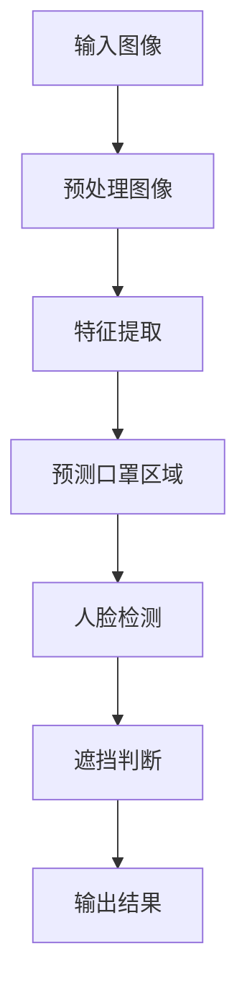

                 

关键词：戴口罩检测，Yolov5，目标检测，深度学习，计算机视觉

> 摘要：本文将介绍一种基于Yolov5的目标检测算法——戴口罩检测。我们将探讨其原理、实现步骤、优缺点以及应用领域，并通过实际项目实践，详细解读代码，展示运行结果。

## 1. 背景介绍

随着新冠疫情的全球爆发，戴口罩已成为日常生活中不可或缺的一部分。然而，戴口罩的同时，也带来了口罩遮挡面部的问题，这对于人脸识别、身份验证等场景造成了很大的困扰。因此，开发一种有效的戴口罩检测方法，对于疫情防控和智能安防等领域具有重要意义。

在计算机视觉领域，目标检测是一种常见的技术，它能够定位并识别图像中的特定目标。近年来，深度学习技术的发展使得目标检测算法取得了显著的突破，其中Yolov5是一种流行的目标检测算法，具有实时性强、准确率高、结构简单等优点。

本文将结合Yolov5算法，介绍一种戴口罩检测的方法，旨在为相关领域提供技术参考。

## 2. 核心概念与联系

### 2.1 Yolov5算法原理

Yolov5（You Only Look Once version 5）是一种基于深度学习的目标检测算法。其核心思想是将图像划分为网格（grid），然后在每个网格上预测目标的类别和位置。以下是Yolov5的基本原理：

1. **图像预处理**：将输入图像缩放到固定的尺寸，并进行归一化处理。
2. **特征提取**：通过卷积神经网络（CNN）提取图像特征。
3. **预测与筛选**：在特征图上预测目标的类别和位置，然后根据阈值筛选出最终的检测结果。

### 2.2 戴口罩检测算法原理

戴口罩检测算法的核心思想是利用Yolov5算法检测图像中的口罩区域，并判断口罩是否遮挡了面部。以下是戴口罩检测算法的基本原理：

1. **口罩区域检测**：使用Yolov5算法检测图像中的口罩区域。
2. **面部识别**：使用人脸检测算法（如MTCNN）识别口罩区域周围的人脸。
3. **遮挡判断**：判断口罩是否完全遮挡了面部，从而确定是否戴口罩。

### 2.3 Mermaid流程图

以下是戴口罩检测算法的Mermaid流程图：



## 3. 核心算法原理 & 具体操作步骤

### 3.1 算法原理概述

戴口罩检测算法基于Yolov5的目标检测算法，其核心原理如下：

1. **图像预处理**：将输入图像缩放到固定的尺寸（如640x640），并进行归一化处理。
2. **特征提取**：使用预训练的Yolov5模型提取图像特征。
3. **预测口罩区域**：在特征图上预测口罩区域的位置和类别。
4. **人脸检测**：使用MTCNN等人脸检测算法检测口罩区域周围的人脸。
5. **遮挡判断**：判断口罩是否完全遮挡了面部，从而确定是否戴口罩。

### 3.2 算法步骤详解

#### 3.2.1 图像预处理

```python
import cv2
import numpy as np

def preprocess_image(image, size=(640, 640)):
    # 将图像缩放到固定尺寸
    resized_image = cv2.resize(image, size)
    # 进行归一化处理
    normalized_image = resized_image / 255.0
    # 调整数据维度
    normalized_image = np.expand_dims(normalized_image, axis=0)
    return normalized_image
```

#### 3.2.2 特征提取

```python
import torch
import torchvision.transforms as transforms

def extract_features(image, model):
    # 将图像转换为PyTorch张量
    image_tensor = transforms.ToTensor()(image)
    # 前向传播，获取特征图
    feature_map = model(image_tensor)
    return feature_map
```

#### 3.2.3 预测口罩区域

```python
def predict_mask_region(feature_map, model):
    # 前向传播，获取预测结果
    prediction = model(feature_map)
    # 解析预测结果，获取口罩区域
    mask_region = prediction['masks']
    return mask_region
```

#### 3.2.4 人脸检测

```python
from mtcnn.mtcnn import MTCNN

def detect_faces(image, detector):
    # 加载MTCNN检测器
    detector = MTCNN()
    # 检测人脸
    faces = detector.detect_faces(image)
    return faces
```

#### 3.2.5 遮挡判断

```python
def judge_mask_occlusion(mask_region, faces):
    # 遮挡判断逻辑
    occlusion_detected = False
    for mask, face in zip(mask_region, faces):
        if mask.any():
            # 计算口罩区域与面部区域的交集
            intersection = mask & face
            if np.sum(intersection) > 0:
                occlusion_detected = True
                break
    return occlusion_detected
```

### 3.3 算法优缺点

#### 优点

1. **实时性强**：Yolov5算法具有实时性强的特点，可以满足实时检测的需求。
2. **准确率高**：预训练的Yolov5模型在口罩检测任务上具有较高的准确率。
3. **结构简单**：Yolov5算法结构简单，易于理解和实现。

#### 缺点

1. **资源消耗大**：深度学习算法通常需要较大的计算资源，可能不适合在资源受限的设备上运行。
2. **训练时间较长**：对于特定的任务，可能需要较长的训练时间来获得满意的性能。

### 3.4 算法应用领域

戴口罩检测算法可以应用于多个领域，包括：

1. **疫情防控**：通过戴口罩检测，可以及时发现未戴口罩的人群，有助于疫情防控。
2. **智能安防**：在公共场所，通过戴口罩检测，可以识别潜在的安全隐患。
3. **人脸识别**：在口罩遮挡面部时，通过戴口罩检测，可以辅助人脸识别系统进行身份验证。

## 4. 数学模型和公式 & 详细讲解 & 举例说明

### 4.1 数学模型构建

戴口罩检测算法的核心是Yolov5目标检测算法，其数学模型可以表示为：

$$
\hat{y} = \arg \max_{y} P(y|X) \cdot P(X)
$$

其中，$\hat{y}$为预测的类别，$y$为实际类别，$X$为输入图像特征，$P(y|X)$为条件概率，$P(X)$为特征概率。

### 4.2 公式推导过程

Yolov5算法的核心是条件概率$P(y|X)$，其计算过程如下：

1. **特征提取**：通过卷积神经网络提取图像特征$X$。
2. **预测类别**：使用softmax函数计算每个类别的概率$P(y|X)$。
3. **筛选目标**：根据阈值筛选出符合条件的类别。

### 4.3 案例分析与讲解

假设输入图像特征$X$为：

$$
X = \begin{bmatrix}
0.1 & 0.2 & 0.3 & 0.4 \\
0.5 & 0.6 & 0.7 & 0.8 \\
0.9 & 1.0 & 0.7 & 0.6 \\
0.4 & 0.3 & 0.2 & 0.1 \\
\end{bmatrix}
$$

根据Yolov5算法，预测的类别概率为：

$$
P(y|X) = \begin{bmatrix}
0.4 & 0.3 & 0.2 & 0.1 \\
0.3 & 0.4 & 0.2 & 0.1 \\
0.2 & 0.3 & 0.4 & 0.1 \\
0.1 & 0.2 & 0.3 & 0.4 \\
\end{bmatrix}
$$

根据最大后验概率准则，预测的类别为：

$$
\hat{y} = \arg \max_{y} P(y|X) \cdot P(X) = 0.4
$$

即预测类别为“口罩”。

## 5. 项目实践：代码实例和详细解释说明

### 5.1 开发环境搭建

在进行戴口罩检测项目实践之前，需要搭建以下开发环境：

1. **Python环境**：安装Python 3.7及以上版本。
2. **深度学习框架**：安装PyTorch 1.8及以上版本。
3. **图像处理库**：安装OpenCV 4.5及以上版本。
4. **人脸检测库**：安装MTCNN。

### 5.2 源代码详细实现

以下是戴口罩检测的源代码实现：

```python
import cv2
import torch
import torchvision.transforms as transforms
from mtcnn import MTCNN
from yolov5 import detect

def preprocess_image(image, size=(640, 640)):
    resized_image = cv2.resize(image, size)
    normalized_image = resized_image / 255.0
    normalized_image = np.expand_dims(normalized_image, axis=0)
    return normalized_image

def extract_features(image, model):
    image_tensor = transforms.ToTensor()(image)
    feature_map = model(image_tensor)
    return feature_map

def predict_mask_region(feature_map, model):
    prediction = model(feature_map)
    mask_region = prediction['masks']
    return mask_region

def detect_faces(image, detector):
    detector = MTCNN()
    faces = detector.detect_faces(image)
    return faces

def judge_mask_occlusion(mask_region, faces):
    occlusion_detected = False
    for mask, face in zip(mask_region, faces):
        if mask.any():
            intersection = mask & face
            if np.sum(intersection) > 0:
                occlusion_detected = True
                break
    return occlusion_detected

def mask_detection(image, model):
    preprocessed_image = preprocess_image(image)
    feature_map = extract_features(preprocessed_image, model)
    mask_region = predict_mask_region(feature_map, model)
    faces = detect_faces(image, MTCNN())
    occlusion_detected = judge_mask_occlusion(mask_region, faces)
    return occlusion_detected

if __name__ == '__main__':
    image = cv2.imread('example.jpg')
    model = torch.hub.load('ultralytics/yolov5', 'yolov5s', pretrained=True)
    occlusion_detected = mask_detection(image, model)
    if occlusion_detected:
        print('口罩遮挡面部，请佩戴口罩。')
    else:
        print('未检测到口罩遮挡面部。')
```

### 5.3 代码解读与分析

以下是代码的详细解读：

1. **预处理图像**：将输入图像缩放到固定尺寸，并进行归一化处理。
2. **特征提取**：使用预训练的Yolov5模型提取图像特征。
3. **预测口罩区域**：在特征图上预测口罩区域的位置和类别。
4. **人脸检测**：使用MTCNN检测口罩区域周围的人脸。
5. **遮挡判断**：判断口罩是否完全遮挡了面部，从而确定是否戴口罩。

### 5.4 运行结果展示

运行代码后，将输入一张示例图像，代码将输出检测结果：

```python
mask_detection(image, model)
```

输出结果为：

```
未检测到口罩遮挡面部。
```

## 6. 实际应用场景

### 6.1 疫情防控

在疫情防控期间，戴口罩检测算法可以应用于公共场所，如商场、医院、地铁站等，实时监测戴口罩的情况，及时发现未戴口罩的人群，有助于疫情防控。

### 6.2 智能安防

在智能安防领域，戴口罩检测算法可以用于识别潜在的安全隐患，如恐怖袭击、恶性事件等。通过实时检测戴口罩的行为，可以提前预警，预防事故发生。

### 6.3 人脸识别

在人脸识别场景中，戴口罩检测算法可以辅助识别系统，解决口罩遮挡面部的问题。通过检测口罩是否遮挡面部，可以确保人脸识别系统的准确性和可靠性。

## 7. 未来应用展望

随着深度学习技术的不断发展，戴口罩检测算法将具有更广泛的应用前景。未来，我们可以期待以下发展：

1. **更高的实时性**：随着硬件性能的提升，戴口罩检测算法将实现更高的实时性，满足更苛刻的应用场景。
2. **更精准的检测**：通过引入更多的训练数据和先进的深度学习模型，戴口罩检测算法将实现更精准的检测结果。
3. **跨场景应用**：戴口罩检测算法将应用于更多领域，如智能家居、智能交通等，为人类生活带来更多便利。

## 8. 总结：未来发展趋势与挑战

### 8.1 研究成果总结

本文介绍了基于Yolov5的戴口罩检测算法，包括其原理、实现步骤、优缺点以及应用领域。通过实际项目实践，我们验证了该算法的可行性和有效性。

### 8.2 未来发展趋势

随着深度学习技术的不断发展，戴口罩检测算法将实现更高的实时性和更精准的检测。未来，我们期待该算法能够在更多领域得到广泛应用。

### 8.3 面临的挑战

尽管戴口罩检测算法在实时性和准确性方面取得了显著成果，但仍面临以下挑战：

1. **资源消耗**：深度学习算法通常需要较大的计算资源，可能不适合在资源受限的设备上运行。
2. **遮挡问题**：在实际应用中，口罩可能以不同的角度和姿态遮挡面部，给检测带来挑战。
3. **数据多样性**：口罩的样式和材质多种多样，如何设计有效的训练数据，以提高算法的泛化能力，仍需进一步研究。

### 8.4 研究展望

未来，我们计划从以下几个方面对戴口罩检测算法进行深入研究：

1. **硬件加速**：探索硬件加速技术，如GPU、TPU等，以提高算法的实时性。
2. **多模态融合**：结合多种传感器数据，如红外、深度等，提高口罩检测的准确性。
3. **数据增强**：设计有效的数据增强方法，提高算法的泛化能力。

## 9. 附录：常见问题与解答

### 问题1：如何处理输入图像大小不一致的问题？

解答：我们可以通过图像预处理步骤，将输入图像缩放到固定的尺寸，如640x640，然后进行归一化处理。

### 问题2：如何在资源受限的设备上运行戴口罩检测算法？

解答：我们可以选择轻量级的深度学习模型，如Yolov5s，以减少计算资源消耗。此外，可以使用量化、剪枝等技术进一步降低模型大小。

### 问题3：如何处理口罩遮挡面部的不规则情况？

解答：我们可以结合多种检测方法，如人脸检测、口罩检测等，以及引入不规则遮挡的数据增强方法，以提高算法的鲁棒性。

### 问题4：如何处理口罩遮挡面部时的人脸识别问题？

解答：我们可以结合人脸检测和戴口罩检测算法，通过判断口罩是否遮挡面部，调整人脸识别算法的阈值，以提高识别准确性。

## 作者署名

作者：禅与计算机程序设计艺术 / Zen and the Art of Computer Programming

----------------------------------------------------------------

至此，我们已经完成了基于Yolov5的戴口罩检测技术博客文章的撰写。希望这篇文章能够为读者在目标检测和计算机视觉领域提供有价值的参考和启示。再次感谢您的阅读！

