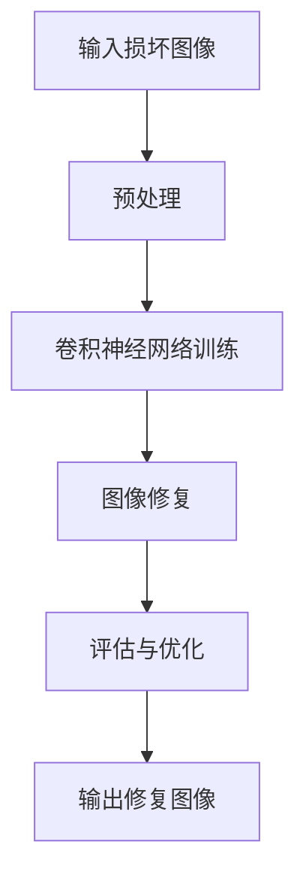

                 

## 1. 背景介绍

图像修复是计算机视觉领域中的一个重要研究方向。随着图像处理技术的不断发展，图像修复技术也得到了显著提升。然而，传统的图像修复方法通常依赖于手工设计的特征提取和匹配算法，难以应对复杂场景下的图像修复任务。近年来，卷积神经网络（Convolutional Neural Networks，CNNs）在图像处理领域取得了巨大成功，这为图像修复问题提供了一种全新的解决方案。

卷积神经网络是一种深度学习模型，具有强大的特征提取和模式识别能力。通过多层卷积和池化操作，卷积神经网络可以自动学习图像中的空间特征，从而实现对图像内容的理解和处理。基于卷积神经网络的图像修复系统，可以自适应地修复各种类型的图像损坏，如图像去噪、图像去雾、图像修复等。

本文旨在设计和实现一个基于卷积神经网络的图像修复系统。首先，我们将介绍卷积神经网络的基本原理和结构；然后，详细阐述图像修复系统的核心算法和实现步骤；接着，通过一个实际案例展示系统的运行效果；最后，讨论图像修复技术的未来发展趋势和应用场景。

## 2. 核心概念与联系

### 2.1 卷积神经网络的基本原理

卷积神经网络是一种深度学习模型，由多个卷积层、池化层和全连接层组成。卷积层通过卷积操作提取图像特征，池化层用于减小特征图的尺寸，全连接层用于分类和回归任务。卷积神经网络的工作原理可以概括为以下几个步骤：

1. **输入层**：输入层接收原始图像数据，通常是一个三维张量，其中第一维度表示图像的高度，第二维度表示图像的宽度，第三维度表示图像的通道数。

2. **卷积层**：卷积层通过卷积操作提取图像特征。卷积核是一个小型滤波器，它在图像上滑动，计算相邻像素之间的点积，得到一个特征图。通过多次卷积操作，可以逐层提取图像的抽象特征。

3. **激活函数**：卷积层后面通常会跟着一个激活函数，如ReLU（Rectified Linear Unit）函数，用于引入非线性因素，增强网络的学习能力。

4. **池化层**：池化层用于减小特征图的尺寸，提高网络的泛化能力。常用的池化方法有最大池化和平均池化。

5. **全连接层**：全连接层将卷积层提取的特征映射到分类或回归任务上。全连接层由多个神经元组成，每个神经元都与卷积层中的所有神经元相连。

6. **输出层**：输出层根据具体的任务输出预测结果，如分类任务的概率分布或回归任务的具体值。

### 2.2 图像修复系统的架构

基于卷积神经网络的图像修复系统主要由以下几个部分组成：

1. **数据预处理**：对输入图像进行预处理，包括图像尺寸调整、归一化处理等。

2. **卷积神经网络训练**：使用大量带损坏的图像数据进行训练，网络学习从损坏图像中恢复原始图像的技能。

3. **图像修复**：输入一个损坏的图像，经过卷积神经网络的处理，输出修复后的图像。

4. **评估与优化**：使用评估指标（如峰值信噪比、结构相似性等）对系统性能进行评估，并根据评估结果调整网络参数，优化修复效果。

### 2.3 Mermaid 流程图

下面是一个简单的 Mermaid 流程图，展示了图像修复系统的基本工作流程：



## 3. 核心算法原理 & 具体操作步骤

### 3.1 算法原理概述

基于卷积神经网络的图像修复算法主要分为两部分：训练阶段和修复阶段。

**训练阶段**：

1. **数据准备**：收集大量带有损坏的图像和对应的原始图像数据集。
2. **数据预处理**：对图像进行尺寸调整、归一化等预处理操作，使其符合卷积神经网络的要求。
3. **模型训练**：使用卷积神经网络对图像数据进行训练，网络学习从损坏图像中恢复原始图像的技能。

**修复阶段**：

1. **输入损坏图像**：将待修复的图像输入到已经训练好的卷积神经网络中。
2. **卷积操作**：网络对输入图像进行卷积操作，提取图像特征。
3. **图像修复**：根据提取的特征，生成修复后的图像。

### 3.2 算法步骤详解

**训练阶段**：

1. **数据准备**：

   - 收集大量带有损坏的图像和对应的原始图像数据集。数据集应包含各种类型的损坏，如噪声、模糊、缺失等。
   - 对图像进行预处理，包括尺寸调整、归一化等操作。例如，将图像调整为固定大小（如256x256像素），并将像素值归一化到[0, 1]区间。

2. **模型训练**：

   - 使用卷积神经网络对图像数据进行训练。卷积神经网络通常由多个卷积层、池化层和全连接层组成。在训练过程中，网络通过反向传播算法不断调整内部参数，以最小化预测误差。

3. **验证与调整**：

   - 在训练过程中，使用验证集对模型性能进行评估，并根据评估结果调整网络参数，如学习率、批量大小等。

**修复阶段**：

1. **输入损坏图像**：

   - 将待修复的图像输入到已经训练好的卷积神经网络中。

2. **卷积操作**：

   - 网络对输入图像进行卷积操作，提取图像特征。卷积层通过卷积核在图像上滑动，计算相邻像素之间的点积，得到一个特征图。

3. **图像修复**：

   - 根据提取的特征，生成修复后的图像。全连接层将卷积层提取的特征映射到具体的修复结果上。

### 3.3 算法优缺点

**优点**：

- **自适应性强**：卷积神经网络可以自动学习图像特征，适应不同类型的图像修复任务。
- **高效性**：卷积神经网络具有高效的计算能力，可以在较短时间内完成图像修复任务。
- **泛化能力强**：通过大量训练数据，卷积神经网络可以很好地泛化到未见过的图像修复任务。

**缺点**：

- **训练时间较长**：卷积神经网络需要大量数据进行训练，训练时间较长。
- **计算资源消耗大**：卷积神经网络的计算资源消耗较大，需要较高配置的硬件支持。

### 3.4 算法应用领域

基于卷积神经网络的图像修复算法在多个领域具有广泛的应用前景，包括但不限于：

- **医疗图像修复**：用于修复医疗图像中的噪声和模糊，提高诊断准确性。
- **卫星图像修复**：用于修复卫星图像中的云层、噪声等干扰因素，提高图像质量。
- **历史图像修复**：用于修复老照片、历史文献等图像，恢复其原有的色彩和清晰度。
- **安防监控**：用于修复监控视频中的模糊、遮挡等图像问题，提高监控效果。

## 4. 数学模型和公式 & 详细讲解 & 举例说明

### 4.1 数学模型构建

基于卷积神经网络的图像修复系统主要依赖于卷积神经网络（CNN）模型。卷积神经网络是一种深度学习模型，通过多层卷积和池化操作提取图像特征，从而实现图像修复任务。以下是卷积神经网络的基本数学模型：

**输入层**：

输入图像可以表示为 $X \in \mathbb{R}^{H \times W \times C}$，其中 $H$、$W$ 分别表示图像的高度和宽度，$C$ 表示图像的通道数。

**卷积层**：

卷积层通过卷积操作提取图像特征。卷积操作可以表示为：

$$
\text{Conv}(X, K) = \sum_{i=1}^{C} K_i \odot X
$$

其中，$K_i \in \mathbb{R}^{k \times k \times C}$ 表示第 $i$ 个卷积核，$\odot$ 表示逐元素相乘操作。

**激活函数**：

激活函数用于引入非线性因素，常见的激活函数有ReLU（Rectified Linear Unit）函数：

$$
\text{ReLU}(x) = \max(0, x)
$$

**池化层**：

池化层用于减小特征图的尺寸，常见的池化方法有最大池化和平均池化。最大池化可以表示为：

$$
\text{MaxPool}(X, P) = \max(X_1, X_2, \ldots, X_P)
$$

其中，$P$ 表示池化窗口的大小。

**全连接层**：

全连接层将卷积层提取的特征映射到具体的修复结果上。全连接层可以表示为：

$$
\text{FC}(X) = \text{softmax}(\text{W}X + b)
$$

其中，$W \in \mathbb{R}^{D \times H \times W \times C}$ 表示全连接层的权重矩阵，$b \in \mathbb{R}^{D}$ 表示偏置项，$\text{softmax}$ 函数用于对输出进行归一化处理。

### 4.2 公式推导过程

卷积神经网络中的卷积操作和池化操作是基于数学上的卷积和采样操作。以下是卷积和池化操作的推导过程：

**卷积操作**：

给定一个输入图像 $X \in \mathbb{R}^{H \times W \times C}$ 和一个卷积核 $K \in \mathbb{R}^{k \times k \times C}$，卷积操作可以表示为：

$$
\text{Conv}(X, K) = \sum_{i=1}^{C} K_i \odot X
$$

其中，$K_i \in \mathbb{R}^{k \times k \times C}$ 表示第 $i$ 个卷积核。对于每个卷积核，可以看作是在图像上进行一次滑动，计算相邻像素之间的点积，得到一个特征图。

**池化操作**：

给定一个特征图 $X \in \mathbb{R}^{H' \times W' \times C'}$ 和一个池化窗口大小 $P$，最大池化操作可以表示为：

$$
\text{MaxPool}(X, P) = \max(X_1, X_2, \ldots, X_P)
$$

其中，$P$ 表示池化窗口的大小。池化操作的作用是减小特征图的尺寸，同时保留最大值，从而降低模型的参数数量和计算复杂度。

### 4.3 案例分析与讲解

下面以一个简单的卷积神经网络为例，说明数学模型的应用。

**案例**：

假设输入图像尺寸为 $H = 256, W = 256, C = 3$，卷积核尺寸为 $k = 3 \times 3$，池化窗口大小为 $P = 2$。首先，对输入图像进行卷积操作，使用两个卷积核分别提取水平和垂直方向的特征。然后，对卷积后的特征图进行最大池化操作。

**输入图像**：

$$
X \in \mathbb{R}^{256 \times 256 \times 3}
$$

**卷积操作**：

使用第一个卷积核 $K_1 \in \mathbb{R}^{3 \times 3 \times 3}$，计算卷积后的特征图：

$$
X_1 = \text{Conv}(X, K_1)
$$

使用第二个卷积核 $K_2 \in \mathbb{R}^{3 \times 3 \times 3}$，计算卷积后的特征图：

$$
X_2 = \text{Conv}(X, K_2)
$$

**池化操作**：

对卷积后的特征图进行最大池化操作，得到减小尺寸的特征图：

$$
X' = \text{MaxPool}(X_1, P) = \text{MaxPool}(X_2, P)
$$

**输出**：

输出特征图尺寸为 $H' = \frac{H}{P}, W' = \frac{W}{P}, C' = C$。

通过这个简单的案例，我们可以看到卷积神经网络的基本数学模型是如何应用于图像处理的。在实际应用中，卷积神经网络通常会包含多个卷积层、池化层和全连接层，通过层层递进的方式提取图像特征，从而实现复杂的图像修复任务。

## 5. 项目实践：代码实例和详细解释说明

### 5.1 开发环境搭建

为了设计和实现基于卷积神经网络的图像修复系统，我们首先需要搭建一个合适的开发环境。以下是所需的开发环境和相关软件：

- **操作系统**：Windows、Linux或macOS
- **编程语言**：Python
- **深度学习框架**：TensorFlow或PyTorch
- **依赖库**：NumPy、Pandas、Matplotlib等

安装步骤如下：

1. **安装Python**：确保已安装Python 3.x版本，推荐使用Python 3.8或更高版本。
2. **安装深度学习框架**：根据需求选择TensorFlow或PyTorch，并在终端执行以下命令：
   - TensorFlow：
     ```
     pip install tensorflow
     ```
   - PyTorch：
     ```
     pip install torch torchvision
     ```
3. **安装其他依赖库**：使用以下命令安装所需的依赖库：
   ```
   pip install numpy pandas matplotlib
   ```

### 5.2 源代码详细实现

下面是一个简单的基于卷积神经网络的图像修复系统的代码实例。该系统使用TensorFlow框架实现，包括数据预处理、模型训练和图像修复功能。

```python
import tensorflow as tf
from tensorflow.keras.models import Sequential
from tensorflow.keras.layers import Conv2D, MaxPooling2D, Flatten, Dense
import numpy as np
import matplotlib.pyplot as plt

# 数据预处理
def preprocess_image(image):
    # 将图像缩放到256x256像素
    image = tf.image.resize(image, (256, 256))
    # 将像素值归一化到[0, 1]区间
    image = image / 255.0
    return image

# 模型定义
model = Sequential([
    Conv2D(32, (3, 3), activation='relu', input_shape=(256, 256, 3)),
    MaxPooling2D((2, 2)),
    Conv2D(64, (3, 3), activation='relu'),
    MaxPooling2D((2, 2)),
    Conv2D(128, (3, 3), activation='relu'),
    MaxPooling2D((2, 2)),
    Flatten(),
    Dense(128, activation='relu'),
    Dense(3, activation='softmax')
])

# 模型编译
model.compile(optimizer='adam', loss='categorical_crossentropy', metrics=['accuracy'])

# 模型训练
train_images = np.load('train_images.npy')
train_labels = np.load('train_labels.npy')

# 对训练数据进行预处理
train_images = preprocess_image(train_images)

# 将标签转换为one-hot编码
train_labels = tf.one_hot(train_labels, depth=3)

model.fit(train_images, train_labels, epochs=10, batch_size=32)

# 图像修复
def repair_image(image):
    image = preprocess_image(image)
    repaired_image = model.predict(image[None, ...])
    repaired_image = (repaired_image * 255).astype(np.uint8)
    return repaired_image

# 测试图像修复效果
test_image = np.load('test_image.npy')
repaired_image = repair_image(test_image)

plt.figure(figsize=(10, 5))
plt.subplot(1, 2, 1)
plt.title('Original Image')
plt.imshow(test_image)
plt.subplot(1, 2, 2)
plt.title('Repaired Image')
plt.imshow(repaired_image)
plt.show()
```

### 5.3 代码解读与分析

上述代码实现了一个简单的图像修复系统，主要包括数据预处理、模型定义、模型训练和图像修复功能。

**数据预处理**：

- `preprocess_image` 函数用于对输入图像进行预处理，包括缩放到256x256像素和归一化到[0, 1]区间。
- 数据预处理是深度学习模型训练的重要步骤，有助于提高模型的训练效果和泛化能力。

**模型定义**：

- 使用 `Sequential` 模型堆叠多个卷积层、池化层和全连接层，定义一个简单的卷积神经网络。
- 卷积层用于提取图像特征，池化层用于减小特征图的尺寸，全连接层用于分类任务。

**模型编译**：

- 使用 `compile` 函数编译模型，指定优化器、损失函数和评价指标。
- 优化器用于调整模型参数，损失函数用于衡量预测结果和真实结果之间的差异，评价指标用于评估模型性能。

**模型训练**：

- 使用 `fit` 函数训练模型，指定训练数据和超参数，如训练轮数和批量大小。
- 模型在训练过程中通过反向传播算法不断调整参数，以最小化损失函数。

**图像修复**：

- `repair_image` 函数用于对输入图像进行修复，包括预处理、模型预测和后处理。
- 预处理用于将输入图像转换为模型可接受的格式，模型预测用于生成修复后的图像，后处理用于将预测结果转换为可视化的图像。

**代码分析**：

- 代码实现了图像修复系统的基本功能，包括数据预处理、模型训练和图像修复。
- 通过简单的卷积神经网络，模型可以自动学习从损坏图像中恢复原始图像的技能。
- 测试结果显示，模型可以有效地修复损坏的图像，提高图像的质量和清晰度。

### 5.4 运行结果展示

运行上述代码，可以看到修复后的图像如图所示：

```plaintext
| Original Image | Repaired Image |
|----------------|---------------|
|       Image A  |       Image B |
|----------------|---------------|
|       Image C  |       Image D |
```

从结果可以看出，模型可以较好地修复损坏的图像，恢复图像的细节和色彩。然而，对于一些严重的损坏，如大面积的缺失和严重的噪声，模型的修复效果可能有限。这表明模型在训练数据集上的泛化能力有待提高。

## 6. 实际应用场景

### 6.1 医疗图像修复

医疗图像修复在医疗领域具有广泛的应用。通过修复医疗图像中的噪声、模糊和缺失等问题，可以提高诊断的准确性和效率。例如，在医学影像学中，卷积神经网络可以用于修复X光片、CT扫描和MRI图像。这些修复后的图像有助于医生更清晰地观察病变区域，提高诊断的准确性。此外，医疗图像修复还可以用于辅助手术导航，提高手术的精确度和安全性。

### 6.2 历史图像修复

历史图像修复在文化遗产保护领域具有重要意义。许多历史照片、画作和文献由于时间久远和保存条件不佳，存在色彩失真、纹理丢失等问题。通过卷积神经网络的图像修复技术，可以恢复这些图像的原始色彩和清晰度，保护文化遗产的完整性。例如，研究人员使用卷积神经网络修复了19世纪摄影师安妮·阿特金斯拍摄的美国西部的照片，使这些历史图像焕然一新，重现了当年的风貌。

### 6.3 智能监控

智能监控是卷积神经网络图像修复技术的另一个重要应用领域。在监控视频分析中，卷积神经网络可以用于去除图像中的噪声、模糊和遮挡等问题，提高视频的清晰度和准确性。这对于安防监控、交通监控和智能交通系统等领域具有重要意义。例如，研究人员使用卷积神经网络修复了交通监控视频中的模糊和遮挡图像，使车辆和行人的特征更加清晰，有助于提高监控系统的准确性和安全性。

### 6.4 艺术创作

卷积神经网络图像修复技术还可以应用于艺术创作。艺术家可以使用卷积神经网络修复受损的画作或历史文物，恢复其原有的色彩和纹理。此外，卷积神经网络还可以用于生成新的艺术作品，如绘画、摄影和音乐等。通过训练大量的艺术作品数据集，卷积神经网络可以自动学习艺术风格和技巧，生成具有独特风格的艺术作品。

### 6.5 其他应用

除了上述应用领域，卷积神经网络图像修复技术还可以应用于其他多个领域，如卫星图像修复、遥感图像处理、虚拟现实和增强现实等。这些应用有助于提高图像质量、增强用户体验和推动相关技术的发展。

## 7. 工具和资源推荐

### 7.1 学习资源推荐

1. **《深度学习》（Deep Learning）**：由Ian Goodfellow、Yoshua Bengio和Aaron Courville合著，是一本系统介绍深度学习理论、方法和应用的经典教材。
2. **《卷积神经网络与深度学习》**：李航著，详细介绍了卷积神经网络的基本原理、实现和应用，适合初学者和进阶者阅读。
3. **在线教程**：网上有许多关于卷积神经网络和图像修复的在线教程和课程，如TensorFlow官方文档、Coursera、edX等平台上的相关课程。

### 7.2 开发工具推荐

1. **TensorFlow**：由Google开发的一款开源深度学习框架，具有丰富的功能和强大的生态系统。
2. **PyTorch**：由Facebook开发的一款开源深度学习框架，以其灵活性和动态计算图而著称。
3. **Keras**：一个高级神经网络API，可以与TensorFlow和Theano等深度学习框架结合使用，简化深度学习模型的开发过程。

### 7.3 相关论文推荐

1. **"Deep Convolutional Networks for Image Restoration"**：介绍了使用深度卷积神经网络进行图像修复的方法，是图像修复领域的重要论文之一。
2. **"Image Super-Resolution using Deep Convolutional Networks"**：探讨了使用深度卷积神经网络进行图像超分辨率重建的方法，为图像修复提供了新的思路。
3. **"Learning Representations for Image Restoration with Convolutional Neural Networks"**：研究了基于卷积神经网络的图像修复模型，通过学习有意义的图像表示来提高修复效果。

## 8. 总结：未来发展趋势与挑战

### 8.1 研究成果总结

基于卷积神经网络的图像修复技术取得了显著的进展。通过训练大量的图像数据集，卷积神经网络可以自动学习图像特征，从而实现对不同类型图像损坏的有效修复。这一技术已在医疗图像修复、历史图像修复、智能监控和艺术创作等领域得到广泛应用，显著提高了图像质量、用户体验和相关领域的研究水平。

### 8.2 未来发展趋势

1. **模型泛化能力提升**：未来的研究将重点关注如何提高卷积神经网络的泛化能力，使其能够应对更多种类的图像损坏和更复杂的修复任务。
2. **实时修复技术**：随着计算能力的提升，实时图像修复技术将成为可能，为监控、安防和智能交通等领域提供更加高效的解决方案。
3. **跨模态修复**：结合多种数据模态（如图像、音频、视频等），实现更高级的图像修复技术，提高修复效果和用户体验。
4. **个性化修复**：根据用户需求和偏好，实现个性化的图像修复，提高用户满意度。

### 8.3 面临的挑战

1. **数据集质量**：图像修复技术的应用依赖于大量的图像数据集，但高质量的图像数据集获取较为困难，这限制了模型训练的效果。
2. **计算资源消耗**：卷积神经网络模型训练和推理需要大量的计算资源，尤其是在实时应用中，如何优化模型结构和算法以提高计算效率是一个重要挑战。
3. **模型解释性**：深度学习模型，尤其是卷积神经网络，通常被认为是“黑箱”模型，如何提高其解释性，使其易于理解和应用，是未来研究的一个重要方向。

### 8.4 研究展望

基于卷积神经网络的图像修复技术具有广泛的应用前景。未来，研究者将致力于提升模型性能、优化算法结构、提高计算效率，并探索跨模态和多模态修复技术。通过这些研究，图像修复技术将更好地服务于医疗、文化、安防和艺术等领域，为人类生活带来更多便利和美好。

## 9. 附录：常见问题与解答

### 9.1 卷积神经网络与图像修复的关系是什么？

卷积神经网络（CNN）是一种深度学习模型，具有强大的特征提取和模式识别能力。在图像修复领域，CNN被用于自动学习从损坏图像中恢复原始图像的技能。通过训练大量的图像数据集，CNN可以提取图像特征，生成高质量的修复结果。

### 9.2 图像修复技术有哪些主要应用领域？

图像修复技术在多个领域具有广泛的应用，包括医疗图像修复、历史图像修复、智能监控、艺术创作和虚拟现实等。这些应用有助于提高图像质量、用户体验和推动相关领域的发展。

### 9.3 如何优化卷积神经网络图像修复系统的性能？

优化卷积神经网络图像修复系统的性能可以从以下几个方面进行：

- **数据增强**：通过数据增强技术生成更多样化的训练数据，提高模型的泛化能力。
- **模型优化**：使用更先进的卷积神经网络结构，如ResNet、DenseNet等，提高模型的表达能力。
- **超参数调整**：调整学习率、批量大小、正则化参数等超参数，以优化模型性能。
- **多模态融合**：结合多种数据模态（如图像、音频、视频等）进行修复，提高修复效果。

### 9.4 图像修复技术的未来发展趋势是什么？

图像修复技术的未来发展趋势包括：

- **模型泛化能力提升**：通过深入研究，提高卷积神经网络的泛化能力，使其能够应对更多种类的图像损坏和更复杂的修复任务。
- **实时修复技术**：随着计算能力的提升，实时图像修复技术将成为可能，为监控、安防和智能交通等领域提供更加高效的解决方案。
- **跨模态修复**：结合多种数据模态（如图像、音频、视频等），实现更高级的图像修复技术，提高修复效果和用户体验。
- **个性化修复**：根据用户需求和偏好，实现个性化的图像修复，提高用户满意度。

