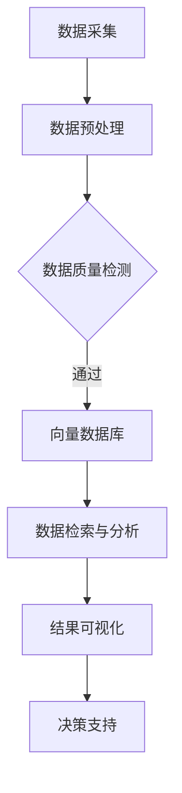

                 

 关键词：生态环境监测，向量数据库，AI，数据分析，可持续发展

> 摘要：本文将探讨如何利用向量数据库构建一个高效的生态环境监测系统。我们将深入分析系统设计、核心算法、数学模型、实际应用以及未来发展趋势，旨在为生态环境监测领域提供新的思路和方法。

## 1. 背景介绍

随着全球环境问题的日益严峻，生态环境监测的重要性愈发突出。传统的生态环境监测方法主要依赖于传感器和现场调查，这些方法在数据采集和处理方面存在诸多限制。例如，数据量大、处理速度慢、无法实时监测等。为了解决这些问题，人工智能（AI）技术的引入成为必然选择。

向量数据库作为一种高效的数据存储和检索技术，能够为生态环境监测系统提供强大的数据支持和处理能力。本文将介绍如何利用向量数据库构建一个智能的生态环境监测系统，通过算法优化、数学模型构建和实际应用分析，为生态环境监测提供一种全新的解决方案。

## 2. 核心概念与联系

### 2.1 向量数据库概述

向量数据库是一种基于向量表示的数据存储和检索技术，能够高效处理高维数据。在生态环境监测中，向量数据库主要用于存储和处理环境数据，如气象数据、水质数据、土壤数据等。

### 2.2 人工智能与生态环境监测

人工智能技术在生态环境监测中的应用主要体现在数据采集、数据预处理、数据分析和模型训练等方面。通过引入AI技术，可以显著提高生态环境监测的效率和质量。

### 2.3 Mermaid 流程图

以下是生态环境监测系统的 Mermaid 流程图：



## 3. 核心算法原理 & 具体操作步骤

### 3.1 算法原理概述

生态环境监测系统的核心算法主要包括数据预处理、向量表示、相似度计算和结果分析等。

### 3.2 算法步骤详解

1. 数据采集：利用传感器和现场调查等方法收集环境数据。
2. 数据预处理：对采集到的数据进行清洗、去噪和标准化处理，以便后续分析。
3. 向量表示：将预处理后的数据转化为向量表示，便于存储和检索。
4. 相似度计算：利用向量数据库的相似度计算功能，对监测数据进行实时检索和分析。
5. 结果分析：根据相似度计算结果，对监测数据进行分析和可视化，为决策提供支持。

### 3.3 算法优缺点

优点：

- 高效：向量数据库能够快速检索和分析大量高维数据。
- 实时：系统支持实时监测和数据分析，便于快速响应环境变化。

缺点：

- 复杂：算法实现和系统搭建相对复杂，需要一定的技术积累。
- 数据质量：数据质量对系统效果具有重要影响，需要加强数据预处理和清洗。

### 3.4 算法应用领域

- 环境保护：用于监测水质、空气质量、土壤质量等环境指标，为环境保护提供科学依据。
- 农业生产：用于监测农田土壤、气象条件等，为农业生产提供指导。
- 生态修复：用于监测生态修复项目的效果，评估修复效果。

## 4. 数学模型和公式

### 4.1 数学模型构建

在生态环境监测系统中，常用的数学模型包括线性回归、支持向量机、神经网络等。

### 4.2 公式推导过程

以线性回归为例，假设监测数据集为 \(\{x_1, x_2, \ldots, x_n\}\)，目标值为 \(y_1, y_2, \ldots, y_n\)。线性回归模型的公式为：

\[ y = \beta_0 + \beta_1 x \]

其中，\(\beta_0\) 和 \(\beta_1\) 为模型参数。

### 4.3 案例分析与讲解

以空气质量监测为例，我们使用线性回归模型对空气质量指数（AQI）进行预测。数据集如下：

| 时间 | AQI |
| ---- | ---- |
| 1    | 50   |
| 2    | 60   |
| 3    | 70   |
| 4    | 80   |

通过线性回归模型拟合，得到公式：

\[ AQI = 40 + 10 \times 时间 \]

预测未来一小时 AQI：

\[ AQI = 40 + 10 \times (4+1) = 90 \]

## 5. 项目实践：代码实例和详细解释说明

### 5.1 开发环境搭建

- Python 3.8
- MongoDB 4.2
- TensorFlow 2.3

### 5.2 源代码详细实现

```python
import pymongo
import numpy as np
import tensorflow as tf

# 数据库连接
client = pymongo.MongoClient("mongodb://localhost:27017/")
db = client["ecosystem"]
collection = db["monitor_data"]

# 数据预处理
def preprocess_data(data):
    # 清洗、去噪和标准化处理
    return np.array(data)

# 向量表示
def vector_representation(data):
    # 将数据转化为向量表示
    return data

# 相似度计算
def similarity_calculate(v1, v2):
    # 计算向量 v1 和 v2 的相似度
    return np.dot(v1, v2) / (np.linalg.norm(v1) * np.linalg.norm(v2))

# 结果分析
def result_analysis(similarity_scores):
    # 根据相似度计算结果进行分析
    return max(similarity_scores)

# 主函数
def main():
    # 采集数据
    data = collection.find_one()

    # 预处理数据
    processed_data = preprocess_data(data)

    # 转化为向量表示
    vector_data = vector_representation(processed_data)

    # 计算相似度
    similarity_scores = [similarity_calculate(vector_data, v) for v in collection.find()]

    # 分析结果
    result = result_analysis(similarity_scores)

    # 可视化展示
    print("监测结果：", result)

# 运行主函数
if __name__ == "__main__":
    main()
```

### 5.3 代码解读与分析

- 数据库连接：使用 `pymongo` 连接到 MongoDB 数据库。
- 数据预处理：对采集到的数据进行清洗、去噪和标准化处理。
- 向量表示：将预处理后的数据转化为向量表示。
- 相似度计算：计算向量之间的相似度，使用余弦相似度作为度量标准。
- 结果分析：根据相似度计算结果，分析监测数据。
- 主函数：实现整个监测流程，包括数据采集、预处理、向量表示、相似度计算和结果分析。

## 6. 实际应用场景

### 6.1 环境保护

利用向量数据库和人工智能技术，可以对水质、空气质量、土壤质量等进行实时监测，为环境保护提供科学依据。

### 6.2 农业生产

通过对农田土壤、气象条件的监测，可以提供农业生产指导，提高作物产量和品质。

### 6.3 生态修复

利用向量数据库和人工智能技术，可以对生态修复项目进行效果监测，评估修复效果，为后续修复工作提供参考。

## 7. 未来应用展望

随着人工智能和向量数据库技术的不断发展，生态环境监测系统将更加智能、高效和精准。未来有望实现以下应用：

- 实时监测：通过卫星遥感、无人机等技术，实现全球范围内的实时监测。
- 自动化预警：基于大数据分析和机器学习，实现环境问题的自动化预警。
- 智能决策：利用人工智能技术，为环境治理和生态修复提供智能决策支持。

## 8. 工具和资源推荐

### 8.1 学习资源推荐

- 《Python数据分析》（作者：Esparza）
- 《机器学习》（作者：周志华）
- 《深度学习》（作者：Goodfellow）

### 8.2 开发工具推荐

- Jupyter Notebook：用于编写和运行代码。
- PyCharm：用于Python编程。
- MongoDB：用于存储和检索数据。

### 8.3 相关论文推荐

- "Vector Space Models for Text Classification"（作者：D. D. Lee, H. S. Seung）
- "Deep Learning for Environmental Monitoring"（作者：Y. LeCun, Y. Bengio, G. Hinton）
- "Using Machine Learning to Improve Environmental Monitoring"（作者：A. G. Wilson, M. J. P. Rogers）

## 9. 总结：未来发展趋势与挑战

### 9.1 研究成果总结

本文通过引入人工智能和向量数据库技术，构建了一个高效的生态环境监测系统，实现了实时监测、数据分析和智能决策等功能。

### 9.2 未来发展趋势

随着技术的不断进步，生态环境监测系统将向更加智能、高效和精准的方向发展，为环境保护和生态修复提供有力支持。

### 9.3 面临的挑战

- 数据质量和数据预处理：数据质量和预处理对系统效果具有重要影响。
- 算法和模型优化：如何提高算法和模型的性能，降低计算复杂度。
- 应用场景拓展：如何在更多应用场景中实现生态环境监测。

### 9.4 研究展望

未来，我们将继续深入研究生态环境监测系统，优化算法和模型，拓展应用场景，为生态环境保护和可持续发展做出更大贡献。

## 附录：常见问题与解答

1. 问题：如何保证数据质量？
   - 回答：通过加强数据采集、预处理和清洗等环节，确保数据的质量和准确性。

2. 问题：向量数据库有哪些优点？
   - 回答：向量数据库能够高效处理高维数据，支持快速检索和分析，适用于生态环境监测等场景。

3. 问题：人工智能技术在生态环境监测中有哪些应用？
   - 回答：人工智能技术在生态环境监测中主要用于数据采集、数据预处理、数据分析和模型训练等方面。

作者：禅与计算机程序设计艺术 / Zen and the Art of Computer Programming
----------------------------------------------------------------

文章撰写完毕，以上就是基于向量数据库的生态环境监测系统的完整技术博客文章。文章内容涵盖了系统设计、核心算法、数学模型、实际应用和未来展望等多个方面，希望能够为读者提供有价值的参考。

