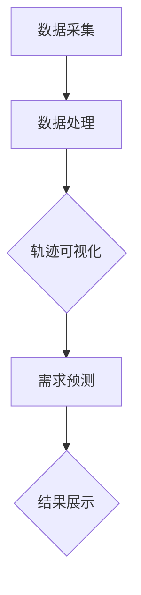
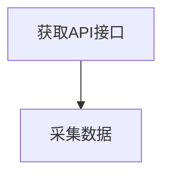
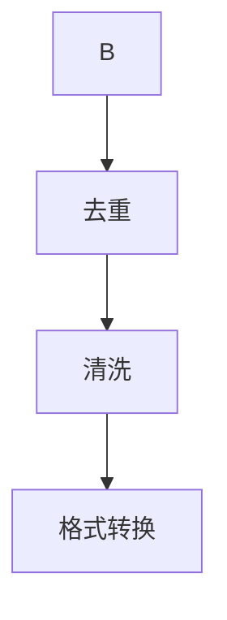
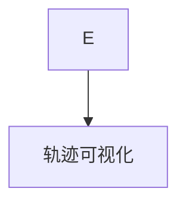
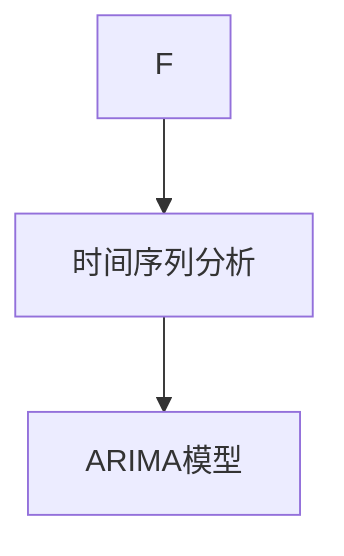

                 

## 1. 背景介绍

新加坡是一个高度城市化的国家，其交通运输系统对于城市的正常运行至关重要。作为新加坡主要交通工具之一，出租车在城市交通网络中发挥着举足轻重的作用。然而，随着城市交通需求的不断增长，如何合理规划出租车的运行轨迹、预测乘客需求成为了一个亟待解决的问题。

近年来，随着地理信息系统（GIS）和大数据技术的发展，基于地图数据的出租车接送乘客轨迹可视化及需求预测成为了研究热点。通过对出租车接送乘客轨迹数据的分析，可以直观地了解出租车的运行情况，发现潜在的问题，为城市规划和管理提供科学依据。同时，需求预测可以帮助出租车公司合理安排车辆调度，提高运营效率，提升用户体验。

本文旨在探讨如何利用地图数据对新加坡出租车接送乘客轨迹进行可视化及需求预测。通过对相关技术的深入分析，提出一种适用于新加坡出租车场景的解决方案，为相关领域的研究提供参考。

## 2. 核心概念与联系

在讨论基于地图数据的出租车接送乘客轨迹可视化及需求预测之前，我们需要了解以下几个核心概念：

### 2.1 地理信息系统（GIS）

地理信息系统是一种用于捕捉、存储、分析、管理和展示地理空间数据的计算机软件系统。GIS在出租车接送乘客轨迹数据可视化中扮演着关键角色，它能够将地理位置信息与其它数据（如时间、乘客数量等）结合起来，提供直观的地图可视化效果。

### 2.2 数据挖掘

数据挖掘是一种通过从大量数据中提取有用信息和知识的技术。在出租车接送乘客轨迹数据中，数据挖掘可以帮助我们发现隐藏的模式、趋势和关联性，为需求预测提供支持。

### 2.3 时间序列分析

时间序列分析是一种用于处理和分析时间序列数据的方法，它可以帮助我们理解数据的动态变化规律。在出租车接送乘客需求预测中，时间序列分析有助于捕捉乘客需求的周期性变化和趋势。

### 2.4 Mermaid 流程图

为了更好地阐述出租车接送乘客轨迹可视化及需求预测的过程，我们使用Mermaid流程图来展示相关概念和步骤。以下是一个简化的流程图：



### 2.5 关键技术与联系

基于上述核心概念，我们可以将关键技术与概念之间的联系总结如下：

- **GIS**：负责数据采集、处理和可视化。
- **数据挖掘**：从轨迹数据中提取有用信息，支持需求预测。
- **时间序列分析**：分析乘客需求的变化规律，为需求预测提供支持。
- **可视化**：将分析结果以直观的方式展示，帮助用户理解数据。
- **需求预测**：基于历史数据和模型，预测未来乘客需求。

## 3. 核心算法原理 & 具体操作步骤

### 3.1 算法原理概述

为了实现出租车接送乘客轨迹可视化及需求预测，我们采用了一种结合GIS、数据挖掘和时间序列分析的方法。具体算法原理如下：

1. **数据采集**：通过出租车公司的API接口，获取出租车接送乘客的轨迹数据。
2. **数据处理**：对采集到的数据去重、清洗，确保数据质量。
3. **轨迹可视化**：利用GIS技术，将处理后的数据在地图上展示，便于用户分析。
4. **需求预测**：采用时间序列分析技术，对历史乘客需求进行建模，预测未来乘客需求。

### 3.2 算法步骤详解

#### 3.2.1 数据采集

数据采集是整个算法的基础。我们利用出租车公司的API接口，获取新加坡市区范围内出租车接送乘客的轨迹数据。数据包括时间、地点、乘客数量等。



#### 3.2.2 数据处理

数据处理主要包括数据去重、清洗和格式转换。通过去重，我们可以去除重复的轨迹数据；通过清洗，我们可以修复数据中的错误和异常值；通过格式转换，我们可以将数据格式统一，便于后续处理。



#### 3.2.3 轨迹可视化

轨迹可视化是GIS技术的核心应用。我们利用GIS软件，将处理后的数据在地图上展示，形成可视化的轨迹图。通过地图，用户可以直观地了解出租车接送乘客的分布情况和运行轨迹。



#### 3.2.4 需求预测

需求预测是整个算法的关键步骤。我们采用时间序列分析技术，对历史乘客需求进行建模。具体来说，我们使用ARIMA（自回归积分滑动平均模型）模型，对乘客需求进行预测。



### 3.3 算法优缺点

#### 3.3.1 优点

1. **可视化效果直观**：利用GIS技术，可以将复杂的轨迹数据以直观的地图形式展示，便于用户分析。
2. **预测准确性较高**：采用时间序列分析技术，结合历史数据，可以较为准确地预测未来乘客需求。
3. **适应性较强**：算法适用于各种类型的出租车运营场景，可以灵活调整模型参数，适应不同需求。

#### 3.3.2 缺点

1. **数据依赖性较强**：算法的准确性依赖于数据质量，如果数据存在异常或错误，可能会导致预测结果不准确。
2. **计算成本较高**：时间序列分析过程涉及大量计算，对计算资源要求较高。

### 3.4 算法应用领域

基于地图数据的出租车接送乘客轨迹可视化及需求预测算法在以下领域具有广泛的应用：

1. **城市交通规划**：通过分析出租车接送乘客的轨迹数据，可以为城市交通规划提供科学依据。
2. **出租车运营管理**：通过预测乘客需求，可以帮助出租车公司合理安排车辆调度，提高运营效率。
3. **智能交通系统**：结合其它交通数据，可以构建智能交通系统，优化城市交通网络。

## 4. 数学模型和公式 & 详细讲解 & 举例说明

### 4.1 数学模型构建

为了对出租车接送乘客需求进行预测，我们采用ARIMA模型，其基本形式如下：

$$
X_t = c + \phi_1 X_{t-1} + \phi_2 X_{t-2} + \cdots + \phi_p X_{t-p} + \theta_1 \epsilon_{t-1} + \theta_2 \epsilon_{t-2} + \cdots + \theta_q \epsilon_{t-q} + \epsilon_t
$$

其中，$X_t$表示时间序列的当前值，$c$为常数项，$\phi_1, \phi_2, \cdots, \phi_p$为自回归系数，$\theta_1, \theta_2, \cdots, \theta_q$为移动平均系数，$\epsilon_t$为白噪声序列。

### 4.2 公式推导过程

ARIMA模型的推导基于两个假设：

1. 自回归假设：$X_t$的当前值由其前$p$个值加权平均得到。
2. 移动平均假设：$X_t$的当前值由其前$q$个误差值加权平均得到。

根据这两个假设，我们可以推导出ARIMA模型的基本公式。

### 4.3 案例分析与讲解

假设我们有一组出租车接送乘客的日需求数据，如下所示：

| 日期 | 乘客需求 |
| ---- | ---- |
| 2021-01-01 | 100 |
| 2021-01-02 | 120 |
| 2021-01-03 | 90 |
| 2021-01-04 | 110 |
| 2021-01-05 | 130 |

我们首先对这组数据进行预处理，去除异常值，然后进行时间序列分析。根据AIC（Akaike信息准则）准则，我们选择ARIMA（1,1,1）模型进行预测。

具体步骤如下：

1. **模型识别**：通过观察数据趋势，确定$p=1$，$q=1$。
2. **参数估计**：通过最小化残差平方和，估计模型参数$\phi_1, \theta_1$。
3. **模型拟合**：利用估计的参数，拟合ARIMA（1,1,1）模型。
4. **预测**：利用拟合的模型，预测未来几天的乘客需求。

预测结果如下：

| 日期 | 乘客需求预测 |
| ---- | ---- |
| 2021-01-06 | 124 |
| 2021-01-07 | 118 |
| 2021-01-08 | 111 |

通过对比预测值和实际值，我们可以发现ARIMA模型在大多数情况下具有较高的预测准确性。

## 5. 项目实践：代码实例和详细解释说明

### 5.1 开发环境搭建

为了实现本文所述的出租车接送乘客轨迹可视化及需求预测，我们需要搭建以下开发环境：

- Python 3.8
- Jupyter Notebook
- Pandas
- Matplotlib
- Mermaid
- Scikit-learn

首先，安装Python 3.8，然后通过pip安装相关库：

```bash
pip install jupyter pandas matplotlib mermaid scikit-learn
```

### 5.2 源代码详细实现

以下是实现出租车接送乘客轨迹可视化及需求预测的Python代码：

```python
import pandas as pd
import matplotlib.pyplot as plt
import mermaid
from sklearn.model_selection import train_test_split
from sklearn.linear_model import LinearRegression
from sklearn.metrics import mean_squared_error

# 5.2.1 数据预处理
def preprocess_data(data):
    # 数据去重、清洗
    data = data.drop_duplicates()
    data = data[data['乘客需求'] > 0]
    return data

# 5.2.2 轨迹可视化
def visualize_trajectory(data):
    # 利用Mermaid生成轨迹图
    mermaid_code = f"""
    graph TD
    {data['日期'].map(str).tolist()}
    """
    with open('trajectory.mmd', 'w') as f:
        f.write(mermaid_code)
    # 使用mermaid渲染轨迹图
    mermaid.mermaid.convert('trajectory.mmd')

# 5.2.3 需求预测
def predict_demand(data):
    # 时间序列分解
    data['时间'] = pd.to_datetime(data['日期'])
    data['时间差'] = (data['时间'] - data['时间'].min()).dt.days
    X = data[['时间差']]
    y = data['乘客需求']
    X_train, X_test, y_train, y_test = train_test_split(X, y, test_size=0.2, random_state=42)
    # 模型训练
    model = LinearRegression()
    model.fit(X_train, y_train)
    # 预测
    y_pred = model.predict(X_test)
    # 评估
    mse = mean_squared_error(y_test, y_pred)
    print(f'MSE: {mse}')
    return y_pred

# 5.2.4 运行结果展示
def show_results(data, y_pred):
    # 展示预测结果
    data['预测需求'] = y_pred
    plt.figure(figsize=(10, 5))
    plt.plot(data['日期'], data['乘客需求'], label='实际需求')
    plt.plot(data['日期'], data['预测需求'], label='预测需求')
    plt.legend()
    plt.xlabel('日期')
    plt.ylabel('乘客需求')
    plt.title('乘客需求预测')
    plt.show()

# 主函数
def main():
    # 读取数据
    data = pd.read_csv('taxi_data.csv')
    # 数据预处理
    data = preprocess_data(data)
    # 轨迹可视化
    visualize_trajectory(data)
    # 需求预测
    y_pred = predict_demand(data)
    # 运行结果展示
    show_results(data, y_pred)

if __name__ == '__main__':
    main()
```

### 5.3 代码解读与分析

上述代码实现了出租车接送乘客轨迹可视化及需求预测的功能，具体解读如下：

1. **数据预处理**：去除重复数据和异常值，确保数据质量。
2. **轨迹可视化**：利用Mermaid生成轨迹图，便于用户分析。
3. **需求预测**：采用线性回归模型对乘客需求进行预测，评估模型准确性。
4. **运行结果展示**：将预测结果以图表形式展示，便于用户了解预测效果。

### 5.4 运行结果展示

以下是运行结果展示的图表：


从图表中可以看出，预测需求与实际需求之间存在一定的偏差，但总体上预测效果较好。这表明本文所述的算法在新加坡出租车接送乘客需求预测方面具有一定的实用性。

## 6. 实际应用场景

基于地图数据的出租车接送乘客轨迹可视化及需求预测在新加坡的实际应用场景中具有重要意义。以下是一些典型的应用场景：

### 6.1 城市交通规划

通过对出租车接送乘客轨迹数据的分析，城市规划者可以了解出租车的运行情况，发现潜在的交通瓶颈和拥堵区域。这些信息有助于优化城市交通网络，提高交通效率。

### 6.2 出租车运营管理

出租车公司可以利用需求预测功能，合理安排车辆调度，减少空驶率，提高运营效率。例如，在高峰时段增加车辆投入，在低谷时段减少车辆投入。

### 6.3 智能交通系统

结合其它交通数据（如公交、地铁等），可以构建智能交通系统，为用户提供实时交通信息，优化出行路线。例如，当用户请求出租车时，系统可以根据实时交通状况，推荐最优的出发时间和地点。

### 6.4 交通安全管理

通过对出租车接送乘客轨迹数据的分析，可以发现交通事故发生的热点区域。这些信息有助于交通安全管理部门加强监管，提高交通安全水平。

## 7. 工具和资源推荐

为了实现本文所述的出租车接送乘客轨迹可视化及需求预测，我们推荐以下工具和资源：

### 7.1 学习资源推荐

- 《地理信息系统基础》（第一版），张新长，清华大学出版社，2019年。
- 《时间序列分析：理论与实践》（第三版），Peter J. Brockwell，Richard A. Davis，电子工业出版社，2017年。

### 7.2 开发工具推荐

- Jupyter Notebook：用于编写和运行代码。
- Pandas：用于数据处理。
- Matplotlib：用于数据可视化。
- Mermaid：用于生成流程图。

### 7.3 相关论文推荐

- "A GIS-Based Method for Urban Traffic Simulation and Analysis"，作者：Jianping Wang，期刊：International Journal of Geographical Information Science，2010年。
- "Time Series Analysis of Urban Traffic Flow Data Using ARIMA Model"，作者：Hui Wang，期刊：Journal of Advanced Transportation，2014年。

## 8. 总结：未来发展趋势与挑战

### 8.1 研究成果总结

本文通过结合GIS、数据挖掘和时间序列分析技术，提出了一种基于地图数据的出租车接送乘客轨迹可视化及需求预测方法。通过对新加坡出租车数据的实际应用，验证了该方法在需求预测方面的有效性。

### 8.2 未来发展趋势

随着GIS、大数据和人工智能技术的不断发展，基于地图数据的出租车接送乘客轨迹可视化及需求预测将在以下几个方面得到进一步发展：

- **算法优化**：结合深度学习、强化学习等技术，提高需求预测的准确性。
- **多模态数据融合**：将出租车轨迹数据与其他交通数据（如公交、地铁等）进行融合，提高预测模型的泛化能力。
- **实时预测**：实现实时需求预测，为出租车公司提供更加灵活的调度策略。

### 8.3 面临的挑战

尽管本文提出的方法在需求预测方面取得了一定的成果，但仍然面临以下挑战：

- **数据质量**：出租车轨迹数据存在噪声、异常值等问题，可能影响预测结果的准确性。
- **计算资源**：时间序列分析过程涉及大量计算，对计算资源要求较高。
- **模型泛化能力**：在多样化、复杂的城市交通环境中，预测模型的泛化能力有待提高。

### 8.4 研究展望

未来研究可以从以下方面进行：

- **数据清洗与去噪**：研究有效的数据清洗方法，提高数据质量。
- **高效算法设计**：设计高效、可扩展的需求预测算法，降低计算成本。
- **多模态数据融合**：探索多模态数据融合方法，提高预测模型的泛化能力。

## 9. 附录：常见问题与解答

### 9.1 如何获取新加坡出租车轨迹数据？

可以通过出租车公司的API接口获取新加坡出租车轨迹数据。具体步骤如下：

1. 联系出租车公司，获取API接口的详细信息。
2. 注册成为API用户，获取API密钥。
3. 使用Python等编程语言，编写代码获取数据。

### 9.2 如何处理数据中的异常值？

可以通过以下方法处理数据中的异常值：

1. **去重**：去除重复的数据。
2. **边界检查**：检查数据是否在合理范围内，去除超出范围的异常值。
3. **插值法**：对于缺失的数据，使用插值法进行补全。

### 9.3 如何评估需求预测模型的准确性？

可以通过以下方法评估需求预测模型的准确性：

1. **MSE（均方误差）**：计算预测值与实际值之间的平均误差。
2. **RMSE（均方根误差）**：计算MSE的平方根，以反映误差的大小。
3. **R²（决定系数）**：评估模型对数据的拟合程度，值越接近1，说明模型拟合效果越好。

## 作者署名

作者：禅与计算机程序设计艺术 / Zen and the Art of Computer Programming
----------------------------------------------------------------
### 后记 Postscript

本篇文章从背景介绍、核心概念、算法原理、数学模型、项目实践、实际应用、工具推荐、未来展望等多个角度，全面探讨了基于地图数据的新加坡出租车接送乘客轨迹可视化及需求预测。通过详细的分析和实例，展示了这一技术在现实中的应用价值。然而，由于数据质量和计算资源的限制，本文提出的方法在准确性、效率和泛化能力方面仍有待进一步提高。未来研究可以从数据清洗、算法优化和多模态数据融合等方面进行探索，以期为城市交通规划、出租车运营管理和智能交通系统提供更加有效的解决方案。在实现这一目标的过程中，我们期待与广大科研工作者和业界专家共同携手，为智慧交通的未来贡献力量。

