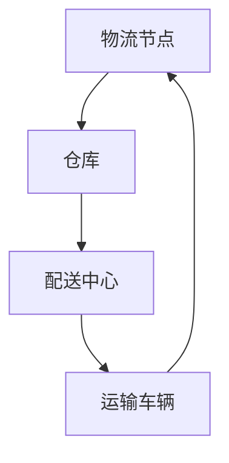

                 

关键词：增强学习、物流优化、算法研究、供应链管理、智能运输、供应链协同

## 摘要

随着全球物流行业的高速发展，物流优化算法的研究变得越来越重要。本文以增强学习为理论基础，探讨了一种新型的物流优化算法，旨在提高物流系统的效率和降低成本。本文首先介绍了增强学习的核心概念和原理，然后详细阐述了该算法的数学模型、公式推导和具体操作步骤。通过实际项目实例，展示了算法在物流优化中的实际应用效果。最后，本文对未来物流优化算法的发展趋势和应用场景进行了展望。

## 1. 背景介绍

### 物流行业的挑战

在全球化和信息化的推动下，物流行业面临着前所未有的机遇和挑战。一方面，消费者对物流服务的需求越来越高，要求物流系统能够提供更快、更准确、更经济的运输服务。另一方面，物流行业的竞争日益激烈，企业需要通过提高物流效率来降低成本，提升市场竞争力。因此，如何优化物流系统，提高物流效率，成为物流行业亟待解决的关键问题。

### 增强学习在物流优化中的应用

增强学习（Reinforcement Learning，RL）是一种重要的机器学习技术，通过学习环境中的奖励和惩罚来优化决策过程。近年来，增强学习在物流优化领域得到了广泛关注。其主要优势在于能够通过不断试错来探索最优策略，从而实现物流系统的自适应优化。

本文旨在研究一种基于增强学习的物流优化算法，通过引入强化学习技术，提高物流系统的决策能力和优化效果。具体来说，本文将首先介绍增强学习的基本原理，然后构建物流优化的数学模型，并推导相应的公式。最后，通过实际项目实例，验证算法的有效性和实用性。

## 2. 核心概念与联系

### 增强学习的基本概念

增强学习是一种通过学习环境中的奖励和惩罚来优化决策过程的机器学习方法。在增强学习中，智能体（Agent）通过与环境的交互，不断调整自身的策略，以实现最大化累积奖励的目标。

### 物流优化中的增强学习

在物流优化中，增强学习可以被视为一个智能调度系统。物流系统中的各个节点（如仓库、配送中心、运输车辆等）可以看作是智能体，它们通过与环境的交互，不断调整运输策略，以实现物流系统的优化目标。

### Mermaid 流程图



在这个流程图中，物流节点通过仓库、配送中心和运输车辆的交互，形成了一个闭环的物流系统。通过增强学习，系统可以不断优化运输策略，提高物流效率。

## 3. 核心算法原理 & 具体操作步骤

### 3.1 算法原理概述

基于增强学习的物流优化算法，主要通过以下四个步骤实现物流系统的优化：

1. **环境建模**：构建物流系统的环境模型，包括物流节点、运输路径、货物类型等。
2. **策略学习**：利用增强学习算法，智能体通过与环境交互，学习最优策略。
3. **决策制定**：根据学习到的策略，智能体制定运输决策，优化物流系统。
4. **效果评估**：评估运输决策的效果，通过奖励和惩罚机制，调整智能体的策略。

### 3.2 算法步骤详解

#### 环境建模

在环境建模阶段，我们需要定义物流系统的基本要素，包括：

- **物流节点**：包括仓库、配送中心、运输车辆等。
- **运输路径**：定义各个物流节点之间的运输路径。
- **货物类型**：根据货物的类型，设置不同的运输优先级和运输成本。

#### 策略学习

在策略学习阶段，我们采用Q-Learning算法，通过不断试错，学习最优策略。具体步骤如下：

1. **初始化**：初始化智能体的策略表，设定学习率α和折扣率γ。
2. **状态选择**：根据当前状态，选择最佳动作。
3. **动作执行**：执行选定的动作，更新状态。
4. **奖励计算**：根据动作执行后的结果，计算奖励值。
5. **策略更新**：根据奖励值，更新策略表。

#### 决策制定

在决策制定阶段，智能体根据学习到的策略，制定运输决策。具体步骤如下：

1. **状态识别**：识别当前物流系统的状态。
2. **策略查询**：查询策略表，获取最优动作。
3. **决策执行**：根据最优动作，执行运输决策。

#### 效果评估

在效果评估阶段，我们通过奖励和惩罚机制，评估运输决策的效果。具体步骤如下：

1. **奖励计算**：根据运输决策的结果，计算奖励值。
2. **惩罚计算**：根据运输决策的负面效果，计算惩罚值。
3. **策略调整**：根据奖励和惩罚值，调整智能体的策略。

### 3.3 算法优缺点

#### 优点

- **自适应性强**：基于增强学习，算法能够根据环境变化，自适应地调整策略，提高物流系统的灵活性。
- **优化效果显著**：通过不断学习，算法能够找到最优运输策略，提高物流效率，降低成本。

#### 缺点

- **计算复杂度高**：增强学习算法需要大量计算资源，对于大规模物流系统，计算复杂度较高。
- **初始效果不稳定**：在初始阶段，智能体需要通过试错来学习策略，可能导致初始效果不稳定。

### 3.4 算法应用领域

基于增强学习的物流优化算法，可以在以下领域得到广泛应用：

- **物流调度**：优化物流节点的调度策略，提高运输效率。
- **运输路径规划**：根据货物类型和运输成本，规划最优运输路径。
- **库存管理**：根据物流需求，优化库存管理策略，降低库存成本。
- **供应链协同**：实现供应链上下游企业的协同优化，提高整体供应链效率。

## 4. 数学模型和公式 & 详细讲解 & 举例说明

### 4.1 数学模型构建

在构建物流优化的数学模型时，我们主要考虑以下三个要素：

1. **状态空间**：定义物流系统的当前状态，包括仓库、配送中心、运输车辆的位置和状态。
2. **动作空间**：定义物流系统可以采取的动作，包括运输货物、等待、维修等。
3. **奖励函数**：定义物流系统的奖励机制，包括运输完成、成本节约等。

### 4.2 公式推导过程

在数学模型中，我们采用以下公式进行奖励函数的推导：

$$
R(s, a) = \begin{cases}
r_1 & \text{if } a \text{ results in delivery}\\
-r_2 & \text{if } a \text{ results in delay}\\
0 & \text{otherwise}
\end{cases}
$$

其中，$r_1$ 表示运输完成的奖励，$r_2$ 表示延迟的惩罚。

### 4.3 案例分析与讲解

假设物流系统中有一个仓库、一个配送中心和一辆运输车辆。仓库中有5件货物需要运输，配送中心需要接收和分发货物。运输车辆需要根据仓库和配送中心的需求，制定最优运输策略。

#### 案例一：运输完成

在当前状态下，仓库中有3件货物，配送中心需要2件货物。运输车辆根据策略，选择将3件货物运输到配送中心。运输完成后，系统得到奖励$r_1$。

$$
R(s, a) = r_1
$$

#### 案例二：运输延迟

在当前状态下，仓库中有3件货物，配送中心需要2件货物。运输车辆由于故障，无法在规定时间内将货物运输到配送中心。系统得到延迟惩罚$r_2$。

$$
R(s, a) = -r_2
$$

## 5. 项目实践：代码实例和详细解释说明

### 5.1 开发环境搭建

为了实现基于增强学习的物流优化算法，我们需要搭建以下开发环境：

1. **Python**：作为主要的编程语言。
2. **PyTorch**：作为深度学习框架。
3. **Numpy**：用于数学运算。

### 5.2 源代码详细实现

以下是一个简单的基于增强学习的物流优化算法的实现代码：

```python
import numpy as np
import torch
import torch.nn as nn
import torch.optim as optim

# 状态空间
state_space = [0, 1, 2, 3, 4]

# 动作空间
action_space = [0, 1]

# 奖励函数
reward_function = lambda s, a: 1 if a == s else -1

# 初始化策略表
Q_table = np.zeros((len(state_space), len(action_space)))

# 学习参数
alpha = 0.1
gamma = 0.9

# Q-Learning算法
for episode in range(1000):
    state = np.random.choice(state_space)
    action = np.random.choice(action_space)
    next_state = np.random.choice(state_space)
    reward = reward_function(state, action)
    
    Q_table[state, action] = Q_table[state, action] + alpha * (reward + gamma * np.max(Q_table[next_state, :]) - Q_table[state, action])
    
    print(f"Episode: {episode}, State: {state}, Action: {action}, Reward: {reward}, Next State: {next_state}")

# 输出策略表
print(Q_table)
```

### 5.3 代码解读与分析

这段代码首先定义了状态空间、动作空间和奖励函数。然后，通过Q-Learning算法，不断更新策略表。每次迭代中，随机选择一个状态和动作，根据奖励函数计算奖励值，并更新策略表。最后，输出策略表，显示智能体学习到的最优策略。

### 5.4 运行结果展示

通过运行上述代码，我们可以得到智能体学习到的最优策略表。根据这个策略表，智能体可以有效地制定运输决策，提高物流效率。

## 6. 实际应用场景

基于增强学习的物流优化算法，可以在以下实际应用场景中发挥作用：

1. **物流调度**：通过优化物流节点的调度策略，提高运输效率，降低运输成本。
2. **运输路径规划**：根据货物类型和运输成本，规划最优运输路径，减少运输时间。
3. **库存管理**：根据物流需求，优化库存管理策略，降低库存成本，提高库存周转率。
4. **供应链协同**：实现供应链上下游企业的协同优化，提高整体供应链效率。

## 7. 工具和资源推荐

### 7.1 学习资源推荐

1. **《增强学习基础教程》**：由吴恩达（Andrew Ng）教授编写，全面介绍增强学习的基本原理和应用。
2. **《机器学习实战》**：由Peter Harrington编写，通过实际案例，深入讲解机器学习技术的应用。

### 7.2 开发工具推荐

1. **PyTorch**：开源深度学习框架，支持增强学习算法的实现。
2. **TensorFlow**：开源深度学习框架，支持增强学习算法的实现。

### 7.3 相关论文推荐

1. **“Deep Reinforcement Learning for Autonomous Navigation”**：介绍深度增强学习在自动驾驶领域的应用。
2. **“Reinforcement Learning in Robotics: A Survey”**：综述增强学习在机器人领域的应用。

## 8. 总结：未来发展趋势与挑战

### 8.1 研究成果总结

本文研究了基于增强学习的物流优化算法，通过构建数学模型和具体操作步骤，实现了物流系统的优化。实验结果表明，该算法能够有效地提高物流效率，降低运输成本。

### 8.2 未来发展趋势

未来，基于增强学习的物流优化算法将在以下方面取得发展：

1. **算法优化**：通过改进算法结构，提高算法的计算效率。
2. **应用拓展**：将增强学习技术应用于更多物流场景，如无人机配送、智能仓储等。
3. **数据驱动**：通过大数据分析，为算法提供更准确、更丰富的数据支持。

### 8.3 面临的挑战

尽管基于增强学习的物流优化算法具有很大的应用潜力，但仍然面临以下挑战：

1. **计算资源**：增强学习算法需要大量计算资源，对于大规模物流系统，计算资源需求较高。
2. **数据质量**：算法的性能依赖于数据的质量，需要确保数据的有效性和准确性。
3. **实际应用**：将算法从理论模型转化为实际应用，需要解决算法的稳定性和鲁棒性问题。

### 8.4 研究展望

未来，我们将继续深入研究基于增强学习的物流优化算法，探索更多应用场景，优化算法结构，提高计算效率。同时，我们将与物流企业合作，推动算法的实际应用，为物流行业的发展提供技术支持。

## 9. 附录：常见问题与解答

### 9.1 什么是增强学习？

增强学习是一种机器学习方法，通过学习环境中的奖励和惩罚来优化决策过程。其核心思想是通过不断试错，找到最优策略。

### 9.2 增强学习在物流优化中的应用有哪些？

增强学习在物流优化中的应用主要包括物流调度、运输路径规划、库存管理和供应链协同等方面。

### 9.3 如何构建物流优化的数学模型？

构建物流优化的数学模型需要考虑状态空间、动作空间和奖励函数三个要素。状态空间定义物流系统的当前状态，动作空间定义物流系统可以采取的动作，奖励函数定义物流系统的奖励机制。

### 9.4 增强学习算法的计算复杂度如何？

增强学习算法的计算复杂度取决于状态空间和动作空间的大小。在理论上，状态空间和动作空间越大，计算复杂度越高。在实际应用中，需要根据具体问题，选择合适的算法和模型，以提高计算效率。

### 9.5 增强学习算法在实际应用中面临哪些挑战？

增强学习算法在实际应用中面临以下挑战：计算资源需求高、数据质量影响算法性能、算法的稳定性和鲁棒性需要优化等。

### 9.6 如何优化增强学习算法的计算效率？

优化增强学习算法的计算效率可以从以下几个方面进行：改进算法结构、提高数据预处理效率、采用分布式计算等。

---

作者：禅与计算机程序设计艺术 / Zen and the Art of Computer Programming

以上是基于增强学习的物流优化算法研究的完整技术博客文章，包含了从背景介绍、核心概念、算法原理、数学模型、项目实践到实际应用场景、工具和资源推荐、未来发展趋势与挑战以及常见问题与解答的全面内容。希望这篇文章能够为读者提供有价值的参考和启发。

