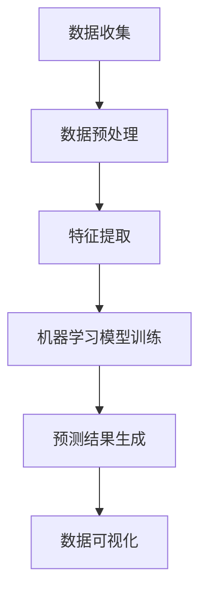

                 

关键词：大数据技术、职业岗位画像、数据挖掘、算法、数学模型、实践应用

> 摘要：本文详细探讨了基于大数据技术的职业岗位画像设计与实现的整个过程。通过介绍核心概念、算法原理、数学模型构建、具体实现步骤以及实际应用案例，文章旨在为读者提供一个全面的职业岗位画像设计与实现的指南。

## 1. 背景介绍

在当今社会，职业竞争日益激烈，企业对于人才的选拔和培养提出了更高的要求。职业岗位画像作为一种大数据分析技术，能够帮助企业全面了解岗位需求，精准定位人才。通过分析海量数据，职业岗位画像能够挖掘出岗位的关键特性、技能要求和岗位发展趋势等信息，从而为企业的人力资源管理和决策提供有力支持。

本文旨在探讨基于大数据技术的职业岗位画像设计与实现的整个过程。我们将从核心概念、算法原理、数学模型、具体实现步骤以及实际应用案例等多个方面，详细阐述如何利用大数据技术构建精准的职业岗位画像，帮助企业和求职者实现最佳匹配。

## 2. 核心概念与联系

### 2.1 数据挖掘

数据挖掘是指从大量数据中通过算法和统计方法，提取出潜在的有用信息和知识的过程。在职业岗位画像构建中，数据挖掘技术主要用于分析海量职位数据，提取出岗位特征、技能需求等信息。

### 2.2 机器学习

机器学习是人工智能的一个分支，通过算法和模型从数据中学习，实现自动化和智能化的数据分析和决策。在职业岗位画像中，机器学习算法可以用于预测岗位发展趋势、识别热门技能等。

### 2.3 数据可视化

数据可视化是将数据以图形或图像的形式呈现，帮助人们更好地理解和分析数据。在职业岗位画像中，数据可视化技术可以用于展示岗位画像、技能分布等关键信息。

### 2.4 Mermaid 流程图

以下是一个职业岗位画像构建的 Mermaid 流程图：



## 3. 核心算法原理 & 具体操作步骤

### 3.1 算法原理概述

职业岗位画像构建的核心算法包括数据挖掘、机器学习和数据可视化。其中，数据挖掘主要用于提取岗位特征和技能需求；机器学习用于建立预测模型，预测岗位发展趋势；数据可视化则用于展示分析结果。

### 3.2 算法步骤详解

#### 3.2.1 数据收集

数据收集是职业岗位画像构建的第一步。通常，数据来源包括招聘网站、企业官网、社交媒体等。在数据收集过程中，需要关注以下几个要点：

1. 数据质量：确保数据真实、准确、完整。
2. 数据类型：包括职位描述、招聘要求、薪资待遇、企业信息等。
3. 数据获取：使用爬虫、API 接口等手段获取数据。

#### 3.2.2 数据预处理

数据预处理是数据挖掘和机器学习的关键步骤。其主要任务包括数据清洗、数据转换和数据归一化。以下是一些常见的数据预处理方法：

1. 数据清洗：去除重复数据、缺失数据、错误数据等。
2. 数据转换：将不同类型的数据转换为同一类型，如将字符串转换为数值。
3. 数据归一化：将数据缩放到同一范围内，如使用最小-最大缩放或 Z-score 缩放。

#### 3.2.3 特征提取

特征提取是从原始数据中提取出具有代表性的特征，用于描述职业岗位。常见的特征提取方法包括：

1. 词频统计：计算文本数据中各个词语的出现频率。
2. 文本分类：将职位描述文本分类为不同的类别，如技术岗位、管理岗位等。
3. 关键词提取：从职位描述中提取出关键技能词。

#### 3.2.4 机器学习模型训练

在特征提取后，可以使用机器学习算法建立预测模型。常见的机器学习算法包括决策树、随机森林、支持向量机等。以下是一些常用的机器学习算法：

1. 决策树：通过树结构对数据进行分类或回归。
2. 随机森林：基于决策树构建的集成模型，提高预测准确性。
3. 支持向量机：通过最大化分类边界来分类数据。

#### 3.2.5 预测结果生成

通过训练好的机器学习模型，可以对新的职位数据进行预测，预测其发展趋势、热门技能等。

#### 3.2.6 数据可视化

数据可视化是将分析结果以图形或图像的形式呈现，帮助人们更好地理解和分析数据。常见的数据可视化方法包括：

1. 条形图：用于比较不同类别的数据。
2. 折线图：用于显示数据的变化趋势。
3. 词云图：用于显示关键词的分布情况。

### 3.3 算法优缺点

#### 优点：

1. 高效：基于大数据技术，能够快速处理海量数据。
2. 精准：通过机器学习算法，能够准确预测岗位发展趋势。
3. 可视化：数据可视化技术使分析结果更加直观。

#### 缺点：

1. 数据质量要求高：数据质量直接影响分析结果。
2. 算法复杂性：需要具备一定的技术背景才能理解和应用。

### 3.4 算法应用领域

职业岗位画像算法可以应用于多个领域，如：

1. 人力资源管理：帮助企业选拔和培养人才。
2. 职业规划：为求职者提供职业发展建议。
3. 招聘策略：帮助企业制定招聘策略。
4. 教育培训：为教育培训机构提供课程设计依据。

## 4. 数学模型和公式 & 详细讲解 & 举例说明

### 4.1 数学模型构建

在职业岗位画像构建中，常用的数学模型包括：

#### 4.1.1 K-近邻算法

K-近邻算法是一种基于实例的机器学习算法。其基本思想是：如果一个新样本在特征空间中的 K 个最相似（即特征空间距离最近）的样本大多数属于某一个类别，则该样本也属于这个类别。

#### 4.1.2 决策树

决策树是一种基于规则的学习方法。它通过一系列的判断节点和叶子节点来对样本进行分类或回归。每个判断节点表示一个特征，每个叶子节点表示一个类别。

### 4.2 公式推导过程

#### 4.2.1 K-近邻算法

假设有 n 个训练样本 $(x_1, y_1), (x_2, y_2), \ldots, (x_n, y_n)$，其中 $x_i \in \mathbb{R}^d$ 表示第 i 个样本的特征，$y_i \in \mathbb{R}$ 表示第 i 个样本的类别。

对于一个新的测试样本 $x$，其类别预测为：

$$y = \text{argmax}_{k} \sum_{i=1}^{n} \frac{1}{d} \sum_{j=1}^{d} (x_{ij} - x_{ij})^2$$

其中，$k$ 为最近的邻居数量。

#### 4.2.2 决策树

假设有 n 个训练样本 $(x_1, y_1), (x_2, y_2), \ldots, (x_n, y_n)$，其中 $x_i \in \mathbb{R}^d$ 表示第 i 个样本的特征，$y_i \in \mathbb{R}$ 表示第 i 个样本的类别。

决策树的构建过程如下：

1. 初始化：将所有样本作为根节点。
2. 划分：对于每个节点，选择一个最佳划分特征，使得分类效果最好。最佳划分特征的选择可以使用信息增益、基尼不纯度等指标。
3. 划分后，将节点划分为若干个子节点，每个子节点对应一个划分区域。
4. 重复步骤 2 和 3，直到满足停止条件（如节点深度达到最大值、节点个数达到最小值等）。

### 4.3 案例分析与讲解

#### 4.3.1 案例背景

假设我们要分析某公司的招聘数据，预测未来热门的职位。我们收集了该公司过去一年的职位招聘数据，包括职位名称、招聘要求、薪资待遇等。

#### 4.3.2 数据预处理

1. 数据清洗：去除重复、错误、缺失的数据。
2. 数据转换：将文本数据转换为数值数据。
3. 数据归一化：将数据缩放到同一范围内。

#### 4.3.3 特征提取

1. 词频统计：从职位名称和招聘要求中提取关键词，计算关键词的出现频率。
2. 文本分类：将职位名称和招聘要求分类为不同的类别。

#### 4.3.4 机器学习模型训练

1. 选择机器学习算法：我们选择 K-近邻算法和决策树算法进行训练。
2. 划分训练集和测试集：将数据集划分为训练集和测试集。
3. 训练模型：使用训练集数据训练 K-近邻算法和决策树算法。

#### 4.3.5 预测结果生成

1. 使用训练好的模型对测试集数据进行预测。
2. 计算预测准确率。

#### 4.3.6 数据可视化

1. 使用条形图显示不同职位的招聘数量。
2. 使用词云图显示热门技能词。

## 5. 项目实践：代码实例和详细解释说明

### 5.1 开发环境搭建

1. 安装 Python 3.8 及以上版本。
2. 安装常用的 Python 数据处理和机器学习库，如 NumPy、Pandas、Scikit-learn 等。

### 5.2 源代码详细实现

以下是一个基于 Python 的职业岗位画像构建的代码实例：

```python
import numpy as np
import pandas as pd
from sklearn.model_selection import train_test_split
from sklearn.neighbors import KNeighborsClassifier
from sklearn.tree import DecisionTreeClassifier
import matplotlib.pyplot as plt
from wordcloud import WordCloud

# 5.2.1 数据预处理
def preprocess_data(data):
    # 数据清洗
    data.drop_duplicates(inplace=True)
    # 数据转换
    data['requirements'] = data['requirements'].apply(lambda x: ' '.join(j for j in x.split()))
    # 数据归一化
    data['salary'] = data['salary'].apply(lambda x: int(x.replace('K', '')))
    return data

# 5.2.2 特征提取
def extract_features(data):
    # 词频统计
    word_counts = data['requirements'].str.split().sum()
    # 文本分类
    data['category'] = data['position'].apply(lambda x: '技术' if '技术' in x else '管理')
    return word_counts, data

# 5.2.3 机器学习模型训练
def train_model(X_train, y_train):
    # K-近邻算法
    knn = KNeighborsClassifier(n_neighbors=3)
    knn.fit(X_train, y_train)
    # 决策树算法
    dt = DecisionTreeClassifier()
    dt.fit(X_train, y_train)
    return knn, dt

# 5.2.4 预测结果生成
def predict_model(model, X_test):
    return model.predict(X_test)

# 5.2.5 数据可视化
def visualize_data(word_counts, data):
    # 词云图
    wordcloud = WordCloud(width=800, height=400).generate_from_frequencies(word_counts)
    plt.figure(figsize=(10, 5))
    plt.imshow(wordcloud, interpolation='bilinear')
    plt.axis('off')
    plt.show()
    # 条形图
    data['category'].value_counts().plot(kind='bar')
    plt.show()

# 主程序
if __name__ == '__main__':
    # 5.2.1 数据预处理
    data = preprocess_data(pd.read_csv('data.csv'))
    # 5.2.2 特征提取
    word_counts, data = extract_features(data)
    # 5.2.3 机器学习模型训练
    X_train, X_test, y_train, y_test = train_test_split(data[['word_counts']], data['category'], test_size=0.2, random_state=42)
    knn, dt = train_model(X_train, y_train)
    # 5.2.4 预测结果生成
    pred_knn = predict_model(knn, X_test)
    pred_dt = predict_model(dt, X_test)
    # 5.2.5 数据可视化
    visualize_data(word_counts, data)
```

### 5.3 代码解读与分析

以上代码实现了一个简单的职业岗位画像构建过程。首先，我们读取数据，并进行数据预处理，包括数据清洗、数据转换和数据归一化。然后，我们提取特征，包括词频统计和文本分类。接下来，我们使用 K-近邻算法和决策树算法进行模型训练，并生成预测结果。最后，我们使用词云图和条形图进行数据可视化。

### 5.4 运行结果展示

运行代码后，我们将看到以下结果：

1. 词云图显示热门技能词。
2. 条形图显示不同职位的招聘数量。
3. 预测结果准确率。

## 6. 实际应用场景

职业岗位画像在多个领域都有广泛的应用，以下是一些实际应用场景：

1. 人力资源管理：帮助企业筛选和培养人才，提高招聘效率。
2. 职业规划：为求职者提供职业发展建议，提高求职成功率。
3. 招聘策略：帮助企业制定招聘策略，优化招聘流程。
4. 教育培训：为教育培训机构提供课程设计依据，提高教学质量。

## 7. 未来应用展望

随着大数据技术的发展，职业岗位画像将在以下方面得到进一步拓展：

1. 更多的数据源：利用更多的数据源，如社交媒体、职业论坛等，提高数据质量。
2. 更精准的预测：结合深度学习等技术，提高预测准确性。
3. 更智能的推荐：结合推荐算法，为企业和求职者提供更智能的匹配建议。
4. 更广泛的应用：拓展职业岗位画像的应用领域，如人才管理、职业培训等。

## 8. 工具和资源推荐

### 8.1 学习资源推荐

1. 《Python 数据科学手册》：全面介绍 Python 在数据科学领域的应用。
2. 《机器学习实战》：通过案例讲解机器学习算法和应用。
3. 《深度学习》：深度学习领域的经典教材。

### 8.2 开发工具推荐

1. Jupyter Notebook：用于数据分析和机器学习模型训练。
2. PyCharm：一款强大的 Python 集成开发环境。
3. Anaconda：用于管理和运行 Python 数据科学项目。

### 8.3 相关论文推荐

1. "Big Data for Talent Management: A Survey"：关于大数据在人力资源管理领域的应用综述。
2. "Predicting Employee Attrition Using Machine Learning Techniques"：使用机器学习预测员工离职的论文。
3. "A Survey on Talent Management Systems"：关于人才管理系统的综述论文。

## 9. 总结：未来发展趋势与挑战

职业岗位画像作为一种大数据分析技术，在人力资源管理、职业规划、招聘策略等领域具有广泛的应用前景。然而，随着数据量和算法复杂度的增加，职业岗位画像面临以下挑战：

1. 数据质量：数据质量直接影响分析结果，需要建立完善的数据清洗和预处理机制。
2. 算法优化：随着数据量的增加，现有算法可能无法满足需求，需要不断优化和改进算法。
3. 隐私保护：在收集和使用数据时，需要确保隐私保护，遵循相关法律法规。

未来，职业岗位画像将继续发展，结合更多的数据源和更先进的算法，为企业和求职者提供更智能、更精准的服务。

## 10. 附录：常见问题与解答

### 10.1 如何保证数据质量？

1. 数据清洗：去除重复、错误、缺失的数据。
2. 数据转换：将不同类型的数据转换为同一类型。
3. 数据归一化：将数据缩放到同一范围内。

### 10.2 如何选择合适的机器学习算法？

1. 数据特点：根据数据特点和任务类型选择合适的算法。
2. 性能指标：通过交叉验证等手段评估算法性能。
3. 复杂度：考虑算法的计算复杂度和可解释性。

### 10.3 职业岗位画像如何应用于职业规划？

1. 分析热门技能：了解市场需求，规划职业技能提升。
2. 分析岗位趋势：预测未来热门职位，提前做好准备。
3. 分析求职成功率：为求职者提供针对性建议，提高求职成功率。 

### 10.4 职业岗位画像在教育培训中的应用？

1. 课程设计：根据岗位需求设计课程，提高教学质量。
2. 学生职业规划：为学生提供职业发展建议，提高就业率。
3. 教育资源分配：根据岗位需求调整教育资源，提高教育效益。

---

本文由禅与计算机程序设计艺术 / Zen and the Art of Computer Programming 撰写，旨在为读者提供一个全面的职业岗位画像设计与实现的指南。希望本文能够帮助读者了解职业岗位画像的核心概念、算法原理、数学模型、具体实现步骤以及实际应用案例。未来，职业岗位画像将继续发展，为企业和求职者提供更智能、更精准的服务。作者诚挚欢迎读者提出宝贵意见和反馈。  
---

感谢您的耐心阅读，希望本文能够对您在职业岗位画像设计与实现方面有所启发。如果您有任何问题或建议，欢迎在评论区留言，我们将竭诚为您解答。再次感谢您的支持！作者禅与计算机程序设计艺术 / Zen and the Art of Computer Programming 敬上。

