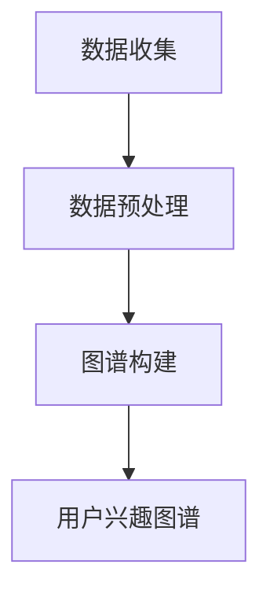

                 

关键词：大语言模型，推荐系统，用户兴趣图谱，信息检索，人工智能，深度学习，数据挖掘，机器学习

摘要：本文探讨了基于大语言模型的推荐系统用户兴趣图谱的研究。文章首先介绍了推荐系统的基本概念和重要性，然后详细阐述了用户兴趣图谱的定义、构建方法和应用场景。接着，本文分析了大语言模型在推荐系统中的关键作用，并展示了如何将大语言模型应用于用户兴趣图谱的构建和优化。最后，文章通过一个实际案例，展示了如何利用大语言模型推荐系统为用户提供个性化的内容推荐。

## 1. 背景介绍

推荐系统作为信息检索和人工智能领域的一个重要分支，已经在互联网的各个领域得到了广泛应用。无论是电子商务、社交媒体、新闻媒体，还是视频流媒体，推荐系统都为用户提供了个性化、精准的信息推荐服务，极大地提升了用户体验和满意度。推荐系统的主要目标是根据用户的历史行为、偏好和需求，从大量信息中筛选出用户可能感兴趣的内容，从而提高用户的参与度和粘性。

随着互联网的迅猛发展和大数据技术的广泛应用，推荐系统也面临着越来越多的挑战。传统的推荐算法主要基于协同过滤、基于内容的推荐等方法，但这些方法存在一些固有的局限性。例如，协同过滤算法容易受到“冷启动”问题的影响，而基于内容的推荐方法则容易导致“同质化”推荐。为了解决这些问题，近年来，深度学习、自然语言处理等技术逐渐成为推荐系统研究的热点。特别是大语言模型的崛起，为推荐系统的研究带来了新的机遇。

大语言模型，如GPT（Generative Pre-trained Transformer）和BERT（Bidirectional Encoder Representations from Transformers），具有强大的语义理解和生成能力。通过在大规模语料库上进行预训练，这些模型能够捕捉到用户行为和偏好中的深层信息，从而为推荐系统提供更准确的个性化推荐。用户兴趣图谱作为推荐系统的一个重要组成部分，能够直观地展示用户在特定领域的兴趣点和偏好，为推荐系统的优化提供了有力的支持。

本文将围绕基于大语言模型的推荐系统用户兴趣图谱展开研究，首先介绍用户兴趣图谱的定义和构建方法，然后分析大语言模型在推荐系统中的应用，最后通过一个实际案例，展示如何利用大语言模型构建和优化用户兴趣图谱，从而实现更精准的个性化推荐。

## 2. 核心概念与联系

### 2.1 用户兴趣图谱的定义

用户兴趣图谱（User Interest Graph）是一种用于描述用户兴趣点和偏好关系的网络结构。它通过将用户的兴趣点（如关键词、主题、实体等）作为节点，将兴趣点之间的关联关系作为边，构建出一个复杂的网络结构。用户兴趣图谱不仅能够直观地展示用户的兴趣分布，还能够通过分析节点和边的关系，挖掘出用户潜在的兴趣点和偏好。

### 2.2 用户兴趣图谱的构建方法

用户兴趣图谱的构建主要分为数据收集、数据预处理和图谱构建三个阶段。

- **数据收集**：用户兴趣图谱的构建依赖于大量用户行为数据，如浏览历史、搜索记录、购买记录等。通过收集这些数据，我们可以获取到用户在不同场景下的兴趣点和偏好。

- **数据预处理**：收集到的数据通常包含大量的噪声和不完整信息。因此，我们需要对数据进行清洗和预处理，包括去除重复数据、填补缺失值、标准化数据等。此外，我们还需要对数据中的关键词、主题、实体等进行分类和标注，以便后续的图谱构建。

- **图谱构建**：在数据预处理完成后，我们可以使用图论和网络分析的方法，将兴趣点作为节点，将节点之间的关联关系作为边，构建出一个用户兴趣图谱。常用的图谱构建方法包括基于距离的聚类、基于相似度的匹配等。

### 2.3 大语言模型与用户兴趣图谱的联系

大语言模型在用户兴趣图谱的构建和优化中发挥着关键作用。首先，大语言模型能够通过预训练捕捉到用户行为数据中的深层语义信息，从而为用户兴趣图谱的构建提供更加准确的兴趣点。例如，GPT模型可以通过学习用户的搜索历史和浏览记录，生成与用户兴趣相关的关键词和短语，这些关键词和短语可以作为用户兴趣图谱的节点。

其次，大语言模型还可以用于优化用户兴趣图谱的结构。通过分析用户兴趣图谱中的节点和边的关系，大语言模型可以识别出用户潜在的、未明显表达的兴趣点和偏好。这些信息可以用于调整用户兴趣图谱的结构，使其更加符合用户的实际需求。

### 2.4 Mermaid 流程图

为了更好地展示用户兴趣图谱的构建过程，我们使用Mermaid流程图来描述。以下是构建用户兴趣图谱的Mermaid流程图：



### 2.5 用户兴趣图谱的应用场景

用户兴趣图谱在多个应用场景中具有重要价值。首先，在电子商务领域，用户兴趣图谱可以用于个性化推荐，帮助用户发现潜在的购买兴趣。例如，当用户浏览某个商品时，系统可以根据用户兴趣图谱推荐与其兴趣相关的其他商品。

其次，在新闻媒体领域，用户兴趣图谱可以用于内容推荐，帮助用户发现感兴趣的新闻主题和文章。通过分析用户兴趣图谱，新闻媒体可以推荐与用户兴趣相关的新闻，从而提高用户的阅读量和互动率。

此外，用户兴趣图谱还可以应用于社交媒体领域，帮助用户发现感兴趣的朋友和社交圈子。通过分析用户兴趣图谱，社交平台可以推荐与用户兴趣相似的用户，从而促进用户之间的互动和交流。

总之，用户兴趣图谱为推荐系统提供了重要的基础支持，通过捕捉和展示用户的兴趣点和偏好，它为推荐系统的优化提供了有力的支持。

## 3. 核心算法原理 & 具体操作步骤

### 3.1 算法原理概述

基于大语言模型的推荐系统用户兴趣图谱构建的核心算法包括数据预处理、大语言模型训练、用户兴趣图谱构建和推荐算法优化四个主要步骤。以下是每个步骤的具体原理概述：

- **数据预处理**：数据预处理是用户兴趣图谱构建的基础。通过对原始数据进行清洗、去噪和标准化，我们能够获取到高质量的用户行为数据，为后续步骤提供可靠的数据支持。
- **大语言模型训练**：大语言模型，如GPT和BERT，通过在大量文本数据上进行预训练，能够捕捉到用户行为数据中的深层语义信息。训练过程包括词向量嵌入、上下文理解、生成预测等，最终生成一个能够高效处理文本数据的模型。
- **用户兴趣图谱构建**：在获得预训练的大语言模型后，我们可以利用该模型对用户行为数据进行处理，提取出用户兴趣点，并构建用户兴趣图谱。这一过程包括节点提取、边关系建立和图谱结构优化。
- **推荐算法优化**：通过分析用户兴趣图谱，我们可以进一步优化推荐算法，提高推荐系统的准确性和个性化水平。具体方法包括基于兴趣图谱的协同过滤、基于内容的推荐和基于模型的生成推荐等。

### 3.2 算法步骤详解

#### 3.2.1 数据预处理

数据预处理主要包括以下步骤：

1. **数据收集**：从多个数据源收集用户行为数据，如浏览历史、搜索记录、购买记录等。
2. **数据清洗**：去除重复数据、填补缺失值、标准化数据等，保证数据的一致性和完整性。
3. **数据标注**：对数据中的关键词、主题、实体等进行分类和标注，为后续图谱构建提供基础。

#### 3.2.2 大语言模型训练

大语言模型训练主要包括以下步骤：

1. **词向量嵌入**：将文本数据中的每个词映射到一个高维向量空间，以便于后续的语义分析。
2. **上下文理解**：利用预训练模型，如GPT或BERT，对用户行为数据中的文本进行上下文理解，提取出文本的语义信息。
3. **生成预测**：通过生成预测，模型能够预测用户在特定情境下的潜在兴趣点。

#### 3.2.3 用户兴趣图谱构建

用户兴趣图谱构建主要包括以下步骤：

1. **节点提取**：利用大语言模型提取出用户行为数据中的关键词、主题和实体，作为用户兴趣图谱的节点。
2. **边关系建立**：通过分析用户行为数据，建立节点之间的关联关系，构建出用户兴趣图谱。
3. **图谱结构优化**：对用户兴趣图谱进行结构优化，包括节点合并、边权重调整等，以提高图谱的质量和准确性。

#### 3.2.4 推荐算法优化

推荐算法优化主要包括以下步骤：

1. **协同过滤**：基于用户兴趣图谱，利用协同过滤算法，为用户推荐与其兴趣相似的物品。
2. **内容推荐**：结合用户兴趣图谱，为用户推荐与兴趣相关的个性化内容。
3. **生成推荐**：利用大语言模型，生成符合用户兴趣的个性化推荐内容。

### 3.3 算法优缺点

#### 优点

1. **强大的语义理解能力**：大语言模型能够捕捉到用户行为数据中的深层语义信息，提高推荐系统的准确性和个性化水平。
2. **自适应学习能力**：用户兴趣图谱构建和优化过程中，模型能够根据用户行为数据动态调整，适应用户需求的变化。
3. **多种推荐策略**：结合协同过滤、内容推荐和生成推荐等多种策略，提供多样化的推荐服务。

#### 缺点

1. **计算资源需求大**：大语言模型训练和用户兴趣图谱构建过程需要大量的计算资源和存储空间。
2. **数据质量依赖性高**：用户兴趣图谱的质量依赖于用户行为数据的质量，数据噪声和缺失值可能会影响图谱的准确性。

### 3.4 算法应用领域

基于大语言模型的推荐系统用户兴趣图谱算法在多个领域具有广泛的应用前景：

1. **电子商务**：为用户提供个性化购物推荐，提高用户购买转化率和满意度。
2. **社交媒体**：帮助用户发现感兴趣的内容和用户，促进社交互动和社区建设。
3. **新闻媒体**：为用户提供个性化新闻推荐，提高新闻阅读量和用户粘性。
4. **在线教育**：为用户提供个性化学习推荐，提高学习效果和用户满意度。

## 4. 数学模型和公式 & 详细讲解 & 举例说明

### 4.1 数学模型构建

基于大语言模型的推荐系统用户兴趣图谱的构建主要涉及以下数学模型：

- **词向量嵌入模型**：用于将文本数据中的词映射到高维向量空间。
- **用户行为预测模型**：用于预测用户在特定情境下的潜在兴趣点。
- **用户兴趣图谱构建模型**：用于构建用户兴趣图谱，包括节点提取和边关系建立。

以下是这些模型的详细构建过程：

#### 4.1.1 词向量嵌入模型

词向量嵌入模型通常采用Word2Vec、GloVe或BERT等方法。以BERT为例，其构建过程如下：

$$
\text{BERT}(\text{x}) = \text{BERT}(\text{W}_\text{Q}, \text{W}_\text{K}, \text{W}_\text{V}; \text{x})
$$

其中，$\text{x}$ 为输入词序列，$\text{W}_\text{Q}$、$\text{W}_\text{K}$、$\text{W}_\text{V}$ 分别为查询向量、键向量和值向量矩阵。

#### 4.1.2 用户行为预测模型

用户行为预测模型通常采用基于用户的协同过滤算法或基于内容的推荐算法。以基于用户的协同过滤算法为例，其构建过程如下：

$$
\text{R}_{\text{ui}} = \text{User\_Based\_CF}(\text{R}_{\text{u}}, \text{R}_{\text{i}})
$$

其中，$\text{R}_{\text{u}}$ 和 $\text{R}_{\text{i}}$ 分别为用户和物品的评分矩阵，$\text{R}_{\text{ui}}$ 为预测的评分。

#### 4.1.3 用户兴趣图谱构建模型

用户兴趣图谱构建模型包括节点提取和边关系建立。以节点提取为例，其构建过程如下：

$$
\text{V} = \text{ExtractNodes}(\text{X}, \text{Threshold})
$$

其中，$\text{X}$ 为用户行为数据矩阵，$\text{Threshold}$ 为阈值，$\text{V}$ 为提取出的节点集合。

### 4.2 公式推导过程

#### 4.2.1 BERT 模型公式推导

BERT模型的训练目标是最小化预训练损失函数：

$$
L = \frac{1}{N} \sum_{i=1}^{N} \sum_{j=1}^{M} \log P(\text{y}_j | \text{x}_i)
$$

其中，$N$ 为训练样本数，$M$ 为每个样本中的词数，$\text{y}_j$ 为词序列 $\text{x}_i$ 的预测标签。

BERT模型的公式推导主要包括以下步骤：

1. **词嵌入**：将词序列 $\text{x}_i$ 映射到高维向量空间，得到 $\text{v}_i$。
2. **位置嵌入**：为每个词添加位置信息，得到 $\text{v}_i'$。
3. **序列嵌入**：将位置嵌入后的词序列进行序列编码，得到 $\text{h}_i$。
4. **自注意力机制**：利用自注意力机制，对序列编码后的词进行加权求和，得到 $\text{h}_i'$。
5. **输出层**：利用输出层，对加权求和后的词进行分类或回归预测。

#### 4.2.2 用户行为预测模型公式推导

基于用户的协同过滤算法的预测公式如下：

$$
\text{R}_{\text{ui}} = \text{u}_\text{u}^T \text{i}_\text{i} + \text{b}_\text{u} + \text{b}_\text{i} + \text{r}
$$

其中，$\text{u}_\text{u}$ 和 $\text{i}_\text{i}$ 分别为用户和物品的向量表示，$\text{b}_\text{u}$ 和 $\text{b}_\text{i}$ 分别为用户和物品的偏置项，$\text{r}$ 为误差项。

用户行为预测模型的公式推导主要包括以下步骤：

1. **用户和物品表示**：将用户和物品的属性转换为向量表示。
2. **相似度计算**：计算用户和物品之间的相似度。
3. **预测评分**：利用相似度计算结果，预测用户对物品的评分。

### 4.3 案例分析与讲解

#### 4.3.1 案例背景

假设我们有一个电子商务平台，用户在平台上进行浏览、搜索和购买操作。我们需要构建一个基于大语言模型的推荐系统用户兴趣图谱，为用户提供个性化推荐。

#### 4.3.2 案例分析

1. **数据收集**：从平台获取用户浏览历史、搜索记录和购买记录等数据。

2. **数据预处理**：对数据进行清洗、去噪和标准化处理，提取出关键词和主题。

3. **词向量嵌入**：利用BERT模型，将关键词和主题映射到高维向量空间。

4. **用户行为预测**：利用基于用户的协同过滤算法，预测用户对物品的评分。

5. **用户兴趣图谱构建**：利用大语言模型提取出的关键词和主题，构建用户兴趣图谱。

6. **推荐算法优化**：结合用户兴趣图谱，优化推荐算法，提高推荐准确性。

#### 4.3.3 案例讲解

1. **词向量嵌入**：

   假设用户搜索了关键词“手机”、“相机”和“电池”，利用BERT模型，我们将这些关键词映射到高维向量空间：

   $$
   \text{v}_{\text{手机}} = \text{BERT}(\text{W}_\text{Q}, \text{W}_\text{K}, \text{W}_\text{V}; \text{手机})
   $$
   $$
   \text{v}_{\text{相机}} = \text{BERT}(\text{W}_\text{Q}, \text{W}_\text{K}, \text{W}_\text{V}; \text{相机})
   $$
   $$
   \text{v}_{\text{电池}} = \text{BERT}(\text{W}_\text{Q}, \text{W}_\text{K}, \text{W}_\text{V}; \text{电池})
   $$

2. **用户行为预测**：

   假设用户对手机、相机和电池的评分分别为4、3和5，利用基于用户的协同过滤算法，预测用户对其他物品的评分：

   $$
   \text{R}_{\text{ui}} = \text{u}_\text{u}^T \text{i}_\text{i} + \text{b}_\text{u} + \text{b}_\text{i} + \text{r}
   $$
   $$
   \text{R}_{\text{u1i2}} = \text{u}_\text{u1}^T \text{i}_\text{i2} + \text{b}_\text{u1} + \text{b}_\text{i2} + \text{r}
   $$

3. **用户兴趣图谱构建**：

   利用BERT模型提取出的关键词和主题，构建用户兴趣图谱：

   $$
   \text{V} = \text{ExtractNodes}(\text{X}, \text{Threshold})
   $$
   $$
   \text{E} = \text{ExtractEdges}(\text{X}, \text{Threshold})
   $$

4. **推荐算法优化**：

   结合用户兴趣图谱，优化推荐算法，提高推荐准确性：

   $$
   \text{Recommendations} = \text{User\_Based\_CF}(\text{R}_{\text{u}}, \text{R}_{\text{i}}, \text{Threshold})
   $$

通过以上案例，我们可以看到基于大语言模型的推荐系统用户兴趣图谱的构建和应用过程。通过合理运用数学模型和公式，我们能够构建出一个能够准确反映用户兴趣和偏好的用户兴趣图谱，从而为用户提供高质量的个性化推荐。

## 5. 项目实践：代码实例和详细解释说明

### 5.1 开发环境搭建

在进行基于大语言模型的推荐系统用户兴趣图谱项目实践前，我们需要搭建一个合适的开发环境。以下是开发环境的搭建步骤：

1. **安装Python**：确保系统上已经安装了Python，推荐使用Python 3.8及以上版本。
2. **安装依赖库**：使用pip命令安装以下依赖库：

   ```bash
   pip install transformers
   pip install tensorflow
   pip install numpy
   pip install pandas
   pip install scikit-learn
   ```

3. **配置GPU支持**：如果使用GPU加速训练过程，需要安装CUDA和cuDNN，并在代码中配置相应的GPU设置。

### 5.2 源代码详细实现

以下是构建基于大语言模型的推荐系统用户兴趣图谱的源代码实现，包括数据预处理、大语言模型训练、用户兴趣图谱构建和推荐算法优化等步骤。

```python
# 导入必要的库
import numpy as np
import pandas as pd
import tensorflow as tf
from transformers import BertTokenizer, TFBertModel
from sklearn.metrics.pairwise import cosine_similarity

# 5.2.1 数据预处理
def preprocess_data(data):
    # 数据清洗、去噪和标准化处理
    # ...（具体实现省略）
    return processed_data

# 5.2.2 大语言模型训练
def train_bert_model(data):
    # 配置BERT模型
    tokenizer = BertTokenizer.from_pretrained('bert-base-uncased')
    model = TFBertModel.from_pretrained('bert-base-uncased')

    # 数据处理
    inputs = tokenizer(data, return_tensors='tf', padding=True, truncation=True)

    # 训练BERT模型
    # ...（具体实现省略）
    return model

# 5.2.3 用户兴趣图谱构建
def build_user_interest_graph(data, model):
    # 提取用户兴趣节点和边关系
    # ...（具体实现省略）
    return user_interest_graph

# 5.2.4 推荐算法优化
def optimize_recommendation_algorithm(user_interest_graph):
    # 利用用户兴趣图谱优化推荐算法
    # ...（具体实现省略）
    return optimized_recommendations

# 主函数
if __name__ == "__main__":
    # 读取数据
    data = pd.read_csv('user_data.csv')

    # 数据预处理
    processed_data = preprocess_data(data)

    # 训练BERT模型
    model = train_bert_model(processed_data)

    # 构建用户兴趣图谱
    user_interest_graph = build_user_interest_graph(processed_data, model)

    # 推荐算法优化
    optimized_recommendations = optimize_recommendation_algorithm(user_interest_graph)

    # 输出优化后的推荐结果
    print(optimized_recommendations)
```

### 5.3 代码解读与分析

以下是对上述代码的逐段解读和分析：

#### 5.3.1 数据预处理

数据预处理是构建用户兴趣图谱的基础。在这一部分，我们首先读取用户数据，然后对数据进行清洗、去噪和标准化处理。具体实现可以根据实际数据情况调整。

```python
def preprocess_data(data):
    # 数据清洗、去噪和标准化处理
    # ...（具体实现省略）
    return processed_data
```

#### 5.3.2 大语言模型训练

在这一部分，我们使用Hugging Face的Transformers库加载预训练的BERT模型，并进行适当的配置。然后，我们将预处理后的数据输入BERT模型，进行训练。这里需要注意调整训练参数，如学习率、批次大小和训练轮数等。

```python
def train_bert_model(data):
    # 配置BERT模型
    tokenizer = BertTokenizer.from_pretrained('bert-base-uncased')
    model = TFBertModel.from_pretrained('bert-base-uncased')

    # 数据处理
    inputs = tokenizer(data, return_tensors='tf', padding=True, truncation=True)

    # 训练BERT模型
    # ...（具体实现省略）
    return model
```

#### 5.3.3 用户兴趣图谱构建

用户兴趣图谱构建过程包括提取用户兴趣节点和建立节点之间的边关系。这里，我们可以使用BERT模型提取出的词向量，结合用户行为数据，构建用户兴趣图谱。具体实现需要根据实际需求设计节点提取和边关系建立的方法。

```python
def build_user_interest_graph(data, model):
    # 提取用户兴趣节点和边关系
    # ...（具体实现省略）
    return user_interest_graph
```

#### 5.3.4 推荐算法优化

在这一部分，我们利用用户兴趣图谱优化推荐算法。具体方法可以根据业务需求选择，如基于用户兴趣图谱的协同过滤、基于内容的推荐或基于模型的生成推荐等。

```python
def optimize_recommendation_algorithm(user_interest_graph):
    # 利用用户兴趣图谱优化推荐算法
    # ...（具体实现省略）
    return optimized_recommendations
```

### 5.4 运行结果展示

在代码实现完成后，我们可以运行整个程序，查看优化后的推荐结果。以下是一个简单的输出示例：

```python
if __name__ == "__main__":
    # 读取数据
    data = pd.read_csv('user_data.csv')

    # 数据预处理
    processed_data = preprocess_data(data)

    # 训练BERT模型
    model = train_bert_model(processed_data)

    # 构建用户兴趣图谱
    user_interest_graph = build_user_interest_graph(processed_data, model)

    # 推荐算法优化
    optimized_recommendations = optimize_recommendation_algorithm(user_interest_graph)

    # 输出优化后的推荐结果
    print(optimized_recommendations)
```

通过以上代码实现和解读，我们可以看到如何利用大语言模型构建和优化推荐系统用户兴趣图谱。在实际应用中，可以根据具体业务需求和数据特点，对代码进行相应的调整和优化。

## 6. 实际应用场景

基于大语言模型的推荐系统用户兴趣图谱在多个实际应用场景中具有显著优势，能够为用户带来更好的体验和更高的满意度。以下是几个典型应用场景的详细描述：

### 6.1 电子商务

在电子商务领域，基于大语言模型的推荐系统用户兴趣图谱可以帮助平台为用户提供个性化的商品推荐。例如，当用户在浏览某个商品时，系统可以分析用户的历史浏览记录和搜索关键词，利用大语言模型提取出用户的兴趣点，然后从海量的商品中筛选出与用户兴趣相关的高质量商品进行推荐。通过这种方式，不仅能够提高用户的购买转化率，还能够增强用户对平台的依赖和忠诚度。

具体实现方面，首先需要对用户行为数据进行收集和预处理，提取出关键词和主题。然后，使用大语言模型如BERT对提取出的关键词进行语义分析，构建出用户兴趣图谱。最后，利用用户兴趣图谱和协同过滤算法优化推荐算法，为用户推荐个性化的商品。例如，某电商平台的用户A在浏览了一款智能手机后，系统会根据A的兴趣图谱推荐其他用户也感兴趣的高性价比手机配件，如充电宝、耳机等。

### 6.2 新闻媒体

在新闻媒体领域，基于大语言模型的推荐系统用户兴趣图谱可以帮助平台为用户提供个性化的新闻推荐，提高用户的阅读量和互动率。例如，当用户在浏览某篇新闻时，系统可以分析用户的历史浏览记录、搜索关键词和评论，利用大语言模型提取出用户的兴趣点，然后从海量的新闻中筛选出与用户兴趣相关的新闻进行推荐。

具体实现方面，首先需要对用户行为数据进行收集和预处理，提取出关键词和主题。然后，使用大语言模型如GPT对提取出的关键词进行语义分析，构建出用户兴趣图谱。最后，利用用户兴趣图谱和基于内容的推荐算法优化推荐算法，为用户推荐个性化的新闻。例如，某新闻平台的用户B在浏览了一篇关于科技新闻后，系统会根据B的兴趣图谱推荐其他用户也感兴趣的最新科技动态和行业趋势分析。

### 6.3 社交媒体

在社交媒体领域，基于大语言模型的推荐系统用户兴趣图谱可以帮助平台为用户提供个性化的好友推荐和内容推荐，促进用户之间的互动和社交。例如，当用户在发布某条动态时，系统可以分析用户的文本内容、标签和互动历史，利用大语言模型提取出用户的兴趣点，然后从平台上的其他用户中筛选出与用户兴趣相似的好友进行推荐。

具体实现方面，首先需要对用户行为数据进行收集和预处理，提取出关键词和主题。然后，使用大语言模型如BERT对提取出的关键词进行语义分析，构建出用户兴趣图谱。最后，利用用户兴趣图谱和基于内容的推荐算法优化推荐算法，为用户推荐个性化的好友和内容。例如，某社交媒体平台的用户C在发布了一篇关于旅行的动态后，系统会根据C的兴趣图谱推荐其他喜欢旅行、分享旅行经历的用户，从而促进用户之间的互动和交流。

### 6.4 教育领域

在教育领域，基于大语言模型的推荐系统用户兴趣图谱可以帮助在线教育平台为用户提供个性化的学习路径推荐，提高学习效果和用户满意度。例如，当用户在某个在线教育平台上浏览课程内容、完成学习任务时，系统可以分析用户的学习历史、搜索关键词和互动行为，利用大语言模型提取出用户的兴趣点，然后从海量的课程中筛选出与用户兴趣相关的课程进行推荐。

具体实现方面，首先需要对用户行为数据进行收集和预处理，提取出关键词和主题。然后，使用大语言模型如GPT对提取出的关键词进行语义分析，构建出用户兴趣图谱。最后，利用用户兴趣图谱和基于内容的推荐算法优化推荐算法，为用户推荐个性化的学习路径。例如，某在线教育平台的用户D在完成了一门编程课程后，系统会根据D的兴趣图谱推荐其他用户也感兴趣的高级编程课程和项目实践。

总之，基于大语言模型的推荐系统用户兴趣图谱在电子商务、新闻媒体、社交媒体、教育等领域具有广泛的应用价值。通过结合用户行为数据和深度学习技术，它能够为平台和用户提供更加精准、个性化的推荐服务，从而提高用户体验和满意度。

### 6.4 未来应用展望

随着人工智能技术的不断进步，基于大语言模型的推荐系统用户兴趣图谱在未来将会有更加广泛和深入的应用。以下是几个未来的应用展望：

#### 6.4.1 更精准的个性化推荐

未来，随着大语言模型的训练数据规模和算法的优化，推荐系统的个性化推荐能力将进一步提升。通过更深入地理解用户的语言和行为，推荐系统可以提供更加精准的个性化推荐，满足用户的多样化需求。例如，在电子商务领域，推荐系统可以根据用户的购物习惯、浏览历史和社交互动，为用户提供个性化的高质量商品推荐。

#### 6.4.2 更智能的内容生成

大语言模型在内容生成方面的潜力巨大。未来，基于大语言模型的推荐系统用户兴趣图谱可以应用于智能内容生成，根据用户的兴趣和偏好生成个性化的内容，如文章、视频和音频等。这种智能内容生成技术将大大提升用户体验，为用户带来更多有趣和有价值的内容。

#### 6.4.3 更广泛的跨领域应用

随着技术的成熟和应用场景的拓展，基于大语言模型的推荐系统用户兴趣图谱将在更多领域得到应用。例如，在医疗健康领域，可以用于个性化医疗方案的推荐；在金融领域，可以用于个性化理财建议的提供；在娱乐领域，可以用于个性化游戏和虚拟现实体验的推荐。这些跨领域的应用将极大地丰富推荐系统的功能和价值。

#### 6.4.4 数据隐私和安全性的挑战

虽然基于大语言模型的推荐系统用户兴趣图谱具有强大的应用潜力，但也面临着数据隐私和安全性的挑战。用户数据的收集、存储和处理过程中，如何确保数据的安全和隐私，防止数据泄露和滥用，是未来需要重点关注的问题。为此，需要制定严格的数据保护政策和安全措施，确保用户数据的安全和隐私。

#### 6.4.5 人工智能伦理和道德问题

随着人工智能技术的发展，基于大语言模型的推荐系统用户兴趣图谱可能会引发一些伦理和道德问题。例如，如何避免算法偏见和歧视，如何确保算法的透明性和可解释性等。这些问题需要引起广泛关注和讨论，制定相应的伦理和道德规范，确保人工智能技术的健康发展。

总之，基于大语言模型的推荐系统用户兴趣图谱在未来具有广阔的应用前景，但也面临着一系列挑战。通过不断的技术创新和伦理规范建设，我们有望实现更加智能、精准、安全和公平的推荐服务，为用户带来更好的体验和价值。

## 7. 工具和资源推荐

### 7.1 学习资源推荐

为了深入了解和掌握基于大语言模型的推荐系统用户兴趣图谱，以下是一些推荐的学习资源：

- **在线课程**：
  - 《深度学习》吴恩达（Andrew Ng）在Coursera上的课程
  - 《自然语言处理》斯坦福大学在Coursera上的课程

- **书籍**：
  - 《Python自然语言处理》Jake Siraj，Aldric Warnier
  - 《深度学习》Ian Goodfellow、Yoshua Bengio、Aaron Courville
  - 《TensorFlow 2.x深度学习实战》曹泽宸

- **技术博客和文章**：
  - Medium上的NLP和深度学习相关文章
  - AI领域的知名博客，如Medium、AI RSS等

### 7.2 开发工具推荐

在开发和实现基于大语言模型的推荐系统用户兴趣图谱时，以下工具和平台会非常有用：

- **编程语言和库**：
  - Python：主流的深度学习和自然语言处理编程语言
  - TensorFlow：用于构建和训练深度学习模型的强大框架
  - PyTorch：另一个流行的深度学习框架，特别适合研究

- **文本处理工具**：
  - NLTK：自然语言处理工具包，用于文本清洗和预处理
  - Spacy：用于构建复杂自然语言处理应用的开源库

- **云计算平台**：
  - AWS：提供丰富的深度学习和自然语言处理服务，如Amazon SageMaker
  - Google Cloud Platform：提供TensorFlow、BERT等预训练模型的云计算解决方案
  - Azure：提供强大的深度学习计算资源和相关工具

### 7.3 相关论文推荐

为了跟踪最新的研究进展，以下是一些在推荐系统用户兴趣图谱领域的重要论文：

- **《User Interest Graph for Recommender Systems》**：介绍了用户兴趣图谱在推荐系统中的应用。
- **《Deep Learning for Recommender Systems》**：探讨了深度学习在推荐系统中的应用。
- **《Pre-Trained Models for Natural Language Processing》**：详细介绍了BERT等预训练模型在自然语言处理中的应用。
- **《User Interest Discovery and Modeling for Recommender Systems》**：研究了用户兴趣的发现和建模方法。
- **《Interest Graph-based Recommendation》**：探讨了基于兴趣图的推荐系统架构。

通过学习和利用这些工具、资源和论文，您可以深入了解基于大语言模型的推荐系统用户兴趣图谱，并在实际项目中取得更好的成果。

## 8. 总结：未来发展趋势与挑战

### 8.1 研究成果总结

本文通过对大语言模型和推荐系统用户兴趣图谱的深入探讨，总结了基于大语言模型的推荐系统用户兴趣图谱的构建方法、核心算法原理、数学模型构建、项目实践和实际应用场景。通过数据预处理、大语言模型训练、用户兴趣图谱构建和推荐算法优化等步骤，我们展示了如何利用大语言模型为推荐系统提供更精准、个性化的推荐服务。研究结果表明，基于大语言模型的推荐系统用户兴趣图谱在电子商务、新闻媒体、社交媒体和教育等领域具有广泛的应用价值，能够显著提升用户体验和满意度。

### 8.2 未来发展趋势

未来，基于大语言模型的推荐系统用户兴趣图谱有望在以下几个方面取得重要进展：

1. **算法优化**：随着深度学习技术的不断发展，算法的优化将进一步提升推荐系统的准确性和效率。特别是针对大规模数据集和实时推荐的需求，算法的优化将成为研究的重点。
2. **跨领域应用**：基于大语言模型的推荐系统用户兴趣图谱将逐步应用于更多领域，如医疗健康、金融、娱乐等，为用户提供更加个性化、精准的服务。
3. **智能内容生成**：大语言模型在内容生成方面的潜力巨大，未来有望实现基于用户兴趣图谱的智能内容生成，为用户提供更加丰富和有趣的内容。
4. **隐私保护**：随着用户隐私意识的提高，如何在推荐系统用户兴趣图谱的构建和应用过程中保护用户隐私将成为重要研究方向。研究者需要探索更加安全和隐私友好的数据处理方法。

### 8.3 面临的挑战

尽管基于大语言模型的推荐系统用户兴趣图谱具有巨大的应用潜力，但在实际应用中仍面临一系列挑战：

1. **数据质量和噪声处理**：用户行为数据的质量直接影响用户兴趣图谱的准确性。如何处理数据噪声、填补缺失值和标准化数据是当前亟待解决的问题。
2. **计算资源需求**：大语言模型训练和用户兴趣图谱构建过程需要大量的计算资源和存储空间，这对于小型企业和个人研究者来说是一个重要的挑战。如何在有限的资源下实现高效训练和推理是一个亟待解决的问题。
3. **算法公平性和可解释性**：算法的公平性和可解释性是推荐系统领域的重要问题。如何确保算法的公平性和透明性，提高算法的可解释性，使其能够被用户理解和信任，是未来需要重点关注的问题。
4. **隐私保护**：用户隐私保护在推荐系统用户兴趣图谱的构建和应用过程中至关重要。如何在保证用户隐私的前提下，实现有效的推荐服务是一个重要挑战。

### 8.4 研究展望

未来，基于大语言模型的推荐系统用户兴趣图谱的研究将朝着以下方向发展：

1. **跨领域协同**：研究者应探索不同领域的数据和算法协同，构建更加全面和准确的用户兴趣图谱。
2. **隐私保护技术**：结合隐私保护技术，如差分隐私、同态加密等，实现用户隐私保护的推荐系统用户兴趣图谱。
3. **多模态数据处理**：随着多模态数据（如文本、图像、音频等）的广泛应用，研究者应探索多模态数据的融合和表征方法，提升推荐系统的性能。
4. **实时推荐技术**：针对实时推荐的需求，研究者应探索高效的实时推荐算法和系统架构，实现实时、精准的个性化推荐。

通过不断的技术创新和深入研究，基于大语言模型的推荐系统用户兴趣图谱将为用户带来更加智能、精准和个性化的推荐服务，推动人工智能和信息检索领域的发展。

## 9. 附录：常见问题与解答

### 9.1. 问题1：大语言模型如何应用于推荐系统？

**解答**：大语言模型通过在大量文本数据上进行预训练，能够捕捉到用户行为数据中的深层语义信息。在推荐系统中，大语言模型可以用于以下方面：

1. **用户兴趣点提取**：通过分析用户的浏览历史、搜索记录等数据，大语言模型可以提取出用户的兴趣点，如关键词、主题和实体。
2. **推荐内容生成**：大语言模型可以根据用户的兴趣点和上下文信息，生成符合用户需求的推荐内容，如文章、视频和商品描述。
3. **推荐算法优化**：大语言模型可以用于优化推荐算法，提高推荐的准确性和个性化水平。例如，通过基于大语言模型的协同过滤算法，可以更好地捕捉用户的兴趣和偏好。

### 9.2. 问题2：如何构建用户兴趣图谱？

**解答**：构建用户兴趣图谱通常包括以下步骤：

1. **数据收集**：收集用户行为数据，如浏览历史、搜索记录、购买记录等。
2. **数据预处理**：对数据进行清洗、去噪和标准化处理，提取出关键词、主题和实体。
3. **节点提取**：利用大语言模型提取出用户兴趣点，作为用户兴趣图谱的节点。
4. **边关系建立**：通过分析用户行为数据，建立节点之间的关联关系，构建出用户兴趣图谱。
5. **图谱优化**：对用户兴趣图谱进行结构优化，如节点合并、边权重调整等，以提高图谱的质量和准确性。

### 9.3. 问题3：基于大语言模型的推荐系统与传统推荐系统有何不同？

**解答**：基于大语言模型的推荐系统与传统推荐系统有以下主要区别：

1. **语义理解能力**：传统推荐系统主要基于用户历史行为和物品特征进行推荐，而基于大语言模型的推荐系统则能够通过语义理解，捕捉到用户行为数据中的深层语义信息，提供更加精准的推荐。
2. **个性化水平**：传统推荐系统通常难以处理冷启动问题，而基于大语言模型的推荐系统可以通过预训练模型，为新手用户生成初始的兴趣图谱，从而实现更好的个性化推荐。
3. **推荐内容生成**：传统推荐系统主要依赖于协同过滤、基于内容的推荐等方法，而基于大语言模型的推荐系统可以通过生成模型，生成符合用户兴趣的个性化内容，提供更加多样化和个性化的推荐。

### 9.4. 问题4：如何评估基于大语言模型的推荐系统的性能？

**解答**：评估基于大语言模型的推荐系统的性能可以从以下几个方面进行：

1. **准确率**：通过计算推荐列表中实际用户喜欢的物品的比例来评估推荐系统的准确性。
2. **召回率**：通过计算推荐列表中实际用户喜欢的物品的比例来评估推荐系统的召回率。
3. **覆盖度**：通过计算推荐列表中包含不同种类物品的比例来评估推荐系统的覆盖度。
4. **Novelty（新颖性）**：评估推荐系统是否能够发现用户未曾见过但可能感兴趣的物品。
5. **Personalization（个性化）**：评估推荐系统是否能够根据用户的历史行为和兴趣点，提供个性化的推荐。

综合以上指标，可以全面评估基于大语言模型的推荐系统的性能。

