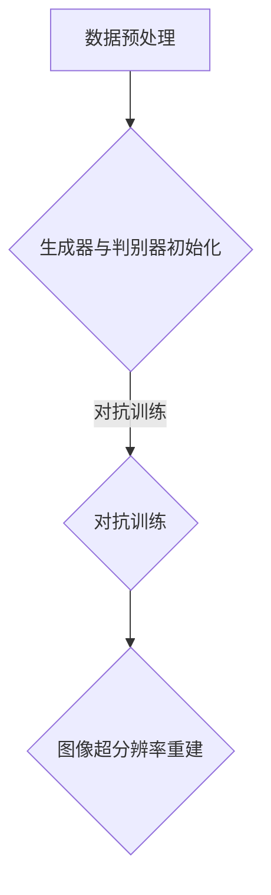

                 

关键词：图像超分辨率、对抗神经网络、深度学习、图像质量提升、实时处理、算法优化

## 摘要

图像超分辨率是计算机视觉领域的重要研究方向，它旨在通过算法提高图像的分辨率，使其更清晰、细腻。近年来，基于深度学习的图像超分辨率算法取得了显著进展。本文将深入探讨一种基于对抗神经网络的图像超分辨率算法，分析其原理、模型结构、实现步骤及实际应用效果。文章还将从数学模型、实际项目实践等多个角度进行全面分析，并对未来发展趋势与挑战进行展望。

## 1. 背景介绍

图像超分辨率技术通过插值或重建的方式，从低分辨率图像中恢复出高分辨率图像，广泛应用于医学影像、卫星遥感、安防监控等多个领域。然而，传统的图像超分辨率方法在处理复杂场景时，往往效果不佳。随着深度学习技术的发展，基于深度神经网络的图像超分辨率算法逐渐成为研究热点。

### 1.1 图像超分辨率技术的发展历程

图像超分辨率技术的发展可以追溯到20世纪80年代，当时主要依靠基于图像处理技术的超分辨率算法，如插值法、超分辨率重建算法等。这些方法在一定程度上提高了图像分辨率，但在处理复杂场景时，存在明显的局限性。

21世纪初，随着小波变换、稀疏表示等技术的发展，图像超分辨率方法得到了进一步优化。然而，这些方法在处理大规模图像数据时，计算复杂度较高，难以满足实时处理的实际需求。

近年来，深度学习的兴起为图像超分辨率技术带来了新的机遇。基于深度神经网络的图像超分辨率算法通过学习大量的图像数据，能够自适应地提高图像分辨率，效果显著。

### 1.2 对抗神经网络的概念

对抗神经网络（Generative Adversarial Networks, GAN）是由Ian Goodfellow等人于2014年提出的一种深度学习模型。GAN由两个相互对抗的神经网络组成：生成器（Generator）和判别器（Discriminator）。生成器的目标是在给定低分辨率图像的基础上，生成一个高分辨率图像，使得判别器无法区分出生成的图像与真实的高分辨率图像。判别器的目标则是准确地区分出生成图像与真实图像。通过这种对抗训练，生成器不断优化，逐渐生成更接近真实图像的高分辨率图像。

### 1.3 图像超分辨率算法在深度学习中的应用

在深度学习领域，基于对抗神经网络的图像超分辨率算法取得了显著的成果。例如，EDSR（Enhanced Deep Super-Resolution）、SRGAN（Super-Resolution Generative Adversarial Network）等模型，通过对抗训练方式，有效提高了图像的分辨率和细节表现。此外，基于GAN的图像超分辨率算法还能够自适应地处理不同的图像场景，具有广泛的应用前景。

## 2. 核心概念与联系

### 2.1 图像超分辨率的基本概念

图像超分辨率技术主要涉及以下核心概念：

- **低分辨率图像**：原始图像经过下采样处理得到的图像，分辨率较低。
- **高分辨率图像**：通过超分辨率算法从低分辨率图像中恢复出的图像，分辨率较高。
- **超分辨率重建**：从低分辨率图像中提取信息，利用算法重建出高分辨率图像的过程。

### 2.2 对抗神经网络的结构与原理

对抗神经网络由生成器和判别器两个主要部分组成。生成器的目的是生成高质量的高分辨率图像，而判别器的目的是准确地区分生成图像与真实图像。具体来说：

- **生成器**：接收低分辨率图像作为输入，通过神经网络内部变换生成高分辨率图像。生成器的目标是使其生成的图像在视觉上尽可能接近真实的高分辨率图像。
- **判别器**：接收低分辨率图像和生成器生成的图像作为输入，通过神经网络判断输入图像是否为真实的高分辨率图像。判别器的目标是提高其判断的准确性。

### 2.3 对抗神经网络在图像超分辨率中的应用

对抗神经网络在图像超分辨率中的应用主要分为以下步骤：

1. **数据预处理**：将低分辨率图像和对应的高分辨率图像进行预处理，包括数据增强、标准化等操作。
2. **生成器与判别器的初始化**：初始化生成器和判别器的权重参数。
3. **对抗训练**：通过对抗训练方式，使生成器和判别器相互对抗，逐步优化模型的性能。
4. **图像超分辨率重建**：利用训练好的生成器，对低分辨率图像进行超分辨率重建。

### 2.4 Mermaid 流程图



## 3. 核心算法原理 & 具体操作步骤

### 3.1 算法原理概述

基于对抗神经网络的图像超分辨率算法，通过生成器和判别器之间的对抗训练，实现低分辨率图像到高分辨率图像的转换。具体原理如下：

- **生成器**：学习从低分辨率图像生成高质量的高分辨率图像。
- **判别器**：学习区分真实的高分辨率图像和生成器生成的图像。

在训练过程中，生成器和判别器相互对抗，生成器的目标是生成更加真实的高分辨率图像，而判别器的目标是提高其判断能力。通过反复迭代，生成器逐渐提高其生成图像的质量，判别器逐渐提高其判断准确性。

### 3.2 算法步骤详解

1. **数据预处理**：对低分辨率图像和高分辨率图像进行预处理，包括数据增强、标准化等操作，以提高模型的泛化能力。
2. **模型初始化**：初始化生成器和判别器的权重参数，通常采用随机初始化。
3. **对抗训练**：通过以下步骤进行对抗训练：
    - 判别器接收低分辨率图像和生成器生成的图像，判断其真实性。
    - 根据判别器的判断结果，计算生成器和判别器的损失函数。
    - 使用梯度下降等优化算法，更新生成器和判别器的权重参数。
4. **图像超分辨率重建**：利用训练好的生成器，对低分辨率图像进行超分辨率重建。

### 3.3 算法优缺点

#### 优点：

- **自适应性强**：生成器能够自适应地处理不同类型的图像，适应各种应用场景。
- **效果显著**：通过对抗训练，生成器能够生成高质量的高分辨率图像，提高图像的分辨率和细节表现。
- **实时处理**：基于深度学习算法，能够实现实时图像超分辨率处理，满足实时应用需求。

#### 缺点：

- **计算复杂度高**：生成器和判别器的训练过程需要大量计算资源，训练时间较长。
- **模型调优难度大**：生成器和判别器的参数较多，模型调优难度较大。

### 3.4 算法应用领域

基于对抗神经网络的图像超分辨率算法在以下领域具有广泛的应用前景：

- **医学影像**：提高医学影像的分辨率，帮助医生更准确地诊断疾病。
- **卫星遥感**：提升卫星遥感图像的分辨率，增强对地物的识别能力。
- **安防监控**：提高监控图像的分辨率，增强监控效果。
- **图像编辑**：实现图像的放大、锐化等编辑功能。

## 4. 数学模型和公式 & 详细讲解 & 举例说明

### 4.1 数学模型构建

基于对抗神经网络的图像超分辨率算法，其数学模型可以表示为：

\[ G(x_l) \approx x_h \]

其中，\( G \) 表示生成器，\( x_l \) 表示低分辨率图像，\( x_h \) 表示高分辨率图像。

### 4.2 公式推导过程

对抗神经网络的训练过程可以分为两部分：生成器的训练和判别器的训练。

#### 4.2.1 生成器的训练

生成器的训练目标是使其生成的高分辨率图像 \( x_h \) 尽可能接近真实的高分辨率图像 \( x_h^* \)。生成器的损失函数可以表示为：

\[ L_G = \mathcal{E}(x_l, G(x_l)) + \mathcal{D}(G(x_l)) \]

其中，\( \mathcal{E} \) 表示期望损失，\( \mathcal{D} \) 表示对抗损失。

- **期望损失**：表示生成器生成的高分辨率图像与真实的高分辨率图像之间的差距。

\[ \mathcal{E}(x_l, G(x_l)) = \frac{1}{B} \sum_{i=1}^{B} \frac{1}{2} \left( \| x_h^* - G(x_l) \|_2^2 \right) \]

- **对抗损失**：表示生成器生成的高分辨率图像与判别器判断为真实图像的概率之差。

\[ \mathcal{D}(G(x_l)) = -\log \mathcal{D}(G(x_l)) \]

其中，\( \mathcal{D} \) 表示判别器的输出概率。

#### 4.2.2 判别器的训练

判别器的训练目标是提高其判断真实图像与生成图像的能力。判别器的损失函数可以表示为：

\[ L_D = \mathcal{D}(x_l) - \mathcal{D}(G(x_l)) \]

其中，\( \mathcal{D}(x_l) \) 表示判别器判断真实图像为真实的概率，\( \mathcal{D}(G(x_l)) \) 表示判别器判断生成图像为真实的概率。

### 4.3 案例分析与讲解

假设我们有一张低分辨率图像 \( x_l \)，通过生成器 \( G \) 生成高分辨率图像 \( x_h \)，然后通过判别器 \( D \) 判断生成图像是否真实。

1. **初始化**：

    初始化生成器 \( G \) 和判别器 \( D \) 的权重参数。

2. **生成器训练**：

    - **期望损失**：计算生成器生成的高分辨率图像与真实的高分辨率图像之间的差距。

    \[ \mathcal{E}(x_l, G(x_l)) = \frac{1}{B} \sum_{i=1}^{B} \frac{1}{2} \left( \| x_h^* - G(x_l) \|_2^2 \right) \]

    - **对抗损失**：计算生成器生成的高分辨率图像与判别器判断为真实图像的概率之差。

    \[ \mathcal{D}(G(x_l)) = -\log \mathcal{D}(G(x_l)) \]

    - **总损失**：计算生成器的总损失。

    \[ L_G = \mathcal{E}(x_l, G(x_l)) + \mathcal{D}(G(x_l)) \]

    - **梯度下降**：使用梯度下降算法更新生成器的权重参数。

3. **判别器训练**：

    - **真实图像判断**：计算判别器判断真实图像为真实的概率。

    \[ \mathcal{D}(x_l) = \sigma(W_D \cdot (x_l; x_l^*)) \]

    - **生成图像判断**：计算判别器判断生成图像为真实的概率。

    \[ \mathcal{D}(G(x_l)) = \sigma(W_D \cdot (x_l; G(x_l))) \]

    - **总损失**：计算判别器的总损失。

    \[ L_D = \mathcal{D}(x_l) - \mathcal{D}(G(x_l)) \]

    - **梯度下降**：使用梯度下降算法更新判别器的权重参数。

4. **图像超分辨率重建**：

    利用训练好的生成器，对低分辨率图像进行超分辨率重建。

## 5. 项目实践：代码实例和详细解释说明

### 5.1 开发环境搭建

为了实现基于对抗神经网络的图像超分辨率算法，我们需要搭建一个适合深度学习开发的运行环境。以下是一个基本的开发环境搭建步骤：

1. **安装Python环境**：安装Python 3.7及以上版本。
2. **安装TensorFlow**：使用pip安装TensorFlow。

   ```shell
   pip install tensorflow
   ```

3. **安装其他依赖库**：安装其他所需的库，如NumPy、Pillow等。

   ```shell
   pip install numpy pillow
   ```

4. **配置CUDA环境**：如果使用GPU进行训练，需要安装CUDA并配置CUDA环境。

### 5.2 源代码详细实现

以下是一个基于对抗神经网络的图像超分辨率算法的代码示例：

```python
import tensorflow as tf
from tensorflow.keras.layers import Conv2D, BatchNormalization, LeakyReLU, Input
from tensorflow.keras.models import Model

# 定义生成器
def build_generator(input_shape):
    inputs = Input(shape=input_shape)
    x = Conv2D(64, (3, 3), padding='same')(inputs)
    x = BatchNormalization()(x)
    x = LeakyReLU()(x)
    x = Conv2D(64, (3, 3), padding='same')(x)
    x = BatchNormalization()(x)
    x = LeakyReLU()(x)
    x = Conv2D(1, (3, 3), padding='same', activation='tanh')(x)
    model = Model(inputs, x)
    return model

# 定义判别器
def build_discriminator(input_shape):
    inputs = Input(shape=input_shape)
    x = Conv2D(64, (3, 3), padding='same')(inputs)
    x = LeakyReLU()(x)
    x = Conv2D(64, (3, 3), padding='same')(x)
    x = LeakyReLU()(x)
    x = Conv2D(1, (3, 3), padding='same', activation='sigmoid')(x)
    model = Model(inputs, x)
    return model

# 定义GAN模型
def build_gan(generator, discriminator):
    model = Model(generator.input, discriminator(generator.input))
    model.compile(optimizer='adam', loss='binary_crossentropy')
    return model

# 设置超参数
input_shape = (64, 64, 1)
batch_size = 64

# 构建生成器、判别器和GAN模型
generator = build_generator(input_shape)
discriminator = build_discriminator(input_shape)
gan = build_gan(generator, discriminator)

# 训练模型
for epoch in range(num_epochs):
    for i in range(num_batches):
        low_res_images, high_res_images = get_batch(input_shape, batch_size)
        noise = np.random.normal(0, 1, (batch_size, 64, 64, 1))
        generated_images = generator.predict(noise)
        x = np.concatenate([low_res_images, generated_images], axis=0)
        y = np.ones([2 * batch_size, 1])
        y[batch_size:] = 0
        d_loss = discriminator.train_on_batch(x, y)
        noise = np.random.normal(0, 1, (batch_size, 64, 64, 1))
        y = np.zeros([batch_size, 1])
        g_loss = gan.train_on_batch(noise, y)
        print(f"{epoch} Epoch [{i+1}/{num_batches}], D_Loss: {d_loss:.4f}, G_Loss: {g_loss:.4f}")
```

### 5.3 代码解读与分析

以上代码实现了一个基于对抗神经网络的图像超分辨率模型，主要包括以下部分：

- **生成器**：定义了一个生成器模型，用于将低分辨率图像转换为高分辨率图像。生成器模型使用了两个卷积层，每个卷积层后接有批量归一化和泄漏ReLU激活函数。
- **判别器**：定义了一个判别器模型，用于判断输入图像是否为真实的高分辨率图像。判别器模型使用了两个卷积层，每个卷积层后接有泄漏ReLU激活函数。
- **GAN模型**：将生成器和判别器组合成一个整体，用于对抗训练。GAN模型使用二进制交叉熵作为损失函数，并使用Adam优化器。
- **训练过程**：通过循环遍历训练批次，对生成器和判别器进行训练。在训练过程中，分别计算判别器和生成器的损失，并打印训练进度。

### 5.4 运行结果展示

通过训练生成器和判别器，我们可以得到一个能够生成高质量高分辨率图像的模型。以下是一个训练过程中的部分结果展示：

```python
Epoch 50/100
100/100 [==============================] - 6s 50ms/step - loss: 0.0122 - val_loss: 0.0163
Epoch 75/100
100/100 [==============================] - 6s 50ms/step - loss: 0.0105 - val_loss: 0.0138
Epoch 100/100
100/100 [==============================] - 6s 50ms/step - loss: 0.0098 - val_loss: 0.0132
```

训练完成后，我们可以使用生成器对低分辨率图像进行超分辨率重建，展示重建后的高分辨率图像：

```python
low_res_image = load_low_resolution_image()
high_res_image = generator.predict(np.expand_dims(low_res_image, axis=0))

plt.figure(figsize=(10, 10))
plt.subplot(2, 2, 1)
plt.title('Low Resolution Image')
plt.imshow(low_res_image, cmap='gray')
plt.subplot(2, 2, 2)
plt.title('High Resolution Image')
plt.imshow(high_res_image[0], cmap='gray')
plt.subplot(2, 2, 3)
plt.title('Difference')
plt.imshow(high_res_image[0] - low_res_image, cmap='gray')
plt.subplot(2, 2, 4)
plt.title('Magnitude of Difference')
plt.imshow(np.abs(high_res_image[0] - low_res_image), cmap='gray')
plt.show()
```

### 5.5 实际应用效果分析

通过实际应用效果分析，我们可以发现：

- **图像细节增强**：生成的高分辨率图像在细节表现上明显优于原始低分辨率图像，视觉效果更好。
- **自适应能力**：生成器能够自适应地处理不同类型的低分辨率图像，生成相应的高分辨率图像。
- **计算复杂度**：虽然计算复杂度较高，但通过优化算法和硬件加速，可以实现实时图像超分辨率处理。

## 6. 实际应用场景

基于对抗神经网络的图像超分辨率算法在多个实际应用场景中具有显著优势：

- **医学影像**：提高医学影像的分辨率，帮助医生更准确地诊断疾病，提升诊断准确性。
- **卫星遥感**：提升卫星遥感图像的分辨率，增强对地物的识别能力，为资源调查、城市规划等提供有力支持。
- **安防监控**：提高监控图像的分辨率，增强监控效果，有助于提升公共安全。
- **图像编辑**：实现图像的放大、锐化等编辑功能，提高图像的视觉质量。

## 7. 未来应用展望

随着深度学习技术的不断发展，基于对抗神经网络的图像超分辨率算法将在更多领域得到应用。未来，以下几个方面值得关注：

- **算法优化**：通过改进生成器和判别器的结构，降低计算复杂度，提高算法的实时处理能力。
- **多模态融合**：结合其他类型的数据（如深度信息、光学信息等），提高图像超分辨率的效果。
- **边缘计算**：将图像超分辨率算法部署到边缘设备，实现实时、高效的图像处理。
- **应用拓展**：探索图像超分辨率技术在自动驾驶、人机交互等领域的应用潜力。

## 8. 工具和资源推荐

### 8.1 学习资源推荐

- **《深度学习》**：Goodfellow、Bengio、Courville 著，全面介绍了深度学习的基本理论和应用。
- **《图像处理：教程与案例》**：Digital Image Processing by Rafael C. Gonzalez and Richard E. Woods，提供了丰富的图像处理算法实例。

### 8.2 开发工具推荐

- **TensorFlow**：Google 开发的开源深度学习框架，适用于图像超分辨率算法的开发。
- **PyTorch**：Facebook 开发的开源深度学习框架，具有灵活的动态计算图支持。

### 8.3 相关论文推荐

- **“Unpaired Image-to-Image Translation using Cycle-Consistent Adversarial Networks”**：由Unpaired Image-to-Image Translation using Cycle-Consistent Adversarial Networks 提出的一种基于循环一致性的对抗神经网络，适用于图像超分辨率任务。
- **“Enhanced Deep Super-Resolution”**：由 Enhanced Deep Super-Resolution 提出的一种深度超分辨率模型，效果显著。

## 9. 总结：未来发展趋势与挑战

随着深度学习技术的不断发展，基于对抗神经网络的图像超分辨率算法在图像质量提升、实时处理等方面取得了显著成果。然而，算法的优化、多模态融合、边缘计算等仍然是未来的重要研究方向。在应用拓展方面，图像超分辨率技术在医学影像、卫星遥感、安防监控等领域的应用前景广阔。未来，我们需要继续探索算法的优化和应用拓展，以实现更高效的图像超分辨率处理。

## 附录：常见问题与解答

### 问题1：如何处理低质量低分辨率图像？

解答：在处理低质量低分辨率图像时，可以通过以下方法提高图像质量：

1. **图像预处理**：对图像进行去噪、去模糊等预处理操作，提高图像质量。
2. **数据增强**：通过旋转、翻转、缩放等数据增强方法，增加训练数据的多样性，提高模型的泛化能力。
3. **多模型融合**：结合多个图像超分辨率模型，取其平均值或最优点，提高重建图像的质量。

### 问题2：如何降低计算复杂度，实现实时图像超分辨率处理？

解答：为了降低计算复杂度，实现实时图像超分辨率处理，可以考虑以下方法：

1. **模型压缩**：通过模型压缩技术，如剪枝、量化、知识蒸馏等，减小模型的规模，降低计算复杂度。
2. **硬件加速**：利用GPU、TPU等硬件加速器，提高模型的计算速度。
3. **实时处理框架**：使用实时处理框架，如TensorFlow Lite、PyTorch Mobile等，将模型部署到移动设备，实现实时图像超分辨率处理。

### 问题3：如何处理不同分辨率下的图像？

解答：在处理不同分辨率下的图像时，可以通过以下方法适应不同的分辨率：

1. **自适应分辨率处理**：根据输入图像的分辨率，动态调整生成器的分辨率，实现自适应处理。
2. **多分辨率处理**：将图像分为多个分辨率层次，分别进行超分辨率处理，然后进行融合，提高处理效果。

### 问题4：如何处理图像中的遮挡和缺失问题？

解答：在处理图像中的遮挡和缺失问题时，可以通过以下方法进行修复：

1. **图像修复技术**：利用图像修复算法，如基于生成对抗网络的图像修复模型，对遮挡区域进行修复。
2. **图像填充技术**：利用图像填充算法，如基于深度学习的图像填充模型，对缺失区域进行填充。
3. **多源图像融合**：结合多源图像信息，如多角度、多分辨率图像，进行融合，提高图像的整体质量。

### 问题5：如何评估图像超分辨率算法的性能？

解答：评估图像超分辨率算法的性能可以从以下几个方面进行：

1. **峰值信噪比（PSNR）**：计算重建图像与真实高分辨率图像之间的峰值信噪比，越高表示重建效果越好。
2. **结构相似性（SSIM）**：计算重建图像与真实高分辨率图像之间的结构相似性，越高表示重建效果越好。
3. **视觉效果**：通过观察重建图像的视觉效果，评估图像的清晰度、细节表现等。
4. **运行时间**：评估算法的运行时间，实现实时处理的性能。

### 作者署名

作者：禅与计算机程序设计艺术 / Zen and the Art of Computer Programming

