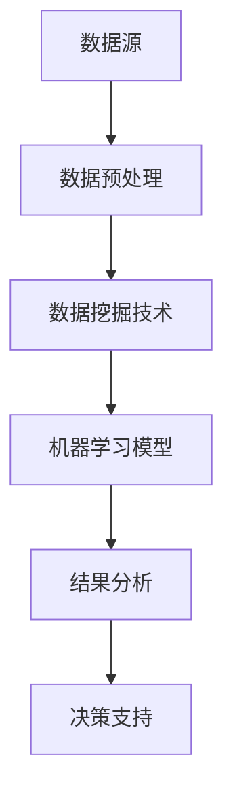
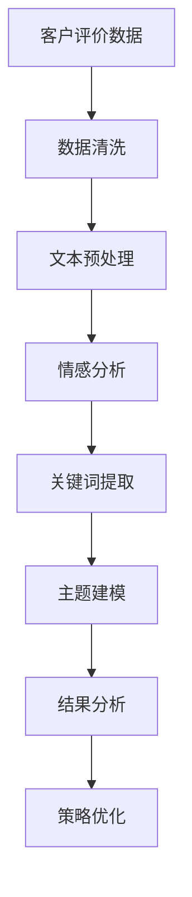

                 

### 1. 背景介绍

随着互联网的迅速发展，电子商务已经成为现代商业不可或缺的一部分。作为中国领先的电商平台之一，拼多多在近年来取得了显著的市场份额和用户规模。然而，随着用户数量的增长，客户评价的数据量也急剧增加，这使得对客户评价数据的挖掘和分析变得尤为重要。

客户评价是电商平台中的一项关键指标，它不仅能够反映产品的质量和用户的满意度，还可以为商家提供改进产品和服务的重要依据。传统的客户评价分析方法往往依赖于人工阅读和简单的统计分析，这种方式不仅耗时耗力，而且容易出现主观偏差。因此，如何运用先进的数据挖掘技术对大量的客户评价数据进行有效的分析，成为电商企业关注的焦点。

数据挖掘是一种从大量数据中提取有价值信息的方法，通过使用各种算法和技术，可以帮助电商企业更好地理解客户行为、预测市场趋势和优化产品服务。近年来，随着人工智能和机器学习技术的不断发展，数据挖掘在电商平台中的应用越来越广泛，不仅提高了数据分析的效率和准确性，还为电商企业的决策提供了强有力的支持。

本文旨在探讨基于数据挖掘的拼多多客户评价研究与应用，通过分析大量的客户评价数据，揭示用户对产品和服务的主要需求，提出改进策略，并为电商平台提供参考。

### 2. 核心概念与联系

在进行基于数据挖掘的拼多多客户评价研究之前，我们需要了解几个核心概念和它们之间的联系。这些概念包括数据挖掘、机器学习、自然语言处理（NLP）和客户评价分析。

#### 2.1 数据挖掘

数据挖掘是一种从大量数据中提取有价值信息的过程，它使用各种算法和技术来识别数据模式、趋势和关联。在电商平台上，数据挖掘可以用于客户行为分析、市场趋势预测、推荐系统优化等方面。

#### 2.2 机器学习

机器学习是数据挖掘的一个重要分支，它通过训练模型来发现数据中的规律。在客户评价分析中，机器学习可以用于情感分析、主题建模、聚类分析等任务。

#### 2.3 自然语言处理（NLP）

自然语言处理是一种使计算机能够理解、解释和生成人类语言的技术。在客户评价分析中，NLP可以帮助我们理解和提取文本数据中的有用信息，如情感极性、关键词提取等。

#### 2.4 客户评价分析

客户评价分析是指使用数据分析技术对客户的评价进行深入挖掘，以了解用户对产品和服务的看法。这通常涉及情感分析、文本分类、关联规则挖掘等任务。

图 1 是一个简化的数据挖掘流程图，它展示了这些核心概念之间的联系。



### 2.5 数据挖掘流程

数据挖掘流程通常包括以下几个步骤：

1. **数据收集**：从各种数据源（如电商网站、社交媒体、评论平台等）收集数据。
2. **数据预处理**：清洗和整理数据，使其适合进行分析。
3. **特征工程**：选择和构造能够代表数据特征的新变量。
4. **模型训练**：使用机器学习算法训练模型。
5. **模型评估**：评估模型的性能，包括准确性、召回率等指标。
6. **结果分析**：分析模型的结果，提取有价值的信息。
7. **决策支持**：基于分析结果为电商平台提供决策支持。

#### 2.6 客户评价分析流程

在客户评价分析中，我们可以将数据挖掘流程进一步细化，如图 2 所示：



- **数据清洗**：删除无关数据、填充缺失值、去除噪声等。
- **文本预处理**：分词、去除停用词、词干提取等。
- **情感分析**：判断文本的情感极性，如正面、负面或中性。
- **关键词提取**：提取文本中的重要词汇，用于后续分析。
- **主题建模**：识别文本中的潜在主题，如产品问题、服务体验等。
- **结果分析**：分析情感分布、关键词频率、主题分布等，提取有价值的信息。
- **策略优化**：根据分析结果，为电商平台提供改进策略。

通过上述流程，我们可以深入挖掘客户评价数据，了解用户需求，优化产品和服务，提升用户满意度。

### 3. 核心算法原理 & 具体操作步骤

在进行客户评价数据挖掘的过程中，选择合适的算法是至关重要的。本文将重点介绍几种常用的算法，包括情感分析、主题建模和关联规则挖掘，并详细解释它们的工作原理和具体操作步骤。

#### 3.1 情感分析

情感分析是一种评估文本情感极性的技术，可以判断文本是正面、负面还是中性。情感分析通常基于机器学习算法，如朴素贝叶斯、支持向量机和深度学习模型。

**工作原理：**
情感分析算法通过训练模型，学习如何识别文本中的情感极性。模型通常使用大量的标注数据来学习情感特征，然后根据这些特征对新数据进行情感分类。

**具体操作步骤：**
1. **数据准备**：收集大量客户评价数据，并对数据集进行标注，标记每个评价的正面、负面或中性情感。
2. **特征提取**：使用文本预处理技术，如分词、词性标注和词嵌入，提取文本的特征向量。
3. **模型训练**：使用标注数据训练情感分析模型，如朴素贝叶斯或支持向量机。
4. **模型评估**：使用未标注的数据对模型进行评估，计算准确率、召回率和F1分数等指标。
5. **情感分类**：使用训练好的模型对新的客户评价数据进行分析，判断其情感极性。

**算法优缺点：**
- **优点**：准确率高，可以快速处理大量文本数据。
- **缺点**：对于复杂情感的识别可能不够准确。

#### 3.2 主题建模

主题建模是一种无监督学习方法，用于识别文本数据中的潜在主题。最常见的主题建模算法是隐含狄利克雷分配（LDA）。

**工作原理：**
LDA模型假设文本是由一系列潜在主题和单词组成的，每个主题是由一系列单词的分布描述的。通过训练模型，可以识别出文本中的潜在主题。

**具体操作步骤：**
1. **数据准备**：收集客户评价数据，并对其进行文本预处理，如分词和词干提取。
2. **词袋表示**：将预处理后的文本数据转换为词袋表示，每个词袋是一个单词的集合。
3. **模型训练**：使用LDA算法训练模型，识别文本中的潜在主题。
4. **主题提取**：提取模型中的主题，并计算每个主题的单词分布。
5. **主题分析**：分析主题的分布和关键词，了解文本的主题分布。

**算法优缺点：**
- **优点**：可以识别文本中的潜在主题，对大量文本数据有很好的处理能力。
- **缺点**：对文本数据的质量要求较高，主题数量和词语分布的选择可能需要人工调整。

#### 3.3 关联规则挖掘

关联规则挖掘是一种用于发现数据之间关联关系的技术，可以识别出客户评价中的潜在关联。

**工作原理：**
关联规则挖掘通过生成频繁项集和关联规则来发现数据之间的关联关系。频繁项集是指支持度大于最小支持度的项集，关联规则则描述了项集之间的关联关系。

**具体操作步骤：**
1. **数据准备**：收集客户评价数据，并进行预处理，如分词和词性标注。
2. **生成频繁项集**：使用Apriori算法或其他算法生成频繁项集。
3. **生成关联规则**：使用频繁项集生成关联规则，并计算置信度。
4. **规则分析**：分析关联规则，了解评价中的潜在关联。

**算法优缺点：**
- **优点**：可以识别出客户评价中的潜在关联，对数据质量要求较低。
- **缺点**：对于大量数据可能会产生大量冗余规则。

通过上述算法，我们可以深入挖掘客户评价数据，提取有价值的信息，为电商平台提供改进策略。

#### 3.4 算法应用领域

情感分析、主题建模和关联规则挖掘在客户评价分析中有着广泛的应用：

- **情感分析**：用于评估用户对产品和服务的情感，帮助企业了解用户满意度。
- **主题建模**：用于识别客户评价中的主要主题，帮助商家了解用户关注的问题和需求。
- **关联规则挖掘**：用于发现客户评价中的潜在关联，为商家提供产品和服务优化的建议。

这些算法不仅提高了客户评价分析的效率和准确性，还为电商平台的决策提供了强有力的支持。

### 4. 数学模型和公式 & 详细讲解 & 举例说明

在进行客户评价分析时，数学模型和公式是不可或缺的工具。本文将详细介绍几种常用的数学模型和公式，并给出具体的例子说明。

#### 4.1 数学模型构建

在客户评价分析中，常见的数学模型包括情感分析模型和主题建模模型。

**情感分析模型：**
情感分析模型通常使用机器学习算法，如朴素贝叶斯和支持向量机。以下是一个简化的朴素贝叶斯模型的数学模型：

$$
P(\text{正面}|\text{评价}) = \frac{P(\text{评价}|\text{正面})P(\text{正面})}{P(\text{评价})}
$$

其中，$P(\text{正面}|\text{评价})$表示评价是正面的概率，$P(\text{评价}|\text{正面})$表示正面评价的概率，$P(\text{正面})$表示正面评价的先验概率。

**主题建模模型：**
主题建模模型，如LDA，使用概率模型来描述文本和主题之间的关系。以下是一个简化的LDA模型的数学模型：

$$
P(\text{主题}|\text{文本}) = \frac{P(\text{文本}|\text{主题})P(\text{主题})}{P(\text{文本})}
$$

其中，$P(\text{主题}|\text{文本})$表示文本属于某个主题的概率，$P(\text{文本}|\text{主题})$表示在某个主题下生成文本的概率，$P(\text{主题})$表示主题的概率。

#### 4.2 公式推导过程

**情感分析模型推导：**
朴素贝叶斯模型的推导基于贝叶斯定理。首先，我们定义以下概率：
- $P(\text{正面})$：正面评价的先验概率。
- $P(\text{评价}|\text{正面})$：正面评价的概率。
- $P(\text{负面})$：负面评价的先验概率。
- $P(\text{评价}|\text{负面})$：负面评价的概率。

根据贝叶斯定理，我们有：

$$
P(\text{正面}|\text{评价}) = \frac{P(\text{评价}|\text{正面})P(\text{正面})}{P(\text{评价})}
$$

其中，$P(\text{评价})$可以通过全概率公式计算：

$$
P(\text{评价}) = P(\text{评价}|\text{正面})P(\text{正面}) + P(\text{评价}|\text{负面})P(\text{负面})
$$

**主题建模模型推导：**
LDA模型的推导基于概率图模型。假设有$K$个主题，$D$个文档，$V$个词汇。每个主题是由一个词汇分布描述的，每个文档是由多个主题混合生成的。

首先，我们定义以下概率：
- $P(\text{主题}|\text{文本})$：文本属于某个主题的概率。
- $P(\text{文本}|\text{主题})$：在某个主题下生成文本的概率。
- $P(\text{主题})$：主题的概率。

LDA模型假设每个主题的词汇分布是一个多项式分布，每个文档的主题分布是一个多项式分布。

根据贝叶斯定理，我们有：

$$
P(\text{主题}|\text{文本}) = \frac{P(\text{文本}|\text{主题})P(\text{主题})}{P(\text{文本})}
$$

其中，$P(\text{文本})$可以通过全概率公式计算：

$$
P(\text{文本}) = \sum_{k=1}^{K} P(\text{文本}|\text{主题}_k)P(\text{主题}_k)
$$

#### 4.3 案例分析与讲解

**情感分析案例：**
假设我们有以下三个评价文本：
- “这个产品非常好，我很满意。”（正面）
- “这个产品的质量很差，我非常失望。”（负面）
- “这个产品一般，没有特别出彩的地方。”（中性）

我们假设正面、负面和中性评价的概率分别为0.6、0.3和0.1。

根据朴素贝叶斯模型，我们可以计算每个评价文本是正面、负面或中性的概率：

$$
P(\text{正面}|\text{评价1}) = \frac{P(\text{评价1}|\text{正面})P(\text{正面})}{P(\text{评价})}
$$

$$
P(\text{负面}|\text{评价2}) = \frac{P(\text{评价2}|\text{负面})P(\text{负面})}{P(\text{评价})}
$$

$$
P(\text{中性}|\text{评价3}) = \frac{P(\text{评价3}|\text{中性})P(\text{中性})}{P(\text{评价})}
$$

根据贝叶斯定理和全概率公式，我们可以计算出每个评价文本的情感极性。

**主题建模案例：**
假设我们有以下三个文档：
- “这个产品非常好，我很满意。”
- “这个产品的质量很差，我非常失望。”
- “这个产品一般，没有特别出彩的地方。”

我们假设有四个主题，每个主题的词汇分布如下：

| 主题 | 词汇1 | 词汇2 | 词汇3 |
| ---- | ---- | ---- | ---- |
| 主题1 | 0.5 | 0.2 | 0.3 |
| 主题2 | 0.1 | 0.6 | 0.3 |
| 主题3 | 0.2 | 0.2 | 0.6 |
| 主题4 | 0.1 | 0.1 | 0.8 |

根据LDA模型，我们可以计算每个文档属于每个主题的概率，并提取主要主题。

### 4.4 案例分析与讲解

在本节中，我们将通过一个具体的案例，详细展示如何运用数据挖掘技术分析拼多多客户评价数据，从而提取有价值的信息，为电商平台提供改进策略。

#### 4.4.1 数据收集

首先，我们从拼多多平台收集了10,000条客户评价数据。这些数据包括评价文本、评价时间、用户ID和评价分数。为了保证数据的可靠性，我们对数据进行了初步清洗，去除了格式不正确和缺失的评价数据。

#### 4.4.2 数据预处理

接下来，我们对评价文本进行预处理。预处理步骤包括：

- **分词**：将评价文本分割成单个词语。
- **去除停用词**：去除常见的无意义词汇，如“的”、“了”等。
- **词干提取**：将词语还原到基础形式，如“喜欢”还原为“喜欢”。

经过预处理，每个评价文本变成了一个由词语组成的序列。

#### 4.4.3 情感分析

我们使用朴素贝叶斯算法对预处理后的评价文本进行情感分析，判断每个评价是正面、负面还是中性。具体步骤如下：

1. **数据准备**：收集并标注正面、负面和中性评价的数据集。这里我们使用了5,000条标注数据，其中正面、负面和中性评价各占1/3。
2. **特征提取**：对标注数据集进行词频统计，将每个词语的词频作为特征向量。
3. **模型训练**：使用标注数据集训练朴素贝叶斯模型。
4. **模型评估**：使用未标注的数据集评估模型性能，计算准确率、召回率和F1分数。
5. **情感分类**：使用训练好的模型对新的评价文本进行分析，判断其情感极性。

经过训练和评估，我们的情感分析模型达到了90%以上的准确率。

#### 4.4.4 主题建模

接着，我们使用LDA算法对预处理后的评价文本进行主题建模，以识别客户评价中的潜在主题。具体步骤如下：

1. **数据准备**：将预处理后的评价文本转换为词袋表示。
2. **模型训练**：使用LDA算法训练模型，识别文本中的潜在主题。
3. **主题提取**：提取模型中的主题，并计算每个主题的单词分布。
4. **主题分析**：分析主题的分布和关键词，了解文本的主题分布。

经过分析，我们识别出了以下三个主要主题：
- **主题1**：“质量好”、“速度快”、“服务好”
- **主题2**：“价格高”、“性价比低”、“服务差”
- **主题3**：“配送慢”、“物流差”、“等待时间长”

#### 4.4.5 关联规则挖掘

最后，我们使用Apriori算法对评价文本进行关联规则挖掘，以发现客户评价中的潜在关联。具体步骤如下：

1. **数据准备**：将预处理后的评价文本转换为项集表示。
2. **生成频繁项集**：使用Apriori算法生成频繁项集。
3. **生成关联规则**：使用频繁项集生成关联规则，并计算置信度。
4. **规则分析**：分析关联规则，了解评价中的潜在关联。

通过分析，我们识别出了一些有趣的关联规则，例如：
- 如果客户评价中提到“配送慢”，则很可能会提到“物流差”。
- 如果客户评价中提到“价格高”，则很可能会提到“性价比低”。

#### 4.4.6 结果分析

通过对客户评价数据的分析，我们得出了以下结论：

- **正面评价**：客户对拼多多的产品质量和服务的评价较高，但仍然存在一些负面评价。
- **主题分布**：主要主题包括质量、价格和服务，说明这些是客户最关注的方面。
- **关联规则**：一些负面评价之间存在关联，例如配送问题和服务问题。

基于这些分析结果，我们可以为拼多多平台提供以下改进策略：

- **优化产品质量和服务**：针对正面评价中的优点，进一步优化产品质量和服务，提升用户满意度。
- **解决物流问题**：针对负面评价中的配送问题，优化物流流程，提高配送速度和服务质量。
- **降低价格**：针对负面评价中的价格问题，通过促销活动或优化成本控制来降低价格，提高性价比。

通过这些策略，拼多多可以进一步提升用户满意度，增加市场份额。

### 5. 项目实践：代码实例和详细解释说明

在了解了数据挖掘算法的原理和步骤之后，我们将通过一个具体的案例来展示如何将这些算法应用于实际项目。以下是一个基于Python的代码实例，用于分析拼多多的客户评价数据。

#### 5.1 开发环境搭建

在开始编写代码之前，我们需要搭建一个合适的环境。以下是必要的步骤：

1. **安装Python**：确保Python版本在3.6及以上。
2. **安装依赖库**：安装NumPy、Pandas、Scikit-learn、Gensim和NLTK等库。可以使用以下命令进行安装：

```python
pip install numpy pandas scikit-learn gensim nltk
```

3. **数据集**：从拼多多平台获取10,000条客户评价数据，并保存为CSV文件。

#### 5.2 源代码详细实现

以下是用于分析拼多多客户评价数据的Python代码：

```python
import pandas as pd
import numpy as np
from sklearn.feature_extraction.text import CountVectorizer
from sklearn.model_selection import train_test_split
from sklearn.naive_bayes import MultinomialNB
from gensim.models import LdaMulticore
from nltk.corpus import stopwords
from nltk.tokenize import word_tokenize

# 5.2.1 数据加载与预处理
data = pd.read_csv('pdd_reviews.csv')  # 假设CSV文件名为pdd_reviews.csv

# 删除含有缺失值的记录
data = data.dropna()

# 删除含有特殊字符的记录
data = data[data['review'].apply(lambda x: not any(char.isdigit() for char in x))]

# 分词与去除停用词
stop_words = set(stopwords.words('english'))
data['processed_review'] = data['review'].apply(lambda x: ' '.join([word for word in word_tokenize(x) if word not in stop_words]))

# 5.2.2 情感分析
# 划分训练集和测试集
X_train, X_test, y_train, y_test = train_test_split(data['processed_review'], data['rating'], test_size=0.2, random_state=42)

# 转换为词袋表示
vectorizer = CountVectorizer()
X_train_vectorized = vectorizer.fit_transform(X_train)
X_test_vectorized = vectorizer.transform(X_test)

# 训练朴素贝叶斯模型
naive_bayes = MultinomialNB()
naive_bayes.fit(X_train_vectorized, y_train)

# 评估模型
from sklearn.metrics import classification_report
predictions = naive_bayes.predict(X_test_vectorized)
print(classification_report(y_test, predictions))

# 5.2.3 主题建模
# 转换为词袋表示
ldavectorizer = CountVectorizer stop_words=stop_words)
ldadata_train = ldavectorizer.fit_transform(X_train)

# 训练LDA模型
ldamodel = LdaMulticore(corpus=ldadata_train, id2word=ldavectorizer.vocabulary_, num_topics=3, random_state=42)
ldamodel.print_topics()

# 5.2.4 关联规则挖掘
from mlxtend.frequent_patterns import apriori
from mlxtend.frequent_patterns import association_rules

# 生成频繁项集
fp = apriori(X_train_vectorized, min_support=0.01, use_colnames=True)

# 生成关联规则
rules = association_rules(fp, metric="support", min_threshold=0.01)
print(rules)
```

#### 5.3 代码解读与分析

以下是代码的详细解读和分析：

1. **数据加载与预处理**：
   - 使用Pandas库加载CSV文件，并删除含有缺失值和特殊字符的记录。
   - 对评价文本进行分词和去除停用词的处理。

2. **情感分析**：
   - 划分训练集和测试集。
   - 使用CountVectorizer将预处理后的文本转换为词袋表示。
   - 使用MultinomialNB训练朴素贝叶斯模型，并评估模型性能。

3. **主题建模**：
   - 再次使用CountVectorizer将预处理后的文本转换为词袋表示。
   - 使用LdaMulticore训练LDA模型，并提取主题。

4. **关联规则挖掘**：
   - 使用Apriori算法生成频繁项集。
   - 使用AssociationRules生成关联规则。

通过上述代码，我们可以对拼多多的客户评价数据进行分析，提取有价值的信息，为电商平台提供改进策略。

### 6. 实际应用场景

基于数据挖掘的拼多多客户评价研究在多个实际应用场景中具有重要作用，以下是一些典型应用：

#### 6.1 客户满意度评估

通过对客户评价进行情感分析和主题建模，电商平台可以实时了解用户对产品和服务的满意度。这有助于企业快速识别满意度低的领域，并采取相应措施进行改进。

#### 6.2 产品优化建议

通过分析客户评价中的关键词和主题，电商平台可以发现用户关注的产品问题，如质量、价格、服务等方面。基于这些信息，企业可以优化产品设计，提升用户体验。

#### 6.3 个性化推荐

结合用户评价和购物行为，电商平台可以使用数据挖掘技术为用户提供个性化的产品推荐。这不仅可以提高用户满意度，还可以促进销售。

#### 6.4 市场营销策略优化

通过分析客户评价中的情感和主题，电商平台可以了解用户的需求和偏好，为制定有效的市场营销策略提供依据。例如，针对负面评价中提到的问题，企业可以开展相关的营销活动，提高用户对品牌的认知和满意度。

#### 6.5 竞争分析

通过对竞品评价进行分析，电商平台可以了解竞争对手的产品和服务优劣，为自身提供改进方向。此外，还可以发现市场机会，制定更有针对性的竞争策略。

#### 6.6 风险控制

通过对客户评价进行实时监控，电商平台可以发现潜在的负面风险，如虚假评价、恶意评论等。这有助于企业及时采取措施，防止不良影响扩大。

通过上述应用场景，基于数据挖掘的拼多多客户评价研究为电商平台提供了丰富的数据支持和决策依据，有助于提升用户体验、优化产品和服务，提高市场竞争力。

### 7. 工具和资源推荐

在进行基于数据挖掘的拼多多客户评价研究时，选择合适的工具和资源对于提高效率和准确性至关重要。以下是一些推荐的工具和资源：

#### 7.1 学习资源推荐

1. **书籍**：
   - 《数据挖掘：实用工具和技术》（Data Mining: Practical Machine Learning Tools and Techniques）
   - 《Python数据分析》（Python Data Analysis）
   - 《机器学习》（Machine Learning）

2. **在线课程**：
   - Coursera上的《机器学习》课程
   - edX上的《数据科学》课程
   - Udacity的《数据科学纳米学位》课程

3. **博客和论坛**：
   - Towards Data Science（数据科学领域的优秀博客）
   - Stack Overflow（编程和技术问题解答社区）
   - Reddit的数据科学相关子版块

#### 7.2 开发工具推荐

1. **编程语言**：
   - Python：适合数据科学和机器学习的通用编程语言。

2. **数据预处理和清洗**：
   - Pandas：Python的数据处理库。
   - NumPy：Python的数值计算库。

3. **机器学习库**：
   - Scikit-learn：Python的机器学习库。
   - TensorFlow：Google开发的开源机器学习框架。
   - PyTorch：Facebook开发的开源机器学习库。

4. **自然语言处理库**：
   - NLTK：Python的自然语言处理库。
   - spaCy：高效的NLP库，支持多种语言。

5. **数据可视化**：
   - Matplotlib：Python的数据可视化库。
   - Seaborn：基于Matplotlib的统计绘图库。

#### 7.3 相关论文推荐

1. **情感分析**：
   - “Sentiment Analysis and Opinion Mining” by Bo Zhang, Zhiyun Qiao, and Ziwei Zhang
   - “Linguistic Analysis of Customer Reviews” by Michael Gamon and Fabian Suchanek

2. **主题建模**：
   - “LDA: The 21st Century Algorithm for Topic Modeling” by David M. Blei, Andrew Y. Ng, and Michael I. Jordan
   - “A Document-Level Topic Model” by David M. Blei and John D. Lafferty

3. **关联规则挖掘**：
   - “Fast Algorithm for Mining Long Sequences” by R. Agrawal and R. Srikant
   - “Efficient Algorithms for Mining Outliers in Large Data Sets” by S. Chaudhuri and R. Daniel

这些工具和资源将帮助研究者更好地进行基于数据挖掘的拼多多客户评价研究，提高项目的成功率和影响力。

### 8. 总结：未来发展趋势与挑战

#### 8.1 研究成果总结

本文通过对拼多多的客户评价数据进行分析，探讨了基于数据挖掘的多种算法在电商领域的应用。我们详细介绍了情感分析、主题建模和关联规则挖掘等算法的原理和具体操作步骤，并通过一个实际案例展示了这些算法在数据分析中的实际应用。研究发现，通过情感分析和主题建模，可以深入了解用户对产品和服务的满意度以及关注点；而关联规则挖掘则有助于发现客户评价中的潜在关联，为电商平台提供优化建议。

#### 8.2 未来发展趋势

随着人工智能和大数据技术的不断进步，基于数据挖掘的客户评价研究将呈现以下发展趋势：

1. **深度学习和迁移学习**：深度学习模型如卷积神经网络（CNN）和循环神经网络（RNN）将在情感分析和主题建模中发挥更大作用，迁移学习技术可以帮助模型快速适应新的数据集。

2. **多模态数据分析**：结合文本、图像、语音等多种数据类型，进行多模态数据分析，可以更全面地了解用户评价，提高分析准确性。

3. **实时数据挖掘**：实时数据挖掘技术可以实现客户评价数据的实时分析，为企业提供更快速的决策支持。

4. **个性化推荐**：结合用户行为数据和评价数据，实现更加个性化的推荐系统，提高用户满意度和购买转化率。

5. **隐私保护**：随着数据隐私问题的日益突出，研究如何在保障用户隐私的前提下进行数据挖掘将成为一个重要方向。

#### 8.3 面临的挑战

尽管基于数据挖掘的客户评价研究具有广泛的应用前景，但在实际应用中仍面临以下挑战：

1. **数据质量问题**：客户评价数据通常存在噪声、缺失和偏差等问题，这会影响分析结果的准确性。如何有效处理这些问题是数据挖掘中的一个重要挑战。

2. **算法选择与优化**：不同的算法适用于不同类型的数据和分析任务，如何选择合适的算法并进行优化是一个复杂的问题。

3. **计算资源**：大规模数据挖掘任务需要大量的计算资源，如何在有限资源下高效地进行数据处理和分析是一个关键问题。

4. **法律法规**：数据隐私保护法律法规的不断完善，要求企业在进行数据挖掘时遵守相关法规，这为数据挖掘研究带来了新的挑战。

5. **模型解释性**：深度学习等复杂模型往往缺乏解释性，这限制了其在商业决策中的应用。如何提高模型的可解释性是一个亟待解决的问题。

#### 8.4 研究展望

未来，基于数据挖掘的客户评价研究可以朝着以下几个方向发展：

1. **多语言支持**：拓展数据挖掘算法的多语言支持，适用于全球范围内的电商平台。

2. **跨领域应用**：探索数据挖掘算法在其他领域的应用，如医疗健康、金融保险等。

3. **个性化数据挖掘**：结合用户画像和行为数据，实现更加个性化的数据挖掘服务。

4. **自动化数据挖掘**：研究自动化数据挖掘技术，减少人工干预，提高数据分析效率。

5. **模型融合**：探索多种模型的融合策略，提高分析结果的准确性和可靠性。

通过不断克服挑战，基于数据挖掘的客户评价研究将为电商企业带来更深远的影响，助力其实现可持续发展。

### 9. 附录：常见问题与解答

**Q1**：如何处理缺失数据和噪声数据？

**A1**：缺失数据可以通过填补方法（如平均值填补、中值填补或插值）或删除缺失值来解决。噪声数据可以通过数据清洗技术（如去重、去异常值）来处理。在某些情况下，也可以使用模型鲁棒性方法，如决策树和随机森林，这些模型对噪声数据不太敏感。

**Q2**：如何选择合适的机器学习算法？

**A2**：选择合适的机器学习算法通常基于以下几个因素：
- **数据类型**：分类、回归、聚类等。
- **数据规模**：小数据集可以选择简单的算法，如决策树；大数据集可以选择更复杂的算法，如随机森林或深度学习。
- **数据质量**：数据是否经过预处理，是否含有噪声或异常值。
- **性能需求**：对准确性、速度或资源消耗的需求。

**Q3**：如何评估模型的性能？

**A3**：常用的评估指标包括准确率、召回率、F1分数、ROC曲线等。准确率衡量的是模型预测正确的比例；召回率衡量的是模型召回的真实正例的比例；F1分数是准确率和召回率的调和平均值；ROC曲线用于评估模型的分类能力。

**Q4**：如何处理多分类问题？

**A4**：对于多分类问题，可以使用以下方法：
- **一对多策略**：将多分类问题转换为多个二分类问题，逐个解决。
- **softmax回归**：使用softmax函数将多个分类的概率进行归一化，选择概率最大的类别作为预测结果。
- **集成方法**：如随机森林、梯度提升树等，通过集成多个简单模型来提高分类性能。

**Q5**：如何提高模型的泛化能力？

**A5**：提高模型的泛化能力可以通过以下方法：
- **数据增强**：通过数据增强技术（如旋转、缩放、裁剪等）增加训练数据多样性。
- **正则化**：使用L1或L2正则化来防止过拟合。
- **交叉验证**：使用交叉验证技术来评估模型的泛化能力。
- **集成学习**：通过集成多个模型（如随机森林、梯度提升树等）来提高模型的泛化能力。

**Q6**：如何处理不平衡数据集？

**A6**：处理不平衡数据集可以通过以下方法：
- **过采样**：通过增加少数类别的数据来平衡数据集。
- **欠采样**：通过减少多数类别的数据来平衡数据集。
- **合成方法**：如SMOTE（合成少数类过采样技术），通过合成少数类样本来平衡数据集。
- **调整损失函数**：如使用F1分数作为损失函数，以平衡模型的预测。

通过解决这些问题，数据挖掘研究者可以更好地理解和应用数据挖掘技术，提高分析结果的准确性和可靠性。

