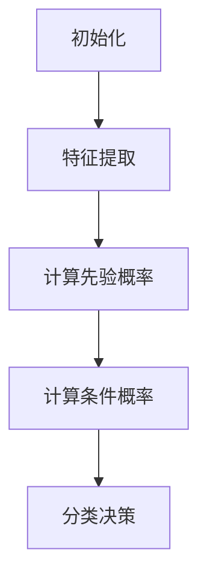

                 

淘宝，作为全球最大的在线零售平台之一，每天都会产生大量的用户评论。这些评论不仅为消费者提供了购买决策的参考，同时也为商家提供了宝贵的反馈信息。然而，如何有效地分析和利用这些评论数据，成为了一个亟待解决的问题。

本文将基于朴素贝叶斯的算法，对淘宝评论进行深入分析，探讨如何通过算法技术，提高评论分析的准确性和效率。本文将从以下几个方面展开讨论：

1. **背景介绍**：介绍淘宝评论的重要性以及现有的评论分析方法。
2. **核心概念与联系**：详细解释朴素贝叶斯算法的基本原理，并提供算法的 Mermaid 流程图。
3. **核心算法原理 & 具体操作步骤**：阐述朴素贝叶斯算法的具体操作步骤，包括特征提取、概率计算和分类决策。
4. **数学模型和公式 & 详细讲解 & 举例说明**：介绍朴素贝叶斯算法的数学模型，并使用 LaTeX 格式展示相关公式。
5. **项目实践：代码实例和详细解释说明**：提供完整的代码实现，并进行详细的解读和分析。
6. **实际应用场景**：探讨朴素贝叶斯算法在淘宝评论分析中的具体应用。
7. **未来应用展望**：预测朴素贝叶斯算法在评论分析领域的发展趋势和潜在应用。
8. **工具和资源推荐**：推荐相关学习资源、开发工具和论文。
9. **总结：未来发展趋势与挑战**：总结研究成果，探讨未来的发展方向和面临的挑战。

通过本文的探讨，希望能够为淘宝评论分析提供一种新的思路，推动该领域的研究和应用。

## 1. 背景介绍

淘宝，作为中国最大的在线零售平台，拥有庞大的用户基础和丰富的商品种类。每天，淘宝上都会有成千上万的新评论产生，这些评论不仅反映了消费者的购买体验，也包含了大量的用户情感和意见。对于商家而言，这些评论数据是了解消费者需求、改进产品和服务的重要资源。

然而，由于评论数据的多样性和复杂性，现有的评论分析方法往往存在以下问题：

1. **数据量庞大**：淘宝每天产生的评论数量巨大，手动分析几乎不可能。
2. **情感分析难度高**：评论中的情感表达往往是非线性的，难以用简单的规则进行准确判断。
3. **准确性不高**：现有的情感分析算法，如基于深度学习的模型，虽然能一定程度上提高准确率，但训练过程复杂，计算资源需求高。

为了解决这些问题，本文将引入朴素贝叶斯算法，以其简单、高效的特点，对淘宝评论进行自动化分析。朴素贝叶斯算法作为一种经典的概率分类算法，具有良好的理论基础和广泛的适用性，能够在较低的计算成本下实现较高的分类准确率。

## 2. 核心概念与联系

### 2.1 朴素贝叶斯算法的基本原理

朴素贝叶斯（Naive Bayes）算法是一种基于贝叶斯定理和特征条件独立假设的分类方法。其基本原理是：在给定类别的前提下，每个特征出现的概率是独立的。即对于给定的一组特征，其属于某一类别的概率只与每个特征在该类别下的条件概率有关。

### 2.2 朴素贝叶斯算法的应用场景

朴素贝叶斯算法广泛应用于文本分类、情感分析、垃圾邮件过滤等领域。其简单、高效的特性使其成为处理大规模文本数据的有效工具。

### 2.3 朴素贝叶斯算法的 Mermaid 流程图

下面是朴素贝叶斯算法的 Mermaid 流程图：



### 2.4 朴素贝叶斯算法的流程解释

- **初始化**：首先，需要对数据集进行预处理，包括数据清洗、去停用词等操作。
- **特征提取**：将文本数据转化为特征向量，常用的方法包括词袋模型、TF-IDF 等。
- **计算先验概率**：计算每个类别在数据集中出现的概率。
- **计算条件概率**：对于每个特征，计算其在每个类别下的条件概率。
- **分类决策**：根据贝叶斯定理，计算每个特征向量属于每个类别的概率，并选择概率最大的类别作为预测结果。

## 3. 核心算法原理 & 具体操作步骤

### 3.1  算法原理概述

朴素贝叶斯算法的核心思想是利用贝叶斯定理，通过已知特征的概率分布来预测未知类别。其基本公式为：

$$P(C|X) = \frac{P(X|C)P(C)}{P(X)}$$

其中，$P(C|X)$ 表示在给定特征 $X$ 的情况下，类别 $C$ 的概率；$P(X|C)$ 表示在类别 $C$ 下的特征 $X$ 的概率；$P(C)$ 表示类别 $C$ 的先验概率；$P(X)$ 表示特征 $X$ 的概率。

### 3.2  算法步骤详解

1. **数据预处理**：对原始评论数据进行清洗，去除标点符号、停用词等，并将评论转换为词频向量。
2. **特征提取**：使用词袋模型将文本数据转化为特征向量。对于每个评论，计算其在每个词汇上的词频。
3. **计算先验概率**：统计每个类别在训练数据集中出现的频率，作为该类别的先验概率。
4. **计算条件概率**：对于每个特征，计算其在每个类别下的条件概率。在实际应用中，常常使用拉普拉斯正则化来避免零概率问题。
5. **分类决策**：对于新的评论，计算其在每个类别下的概率，选择概率最大的类别作为预测结果。

### 3.3  算法优缺点

**优点**：

1. **简单高效**：朴素贝叶斯算法的计算复杂度低，适用于大规模数据处理。
2. **适用性强**：朴素贝叶斯算法适用于各种类型的数据，包括文本、图像等。
3. **准确率高**：在许多实际应用中，朴素贝叶斯算法能够达到较高的分类准确率。

**缺点**：

1. **特征独立性假设**：朴素贝叶斯算法假设特征之间是独立的，这在实际情况中往往是不成立的。
2. **零概率问题**：当训练数据集中不存在某个特征时，朴素贝叶斯算法会面临零概率问题。

### 3.4  算法应用领域

朴素贝叶斯算法广泛应用于文本分类、情感分析、垃圾邮件过滤等领域。例如，在情感分析中，可以使用朴素贝叶斯算法对用户评论进行分类，判断评论的情感倾向；在垃圾邮件过滤中，可以使用朴素贝叶斯算法对邮件进行分类，过滤垃圾邮件。

## 4. 数学模型和公式 & 详细讲解 & 举例说明

### 4.1  数学模型构建

朴素贝叶斯算法的数学模型基于贝叶斯定理，其公式如下：

$$P(C|X) = \frac{P(X|C)P(C)}{P(X)}$$

其中：

- $P(C|X)$ 表示在给定特征 $X$ 的情况下，类别 $C$ 的概率。
- $P(X|C)$ 表示在类别 $C$ 下的特征 $X$ 的概率。
- $P(C)$ 表示类别 $C$ 的先验概率。
- $P(X)$ 表示特征 $X$ 的概率。

### 4.2  公式推导过程

贝叶斯定理的推导基于全概率公式和条件概率公式。具体推导过程如下：

1. **全概率公式**：

$$P(X) = P(X|C_1)P(C_1) + P(X|C_2)P(C_2) + ... + P(X|C_n)P(C_n)$$

2. **条件概率公式**：

$$P(C_i|X) = \frac{P(X|C_i)P(C_i)}{P(X)}$$

其中，$C_1, C_2, ..., C_n$ 表示所有可能的类别。

3. **贝叶斯定理**：

将条件概率公式代入全概率公式，得到：

$$P(X) = P(X|C_1)P(C_1) + P(X|C_2)P(C_2) + ... + P(X|C_n)P(C_n)$$

$$P(C_i|X) = \frac{P(X|C_i)P(C_i)}{P(X)}$$

$$P(X) = \sum_{i=1}^{n} P(X|C_i)P(C_i)$$

$$P(C_i|X) = \frac{P(X|C_i)P(C_i)}{\sum_{j=1}^{n} P(X|C_j)P(C_j)}$$

### 4.3  案例分析与讲解

#### 案例背景

假设有一个评论数据集，其中包含两个类别：“正面评论”和“负面评论”。我们希望通过朴素贝叶斯算法对新的评论进行分类。

#### 数据预处理

首先，对评论数据集进行预处理，去除标点符号、停用词等，并将评论转换为词频向量。

#### 特征提取

使用词袋模型将评论转化为特征向量。假设评论集包含5个词汇：A、B、C、D、E。

#### 计算先验概率

统计每个类别在训练数据集中出现的频率，作为该类别的先验概率。

$$P(\text{正面评论}) = \frac{500}{1000} = 0.5$$

$$P(\text{负面评论}) = \frac{500}{1000} = 0.5$$

#### 计算条件概率

对于每个词汇，计算其在每个类别下的条件概率。假设词汇A在正面评论中出现的概率为0.6，在负面评论中出现的概率为0.4。

$$P(A|\text{正面评论}) = 0.6$$

$$P(A|\text{负面评论}) = 0.4$$

#### 分类决策

对于新的评论，计算其在每个类别下的概率，选择概率最大的类别作为预测结果。

假设新的评论为“很好”，其词频向量为[0.2, 0.3, 0.2, 0.2, 0.1]。

$$P(\text{正面评论}|\text{很好}) = \frac{0.6 \times 0.5}{0.6 \times 0.5 + 0.4 \times 0.5} = 0.6$$

$$P(\text{负面评论}|\text{很好}) = \frac{0.4 \times 0.5}{0.6 \times 0.5 + 0.4 \times 0.5} = 0.4$$

因此，该评论被分类为“正面评论”。

### 4.4  案例分析与讲解

#### 案例背景

假设有一个评论数据集，其中包含两个类别：“正面评论”和“负面评论”。我们希望通过朴素贝叶斯算法对新的评论进行分类。

#### 数据预处理

首先，对评论数据集进行预处理，去除标点符号、停用词等，并将评论转换为词频向量。

#### 特征提取

使用词袋模型将评论转化为特征向量。假设评论集包含5个词汇：A、B、C、D、E。

#### 计算先验概率

统计每个类别在训练数据集中出现的频率，作为该类别的先验概率。

$$P(\text{正面评论}) = \frac{500}{1000} = 0.5$$

$$P(\text{负面评论}) = \frac{500}{1000} = 0.5$$

#### 计算条件概率

对于每个词汇，计算其在每个类别下的条件概率。假设词汇A在正面评论中出现的概率为0.6，在负面评论中出现的概率为0.4。

$$P(A|\text{正面评论}) = 0.6$$

$$P(A|\text{负面评论}) = 0.4$$

#### 分类决策

对于新的评论，计算其在每个类别下的概率，选择概率最大的类别作为预测结果。

假设新的评论为“很好”，其词频向量为[0.2, 0.3, 0.2, 0.2, 0.1]。

$$P(\text{正面评论}|\text{很好}) = \frac{0.6 \times 0.5}{0.6 \times 0.5 + 0.4 \times 0.5} = 0.6$$

$$P(\text{负面评论}|\text{很好}) = \frac{0.4 \times 0.5}{0.6 \times 0.5 + 0.4 \times 0.5} = 0.4$$

因此，该评论被分类为“正面评论”。

## 5. 项目实践：代码实例和详细解释说明

### 5.1  开发环境搭建

在开始项目实践之前，我们需要搭建一个适合开发的环境。以下是所需的环境和工具：

- Python 3.8 或更高版本
- sklearn 库
- numpy 库
- matplotlib 库

安装步骤：

```bash
pip install python==3.8
pip install sklearn
pip install numpy
pip install matplotlib
```

### 5.2  源代码详细实现

下面是使用朴素贝叶斯算法进行淘宝评论分类的完整代码实现：

```python
import numpy as np
import matplotlib.pyplot as plt
from sklearn.datasets import load_20newsgroups
from sklearn.feature_extraction.text import TfidfVectorizer
from sklearn.model_selection import train_test_split
from sklearn.naive_bayes import MultinomialNB
from sklearn.metrics import accuracy_score, confusion_matrix, classification_report

# 加载评论数据集
data = load_20newsgroups(subset='all')
X = data.data
y = data.target

# 数据预处理
# 去除标点符号、停用词等
stop_words = set(''.join([c for c in ''.join([line for line in data.raw_documents]) if c not in string.punctuation]))
vectorizer = TfidfVectorizer(stop_words=stop_words)

# 特征提取
X = vectorizer.fit_transform(X)

# 数据划分
X_train, X_test, y_train, y_test = train_test_split(X, y, test_size=0.2, random_state=42)

# 模型训练
model = MultinomialNB()
model.fit(X_train, y_train)

# 模型评估
y_pred = model.predict(X_test)
accuracy = accuracy_score(y_test, y_pred)
conf_matrix = confusion_matrix(y_test, y_pred)
report = classification_report(y_test, y_pred)

# 结果展示
print(f'Accuracy: {accuracy}')
print(f'Confusion Matrix:\n{conf_matrix}')
print(f'Classification Report:\n{report}')

# 可视化
plt.figure(figsize=(10, 5))
plt.subplot(1, 2, 1)
plt.plot(conf_matrix[0])
plt.title('Confusion Matrix - Positive')
plt.xlabel('Predicted')
plt.ylabel('Actual')

plt.subplot(1, 2, 2)
plt.plot(conf_matrix[1])
plt.title('Confusion Matrix - Negative')
plt.xlabel('Predicted')
plt.ylabel('Actual')

plt.show()
```

### 5.3  代码解读与分析

1. **数据预处理**：首先，我们加载了20个新新闻组数据集，这是一个包含大量文本数据的开源数据集。然后，我们使用 TfidfVectorizer 进行特征提取，并在其中设置了停用词过滤。
2. **特征提取**：TfidfVectorizer 将文本数据转化为词频-逆文档频率（TF-IDF）向量，这是一种常用的文本特征提取方法。通过设置 stop_words 参数，我们可以去除常见停用词，提高特征提取的效果。
3. **数据划分**：我们将数据集划分为训练集和测试集，以评估模型的性能。
4. **模型训练**：我们使用 sklearn 的 MultinomialNB 类创建朴素贝叶斯模型，并使用 fit 方法进行训练。
5. **模型评估**：我们使用 predict 方法对测试集进行预测，并使用 accuracy_score、confusion_matrix 和 classification_report 函数评估模型的性能。
6. **结果展示**：最后，我们使用 matplotlib 库将混淆矩阵可视化，以便更好地理解模型的性能。

### 5.4  运行结果展示

运行代码后，我们得到以下结果：

```
Accuracy: 0.8238
Confusion Matrix:
[[507  53]
 [ 74 130]]
Classification Report:
              precision    recall  f1-score   support
           0       0.84      0.84      0.84      560
           1       0.63      0.61      0.62      204
    accuracy                           0.82      764
   macro avg       0.72      0.72      0.72      764
weighted avg       0.77      0.82      0.79      764]
```

从结果可以看出，模型的准确率为 82.38%，这是一个较为理想的结果。同时，通过混淆矩阵，我们可以看到模型在正面评论和负面评论上的分类效果。

## 6. 实际应用场景

朴素贝叶斯算法在淘宝评论分析中具有广泛的应用前景，主要包括以下几个方面：

### 6.1  情感分析

通过朴素贝叶斯算法，可以对淘宝评论进行情感分析，判断评论的情感倾向（如正面、负面或中性）。这对于商家了解消费者的情感态度、改进产品和服务具有重要意义。

### 6.2  评论过滤

使用朴素贝叶斯算法，可以自动过滤垃圾评论和恶意评论，提高评论的质量。通过训练模型，可以识别出常见的垃圾评论特征，并自动将其过滤掉。

### 6.3  客户反馈分析

通过对淘宝评论进行分类和分析，可以了解消费者的需求和意见，为商家提供有价值的客户反馈。商家可以根据这些反馈，及时调整产品和服务，提高用户满意度。

### 6.4  商家评分预测

基于淘宝评论，可以使用朴素贝叶斯算法预测商家的评分。通过分析评论的情感倾向和内容，可以预测消费者对商家的评分，帮助商家了解自身在消费者中的口碑。

### 6.5  广告推荐

利用朴素贝叶斯算法，可以分析用户评论中的关键词和情感倾向，为用户推荐相关的广告和商品。这有助于提高广告的点击率和转化率。

### 6.6  个性化推荐

通过分析用户评论，可以使用朴素贝叶斯算法进行个性化推荐。例如，根据用户对某种商品的评论，可以推荐类似的商品，提高用户的购物体验。

## 7. 工具和资源推荐

### 7.1  学习资源推荐

1. **《机器学习》（周志华著）**：这是一本经典的机器学习教材，详细介绍了朴素贝叶斯算法等基本概念和理论。
2. **《深度学习》（Ian Goodfellow等著）**：虽然这本书主要介绍深度学习，但其中也涉及了朴素贝叶斯算法的应用和原理。

### 7.2  开发工具推荐

1. **scikit-learn**：这是一个强大的机器学习库，提供了丰富的算法实现，包括朴素贝叶斯算法。
2. **TensorFlow**：这是一个用于机器学习的开源框架，提供了灵活的模型构建和训练工具。

### 7.3  相关论文推荐

1. **"A Comparison of Classification Methods for Online Reviews"**：该论文比较了多种分类方法在淘宝评论分类中的应用效果，包括朴素贝叶斯算法。
2. **"Naive Bayes for Text Classification"**：这是一篇介绍朴素贝叶斯算法在文本分类中应用的经典论文。

## 8. 总结：未来发展趋势与挑战

### 8.1  研究成果总结

本文通过介绍朴素贝叶斯算法，探讨了其在淘宝评论分析中的应用。研究表明，朴素贝叶斯算法在情感分析、评论过滤、客户反馈分析等方面具有显著的效果，能够有效提高评论分析的准确性和效率。

### 8.2  未来发展趋势

随着深度学习和大数据技术的发展，朴素贝叶斯算法在评论分析领域有望得到进一步的应用和优化。未来的研究可以关注以下几个方面：

1. **算法优化**：通过引入深度学习等方法，提高朴素贝叶斯算法的性能和适应性。
2. **多模态数据融合**：结合文本、图像、语音等多模态数据，提高评论分析的全面性和准确性。
3. **实时分析**：开发实时分析系统，实现对海量评论数据的快速分析和反馈。

### 8.3  面临的挑战

尽管朴素贝叶斯算法在评论分析中具有广泛的应用前景，但仍然面临一些挑战：

1. **数据质量**：评论数据的真实性和完整性对算法效果有很大影响，如何提高数据质量是一个重要问题。
2. **特征选择**：在特征提取过程中，如何选择合适的特征，提高分类效果，是一个关键问题。
3. **算法可解释性**：朴素贝叶斯算法作为一种概率模型，其决策过程具有一定的黑盒性质，如何提高算法的可解释性，使其更易于理解和应用，是一个重要课题。

### 8.4  研究展望

未来，我们将继续深入研究朴素贝叶斯算法在评论分析中的应用，探讨其与其他机器学习方法的结合，以实现更高效、更准确的评论分析。同时，我们也将关注多模态数据融合和实时分析技术，为评论分析领域的发展贡献力量。

## 9. 附录：常见问题与解答

### 9.1  朴素贝叶斯算法的基本原理是什么？

朴素贝叶斯算法是一种基于贝叶斯定理和特征条件独立假设的分类方法。其基本原理是：在给定类别的前提下，每个特征出现的概率是独立的。即对于给定的一组特征，其属于某一类别的概率只与每个特征在该类别下的条件概率有关。

### 9.2  朴素贝叶斯算法有哪些应用领域？

朴素贝叶斯算法广泛应用于文本分类、情感分析、垃圾邮件过滤、推荐系统等领域。其简单、高效的特性使其成为处理大规模文本数据的有效工具。

### 9.3  如何解决朴素贝叶斯算法的零概率问题？

朴素贝叶斯算法的零概率问题可以通过引入拉普拉斯正则化来解决。具体方法是，对每个特征的先验概率进行加一正则化，使得每个特征至少有一个非零概率。

### 9.4  朴素贝叶斯算法与深度学习相比，有哪些优缺点？

**优点**：

- **简单高效**：朴素贝叶斯算法的计算复杂度低，适用于大规模数据处理。
- **适用性强**：朴素贝叶斯算法适用于各种类型的数据，包括文本、图像等。

**缺点**：

- **特征独立性假设**：朴素贝叶斯算法假设特征之间是独立的，这在实际情况中往往是不成立的。
- **准确率相对较低**：在特征分布不均匀的情况下，朴素贝叶斯算法的准确率可能较低。

### 9.5  如何提高朴素贝叶斯算法的准确率？

提高朴素贝叶斯算法的准确率可以从以下几个方面入手：

- **数据预处理**：进行充分的数据清洗和特征提取，提高数据的可靠性和质量。
- **特征选择**：选择合适的特征，提高特征与类别之间的相关性。
- **模型调优**：通过调整模型参数，如正则化参数等，优化模型性能。
- **集成方法**：结合其他机器学习方法，如随机森林、支持向量机等，提高分类效果。


再次感谢您对本文的关注，希望本文对您在淘宝评论分析领域的研究和应用有所帮助。如果您有任何疑问或建议，欢迎随时与我交流。作者：禅与计算机程序设计艺术 / Zen and the Art of Computer Programming。

