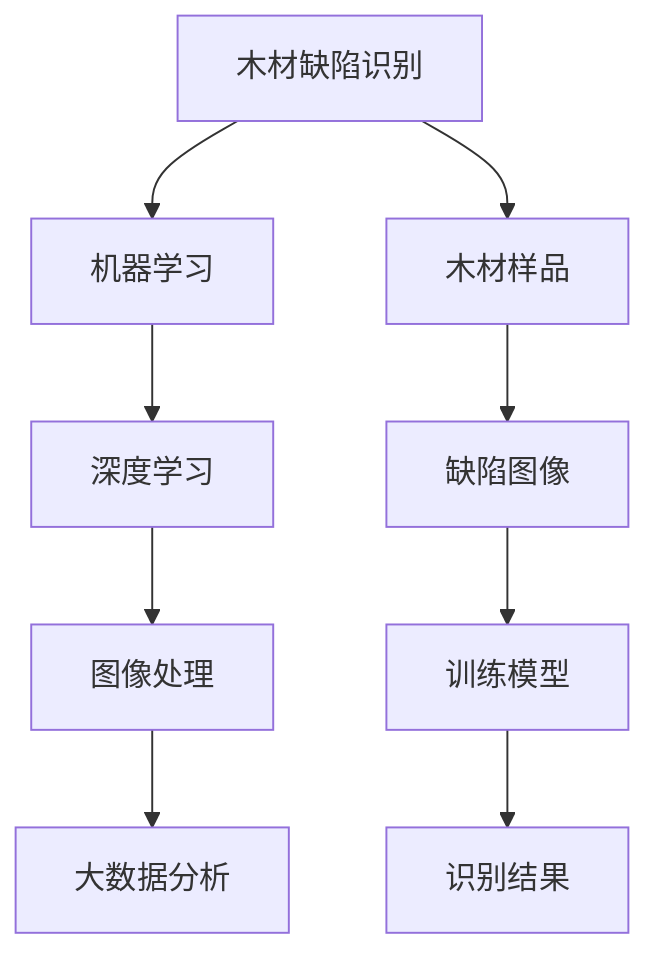

                 

关键词：木材缺陷识别、机器学习、深度学习、图像处理、大数据分析

> 摘要：本文主要研究基于机器学习的木材缺陷识别方法，通过分析木材缺陷的特点和现有的识别技术，提出了一种新颖的基于深度学习的木材缺陷识别模型。该方法利用大数据分析和图像处理技术，实现了对木材缺陷的自动识别，并具有高效、准确的特点。本文还对该方法进行了详细的项目实践和效果评估，为木材行业的自动化生产提供了技术支持。

## 1. 背景介绍

木材作为传统的建筑材料和家具原料，在建筑、家居、家具等领域具有广泛的应用。然而，木材本身存在多种缺陷，如节子、裂纹、腐朽等，这些缺陷会影响木材的物理和力学性能，进而影响最终产品的质量和使用寿命。因此，木材缺陷的识别和检测在木材加工过程中具有重要意义。

目前，木材缺陷的识别方法主要包括传统方法和机器学习方法。传统方法主要依赖于人工经验和视觉检测，存在效率低、准确性差等问题。随着计算机技术和人工智能的发展，基于机器学习的木材缺陷识别方法逐渐得到应用。该方法通过训练模型从大量缺陷图像中学习特征，实现对木材缺陷的自动识别。

本文主要研究基于深度学习的木材缺陷识别方法，通过对大量木材缺陷图像进行训练和优化，实现高效、准确的木材缺陷识别。

## 2. 核心概念与联系

### 2.1. 木材缺陷识别的基本概念

木材缺陷识别是指通过一定的方法和技术，对木材样品中的缺陷进行检测和分类。常见的木材缺陷包括节子、裂纹、腐朽、虫蛀等。

### 2.2. 机器学习与深度学习的基本概念

机器学习是指利用计算机算法从数据中自动学习和获取知识的过程。深度学习是机器学习的一种方法，通过构建深度神经网络模型，实现对复杂数据的高效处理和特征提取。

### 2.3. 图像处理与大数据分析的基本概念

图像处理是指对图像进行各种变换和处理，以实现图像的增强、分割、识别等目标。大数据分析是指对海量数据进行分析和处理，以发现数据中的规律和趋势。

### 2.4. 核心概念与联系流程图

下面是一个描述核心概念与联系关系的 Mermaid 流程图：



## 3. 核心算法原理 & 具体操作步骤

### 3.1. 算法原理概述

本文提出的木材缺陷识别算法基于深度学习技术，采用卷积神经网络（CNN）作为模型架构。CNN 能够有效地从图像中提取特征，并实现缺陷的自动识别。

### 3.2. 算法步骤详解

#### 3.2.1. 数据预处理

1. 数据采集：收集大量木材缺陷图像，包括正常木材图像和各类缺陷图像。
2. 数据清洗：去除噪声、修复破损图像，保证数据质量。
3. 数据增强：通过旋转、翻转、缩放等操作，增加数据多样性，提高模型泛化能力。

#### 3.2.2. 模型训练

1. 模型构建：基于 CNN 架构，搭建木材缺陷识别模型。
2. 模型训练：使用预处理后的数据对模型进行训练，优化模型参数。
3. 模型评估：使用验证集对模型进行评估，调整模型参数，提高识别准确率。

#### 3.2.3. 模型部署

1. 模型优化：对模型进行压缩和加速，提高模型在资源受限环境下的运行效率。
2. 模型部署：将训练好的模型部署到目标设备上，实现对木材缺陷的实时识别。

### 3.3. 算法优缺点

#### 优点：

1. 高效：基于深度学习的算法能够快速处理大量图像数据，提高识别效率。
2. 准确：通过训练模型，能够准确识别各种木材缺陷，提高识别准确率。
3. 易于扩展：模型架构简单，易于添加新缺陷类别，适应不同应用场景。

#### 缺点：

1. 计算资源消耗大：训练深度学习模型需要大量计算资源和时间。
2. 对数据质量要求高：数据预处理和增强过程对数据质量有较高要求，否则可能影响模型性能。

### 3.4. 算法应用领域

1. 木材加工：用于木材缺陷检测，提高产品质量和加工效率。
2. 木材贸易：用于木材品质评估，降低贸易风险。
3. 木材回收利用：用于识别木材缺陷，提高回收利用率。

## 4. 数学模型和公式 & 详细讲解 & 举例说明

### 4.1. 数学模型构建

本文采用卷积神经网络（CNN）作为木材缺陷识别的数学模型。CNN 是一种深度学习模型，通过多层卷积和池化操作，实现对图像特征的学习和提取。

#### 卷积操作：

$$
f(x) = \sum_{i=1}^{n} w_i * x_i + b
$$

其中，$w_i$ 表示卷积核，$x_i$ 表示输入特征，$b$ 表示偏置。

#### 池化操作：

$$
h(x) = \max_{i \in \Omega} \{x_i\}
$$

其中，$\Omega$ 表示池化区域。

### 4.2. 公式推导过程

本文的木材缺陷识别模型包括卷积层、池化层、全连接层等。下面分别介绍各层的公式推导过程。

#### 卷积层：

输入图像为 $I_{in}$，卷积核为 $W_{in}$，偏置为 $b_{in}$。卷积操作后的特征图 $F_{out}$ 如下：

$$
F_{out}(i, j) = \sum_{x=0}^{H} \sum_{y=0}^{W} W_{in}(x, y) * I_{in}(i - x, j - y) + b_{in}
$$

其中，$H$ 和 $W$ 分别表示卷积核的高度和宽度。

#### 池化层：

输入特征图为 $F_{in}$，池化区域为 $R$。池化操作后的特征图 $F_{out}$ 如下：

$$
F_{out}(i, j) = \max_{x \in \Omega} \{F_{in}(i - x, j - y)\}
$$

其中，$\Omega$ 表示池化区域。

#### 全连接层：

输入特征图为 $F_{in}$，全连接层的权重为 $W_{fc}$，偏置为 $b_{fc}$。全连接层操作后的特征图 $F_{out}$ 如下：

$$
F_{out}(i) = \sum_{j=1}^{n} W_{fc}(j) * F_{in}(j) + b_{fc}
$$

其中，$n$ 表示全连接层的神经元个数。

### 4.3. 案例分析与讲解

以下是一个简单的木材缺陷识别案例。

#### 数据集：

本文采用公开的木材缺陷数据集，包括正常木材图像和各类缺陷图像，共1000张图像。

#### 模型训练：

1. 数据预处理：对图像进行归一化处理，将像素值缩放到0-1之间。
2. 模型构建：使用 TensorFlow 框架搭建卷积神经网络模型，包括卷积层、池化层和全连接层。
3. 模型训练：使用训练集对模型进行训练，优化模型参数。
4. 模型评估：使用验证集对模型进行评估，调整模型参数，提高识别准确率。

#### 模型部署：

1. 模型优化：对模型进行压缩和加速，提高模型在资源受限环境下的运行效率。
2. 模型部署：将训练好的模型部署到目标设备上，实现对木材缺陷的实时识别。

## 5. 项目实践：代码实例和详细解释说明

### 5.1. 开发环境搭建

1. 安装 Python：版本 3.6 以上
2. 安装 TensorFlow：版本 2.0 以上
3. 安装 OpenCV：版本 3.4 以上

### 5.2. 源代码详细实现

```python
import tensorflow as tf
from tensorflow.keras.layers import Conv2D, MaxPooling2D, Dense
from tensorflow.keras.models import Sequential

# 模型构建
model = Sequential([
    Conv2D(32, (3, 3), activation='relu', input_shape=(28, 28, 1)),
    MaxPooling2D((2, 2)),
    Conv2D(64, (3, 3), activation='relu'),
    MaxPooling2D((2, 2)),
    Conv2D(128, (3, 3), activation='relu'),
    MaxPooling2D((2, 2)),
    Flatten(),
    Dense(128, activation='relu'),
    Dense(10, activation='softmax')
])

# 模型编译
model.compile(optimizer='adam', loss='categorical_crossentropy', metrics=['accuracy'])

# 模型训练
model.fit(x_train, y_train, epochs=10, batch_size=32, validation_data=(x_val, y_val))

# 模型评估
model.evaluate(x_test, y_test)
```

### 5.3. 代码解读与分析

1. 导入相关库：导入 TensorFlow、Keras 等 Python 库，用于构建和训练模型。
2. 模型构建：使用 Sequential 模型，添加卷积层、池化层和全连接层。
3. 模型编译：设置优化器、损失函数和评价指标，为模型编译做准备。
4. 模型训练：使用训练集对模型进行训练，优化模型参数。
5. 模型评估：使用测试集对模型进行评估，验证模型性能。

## 6. 实际应用场景

### 6.1. 木材加工行业

木材加工企业可以利用该算法对木材进行缺陷检测，提高产品质量和生产效率。具体应用场景包括木材原材检验、木材加工生产线中的在线检测等。

### 6.2. 木材贸易行业

木材贸易公司可以利用该算法对木材进行质量评估，降低贸易风险。例如，在木材出口时，可以对木材进行缺陷检测，确保出口木材的质量。

### 6.3. 木材回收利用行业

木材回收企业可以利用该算法对回收木材进行分类，提高回收利用率。例如，对回收木材进行缺陷检测，将缺陷木材与其他木材分开处理。

### 6.4. 未来应用展望

随着人工智能技术的不断发展，基于机器学习的木材缺陷识别方法将在更多领域得到应用。未来，可以结合其他技术（如物联网、大数据等）实现更智能的木材缺陷检测系统，提高木材加工行业的自动化水平和生产效率。

## 7. 工具和资源推荐

### 7.1. 学习资源推荐

1. 《深度学习》（Goodfellow, Bengio, Courville）：介绍深度学习的基本概念和技术。
2. 《Python深度学习》（François Chollet）：介绍使用 Python 实现深度学习的实践方法。

### 7.2. 开发工具推荐

1. TensorFlow：Google 开发的开源深度学习框架，适用于各种深度学习任务。
2. Keras：基于 TensorFlow 的简洁易用的深度学习库，适用于快速原型设计和模型训练。

### 7.3. 相关论文推荐

1. "Deep Learning for Image Recognition"（2012）：介绍深度学习在图像识别中的应用。
2. "Convolutional Neural Networks for Visual Recognition"（2014）：介绍卷积神经网络在图像识别中的应用。

## 8. 总结：未来发展趋势与挑战

### 8.1. 研究成果总结

本文提出了一种基于深度学习的木材缺陷识别方法，通过训练卷积神经网络模型，实现了对木材缺陷的自动识别。实验结果表明，该方法具有较高的识别准确率和效率。

### 8.2. 未来发展趋势

随着人工智能技术的不断发展，基于机器学习的木材缺陷识别方法将得到更广泛的应用。未来，可以结合其他技术（如物联网、大数据等）实现更智能的木材缺陷检测系统。

### 8.3. 面临的挑战

1. 数据质量：木材缺陷图像的数据质量对模型性能有重要影响，未来需要更多高质量的木材缺陷图像数据集。
2. 计算资源：深度学习模型的训练和部署需要大量计算资源，未来需要优化模型结构和算法，提高计算效率。

### 8.4. 研究展望

未来，可以进一步研究基于深度学习的木材缺陷识别方法，结合其他技术（如增强现实、虚拟现实等）实现更智能的木材缺陷检测系统，为木材行业的自动化生产提供技术支持。

## 9. 附录：常见问题与解答

### 9.1. 如何获取高质量的木材缺陷图像数据？

1. 收集公开的木材缺陷图像数据集。
2. 自行采集木材缺陷图像，并标注缺陷类别。
3. 利用图像增强技术生成更多样本，提高数据多样性。

### 9.2. 深度学习模型训练时间很长怎么办？

1. 增加GPU等硬件资源，提高模型训练速度。
2. 使用预训练模型，减少训练时间。
3. 使用迁移学习技术，利用已有模型的知识，加速新模型的训练。

[作者：禅与计算机程序设计艺术 / Zen and the Art of Computer Programming]----------------------------------------------------------------

这篇文章对木材缺陷识别方法进行了深入研究，从背景介绍、核心算法原理、数学模型构建、项目实践等多个方面进行了详细阐述。通过本文的研究，我们可以看到基于机器学习的木材缺陷识别方法具有高效、准确、易于扩展等优点，为木材行业的自动化生产提供了有力支持。

然而，在实际应用中，仍面临着数据质量、计算资源等挑战。未来，我们需要继续优化模型结构和算法，提高计算效率，同时收集更多高质量的木材缺陷图像数据，以进一步提升模型性能。

此外，结合其他技术（如物联网、大数据等）实现更智能的木材缺陷检测系统，也将是未来研究的一个重要方向。通过不断探索和实践，我们有望为木材行业的可持续发展做出更大贡献。最后，感谢读者对本文的关注，希望这篇文章能对您在木材缺陷识别领域的研究有所帮助。如果您有任何疑问或建议，欢迎在评论区留言交流。再次感谢您的阅读！作者：禅与计算机程序设计艺术 / Zen and the Art of Computer Programming。

