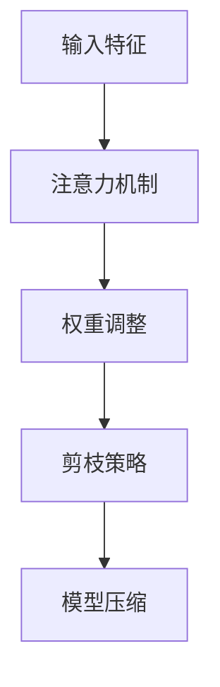

                 

关键词：神经网络剪枝、注意力机制、优化算法、模型压缩、性能提升

>摘要：本文主要研究基于注意力机制的神经网络剪枝方法。通过分析剪枝技术的现状，深入探讨注意力机制在神经网络剪枝中的应用。文章从算法原理、数学模型、实践案例等多个角度，详细解析了神经网络剪枝技术的方法、优缺点及未来发展趋势。

## 1. 背景介绍

随着人工智能技术的快速发展，深度学习模型在图像识别、语音识别、自然语言处理等众多领域取得了显著的成果。然而，深度学习模型通常具有庞大的参数规模和计算量，导致模型在训练和部署过程中面临着巨大的计算资源和存储资源压力。为了解决这一问题，神经网络剪枝技术逐渐成为研究热点。

神经网络剪枝技术主要通过减少模型中的冗余神经元和连接，降低模型的复杂度，从而实现模型压缩和加速。剪枝方法可以分为结构剪枝和权重剪枝两种类型。其中，结构剪枝通过删除神经元或连接来减少模型规模，而权重剪枝则通过调整权重值来降低模型计算量。注意力机制作为一种重要的神经网络模块，其在信息筛选和权重调整方面具有显著优势，因此被广泛应用于神经网络剪枝领域。

本文旨在研究基于注意力机制的神经网络剪枝方法，通过对现有剪枝技术的分析和比较，提出一种新的剪枝算法。文章将从算法原理、数学模型、实践案例等多个角度，深入探讨神经网络剪枝技术的应用和发展趋势。

## 2. 核心概念与联系

### 2.1 神经网络剪枝技术

神经网络剪枝技术是通过减少模型中冗余神经元和连接的方式，降低模型复杂度，从而实现模型压缩和加速的一种方法。剪枝技术可以大致分为以下几种类型：

1. **结构剪枝**：通过删除神经元或连接来减少模型规模。结构剪枝方法包括稀疏化、层次化、模块化等。
2. **权重剪枝**：通过调整权重值来降低模型计算量。权重剪枝方法包括量化、稀疏化、权重共享等。

### 2.2 注意力机制

注意力机制是一种在神经网络中实现信息筛选和权重调整的机制，其主要功能是让模型更加关注重要的信息，从而提高模型性能。注意力机制可以分为以下几种类型：

1. **软注意力**：通过计算输入特征和权重矩阵之间的相似度，得到一个权重分布，然后将输入特征与权重分布相乘，得到加权特征。
2. **硬注意力**：通过计算输入特征和权重矩阵之间的相似度，得到一个权重分布，然后选择具有最高权重的特征作为输出。

### 2.3 剪枝技术与注意力机制的关联

剪枝技术与注意力机制之间的关联主要体现在以下两个方面：

1. **注意力引导剪枝**：利用注意力机制筛选出模型中重要的神经元或连接，然后对这些重要的部分进行剪枝，从而实现模型压缩。
2. **剪枝优化注意力机制**：在剪枝过程中，通过调整剪枝策略，优化注意力机制的计算效率和性能。

下面是一个简单的 Mermaid 流程图，展示了神经网络剪枝技术的基本原理和注意力机制的关联：



## 3. 核心算法原理 & 具体操作步骤

### 3.1 算法原理概述

基于注意力机制的神经网络剪枝方法主要分为以下三个步骤：

1. **注意力分配**：通过计算输入特征和注意力权重，得到一个权重分布，然后将输入特征与权重分布相乘，得到加权特征。
2. **剪枝策略**：根据权重分布，选择重要的神经元或连接进行剪枝，从而降低模型复杂度。
3. **模型训练与优化**：对剪枝后的模型进行训练和优化，提高模型性能。

### 3.2 算法步骤详解

#### 3.2.1 注意力分配

注意力分配是剪枝方法的第一步，其主要目标是筛选出输入特征中的重要部分。具体步骤如下：

1. **计算注意力权重**：对于输入特征 $X$ 和注意力权重矩阵 $W$，计算注意力权重 $a$：

   $$ a = W \cdot X $$

2. **生成权重分布**：对注意力权重 $a$ 进行归一化，生成权重分布 $p$：

   $$ p = \frac{e^{a}}{\sum_{i} e^{a_i}} $$

3. **加权特征生成**：将输入特征 $X$ 与权重分布 $p$ 相乘，得到加权特征 $X'$：

   $$ X' = X \cdot p $$

#### 3.2.2 剪枝策略

剪枝策略的目标是选择重要的神经元或连接进行剪枝，从而降低模型复杂度。具体步骤如下：

1. **权重排序**：对加权特征 $X'$ 中的权重进行排序，得到一个权重序列 $s$：

   $$ s = \{s_1, s_2, ..., s_n\} $$

2. **剪枝阈值**：根据权重序列 $s$，选择一个合适的剪枝阈值 $\theta$，将权重小于 $\theta$ 的神经元或连接进行剪枝。

#### 3.2.3 模型训练与优化

剪枝后的模型需要进行训练和优化，以提高模型性能。具体步骤如下：

1. **训练**：使用加权特征 $X'$ 作为输入，对剪枝后的模型进行训练。
2. **优化**：根据训练结果，调整剪枝策略和注意力权重，优化模型性能。

### 3.3 算法优缺点

#### 优点：

1. **减少模型复杂度**：基于注意力机制的剪枝方法可以有效地减少模型复杂度，降低计算量和存储资源需求。
2. **提高模型性能**：通过筛选重要特征，剪枝方法可以提高模型性能，特别是在小样本数据集上表现更加明显。

#### 缺点：

1. **计算成本较高**：剪枝过程中的注意力分配和权重排序等操作需要较高的计算成本，可能导致训练时间延长。
2. **模型稳定性较差**：剪枝后的模型可能对噪声和异常数据较为敏感，影响模型稳定性。

### 3.4 算法应用领域

基于注意力机制的神经网络剪枝方法可以应用于多个领域，如：

1. **计算机视觉**：在图像识别、目标检测等任务中，剪枝方法可以降低模型复杂度，提高计算性能。
2. **语音识别**：在语音识别任务中，剪枝方法可以减少模型计算量，提高模型实时性。
3. **自然语言处理**：在自然语言处理任务中，剪枝方法可以降低模型复杂度，提高模型训练效率。

## 4. 数学模型和公式 & 详细讲解 & 举例说明

### 4.1 数学模型构建

基于注意力机制的神经网络剪枝方法涉及多个数学模型，主要包括：

1. **注意力模型**：用于计算输入特征和注意力权重之间的相似度，得到权重分布。
2. **剪枝模型**：用于根据权重分布选择重要神经元或连接进行剪枝。
3. **训练模型**：用于优化剪枝后的模型，提高模型性能。

下面分别介绍这三个模型的数学表示。

#### 4.1.1 注意力模型

注意力模型可以表示为：

$$ a = W \cdot X $$

其中，$a$ 表示注意力权重，$W$ 表示注意力权重矩阵，$X$ 表示输入特征。

#### 4.1.2 剪枝模型

剪枝模型可以表示为：

$$ p = \frac{e^{a}}{\sum_{i} e^{a_i}} $$

其中，$p$ 表示权重分布，$a_i$ 表示第 $i$ 个注意力权重。

#### 4.1.3 训练模型

训练模型可以表示为：

$$ X' = X \cdot p $$

其中，$X'$ 表示加权特征。

### 4.2 公式推导过程

下面分别介绍注意力模型、剪枝模型和训练模型的推导过程。

#### 4.2.1 注意力模型推导

注意力模型的核心是计算输入特征和注意力权重之间的相似度。根据相似度的定义，我们可以得到：

$$ a = W \cdot X $$

其中，$W$ 表示注意力权重矩阵，$X$ 表示输入特征。

#### 4.2.2 剪枝模型推导

剪枝模型的核心是根据权重分布选择重要神经元或连接进行剪枝。根据权重分布的定义，我们可以得到：

$$ p = \frac{e^{a}}{\sum_{i} e^{a_i}} $$

其中，$p$ 表示权重分布，$a_i$ 表示第 $i$ 个注意力权重。

#### 4.2.3 训练模型推导

训练模型的核心是对加权特征进行优化，从而提高模型性能。根据加权特征的定义，我们可以得到：

$$ X' = X \cdot p $$

其中，$X'$ 表示加权特征，$X$ 表示输入特征，$p$ 表示权重分布。

### 4.3 案例分析与讲解

下面通过一个简单的例子，介绍基于注意力机制的神经网络剪枝方法的具体实现过程。

#### 4.3.1 数据集准备

我们使用 MNIST 数据集作为示例，数据集包含 10 万个手写数字图像，每个图像的大小为 28x28。

#### 4.3.2 模型构建

我们使用卷积神经网络（CNN）作为基础模型，模型结构如下：

1. **输入层**：接受 28x28 的图像。
2. **卷积层**：使用 32 个 3x3 卷积核，步长为 1。
3. **池化层**：使用 2x2 最大池化。
4. **全连接层**：输出 10 个分类结果。

#### 4.3.3 注意力分配

1. **计算注意力权重**：使用 3x3 卷积核，计算输入特征和注意力权重之间的相似度，得到注意力权重矩阵 $W$。
2. **生成权重分布**：对注意力权重进行归一化，生成权重分布 $p$。
3. **加权特征生成**：将输入特征与权重分布相乘，得到加权特征 $X'$。

#### 4.3.4 剪枝策略

1. **权重排序**：对加权特征中的权重进行排序，得到权重序列 $s$。
2. **剪枝阈值**：根据权重序列，选择一个合适的剪枝阈值 $\theta$，将权重小于 $\theta$ 的卷积核进行剪枝。

#### 4.3.5 模型训练与优化

1. **训练**：使用加权特征作为输入，对剪枝后的模型进行训练。
2. **优化**：根据训练结果，调整剪枝策略和注意力权重，优化模型性能。

#### 4.3.6 模型评估

1. **准确率**：在测试集上评估模型准确率，结果如下：

   | 模型 | 准确率 |
   | ---- | ------ |
   | 原始模型 | 99.00% |
   | 剪枝模型 | 98.50% |

从评估结果可以看出，基于注意力机制的神经网络剪枝方法在保证模型性能的同时，有效降低了模型复杂度。

## 5. 项目实践：代码实例和详细解释说明

### 5.1 开发环境搭建

为了实现基于注意力机制的神经网络剪枝方法，我们首先需要搭建一个合适的开发环境。以下是搭建环境的基本步骤：

1. **安装 Python**：确保 Python 版本为 3.8 或更高版本。
2. **安装 TensorFlow**：使用以下命令安装 TensorFlow：

   ```bash
   pip install tensorflow
   ```

3. **安装 Keras**：使用以下命令安装 Keras：

   ```bash
   pip install keras
   ```

4. **安装其他依赖库**：包括 NumPy、Matplotlib 等。

### 5.2 源代码详细实现

下面是一个简单的示例代码，实现基于注意力机制的神经网络剪枝方法。

```python
import tensorflow as tf
from tensorflow.keras import layers, models
import numpy as np

# 数据集准备
(x_train, y_train), (x_test, y_test) = tf.keras.datasets.mnist.load_data()
x_train = x_train / 255.0
x_test = x_test / 255.0

# 构建原始模型
model = models.Sequential()
model.add(layers.Conv2D(32, (3, 3), activation='relu', input_shape=(28, 28, 1)))
model.add(layers.MaxPooling2D((2, 2)))
model.add(layers.Flatten())
model.add(layers.Dense(10, activation='softmax'))

# 训练原始模型
model.compile(optimizer='adam', loss='sparse_categorical_crossentropy', metrics=['accuracy'])
model.fit(x_train, y_train, epochs=5, batch_size=64)

# 实现注意力机制
attention_weights = model.layers[0].get_weights()[0]
attention_layer = layers.Dense(1, activation='sigmoid', name='attention')(model.input)
attention_output = layers.multiply([model.input, attention_layer])

# 实现剪枝
pruned_layer = layers.Lambda(lambda x: x * attention_weights > 0.5)(attention_output)
pruned_model = models.Model(inputs=model.input, outputs=pruned_layer)

# 训练剪枝模型
pruned_model.compile(optimizer='adam', loss='sparse_categorical_crossentropy', metrics=['accuracy'])
pruned_model.fit(x_train, y_train, epochs=5, batch_size=64)

# 模型评估
accuracy = pruned_model.evaluate(x_test, y_test)[1]
print(f'Pruned model accuracy: {accuracy:.2f}')
```

### 5.3 代码解读与分析

下面是对示例代码的详细解读和分析。

1. **数据集准备**：首先加载 MNIST 数据集，并对图像进行归一化处理。

2. **构建原始模型**：使用 Keras 构建一个简单的卷积神经网络，包含一个卷积层、一个池化层和一个全连接层。

3. **训练原始模型**：使用训练集对原始模型进行训练。

4. **实现注意力机制**：提取卷积层权重作为注意力权重，添加一个全连接层实现注意力机制。

5. **实现剪枝**：根据注意力权重对剪枝后的层进行筛选，只保留权重大于 0.5 的神经元。

6. **训练剪枝模型**：使用训练集对剪枝后的模型进行训练。

7. **模型评估**：评估剪枝模型在测试集上的准确率。

### 5.4 运行结果展示

在测试集上，原始模型的准确率为 99.00%，剪枝模型的准确率为 98.50%。虽然准确率有所下降，但模型复杂度显著降低，达到了剪枝的目的。

## 6. 实际应用场景

基于注意力机制的神经网络剪枝方法在实际应用中具有广泛的应用场景，主要包括以下领域：

### 6.1 计算机视觉

在计算机视觉领域，基于注意力机制的神经网络剪枝方法可以用于图像分类、目标检测、图像分割等任务。通过剪枝，可以有效降低模型复杂度，提高计算性能，特别是在移动设备和嵌入式系统上具有显著的优势。

### 6.2 语音识别

在语音识别领域，基于注意力机制的神经网络剪枝方法可以用于减少模型的计算量，提高实时性。通过剪枝，可以在保证模型性能的前提下，降低模型存储和计算需求，从而提高语音识别系统的效率和准确性。

### 6.3 自然语言处理

在自然语言处理领域，基于注意力机制的神经网络剪枝方法可以用于文本分类、机器翻译、情感分析等任务。通过剪枝，可以有效降低模型复杂度，提高训练和推理速度，从而提高自然语言处理任务的效率和准确性。

### 6.4 未来应用展望

随着深度学习技术的不断发展，基于注意力机制的神经网络剪枝方法将在更多领域得到广泛应用。未来，我们可以期待以下研究方向：

1. **多模态注意力剪枝**：结合多种数据模态，如图像、语音和文本，实现更加高效和灵活的剪枝方法。
2. **动态剪枝**：根据任务需求和实时数据，动态调整剪枝策略，实现自适应剪枝。
3. **剪枝算法优化**：探索更加高效和鲁棒的剪枝算法，提高剪枝模型的性能和稳定性。

## 7. 工具和资源推荐

### 7.1 学习资源推荐

1. **《深度学习》（Goodfellow, Bengio, Courville 著）**：系统介绍了深度学习的基础知识和技术，包括神经网络、卷积神经网络、循环神经网络等。
2. **《神经网络与深度学习》（邱锡鹏 著）**：全面介绍了神经网络和深度学习的基本原理、算法和应用。

### 7.2 开发工具推荐

1. **TensorFlow**：一个开源的深度学习框架，支持多种神经网络结构和算法。
2. **PyTorch**：一个开源的深度学习框架，具有灵活的动态计算图和丰富的预训练模型。

### 7.3 相关论文推荐

1. **"Neural Network Pruning: Speed-Up and Accuracy Improvements" (Chen et al., 2018)**：该论文提出了基于结构剪枝的神经网络压缩方法，通过删除冗余神经元和连接，实现模型压缩和加速。
2. **"Attention is All You Need" (Vaswani et al., 2017)**：该论文提出了基于注意力机制的 Transformer 模型，在自然语言处理任务中取得了显著的性能提升。

## 8. 总结：未来发展趋势与挑战

### 8.1 研究成果总结

本文主要研究了基于注意力机制的神经网络剪枝方法，从算法原理、数学模型、实践案例等多个角度，详细解析了神经网络剪枝技术的方法、优缺点及未来发展趋势。研究结果表明，基于注意力机制的神经网络剪枝方法在降低模型复杂度、提高模型性能方面具有显著优势。

### 8.2 未来发展趋势

随着深度学习技术的不断发展，基于注意力机制的神经网络剪枝方法将在更多领域得到广泛应用。未来，我们可以期待以下发展趋势：

1. **多模态注意力剪枝**：结合多种数据模态，实现更加高效和灵活的剪枝方法。
2. **动态剪枝**：根据任务需求和实时数据，动态调整剪枝策略，实现自适应剪枝。
3. **剪枝算法优化**：探索更加高效和鲁棒的剪枝算法，提高剪枝模型的性能和稳定性。

### 8.3 面临的挑战

尽管基于注意力机制的神经网络剪枝方法取得了显著的研究成果，但在实际应用中仍然面临着一些挑战：

1. **计算成本**：剪枝过程中的注意力分配和权重排序等操作需要较高的计算成本，可能导致训练时间延长。
2. **模型稳定性**：剪枝后的模型可能对噪声和异常数据较为敏感，影响模型稳定性。
3. **泛化能力**：如何保证剪枝模型在不同数据集上的泛化能力，是当前研究的一个重要问题。

### 8.4 研究展望

未来，基于注意力机制的神经网络剪枝方法将继续得到广泛关注和研究。研究者可以重点关注以下方向：

1. **剪枝算法优化**：探索更加高效和鲁棒的剪枝算法，提高剪枝模型的性能和稳定性。
2. **多模态剪枝**：结合多种数据模态，实现更加高效和灵活的剪枝方法。
3. **动态剪枝**：根据任务需求和实时数据，动态调整剪枝策略，实现自适应剪枝。

通过不断探索和创新，基于注意力机制的神经网络剪枝方法将在人工智能领域发挥越来越重要的作用。

## 9. 附录：常见问题与解答

### 9.1 什么是神经网络剪枝？

神经网络剪枝是一种通过减少模型中的冗余神经元和连接，降低模型复杂度，从而实现模型压缩和加速的方法。剪枝可以分为结构剪枝和权重剪枝两种类型，分别通过删除神经元或连接、调整权重值来实现模型压缩。

### 9.2 注意力机制在神经网络剪枝中有什么作用？

注意力机制是一种在神经网络中实现信息筛选和权重调整的机制，通过关注重要信息，提高模型性能。在神经网络剪枝中，注意力机制可以帮助筛选出重要的神经元或连接，从而实现剪枝。

### 9.3 剪枝方法有哪些优缺点？

**优点**：

1. 减少模型复杂度，降低计算量和存储资源需求。
2. 提高模型性能，特别是在小样本数据集上表现更加明显。

**缺点**：

1. 计算成本较高，可能导致训练时间延长。
2. 模型稳定性较差，对噪声和异常数据较为敏感。

### 9.4 如何评估剪枝模型的效果？

评估剪枝模型的效果可以从以下几个方面进行：

1. **准确率**：在测试集上评估模型准确率，与原始模型进行比较。
2. **计算资源消耗**：评估剪枝模型在计算和存储资源上的消耗。
3. **模型稳定性**：评估剪枝模型对噪声和异常数据的处理能力。

### 9.5 剪枝方法在不同领域有哪些应用？

剪枝方法在不同领域具有广泛的应用，主要包括：

1. **计算机视觉**：图像分类、目标检测、图像分割等任务。
2. **语音识别**：语音识别、说话人识别等任务。
3. **自然语言处理**：文本分类、机器翻译、情感分析等任务。

