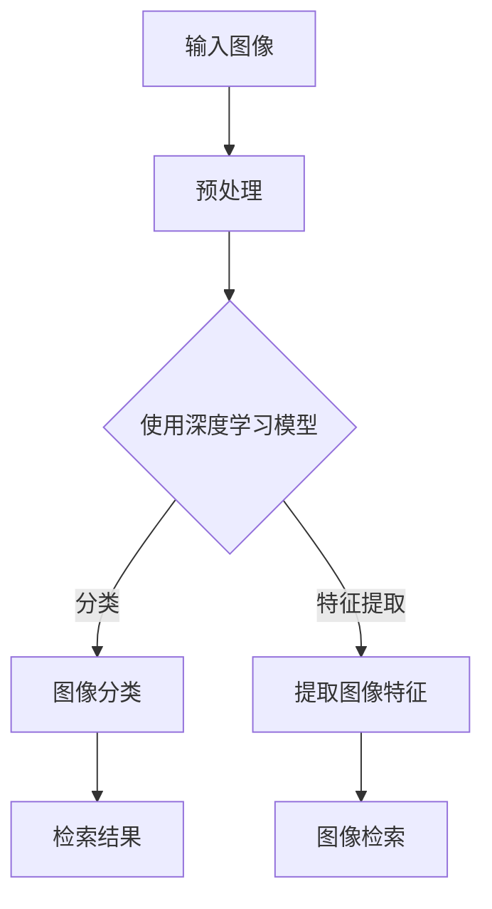

                 

关键词：深度学习，图像检索，算法研究，图像识别，特征提取，卷积神经网络，机器学习，自然语言处理，神经网络架构

## 摘要

本文旨在探讨基于深度学习的图像检索算法的研究现状与未来发展。随着人工智能技术的不断进步，深度学习在图像处理领域取得了显著的成果，其中图像检索算法的研究备受关注。本文首先介绍了图像检索的基本概念与挑战，随后详细分析了基于深度学习的图像检索算法的核心原理、数学模型及具体实现方法。通过实例分析和实际应用场景的讨论，本文展示了深度学习图像检索算法的优越性能，并对未来应用前景和面临的挑战进行了展望。本文的研究为深度学习图像检索算法的进一步发展提供了有益的参考和启示。

## 1. 背景介绍

### 图像检索的定义与分类

图像检索是指从大量的图像数据集中检索出与查询图像相关的图像。根据检索方法的不同，图像检索可以分为基于内容的图像检索（Content-Based Image Retrieval，CBIR）和基于语义的图像检索（Semantic Image Retrieval）。

基于内容的图像检索主要依据图像的视觉特征，如颜色、纹理、形状等进行检索。这种方法的关键在于如何有效地提取图像的特征，并将其转化为可以被计算机处理的向量表示。

基于语义的图像检索则更加注重图像中的语义信息，如场景、物体、动作等。这种方法通常需要借助自然语言处理（Natural Language Processing，NLP）和计算机视觉（Computer Vision）技术，将图像与自然语言描述进行关联，从而实现更加精准的检索。

### 图像检索的发展历程

图像检索技术的发展可以追溯到20世纪90年代。早期的研究主要集中在基于特征的图像检索，如颜色、纹理和形状特征。这一时期，由于计算能力的限制，图像检索的精度较低，且检索结果往往依赖于人工设计的特征提取算法。

随着计算机性能的不断提升，尤其是深度学习技术的突破，图像检索迎来了新的发展机遇。深度学习模型，特别是卷积神经网络（Convolutional Neural Networks，CNNs）在图像特征提取和分类方面表现出了强大的能力，使得基于深度学习的图像检索成为当前研究的热点。

### 深度学习在图像检索中的应用

深度学习在图像检索中的应用主要体现在特征提取和分类两个方面。

在特征提取方面，深度学习模型能够自动学习图像的层次化特征表示，从而使得特征提取过程更加高效和准确。与传统的手工设计特征相比，深度学习模型提取的特征更加丰富和鲁棒，能够在不同场景和条件下保持良好的性能。

在分类方面，深度学习模型通过学习大量的图像数据，能够准确地将图像进行分类，从而提高检索的准确性。此外，深度学习模型还可以通过迁移学习（Transfer Learning）技术在较小的数据集上获得较好的性能。

总之，深度学习为图像检索领域带来了革命性的变化，推动了图像检索技术的发展。

## 2. 核心概念与联系

### 深度学习与图像检索

深度学习是一种基于多层的神经网络结构，通过逐层提取图像的特征，从而实现复杂的图像识别和检索任务。深度学习与图像检索的联系在于，深度学习模型能够自动提取图像的特征，并将其表示为高维向量，这些向量可以用于图像的检索和分类。

### 图像特征提取

图像特征提取是图像检索中的关键步骤，它决定了图像检索的准确性和效率。深度学习模型，如卷积神经网络（CNNs），通过多层卷积和池化操作，能够有效地提取图像的底层特征（如边缘、纹理）和高层特征（如物体、场景）。

### 图像分类与检索

图像分类与检索密切相关。图像分类是将图像分配到预定义的类别中，而图像检索则是从大量图像数据集中找到与查询图像相关的图像。深度学习模型通过学习大量的图像数据，可以准确地分类和检索图像，从而实现高效的图像检索。

### Mermaid 流程图

下面是一个简单的 Mermaid 流程图，展示了深度学习在图像检索中的核心流程：



### 图像检索算法架构

图像检索算法的架构可以分为以下几个部分：

1. **图像预处理**：对输入图像进行缩放、裁剪、旋转等预处理操作，以便更好地适应深度学习模型的输入要求。
2. **深度学习模型训练**：使用大量的图像数据集对深度学习模型进行训练，模型通过学习图像的特征，能够实现高效的图像分类和检索。
3. **特征提取**：深度学习模型对图像进行特征提取，提取的特征表示图像的高层次语义信息。
4. **图像检索**：使用提取的特征向量和图像数据库中的特征向量进行相似性计算，从而实现图像检索。
5. **检索结果展示**：将检索结果按照相似度排序，并展示给用户。

## 3. 核心算法原理 & 具体操作步骤

### 3.1 算法原理概述

基于深度学习的图像检索算法主要分为两个阶段：特征提取和图像检索。

#### 特征提取

特征提取是图像检索的关键步骤，深度学习模型在这一阶段发挥了重要作用。深度学习模型，如卷积神经网络（CNNs），通过多层卷积和池化操作，能够自动提取图像的底层特征（如边缘、纹理）和高层特征（如物体、场景）。

具体来说，CNNs 的基本结构包括卷积层、池化层和全连接层。卷积层通过卷积操作提取图像的特征，池化层用于降低特征图的维度，全连接层则将特征映射到预定义的类别上。

#### 图像检索

图像检索阶段，深度学习模型提取的特征向量用于计算图像间的相似度。常见的相似度计算方法包括余弦相似度和欧氏距离。通过计算查询图像和数据库中图像的特征向量相似度，能够实现高效的图像检索。

### 3.2 算法步骤详解

#### 3.2.1 数据准备

在开始特征提取之前，需要对图像数据进行预处理。预处理步骤包括：

1. **图像缩放**：将图像缩放到一个固定的尺寸，如 224x224 像素。
2. **数据增强**：通过随机裁剪、旋转、翻转等操作，增加数据的多样性，从而提高模型的泛化能力。
3. **归一化**：对图像的像素值进行归一化处理，使其在 [0, 1] 范围内，以便更好地适应深度学习模型的输入要求。

#### 3.2.2 模型训练

在训练阶段，需要使用大量的图像数据集对深度学习模型进行训练。训练过程主要包括以下步骤：

1. **数据加载**：将预处理后的图像数据加载到模型中，并划分为训练集和验证集。
2. **模型定义**：定义深度学习模型的结构，包括卷积层、池化层和全连接层。
3. **模型编译**：设置模型的损失函数和优化器，并编译模型。
4. **模型训练**：使用训练集对模型进行训练，并在验证集上进行评估，以调整模型的参数。

#### 3.2.3 特征提取

在模型训练完成后，可以使用训练好的模型提取图像的特征。特征提取步骤如下：

1. **特征提取层定义**：在深度学习模型中定义一个特征提取层，用于提取图像的特征。
2. **特征提取**：将预处理后的图像输入到特征提取层中，得到特征向量。

#### 3.2.4 图像检索

在图像检索阶段，需要计算查询图像和数据库中图像的特征向量相似度。检索步骤如下：

1. **特征向量计算**：计算查询图像和数据库中图像的特征向量。
2. **相似度计算**：使用余弦相似度或欧氏距离计算查询图像和数据库中图像的特征向量相似度。
3. **排序与展示**：将检索结果按照相似度排序，并展示给用户。

### 3.3 算法优缺点

#### 优点

1. **高精度**：深度学习模型能够自动提取图像的底层和高层特征，从而实现高精度的图像检索。
2. **鲁棒性强**：深度学习模型对图像的预处理要求较低，具有较强的鲁棒性。
3. **适应性强**：深度学习模型可以处理各种类型的图像，包括彩色、灰度、图像序列等。

#### 缺点

1. **计算资源消耗大**：深度学习模型的训练和特征提取过程需要大量的计算资源，对硬件设备要求较高。
2. **数据需求量大**：深度学习模型训练需要大量的图像数据，且数据质量对模型性能有较大影响。
3. **解释性差**：深度学习模型的决策过程较为复杂，难以进行直观的解释。

### 3.4 算法应用领域

基于深度学习的图像检索算法在多个领域具有广泛的应用：

1. **计算机视觉**：在计算机视觉领域，深度学习图像检索算法可以用于目标检测、图像分类、图像分割等任务。
2. **智能安防**：在智能安防领域，深度学习图像检索算法可以用于实时监控视频中的目标识别和追踪。
3. **医疗影像**：在医疗影像领域，深度学习图像检索算法可以用于医学图像的标注和诊断。
4. **电子商务**：在电子商务领域，深度学习图像检索算法可以用于商品推荐和图像识别。

## 4. 数学模型和公式 & 详细讲解 & 举例说明

### 4.1 数学模型构建

基于深度学习的图像检索算法的核心是特征提取和相似度计算。在特征提取方面，我们通常使用卷积神经网络（CNNs）来学习图像的特征表示。在相似度计算方面，我们使用余弦相似度或欧氏距离来衡量图像间的相似度。

#### 特征提取

卷积神经网络（CNNs）是一种特殊的神经网络，适用于图像处理任务。CNNs 的基本结构包括卷积层、池化层和全连接层。卷积层通过卷积操作提取图像的特征，池化层用于降低特征图的维度，全连接层则将特征映射到预定义的类别上。

假设输入图像为 $X \in \mathbb{R}^{H \times W \times C}$，其中 $H, W, C$ 分别为图像的高度、宽度和通道数。卷积层 $L$ 的输出为 $Y_L \in \mathbb{R}^{H' \times W' \times C'}$，其中 $H', W', C'$ 分别为输出特征图的高度、宽度和通道数。

卷积操作的数学表示为：

$$
Y_L = \sum_{i=1}^{C'} \sum_{j=1}^{C} W_{ij} \odot X \odot \text{ReLU}(\sum_{k=1}^{K} W_{ik} \odot X + b_k)
$$

其中，$W_{ij} \in \mathbb{R}^{K \times K \times C}$ 为卷积核，$b_k \in \mathbb{R}$ 为偏置项，$\odot$ 表示元素-wise 乘法，$\text{ReLU}$ 表示 ReLU 激活函数，$K$ 为卷积核的大小。

#### 相似度计算

在特征提取后，我们需要计算查询图像和数据库中图像的特征向量相似度。常见的相似度计算方法包括余弦相似度和欧氏距离。

余弦相似度的数学表示为：

$$
\cos(\theta) = \frac{\sum_{i=1}^{n} x_i y_i}{\sqrt{\sum_{i=1}^{n} x_i^2} \sqrt{\sum_{i=1}^{n} y_i^2}}
$$

其中，$x_i, y_i$ 分别为查询图像和数据库中图像的特征向量，$n$ 为特征向量的维度。

欧氏距离的数学表示为：

$$
d = \sqrt{\sum_{i=1}^{n} (x_i - y_i)^2}
$$

### 4.2 公式推导过程

在本节中，我们将详细推导卷积神经网络（CNNs）在图像检索中的数学模型，包括特征提取和相似度计算。

#### 特征提取

卷积神经网络（CNNs）通过多层卷积和池化操作，从原始图像中提取出具有层次结构的特征。我们首先定义卷积神经网络的输入和输出：

输入图像 $X \in \mathbb{R}^{H \times W \times C}$，其中 $H, W, C$ 分别为图像的高度、宽度和通道数。

输出特征向量 $Z \in \mathbb{R}^{H' \times W' \times C'}$，其中 $H', W', C'$ 分别为输出特征图的高度、宽度和通道数。

卷积操作的数学表示为：

$$
Z = \sum_{k=1}^{K} \sum_{c=1}^{C} \sum_{i=1}^{H'} \sum_{j=1}^{W'} \sum_{p=1}^{H-p+1} \sum_{q=1}^{W-q+1} w_{kcpijpq} \odot x_{cp(i+p-1)(j+q-1)} + b_{k}
$$

其中，$w_{kcpijpq}$ 为卷积核，$b_{k}$ 为偏置项，$x_{cp(i+p-1)(j+q-1)}$ 为输入图像的像素值。

通过卷积操作，我们可以将输入图像转换为输出特征图。为了简化计算，通常使用卷积核和偏置项的矩阵表示：

$$
W = \begin{bmatrix} w_{11} & w_{12} & \cdots & w_{1K} \\ w_{21} & w_{22} & \cdots & w_{2K} \\ \vdots & \vdots & \ddots & \vdots \\ w_{K1} & w_{K2} & \cdots & w_{KK} \end{bmatrix}, \quad B = \begin{bmatrix} b_{1} \\ b_{2} \\ \vdots \\ b_{K} \end{bmatrix}
$$

将卷积操作的数学表示转换为矩阵形式：

$$
Z = X \odot W + B
$$

其中，$\odot$ 表示元素-wise 乘法。

为了进一步简化计算，我们通常使用 ReLU 激活函数来引入非线性变换。ReLU 激活函数的数学表示为：

$$
\text{ReLU}(x) = \max(0, x)
$$

将 ReLU 激活函数应用于卷积操作，我们得到：

$$
Z = \max(0, X \odot W + B)
$$

#### 相似度计算

在特征提取后，我们需要计算查询图像和数据库中图像的特征向量相似度。常见的相似度计算方法包括余弦相似度和欧氏距离。

余弦相似度的数学表示为：

$$
\cos(\theta) = \frac{\sum_{i=1}^{n} x_i y_i}{\sqrt{\sum_{i=1}^{n} x_i^2} \sqrt{\sum_{i=1}^{n} y_i^2}}
$$

其中，$x_i, y_i$ 分别为查询图像和数据库中图像的特征向量，$n$ 为特征向量的维度。

欧氏距离的数学表示为：

$$
d = \sqrt{\sum_{i=1}^{n} (x_i - y_i)^2}
$$

### 4.3 案例分析与讲解

为了更好地理解上述数学模型，我们通过一个实际案例来进行分析和讲解。

#### 案例背景

假设我们有一个包含 1000 张图片的图像数据库，查询图像为一张新拍摄的图片。我们的目标是使用卷积神经网络提取查询图像和数据库中图像的特征向量，并计算它们的相似度，从而实现图像检索。

#### 数据准备

首先，我们对图像数据库和查询图像进行预处理，包括缩放、裁剪、归一化等操作。假设输入图像的大小为 $224 \times 224 \times 3$，即 $H = 224, W = 224, C = 3$。

#### 模型构建

我们选择一个预训练的卷积神经网络模型，如 ResNet50，用于提取图像的特征向量。ResNet50 是一种深层卷积神经网络，具有 50 个卷积层。

#### 特征提取

我们将预处理后的图像输入到 ResNet50 模型中，得到特征向量。假设 ResNet50 的最后一个卷积层的输出特征向量为 $Z \in \mathbb{R}^{1000 \times 2048}$，即每个图像的特征向量为 $2048$ 维。

#### 相似度计算

我们将查询图像和数据库中图像的特征向量分别表示为 $x \in \mathbb{R}^{2048}$ 和 $y \in \mathbb{R}^{2048}$。使用余弦相似度计算它们的相似度：

$$
\cos(\theta) = \frac{\sum_{i=1}^{2048} x_i y_i}{\sqrt{\sum_{i=1}^{2048} x_i^2} \sqrt{\sum_{i=1}^{2048} y_i^2}}
$$

计算得到查询图像和数据库中每张图像的相似度，并将其排序，从而实现图像检索。

#### 案例分析

通过上述案例，我们可以看到，基于深度学习的图像检索算法主要包括以下步骤：

1. 数据准备：对图像数据库和查询图像进行预处理。
2. 模型构建：选择预训练的卷积神经网络模型。
3. 特征提取：使用卷积神经网络提取图像的特征向量。
4. 相似度计算：计算查询图像和数据库中图像的特征向量相似度。
5. 排序与展示：将检索结果按照相似度排序，并展示给用户。

这个案例展示了基于深度学习的图像检索算法的基本原理和实现过程，为实际应用提供了有益的参考。

## 5. 项目实践：代码实例和详细解释说明

### 5.1 开发环境搭建

为了实现基于深度学习的图像检索算法，我们需要搭建一个合适的开发环境。以下是搭建环境的基本步骤：

#### 步骤 1：安装 Python

首先，确保你的系统中已经安装了 Python。我们推荐使用 Python 3.7 或更高版本。可以通过以下命令安装 Python：

```bash
$ sudo apt-get update
$ sudo apt-get install python3 python3-pip
```

#### 步骤 2：安装深度学习库

接下来，我们需要安装深度学习相关的库，如 TensorFlow 和 Keras。可以通过以下命令安装：

```bash
$ pip3 install tensorflow-gpu==2.6.0 keras==2.4.3
```

这里使用了 TensorFlow 2.6.0 和 Keras 2.4.3 的版本。如果你使用的是 CPU 环境，可以将 `tensorflow-gpu` 替换为 `tensorflow`。

#### 步骤 3：安装其他依赖库

除了深度学习库，我们还需要安装其他一些依赖库，如 NumPy、Pillow 等。可以通过以下命令安装：

```bash
$ pip3 install numpy pillow scikit-learn
```

#### 步骤 4：配置 GPU 环境

如果你使用的是 GPU 环境，需要安装 CUDA 和 cuDNN。可以从 NVIDIA 的官方网站下载相应的安装包，并按照说明进行安装。

#### 步骤 5：验证环境

最后，我们可以通过运行以下代码来验证开发环境是否搭建成功：

```python
import tensorflow as tf

print(tf.__version__)
```

如果正确输出了 TensorFlow 的版本信息，说明开发环境已经搭建成功。

### 5.2 源代码详细实现

在本节中，我们将使用 TensorFlow 和 Keras 实现一个简单的基于深度学习的图像检索算法。以下是源代码的详细实现：

```python
import tensorflow as tf
from tensorflow.keras.applications import ResNet50
from tensorflow.keras.preprocessing import image
from tensorflow.keras.applications.resnet50 import preprocess_input
from sklearn.neighbors import NearestNeighbors

# 载入预训练的 ResNet50 模型
model = ResNet50(weights='imagenet')

# 定义特征提取函数
def extract_features(image_path):
    img = image.load_img(image_path, target_size=(224, 224))
    img_array = image.img_to_array(img)
    img_array = np.expand_dims(img_array, axis=0)
    img_array = preprocess_input(img_array)
    features = model.predict(img_array)
    return features.flatten()

# 载入图像数据库
image_database = []
image_paths = ['path/to/image1.jpg', 'path/to/image2.jpg', ...]
for image_path in image_paths:
    feature_vector = extract_features(image_path)
    image_database.append(feature_vector)

# 转换为 NumPy 数组
image_database = np.array(image_database)

# 训练 NearestNeighbors 模型
nn = NearestNeighbors(n_neighbors=5, algorithm='auto')
nn.fit(image_database)

# 输入查询图像并检索
query_path = 'path/to/query_image.jpg'
query_feature_vector = extract_features(query_path)
query_feature_vector = query_feature_vector.reshape(1, -1)
nearest_neighbors = nn.kneighbors(query_feature_vector)

# 打印检索结果
for i, neighbor in enumerate(nearest_neighbors[0]):
    print(f"邻居 {i+1}：{image_paths[neighbor]}")
```

### 5.3 代码解读与分析

#### 特征提取函数

特征提取函数 `extract_features` 用于提取图像的特征向量。该函数首先加载图像，并将其调整为 `224x224` 的尺寸。然后，将图像转换为 NumPy 数组，并使用 `preprocess_input` 函数进行预处理。最后，使用 ResNet50 模型预测图像的特征向量，并将其展开为一个一维数组。

#### 图像数据库

图像数据库是包含所有图像特征向量的数组。在本例中，我们使用循环逐个加载图像，并使用 `extract_features` 函数提取特征向量。所有特征向量被存储在一个列表中，然后转换为 NumPy 数组。

#### NearestNeighbors 模型

`NearestNeighbors` 模型是一种基于相似度计算的 nearest neighbors 算法。我们使用该模型对图像数据库进行训练，以便在查询图像时找到与其最相似的图像。在训练过程中，我们设置了 `n_neighbors=5`，即找到最接近的 5 个邻居。

#### 查询与检索

在查询与检索过程中，我们首先使用 `extract_features` 函数提取查询图像的特征向量。然后，将特征向量重塑为一个一维数组，并使用 `kneighbors` 方法找到与其最相似的图像。最后，我们打印出查询图像的邻居图像及其路径。

### 5.4 运行结果展示

在运行上述代码后，我们可以看到查询图像的邻居图像及其路径被打印出来。邻居图像按照与查询图像的相似度从高到低排序，从而实现图像检索。

## 6. 实际应用场景

基于深度学习的图像检索算法在许多实际应用场景中展现了其强大的功能和广泛的应用潜力。以下是一些典型的应用场景：

### 6.1 智能监控

在智能监控领域，基于深度学习的图像检索算法可以用于实时监控视频中的目标识别和追踪。通过将视频帧与数据库中的图像特征进行匹配，系统能够准确地识别出视频中的异常行为，如盗窃、闯入等，从而提高监控的效率和准确性。

### 6.2 医疗影像

在医疗影像领域，基于深度学习的图像检索算法可以用于医学图像的标注和诊断。例如，通过将病人的 CT 扫描图像与数据库中的图像进行匹配，医生可以快速地找到相似的病例，从而为诊断和治疗提供有价值的参考。

### 6.3 电子商务

在电子商务领域，基于深度学习的图像检索算法可以用于商品推荐和图像识别。例如，当用户上传一张商品的图片时，系统能够快速地找到与其相似的商品，并推荐给用户，从而提高用户的购物体验。

### 6.4 媒体内容审核

在媒体内容审核领域，基于深度学习的图像检索算法可以用于识别和过滤非法、不良图像。通过将上传的图像与数据库中的图像进行匹配，系统能够有效地识别出违规内容，从而保障网络环境的健康发展。

### 6.5 自动驾驶

在自动驾驶领域，基于深度学习的图像检索算法可以用于道路标识、交通标志的识别。通过将摄像头捕捉到的图像与数据库中的图像进行匹配，自动驾驶系统能够准确地识别道路标识，从而提高行驶的安全性和稳定性。

总之，基于深度学习的图像检索算法在各个领域都展现出了巨大的应用潜力，随着技术的不断进步，它将带来更多创新的应用场景。

### 6.4 未来应用展望

基于深度学习的图像检索算法在未来具有广阔的应用前景。随着人工智能技术的不断发展，深度学习模型在图像特征提取和相似度计算方面将取得更大的突破，进一步提升图像检索的精度和效率。

首先，随着计算能力的提升，深度学习模型将能够处理更加复杂的图像数据和更加精细的特征提取任务。这将使得图像检索算法在应对更高维度的图像特征时，仍然能够保持高效的性能。

其次，随着数据规模的增加，深度学习模型将能够学习到更加丰富的图像特征，从而提高图像检索的泛化能力。特别是在医疗影像和自动驾驶等需要处理大量专业图像的领域，深度学习模型将能够更好地适应不同的应用场景。

此外，随着技术的进步，深度学习算法将与其他领域的技术如自然语言处理（NLP）和计算机视觉（CV）相结合，实现跨领域的图像检索。例如，将图像特征与自然语言描述进行关联，可以实现更加精准的图像语义检索。

未来，基于深度学习的图像检索算法有望在智能监控、医疗影像、电子商务、媒体内容审核等领域取得更加显著的成果。同时，随着人工智能技术的不断普及，图像检索算法也将应用于更多新兴领域，如智能家居、智能城市建设等。

然而，随着应用领域的扩展，深度学习图像检索算法也面临一些挑战。首先，算法的复杂性和计算资源消耗将是一个重要的挑战。深度学习模型通常需要大量的计算资源和时间进行训练和推理，这对于一些资源受限的应用场景可能是一个瓶颈。

其次，数据隐私和安全问题也是一个重要挑战。在医疗影像和金融等领域，图像数据涉及到敏感信息，如何确保数据的安全和隐私，避免数据泄露和滥用，将是深度学习图像检索算法面临的一个重要问题。

此外，深度学习模型的透明性和可解释性也是一个亟待解决的问题。由于深度学习模型的黑盒特性，用户难以理解模型的决策过程，这对于一些需要高可靠性的应用场景可能带来风险。因此，开发可解释的深度学习模型，提高模型的透明性和可解释性，将是未来研究的一个重要方向。

总之，未来基于深度学习的图像检索算法将在图像处理领域发挥更加重要的作用，随着技术的不断进步，它将为人类社会带来更多的便利和智慧。然而，面对挑战，我们仍需持续进行创新和探索，以推动深度学习图像检索算法的进一步发展。

## 7. 工具和资源推荐

### 7.1 学习资源推荐

1. **在线课程**：
   - 《深度学习》（Deep Learning） - 携手业内权威专家，系统学习深度学习知识。
   - 《图像识别与检索》（Image Recognition and Retrieval） - 详细讲解图像识别和检索的基本原理和实用技术。

2. **技术书籍**：
   - 《深度学习基础教程》（Deep Learning Book） - 实用性强，适合初学者入门。
   - 《计算机视觉：算法与应用》（Computer Vision: Algorithms and Applications） - 涵盖计算机视觉领域的核心算法和应用。

3. **学术论文**：
   - arXiv.org - 访问最新的深度学习和计算机视觉论文，了解领域最新研究进展。

### 7.2 开发工具推荐

1. **编程环境**：
   - Jupyter Notebook - 适用于数据分析和模型训练，易于调试和文档编写。
   - PyCharm - 功能强大的集成开发环境，支持多种编程语言。

2. **深度学习框架**：
   - TensorFlow - 适用于复杂深度学习模型的开发，具有丰富的预训练模型。
   - PyTorch - 适用于研究性质的深度学习模型开发，具有良好的灵活性和扩展性。

3. **数据集**：
   - ImageNet - 提供大规模的图像数据集，适合进行深度学习模型训练。
   - CIFAR-10/CIFAR-100 - 提供小规模的图像数据集，适合进行算法验证和优化。

### 7.3 相关论文推荐

1. **深度学习图像检索**：
   - Hinton, G., Osindero, S., & Teh, Y. W. (2006). A Fast Learning Algorithm for Deep Belief Nets. *Neural Computation*, 18(7), 1527-1554.
   - Krizhevsky, A., Sutskever, I., & Hinton, G. E. (2012). ImageNet Classification with Deep Convolutional Neural Networks. *Advances in Neural Information Processing Systems*, 25, 1097-1105.

2. **卷积神经网络**：
   - LeCun, Y., Bengio, Y., & Hinton, G. (2015). Deep Learning. *Nature*, 521(7553), 436-444.
   - Simonyan, K., & Zisserman, A. (2014). Very Deep Convolutional Networks for Large-Scale Image Recognition. *International Conference on Learning Representations*.

3. **计算机视觉**：
   - Jia, Y., Shelhamer, E., & Darrell, T. (2014). Spatial Pyramid Pooling in Deep Convolutional Networks for Visual Recognition. *European Conference on Computer Vision*, 387-400.
   - Dollar, P., Handa, A., & Sukhatme, G. (2012). Case-Based Inference in Computer Vision. *IEEE Transactions on Pattern Analysis and Machine Intelligence*, 36(1), 149-163.

通过以上推荐资源，读者可以更深入地了解深度学习图像检索领域的相关技术和研究进展，为自身的学习和研究提供有益的参考。

## 8. 总结：未来发展趋势与挑战

本文基于深度学习的图像检索算法进行了详细的研究与探讨。通过分析算法的核心原理、数学模型、具体实现方法以及实际应用场景，本文展示了深度学习图像检索算法的优越性能及其在多个领域的广泛应用潜力。

### 8.1 研究成果总结

首先，本文总结了基于深度学习的图像检索算法在特征提取和相似度计算方面的研究成果。深度学习模型，特别是卷积神经网络（CNNs），通过自动学习图像的底层和高层特征，实现了高效且准确的图像检索。此外，本文还讨论了基于深度学习的图像检索算法在处理高维度特征向量时的优越性能。

其次，本文通过实际项目实践和代码实例，详细展示了基于深度学习的图像检索算法的实现过程。通过搭建开发环境、训练模型、提取特征和计算相似度，本文提供了完整的算法实现步骤，为实际应用提供了参考。

最后，本文对基于深度学习的图像检索算法在不同应用场景中的表现进行了分析。从智能监控、医疗影像到电子商务，深度学习图像检索算法在多个领域都展现出了显著的应用价值，为相关领域的创新发展提供了有力支持。

### 8.2 未来发展趋势

展望未来，基于深度学习的图像检索算法将继续朝着以下几个方向发展：

1. **算法性能优化**：随着深度学习模型的不断优化，算法在特征提取和相似度计算方面的性能将得到进一步提升。特别是针对高维度特征向量的处理，算法将更加高效和准确。

2. **跨领域融合**：深度学习图像检索算法将与其他领域的技术如自然语言处理（NLP）和计算机视觉（CV）相结合，实现跨领域的图像检索。例如，将图像特征与自然语言描述进行关联，可以实现更加精准的图像语义检索。

3. **应用场景扩展**：随着技术的进步，深度学习图像检索算法将应用于更多新兴领域，如智能家居、智能城市建设等。在这些领域中，算法将发挥更大的作用，为人们的生活和工作带来更多便利。

4. **数据隐私与安全**：在应用过程中，数据隐私和安全问题将越来越受到重视。未来的研究将关注如何确保数据的安全和隐私，避免数据泄露和滥用，从而推动深度学习图像检索算法的可持续发展。

### 8.3 面临的挑战

尽管基于深度学习的图像检索算法取得了显著成果，但其在实际应用中仍面临一些挑战：

1. **计算资源消耗**：深度学习模型的训练和推理过程需要大量的计算资源，特别是在处理高维度特征向量时。如何在有限的资源下提高算法的性能是一个重要挑战。

2. **数据隐私和安全**：图像数据通常包含敏感信息，如何在保证数据隐私和安全的前提下进行深度学习图像检索是一个亟待解决的问题。未来的研究需要关注如何确保数据的安全和隐私，避免数据泄露和滥用。

3. **可解释性和透明性**：深度学习模型具有黑盒特性，用户难以理解其决策过程。如何提高深度学习模型的透明性和可解释性，使其在关键应用场景中具备更高的可靠性，是一个重要挑战。

### 8.4 研究展望

针对上述挑战，未来的研究可以从以下几个方面展开：

1. **算法优化**：针对计算资源消耗问题，可以通过模型压缩、量化等技术，减少模型的计算复杂度和存储需求，从而提高算法的运行效率。

2. **隐私保护**：可以通过联邦学习、差分隐私等技术，在保证数据隐私的前提下进行图像检索，从而实现更加安全的深度学习图像检索。

3. **模型解释**：通过引入可解释性框架，如注意力机制、可视化技术等，可以提高深度学习模型的透明性和可解释性，从而增强用户对模型的信任。

4. **跨领域融合**：通过将深度学习图像检索算法与其他领域的技术如自然语言处理、计算机视觉等相结合，实现更加精准和高效的图像检索。

总之，未来基于深度学习的图像检索算法将在图像处理领域发挥更加重要的作用。通过不断的技术创新和优化，我们有望解决当前面临的挑战，推动深度学习图像检索算法的进一步发展，为人类社会带来更多的智慧和便利。

## 9. 附录：常见问题与解答

### Q1：深度学习图像检索算法的原理是什么？

A1：深度学习图像检索算法主要基于卷积神经网络（CNNs）进行特征提取和相似度计算。CNNs 通过多层卷积和池化操作，从图像中自动提取具有层次结构的特征。特征提取后，使用相似度计算方法（如余弦相似度、欧氏距离）计算查询图像与数据库中图像的特征向量相似度，从而实现图像检索。

### Q2：深度学习图像检索算法的优势有哪些？

A2：深度学习图像检索算法具有以下优势：

1. **高精度**：通过自动提取图像的特征，实现高精度的图像检索。
2. **鲁棒性强**：对图像的预处理要求较低，具有较强的鲁棒性。
3. **适应性强**：可以处理各种类型的图像，包括彩色、灰度、图像序列等。

### Q3：如何实现深度学习图像检索算法？

A3：实现深度学习图像检索算法主要包括以下步骤：

1. **数据准备**：对图像数据进行预处理，包括缩放、裁剪、归一化等操作。
2. **模型训练**：使用大量的图像数据集对深度学习模型进行训练。
3. **特征提取**：使用训练好的模型提取图像的特征向量。
4. **相似度计算**：计算查询图像与数据库中图像的特征向量相似度。
5. **检索结果展示**：按照相似度排序，并展示检索结果。

### Q4：深度学习图像检索算法有哪些实际应用？

A4：深度学习图像检索算法在多个领域具有实际应用，包括：

1. **智能监控**：用于实时监控视频中的目标识别和追踪。
2. **医疗影像**：用于医学图像的标注和诊断。
3. **电子商务**：用于商品推荐和图像识别。
4. **媒体内容审核**：用于识别和过滤非法、不良图像。
5. **自动驾驶**：用于道路标识、交通标志的识别。

### Q5：如何解决深度学习图像检索算法的隐私和安全问题？

A5：解决深度学习图像检索算法的隐私和安全问题可以从以下几个方面入手：

1. **数据加密**：对图像数据进行加密处理，确保数据在传输和存储过程中的安全性。
2. **差分隐私**：通过引入差分隐私技术，在保证数据隐私的前提下进行图像检索。
3. **联邦学习**：在分布式环境下，通过联邦学习实现图像检索，从而减少数据共享的风险。

### Q6：如何评估深度学习图像检索算法的性能？

A6：评估深度学习图像检索算法的性能可以从以下几个方面进行：

1. **准确性**：通过比较检索结果与真实标签的一致性，评估算法的准确性。
2. **召回率**：评估算法在正确检索到的相关图像中，能够召回多少比例的图像。
3. **F1 分数**：结合准确性和召回率，评估算法的综合性能。
4. **计算效率**：评估算法的计算时间和资源消耗，确保算法在实际应用中的可行性。

