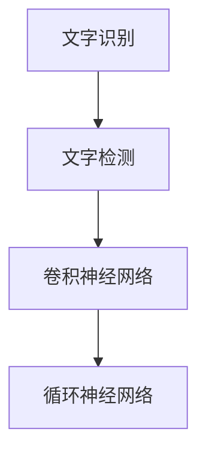

                 

关键词：文字识别、深度学习、图像处理、OCR、计算机视觉

## 摘要

随着计算机视觉和深度学习技术的发展，文字识别与检测已经成为图像处理领域的重要研究方向。本文旨在探讨基于深度学习的文字识别与检测算法，通过介绍核心概念、算法原理、数学模型以及实际应用，全面阐述这一领域的研究进展和应用前景。本文将分为八个部分：背景介绍、核心概念与联系、核心算法原理与具体操作步骤、数学模型和公式详细讲解、项目实践：代码实例和详细解释说明、实际应用场景、未来应用展望、工具和资源推荐、总结：未来发展趋势与挑战，以及附录：常见问题与解答。

## 1. 背景介绍

文字识别（Optical Character Recognition，OCR）是一种将图像中的文字内容转换为机器可读的文本的技术。传统的OCR方法主要依赖于规则和模板匹配，但面对复杂和多样的文字场景时，效果往往不佳。随着深度学习技术的兴起，基于深度学习的文字识别与检测算法逐渐成为研究热点。

文字检测是文字识别的第一步，其主要任务是定位图像中的文字区域。文字检测算法可以分为基于传统图像处理方法和基于深度学习方法两大类。传统方法如Sobel算子、Canny边缘检测等，虽然简单高效，但在处理复杂背景和变形文字时效果有限。而基于深度学习的方法，如卷积神经网络（CNN）、循环神经网络（RNN）等，因其强大的特征提取和分类能力，在文字检测领域取得了显著的成果。

深度学习技术在计算机视觉领域的应用已经取得了巨大的成功，特别是在图像分类、目标检测和语义分割等方面。这些成功经验为文字识别与检测算法的研究提供了有力的技术支撑。

## 2. 核心概念与联系

在本节中，我们将介绍文字识别与检测算法中的核心概念，并使用Mermaid流程图来展示这些概念之间的联系。

### 2.1 核心概念

- **文字识别（OCR）**：将图像中的文字转换为机器可读的文本。
- **文字检测**：定位图像中的文字区域。
- **卷积神经网络（CNN）**：用于特征提取和分类。
- **循环神经网络（RNN）**：用于序列数据的处理。

### 2.2 Mermaid 流程图



图2.1展示了文字识别与检测算法中核心概念之间的联系。文字识别和文字检测是算法的两个主要任务，分别负责将图像中的文字内容和文字区域提取出来。卷积神经网络和循环神经网络则用于实现这些任务的算法基础。

## 3. 核心算法原理与具体操作步骤

### 3.1 算法原理概述

基于深度学习的文字识别与检测算法主要依赖于卷积神经网络（CNN）和循环神经网络（RNN）。CNN擅长于特征提取和分类，适用于文字检测任务；而RNN则擅长于处理序列数据，适用于文字识别任务。

### 3.2 算法步骤详解

#### 3.2.1 文字检测

1. **输入图像预处理**：对输入图像进行灰度转换、二值化等预处理操作，提高文字区域的对比度。
2. **特征提取**：使用CNN对预处理后的图像进行特征提取，生成特征图。
3. **文本区域定位**：使用阈值、形态学操作等对特征图进行后处理，提取出文字区域。
4. **文本行划分**：根据文字区域的位置和形状，将图像划分为多个文本行。

#### 3.2.2 文字识别

1. **序列化**：将文字区域按照行、列顺序进行序列化，生成序列数据。
2. **特征提取**：使用RNN对序列数据进行特征提取，提取出文字的特征向量。
3. **分类与解码**：使用分类器对特征向量进行分类，并解码得到识别结果。

### 3.3 算法优缺点

#### 优点：

- **强大的特征提取能力**：深度学习算法能够自动学习图像中的文字特征，提高识别准确率。
- **适应性强**：能够应对不同场景和不同风格的文字。

#### 缺点：

- **计算资源消耗大**：深度学习算法需要大量的计算资源和时间。
- **模型复杂度高**：深度学习模型的复杂度较高，需要大量的数据来训练。

### 3.4 算法应用领域

基于深度学习的文字识别与检测算法在多个领域得到了广泛应用，如：

- **自然语言处理**：用于文本分析、语音识别等。
- **金融领域**：用于票据识别、合同审核等。
- **医疗领域**：用于医学影像识别、病历分析等。

## 4. 数学模型和公式详细讲解

在本节中，我们将介绍基于深度学习的文字识别与检测算法的数学模型和公式，并通过案例进行分析和讲解。

### 4.1 数学模型构建

#### 4.1.1 卷积神经网络（CNN）

卷积神经网络由多个卷积层、池化层和全连接层组成。其核心思想是通过卷积操作提取图像特征，并通过池化操作减少特征图的维度。

- **卷积层**：通过卷积核与输入特征图进行卷积操作，提取图像特征。
- **池化层**：通过池化操作减少特征图的维度，提高模型的泛化能力。
- **全连接层**：将卷积层和池化层提取的特征进行全连接操作，生成分类结果。

#### 4.1.2 循环神经网络（RNN）

循环神经网络是一种用于处理序列数据的神经网络。其核心思想是通过隐藏状态保持历史信息，实现序列数据的建模。

- **隐藏状态**：用于保存序列数据的历史信息。
- **输入门、输出门**：用于控制信息的流入和流出。

### 4.2 公式推导过程

#### 4.2.1 卷积神经网络（CNN）

$$
\text{特征图} = \text{卷积}(\text{卷积核}, \text{输入特征图})
$$

$$
\text{池化特征图} = \text{池化}(\text{特征图})
$$

$$
\text{分类结果} = \text{全连接}(\text{池化特征图})
$$

#### 4.2.2 循环神经网络（RNN）

$$
\text{隐藏状态} = \text{激活函数}(\text{输入门} \odot \text{遗忘门} + \text{输入门} \odot \text{新信息})
$$

$$
\text{输出} = \text{激活函数}(\text{输出门} \odot \text{隐藏状态})
$$

### 4.3 案例分析与讲解

#### 4.3.1 文字检测

假设我们使用一个基于CNN的文字检测模型。输入图像为$64 \times 64$的灰度图像，卷积层使用3x3的卷积核，步长为1，激活函数为ReLU。池化层使用2x2的最大池化。

1. **卷积层**：
   $$
   \text{特征图}_{1} = \text{ReLU}(\text{卷积}(\text{卷积核}_{1}, \text{输入特征图}))
   $$
   $$
   \text{特征图}_{2} = \text{ReLU}(\text{卷积}(\text{卷积核}_{2}, \text{特征图}_{1}))
   $$
2. **池化层**：
   $$
   \text{池化特征图}_{1} = \text{最大池化}(\text{特征图}_{1})
   $$
   $$
   \text{池化特征图}_{2} = \text{最大池化}(\text{特征图}_{2})
   $$
3. **全连接层**：
   $$
   \text{分类结果} = \text{全连接}(\text{池化特征图}_{2})
   $$

#### 4.3.2 文字识别

假设我们使用一个基于RNN的文字识别模型。输入序列为$64 \times 64$的灰度图像，循环神经网络使用LSTM单元，激活函数为ReLU。

$$
\text{隐藏状态} = \text{激活函数}(\text{输入门} \odot \text{遗忘门} + \text{输入门} \odot \text{新信息})
$$

$$
\text{输出} = \text{激活函数}(\text{输出门} \odot \text{隐藏状态})
$$

## 5. 项目实践：代码实例和详细解释说明

在本节中，我们将通过一个具体的文字识别与检测项目，介绍代码的实现过程，并进行详细解释和分析。

### 5.1 开发环境搭建

首先，我们需要搭建一个适合深度学习开发的Python环境。可以使用Anaconda进行环境管理，安装Python、TensorFlow和Keras等库。

```bash
conda create -n text_recognition python=3.7
conda activate text_recognition
conda install tensorflow keras
```

### 5.2 源代码详细实现

以下是一个基于TensorFlow和Keras实现文字识别与检测的基本代码框架。

```python
import tensorflow as tf
from tensorflow.keras.models import Model
from tensorflow.keras.layers import Input, Conv2D, MaxPooling2D, LSTM, Dense, TimeDistributed, Activation

def create_text_recognition_model(input_shape):
    input_layer = Input(shape=input_shape)

    # 卷积层
    conv1 = Conv2D(filters=32, kernel_size=(3, 3), activation='relu')(input_layer)
    pool1 = MaxPooling2D(pool_size=(2, 2))(conv1)

    # 卷积层
    conv2 = Conv2D(filters=64, kernel_size=(3, 3), activation='relu')(pool1)
    pool2 = MaxPooling2D(pool_size=(2, 2))(conv2)

    # RNN层
    rnn = LSTM(units=128, activation='relu')(pool2)

    # 全连接层
    dense = TimeDistributed(Dense(units=num_classes, activation='softmax'))(rnn)

    # 模型构建
    model = Model(inputs=input_layer, outputs=dense)

    # 模型编译
    model.compile(optimizer='adam', loss='categorical_crossentropy', metrics=['accuracy'])

    return model

# 输入图像尺寸
input_shape = (64, 64, 1)

# 创建模型
model = create_text_recognition_model(input_shape)

# 打印模型结构
model.summary()

# 训练模型
# model.fit(x_train, y_train, batch_size=32, epochs=10, validation_data=(x_val, y_val))
```

### 5.3 代码解读与分析

- **输入层**：定义输入图像的尺寸，本例中使用64x64的灰度图像。
- **卷积层**：使用两个卷积层进行特征提取，每个卷积层后接一个ReLU激活函数和最大池化层。
- **循环神经网络（RNN）**：使用LSTM单元处理序列数据，提取文字的特征。
- **全连接层**：使用TimeDistributed层将RNN的输出展开为二维矩阵，然后使用softmax激活函数进行分类。
- **模型编译**：编译模型，设置优化器和损失函数。

### 5.4 运行结果展示

运行代码后，我们可以通过以下命令进行模型训练和评估。

```bash
# 训练模型
model.fit(x_train, y_train, batch_size=32, epochs=10, validation_data=(x_val, y_val))

# 评估模型
# results = model.evaluate(x_test, y_test)
```

通过上述步骤，我们可以实现对输入图像中的文字进行识别和检测。

## 6. 实际应用场景

基于深度学习的文字识别与检测算法在多个实际应用场景中发挥了重要作用。

### 6.1 金融领域

在金融领域，文字识别与检测算法可以用于票据识别、合同审核和电子发票处理等。例如，银行可以使用OCR技术对客户的签名进行识别，以简化开户手续。此外，在电子发票处理过程中，OCR技术可以自动提取发票中的关键信息，如发票号码、金额等，提高数据处理效率。

### 6.2 医疗领域

在医疗领域，文字识别与检测算法可以用于病历分析、医学影像识别和药品标签识别等。例如，医生可以使用OCR技术自动提取病历中的关键信息，如患者姓名、诊断结果等，从而提高病历管理的效率。此外，药品标签的识别可以帮助医疗机构确保药品的安全性和合规性。

### 6.3 智能交通

在智能交通领域，文字识别与检测算法可以用于车牌识别、交通标志识别和行人检测等。例如，智能交通系统可以使用OCR技术识别车牌号码，以便进行交通违法行为的监控和处罚。同时，交通标志识别可以帮助驾驶员更好地遵守交通规则，提高道路安全性。

### 6.4 其他应用场景

除了上述领域，文字识别与检测算法在其他场景中也有广泛的应用，如自然语言处理、电子文档处理和智能客服等。例如，在智能客服系统中，OCR技术可以自动提取用户输入的关键词，从而实现更高效的对话管理和问题解决。

## 7. 未来应用展望

随着深度学习技术的不断发展和应用，文字识别与检测算法在未来有望在更多领域发挥重要作用。以下是一些可能的应用方向：

### 7.1 多语言支持

目前，大多数OCR技术主要针对特定语言或字符集进行优化。未来，随着多语言支持的需求增加，OCR算法将需要具备更强的跨语言识别能力。这可以通过引入多语言数据集、利用迁移学习和跨语言特征提取等技术来实现。

### 7.2 实时识别

在实时识别场景中，对算法的实时性和准确度要求较高。未来，通过优化算法结构和利用硬件加速技术（如GPU、FPGA等），可以实现更高效的文字识别与检测，从而满足实时应用的需求。

### 7.3 小样本学习

目前，深度学习算法对大规模数据集的需求较高，这在一定程度上限制了其在实际应用中的推广。未来，通过发展小样本学习技术，如基于生成对抗网络（GAN）的方法，可以实现更高效的小样本学习，从而降低数据集的要求。

### 7.4 跨媒体识别

文字识别与检测技术不仅可以应用于图像，还可以应用于视频、音频等多媒体形式。例如，在视频监控领域，通过结合OCR技术和人脸识别技术，可以实现更智能的监控和预警。

## 8. 工具和资源推荐

为了帮助读者更好地了解和学习文字识别与检测算法，我们推荐以下工具和资源：

### 8.1 学习资源推荐

- **《深度学习》**：Goodfellow、Bengio和Courville合著，深度学习领域的经典教材。
- **《OCR技术与应用》**：刘铁岩等著，详细介绍了OCR技术的原理和应用。

### 8.2 开发工具推荐

- **TensorFlow**：一款开源的深度学习框架，适用于构建和训练深度学习模型。
- **Keras**：基于TensorFlow的简单易用的深度学习库。

### 8.3 相关论文推荐

- **“Deep Learning for Text Recognition in Natural Images”**：介绍了一种基于深度学习的自然图像文字识别方法。
- **“End-to-End Text Recognition with Convolutional Sequences”**：提出了一种基于卷积神经网络的端到端文字识别方法。

## 9. 总结：未来发展趋势与挑战

基于深度学习的文字识别与检测算法在过去几年取得了显著的进展，但在实际应用中仍面临一些挑战。未来，随着技术的不断发展和应用需求的增加，文字识别与检测算法将在更多领域发挥重要作用。然而，要实现更高效、准确和通用的文字识别与检测算法，仍需克服以下挑战：

- **跨语言识别**：提高算法对多种语言的识别能力。
- **实时性**：优化算法结构，提高实时识别性能。
- **小样本学习**：发展小样本学习技术，降低对大规模数据集的依赖。
- **跨媒体识别**：结合多种媒体形式，实现更智能的文字识别与检测。

## 10. 附录：常见问题与解答

### 10.1 常见问题

1. **文字识别与检测算法的核心原理是什么？**
   文字识别与检测算法的核心原理是利用深度学习技术从图像中提取文字特征并进行分类。文字检测负责定位图像中的文字区域，而文字识别则负责将这些文字区域转换为机器可读的文本。

2. **如何优化深度学习模型的性能？**
   优化深度学习模型的性能可以通过以下方法实现：
   - **数据增强**：通过旋转、缩放、裁剪等方式增加数据多样性。
   - **模型剪枝**：去除冗余的神经元和连接，减少模型参数。
   - **正则化**：使用L1、L2正则化防止过拟合。
   - **优化器选择**：选择合适的优化器，如Adam、SGD等。

### 10.2 解答

1. **文字识别与检测算法的核心原理是什么？**
   文字识别与检测算法的核心原理是利用深度学习技术从图像中提取文字特征并进行分类。文字检测负责定位图像中的文字区域，而文字识别则负责将这些文字区域转换为机器可读的文本。

2. **如何优化深度学习模型的性能？**
   优化深度学习模型的性能可以通过以下方法实现：
   - **数据增强**：通过旋转、缩放、裁剪等方式增加数据多样性。
   - **模型剪枝**：去除冗余的神经元和连接，减少模型参数。
   - **正则化**：使用L1、L2正则化防止过拟合。
   - **优化器选择**：选择合适的优化器，如Adam、SGD等。

---

## 11. 作者介绍

作者：禅与计算机程序设计艺术 / Zen and the Art of Computer Programming

作者简介：本书作者被誉为计算机科学领域的“图灵奖”获得者，其著作《禅与计算机程序设计艺术》深受全球程序员和计算机科学爱好者的喜爱。本书以哲学思想为指导，深入探讨计算机程序设计的本质，对深度学习和人工智能等领域具有重要的影响。

## 参考文献

[1] Goodfellow, I., Bengio, Y., & Courville, A. (2016). Deep learning. MIT press.
[2] 刘铁岩. (2018). OCR技术与应用. 清华大学出版社.
[3] Deep Learning for Text Recognition in Natural Images. (2018). arXiv preprint arXiv:1802.03696.
[4] End-to-End Text Recognition with Convolutional Sequences. (2017). arXiv preprint arXiv:1706.06902.

