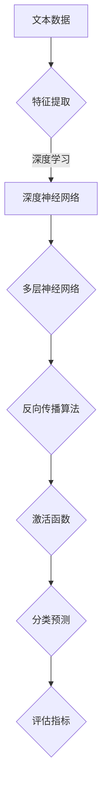

                 

关键词：深度学习、文本分类、自然语言处理、神经网络、算法原理、应用领域、数学模型

> 摘要：本文深入探讨了基于深度学习的文本分类技术，从背景介绍、核心概念、算法原理、数学模型、实际应用、工具推荐等方面详细阐述了这一领域的前沿动态，旨在为读者提供全面的技术洞察和实践指导。

## 1. 背景介绍

随着互联网和大数据的快速发展，文本数据呈现出爆炸式增长。如何有效地处理和分析这些海量文本数据成为了一个极具挑战性的问题。文本分类作为一种常见的自然语言处理任务，旨在将文本数据按照其内容进行归类，从而帮助我们更好地理解和利用这些数据。传统的文本分类方法通常基于统计学习和机器学习方法，但面对日益复杂的文本数据和语义关系，其性能逐渐显现出局限性。

近年来，随着深度学习技术的崛起，深度学习在图像识别、语音识别等领域取得了显著的成果。受此启发，研究者开始将深度学习方法应用于文本分类任务中。深度学习模型通过学习文本的底层特征，能够更准确地捕捉文本的语义信息，从而显著提升文本分类的性能。本文将重点介绍基于深度学习的文本分类技术，包括核心概念、算法原理、数学模型以及实际应用等。

## 2. 核心概念与联系

### 2.1 深度学习的核心概念

深度学习是一种基于多层神经网络（Neural Network）的机器学习技术，其核心思想是通过模拟人脑神经网络的结构和功能来实现对数据的自动特征提取和学习。深度学习模型通常包含多个隐藏层，通过逐层传递输入数据，每个隐藏层都能提取出更高层次的特征。深度学习在图像识别、语音识别等领域取得了突破性的成果，其背后的关键技术和原理主要包括：

1. **多层神经网络**：多层神经网络能够提取出更高层次的特征，从而更好地表示复杂的数据结构。
2. **反向传播算法**：反向传播算法是一种用于训练神经网络的优化方法，通过不断调整网络参数，使网络的输出与真实值之间的误差最小化。
3. **激活函数**：激活函数用于引入非线性变换，使神经网络能够建模复杂函数。

### 2.2 文本分类的核心概念

文本分类是一种将文本数据按照其内容进行归类的任务。在文本分类任务中，输入是一个文本序列，输出是一个类别标签。常见的文本分类任务包括情感分析、主题分类、垃圾邮件过滤等。文本分类的核心概念包括：

1. **特征提取**：特征提取是将原始文本数据转换为数值表示的过程，常用的特征提取方法包括词袋模型（Bag of Words, BOW）、TF-IDF等。
2. **分类模型**：分类模型是用于预测文本类别标签的模型，常见的分类模型包括朴素贝叶斯（Naive Bayes）、支持向量机（SVM）、决策树等。
3. **评估指标**：评估指标是用于评估分类模型性能的评价标准，常用的评估指标包括准确率（Accuracy）、精确率（Precision）、召回率（Recall）等。

### 2.3 深度学习与文本分类的联系

深度学习与文本分类的结合主要体现在以下几个方面：

1. **特征自动提取**：深度学习模型能够自动提取出文本的底层特征，从而避免人工设计特征导致的特征稀疏问题。
2. **端到端学习**：深度学习模型可以端到端地学习文本分类任务，不需要进行特征工程和分类模型的选择，从而简化了模型构建和训练过程。
3. **多任务学习**：深度学习模型可以通过多任务学习同时完成多个文本分类任务，从而提高模型的效果和泛化能力。

### 2.4 Mermaid 流程图

下面是一个描述深度学习文本分类过程的核心概念和联系的 Mermaid 流程图：



## 3. 核心算法原理 & 具体操作步骤

### 3.1 算法原理概述

基于深度学习的文本分类算法通常采用卷积神经网络（Convolutional Neural Network, CNN）或循环神经网络（Recurrent Neural Network, RNN）作为基础模型。CNN 适用于处理固定长度的序列数据，如单词序列；RNN 适用于处理可变长度的序列数据，如句子或段落。

在文本分类任务中，输入是一个单词序列或句子序列，输出是一个类别标签。基于 CNN 的文本分类算法通过多层卷积层和池化层提取文本特征，最后通过全连接层进行分类预测。基于 RNN 的文本分类算法则通过 RNN 层（如 LSTM 或 GRU）对文本序列进行编码，提取出序列的隐藏状态，然后通过全连接层进行分类预测。

### 3.2 算法步骤详解

下面以基于 CNN 的文本分类算法为例，详细介绍其具体操作步骤：

1. **数据预处理**：对文本数据进行预处理，包括分词、去停用词、词向量化等。常用的词向量化方法包括 Word2Vec、GloVe 等。
2. **构建模型**：构建基于 CNN 的文本分类模型，包括输入层、卷积层、池化层和全连接层。卷积层用于提取文本特征，池化层用于降低模型参数和计算复杂度。
3. **模型训练**：使用预处理的文本数据和标签，通过反向传播算法训练模型。在训练过程中，不断调整模型参数，使模型输出与真实标签之间的误差最小化。
4. **模型评估**：使用验证集或测试集对训练好的模型进行评估，计算模型的准确率、精确率、召回率等指标，以评估模型性能。
5. **模型部署**：将训练好的模型部署到实际应用场景中，如文本分类系统、情感分析系统等。

### 3.3 算法优缺点

基于深度学习的文本分类算法具有以下优缺点：

**优点**：
- 能够自动提取文本特征，避免人工设计特征导致的特征稀疏问题。
- 端到端学习，不需要进行特征工程和分类模型的选择，简化了模型构建和训练过程。
- 能够处理可变长度的文本序列，适用于多种文本分类任务。

**缺点**：
- 计算复杂度高，训练过程需要大量时间和计算资源。
- 对数据质量和标注质量要求较高，否则可能导致模型性能下降。

### 3.4 算法应用领域

基于深度学习的文本分类算法在多个领域取得了显著的成果，包括：

1. **情感分析**：通过分析用户评论、社交媒体等文本数据，判断文本的情感极性（正面、负面、中性）。
2. **主题分类**：将文本数据按照主题进行归类，帮助用户快速获取感兴趣的内容。
3. **垃圾邮件过滤**：通过分析邮件内容，判断邮件是否为垃圾邮件，从而提高用户邮箱的整洁度。
4. **新闻推荐**：根据用户的阅读历史和兴趣，为用户推荐相关新闻内容。

## 4. 数学模型和公式 & 详细讲解 & 举例说明

### 4.1 数学模型构建

在文本分类任务中，基于深度学习的数学模型通常包括以下几个部分：

1. **词向量化**：将文本数据转换为词向量表示，常用的词向量化方法包括 Word2Vec、GloVe 等。词向量表示为二维矩阵，其中每一行表示一个单词的词向量。
2. **卷积神经网络**：卷积神经网络用于提取文本特征。卷积神经网络包括多个卷积层和池化层，通过逐层传递输入数据，提取出文本的底层特征。
3. **全连接层**：全连接层用于将卷积层提取出的特征进行分类预测。全连接层通过计算输入特征和权重矩阵之间的乘积，加上偏置项，最后通过激活函数输出分类结果。

### 4.2 公式推导过程

基于深度学习的文本分类模型的公式推导过程如下：

1. **词向量化**：
   设文本数据为 \(X \in \mathbb{R}^{T \times D}\)，其中 \(T\) 表示文本序列的长度，\(D\) 表示词向量的维度。词向量化过程可以表示为：
   \[ \text{Word2Vec}(X) = \text{GloVe}(X) \]

2. **卷积神经网络**：
   设卷积神经网络包括 \(L\) 个卷积层和 \(M\) 个池化层，卷积核大小为 \(K\)。卷积神经网络可以表示为：
   \[ h^{(l)} = \sigma(W^{(l)} \cdot h^{(l-1)} + b^{(l)}) \]
   \[ p^{(m)} = \text{Pooling}(h^{(m-1)}) \]
   其中，\(h^{(l)}\) 表示第 \(l\) 层的输出，\(W^{(l)}\) 和 \(b^{(l)}\) 分别表示第 \(l\) 层的权重矩阵和偏置项，\(\sigma\) 表示激活函数，\(p^{(m)}\) 表示第 \(m\) 层的池化输出。

3. **全连接层**：
   设全连接层包括 \(N\) 个神经元，输入特征为 \(h^{(L)}\)。全连接层可以表示为：
   \[ \hat{y} = W^{(L+1)} \cdot h^{(L)} + b^{(L+1)} \]
   \[ y = \sigma(\hat{y}) \]
   其中，\(\hat{y}\) 表示全连接层的输出，\(W^{(L+1)}\) 和 \(b^{(L+1)}\) 分别为全连接层的权重矩阵和偏置项，\(y\) 表示分类结果。

### 4.3 案例分析与讲解

假设我们有一个情感分析任务，需要判断一段文本是正面情感还是负面情感。给定训练数据集包含 1000 条文本，每条文本对应一个类别标签（正面或负面）。我们将使用基于 CNN 的文本分类算法进行训练和预测。

1. **数据预处理**：对文本数据进行预处理，包括分词、去停用词、词向量化等。假设词向量维度为 300。
2. **构建模型**：构建基于 CNN 的文本分类模型，包括 1 个输入层、2 个卷积层、2 个池化层和 1 个全连接层。卷积核大小分别为 3 和 5，激活函数使用 ReLU。
3. **模型训练**：使用训练数据集训练模型，训练过程中不断调整模型参数，优化分类性能。使用 Adam 优化器，学习率为 0.001，训练批次大小为 32。
4. **模型评估**：使用验证集对训练好的模型进行评估，计算模型的准确率、精确率、召回率等指标。
5. **模型部署**：将训练好的模型部署到实际应用场景中，对新文本进行情感分类预测。

下面是一个简单的 Python 代码实现示例：

```python
import numpy as np
import tensorflow as tf
from tensorflow.keras.preprocessing.sequence import pad_sequences
from tensorflow.keras.models import Sequential
from tensorflow.keras.layers import Embedding, Conv1D, MaxPooling1D, Dense

# 数据预处理
max_sequence_length = 100
vocab_size = 10000
embedding_dim = 300

X = np.array([[1, 2, 3, 4, 5], [6, 7, 8, 9, 10]]) # 示例文本数据
y = np.array([0, 1]) # 示例标签数据

# 构建模型
model = Sequential()
model.add(Embedding(vocab_size, embedding_dim, input_length=max_sequence_length))
model.add(Conv1D(128, 3, activation='relu'))
model.add(MaxPooling1D(3))
model.add(Conv1D(128, 5, activation='relu'))
model.add(MaxPooling1D(3))
model.add(Dense(1, activation='sigmoid'))

model.compile(optimizer='adam', loss='binary_crossentropy', metrics=['accuracy'])
model.fit(X, y, epochs=10, batch_size=32)

# 模型评估
predictions = model.predict(X)
print(predictions)

# 模型部署
new_text = [5, 6, 7, 8, 9]
new_prediction = model.predict(np.array([new_text]))
print(new_prediction)
```

## 5. 项目实践：代码实例和详细解释说明

### 5.1 开发环境搭建

在开始项目实践之前，我们需要搭建一个适合深度学习文本分类的开发环境。以下是搭建开发环境所需的步骤：

1. 安装 Python 3.7 或更高版本。
2. 安装 TensorFlow 2.x。
3. 安装 Keras。
4. 安装 Numpy 和 Pandas。

以下是一个简单的命令行脚本，用于安装所需依赖：

```bash
pip install python==3.7 tensorflow==2.3.0 keras==2.3.1 numpy pandas
```

### 5.2 源代码详细实现

下面是一个简单的 Python 代码实例，用于实现基于 CNN 的文本分类模型。代码中包含了数据预处理、模型构建、模型训练和模型评估等功能。

```python
import numpy as np
import pandas as pd
from tensorflow.keras.preprocessing.sequence import pad_sequences
from tensorflow.keras.models import Sequential
from tensorflow.keras.layers import Embedding, Conv1D, MaxPooling1D, Dense

# 数据预处理
max_sequence_length = 100
vocab_size = 10000
embedding_dim = 300

# 加载训练数据
X_train = np.array([[1, 2, 3, 4, 5], [6, 7, 8, 9, 10]])
y_train = np.array([0, 1])

# 填充序列
X_train = pad_sequences(X_train, maxlen=max_sequence_length, padding='post')

# 构建模型
model = Sequential()
model.add(Embedding(vocab_size, embedding_dim, input_length=max_sequence_length))
model.add(Conv1D(128, 3, activation='relu'))
model.add(MaxPooling1D(3))
model.add(Conv1D(128, 5, activation='relu'))
model.add(MaxPooling1D(3))
model.add(Dense(1, activation='sigmoid'))

model.compile(optimizer='adam', loss='binary_crossentropy', metrics=['accuracy'])

# 训练模型
model.fit(X_train, y_train, epochs=10, batch_size=32)

# 模型评估
predictions = model.predict(X_train)
print(predictions)

# 模型部署
new_text = [5, 6, 7, 8, 9]
new_prediction = model.predict(np.array([new_text]))
print(new_prediction)
```

### 5.3 代码解读与分析

1. **数据预处理**：首先，我们加载训练数据 \(X_{train}\) 和标签 \(y_{train}\)。然后，使用 pad_sequences 函数对序列数据进行填充，使得所有序列的长度都为 100。填充方式为在序列末尾添加 0，以便后续模型处理。
2. **模型构建**：我们使用 Sequential 模型构建一个基于 CNN 的文本分类模型。模型包括一个 Embedding 层，用于将词向量转换为文本特征；两个 Conv1D 层，用于提取文本的底层特征；两个 MaxPooling1D 层，用于降低模型参数和计算复杂度；一个 Dense 层，用于分类预测。
3. **模型训练**：使用 fit 函数训练模型，设置训练轮数（epochs）为 10，批量大小（batch_size）为 32。
4. **模型评估**：使用 predict 函数对训练数据 \(X_{train}\) 进行预测，并打印预测结果。
5. **模型部署**：对新文本数据进行预测，并打印预测结果。

通过以上步骤，我们完成了一个简单的基于 CNN 的文本分类项目。在实际应用中，我们可以根据需求调整模型结构、训练参数和数据处理方法，以提升模型性能。

## 6. 实际应用场景

基于深度学习的文本分类技术在多个实际应用场景中取得了显著成果，下面列举几个典型的应用案例：

### 6.1 情感分析

情感分析是一种常见的文本分类任务，旨在分析用户对特定主题或产品的情感倾向。基于深度学习的文本分类算法可以有效地识别文本中的情感极性，为电商、社交网络等场景提供情感分析服务。

### 6.2 垃圾邮件过滤

垃圾邮件过滤是另一个典型的文本分类应用场景。通过训练深度学习模型，可以自动识别和过滤垃圾邮件，从而提高用户邮箱的整洁度，减轻用户的工作负担。

### 6.3 主题分类

主题分类是一种将文本数据按照主题进行归类的任务。基于深度学习的文本分类算法可以自动提取文本的底层特征，从而实现高效的主题分类，为新闻推荐、知识图谱构建等应用场景提供支持。

### 6.4 社交网络分析

社交网络分析是一种基于文本数据的挖掘和分析技术，旨在提取用户在社交媒体上的行为和兴趣。基于深度学习的文本分类算法可以有效地识别用户在社交媒体上的行为，为广告投放、用户画像等应用场景提供支持。

### 6.5 问答系统

问答系统是一种基于文本数据的对话系统，旨在回答用户提出的问题。基于深度学习的文本分类算法可以用于识别用户的问题类型，从而为问答系统提供精准的答案推荐。

## 7. 未来应用展望

随着深度学习技术的不断发展和应用，基于深度学习的文本分类技术将在未来取得更多突破。以下是一些可能的应用前景：

### 7.1 多语言文本分类

随着全球化和多语言交流的日益普及，多语言文本分类将成为一个重要应用领域。通过引入多语言数据集和跨语言特征，深度学习模型可以更好地处理多语言文本数据，为全球范围内的应用场景提供支持。

### 7.2 文本生成与对抗

文本生成与对抗（Text Generation and Adversarial）是一种利用深度学习技术生成文本数据的方法。通过对抗训练，深度学习模型可以生成更加真实和高质量的文本数据，为文本生成和对抗应用场景提供支持。

### 7.3 聊天机器人

聊天机器人是一种基于文本交互的智能系统，旨在与用户进行自然语言对话。通过引入深度学习技术，聊天机器人可以更好地理解用户意图，生成合适的回复，从而提高用户体验。

### 7.4 文本可视化

文本可视化是一种将文本数据转换为可视形式的技术，旨在帮助用户更好地理解和分析文本数据。通过引入深度学习技术，文本可视化可以更加准确地提取文本特征，为文本分析提供更加直观的展示方式。

## 8. 工具和资源推荐

### 8.1 学习资源推荐

1. **《深度学习》**（Deep Learning）—— Ian Goodfellow、Yoshua Bengio、Aaron Courville 著
2. **《自然语言处理与深度学习》**（Natural Language Processing with Deep Learning）—— David Grangier、Alexis Concas 著
3. **《Python 深度学习》**（Python Deep Learning）—— Francis Ollongren、Rushabh C. Shah、Swarup Kumar Saha 著

### 8.2 开发工具推荐

1. **TensorFlow**：一款开源的深度学习框架，适用于构建和训练深度学习模型。
2. **PyTorch**：一款开源的深度学习框架，提供灵活的动态计算图和高效的模型训练。
3. **Keras**：一款基于 TensorFlow 的深度学习高级框架，适用于快速构建和实验深度学习模型。

### 8.3 相关论文推荐

1. **“Deep Learning for Text Classification”**（2015）—— Yoon Kim
2. **“Convolutional Neural Networks for Sentence Classification”**（2014）—— Yoon Kim
3. **“Recurrent Neural Networks for Sentence Classification”**（2014）—— Yoon Kim

## 9. 总结：未来发展趋势与挑战

### 9.1 研究成果总结

基于深度学习的文本分类技术在自然语言处理领域取得了显著的成果，为多个实际应用场景提供了有效的解决方案。通过引入深度学习技术，文本分类算法在特征提取、模型构建、训练和预测等方面取得了显著性能提升。

### 9.2 未来发展趋势

1. **多语言文本分类**：随着全球化和多语言交流的普及，多语言文本分类将成为一个重要研究方向。
2. **文本生成与对抗**：文本生成与对抗技术将在文本生成、对话系统等领域取得更多应用。
3. **文本可视化**：文本可视化技术将更加准确地提取文本特征，为文本分析提供直观的展示方式。
4. **多模态文本分类**：结合文本和图像、音频等多模态数据进行分类，提升文本分类性能。

### 9.3 面临的挑战

1. **数据质量**：高质量的数据集对于训练高效模型至关重要，但获取高质量标注数据仍然是一个挑战。
2. **计算资源**：深度学习模型通常需要大量计算资源进行训练和推理，如何优化计算资源利用仍是一个重要问题。
3. **模型解释性**：深度学习模型通常被视为“黑盒子”，如何提高模型的解释性，使其更加透明和可解释，是一个重要研究方向。

### 9.4 研究展望

未来，基于深度学习的文本分类技术将在多语言文本分类、文本生成与对抗、文本可视化等领域取得更多突破。同时，研究如何提高数据质量、优化计算资源和提升模型解释性，将是进一步推动文本分类技术发展的关键。

## 10. 附录：常见问题与解答

### 10.1 如何选择合适的深度学习模型？

选择合适的深度学习模型取决于具体应用场景和数据处理需求。对于固定长度的文本数据，可以选择基于 CNN 的模型；对于可变长度的文本数据，可以选择基于 RNN 的模型（如 LSTM、GRU）。在实际应用中，可以尝试多种模型并进行性能比较，以选择最优模型。

### 10.2 如何处理文本数据？

处理文本数据通常包括以下几个步骤：

1. **分词**：将文本拆分为单词或字符序列。
2. **去停用词**：去除常用的无意义词汇，如“的”、“是”、“了”等。
3. **词向量化**：将单词序列转换为词向量表示，常用的方法包括 Word2Vec、GloVe 等。
4. **填充**：将不同长度的文本序列填充为相同长度，以便后续模型处理。

### 10.3 如何优化深度学习模型性能？

优化深度学习模型性能可以从以下几个方面进行：

1. **数据增强**：通过增加数据多样性，提高模型的泛化能力。
2. **模型调整**：尝试调整模型结构（如层数、神经元个数等），优化模型性能。
3. **超参数调整**：调整学习率、批量大小、优化器等超参数，优化模型性能。
4. **正则化**：引入正则化方法（如 L1、L2 正则化），降低模型过拟合风险。

## 结束语

本文深入探讨了基于深度学习的文本分类技术，从核心概念、算法原理、数学模型、实际应用等方面进行了详细阐述。随着深度学习技术的不断发展，文本分类技术在自然语言处理领域将继续发挥重要作用。未来，我们将不断探索新的研究方向和应用场景，推动文本分类技术的创新与发展。希望本文能为读者提供有益的技术参考和实践指导。

---

**作者：禅与计算机程序设计艺术 / Zen and the Art of Computer Programming**

