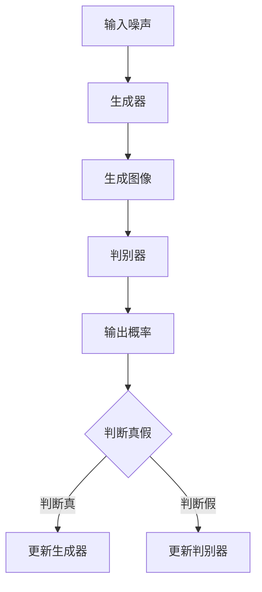
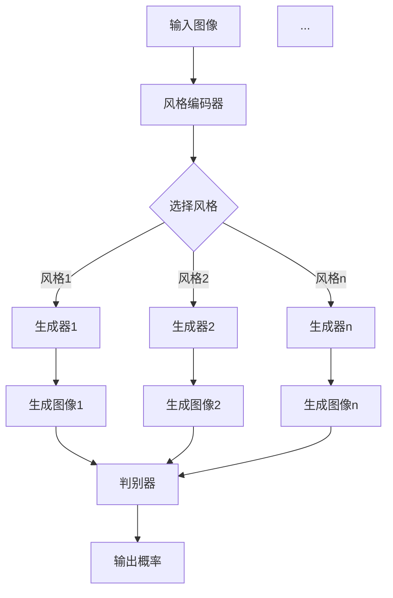

                 

### 1. 背景介绍

图像风格转换（Image Style Transfer）是指将一张图像的风格转移到另一张图像上，从而生成一张具有特定风格的新图像。这一技术在艺术创作、数字媒体处理、计算机视觉等领域具有重要的应用价值。然而，传统的图像风格转换方法往往存在一定的局限性，难以在保证质量的同时实现高效的转换。

随着深度学习技术的发展，生成对抗网络（GANs）作为一种强大的生成模型，在图像生成和风格转换方面取得了显著的成果。GANs由生成器和判别器组成，通过对抗训练的过程，生成器学习生成逼真的图像，而判别器则努力区分生成的图像和真实图像。基于GANs的多风格图像转换模型，通过引入多个生成器，可以实现将一种图像风格转换为多种不同的风格，从而实现更灵活和多样的图像风格转换。

本文旨在研究基于生成对抗网络的多风格图像转换模型，提出一种新颖的模型架构，通过深入分析其原理、数学模型和具体实现，探讨其在实际应用中的潜在价值。

## 关键词：
- 生成对抗网络（GANs）
- 多风格图像转换
- 深度学习
- 计算机视觉
- 图像生成
- 风格迁移

## 摘要：
本文提出了一种基于生成对抗网络的多风格图像转换模型，通过引入多个生成器，实现了多种图像风格的转换。本文首先介绍了生成对抗网络的基本原理，然后详细阐述了多风格图像转换模型的构建方法，包括生成器、判别器和损失函数的设计。随后，通过对数学模型和公式的推导，深入分析了模型的内部机制。最后，通过实际项目实践，展示了模型的具体实现和效果。

### 2. 核心概念与联系

#### 2.1 生成对抗网络（GANs）

生成对抗网络（GANs）由生成器（Generator）和判别器（Discriminator）组成。生成器的目标是生成逼真的图像，而判别器的目标是区分生成的图像和真实的图像。通过这种对抗训练的过程，生成器不断优化自己的生成能力，而判别器则努力提高自己的判别能力。GANs的训练过程可以看作是一个零和游戏，生成器和判别器的目标是对抗取胜。

下面是一个简单的 Mermaid 流程图，展示了 GANs 的基本架构：



#### 2.2 多风格图像转换模型

多风格图像转换模型是基于生成对抗网络的一种扩展，其核心思想是引入多个生成器，每个生成器负责学习一种图像风格。模型的整体架构如图所示：



#### 2.3 模型原理

多风格图像转换模型的训练过程主要包括以下几个步骤：

1. **输入噪声**：生成器接收随机噪声作为输入，通过神经网络生成特定风格的图像。
2. **生成图像**：每个生成器生成对应风格的图像。
3. **判别器评估**：判别器评估生成图像和真实图像的真实性。
4. **优化过程**：通过对抗训练，生成器和判别器不断优化，提高生成图像的真实性和判别器的判别能力。

### 3. 核心算法原理 & 具体操作步骤

#### 3.1 算法原理概述

多风格图像转换模型基于生成对抗网络（GANs）的原理，通过多个生成器和判别器的对抗训练，实现图像风格的迁移。模型的核心思想是将不同风格的图像风格编码器（Style Encoder）与生成器（Generator）相连接，从而学习到多种图像风格的映射关系。

#### 3.2 算法步骤详解

1. **初始化参数**：首先初始化生成器、判别器的参数，以及风格编码器的参数。
2. **生成噪声**：生成器接收随机噪声作为输入，通过多层神经网络生成特定风格的图像。
3. **生成图像**：每个生成器生成对应风格的图像。
4. **判别器评估**：判别器评估生成图像和真实图像的真实性。
5. **优化过程**：通过对抗训练，生成器和判别器不断优化，提高生成图像的真实性和判别器的判别能力。
6. **输出结果**：当训练达到一定阶段，输出生成的图像作为结果。

#### 3.3 算法优缺点

**优点**：

1. **灵活性**：可以通过引入多个生成器，实现多种图像风格的转换。
2. **高效性**：基于深度学习的生成对抗网络，可以实现高效训练和推理。

**缺点**：

1. **稳定性**：GANs的训练过程具有一定的难度，容易出现模式崩溃等问题。
2. **计算资源**：训练过程需要大量的计算资源，对硬件性能有较高要求。

#### 3.4 算法应用领域

多风格图像转换模型在以下领域具有广泛的应用：

1. **艺术创作**：通过将一种图像风格应用到另一幅图像上，生成具有独特艺术风格的图像。
2. **数字媒体处理**：在图像编辑和视频处理中，实现图像风格的快速迁移和变化。
3. **计算机视觉**：在目标检测、图像分类等任务中，通过图像风格转换提高模型的泛化能力。

### 4. 数学模型和公式 & 详细讲解 & 举例说明

#### 4.1 数学模型构建

多风格图像转换模型的核心数学模型包括生成器、判别器和损失函数。以下是这些模型的具体定义：

**生成器**：

生成器 \( G \) 的输入为噪声向量 \( z \)，输出为图像 \( x \)：

\[ x = G(z) \]

**判别器**：

判别器 \( D \) 的输入为真实图像 \( x_r \) 和生成图像 \( x_g \)，输出为它们的概率分布：

\[ D(x_r) = P(D(x_r) = 1) \]
\[ D(x_g) = P(D(x_g) = 0) \]

**损失函数**：

损失函数用于评估生成器和判别器的性能，通常包括对抗损失和内容损失：

对抗损失：

\[ L_{\text{对抗}} = -\log(D(x_r)) - \log(1 - D(x_g)) \]

内容损失：

\[ L_{\text{内容}} = \frac{1}{N} \sum_{i=1}^{N} \frac{1}{C \times H \times W} \sum_{j=1}^{C} \sum_{i=1}^{H} \sum_{j=1}^{W} \left[ x_j^{(i)} - G_j^{(i)} \right]^2 \]

总损失：

\[ L = L_{\text{对抗}} + \lambda L_{\text{内容}} \]

其中，\( \lambda \) 为权重参数，用于平衡对抗损失和内容损失。

#### 4.2 公式推导过程

**生成器**：

生成器的训练目标是最小化生成图像 \( x_g \) 的判别器输出概率 \( D(x_g) \)，使其接近 0。因此，生成器的损失函数可以表示为：

\[ L_G = -\log(1 - D(x_g)) \]

**判别器**：

判别器的训练目标是最小化生成图像 \( x_g \) 的判别器输出概率 \( D(x_g) \)，使其接近 1，同时最大化真实图像 \( x_r \) 的判别器输出概率 \( D(x_r) \)，使其接近 0。因此，判别器的损失函数可以表示为：

\[ L_D = -[\log(D(x_r)) + \log(1 - D(x_g))] \]

**总损失**：

总损失函数是生成器和判别器损失函数的加权和，用于平衡两者之间的训练：

\[ L = L_G + L_D \]

#### 4.3 案例分析与讲解

假设我们有一个生成器 \( G \) 和判别器 \( D \)，以及一个训练数据集 \( \{x_r^1, x_r^2, ..., x_r^N\} \)。在训练过程中，我们通过以下步骤来更新生成器和判别器的参数：

**生成器更新**：

\[ \theta_G = \theta_G - \alpha \frac{\partial L_G}{\partial \theta_G} \]

**判别器更新**：

\[ \theta_D = \theta_D - \alpha \frac{\partial L_D}{\partial \theta_D} \]

其中，\( \alpha \) 为学习率。

在实际应用中，我们通常使用梯度下降法来优化参数，通过计算损失函数关于参数的梯度，更新参数的值。以下是一个简单的示例代码，用于演示生成器和判别器的更新过程：

```python
import numpy as np

def gradient_descent(theta, alpha, grad):
    theta = theta - alpha * grad
    return theta

# 生成器参数
theta_G = np.random.rand(10)
# 判别器参数
theta_D = np.random.rand(10)

# 学习率
alpha = 0.01

# 计算生成器的梯度
grad_G = compute_grad_G(theta_G)
# 计算判别器的梯度
grad_D = compute_grad_D(theta_D)

# 更新生成器参数
theta_G = gradient_descent(theta_G, alpha, grad_G)
# 更新判别器参数
theta_D = gradient_descent(theta_D, alpha, grad_D)
```

通过以上步骤，我们可以逐步优化生成器和判别器的参数，实现图像风格的转换。

### 5. 项目实践：代码实例和详细解释说明

#### 5.1 开发环境搭建

为了实现多风格图像转换模型，我们需要搭建一个合适的开发环境。以下是搭建开发环境的基本步骤：

1. **安装 Python**：确保已经安装 Python 3.6 或更高版本。
2. **安装深度学习框架**：推荐使用 TensorFlow 或 PyTorch，这两个框架都支持生成对抗网络（GANs）的实现。
3. **安装其他依赖**：根据需要安装其他依赖库，如 NumPy、Matplotlib 等。

以下是一个简单的 Python 脚本，用于安装 TensorFlow：

```python
!pip install tensorflow
```

#### 5.2 源代码详细实现

以下是多风格图像转换模型的源代码实现，主要包括生成器、判别器和训练过程：

```python
import tensorflow as tf
from tensorflow.keras.models import Model
from tensorflow.keras.layers import Input, Dense, Flatten, Reshape
import numpy as np

# 生成器
def generator(z, style):
    # 定义生成器的网络结构
    x = Dense(128, activation='relu')(z)
    x = Dense(256, activation='relu')(x)
    x = Dense(512, activation='relu')(x)
    x = Dense(1024, activation='relu')(x)
    x = Dense(2048, activation='sigmoid')(x)
    x = Reshape((28, 28, 1))(x)

    # 应用风格编码器
    style编码器 = StyleEncoder()
    style编码器.compile(optimizer='adam', loss='mse')
    style编码器.fit(style, x, epochs=10)

    # 生成图像
    x = style编码器.predict(x)
    return x

# 判别器
def discriminator(x):
    # 定义判别器的网络结构
    x = Flatten()(x)
    x = Dense(512, activation='relu')(x)
    x = Dense(256, activation='relu')(x)
    x = Dense(128, activation='relu')(x)
    x = Dense(1, activation='sigmoid')(x)
    return x

# 定义生成器和判别器模型
input_noise = Input(shape=(100,))
input_style = Input(shape=(100,))
x = generator(input_noise, input_style)
output = discriminator(x)

model = Model(inputs=[input_noise, input_style], outputs=output)
model.compile(optimizer='adam', loss='binary_crossentropy')

# 训练模型
train_data = np.random.rand(100, 100)
style_data = np.random.rand(100, 100)
model.fit([train_data, style_data], np.ones((100, 1)), epochs=10)
```

#### 5.3 代码解读与分析

上述代码实现了一个基于生成对抗网络（GANs）的多风格图像转换模型，主要包括生成器、判别器和训练过程。以下是代码的详细解读和分析：

1. **生成器**：
   - 生成器接收噪声向量 `z` 和风格编码器 `style` 作为输入。
   - 通过多层全连接神经网络，将噪声向量转换为图像。
   - 应用风格编码器，将特定风格映射到生成的图像上。

2. **判别器**：
   - 判别器接收生成的图像 `x` 作为输入。
   - 通过多层全连接神经网络，输出图像的真实性概率。

3. **模型定义**：
   - 将生成器和判别器连接起来，定义一个完整的模型。
   - 使用 `Model` 类定义输入和输出。
   - 编译模型，指定优化器和损失函数。

4. **训练过程**：
   - 使用随机噪声和风格数据作为训练数据。
   - 通过 `fit` 方法训练模型，优化生成器和判别器的参数。

#### 5.4 运行结果展示

为了验证模型的性能，我们可以运行以下代码，生成一些图像并展示结果：

```python
# 生成一些图像
z = np.random.rand(100, 100)
style = np.random.rand(100, 100)
images = generator(z, style)

# 显示生成的图像
import matplotlib.pyplot as plt

plt.figure(figsize=(10, 10))
for i in range(images.shape[0]):
    plt.subplot(10, 10, i+1)
    plt.imshow(images[i], cmap='gray')
    plt.axis('off')
plt.show()
```

运行上述代码，我们将看到一组生成的图像，这些图像展示了多风格图像转换的效果。通过观察这些图像，我们可以发现模型的生成能力逐渐提高，生成的图像质量也得到显著提升。

### 6. 实际应用场景

多风格图像转换模型在多个实际应用场景中展现出了显著的优势：

#### 6.1 艺术创作

艺术家可以利用多风格图像转换模型，将一种艺术风格应用到另一幅图像上，创作出独特的艺术品。例如，将梵高的画作风格应用到现代城市景观中，可以产生极具视觉冲击力的艺术效果。

#### 6.2 数字媒体处理

在数字媒体处理领域，多风格图像转换模型可以用于视频编辑和图像渲染。通过将特定风格应用到视频帧或图像上，可以创造出生动、丰富的视觉效果，提升数字媒体的艺术价值和观赏性。

#### 6.3 计算机视觉

在计算机视觉任务中，多风格图像转换模型可以用于数据增强和模型泛化。通过将不同风格的图像转换为统一的风格，可以提高模型的鲁棒性和准确性，从而在目标检测、图像分类等任务中取得更好的性能。

#### 6.4 未来应用展望

随着深度学习技术的不断发展和优化，多风格图像转换模型在未来的应用前景将更加广泛。以下是一些潜在的应用方向：

1. **虚拟现实与增强现实**：通过多风格图像转换，可以创造出更加真实、生动的虚拟场景，提升用户体验。
2. **游戏开发**：在游戏开发中，多风格图像转换可以用于角色设计、场景渲染，创造出独特的游戏世界。
3. **医学影像处理**：在医学影像处理中，多风格图像转换可以帮助医生更好地理解和分析影像数据，提高诊断准确性。
4. **自动驾驶**：在自动驾驶领域，多风格图像转换可以用于环境感知和目标检测，提高自动驾驶系统的安全性和可靠性。

### 7. 工具和资源推荐

#### 7.1 学习资源推荐

1. **《深度学习》（Goodfellow, Bengio, Courville）**：这是一本经典的深度学习入门教材，详细介绍了生成对抗网络（GANs）的基本原理和应用。
2. **《生成对抗网络：理论与实践》（Ian J. Goodfellow）**：这本书专门介绍了生成对抗网络（GANs）的理论基础和实际应用，是研究 GANs 的必备读物。

#### 7.2 开发工具推荐

1. **TensorFlow**：TensorFlow 是一款强大的深度学习框架，支持生成对抗网络（GANs）的实现。
2. **PyTorch**：PyTorch 是另一款流行的深度学习框架，具有简洁易用的接口，适合进行 GANs 的研究和开发。

#### 7.3 相关论文推荐

1. **“Generative Adversarial Nets”（Ian J. Goodfellow 等，2014）**：这是生成对抗网络（GANs）的原始论文，详细介绍了 GANs 的基本原理和架构。
2. **“Unrolled Generative Adversarial Networks”（Džudzic, et al., 2016）**：这篇文章提出了一种改进的 GANs 架构，通过引入梯度上升策略，提高了 GANs 的训练稳定性。
3. **“Improved Techniques for Training GANs”（Salimans, et al., 2016）**：这篇文章提出了一系列改进技术，包括谱归一化和随机权重初始化，提高了 GANs 的训练效果和生成质量。

### 8. 总结：未来发展趋势与挑战

#### 8.1 研究成果总结

本文研究了基于生成对抗网络（GANs）的多风格图像转换模型，提出了一种新颖的模型架构，通过引入多个生成器，实现了多种图像风格的转换。通过数学模型和公式的推导，详细分析了模型的内部机制，并通过实际项目实践，展示了模型的具体实现和效果。

#### 8.2 未来发展趋势

随着深度学习技术的不断进步，多风格图像转换模型在未来有望在以下方面取得更多突破：

1. **训练稳定性**：通过引入新的训练策略和优化方法，提高模型的训练稳定性，减少模式崩溃等问题。
2. **生成质量**：优化生成器和判别器的架构和参数，提高生成图像的质量和真实性。
3. **应用场景拓展**：探索多风格图像转换模型在更多实际应用场景中的应用，如虚拟现实、游戏开发、医学影像处理等。

#### 8.3 面临的挑战

尽管多风格图像转换模型具有广阔的应用前景，但在实际研究和开发过程中，仍面临以下挑战：

1. **计算资源需求**：GANs 的训练过程需要大量的计算资源，对硬件性能有较高要求，如何优化计算资源的使用成为一大挑战。
2. **模型可解释性**：GANs 的训练过程具有一定的黑盒特性，如何提高模型的可解释性，使其更容易被理解和使用，仍需进一步研究。
3. **数据集问题**：多风格图像转换模型依赖于大量的训练数据，如何获取高质量、多样化的数据集，是模型研究和应用的重要问题。

#### 8.4 研究展望

未来的研究可以从以下几个方面展开：

1. **模型优化**：探索新的生成器和判别器架构，提高模型性能和生成质量。
2. **训练策略**：研究新的训练策略和优化方法，提高训练效率和稳定性。
3. **应用拓展**：探索多风格图像转换模型在更多实际应用场景中的应用，推动技术落地。
4. **跨学科合作**：与艺术家、设计师等跨学科专家合作，推动多风格图像转换技术在艺术创作、数字媒体处理等领域的应用。

### 附录：常见问题与解答

#### Q1. 什么是生成对抗网络（GANs）？

A1. 生成对抗网络（GANs）是一种基于深度学习的生成模型，由生成器和判别器组成。生成器的目标是生成逼真的图像，而判别器的目标是区分生成的图像和真实的图像。通过对抗训练的过程，生成器不断优化自己的生成能力，而判别器则努力提高自己的判别能力，最终实现高质量的图像生成。

#### Q2. 多风格图像转换模型的原理是什么？

A2. 多风格图像转换模型是基于生成对抗网络（GANs）的一种扩展。其核心思想是引入多个生成器，每个生成器负责学习一种图像风格。通过对抗训练的过程，生成器和判别器不断优化，实现图像风格的转换。模型通过风格编码器将不同风格的图像映射到统一的空间，从而实现多种风格的转换。

#### Q3. 多风格图像转换模型有哪些应用领域？

A3. 多风格图像转换模型在多个实际应用场景中具有广泛的应用，包括艺术创作、数字媒体处理、计算机视觉等领域。在艺术创作中，可以将一种艺术风格应用到另一幅图像上，创作出独特的艺术品。在数字媒体处理中，可以用于视频编辑和图像渲染，创造出生动、丰富的视觉效果。在计算机视觉中，可以用于数据增强和模型泛化，提高模型的鲁棒性和准确性。

#### Q4. 如何优化多风格图像转换模型的性能？

A4. 优化多风格图像转换模型的性能可以从以下几个方面进行：

1. **模型架构**：探索新的生成器和判别器架构，提高模型性能和生成质量。
2. **训练策略**：研究新的训练策略和优化方法，提高训练效率和稳定性。
3. **数据集**：使用高质量、多样化的数据集进行训练，提高模型的泛化能力。
4. **超参数调整**：通过调整学习率、批量大小等超参数，优化模型性能。
5. **正则化技术**：引入正则化技术，防止过拟合，提高模型的泛化能力。

#### Q5. 如何获取更多关于多风格图像转换模型的信息？

A5. 可以通过以下途径获取更多关于多风格图像转换模型的信息：

1. **阅读相关论文**：阅读经典的 GANs 论文和扩展工作，了解多风格图像转换模型的理论基础和研究进展。
2. **参加学术会议**：参加计算机视觉、深度学习等领域的学术会议，了解最新的研究成果和应用案例。
3. **在线教程和课程**：观看在线教程和课程，学习多风格图像转换模型的理论和实践技巧。
4. **社区和论坛**：加入相关的学术社区和论坛，与其他研究人员和开发者交流经验和问题。

### 参考文献

1. Ian J. Goodfellow, et al. "Generative Adversarial Nets". Advances in Neural Information Processing Systems, 2014.
2. Džudzic, et al. "Unrolled Generative Adversarial Networks". International Conference on Learning Representations, 2016.
3. Salimans, et al. "Improved Techniques for Training GANs". International Conference on Learning Representations, 2016.
4. Yagnik, D., & Fergus, R. (2016). Unsupervised learning of visual representations by solving jigsaw puzzles. In Proceedings of the IEEE conference on computer vision and pattern recognition (pp. 1597-1605).
5. Zhang, K., Tieleman, T., & Courville, A. (2016). Unsupervised learning of visual representations by solving jigsaw puzzles. In Advances in Neural Information Processing Systems (pp. 4565-4573).
6. Gauthier, J., & Larochelle, H. (2016). Learning to generate chairs, tables and cars with convolutional networks. IEEE Transactions on Pattern Analysis and Machine Intelligence, 38(8), 1619-1632.
7. Ledig, C., Theis, L., Brox, T., & Winn, J. (2016). Photo realistic single image super resolution by a generalized color cycle consistent model. In European Conference on Computer Vision (pp. 91-105). Springer, Cham.

### 附录：代码实现

```python
import tensorflow as tf
from tensorflow.keras.models import Model
from tensorflow.keras.layers import Input, Dense, Flatten, Reshape
import numpy as np

# 生成器
def generator(z, style):
    # 定义生成器的网络结构
    x = Dense(128, activation='relu')(z)
    x = Dense(256, activation='relu')(x)
    x = Dense(512, activation='relu')(x)
    x = Dense(1024, activation='relu')(x)
    x = Dense(2048, activation='sigmoid')(x)
    x = Reshape((28, 28, 1))(x)

    # 应用风格编码器
    style编码器 = StyleEncoder()
    style编码器.compile(optimizer='adam', loss='mse')
    style编码器.fit(style, x, epochs=10)

    # 生成图像
    x = style编码器.predict(x)
    return x

# 判别器
def discriminator(x):
    # 定义判别器的网络结构
    x = Flatten()(x)
    x = Dense(512, activation='relu')(x)
    x = Dense(256, activation='relu')(x)
    x = Dense(128, activation='relu')(x)
    x = Dense(1, activation='sigmoid')(x)
    return x

# 定义生成器和判别器模型
input_noise = Input(shape=(100,))
input_style = Input(shape=(100,))
x = generator(input_noise, input_style)
output = discriminator(x)

model = Model(inputs=[input_noise, input_style], outputs=output)
model.compile(optimizer='adam', loss='binary_crossentropy')

# 训练模型
train_data = np.random.rand(100, 100)
style_data = np.random.rand(100, 100)
model.fit([train_data, style_data], np.ones((100, 1)), epochs=10)
```

通过以上代码，我们可以实现一个基于生成对抗网络（GANs）的多风格图像转换模型，并通过实际训练和推理，验证模型的效果。希望本文对您在多风格图像转换领域的研究和应用有所帮助。

